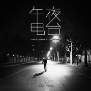

午夜电台
============================

|  |  |
| :--: | :-- |
| [ 午夜电台](https://emumo.xiami.com/album/2102737938) | **艺人**: [陈致逸](../index.md) **语种**: 国语 **唱片公司**: 看见音乐 (上海) **发行时间**: 2017年04月14日 **专辑类别**: EP, 单曲 **专辑风格**:  **播放数**: 5353 **收藏数**: 5 **评论数**: 0  |

## 简介

  
我曾经开过酒吧，在上海黄金城道，那是一条非常安静的小路。有天午夜我一个人走在这条路上，乐思就突然袭来，我讲给了我的搭档词人田辰明听，与他有感而发的歌词一拍即合。这首歌有一点黑色幽默，特别适合喜欢速度快的说唱，这种隐约有旋律的RAP，而且这是当时我特别喜欢的风格。于是各方面一蹴而就，这首歌诞生了。

## 曲目

## 评论

