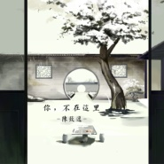

你，不在这里
============================

|  |  |
| :--: | :-- |
| [ 你，不在这里](https://emumo.xiami.com/album/2103512039) | **艺人**: [陈致逸](../index.md) **语种**: 国语 **唱片公司**: 独立发行 **发行时间**: 2018年02月01日 **专辑类别**: EP, 单曲 **专辑风格**:  **播放数**: 26 **收藏数**: 3 **评论数**: 0  |

## 简介

一首特别的歌，送给终将老去的他们~  
有人说过，离别其实才是生活自然的状态。  
可是走过回忆的角落， 总有一些尘封的细节会唤醒泪腺。  
就像无论我在这俗世间走多远，  
回家推开那扇门，  
我知道你一直坐在那里，  
宛如那年午后，阳光正好。

## 曲目

## 评论

