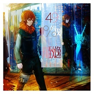

49%的我
============================

|  |  |
| :--: | :-- |
| [ 49%的我](https://emumo.xiami.com/album/2103614668) | **艺人**: [陈致逸](../index.md) **语种**: 国语 **唱片公司**: 独立发行 **发行时间**: 2018年03月17日 **专辑类别**: EP, 单曲 **专辑风格**:  **播放数**: 3 **收藏数**: 2 **评论数**: 0  |

## 简介

时代飞速发展，信息大量爆炸，然而压力也随之无孔不入地潜伏在人群当中，只需一个诱因便会将人拖入深渊。  
  
现代社会里抑郁、焦虑、分裂等症状屡见不鲜，人们都习惯于将不好的情绪独自放在心里，将自己伪装起来，以不同的人格面对各种情况。所以这首歌本意便是描绘此类人群内心的痛苦。  
  
同时也提出一个大胆的设想，随着未来AI技术的普及，是否有一天人类能够与智能融合，从而控制大脑波动，治疗精神疾病。  
  
可是不管是在梦境与现实的边缘，还是数据与意识的交界，一旦差错1%，迎来的将会是无尽的挣扎与迷失。

## 曲目

## 评论

|  |  |  |  |
| :-- | :-- | :-- | :-- |
