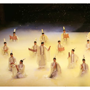

张渠
============================

|  |  |
| :--: | :-- |
| [ 张渠](https://i.xiami.com/zq) | **播放数**: 6410237 **粉丝数**: 4174 **评论数**: 130 **地区**: China 中国大陆 **风格**: 原声 Soundtrack, 游戏配乐 Video Game Music, 歌舞剧 Cabaret, 演出金曲 Show Tunes  |

## 档案

中国第七届Digimus音乐制作大赛金奖 
第四届丹尼奖提名最佳作曲奖 
中国音乐家协会会员 
中国歌剧舞剧院特邀首席作曲、音乐总监 
代表作： 
中国歌剧舞剧院文化部优秀剧目奖大型原创舞剧《孔子》，中国歌剧舞剧院大型原创舞剧《昭君出塞》，中国歌剧舞剧院大型原创舞剧《李白》，中国歌剧舞剧院原创舞剧《士风》，中国歌剧舞剧院原创舞剧《玄奘》，北京舞蹈学院青年舞团《井冈井冈》，洛阳歌舞剧院大型原创舞剧《关公》，吉林市歌舞团大型原创舞剧《梦回乌拉》，CCTV－10《感动中国》，中国歌剧舞剧院大型歌舞晚会《紫气祥云》、《五洲风情》、《天边的祝福》、《一路风情嘉年华》、《梦中的故乡》、《四季情韵》，电影《荒村客栈》，电视剧《我是传奇》、《待嫁十年》，北京卫视《最美和声》，腾讯《幻想世界》》、《穿越火线》。

## 专辑

| 名称 | 语种 | 唱片公司 | 发行时间 | 专辑类别 | 专辑风格 |
| :--: | :-- | :-- | :-- | :-- | :-- |
| [ 舞剧《昭君出塞》音乐中国歌剧舞剧舞剧院舞剧](./albums/2100353926.md) | 国语 | 独立发行 | 2016年06月10日 | EP, 单曲 | 中国民乐 Chinese Folk Music, 歌舞剧 Cabaret |
| [ 关公舞剧原声音乐](./albums/2100317170.md) | 国语 | 独立发行 | 2016年04月18日 | 原声带, 影视音乐 | 歌舞剧 Cabaret, 管弦乐 Orchestral |
| [ 书简／逍遥中国歌剧舞剧院《孔子》选段](./albums/2100273708.md) | 国语 | 独立发行 | 2016年02月05日 | 录音室专辑 | 现代古典 Modern Classical, 演出金曲 Show Tunes, 歌舞剧 Cabaret |
| [ 玉人中国歌剧舞剧院《孔子》选段](./albums/729520005.md) | 国语 | 独立发行 | 2015年04月01日 | EP, 单曲 | 歌舞剧 Cabaret, 古风 GuFeng Music |
| [ 足迹中国歌剧舞剧院舞蹈音乐](./albums/1706216139.md) | 国语 | 独立发行 | 2014年07月24日 | 录音室专辑 | 民族融合新世纪 Ethnic Fusion New Age, 歌舞剧 Cabaret, 新世纪音乐 New Age |
| [ 采薇中国歌剧舞剧院舞剧《孔子》选段](./albums/221912821.md) | 国语 | 独立发行 | 2013年08月16日 | EP, 单曲 | 演出金曲 Show Tunes, 歌舞剧 Cabaret |
| [ 幻想世界腾讯游戏背景音乐](./albums/1822003856.md) | 国语 | 独立发行 | 2009年01月08日 | 原声带, 影视音乐 | 民族融合新世纪 Ethnic Fusion New Age, 游戏配乐 Video Game Music, 新世纪音乐 New Age |

## 评论

|  |  |  |  |
| :-- | :-- | :-- | :-- |
|  [虾米用户](https://emumo.xiami.com/u/347111151) 爱日漫，爱国漫 爱吃爱玩... 2020-01-11 16:42 赞(0) 踩(0) | 
有没有清平调完整版啊？
 |
|  [虾米用户](https://emumo.xiami.com/u/2095214) 喇嘛钦！ 2019-11-20 08:18 赞(2) 踩(0) | 
第一次因为音乐而想去看舞台剧。音乐太美了！
 |
|  [虾米用户](https://emumo.xiami.com/u/334316278) 我还没想好要写什么... 2019-06-22 07:10 赞(3) 踩(0) | 
张老师的拥趸真不少！
 |
|  [虾米用户](https://emumo.xiami.com/u/193235171) 饭能养身  歌能养心 2019-06-07 15:34 赞(2) 踩(0) | 
请张老师一定要加油，坚持艺术的美，不要被高房价打败（
 |
|  [虾米用户](https://emumo.xiami.com/u/193235171) 饭能养身  歌能养心 2019-06-07 15:33 赞(1) 踩(0) | 
加油 中国的大师越来越少了
 |
|  [虾米用户](https://emumo.xiami.com/u/409440346)  2019-05-04 15:27 赞(3) 踩(0) | 
采薇太好听了！应该上无损音质。无损音质！
 |
|  [虾米用户](https://emumo.xiami.com/u/19918288)  2019-03-04 12:00 赞(2) 踩(0) | 
昨天刚在国家大剧院看了舞剧孔子，终于看到张渠老师本人了，孔子这几首曲子都无数次单曲循环了
 |
|  [虾米用户](https://emumo.xiami.com/u/409450747)  2019-02-27 01:15 赞(1) 踩(0) | 
张渠，我是武汉的张琪哥哥，还记得吗？前几年去宜昌听你爸妈说你在北京做的不错，没想到在这里看到你 
 |
|  [虾米用户](https://emumo.xiami.com/u/418750898)  2019-02-12 19:02 赞(1) 踩(0) | 
张老师，如果您可以跟李玉刚或霍尊和作的话是歌唱界最好的配合
 |
|  [虾米用户](https://emumo.xiami.com/u/7151428) 暖暖的～～ 2018-12-10 07:25 赞(0) 踩(0) | 
 
 |
|  [虾米用户](https://emumo.xiami.com/u/378095879) 君问去路何处有提剑笑饮江... 2018-10-30 22:06 赞(0) 踩(0) | 
张渠大大，哈哈哈，很高兴认识你！
 |
|  [虾米用户](https://emumo.xiami.com/u/564335) 每一个缺少音乐相伴的日子... 2018-10-24 20:54 赞(3) 踩(0) | 
古韵今声两不厌、绕梁三日若飞燕!
 |
|  [虾米用户](https://emumo.xiami.com/u/277054730)  2018-10-07 09:52 赞(2) 踩(0) | 
大爱，似乎千年回眸的一瞬间，灵魂与时空起舞，心灵与意境互存，虽然没见过你，但已经爱上你了。
 |
|  [虾米用户](https://emumo.xiami.com/u/66823378)  2018-10-06 14:34 赞(2) 踩(0) | 
好喜欢您的作品！爱上中国古典音乐
 |
|  [虾米用户](https://emumo.xiami.com/u/362190966) 爱吾所爱 2018-08-19 21:19 赞(1) 踩(0) | 
张渠老师你好，由于热爱舞蹈的缘故同时喜爱你的音乐。虽然虾米上你的作品不全但是有幸的是我在西安9月9日《首届西安国际舞蹈节》现场领略你的作品《孔子》的音乐魅力和舞蹈的双重震撼！期待！！
 |
|  [虾米用户](https://emumo.xiami.com/u/52807251)  2018-07-28 23:01 赞(3) 踩(0) | 
原来和好多乐迷朋友一样，都是从舞剧追来的。太迷人了！
 |
|  [虾米用户](https://emumo.xiami.com/u/10787850) 一 個 無 2018-07-22 00:58 赞(8) 踩(0) | 
張老師求出孔子原聲碟！！！我們買買買！！！
 |
|  [虾米用户](https://emumo.xiami.com/u/284745239)  2018-06-28 16:00 赞(3) 踩(0) | 
大才子，欣赏欣赏！
 |
|  [虾米用户](https://emumo.xiami.com/u/353268048)  2018-06-21 14:01 赞(3) 踩(0) | 
很好听(*^o^*)
 |
|  [虾米用户](https://emumo.xiami.com/u/353268048)  2018-06-21 13:58 赞(4) 踩(0) | 
张渠老师，如果可以跟李玉刚老师和作的话是歌唱界最美好的配配合ლ(⌒▽⌒ლ)
 |
|  [虾米用户](https://emumo.xiami.com/u/353268048)  2018-06-21 13:45 赞(2) 踩(0) | 
张渠老师您好您的作品听着很舒服。
 |
|  [虾米用户](https://emumo.xiami.com/u/4399004) 沉淀。。。 2018-06-10 19:54 赞(3) 踩(0) | 
采薇&amp;mdash;&amp;mdash;音乐流畅、沁人心脾，舞蹈编排美极，耐看耐听回味不断中。。。
 |
|  [虾米用户](https://emumo.xiami.com/u/294151783)  2018-05-28 21:20 赞(0) 踩(0) | 
不知道张渠老师能否看见，我毕业时用了您的两首音乐作背景音乐，我做的蒙古族服装设计，您出塞和牡丹颂的音乐十分契合。因为没有办法联系到您，只能在评论区给您留言了   
 |
|  [虾米用户](https://emumo.xiami.com/u/12221090) 逍遥于天地而心意自得 2018-04-11 18:34 赞(0) 踩(0) | 
赞
 |
|  [虾米用户](https://emumo.xiami.com/u/340454420)  2018-04-10 01:22 赞(0) 踩(0) | 
很美啊~单曲循环
 |
|  [虾米用户](https://emumo.xiami.com/u/288405243)  2018-03-11 05:45 赞(0) 踩(0) | 
昨晚上刚看完现场版《李白》，真的是太赞了！里面唱的两首李白的诗超好听，不知道是不是张渠大大制作的啊？
 |
| ⇒ |  [虾米用户](https://emumo.xiami.com/u/125560938)  2018-03-15 17:02 赞(0) 踩(0) | 
是的，都是张渠大大的作品，在网易有《李白》的专辑。
 |
|  [虾米用户](https://emumo.xiami.com/u/45668630)   2018-02-04 12:00 赞(3) 踩(0) | 
第一次从舞剧追一个音乐人
 |
|  [虾米用户](https://emumo.xiami.com/u/971091) 我还没想好要写什么... 2018-01-07 18:18 赞(0) 踩(0) | 
加油↖(^&amp;omega;^)↗
 |
|  [虾米用户](https://emumo.xiami.com/u/11817908)  2017-12-18 23:42 赞(3) 踩(0) | 
舞剧《孔子》的音乐可以出原声碟吗？
 |
|  [虾米用户](https://emumo.xiami.com/u/73391606)  2017-12-02 02:16 赞(3) 踩(0) | 
老师能给个联系方式吗？微信号也可以 
 |
|  [虾米用户](https://emumo.xiami.com/u/33123064) 喜欢就好 2017-11-21 15:57 赞(0) 踩(0) | 
好喜欢张老师的作品， 
 |
|  [虾米用户](https://emumo.xiami.com/u/333198502)  2017-11-17 15:18 赞(0) 踩(0) | 
好美啊，加油
 |
| ⇒ |  [虾米用户](https://emumo.xiami.com/u/322235515) 在音乐里澎湃，在玩笑里开... 2019-02-16 23:09 赞(0) 踩(0) | 
人家都是大家了，我们加油才行，否则根本理解不了。
 |
|  [虾米用户](https://emumo.xiami.com/u/6472878) 忆梅下西洲，折梅寄江北…... 2017-11-03 09:34 赞(0) 踩(0) | 
很美很美的音乐，很有感染力
 |
|  [虾米用户](https://emumo.xiami.com/u/30726978) 一点寒中绿，微蜷土下根。... 2017-10-27 23:50 赞(2) 踩(0) | 
看《孔子》里有段配乐惊艳绝伦，可惜只找到《玉人》《采薇》。。
 |
|  [虾米用户](https://emumo.xiami.com/u/48303326)  2017-10-21 13:46 赞(2) 踩(0) | 
月初去看了现场的《李白》，真是太美了！第一幕的时候，李白站在一队战甲兵将前面，静静地举起手，我就已经感动到热泪盈眶。是你的音乐太美太感人。希望尽快把《李白》放上来，独乐乐不如众乐乐。
 |
|  [虾米用户](https://emumo.xiami.com/u/280410908) 我还没想好要写什么... 2017-08-31 10:25 赞(0) 踩(0) | 
喜欢
 |
|  [虾米用户](https://emumo.xiami.com/u/273343438) 空有空无行空空 2017-08-27 22:37 赞(1) 踩(0) | 
中国之才子，汝当之
 |
|  [虾米用户](https://emumo.xiami.com/u/2882308)  2017-07-26 17:45 赞(0) 踩(0) | 
特别喜欢他的音乐，美的享受！
 |
|  [虾米用户](https://emumo.xiami.com/u/265986864)  2017-07-18 09:01 赞(2) 踩(0) | 
张老师求出关于敦煌的音乐
 |
|  [虾米用户](https://emumo.xiami.com/u/277247775) 城里的月光把梦照亮 2017-07-07 00:06 赞(0) 踩(0) | 
每晚听着你的编曲入睡，成了这几年的一个必须的习惯，会继续关注继续保持的。一直很崇拜你的才华，心中的男神。
 |
|  [虾米用户](https://emumo.xiami.com/u/1338903) 道院迎仙客，书堂隐相儒。 2017-06-19 23:54 赞(0) 踩(0) | 
求 出塞（女声版） 之前的那个版本。这个感觉后续有长太长了！~ 没之前的那个版本有味道！~
 |
|  [虾米用户](https://emumo.xiami.com/u/93604872) 人生不是一场按部就班的延... 2017-06-03 14:29 赞(0) 踩(0) | 
张老师，能不能把《关公》的音乐放在虾米上面
 |
|  [虾米用户](https://emumo.xiami.com/u/47061210)  2017-04-23 17:40 赞(0) 踩(0) | 
水之灵，我拿支付宝扫了好几遍，下载不来呀，这咋会事？
 |
|  [虾米用户](https://emumo.xiami.com/u/281061634)  2017-03-17 16:55 赞(0) 踩(0) | 
好好听
 |
|  [虾米用户](https://emumo.xiami.com/u/281061634)  2017-03-17 16:55 赞(0) 踩(0) | 
好好听
 |
|  [虾米用户](https://emumo.xiami.com/u/3820705)  2017-03-09 11:02 赞(0) 踩(0) | 
中国舞蹈
 |
|  [虾米用户](https://emumo.xiami.com/u/278084928)  2017-03-05 18:07 赞(1) 踩(0) | 
因为采薇了解，因为出塞爱上。
 |
|  [虾米用户](https://emumo.xiami.com/u/45360837)  2017-03-02 15:59 赞(0) 踩(0) | 
古风,
 |
|  [虾米用户](https://emumo.xiami.com/u/247209750)  2017-01-17 22:23 赞(0) 踩(0) | 
同求《孔子》原声
 |
|  [虾米用户](https://emumo.xiami.com/u/220644515) 这家伙很那个 2016-12-18 09:39 赞(1) 踩(0) | 
求出《孔子》原声碟！美哭了！美哭了！美哭了！
 |
|  [虾米用户](https://emumo.xiami.com/u/6711378)   2016-11-23 17:21 赞(0) 踩(0) | 
棒棒棒
 |
|  [虾米用户](https://emumo.xiami.com/u/24519776) 我还没想好要写什么... 2016-11-22 11:48 赞(0) 踩(0) | 
采薇舞！老师我中毒几百遍～搭配这首乐真的柔到心坎去了
 |
|  [虾米用户](https://emumo.xiami.com/u/13900177)   2016-10-20 19:36 赞(0) 踩(0) | 
  
 |
|  [虾米用户](https://emumo.xiami.com/u/198713955)  2016-10-05 13:35 赞(0) 踩(0) | 
喜欢你的曲呀呀
 |
|  [虾米用户](https://emumo.xiami.com/u/35897352)  2016-09-21 19:19 赞(0) 踩(0) | 
您的音乐很棒，请问我可以用在自己的单机历史课件吗？<a href="http://www.xiami.com/collect/148973003" target="_blank" rel="nofollow noreferrer noopener">http://www.xiami.com/collect/148973003</a>
 |
|  [虾米用户](https://emumo.xiami.com/u/194516498)   2016-08-23 17:17 赞(0) 踩(0) | 
书简终于出来了 
 |
|  [虾米用户](https://emumo.xiami.com/u/194516498)   2016-08-23 17:17 赞(0) 踩(0) | 
张渠老师 好棒 音乐都好好听 听了就舒服 孔子的音乐能不能都放出来啊 
 |
|  [虾米用户](https://emumo.xiami.com/u/57524848) 冷暖自知 2016-08-21 19:03 赞(0) 踩(0) | 
你的曲子太棒了
 |
|  [虾米用户](https://emumo.xiami.com/u/57524848) 冷暖自知 2016-08-21 19:03 赞(0) 踩(0) | 
太棒了，你的曲子
 |
|  [虾米用户](https://emumo.xiami.com/u/91088574)   2016-08-16 12:37 赞(0) 踩(0) | 
求问孔子梨谢幕那段音乐叫什么啊？ 超级好听！ 不是逍遥但还有一点儿像
 |
| ⇒ |  [虾米用户](https://emumo.xiami.com/u/271009322)  2017-02-05 17:04 赞(0) 踩(0) | 
那是变奏
 |
|  [虾米用户](https://emumo.xiami.com/u/164038520) 爱秦时明月，爱古风，曾经... 2016-07-18 16:54 赞(1) 踩(0) | 
求放昭君出塞的全部配乐
 |
|  [虾米用户](https://emumo.xiami.com/u/80898012)  2016-06-22 01:42 赞(0) 踩(0) | 
好想嫁……
 |
|  [虾米用户](https://emumo.xiami.com/u/191268120) 我还没想好要写什么... 2016-06-18 12:30 赞(1) 踩(0) | 
每次听都有想哭的冲动，真的张老师跪求出原声碟。
 |
|  [虾米用户](https://emumo.xiami.com/u/191268120) 我还没想好要写什么... 2016-06-18 12:27 赞(36) 踩(0) | 
张老师求出舞剧《孔子》的原声碟，真的太美了，采薇和玉人根本不够听！！！！！太美了！！！
 |
|  [虾米用户](https://emumo.xiami.com/u/170895820)  2016-06-14 22:44 赞(1) 踩(0) | 
渠叔棒棒哒！
 |
|  [虾米用户](https://emumo.xiami.com/u/13436818)  2016-06-14 12:45 赞(1) 踩(0) | 
张老师配的每个舞剧我都有想去看的冲动
 |
|  [虾米用户](https://emumo.xiami.com/u/189265023)  2016-06-12 19:37 赞(1) 踩(0) | 
张老师，能不能把《孔子》的配乐传到网易云音乐里面，网易云音乐里只有采薇和玉人这两首，太少了
 |
| ⇒ |  [虾米用户](https://emumo.xiami.com/u/119459370)  2016-11-24 21:09 赞(0) 踩(0) | 
他应该看不到吧 
 |
|  [虾米用户](https://emumo.xiami.com/u/183760188)  2016-06-06 07:48 赞(0) 踩(0) | 
真的太棒了
 |
|  [虾米用户](https://emumo.xiami.com/u/46560721)   2016-05-26 20:13 赞(0) 踩(0) | 
太感动了！！！！！！！！找了好久玉人这首歌
 |
|  [虾米用户](https://emumo.xiami.com/u/178912202)  2016-05-25 10:58 赞(0) 踩(0) | 
 
 |
|  [虾米用户](https://emumo.xiami.com/u/48276337) 22世纪不道德 2016-05-20 12:50 赞(0) 踩(0) | 

 |
|  [虾米用户](https://emumo.xiami.com/u/1173505) 树荫精灵 2016-04-23 10:38 赞(1) 踩(0) | 
仰慕，仰慕
 |
|  [虾米用户](https://emumo.xiami.com/u/55014408)  2016-04-07 15:04 赞(1) 踩(0) | 
很有感染力的音乐
 |
|  [虾米用户](https://emumo.xiami.com/u/132973962)  2016-04-03 13:27 赞(0) 踩(0) | 
前年看了舞剧孔子，对舞蹈和音乐都是念念不忘，终于有音乐了，太感谢
 |
|  [虾米用户](https://emumo.xiami.com/u/3070553)  2016-03-16 11:28 赞(0) 踩(0) | 
近期最喜欢的音乐！
 |
|  [虾米用户](https://emumo.xiami.com/u/3070553)  2016-03-16 11:23 赞(0) 踩(0) | 
舞剧《孔子》的音乐太赞了，感谢您！
 |
|  [虾米用户](https://emumo.xiami.com/u/15550284) 肉厚三尺，非一日之馋 Q... 2016-03-13 15:45 赞(0) 踩(0) | 
张渠老师，狂求孔子其他音乐~~!!!!!QAQ
 |
|  [虾米用户](https://emumo.xiami.com/u/52406649) 在路上 2016-03-09 11:37 赞(0) 踩(0) | 
老师  现在街道上很少听得到我们的古乐了   都是外文的和一些不入流的  好听的古乐我只在剧院现场听到过或者景区 喜爱者好像也甚少  可悲！希望你们可以加大宣传！
 |
|  [虾米用户](https://emumo.xiami.com/u/115841020)  2016-02-20 15:53 赞(3) 踩(0) | 
张渠老师我终于找到《书简》感动到哭！！
 |
|  [虾米用户](https://emumo.xiami.com/u/52406649) 在路上 2016-01-26 12:50 赞(3) 踩(0) | 
求孔子里香薰部分的音乐呢 老师！
 |
|  [虾米用户](https://emumo.xiami.com/u/35910046) 淡泊明志 2016-01-02 11:32 赞(2) 踩(0) | 
真的很喜欢你的作品！
 |
|  [虾米用户](https://emumo.xiami.com/u/47612652)   2015-12-28 17:06 赞(3) 踩(0) | 
求孔子的音乐呀，求求求，跪求呀 
 |
|  [虾米用户](https://emumo.xiami.com/u/70984332)  2015-12-19 15:01 赞(1) 踩(0) | 
关公
 |
|  [虾米用户](https://emumo.xiami.com/u/8245972) 昭事上帝，聿怀多福。 2015-12-18 19:45 赞(2) 踩(0) | 
最最喜欢《玉人》啦！
 |
|  [虾米用户](https://emumo.xiami.com/u/35910046) 淡泊明志 2015-11-01 17:39 赞(2) 踩(0) | 
是啊啊，求多放孔子的曲子
 |
|  [虾米用户](https://emumo.xiami.com/u/12578680) 离别，就是死去一点点 2015-10-23 11:47 赞(2) 踩(0) | 
期待《关公》的配乐放上来....
 |
|  [虾米用户](https://emumo.xiami.com/u/44891249)   2015-10-14 23:24 赞(55) 踩(0) | 
张渠老师，能不能多放点孔子舞台剧的音乐，跪谢，尤其最后幽兰操的男版啊，那种气势在其他人唱的里面完全感觉不出来
 |
|  [虾米用户](https://emumo.xiami.com/u/40139290)  2015-10-13 17:04 赞(13) 踩(0) | 
心中的男神--张渠老师   
 |
|  [虾米用户](https://emumo.xiami.com/u/59516878)  2015-10-10 23:15 赞(1) 踩(0) | 
特别喜欢  采薇
 |
|  [虾米用户](https://emumo.xiami.com/u/740536) 一杯茶。。。平常心。。。 2015-10-10 14:07 赞(0) 踩(0) | 
玉人采薇，余音绕梁！
 |
|  [虾米用户](https://emumo.xiami.com/u/5774810) 我却还想救你于水火。 2015-09-23 16:05 赞(1) 踩(0) | 
关公的曲子真的很赞。。。。能不能放出来。。。
 |
|  [虾米用户](https://emumo.xiami.com/u/68462554)  2015-09-21 18:18 赞(0) 踩(0) | 
终于找到音乐了，好棒哦，谢谢！ 
 |
|  [虾米用户](https://emumo.xiami.com/u/44703769) 暂无签名~ 2015-07-12 10:46 赞(0) 踩(0) | 
因为舞剧孔子配乐而喜欢他
 |
|  [虾米用户](https://emumo.xiami.com/u/50678407)  2015-06-29 09:55 赞(0) 踩(0) | 
我想说 我找到宝了  舞蹈音乐太棒了我们上课就是找不到独特的音乐
 |
|  [虾米用户](https://emumo.xiami.com/u/50678407)  2015-06-29 09:51 赞(0) 踩(0) | 
舞蹈音乐 张渠
 |
|  [虾米用户](https://emumo.xiami.com/u/36176573)  2015-06-26 11:14 赞(65) 踩(0) | 
张渠老师，能不能把《孔子》的曲子多放几首出来，太美了！
 |
| ⇒ |  [虾米用户](https://emumo.xiami.com/u/132973962)  2016-04-03 13:57 赞(0) 踩(0) | 
确实太难得了，超好听的，对张老师的没一首都是大爱！
 |
| ⇒ |  [虾米用户](https://emumo.xiami.com/u/132973962)  2016-04-03 13:57 赞(0) 踩(0) | 
太激动，打错一个字，是每一首
 |
|  [虾米用户](https://emumo.xiami.com/u/50700818) 我胆子小，你们不要吓我。 2015-06-10 09:48 赞(0) 踩(0) | 
太美了！
 |
|  [虾米用户](https://emumo.xiami.com/u/50270966)  2015-05-23 10:18 赞(0) 踩(0) | 
古风
 |
|  [虾米用户](https://emumo.xiami.com/u/44397618)  2015-05-23 02:35 赞(1) 踩(0) | 
太美了太美了
 |
|  [虾米用户](https://emumo.xiami.com/u/17918292) 感情世界不是平均斯坦。 2015-05-23 02:27 赞(0) 踩(0) | 
看了宣传片一直念念不忘，前几天去看了现场，音乐超赞！希望能早点更新上来 
 |
| ⇒ |  [虾米用户](https://emumo.xiami.com/u/43083766)  2015-09-06 21:40 赞(0) 踩(0) | 
哪里看现场？？？
 |
|  [虾米用户](https://emumo.xiami.com/u/2382812)  2015-05-21 12:52 赞(0) 踩(0) | 
美哒哒~~
 |
|  [虾米用户](https://emumo.xiami.com/u/49978614)  2015-05-21 03:48 赞(0) 踩(0) | 
好听
 |
|  [虾米用户](https://emumo.xiami.com/u/5691521) 孤独是最大的敌人 2015-05-16 23:01 赞(0) 踩(0) | 
民乐未亡
 |
|  [虾米用户](https://emumo.xiami.com/u/35267682)  2015-05-14 11:06 赞(0) 踩(0) | 
好听
 |
|  [虾米用户](https://emumo.xiami.com/u/49688603)  2015-05-09 01:01 赞(0) 踩(0) | 
        
 |
|  [虾米用户](https://emumo.xiami.com/u/3087014)  2015-05-08 22:27 赞(0) 踩(0) | 
音乐都好赞
 |
|  [虾米用户](https://emumo.xiami.com/u/40166812)   2015-05-04 18:59 赞(1) 踩(0) | 
超喜欢他的采薇和玉人啊！好棒！
 |
|  [虾米用户](https://emumo.xiami.com/u/49795769)  2015-05-03 20:12 赞(1) 踩(0) | 
古典~
 |
|  [虾米用户](https://emumo.xiami.com/u/49718542)  2015-04-30 23:16 赞(0) 踩(0) | 
采薇最喜欢了
 |
|  [虾米用户](https://emumo.xiami.com/u/5148322)  2015-04-30 21:42 赞(1) 踩(0) | 
好听，很有韵味
 |
|  [虾米用户](https://emumo.xiami.com/u/5148322)  2015-04-30 21:42 赞(0) 踩(0) | 
好听，很有韵味
 |
|  [虾米用户](https://emumo.xiami.com/u/19493812) 又嗨又冷  sing&m... 2015-04-26 02:22 赞(0) 踩(0) | 
棒
 |
|  [虾米用户](https://emumo.xiami.com/u/49224746)  2015-04-20 22:53 赞(0) 踩(0) | 
看了孔子过来的 
 |
|  [虾米用户](https://emumo.xiami.com/u/33769435)  2015-04-17 16:04 赞(0) 踩(0) | 
哈哈哈哈哈
 |
|  [虾米用户](https://emumo.xiami.com/u/47947550)   2015-03-08 15:49 赞(0) 踩(0) | 
给1000万个赞算少吗？赞、赞、赞、赞、……
 |
|  [虾米用户](https://emumo.xiami.com/u/7871523) 歪星扔 2015-02-25 01:09 赞(0) 踩(0) | 
来跪舔采薇的。。。。
 |
|  [虾米用户](https://emumo.xiami.com/u/6823083) 暂无签名~ 2015-01-23 02:37 赞(0) 踩(0) | 
孔子舞剧的曲子就一首。。
 |
|  [虾米用户](https://emumo.xiami.com/u/44203671)   2014-12-19 16:05 赞(0) 踩(0) | 
为什么下载不了呀
 |
|  [虾米用户](https://emumo.xiami.com/u/13913706)  2014-12-09 04:47 赞(0) 踩(0) | 
谢谢虾米音乐，有你陪我发现美，大爱这位音乐家的音乐，喜欢以后多听到这位艺术家的音乐，对于我们做艺术的非常有启发！再次感谢虾米！——瑶
 |
|  [虾米用户](https://emumo.xiami.com/u/5007699) 我所有的美好回忆 2014-10-23 10:47 赞(0) 踩(0) | 
很喜欢，希望能听到更多的作品
 |
|  [虾米用户](https://emumo.xiami.com/u/42361373) 感恩虾米，让我们相遇！请... 2014-10-11 21:33 赞(0) 踩(0) | 
！留个脚印！ 膜拜大神··
 |
|  [虾米用户](https://emumo.xiami.com/u/7433263)  2014-07-25 14:47 赞(3) 踩(0) | 
我刚入驻了虾米音乐人，欢迎大家来我的个人主页，收听我的最新音乐
 |
| ⇒ |  [虾米用户](https://emumo.xiami.com/u/277054730)  2018-10-07 10:04 赞(0) 踩(0) | 
大爱
 |
