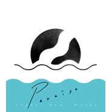

PARAISO
============================

|  |  |
| :--: | :-- |
| [ PARAISO](https://emumo.xiami.com/album/1510757799) | **艺人**: [Yogee New Waves](../index.md) **语种**: 日语 **唱片公司**: Bayon production, HMC **发行时间**: 2014年09月10日 **专辑类别**: 录音室专辑 **专辑风格**: 都市流行 City Pop **播放数**: 1065896 **收藏数**: 906 **评论数**: 44  |

## 简介

2014年4月に店舗限定でリリースした1st e.p.『CLIMAX NIGHT e.p.』が大きな話題を呼び、ロングセールスを記録。  
8月には全国流通を解禁させ、待望となる1st album『PARAISO』が9月10日にリリース決定!  
epに収録された名曲「CLIMAX NIGHT」そして「Good bye」がニューヴァージョンとして新録された他、ライブでも既に定評ある「Hello Ethiopia」「Summer」「Listen」などを収録した全9曲。  
この現代に、都会で生まれ育った彼等だからこそ鳴らせる音色、都心とはことさら離れた土地の纏う雰囲気、空気の質感、直感で素直に歌い上げる様にはどこか懐かしく追想してしまう日本のポップミュージックの面影を感じさせる。  
海を越え、山を見下ろせる人里離れた所へ、二人だけのバカンスに出よう。楽園を探そう・・・そうしてまた帰ってくる都会での生活、人生の良き瞬間を頭の中で増幅させ、擦れた都会性をも帯びたこの作品こそが、現代の“シティ・ポップ"の機軸になるであろう1枚となる。  
エンジニアには、ペトロールズ、踊ってばかりの国、髭、INO hidefumiなどを手掛けるhmcの池田洋を迎え制作。 

## 曲目

## 评论

|  |  |  |  |
| :-- | :-- | :-- | :-- |
|  [虾米用户](https://emumo.xiami.com/u/276944698) 不要自我设限..... 2020-08-10 20:59 赞(0) 踩(0) | 
✔️✔️✔️
 |
|  [虾米用户](https://emumo.xiami.com/u/307267669) 没有什么是比音乐更好的了... 2020-02-26 11:58 赞(0) 踩(0) | 
(灬ºωº灬)♩
 |
|  [虾米用户](https://emumo.xiami.com/u/42963872) 我还没想好要写什么... 2019-07-20 23:09 赞(1) 踩(0) | 
-
 |
|  [虾米用户](https://emumo.xiami.com/u/189364573) 拒绝吃土 2019-05-19 16:00 赞(0) 踩(0) | 
好喜欢这个封面
 |
|  [虾米用户](https://emumo.xiami.com/u/44716876) 海市蜃楼只是爱 2019-05-06 17:04 赞(0) 踩(0) | 
Camp那首歌重新上传一下吧
 |
|  [虾米用户](https://emumo.xiami.com/u/277778458) Sheep count ... 2019-05-01 11:18 赞(0) 踩(0) | 
哈哈
 |
|  [虾米用户](https://emumo.xiami.com/u/2731100) I listen, th... 2019-04-24 11:24 赞(0) 踩(0) | 
看radwimps還是他們呢⋯
 |
|  [虾米用户](https://emumo.xiami.com/u/45686435) 爱虾米！期待我们再见的那... 2019-04-08 11:19 赞(0) 踩(0) | 
fuxi
 |
|  [虾米用户](https://emumo.xiami.com/u/190155991) 人丑嘴不甜 唱歌还破音 2019-02-22 19:55 赞(0) 踩(0) | 
❤
 |
|  [虾米用户](https://emumo.xiami.com/u/71123952) 我还没想好要写什么... 2018-12-20 21:48 赞(0) 踩(0) | 
Wow
 |
|  [虾米用户](https://emumo.xiami.com/u/344653994)  2018-10-25 17:54 赞(0) 踩(0) | 
最佳一张专辑
 |
|  [虾米用户](https://emumo.xiami.com/u/49373215) 我还没想好要写什么... 2018-06-10 23:01 赞(3) 踩(0) | 
谢谢大家 中国巡演最后一站的最后一张paraiso专辑被我买下了
 |
| ⇒ |  [虾米用户](https://emumo.xiami.com/u/46806159) 我还没想好要写什么... 2018-06-12 11:30 赞(0) 踩(0) | 
好羡慕哦...没有买到
 |
| ⇒ |  [虾米用户](https://emumo.xiami.com/u/49373215) 我还没想好要写什么... 2018-06-12 12:31 赞(0) 踩(0) | 
<q><b>土伯虎说：</b></q>
 |
|  [虾米用户](https://emumo.xiami.com/u/31166894)  2018-05-27 00:24 赞(0) 踩(0) | 

 |
|  [虾米用户](https://emumo.xiami.com/u/30398026) 我还没想好要写什么... 2018-03-13 19:32 赞(1) 踩(0) | 
真的好专
 |
|  [虾米用户](https://emumo.xiami.com/u/43486567)  2018-03-11 20:34 赞(0) 踩(0) | 
还不错啊city pop
 |
|  [虾米用户](https://emumo.xiami.com/u/48898343) 生命已经过期 2018-01-21 01:21 赞(1) 踩(0) | 

 |
|  [虾米用户](https://emumo.xiami.com/u/17077682) 滚去spotify了。C... 2017-10-21 21:29 赞(1) 踩(0) | 
☑️
 |
|  [虾米用户](https://emumo.xiami.com/u/116178236) 浪漫是您的本性 2017-10-15 07:13 赞(0) 踩(0) | 
ok
 |
|  [虾米用户](https://emumo.xiami.com/u/85165792) COMING 2017-08-28 15:23 赞(0) 踩(0) | 
/
 |
|  [虾米用户](https://emumo.xiami.com/u/10028400) 我还没想好要写什么... 2017-08-12 10:32 赞(0) 踩(0) | 
好的
 |
|  [虾米用户](https://emumo.xiami.com/u/1277527) 网易云：糖衣心脏 2017-06-20 11:46 赞(0) 踩(0) | 
Summer~满满少女心爆发！ 
 |
|  [虾米用户](https://emumo.xiami.com/u/7610981) 虾米不会走 2017-04-28 14:13 赞(1) 踩(0) | 
台好听
 |
|  [虾米用户](https://emumo.xiami.com/u/50677231) 听力受损 2017-03-26 18:20 赞(1) 踩(0) | 

 |
|  [虾米用户](https://emumo.xiami.com/u/52594606) 最擅长的事:吃 睡 自毁 2017-03-07 19:58 赞(0) 踩(0) | 
超爱
 |
|  [虾米用户](https://emumo.xiami.com/u/32274796) 世界尽头，唯音乐相伴。 2017-03-06 20:11 赞(0) 踩(0) | 
鲜热的，充满生命力的。前面几首真的很好听。
 |
|  [虾米用户](https://emumo.xiami.com/u/46583488)  2017-02-13 18:33 赞(0) 踩(0) | 

 |
|  [虾米用户](https://emumo.xiami.com/u/46464728) 不浪漫毋宁死 2017-01-16 14:31 赞(0) 踩(0) | 
中
 |
|  [虾米用户](https://emumo.xiami.com/u/20732338) 幸福又安心。 2017-01-15 23:03 赞(0) 踩(0) | 
封面真好看
 |
|  [虾米用户](https://emumo.xiami.com/u/32243562) 我还没想好要写什么... 2017-01-04 00:32 赞(0) 踩(0) | 
很好听
 |
|  [虾米用户](https://emumo.xiami.com/u/8290918) Be water, my... 2016-11-25 10:25 赞(0) 踩(0) | 
原地蹦迪
 |
|  [虾米用户](https://emumo.xiami.com/u/49265597) 我还没想好要写什么... 2016-10-01 22:48 赞(0) 踩(0) | 
哈哈哈哈哈哈
 |
|  [虾米用户](https://emumo.xiami.com/u/1171615) 我还没想好要写什么... 2016-09-03 22:33 赞(1) 踩(0) | 
边听边跺脚 在高铁上
 |
|  [虾米用户](https://emumo.xiami.com/u/36057872) 网易/BC: Breat... 2016-08-17 11:29 赞(1) 踩(0) | 
～
 |
|  [虾米用户](https://emumo.xiami.com/u/7375384) Ծ ̮ Ծ 好好听歌 听... 2016-07-25 21:39 赞(0) 踩(0) | 

 |
|  [虾米用户](https://emumo.xiami.com/u/45974797)   2016-07-17 05:27 赞(0) 踩(0) | 
棒
 |
|  [虾米用户](https://emumo.xiami.com/u/6466852) Love Peace M... 2016-06-30 10:47 赞(0) 踩(0) | 
音乐很棒 不过我实在听不惯日文咬字  
 |
|  [虾米用户](https://emumo.xiami.com/u/6139215)  2015-07-11 10:29 赞(1) 踩(0) | 
很棒的音乐，能听到真是不易的缘分
 |
|  [虾米用户](https://emumo.xiami.com/u/1216780) Don't Panic! 2014-12-26 11:44 赞(13) 踩(0) | 
内容已删除
 |
| ⇒ |  [虾米用户](https://emumo.xiami.com/u/984691)  2015-01-09 12:20 赞(0) 踩(0) | 
谢谢up主 好听惹！
 |
|  [虾米用户](https://emumo.xiami.com/u/1216780) Don't Panic! 2014-11-22 12:49 赞(0) 踩(0) | 
打算入手實體CD→實體CD已入
 |
| ⇒ |  [虾米用户](https://emumo.xiami.com/u/38975313) 宇宙第一聰明 2017-01-11 15:39 赞(0) 踩(0) | 
你好 请问实体CD哪里入
 |
| ⇒ |  [虾米用户](https://emumo.xiami.com/u/33784810) 我还没想好要写什么... 2017-06-09 16:24 赞(0) 踩(0) | 
<q><b>木衛十四说：</b></q>
 |
|  [虾米用户](https://emumo.xiami.com/u/5662640) 失落 2014-11-06 13:22 赞(0) 踩(0) | 
Yogee New Waves，收录
 |
