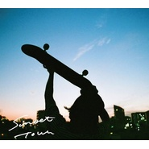

SUNSET TOWN e.p.
============================

|  |  |
| :--: | :-- |
| [ SUNSET TOWN e.p.](https://emumo.xiami.com/album/2100247946) | **艺人**: [Yogee New Waves](../index.md) **语种**: 日语 **唱片公司**: ダイキ **发行时间**: 2015年12月02日 **专辑类别**: EP, 单曲 **专辑风格**: 都市流行 City Pop **播放数**: 245124 **收藏数**: 222 **评论数**: 28  |

## 简介

2014年年間ベストディスクとして各媒体に取り上げられ、いまだロングセラーとなっている1stアルバム『PARAISO』以来となるYogee待望の新作は、新曲4曲に加え、Dorianによる「Sunset Town」のRemixを加えた全5曲を収録。「Like Sixteen Candles」と「Sunset Town」は両A面として機能し、彼等が少しだけ大人になった一面が垣間見える、バンドとしての進化を感じさせる楽曲。M-3「Night is Coming」は、パーカッションとシンセを導入し、新たに試みた浮遊感漂う8分に及ぶ長尺で、ロマンチックかつファンタジーな、聴く人それぞれがドラマを想い描ける感動的な1曲。M-4は、角舘ソロの引き語りライブでも歌っている、「Lemon Tea」を世田谷某所でフィールドレコーディングをし収録。そしてラストには、七尾旅人×やけのはらの名曲「Rollin' Rollin」のトラックも手掛けた、都会的であり逃避感を味わえる極上のチルを放つトラックメイカー”Dorian ”による「Sunset Town」のRemixを収録。アーバンでドリーミーなディスコチューンは、Yogee×Dorianの抜群な相性を見えた最高に気持ちいい1曲。シティポップも90年渋谷系も過去の偉大なる音楽を消化し、彼等にしか成せない表現でアップデートさせたジャンルレスでいて新しいポップミュージック。抜群なメロディーセンスを持ち、表現力、存在感が着実に増している角舘健悟の存在は大きく、まさに今の”都会”を代表するロックバンドになろうとしている。メジャー/インディーズの垣根を越え、新世代の筆頭であり中核として、絶対的なポジションを確立しているYogee New Waves待望の新作、名盤必聴です!レコーディング・エンジニアには、サニーディサービスはじめ曽我部恵一氏の作品を数多く手掛けている池内亮が担当。アートワークは、同世代であり新鋭のフォトグラファーKodai Kobayashiによるメンバー撮り下ろしの写真で構成された内容になっています。全てフィルム写真を使い、折りたたみのブックレットはポスター仕様に。またボーカルの角舘による全曲解説のセルフライナーノーツもブックレットに掲載。

## 曲目

## 评论

|  |  |  |  |
| :-- | :-- | :-- | :-- |
|  [虾米用户](https://emumo.xiami.com/u/3553665) wyy: LESLIE-... 2020-09-20 02:23 赞(0) 踩(0) | 

 |
|  [虾米用户](https://emumo.xiami.com/u/52056952) 人生即是到來、相遇、陪伴... 2020-05-18 18:04 赞(0) 踩(0) | 
꒰  ˘͙ ᵌ˘͙꒱♡
 |
|  [虾米用户](https://emumo.xiami.com/u/46484933) 我还没想好要写什么... 2020-02-06 09:55 赞(0) 踩(0) | 

 |
|  [虾米用户](https://emumo.xiami.com/u/429240010)  2019-09-12 21:32 赞(0) 踩(0) | 
8分钟的板仔深夜刷街，完全有画面感
 |
|  [虾米用户](https://emumo.xiami.com/u/429240010)  2019-09-12 21:31 赞(0) 踩(0) | 
五首居然…各有千秋
 |
|  [虾米用户](https://emumo.xiami.com/u/29761526) 我还没想好要写什么... 2019-07-22 19:24 赞(0) 踩(0) | 
哈？封面是滑板！
 |
|  [虾米用户](https://emumo.xiami.com/u/31166894)  2018-05-31 18:01 赞(1) 踩(0) | 

 |
|  [虾米用户](https://emumo.xiami.com/u/36057872) 网易/BC: Breat... 2018-02-28 17:25 赞(0) 踩(0) | 
实体已入手
 |
|  [虾米用户](https://emumo.xiami.com/u/9028760) 豆瓣见 spotify ... 2017-11-16 08:58 赞(0) 踩(0) | 
哇只听了135 补一哈
 |
|  [虾米用户](https://emumo.xiami.com/u/10028400) 我还没想好要写什么... 2017-08-12 12:05 赞(0) 踩(0) | 
嘻。
 |
|  [虾米用户](https://emumo.xiami.com/u/32274796) 世界尽头，唯音乐相伴。 2017-04-09 12:27 赞(0) 踩(0) | 
已听，最喜欢tr3诶
 |
|  [虾米用户](https://emumo.xiami.com/u/20732338) 幸福又安心。 2017-02-28 09:15 赞(0) 踩(0) | 
封面能让人安静下来
 |
| ⇒ |  [虾米用户](https://emumo.xiami.com/u/32734340) 虾米钉子户 2017-03-07 18:48 赞(0) 踩(0) | 
封面让我想滑板
 |
| ⇒ |  [虾米用户](https://emumo.xiami.com/u/20732338) 幸福又安心。 2017-03-08 12:53 赞(0) 踩(0) | 
<q><b>一粒辰说：</b></q>
 |
|  [虾米用户](https://emumo.xiami.com/u/5572045)  2017-02-12 13:37 赞(0) 踩(0) | 
Skateboard Art.
 |
|  [虾米用户](https://emumo.xiami.com/u/85148548)  2016-12-15 13:48 赞(0) 踩(0) | 
嗷嗷嗷
 |
|  [虾米用户](https://emumo.xiami.com/u/29230195) Gubba nub nu... 2016-11-01 18:32 赞(0) 踩(0) | 
封面nice
 |
|  [虾米用户](https://emumo.xiami.com/u/52921424) 我还没想好要写什么... 2016-09-28 20:14 赞(0) 踩(0) | 
这张砖也太好听了啊啊啊啊啊啊啊啊啊啊
 |
|  [虾米用户](https://emumo.xiami.com/u/36057872) 网易/BC: Breat... 2016-09-02 00:33 赞(0) 踩(0) | 
～
 |
|  [虾米用户](https://emumo.xiami.com/u/10587587) NiteFlyte 2016-04-13 13:24 赞(0) 踩(0) | 
收&amp;gt;
 |
|  [虾米用户](https://emumo.xiami.com/u/4767078) I ：  2016-04-12 23:02 赞(1) 踩(0) | 
打开一罐啤酒
 |
|  [虾米用户](https://emumo.xiami.com/u/7729258)  2016-04-12 22:20 赞(0) 踩(0) | 
******
 |
|  [虾米用户](https://emumo.xiami.com/u/9232443) 暂无签名~ 2016-04-12 22:05 赞(0) 踩(0) | 
啊！
 |
|  [虾米用户](https://emumo.xiami.com/u/19812281) 扰乱 就是 扰乱 2016-04-12 21:38 赞(1) 踩(0) | 
！
 |
|  [虾米用户](https://emumo.xiami.com/u/1216780) Don't Panic! 2015-12-28 11:47 赞(0) 踩(0) | 
實體CD已收
 |
|  [虾米用户](https://emumo.xiami.com/u/44368575)   2015-12-24 02:05 赞(0) 踩(0) | 
快来
 |
| ⇒ |  [虾米用户](https://emumo.xiami.com/u/11361192) 微博@沈撸粥 2016-04-12 23:36 赞(0) 踩(0) | 
！！
 |
| ⇒ |  [虾米用户](https://emumo.xiami.com/u/44368575)   2016-04-13 02:13 赞(0) 踩(0) | 
<q><b>沈撸粥说：</b></q>
 |
