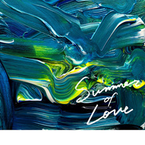

Summer of Love
============================

|  |  |
| :--: | :-- |
| [ Summer of Love](https://emumo.xiami.com/album/2104054247) | **艺人**: [Yogee New Waves](../index.md) **语种**: 日语 **唱片公司**: Colourful Records **发行时间**: 2018年10月10日 **专辑类别**: EP, 单曲 **专辑风格**: 日本流行 J-Pop, 都市流行 City Pop **播放数**: 4447 **收藏数**: 59 **评论数**: 17  |

## 简介

Yogee New Wavesが新曲「Summer of Love」を10月10日に配信リリースする。

## 曲目

## 评论

|  |  |  |  |
| :-- | :-- | :-- | :-- |
|  [虾米用户](https://emumo.xiami.com/u/332103129) 我还没想好要写什么... 2019-02-23 23:15 赞(4) 踩(0) | 
要和所有喜欢ynw的人做朋友！
 |
|  [虾米用户](https://emumo.xiami.com/u/13465367) RANDOMSIDE 2018-10-12 00:13 赞(2) 踩(0) | 
yogee new waves大概是夏天的代言人吧
 |
|  [虾米用户](https://emumo.xiami.com/u/52415194) ♬♩♫♪♡ 2018-10-11 21:20 赞(0) 踩(0) | 
ᵕ᷄≀ ̠˘᷅
 |
|  [虾米用户](https://emumo.xiami.com/u/100660422) 你好呀。(¦3[▓▓]虾... 2018-10-11 19:27 赞(0) 踩(0) | 
✺◟(∗❛ัᴗ❛ั∗)◞✺
 |
|  [虾米用户](https://emumo.xiami.com/u/7707877) 音乐使我们心灵相通。 2018-10-11 17:23 赞(0) 踩(0) | 
戴着耳机，慢慢游。
 |
|  [虾米用户](https://emumo.xiami.com/u/319156) 孤獨的自我認同 2018-10-11 17:02 赞(0) 踩(0) | 
來了
 |
|  [虾米用户](https://emumo.xiami.com/u/1547054) Garðskagavit... 2018-10-11 16:51 赞(0) 踩(0) | 
今夏最美好回忆
 |
|  [虾米用户](https://emumo.xiami.com/u/346164001)  2018-10-11 16:33 赞(0) 踩(0) | 
最想看到现场的日本乐队之一 夏天最爱
 |
|  [虾米用户](https://emumo.xiami.com/u/4222269) 我还没想好要写什么... 2018-10-11 16:17 赞(0) 踩(0) | 
来啦！
 |
|  [虾米用户](https://emumo.xiami.com/u/13981119) Morning Coll... 2018-10-11 16:15 赞(0) 踩(0) | 

 |
|  [虾米用户](https://emumo.xiami.com/u/335423393) early corgi ... 2018-10-10 00:00 赞(0) 踩(0) | 
来啦
 |
|  [虾米用户](https://emumo.xiami.com/u/358205083)  2018-10-09 23:49 赞(0) 踩(0) | 
好温柔！
 |
|  [虾米用户](https://emumo.xiami.com/u/13869266) something. 2018-10-09 22:27 赞(0) 踩(0) | 
等！
 |
|  [虾米用户](https://emumo.xiami.com/u/7543614) Music best e... 2018-10-08 18:47 赞(1) 踩(0) | 
等！
 |
|  [虾米用户](https://emumo.xiami.com/u/46583488)  2018-10-07 00:27 赞(0) 踩(0) | 
期待(〃ﾟ3ﾟ〃)
 |
|  [虾米用户](https://emumo.xiami.com/u/358205083)  2018-10-03 15:56 赞(0) 踩(0) | 

 |
|  [虾米用户](https://emumo.xiami.com/u/9028760) 豆瓣见 spotify ... 2018-09-28 14:23 赞(0) 踩(0) | 
（&amp;acute;-`）.｡oO
 |
