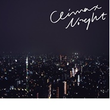

CLIMAX NIGHT e.p.
============================

|  |  |
| :--: | :-- |
| [ CLIMAX NIGHT e.p.](https://emumo.xiami.com/album/511888426) | **艺人**: [Yogee New Waves](../index.md) **语种**: 日语 **唱片公司**: HATENA RECORDS **发行时间**: 2014年08月13日 **专辑类别**: EP, 单曲 **专辑风格**: 都市流行 City Pop **播放数**: 407422 **收藏数**: 222 **评论数**: 26  |

## 简介

2014年絶対に注目すべきニューカマーYogee New Waves。  
今年4月に店舗限定で発売しロングセールスを続ける、1st e.p.『CLIMAX NIGHT e.p.』がアルバムリリースに向け全国流通を解禁!   
都会におけるポップスの進化をテーマに2013年6月より始動した、東京を中心に活動する音楽集団。はっぴいえんど、松任谷由実、山下達郎、FISHMANS...これらの偉大なるポップミュージックの恩恵を受けた僕らの世代にしかできない僕らのポップミュージック。

## 曲目

## 评论

|  |  |  |
| :-- | :-- | :-- |
|  [虾米用户](https://emumo.xiami.com/u/13228266) 关注音乐本身 2020-06-06 02:47 赞(0) 踩(0) | 
开心
 |
|  [虾米用户](https://emumo.xiami.com/u/400715332) 留白 2020-03-23 07:55 赞(3) 踩(0) | 
&amp;mdash;&amp;mdash;
 |
|  [虾米用户](https://emumo.xiami.com/u/52056952) 人生即是到來、相遇、陪伴... 2020-01-28 00:59 赞(0) 踩(0) | 
┌(★ｏ☆)┘
 |
|  [虾米用户](https://emumo.xiami.com/u/45881128) 来找我玩 在虾米解散前 2019-11-21 22:31 赞(0) 踩(0) | 
❣️
 |
|  [虾米用户](https://emumo.xiami.com/u/427662204) 0 to 1 2019-08-13 21:27 赞(0) 踩(0) | 
太好听了！
 |
|  [虾米用户](https://emumo.xiami.com/u/34039) 好舍不得这里 2019-03-15 13:59 赞(0) 踩(0) | 

 |
|  [虾米用户](https://emumo.xiami.com/u/2615992) shoot the co... 2019-03-10 19:25 赞(0) 踩(0) | 
2.28大阪入EP
 |
|  [虾米用户](https://emumo.xiami.com/u/28698656) Old Fashione... 2019-01-05 23:50 赞(0) 踩(0) | 
ありがとう
 |
|  [虾米用户](https://emumo.xiami.com/u/31166894)  2018-05-27 00:11 赞(0) 踩(0) | 

 |
|  [虾米用户](https://emumo.xiami.com/u/3528785) 惊鸿一瞥，空谷幽兰 2018-05-24 09:50 赞(0) 踩(0) | 
壱番大好
 |
|  [虾米用户](https://emumo.xiami.com/u/30800139) 我在低俗与高雅间活的很尴... 2018-04-08 17:31 赞(0) 踩(0) | 
。
 |
|  [虾米用户](https://emumo.xiami.com/u/553333) 我还没想好要写什么... 2017-04-23 08:53 赞(0) 踩(0) | 
有人贴歌词吗
 |
|  [虾米用户](https://emumo.xiami.com/u/4934621) 你喜欢南瓜饼吗 2017-02-20 13:02 赞(0) 踩(0) | 
谢谢~
 |
|  [虾米用户](https://emumo.xiami.com/u/27490798) 我还没想好要写什么... 2017-02-19 18:03 赞(0) 踩(0) | 
哇
 |
|  [虾米用户](https://emumo.xiami.com/u/211251) 青年以荒野为目标 2017-02-19 17:49 赞(0) 踩(0) | 
。
 |
|  [虾米用户](https://emumo.xiami.com/u/85148548)  2017-02-19 17:24 赞(0) 踩(0) | 
感谢
 |
|  [虾米用户](https://emumo.xiami.com/u/30617820) 窝列大窝列大哟 2017-02-19 17:03 赞(0) 踩(0) | 
。
 |
|  [虾米用户](https://emumo.xiami.com/u/11361192) 微博@沈撸粥 2017-02-19 16:54 赞(0) 踩(0) | 
！
 |
|  [虾米用户](https://emumo.xiami.com/u/193087553) (*☻-☻*) 2017-02-19 16:52 赞(0) 踩(0) | 
www
 |
|  [虾米用户](https://emumo.xiami.com/u/156056836) 我还没想好要写什么... 2017-02-19 16:52 赞(0) 踩(0) | 
来了
 |
|  [虾米用户](https://emumo.xiami.com/u/36057872) 网易/BC: Breat... 2017-02-19 16:32 赞(15) 踩(0) | 
itunes 自购，enjoy :-)
 |
| ⇒ |  [虾米用户](https://emumo.xiami.com/u/12317756) We 2019-03-22 17:17 赞(0) 踩(0) | 
谢谢大哥
 |
| ⇒ |  [虾米用户](https://emumo.xiami.com/u/1301315) 有一天 我看了很多次日落 2020-11-03 13:37 赞(0) 踩(0) | 
感恩
 |
|  [虾米用户](https://emumo.xiami.com/u/21746621)   2017-01-10 15:20 赞(0) 踩(0) | 
我有这张CD 
 |
|  [虾米用户](https://emumo.xiami.com/u/1216780) Don't Panic! 2014-12-27 00:05 赞(0) 踩(0) | 
感覺這張也該收一下~
 |
|  [虾米用户](https://emumo.xiami.com/u/5662640) 失落 2014-11-06 13:22 赞(0) 踩(0) | 
Yogee New Waves，收录
 |
