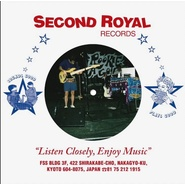

Fantasic Show / Climax Night
============================

|  |  |
| :--: | :-- |
| [ Fantasic Show / Climax Night](https://emumo.xiami.com/album/725005455) | **艺人**: [Yogee New Waves](../index.md) **语种**: 日语 **唱片公司**: SECOND ROYAL RECORDS, Roman Label **发行时间**: 2015年02月27日 **专辑类别**: EP, 单曲 **专辑风格**: 都市流行 City Pop **播放数**: 86595 **收藏数**: 111 **评论数**: 20  |

## 简介

彼らは昨年デビュー・アルバム『パライソ』を発表。浮遊感をもたらすバック・ビートと、艶のある歌声で、都会に暮らす若者のセンチメントを無頼に表現したダブ・ポップは、インディ・リスナーから支持されることとなった。今作『ファンタジック・ショー』は、彼らにとって初のアナログ盤となる7インチ 。バンドが所属するレーベル、ロマン・レーベルと、京都のインディ・レーベル、セカンド・ロイヤルとの共同リリースである。    
A サイドに収録されたタイトル曲"ファンタジック・ショー"は、これまでの作品には収録されていない完全な新曲。BPM120の四つ打ち、綺麗に左右のステレオへと振り分けられたツイン・ギターのカッティング、まぎれもなくバンド史上最も明確にダンスフロアで開花することを志向した1曲だろう。"ゲット・ラッキー"、"トレジャー"、"アップタウン・ファンク"と猛威を振るうディスコ・ファンクの嵐へと、バンドは果敢にも飛び込んだ。そして、その決死のダイヴは、見事にミラーボールの下へと着地を果たしている。最初「身体は海のように揺れて」いて、ピークタイムにさしかかっては「今夜は眠れないよ」と雄叫びを上げ、終わるかと思いきや、アフターアワーズ的なもう一踊りを煽ってくるこの曲は、5分12秒で一晩の幸福な景色を語りきった。まぎれもなく2015 年のパーティ・アンセムだ。    
そして、Bサイドにはファースト・シングルにして、これまでバンドの代表曲であった"クライマックス・ナイト"。かつて起こった最高潮の夜を優しいメランコリーとともに振り返るこの曲を、"ファンタジック・ショー"の裏面に配したのは実に粋な選択だ。華やかに光が交差するフロア、あるいは、ささやかに灯火が揺らめくベッドルーム。いずれにせよ、このレコードは、多くの午前2 時に寄り添うこととなるだろう。

## 曲目

## 评论

|  |  |  |
| :-- | :-- | :-- |
|  [虾米用户](https://emumo.xiami.com/u/42963872) 我还没想好要写什么... 2019-07-25 18:54 赞(0) 踩(0) | 
-
 |
|  [虾米用户](https://emumo.xiami.com/u/89469474)   2019-05-01 21:33 赞(0) 踩(0) | 
无敌喜欢
 |
|  [虾米用户](https://emumo.xiami.com/u/31166894)  2018-05-31 18:01 赞(0) 踩(0) | 

 |
|  [虾米用户](https://emumo.xiami.com/u/250148003) chivalry was... 2018-05-08 01:59 赞(1) 踩(0) | 
这个bass好迷人
 |
|  [虾米用户](https://emumo.xiami.com/u/11964216) 上街 2017-12-21 16:30 赞(0) 踩(0) | 
封面 (・ o ・)
 |
|  [虾米用户](https://emumo.xiami.com/u/32283984) 喔哈每天 2017-12-18 01:08 赞(1) 踩(0) | 
如此舒服像走在夜深
 |
|  [虾米用户](https://emumo.xiami.com/u/9726884)    今  食  飯 2017-03-02 23:46 赞(0) 踩(0) | 
卢广仲似的
 |
| ⇒ |  [虾米用户](https://emumo.xiami.com/u/415976)  2018-05-31 18:23 赞(0) 踩(0) | 
是卢学他们的。。。。
 |
|  [虾米用户](https://emumo.xiami.com/u/1320669) ツ 2016-11-02 22:44 赞(0) 踩(0) | 
0.0
 |
|  [虾米用户](https://emumo.xiami.com/u/38663581) see you 2016-11-02 13:07 赞(0) 踩(0) | 
:)
 |
|  [虾米用户](https://emumo.xiami.com/u/11361192) 微博@沈撸粥 2016-11-02 11:54 赞(0) 踩(0) | 
好
 |
|  [虾米用户](https://emumo.xiami.com/u/85148548)  2016-11-02 11:11 赞(0) 踩(0) | 
耶嘿
 |
|  [虾米用户](https://emumo.xiami.com/u/5032986) Private 2016-11-02 11:11 赞(0) 踩(0) | 
~
 |
|  [虾米用户](https://emumo.xiami.com/u/4767078) I ：  2016-11-02 10:58 赞(0) 踩(0) | 
好耶
 |
|  [虾米用户](https://emumo.xiami.com/u/56944622)  2016-11-02 09:55 赞(0) 踩(0) | 
嚯
 |
|  [虾米用户](https://emumo.xiami.com/u/39674727) 特技是挖掘冷门乐队 2016-11-02 09:15 赞(0) 踩(0) | 
w
 |
|  [虾米用户](https://emumo.xiami.com/u/36057872) 网易/BC: Breat... 2016-11-01 21:12 赞(12) 踩(0) | 
已上传，Fantasic Show用的是itunes单曲版本，Climax Night直接从《PARAISO》上搬过来的。 BTW，已替换高清封面:-)
 |
|  [虾米用户](https://emumo.xiami.com/u/7729258)  2016-07-15 22:24 赞(0) 踩(0) | 
******
 |
|  [虾米用户](https://emumo.xiami.com/u/1216780) Don't Panic! 2015-03-02 14:22 赞(0) 踩(0) | 
七寸黑胶形式（可是我貌似没设备播放呢- -
 |
|  [虾米用户](https://emumo.xiami.com/u/5662640) 失落 2015-02-28 11:32 赞(0) 踩(0) | 
Yogee New Waves，收录
 |
