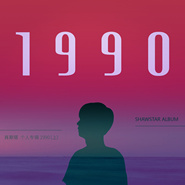

1990
============================

|  |  |
| :--: | :-- |
| [ 1990](https://emumo.xiami.com/album/2103544547) | **艺人**: [肖斯塔](../index.md) **语种**: 国语 **唱片公司**: 独立发行 **发行时间**: 2018年02月22日 **专辑类别**: 录音室专辑 **专辑风格**: 流行 Pop, 中国风 China-Wave, 古风 GuFeng Music **播放数**: 33956 **收藏数**: 7 **评论数**: 3  |

## 简介

1990

## 曲目

## 评论

|  |  |  |
| :-- | :-- | :-- |
|  [虾米用户](https://emumo.xiami.com/u/425314102)  2019-11-12 20:52 赞(0) 踩(0) | 
制作不错
 |
|  [虾米用户](https://emumo.xiami.com/u/58838294)  2018-07-29 00:59 赞(0) 踩(0) | 
1990这张专辑比上张专辑做的好。
 |
|  [虾米用户](https://emumo.xiami.com/u/237984933) 你站在桥上看风景， 看风... 2018-02-22 21:25 赞(0) 踩(0) | 
后知后觉，一年后必火
 |
