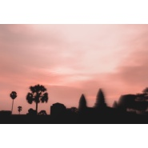
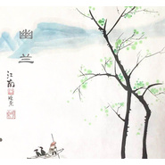
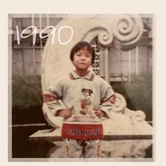
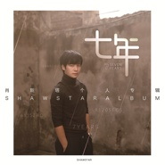

肖斯塔
============================

|  |  |
| :--: | :-- |
| [ 肖斯塔](https://i.xiami.com/xiaosita) | **播放数**: 2909054 **粉丝数**: 196 **评论数**: 8 **地区**: China 中国大陆 **风格**: 国语流行 Mandarin Pop  |

## 档案

肖斯塔 独立唱作人

## 专辑

| 名称 | 语种 | 唱片公司 | 发行时间 | 专辑类别 | 专辑风格 |
| :--: | :-- | :-- | :-- | :-- | :-- |
| [ 无锡](./albums/2103885479.md) | 国语 | 独立发行 | 2018年08月01日 | 录音室专辑 | 流行 Pop |
| [ 那年我穿上军装](./albums/2103879050.md) | 国语 | 独立发行 | 2018年07月31日 | 录音室专辑 | 流行 Pop |
| [ Believe](./albums/2103719968.md) | 国语 | 独立发行 | 2018年05月26日 | 录音室专辑 | 电子 Electronic |
| [ 1990](./albums/2103544547.md) | 国语 | 独立发行 | 2018年02月22日 | 录音室专辑 | 流行 Pop, 中国风 China-Wave, 古风 GuFeng Music |
| [ 幽兰](./albums/2103472955.md) | 国语 | 独立发行 | 2018年01月09日 | 录音室专辑 | 流行 Pop, 国语流行 Mandarin Pop |
| [ 刚刚好](./albums/2102977246.md) | 国语 | 独立发行 | 2017年12月19日 | 录音室专辑 | 流行 Pop |
| [ 1990](./albums/2102977260.md) | 国语 | 独立发行 | 2017年12月19日 | 录音室专辑 | 流行 Pop |
| [ 我在黄灯下走过](./albums/2102977230.md) | 国语 | 独立发行 | 2017年12月19日 | 录音室专辑 | 流行 Pop |
| [ 初醉清波](./albums/2102700578.md) | 国语 | 独立发行 | 2017年02月27日 | 录音室专辑 | 自然新世纪 Nature New Age, 精神新世纪 Spiritual New Age, 轻音乐 Easy Listening |
| [ 还能去哪里肖斯塔](./albums/2102690700.md) | 国语 | 独立发行 | 2017年01月15日 | EP, 单曲 | 流行 Pop |
| [ 伪装](./albums/2102403574.md) | 国语 |  | 2016年09月29日 | EP, 单曲 | 流行 Pop |
| [ 生生不息生生不息](./albums/2100378088.md) | 国语 | 独立发行 | 2016年08月10日 | EP, 单曲 | 流行摇滚 Pop Rock, 英伦摇滚 Britpop, 迷幻摇滚 Psychedelic Rock |
| [ 七年](./albums/2100246322.md) | 国语 | 独立发行 | 2015年12月13日 | 录音室专辑 | 流行 Pop, 独立流行 Indie Pop, 欧美流行 Western Pop |

## 评论

|  |  |  |  |
| :-- | :-- | :-- | :-- |
|  [虾米用户](https://emumo.xiami.com/u/5515891) Ricky_chan 2019-09-03 00:24 赞(0) 踩(0) | 
都是挺好听的歌，喜欢喜欢   
 |
|  [虾米用户](https://emumo.xiami.com/u/263111308)  2018-07-03 20:21 赞(1) 踩(0) | 
校友支持一下~
 |
|  [虾米用户](https://emumo.xiami.com/u/237984933) 你站在桥上看风景， 看风... 2018-02-22 21:30 赞(1) 踩(0) | 
一个等待被发现的新世界
 |
|  [虾米用户](https://emumo.xiami.com/u/244762853)   2017-04-30 12:40 赞(0) 踩(0) | 
超好听超好听，音乐节现场听过后，建了个肖斯塔的歌单，练字的时候，看kindle的时候，发呆的时候，循环播放中～希望肖斯塔能上传更多的歌，真希望越来越多人知道肖斯塔，喜欢肖斯塔～
 |
|  [虾米用户](https://emumo.xiami.com/u/44397015)  2016-01-26 08:58 赞(0) 踩(0) | 
歌都很好听哦，喜欢回到一个人~
 |
|  [虾米用户](https://emumo.xiami.com/u/86404584)  2015-12-13 16:27 赞(3) 踩(0) | 
我刚入驻了虾米音乐人，欢迎大家来我的个人主页，收听我的最新音乐
 |
