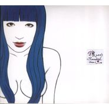

Happy Together 二零零三现场作品2003现场作品
============================

|  |  |
| :--: | :-- |
| [ Happy Together 二零零三现场作品2003现场作品](https://emumo.xiami.com/album/32421) | **艺人**: [陈珊妮](../index.md) **语种**: 国语 **唱片公司**: 五四三音乐 **发行时间**: 2004年07月16日 **专辑类别**: 现场专辑 **专辑风格**: 国语流行 Mandarin Pop **播放数**: 591725 **收藏数**: 754 **评论数**: 45  |

## 简介

陈珊妮二○○三现场作品 Happy Together 限量发行5000张 售完绝版 双片装 封面 贴上贴纸 珊妮手绘海报 包括全部歌词   
  
双片精装版，附赠超大海报、四联式大头照、精美明信片、流水号码卡，限量5000套，售完绝版！   
  
<strong>⊙产品内容  
</strong>  
01 三开式纸盒精印裱褙，珊妮亲笔绘制封面封底与内面图像。   
  
02 双片装CD，CD片单独以特色精印纸折信封装盛。CD片亦由珊妮亲笔绘制图样。   
  
03 菊对开超大海报，陈珊妮亲笔绘制图像，并手写全部歌词！   
  
04 陈珊妮自拍四联式大头照一帧，原稿是珊妮在路边证件照自拍机所摄。图样分两款，随机包装，就跟转蛋一样，不到拆封，不知道您拿到的会是哪一款。   
  
05 流水编号卡，使用米色厚裱卡特色精印，每张专辑都有独一无二的编号。   
  
06 五四三音乐站美术纸精印明信片乙张。   
  
<strong>⊙去年夏天，两个美好的夜晚  
</strong>  
珊妮上次发表个人专辑，是在2000年冬天。她的歌迷无不望穿秋水，期待新专辑能早日问世。然而，这几年来，珊妮一点都没闲着。她写了很多很多了不起的新歌，也替许多歌者制作、编曲、写歌，更参与了不少大大小小的现场演出，每次演出，无论场地大小，永远都塞爆慕名而来的歌迷。对一个四年没出片的歌手来说，她的魅力实在不容小觑。   
  
2003年夏天，珊妮在河岸留言跟金石堂“我的书房”举办了两场小型演唱会，并且首度尝试不同于以往的乐手编制∶除了老搭档吉他手秀秀，珊妮找来才华横溢的DJ小四在现场打碟，创造出前所未有的音场。在“河岸留言”的演唱会，她还邀请近年合作无间、珊妮昵称“李雨克莱德寰”的李雨寰来弹键盘。这两场演出的空间、情绪完全不同，河岸留言的演出仿佛笼罩在濛濛的水气之中，有股舒缓深沉的况味。金石堂“我的书房”则满载着明亮的音符，能量充沛，力道饱满。即使是同一首歌，两次诠释的色调和情绪也天差地远，然而同样令人爱不释手。   
  
<strong>⊙关于珊妮的限量版专辑  
</strong>  
2002年，五四三音乐站推出创业作∶陈珊妮二○○一现场作品\\\\\\\"Happy Birthday\\\\\\\"，双片纸盒精装，限量发行3000套，完全无宣传，只在五四三音乐站和诚品音乐馆贩售。出乎意料的是，这三千套专辑，短短三个月不到即告售罄，之后还不断有歌迷询问是否仍有库存。来自香港、星马、大陆的订货需求也源源不绝，但是限量版售完就是售完，只能对向隅的朋友说声抱歉了。   
  
\\\\\\\"Happy Birthday\\\\\\\"绝版多时，去年在拍卖网站出现，竟然索价新台币两千元。今年稍早，珊妮把手边仅有的几套\\\\\\\"Happy Birthday\\\\\\\"捐出来做公益拍卖，每套也都创下超过一千元的成交纪录！这套作品在乐迷心目中的地位，可见一斑。   
  
由于上次的合作经验十分愉快，我们很早就跟陈珊妮讲好，要持续出版她的现场录音，而且要愈做愈好。今年年初，珊妮挑出她去年在河岸留言和金石堂“我的书房”两场录音，完成了后制的工作。当我们收到珊妮做好的母带，放进CD音响听的时候，那种感动，无法以言语形容。只能把说过的话再说一次∶能够参与这样美好的音乐底诞生，真是与有荣焉，不亦快哉。   
  
<strong>⊙顶级人才幕后操盘  
</strong>  
这次的实况专辑，就录音品质和后制的精致程度而言，我们有绝对的信心，就算摆在整个华语乐坛的现场录音专辑来看，也足以抬头挺胸。这两场的录音师分别是业界超级资深的前辈史大维（河岸留言）和前交工乐队贝斯手、目前担任好客乐队团长的录音师陈冠宇（金石堂我的书房）。两个截然不同的空间配置和现场音效，他们都用最好的器材、结合多年的经验，录下了极为精致、生动的现场实况。   
  
而专辑的后制混音，则是由香港“人山人海”的大将李端娴（Veegay）操刀。五四三的网友对Veegay当然不会陌生，因为她也是“拜金小姐”的成员。据说Veegay在混音的时候，一边工作，一边慨叹“哎呀怎么这么好听啊，怎么这么厉害啊”...   
  
<strong>⊙参与乐手惊喜不置  
</strong>  
珊妮拿到母带的那一天，兴奋地在电话里跟我说∶“这两张实况专辑录音超高级的，我们简直都不敢相信自己这么厉害！”   
  
珊妮拿回混音完成的母带之后，把CD塞进老公阿舌的车上音响播放，阿舌也惊奇地说怎么这么好听。吉他手秀秀和珊妮做完实况录音的后制剪辑，并不知道混音完成的成品是什么样子。等她听到CD母带，也是高兴得不得了。至于DJ小四，对自己在专辑中的表现更是不敢相信，一边听，一边拉着珊妮说∶“哇，我这边cue得好准啊...这段我做得好赞哪...”   
  
<strong>⊙包装设计仍然不惮其烦  
</strong>  
这次的设计，我们再度延揽上次制作“拜金小姐”平面设计的聂永真负责。永真和珊妮是很好的朋友，也深深知道应该赋予珊妮什么样的视觉风格。这套实况专辑，珊妮仍然亲手绘制所有图像、手写所有歌词，对珊妮来说，限量版的实况录音是对歌迷的“社群服务”，一定要让大家充分感觉到诚意才行－－相信大家拿到这套专辑的时候，都能体会到珊妮的用心。   
  
这次我们仍然使用纸壳包装，但采用了不同以往的裱褙方式，在三开式的外盒中间糊一个信封，里面装着珊妮手绘手写的超大张对开海报、四联式大头照、流水号码卡和五四三精印明信片。制作物之费工、材料之考究，绝不下于两年前的Happy Birthday。   
  
在试做、看样的阶段，我们仍然遇到许多大大小小的问题，也因此延迟了专辑问世的时间。永真不厌其烦地试了很多种材质、不同的裁切糊裱方式，终于让专辑有了最完美的面貌。   
  
很多人会问∶歌迷只是要听好音乐，未必在乎你用什么纸、怎么裱怎么贴，你们的设计物干嘛弄这么龟毛，还耽误了上市时间，这不是耍白痴吗？   
  
我们却觉得，坚持“精致手工业”的质感，跟坚持音乐制作内容的细节要求一样，是音乐产品不可分割的一部份。我们希望每个支持我们的乐迷，都能感受到这份诚意。尤其在这个大部份同业都对制作物品质睁只眼闭只眼的时节，作为独立发行的小厂牌，我们一定要做得比跨国大公司更用心、更精致，才会有活路。   
  
所以，我们宁可不厌其烦地把东西做到最好，在这漫长的过程中，少睡几觉、多几根白头发，则其余事耳。

## 曲目

- [空气 (Live)](./32421/kazJba081.md)
- [ㄐ一ㄢ视 (Live)MV](./32421/syHO2573e.md)
- [完美 (Live)](./32421/4ZiV5ddc8.md)
- [贫血 (Live)](./32421/4ZiW37ae7.md)
- [红眼睛 (Live)](./32421/kazNab560.md)
- [验伤 (Live)](./32421/fOqM65b04.md)
- [初夏的房间 (Live)](./32421/fOqN8003d.md)
- [不要爱我 (Live)](./32421/om8Se2656.md)
- [乘喷射机离去 (Live)](./32421/kazR106d9.md)
- [Talking](./32421/kazS9a569.md)
- [美丽的女生 (Live)MV](./32421/fOqR8ad04.md)
- [Opening](./32421/fOqS5da02.md)
- [缓慢 (Live)](./32421/kazV9c7f8.md)
- [空气 (Live)](./32421/9lsi3fa2a.md)
- [呕吐 (Live)](./32421/kazXd2493.md)
- [你在烦恼些什么呢？亲爱的 (Live)](./32421/fOqW81f18.md)
- [完美 (Live)](./32421/fOqX82e97.md)
- [忽略 (Live)](./32421/syIe1fb9f.md)
- [乘喷射机离去 (Live)](./32421/om9deefb2.md)
- [不作梦 (Live)](./32421/om9ef87e6.md)
- [Unknow (Live)](./32421/0Nal4ab37.md)
- [海边 (Live)](./32421/ka0eb6741.md)

## 评论

|  |  |  |  |
| :-- | :-- | :-- | :-- |
|  [虾米用户](https://emumo.xiami.com/u/4911883) 如果你也爱Eason 2020-07-19 20:32 赞(0) 踩(0) | 
陈姐有那么大嘛 
 |
|  [虾米用户](https://emumo.xiami.com/u/324850786) 當你我錯過今天 人潮將彼... 2020-03-17 20:15 赞(0) 踩(0) | 
谁有这张无损资源呀，有偿收
 |
| ⇒ |  [虾米用户](https://emumo.xiami.com/u/2967564)  2020-06-28 23:05 赞(0) 踩(0) | 
这张是限量发行的纸版，只出过一次。有些难收，去淘宝或者闲鱼看看。我也只有一张。
 |
| ⇒ |  [虾米用户](https://emumo.xiami.com/u/324850786) 當你我錯過今天 人潮將彼... 2020-06-28 23:15 赞(0) 踩(0) | 
<q><b>winsonrocker说：</b></q>
 |
|  [虾米用户](https://emumo.xiami.com/u/39119490) 倔強少女 2019-12-07 03:44 赞(1) 踩(0) | 
陳珊妮的唱功很真實也很強，不對，強應該放在真實的前面
 |
|  [虾米用户](https://emumo.xiami.com/u/96296322)  2019-10-14 10:37 赞(0) 踩(0) | 
.
 |
|  [虾米用户](https://emumo.xiami.com/u/370238798)  2018-05-24 15:46 赞(1) 踩(0) | 
乘喷射机离去 怎么学会，感觉旋律记不住，歌词也记不住
 |
|  [虾米用户](https://emumo.xiami.com/u/48898343) 生命已经过期 2018-04-19 12:05 赞(1) 踩(0) | 
哈哈
 |
|  [虾米用户](https://emumo.xiami.com/u/39119490) 倔強少女 2018-03-23 01:38 赞(1) 踩(0) | 
都太悲伤了
 |
|  [虾米用户](https://emumo.xiami.com/u/87505798)  2017-11-02 15:18 赞(0) 踩(0) | 
这封面是什么意思？谁来回答我
 |
|  [虾米用户](https://emumo.xiami.com/u/5530908) 不好意思 2017-10-17 09:14 赞(0) 踩(0) | 
不要爱我
 |
|  [虾米用户](https://emumo.xiami.com/u/52471551) 願你我能留在黑暗中多一陣... 2017-09-11 20:23 赞(1) 踩(0) | 
 
 |
|  [虾米用户](https://emumo.xiami.com/u/16337726)  2017-06-06 09:29 赞(0) 踩(0) | 
)
 |
|  [虾米用户](https://emumo.xiami.com/u/3562481)   2016-06-23 21:35 赞(2) 踩(0) | 
依然渴望你最轻浮最浓烈的表面
 |
|  [虾米用户](https://emumo.xiami.com/u/6688315)  2016-05-22 08:47 赞(1) 踩(0) | 
同一首歌收两遍，却是不同的套路不同的味道，就是任性
 |
|  [虾米用户](https://emumo.xiami.com/u/54518)  2015-10-10 12:16 赞(0) 踩(0) | 
典
 |
|  [虾米用户](https://emumo.xiami.com/u/42796332) H e l l o ! ... 2015-02-24 03:36 赞(0) 踩(0) | 
怀恋
 |
|  [虾米用户](https://emumo.xiami.com/u/25267717) 我还没想好要写什么... 2015-02-18 00:57 赞(0) 踩(0) | 
最喜欢这张
 |
|  [虾米用户](https://emumo.xiami.com/u/8226204) ≡ 2014-12-21 11:39 赞(0) 踩(0) | 
nice！
 |
|  [虾米用户](https://emumo.xiami.com/u/2454171)  2014-11-06 12:53 赞(0) 踩(0) | 
想念。
 |
|  [虾米用户](https://emumo.xiami.com/u/1896605) ////// 2014-06-14 01:01 赞(0) 踩(0) | 
mark
 |
|  [虾米用户](https://emumo.xiami.com/u/10961383) 累，睡一觉，打起精神，每... 2014-03-09 23:31 赞(0) 踩(0) | 
符合现在的心境吧
 |
|  [虾米用户](https://emumo.xiami.com/u/5530908) 不好意思 2014-03-08 18:00 赞(1) 踩(0) | 
陈珊妮在非典的小情绪
 |
|  [虾米用户](https://emumo.xiami.com/u/1582615)  2014-01-04 22:16 赞(0) 踩(0) | 
这封面滨崎步啊
 |
|  [虾米用户](https://emumo.xiami.com/u/1315648)  2013-09-25 06:16 赞(0) 踩(0) | 
norm
 |
|  [虾米用户](https://emumo.xiami.com/u/4788608) 世界太小，無處可滾。 2013-08-13 15:54 赞(0) 踩(0) | 
各種網站的搗騰，老子的鼠標爲什麽不見了。。。
 |
|  [虾米用户](https://emumo.xiami.com/u/4788608) 世界太小，無處可滾。 2013-08-13 15:54 赞(0) 踩(0) | 
各種網站的搗騰，老子的鼠標爲什麽不見了。。。
 |
|  [虾米用户](https://emumo.xiami.com/u/13243743)  2013-02-26 17:53 赞(0) 踩(0) | 
11
 |
|  [虾米用户](https://emumo.xiami.com/u/2747251)  2013-02-13 18:35 赞(0) 踩(0) | 
贫血
 |
|  [虾米用户](https://emumo.xiami.com/u/6750080)  2013-02-12 21:16 赞(0) 踩(0) | 
嗯嗯~嗯嗯~
 |
|  [虾米用户](https://emumo.xiami.com/u/1182761) 松任谷由实的迷弟 2013-02-04 19:44 赞(0) 踩(0) | 
《监视》要坐在床沿边，一边晃一边唱。
 |
|  [虾米用户](https://emumo.xiami.com/u/508481) 不要认为自己没有用 2013-01-01 18:28 赞(0) 踩(0) | 
封面党，收藏了。
 |
|  [虾米用户](https://emumo.xiami.com/u/4112104)  2012-12-31 01:18 赞(0) 踩(0) | 
******
 |
|  [虾米用户](https://emumo.xiami.com/u/12105896) 正能量 2012-12-26 13:25 赞(0) 踩(0) | 
陈珊妮
 |
|  [虾米用户](https://emumo.xiami.com/u/9327133) 不对外开放博物馆 2012-12-04 20:27 赞(1) 踩(0) | 
为毛封面这么像曾哥 = =
 |
|  [虾米用户](https://emumo.xiami.com/u/10656772)  2012-09-24 11:05 赞(0) 踩(0) | 
httpwwwszaopengcom
 |
|  [虾米用户](https://emumo.xiami.com/u/10604840) 活着 die a lon 2012-09-24 09:46 赞(0) 踩(0) | 
哎
 |
|  [虾米用户](https://emumo.xiami.com/u/3304370)  2012-05-06 18:26 赞(0) 踩(0) | 
04年听到陈珊妮的第一张专辑。印象最深的是《验伤》。一转眼过去了8年。
 |
|  [虾米用户](https://emumo.xiami.com/u/178220) 暂无签名~ 2012-01-20 17:58 赞(0) 踩(0) | 
喜欢 乘喷射机离去
 |
|  [虾米用户](https://emumo.xiami.com/u/7729156)  2012-01-19 14:04 赞(0) 踩(0) | 
大爱那首《不要爱我》
 |
|  [虾米用户](https://emumo.xiami.com/u/6465227)  2011-12-05 19:34 赞(0) 踩(0) | 
Unique womanDistinctive songsFeel so special！
 |
|  [虾米用户](https://emumo.xiami.com/u/3577006)  2011-07-24 23:55 赞(0) 踩(0) | 
封面党 - - 、
 |
|  [虾米用户](https://emumo.xiami.com/u/3758923) 我还没想好要写什么... 2011-05-28 23:00 赞(0) 踩(0) | 
陈珊妮
 |
|  [虾米用户](https://emumo.xiami.com/u/124292) 年少轻狂时留的评论不断被... 2011-05-19 22:44 赞(0) 踩(0) | 
o(*≧▽≦)ツ┏━┓[拍桌狂笑!]
 |
|  [虾米用户](https://emumo.xiami.com/u/3806919)   2011-05-14 22:44 赞(0) 踩(0) | 
颤抖吧
 |
