陈珊妮
============================

|  |  |
| :--: | :-- |
| [<br>陈珊妮](https://i.xiami.com/sandeechan) | **地区**: Taiwan, PRC 中国台湾<br>**风格**: 国语流行 Mandarin Pop, 华语唱作人 Chinese Singer-Songwriter<br>**播放数**: 45289957<br>**粉丝数**: 72835<br>**评论数**: 943<br> |

## 档案

<div>
小档案<br>
中   文   名   陈珊妮<br>
外   文   名   Sandee Chan<br>
别        名   暗黑公主、珊妮、公主<br>
国        籍   中国<br>
民        族   汉族<br>
星        座   巨蟹座<br>
血        型   B  型<br>
身        高   168cm<br>
体        重   55kg<br>
出   生   地   菲律宾<br>
出生日期   1970  年  7  月  19  日<br>
职        业   歌手、音乐制作人、主持人、作家、画家、摄影师<br>
毕业院校   国立政治大学新闻系<br>
代表作品   完美的呻吟、后来我们都哭了、如果有一件事是重要的、如同悲伤被下载了两次<br>
主要成就<br>
第  20  届台湾金曲奖<br>
最佳女歌手<br>
第  16  届金曲奖<br>
最佳专辑制作人<br>
祖        籍   中国上海<br>
艺人资料<br>
陈珊妮（  Sandee Chan  ），  1970  年  7  月  19  日出生于菲律宾，祖籍中国上海，中国台湾女歌手、音乐制作人、词曲创作者、主持人、作家、画家、摄影师，毕业于台湾国立政治大学新闻系。<br>
1994  年，推出首张个人音乐专辑《华盛顿砍倒樱桃树》。  1995  年，推出第二张个人音乐专辑《乘喷射机离去》。  1996  年，推出第三张个人音乐专辑《四季末的唱游》。  1999  年，推出第四张个人音乐专辑《我从来不是幽默的女生》；同年，出版个人第一本散文集《还好   陈珊妮》。  2000  年，推出第五张个人音乐专辑《完美的呻吟》。  2004  年，与李端娴组成“拜金小姐”，并推出组合首张音乐专辑《拜金小姐》。  2005  年，凭借专辑《后来我们都哭了》获得“台湾金曲奖”最佳国语演唱专辑、最佳专辑制作人奖。  2006  年，出版个人首本画册《  Gloomy Sunday Rosy  》；同年，其所在组合“拜金小姐”获得“第十七届台湾金曲奖”最佳演唱组合奖。  2009  年，担任星空卫视娱乐资讯节目《星空  8  爪娱》的主持人；同年，凭借专辑《如果有一件事是重要的》获得“第  20  届金曲奖”最佳国语女演唱人奖。  2010  年，凭借单曲《双陈记》入围金曲奖最佳单曲制作人。  2011  年，推出第九张个人音乐专辑《  I Love You  ，  John  》。  2012  年，获得“第十二届音乐风云榜年度盛典”最佳唱作人。  2013  年，推出第十张个人音乐专辑《低调人生》。  2015  年，推出第十一张个人音乐专辑《如同悲伤被下载了两次》。<br>
演艺经历<br>
1991  年，推出首支个人原创歌曲《七天办》。<br>
1994  年，推出个人单曲《一条长长的大街》，   同年  11  月，推出首张个人音乐专辑《华盛顿砍倒樱桃树》   ，收录了包括《不够放肆》、《情歌》等在内的  14  首歌曲。<br>
1995  年  5  月  2  日，推出第二张个人音乐专辑《乘喷射机离去》，收录了包括《你想干嘛就干嘛》、《窗户上的猫咪很无聊》等在内的  11  首歌曲。<br>
1996  年  5  月  1  日，推出第三张个人音乐专辑《四季末的唱游》，收录了包括《四季》、《卫生纸与我》等在内的  10  首歌曲。<br>
1999  年  5  月  1  日，推出第四张个人音乐专辑《我从来不是幽默的女生》，收录了包括《我从来不是幽默的女生》、《来不及》等在内的  10  首歌曲；同年  8  月，出版个人第一本散文集《还好   陈珊妮》。<br>
2000  年，与香港录音师李端娴（  Veegay  ）合组  Le Musique  音乐工作室；同年  12  月  5  日，推出第五张个人音乐专辑《完美的呻吟》，收录了包括《你太好看》、《  6  月  29  日》等在内的  11  首歌曲。<br>
2001  年  12  月  7  日，以拜金小姐为名出席香港“众乐乐人山人海演唱会”。<br>
2011  年  6  月  17  日，推出第九张个人音乐专辑《  I Love You  ，  John  》，收录了包括《双人体操》、《美好人生》等在内的  10  首歌曲；同年  11  月  19  日，随  19  乐团，推出乐团首张音乐专辑《  19  》，收录了包括《勿忘我亲亲》、《永恒的微笑》等在内的  11  首歌曲。<br>
2012  年  4  月，获得“第十二届音乐风云榜年度盛典”最佳唱作人；同年  6  月  30  日，获得“第十二届华语音乐传媒大奖”“百家传媒年度最受瞩目音乐人奖，其所在乐团“  19  乐团”则获得最佳新乐团。<br>
2013  年  3  月，推出与周笔畅合唱的歌曲《城市人间》，收录于周笔畅音乐专辑《周游拾光》中；同年  6  月  3  日，推出与张悬合唱的歌曲《  Dear You and The Boy  》，并作为专辑《低调人生》的预购礼；同年  6  月  28  日，推出第十张个人音乐专辑《低调人生》，收录了包括《启示路》、《破碎的人》等在内的  12  首歌曲；同年，参加“深圳热波音乐节”；同年  11  月  16  日，在上海举办“陈珊妮作品演唱会”。<br>
2014  年  5  月，参加“  2014  长江音乐节”；同年，参加“西安超级公园音乐节”。<br>
2015  年  9  月  21  日，推出第十一张个人音乐专辑《如同悲伤被下载了两次》，收录了包括《那日下午》、《星光下我记得》等在内的  11  首歌曲   。<br>
2016  年  4  月  9  日，凭借专辑《如同悲伤被下载了两次》获得“第  16  届音乐风云榜年度盛典”年度最佳专辑制作奖。
</div>

## 专辑

| 名称 | 语种 | 唱片公司 | 发行时间 | 专辑类别 | 专辑风格 |
| :--: | :-- | :-- | :-- | :-- | :-- |
| [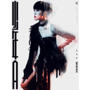<br>陈珊妮2019少年A巡演互動音檔](./albums/2105375728.md) | 其他 | 感觉好极了音乐工作室 | 2019年10月25日 | 现场专辑 | 声效拼贴 Sound Collage |
| [<br>Juvenile A](./albums/2105243291.md) | 国语 | 容合音乐 | 2019年09月13日 | 录音室专辑 |  |
| [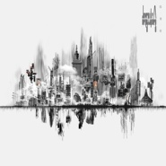<br>你要去哪里Where Are You Headed?](./albums/2105211852.md) | 国语 | 容合音乐 | 2019年08月26日 | EP, 单曲 |  |
| [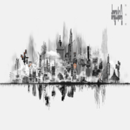<br>你要去哪里ft.许正泰](./albums/5020991965.md) | 国语 |  | 2019年08月26日 | EP, 单曲 | 流行 Pop |
| [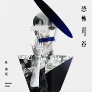<br>恐怖谷Uncanny Valley](./albums/2105019425.md) | 国语 | 容合音乐 | 2019年07月22日 | EP, 单曲 |  |
| [<br>灼人秘密](./albums/2104986244.md) | 国语 | 容合音乐 | 2019年07月10日 | EP, 单曲 |  |
| [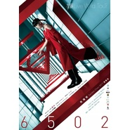<br>6502 演唱會入場限定互動聲音在野呈現](./albums/2102917770.md) | 其他 | 独立发行 | 2017年11月10日 | 原声带, 影视音乐 | 声效拼贴 Sound Collage |
| [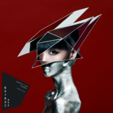<br>战神卡尔迪亚Martial God Cardea](./albums/2102855409.md) | 国语 | 亚神音乐 | 2017年10月03日 | 录音室专辑 | 国语流行 Mandarin Pop, 华语唱作人 Chinese Singer-Songwriter |
| [<br>如同悲伤被下载了两次](./albums/2100181232.md) | 国语 | 亚神音乐 | 2015年09月21日 | 录音室专辑 | 国语流行 Mandarin Pop |
| [<br>MOOV Live 2013 陈珊妮](./albums/496254488.md) | 国语 | PCCW | 2013年12月03日 | 现场专辑 | 国语流行 Mandarin Pop |
| [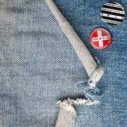<br>低调人生](./albums/2070000755.md) | 国语 | 亚神音乐 | 2013年06月28日 | 录音室专辑 | 独立流行 Indie Pop, 国语流行 Mandarin Pop, 艺术流行 Art Pop |
| [<br>Dear You and The Boy低调人生 预购礼](./albums/1370000676.md) | 国语 | 大乐音乐 | 2013年06月03日 | EP, 单曲 | 根源唱作人 Singer-Songwriter, 国语流行 Mandarin Pop |
| [<br>I Love You, John](./albums/443200.md) | 国语 | 亚神音乐, 大乐音乐 | 2011年06月17日 | 录音室专辑 | 独立电子乐 Indietronica, 电音流行 Electropop |
| [<br>What If It Matters如果有一件事是重要的](./albums/342911.md) | 英语 | SBSi | 2009年08月04日 | 录音室专辑 | 独立流行 Indie Pop |
| [<br>双陈记](./albums/326534.md) | 国语 | 亚神音乐 | 2009年04月28日 | EP, 单曲 |  |
| [<br>如果有一件事是重要的](./albums/309810.md) | 国语 | 亚神音乐 | 2008年11月22日 | 录音室专辑 | 国语流行 Mandarin Pop |
| [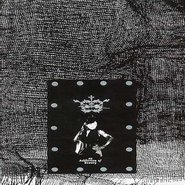<br>美中毒 极限定演唱会](./albums/32422.md) | 国语 | 五四三音乐 | 2005年06月15日 | 现场专辑 | 国语流行 Mandarin Pop |
| [<br>后来 我们都哭了](./albums/7570.md) | 国语 | 五四三音乐 | 2004年10月01日 | 录音室专辑 | 国语流行 Mandarin Pop, 根源唱作人 Singer-Songwriter |
| [<br>Happy Together 二零零三现场作品2003现场作品](./albums/32421.md) | 国语 | 五四三音乐 | 2004年07月16日 | 现场专辑 | 国语流行 Mandarin Pop |
| [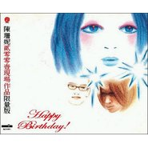<br>2001现场作品限量版](./albums/7573.md) | 国语 | 友善的狗 | 2002年05月18日 | 现场专辑 | 国语流行 Mandarin Pop, 华语唱作人 Chinese Singer-Songwriter |
| [<br>完美的呻吟](./albums/7574.md) | 国语 | 魔岩唱片 | 2000年12月05日 | 录音室专辑 | 华语唱作人 Chinese Singer-Songwriter, 国语流行 Mandarin Pop |
| [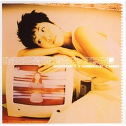<br>我从来不是幽默的女生](./albums/7575.md) | 国语 | 友善的狗 | 1999年05月01日 | 录音室专辑 | 华语唱作人 Chinese Singer-Songwriter, 国语流行 Mandarin Pop |
| [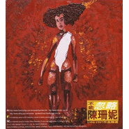<br>不能忽略1994-1997作品精选](./albums/7577.md) | 国语 | 友善的狗 | 1997年07月03日 | 精选集 | 国语流行 Mandarin Pop |
| [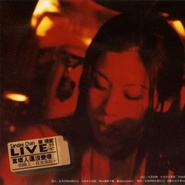<br>当坏人还没变坏的晚上,在女巫店(Live 1997)](./albums/7576.md) | 国语 | 友善的狗 | 1997年06月01日 | 现场专辑 | 国语流行 Mandarin Pop, 华语唱作人 Chinese Singer-Songwriter |
| [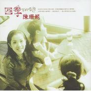<br>四季末的唱游](./albums/7578.md) | 国语 | 友善的狗 | 1996年10月01日 | 录音室专辑 | 国语流行 Mandarin Pop, 华语唱作人 Chinese Singer-Songwriter |
| [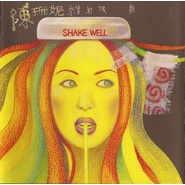<br>乘喷射机离去](./albums/7579.md) | 国语 | 友善的狗 | 1995年10月01日 | 录音室专辑 | 国语流行 Mandarin Pop, 华语唱作人 Chinese Singer-Songwriter |
| [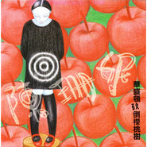<br>华盛顿砍倒樱桃树](./albums/7580.md) | 国语 | 友善的狗 | 1994年05月01日 | 录音室专辑 | 国语流行 Mandarin Pop, 华语唱作人 Chinese Singer-Songwriter |

## 评论

|  |  |  |
| :-- | :-- | :-- |
| <br>[虾米用户](https://emumo.xiami.com/u/104063482)<br>她們甚至很怪很怪<br>2020-12-25 01:39<br>赞(0) 踩(0) | <div>公主我好爱你</div> |
| <br>[虾米用户](https://emumo.xiami.com/u/1440864)<br> <br>2020-08-31 10:15<br>赞(0) 踩(0) | <div>陈珊妮是我心中最伟大的音乐人，不止台湾，不限女性。</div> |
| <br>[虾米用户](https://emumo.xiami.com/u/9062060)<br>此生没拿一个亿来爱虾米是...<br>2020-07-21 11:47<br>赞(0) 踩(0) | <div>喜欢</div> |
| <br>[虾米用户](https://emumo.xiami.com/u/379162683)<br>我想要记住你们，我想要你...<br>2020-07-21 09:18<br>赞(0) 踩(0) | <div></div> |
| <br>[虾米用户](https://emumo.xiami.com/u/49286118)<br>节制的人生<br>2020-07-19 18:49<br>赞(0) 踩(0) | <div>生日快乐</div> |
| <br>[虾米用户](https://emumo.xiami.com/u/324850786)<br>當你我錯過今天 人潮將彼...<br>2020-07-19 10:31<br>赞(0) 踩(0) | <div>生日快乐，黑暗公主</div> |
| <br>[虾米用户](https://emumo.xiami.com/u/257908344)<br>我还没想好要写什么...<br>2020-07-19 10:14<br>赞(0) 踩(0) | <div>生日快乐 今年的金曲奖，冲冲冲 </div> |
| <br>[虾米用户](https://emumo.xiami.com/u/346087991)<br>医路漫漫 音乐为伴<br>2020-07-19 10:13<br>赞(0) 踩(0) | <div></div> |
| <br>[虾米用户](https://emumo.xiami.com/u/362083809)<br>尘归尘<br>2020-07-19 10:06<br>赞(0) 踩(0) | <div>珊妮，生日快乐，要做只快乐的螃蟹哦，感谢遇见。<br><br>2020.07.19</div> |
| <br>[虾米用户](https://emumo.xiami.com/u/12073999)<br>我还没想好要写什么...<br>2020-07-19 10:06<br>赞(0) 踩(0) | <div>生日快乐，自由不死</div> |
| <br>[虾米用户](https://emumo.xiami.com/u/24484310)<br> <br>2020-07-19 10:04<br>赞(0) 踩(0) | <div>公主 生日快乐</div> |
| <br>[虾米用户](https://emumo.xiami.com/u/39119490)<br>倔強少女<br>2020-03-08 23:54<br>赞(3) 踩(0) | <div>陳珊妮圖片集裡的第7張是什麼！！！！！！！！！</div> |
| <br>[虾米用户](https://emumo.xiami.com/u/123246788)<br>Music is my ...<br>2020-02-17 16:04<br>赞(3) 踩(0) | <div>才女！ </div> |
| <br>[虾米用户](https://emumo.xiami.com/u/39119490)<br>倔強少女<br>2020-02-05 16:14<br>赞(2) 踩(0) | <div>陳珊妮，我網路上的媽</div> |
| <br>[虾米用户](https://emumo.xiami.com/u/38086631)<br>版权就和自由一样，永远属...<br>2019-11-23 19:14<br>赞(2) 踩(0) | <div>今天清晨，深蓝色，如同悲伤被下载了两次。多美的音乐，有质感！</div> |
| <br>[虾米用户](https://emumo.xiami.com/u/2796166)<br>最爱莫文蔚.....<br>2019-11-18 00:00<br>赞(3) 踩(0) | <div>加油~~~~~</div> |
| <br>[虾米用户](https://emumo.xiami.com/u/113719412)<br><br>2019-11-07 00:06<br>赞(0) 踩(0) | <div>算是我最喜欢的一首歌了</div> |
| <br>[虾米用户](https://emumo.xiami.com/u/766477)<br>再见了 虾米!<br>2019-10-16 17:19<br>赞(1) 踩(0) | <div>早期的几张怎么听不了 好可惜</div> |
| <br>[虾米用户](https://emumo.xiami.com/u/403075878)<br><br>2019-09-19 18:14<br>赞(1) 踩(0) | <div></div> |
| <br>[虾米用户](https://emumo.xiami.com/u/38492545)<br>无论如何，爱音乐<br>2019-08-26 19:55<br>赞(0) 踩(0) | <div>虾米拉闸了</div> |
| <br>[虾米用户](https://emumo.xiami.com/u/240534305)<br>这家伙很聪明什么也没留下...<br>2019-07-30 16:20<br>赞(0) 踩(0) | <div>珊妮居然只有4位数的粉丝我惊了</div> |
| <br>[虾米用户](https://emumo.xiami.com/u/250735167)<br>善于摧毁，善于报复。<br>2019-07-19 21:05<br>赞(0) 踩(0) | <div>生日快乐</div> |
| <br>[虾米用户](https://emumo.xiami.com/u/48541390)<br>签名神马的该过时了吧<br>2019-07-19 19:30<br>赞(1) 踩(0) | <div>生快生快，有谁不能喜欢陈珊妮呢</div> |
| <br>[虾米用户](https://emumo.xiami.com/u/24484310)<br> <br>2019-07-19 13:34<br>赞(0) 踩(0) | <div>今天是陈珊妮的生日 虾米通知我来写评论表达心意<br>亲爱的公主 永远爱你～</div> |
| <br>[虾米用户](https://emumo.xiami.com/u/396490)<br>如果毫无畏惧，你会怎么做...<br>2019-07-19 12:24<br>赞(0) 踩(0) | <div>生日快乐！公主</div> |
| <br>[虾米用户](https://emumo.xiami.com/u/13120462)<br>声音<br>2019-07-19 10:01<br>赞(0) 踩(0) | <div>公主生日快乐！！！</div> |
| <br>[虾米用户](https://emumo.xiami.com/u/104063482)<br>她們甚至很怪很怪<br>2019-07-01 21:17<br>赞(0) 踩(0) | <div>觉得她最好了</div> |
| <br>[虾米用户](https://emumo.xiami.com/u/9478491)<br>舌尖紋了瑪利亞<br>2019-06-04 00:35<br>赞(0) 踩(0) | <div></div> |
| <br>[虾米用户](https://emumo.xiami.com/u/104063482)<br>她們甚至很怪很怪<br>2019-04-29 23:57<br>赞(1) 踩(0) | <div>不停在变化进步的artist,一直在保持创作活力！看过她的访谈节目讲座和平日的talking,是很有意思和绝对聪明的人。作为女生也迷恋她白花花的大腿,想和她谈恋爱。（即使完全不觉得她结婚了...</div> |
| <br>[虾米用户](https://emumo.xiami.com/u/853523)<br><br>2019-02-16 15:10<br>赞(1) 踩(0) | <div>内容已删除</div> |
| ⇒ | <br>[虾米用户](https://emumo.xiami.com/u/411145213)<br>音乐是一种力量，歌曲闪烁...<br>2019-05-21 20:55<br>赞(0) 踩(0) | <div>ROC是什么鬼？你难道还活在上个世纪呢？现在讲PRC没有错啊</div> |
| <br>[虾米用户](https://emumo.xiami.com/u/2875789)<br>我还没想好要写什么...<br>2019-01-17 00:02<br>赞(0) 踩(0) | <div>她真的很神奇，感觉她写的好音乐永远都听不完～</div> |
| <br>[虾米用户](https://emumo.xiami.com/u/9062060)<br>此生没拿一个亿来爱虾米是...<br>2019-01-06 22:56<br>赞(0) 踩(0) | <div></div> |
| <br>[虾米用户](https://emumo.xiami.com/u/47494497)<br>李志、陈升，“虾米也没有...<br>2018-12-11 01:07<br>赞(3) 踩(0) | <div>可是<br>陈珊妮<br>陈庭妮<br>戴佩妮<br>真的会分不清...</div> |
| ⇒ | <br>[虾米用户](https://emumo.xiami.com/u/304249)<br>我还没想好要写什么...<br>2019-01-02 13:56<br>赞(0) 踩(0) | <div>哈哈哈哈，厉害还是你厉害</div> |
| <br>[虾米用户](https://emumo.xiami.com/u/11235021)<br>纵贯线王菲熊光KOKIA...<br>2018-10-20 11:52<br>赞(0) 踩(0) | <div>【陈珊妮的6502音乐趴】我正在虾米音乐开趴，来和我一起听歌吧 <a href="https://h.xiami.com/music/live-house.html?id=13e1b3c1010000as5w" target="_blank" rel="nofollow noreferrer noopener">https://h.xiami.com/music/live-house.html?id=13e1b3c1010000as5w</a> 分享自@虾米音乐</div> |
| <br>[虾米用户](https://emumo.xiami.com/u/339191478)<br> <br>2018-10-02 21:43<br>赞(0) 踩(0) | <div>❤</div> |
| <br>[虾米用户](https://emumo.xiami.com/u/43187702)<br><br>2018-07-20 11:52<br>赞(0) 踩(0) | <div>生日快乐</div> |
| <br>[虾米用户](https://emumo.xiami.com/u/306397541)<br>我不配得到自由<br>2018-07-19 18:44<br>赞(0) 踩(0) | <div>公主生日快乐</div> |
| <br>[虾米用户](https://emumo.xiami.com/u/195279932)<br>"你坐我身旁，我手里挥着...<br>2018-07-19 12:19<br>赞(0) 踩(0) | <div>生日快乐 </div> |
| <br>[虾米用户](https://emumo.xiami.com/u/336147867)<br>没有翅膀 #相信过程<br>2018-07-19 11:08<br>赞(0) 踩(0) | <div>因为一个姑娘喜欢上陈珊妮的歌，从一开始听不习惯到后来不停的循环，生日快乐</div> |
| <br>[虾米用户](https://emumo.xiami.com/u/2030107)<br>做人最重要是开心嘛！！！<br>2018-07-19 11:08<br>赞(0) 踩(0) | <div>公主 生日快乐！</div> |
| <br>[虾米用户](https://emumo.xiami.com/u/196521819)<br>eat plants f...<br>2018-07-19 10:26<br>赞(0) 踩(0) | <div>公主生日快乐！</div> |
| <br>[虾米用户](https://emumo.xiami.com/u/32125734)<br>weibo：白菜y少女 <br>2018-07-19 10:04<br>赞(0) 踩(0) | <div>生日快乐公主</div> |
| <br>[虾米用户](https://emumo.xiami.com/u/363512141)<br><br>2018-07-19 10:02<br>赞(0) 踩(0) | <div>生日快乐 公主</div> |
| <br>[虾米用户](https://emumo.xiami.com/u/32052730)<br>虾米虾米？<br>2018-07-19 10:01<br>赞(0) 踩(0) | <div>生日快乐公主</div> |
| <br>[虾米用户](https://emumo.xiami.com/u/282387825)<br>我爱的是你爱我<br>2018-07-12 23:57<br>赞(0) 踩(0) | <div>赞赞赞</div> |
| <br>[虾米用户](https://emumo.xiami.com/u/282387825)<br>我爱的是你爱我<br>2018-07-03 02:43<br>赞(1) 踩(0) | <div>没法用语言形容</div> |
| <br>[虾米用户](https://emumo.xiami.com/u/14252639)<br>.<br>2018-06-13 11:03<br>赞(1) 踩(0) | <div>她就是&amp;ldquo;战神&amp;rdquo;阿（努力到死，强大到死</div> |
| <br>[虾米用户](https://emumo.xiami.com/u/348812315)<br>善眼看世界<br>2018-05-31 04:03<br>赞(0) 踩(0) | <div>M so proud of u Dandee.</div> |
| <br>[虾米用户](https://emumo.xiami.com/u/4270604)<br>擅 長 絕 交<br>2018-05-30 23:35<br>赞(1) 踩(0) | <div>我觉得陈珊妮是那种真的很爱自己的人。</div> |
| <br>[虾米用户](https://emumo.xiami.com/u/17146554)<br>weibo：@L1RRO...<br>2018-05-04 07:45<br>赞(0) 踩(0) | <div>❤️</div> |
| <br>[虾米用户](https://emumo.xiami.com/u/45625829)<br>各有各去向，却有笑意共记...<br>2018-04-21 19:57<br>赞(0) 踩(0) | <div>陈珊妮真是太有才华了</div> |
| <br>[虾米用户](https://emumo.xiami.com/u/231387044)<br>听歌是灵魂救赎<br>2018-04-10 14:16<br>赞(0) 踩(0) | <div>不要爱我</div> |
| <br>[虾米用户](https://emumo.xiami.com/u/66823378)<br><br>2018-04-06 23:28<br>赞(0) 踩(0) | <div></div> |
| <br>[虾米用户](https://emumo.xiami.com/u/49286118)<br>节制的人生<br>2018-03-07 22:52<br>赞(1) 踩(0) | <div>這不是我唯一能做的</div> |
| <br>[虾米用户](https://emumo.xiami.com/u/64354810)<br>差强人意。<br>2017-12-25 15:44<br>赞(2) 踩(0) | <div>好喜欢你的歌</div> |
| <br>[虾米用户](https://emumo.xiami.com/u/11737392)<br>音乐是一种生活方式<br>2017-12-18 12:59<br>赞(8) 踩(0) | <div>写了这么多年歌，真的很高产啊！而且质量不减。。相比之下几个男唱作人屡被认为江郎才尽了，没什么突破。</div> |
| <br>[虾米用户](https://emumo.xiami.com/u/9241212)<br><br>2017-12-07 23:30<br>赞(0) 踩(0) | <div>怎么进陈珊妮的趴间啊</div> |
| <br>[虾米用户](https://emumo.xiami.com/u/2915655)<br><br>2017-11-13 21:06<br>赞(0) 踩(0) | <div>转票转12月2日陈珊妮演唱会观众席一张，位置好，朋友因为当天有事去不了原价460，现400转</div> |
| <br>[虾米用户](https://emumo.xiami.com/u/44130392)<br>腹黑没底线<br>2017-10-30 10:04<br>赞(23) 踩(0) | <div>怎么会有人不爱你？你在演唱会上说来听你演唱会的都是孤独鬼，是的，一对对的来，却是分裂的个体。我爱你的特立独行，我爱你的冷清和你盼生命如诗的小心思。我爱你很多年，在每一个夜晚，都有你的歌声陪我一起写稿写日记。每一个字都沾着你歌的香气。缭绕于心。</div> |
| <br>[虾米用户](https://emumo.xiami.com/u/4277910)<br><br>2017-10-28 00:09<br>赞(1) 踩(0) | <div>最近因为新专辑才认识陈珊妮老师的，她的歌很好听</div> |
| <br>[虾米用户](https://emumo.xiami.com/u/3855014)<br><br>2017-10-27 23:58<br>赞(0) 踩(0) | <div>哈哈~~拜金小姐。高一的时候听过一段时间。。。</div> |
| <br>[虾米用户](https://emumo.xiami.com/u/716198)<br><br>2017-10-27 23:37<br>赞(0) 踩(0) | <div><a href="http://m.hulianxk.com/index_show.html?showId=50&amp;referrers=index&amp;agentId=263" target="_blank" rel="nofollow noreferrer noopener">http://m.hulianxk.com/index_show.html?showId=50&amp;referrers=index&amp;agentId=263</a><br>【万有音乐系】陈珊妮“如果悲伤被下载了两次”巡演【北京站】</div> |
| <br>[虾米用户](https://emumo.xiami.com/u/5960246)<br><br>2017-10-27 23:23<br>赞(0) 踩(0) | <div>最近喜欢这个声音。</div> |
| <br>[虾米用户](https://emumo.xiami.com/u/34271220)<br>我还没想好要写什么...<br>2017-10-27 23:11<br>赞(3) 踩(0) | <div>有一些音乐，一段时间隔着不听就会犯瘾得难以自持，非得听一听才算得到了解药。近来是听香料，高中的时候就是陈珊妮。那时候，我们社团的活动室在教学楼的最高一层，里面有大大的地球仪，有多彩的地形模型，选学了两年的地理也是拼。我们社团结束时道了再见，我就带上耳机，陈珊妮。</div> |
| <br>[虾米用户](https://emumo.xiami.com/u/9424698)<br>我还没想好要写什么...<br>2017-10-18 21:08<br>赞(0) 踩(0) | <div>张悬那边不让评论 这是怎么了……</div> |
| <br>[虾米用户](https://emumo.xiami.com/u/264283064)<br>bye <br>2017-10-04 09:22<br>赞(0) 踩(0) | <div>△</div> |
| <br>[虾米用户](https://emumo.xiami.com/u/232159507)<br><br>2017-09-30 22:53<br>赞(0) 踩(0) | <div>迷之高产 </div> |
| ⇒ | <br>[虾米用户](https://emumo.xiami.com/u/4334438)<br>贫穷而倔强<br>2017-10-16 18:55<br>赞(0) 踩(0) | <div>哪里高产了</div> |
| <br>[虾米用户](https://emumo.xiami.com/u/222103448)<br>于一个有猫病的女子<br>2017-09-26 23:47<br>赞(1) 踩(0) | <div>陈珊妮。我偶像的偶像</div> |
| ⇒ | <br>[虾米用户](https://emumo.xiami.com/u/64354810)<br>差强人意。<br>2017-12-25 15:45<br>赞(0) 踩(0) | <div>田馥甄吗？ 我是</div> |
| ⇒ | <br>[虾米用户](https://emumo.xiami.com/u/222103448)<br>于一个有猫病的女子<br>2017-12-26 07:19<br>赞(0) 踩(0) | <div><q><b>π说：</b></q></div> |
| <br>[虾米用户](https://emumo.xiami.com/u/14561312)<br>开口沉默.<br>2017-09-16 23:55<br>赞(1) 踩(0) | <div>已经忘了是从哪年开始听陈珊妮   越听越喜欢</div> |
| <br>[虾米用户](https://emumo.xiami.com/u/182488740)<br>best wishes ...<br>2017-09-12 12:16<br>赞(3) 踩(0) | <div>陈珊妮老师要包揽今年金曲奖最佳音乐录影带来</div> |
| <br>[虾米用户](https://emumo.xiami.com/u/5412030)<br> <br>2017-09-11 00:09<br>赞(0) 踩(0) | <div>#每天都听#</div> |
| <br>[虾米用户](https://emumo.xiami.com/u/150644716)<br>我和我的赘肉，一刻也不能...<br>2017-09-09 03:00<br>赞(2) 踩(0) | <div>歌词垃圾得无与伦比&amp;hellip;&amp;hellip;只有靠意识流的人设卖卖圈内地位</div> |
| ⇒ | <br>[虾米用户](https://emumo.xiami.com/u/5412030)<br> <br>2017-09-11 00:09<br>赞(0) 踩(0) | <div>衮尼马币</div> |
| ⇒ | <br>[虾米用户](https://emumo.xiami.com/u/261486699)<br><br>2018-02-18 07:54<br>赞(0) 踩(0) | <div>能滚？<br>你才是垃圾</div> |
| <br>[虾米用户](https://emumo.xiami.com/u/182488740)<br>best wishes ...<br>2017-08-30 20:31<br>赞(2) 踩(0) | <div>我们比空气更自由<br>比时间更富有</div> |
| <br>[虾米用户](https://emumo.xiami.com/u/24574998)<br><br>2017-08-18 09:59<br>赞(0) 踩(0) | <div>没想好</div> |
| <br>[虾米用户](https://emumo.xiami.com/u/2523233)<br>太热<br>2017-08-17 08:59<br>赞(0) 踩(0) | <div>内容已删除</div> |
| ⇒ | <br>[虾米用户](https://emumo.xiami.com/u/113395806)<br> <br>2017-08-18 13:34<br>赞(0) 踩(0) | <div>难道这位是管公主粉丝团的官博大大吗？</div> |
| <br>[虾米用户](https://emumo.xiami.com/u/38492545)<br>无论如何，爱音乐<br>2017-08-16 21:15<br>赞(0) 踩(0) | <div>视频不存在是什么意思</div> |
| <br>[虾米用户](https://emumo.xiami.com/u/396490)<br>如果毫无畏惧，你会怎么做...<br>2017-08-15 11:43<br>赞(13) 踩(0) | <div>内容已删除</div> |
| ⇒ | <br>[虾米用户](https://emumo.xiami.com/u/32331163)<br>上善若水 我为鱼<br>2017-09-06 10:32<br>赞(0) 踩(0) | <div>听起来感觉完全不一样，说的人也是醉了</div> |
| <br>[虾米用户](https://emumo.xiami.com/u/30219309)<br>ins/cian.yee...<br>2017-08-13 20:17<br>赞(3) 踩(0) | <div>明日新歌「独处」MV上线各位</div> |
| <br>[虾米用户](https://emumo.xiami.com/u/2523233)<br>太热<br>2017-08-12 09:36<br>赞(3) 踩(0) | <div>繼兩年前的「如同悲傷被下載了兩次」專輯後，歌迷敲碗，終於等到陳珊妮預告將推出新專輯，但過程中竟是波折不斷。<br>「日以繼夜的，新專輯快完成了。」陳珊妮近期不時在臉書上與網友分享新專輯籌備進度，也透露過程中，自己的科技設備出現各種異常，包括手機頻死、檔案毀損、筆電暴斃等離奇事件，新專輯資料竟一度「全死」」，但「公主」向來淡定，也默默拿出螺絲起子，把背蓋打開查看硬碟，幸而部分資料已備分。<br>陳珊妮乾脆繼續神秘，釋出秘密暗號「6502」，等她日後揭曉。</div> |
| <br>[虾米用户](https://emumo.xiami.com/u/15036848)<br>no music no ...<br>2017-07-06 23:17<br>赞(3) 踩(0) | <div>只能说欣赏，还没有到喜欢</div> |
| <br>[虾米用户](https://emumo.xiami.com/u/30219309)<br>ins/cian.yee...<br>2017-07-06 12:44<br>赞(0) 踩(0) | <div>要出新专辑了各位</div> |
| ⇒ | <br>[虾米用户](https://emumo.xiami.com/u/4334438)<br>贫穷而倔强<br>2017-07-06 17:12<br>赞(0) 踩(0) | <div>什么时候？</div> |
| ⇒ | <br>[虾米用户](https://emumo.xiami.com/u/30219309)<br>ins/cian.yee...<br>2017-07-06 18:01<br>赞(0) 踩(0) | <div><q><b>秀才说：</b></q></div> |
| <br>[虾米用户](https://emumo.xiami.com/u/20012026)<br>-<br>2017-06-26 03:22<br>赞(18) 踩(0) | <div>很多人因为别人知道公主 有人是林宥嘉 有人是周笔畅 有的是hebe&amp;hellip;对我来说是吴青峰. 公主就是公主 很可爱也很酷 无论怎样认识她 你肯定会喜欢她</div> |
| <br>[虾米用户](https://emumo.xiami.com/u/11359239)<br>欧美纯音乐<br>2017-05-10 22:27<br>赞(0) 踩(0) | <div>好简洁的音效     </div> |
| <br>[虾米用户](https://emumo.xiami.com/u/293057647)<br><br>2017-05-06 18:36<br>赞(6) 踩(0) | <div>因为甄哥知道了陈珊妮</div> |
| ⇒ | <br>[虾米用户](https://emumo.xiami.com/u/64354810)<br>差强人意。<br>2017-12-25 15:46<br>赞(0) 踩(0) | <div>我也是</div> |
| <br>[虾米用户](https://emumo.xiami.com/u/3140019)<br>天马行空<br>2017-04-28 14:46<br>赞(9) 踩(0) | <div>看陳珊妮的照片就是會讓我想起張愛玲</div> |
| ⇒ | <br>[虾米用户](https://emumo.xiami.com/u/4270604)<br>擅 長 絕 交<br>2018-05-31 00:02<br>赞(0) 踩(0) | <div>对！每次在我脑海里她跟张爱玲都是共用一张脸的！！！！</div> |
| ⇒ | <br>[虾米用户](https://emumo.xiami.com/u/9152977)<br>不合群的音谋者。<br>2018-08-24 07:48<br>赞(0) 踩(0) | <div>優雅的復古名伶！舊上海的感覺！！sandee是上海人哈哈</div> |
| <br>[虾米用户](https://emumo.xiami.com/u/283001047)<br>做一个傻子多么好<br>2017-04-15 17:26<br>赞(0) 踩(0) | <div>笔笔的闺密</div> |
| ⇒ | <br>[虾米用户](https://emumo.xiami.com/u/326262)<br><br>2017-04-18 23:20<br>赞(0) 踩(0) | <div>嘿嘿</div> |
| <br>[虾米用户](https://emumo.xiami.com/u/274219991)<br>众生皆苦，你也不能认输。<br>2017-04-09 08:33<br>赞(3) 踩(0) | <div>巨蟹座~ </div> |
| <br>[虾米用户](https://emumo.xiami.com/u/46464728)<br>不浪漫毋宁死<br>2017-03-30 23:41<br>赞(4) 踩(0) | <div>有想法 情绪化 孩子气的女生</div> |
| <br>[虾米用户](https://emumo.xiami.com/u/3140019)<br>天马行空<br>2017-03-25 03:46<br>赞(1) 踩(0) | <div>最闷骚的歌手</div> |
| <br>[虾米用户](https://emumo.xiami.com/u/13110029)<br><br>2017-03-16 17:28<br>赞(0) 踩(0) | <div>找不到 &amp;amp;lt;没用的伞&amp;amp;gt; 录音室版啊T T</div> |
| <br>[虾米用户](https://emumo.xiami.com/u/182488740)<br>best wishes ...<br>2017-03-14 19:20<br>赞(0) 踩(0) | <div></div> |
| <br>[虾米用户](https://emumo.xiami.com/u/85928852)<br>穷极一生 追求快乐<br>2017-02-01 09:25<br>赞(0) 踩(0) | <div>LikeYou陈珊妮</div> |
| <br>[虾米用户](https://emumo.xiami.com/u/266094375)<br>过去我们喜欢新的歌，现在...<br>2017-01-22 17:25<br>赞(0) 踩(0) | <div>突然超喜欢你</div> |
| <br>[虾米用户](https://emumo.xiami.com/u/38492545)<br>无论如何，爱音乐<br>2017-01-07 20:14<br>赞(1) 踩(0) | <div>今年要有新专辑啦</div> |
| <br>[虾米用户](https://emumo.xiami.com/u/68056518)<br>不是很想做人了<br>2016-12-15 00:17<br>赞(0) 踩(0) | <div>情歌  像一首鬼歌  好抑郁</div> |
| <br>[虾米用户](https://emumo.xiami.com/u/35167460)<br>La vie elle ...<br>2016-12-06 06:30<br>赞(1) 踩(0) | <div>《情歌》下架了 </div> |
| <br>[虾米用户](https://emumo.xiami.com/u/9260016)<br>bronze1989ev...<br>2016-11-21 23:28<br>赞(0) 踩(0) | <div>6比</div> |
| <br>[虾米用户](https://emumo.xiami.com/u/229278546)<br><br>2016-11-18 16:06<br>赞(0) 踩(0) | <div> </div> |
| <br>[虾米用户](https://emumo.xiami.com/u/3023023)<br><br>2016-10-21 23:11<br>赞(0) 踩(0) | <div>喜欢的音乐人</div> |
| <br>[虾米用户](https://emumo.xiami.com/u/774208)<br>我还没想好要写什么...<br>2016-09-02 15:40<br>赞(3) 踩(0) | <div>陈珊妮将于10月5日于上海简单生活节演出！<br><br>10月4-6日 上海世博公园 简单生活节<br><br>刘若英、陈绮贞、郑秀文、张震岳、徐佳莹、朴树、李荣浩、许巍、李志、老狼、窦靖童、陈粒、王若琳、赵雷、苏慧伦、陶晶莹、关淑怡、梁博、韦礼安、Faye飞、邱比、陈珊妮 feat 蔡健雅、MATZKA feat A-Lin、魏如萱 feat 马頔、杨乃文 feat 高旗、HUSH feat 阿肆、草东没有派对、万能青年旅店、逃跑计划、好妹妹、旅行团、果味VC、Hello Nico、声音玩具……众星云集！<br><br>微博：@简单生活节上海 <a href="http://weibo.com/simplelifeshanghai" target="_blank" rel="nofollow noreferrer noopener">http://weibo.com/simplelifeshanghai</a></div> |
| ⇒ | <br>[虾米用户](https://emumo.xiami.com/u/132119586)<br><br>2016-09-05 12:39<br>赞(0) 踩(0) | <div>可惜去不了，</div> |
| <br>[虾米用户](https://emumo.xiami.com/u/49748006)<br>Fly me to th...<br>2016-08-28 17:32<br>赞(0) 踩(0) | <div>，</div> |
| <br>[虾米用户](https://emumo.xiami.com/u/97747450)<br>我还没想好要写什么...<br>2016-08-27 15:40<br>赞(1) 踩(0) | <div>3217</div> |
| <br>[虾米用户](https://emumo.xiami.com/u/218577139)<br><br>2016-08-27 12:58<br>赞(0) 踩(0) | <div>还不错，太喜欢了。。。</div> |
| <br>[虾米用户](https://emumo.xiami.com/u/48653415)<br>耳朵越来越挑了<br>2016-08-19 21:00<br>赞(0) 踩(0) | <div>陈珊妮的好多歌，不敢听</div> |
| <br>[虾米用户](https://emumo.xiami.com/u/23443417)<br>shit<br>2016-07-13 14:33<br>赞(1) 踩(0) | <div>实力派</div> |
| <br>[虾米用户](https://emumo.xiami.com/u/36448022)<br>我讨厌我<br>2016-06-18 23:53<br>赞(23) 踩(0) | <div>我实在不喜欢豆瓣上的人说她性冷淡   </div> |
| ⇒ | <br>[虾米用户](https://emumo.xiami.com/u/12985556)<br>暂无签名~<br>2016-11-09 20:33<br>赞(0) 踩(0) | <div>哈哈哈</div> |
| ⇒ | <br>[虾米用户](https://emumo.xiami.com/u/231364557)<br>这家伙很傻什么也没留下....<br>2017-08-22 00:35<br>赞(0) 踩(0) | <div>就是看起来 很冷漠</div> |
| <br>[虾米用户](https://emumo.xiami.com/u/54373639)<br>腦海有風 發膚無損<br>2016-06-10 14:58<br>赞(0) 踩(0) | <div>公主 </div> |
| <br>[虾米用户](https://emumo.xiami.com/u/5434262)<br>暂无签名~<br>2016-06-10 12:17<br>赞(4) 踩(0) | <div>陈珊妮是这种歌手 不会天天想起 但是从来不会忘记 要说你最欣赏的歌手 毫不犹豫她的名字就浮现在脑海</div> |
| <br>[虾米用户](https://emumo.xiami.com/u/45452251)<br><br>2016-05-26 22:45<br>赞(0) 踩(0) | <div>多说一点就失去整个圆</div> |
| <br>[虾米用户](https://emumo.xiami.com/u/49823105)<br>我还没想好要写什么...<br>2016-05-18 23:38<br>赞(0) 踩(0) | <div>歌曲我听不懂</div> |
| <br>[虾米用户](https://emumo.xiami.com/u/7863483)<br>我还没想好要写什么...<br>2016-04-27 12:45<br>赞(2) 踩(0) | <div>曾经陪伴我很多个夜晚的你</div> |
| <br>[虾米用户](https://emumo.xiami.com/u/73638642)<br>再见了各位 我永远爱虾米...<br>2016-04-25 13:32<br>赞(0) 踩(0) | <div>克制.</div> |
| <br>[虾米用户](https://emumo.xiami.com/u/114445128)<br><br>2016-04-06 16:30<br>赞(0) 踩(0) | <div>还不错</div> |
| <br>[虾米用户](https://emumo.xiami.com/u/33009066)<br>豬小小<br>2016-03-27 14:14<br>赞(0) 踩(0) | <div>love</div> |
| <br>[虾米用户](https://emumo.xiami.com/u/83483968)<br>闲下来抽口烟，累了听会音...<br>2016-03-19 08:45<br>赞(0) 踩(0) | <div>难度不小啊。</div> |
| <br>[虾米用户](https://emumo.xiami.com/u/13307683)<br>monsterpiece<br>2016-03-08 01:11<br>赞(0) 踩(0) | <div>随性的音乐</div> |
| <br>[虾米用户](https://emumo.xiami.com/u/180515)<br>心花怒放，开到荼靡。<br>2016-03-05 11:50<br>赞(24) 踩(0) | <div>陈珊妮的歌是种城市里的清醒的无奈的人的清冷的叹息，感慨之后还要背着包袱继续在潮湿的生活里挣扎下去的感觉。<br>在遇到你的那个时候我听不懂她。在你离开之后，在又经历了很多事之后，我突然听懂了。<br>可还是听不懂的那个时候更快乐。</div> |
| <br>[虾米用户](https://emumo.xiami.com/u/43484145)<br><br>2016-01-20 16:28<br>赞(0) 踩(0) | <div>有才华的创作人</div> |
| <br>[虾米用户](https://emumo.xiami.com/u/10692506)<br>现实挡不住想飞的心发芽<br>2016-01-20 12:54<br>赞(1) 踩(0) | <div>下了好多</div> |
| <br>[虾米用户](https://emumo.xiami.com/u/9062060)<br>此生没拿一个亿来爱虾米是...<br>2016-01-13 21:40<br>赞(0) 踩(0) | <div>万年适合晚上一个人or两个人听</div> |
| <br>[虾米用户](https://emumo.xiami.com/u/68630552)<br>This above a...<br>2016-01-05 13:15<br>赞(1) 踩(0) | <div>喜欢她的声音</div> |
| <br>[虾米用户](https://emumo.xiami.com/u/48798391)<br>to fit in，to...<br>2015-12-18 22:23<br>赞(0) 踩(0) | <div>低沉的嗓音，不闹，不喧哗</div> |
| <br>[虾米用户](https://emumo.xiami.com/u/9007451)<br><br>2015-11-19 22:25<br>赞(1) 踩(0) | <div>应该是这些年我唯一喜欢的女歌手了</div> |
| <br>[虾米用户](https://emumo.xiami.com/u/84408894)<br> <br>2015-11-19 14:43<br>赞(1) 踩(0) | <div>喜欢的她的歌她的人，不管是歌还是人都很有魅力</div> |
| <br>[虾米用户](https://emumo.xiami.com/u/84408894)<br> <br>2015-11-19 14:42<br>赞(1) 踩(0) | <div>公主是现在为数不多认真做音乐的人，把音乐当爱好和生活，而不是为了赚钱</div> |
| <br>[虾米用户](https://emumo.xiami.com/u/36477038)<br>啊哈～<br>2015-10-22 14:17<br>赞(0) 踩(0) | <div>hi</div> |
| <br>[虾米用户](https://emumo.xiami.com/u/24806744)<br>嗯<br>2015-10-21 09:21<br>赞(0) 踩(0) | <div>  </div> |
| <br>[虾米用户](https://emumo.xiami.com/u/12130295)<br><br>2015-10-21 08:38<br>赞(0) 踩(0) | <div>201509</div> |
| <br>[虾米用户](https://emumo.xiami.com/u/38801880)<br> <br>2015-10-18 19:13<br>赞(0) 踩(0) | <div>^_^</div> |
| <br>[虾米用户](https://emumo.xiami.com/u/9428281)<br><br>2015-10-15 21:39<br>赞(0) 踩(0) | <div>听听</div> |
| <br>[虾米用户](https://emumo.xiami.com/u/41740929)<br> 今如旧的 昨天比较新<br>2015-10-10 17:08<br>赞(0) 踩(0) | <div>真的 广州有人去吗 陪我去</div> |
| <br>[虾米用户](https://emumo.xiami.com/u/32174991)<br>我还没想好要写什么...<br>2015-10-10 15:42<br>赞(1) 踩(0) | <div>昨天那清華的出來認親！</div> |
| <br>[虾米用户](https://emumo.xiami.com/u/20012026)<br>-<br>2015-10-10 00:06<br>赞(3) 踩(0) | <div>很多人都是孤僻的一个人<br>珊妮公主真的很瘦很美<br>还是一个人去听她的演唱会吧<br>没有拍照没有小视频 就用眼睛和耳朵 听一次小小的难忘的演唱会</div> |
| <br>[虾米用户](https://emumo.xiami.com/u/48828632)<br> <br>2015-10-09 22:57<br>赞(1) 踩(0) | <div>刚从北京演唱会出来，很精彩</div> |
| <br>[虾米用户](https://emumo.xiami.com/u/41740929)<br> 今如旧的 昨天比较新<br>2015-10-09 12:08<br>赞(1) 踩(0) | <div>广州演唱会 有一个人的去吗？我一个人</div> |
| <br>[虾米用户](https://emumo.xiami.com/u/43350137)<br><br>2015-10-08 21:20<br>赞(1) 踩(0) | <div>有思想的音乐</div> |
| <br>[虾米用户](https://emumo.xiami.com/u/1165061)<br>蒙蒙<br>2015-09-28 00:10<br>赞(1) 踩(0) | <div>【台北 9/27 陳珊妮 完整歌單】<br>＊演唱會全程稍後即將在這個頁面上重播 72 小時，歡迎大家繼續收看，並分享給更多朋友。<br>＊下週將有精華版剪輯上線。<br>＊接下來的直播陣容還有 10/8 楊乃文 與 11月 Faye.飛。更多陣容即將陸續公布，請鎖定直播網站 <a href="https://yahoo.streetvoice.com/legacylive/main.html" target="_blank" rel="nofollow noreferrer noopener">https://yahoo.streetvoice.com/legacylive/main.html</a><br><br>01 漫天紛飛的銀杏森林<br>02 遊戲<br>03 我不是在悲傷的想念你<br>04 如同悲傷被下載了兩次 (w/ 林宥嘉）<br>05 低調人生<br>06 如果有一件事是重要的<br>07 一個人<br>08 那日下午<br>09 來不及<br>10 載我回家<br>11 紅眼睛<br>12 完美<br>13 距離<br>14 不睡<br>15 花樣年華<br>16 應該<br>17 To Hebe<br>18 青春<br>19 尼可拉斯<br>20 呻吟<br><br>(Encore)<br>21 I Love You John<br>22 Dear You &amp;amp; the Boy</div> |
| <br>[虾米用户](https://emumo.xiami.com/u/550969)<br>雞翅如我<br>2015-09-17 11:48<br>赞(3) 踩(0) | <div>下张专辑可以取名：每首歌的名字可以再长一些</div> |
| <br>[虾米用户](https://emumo.xiami.com/u/40256175)<br>她。<br>2015-09-16 10:42<br>赞(1) 踩(0) | <div>在公司里，周围很嘈杂，我却听得要哭出来。</div> |
| <br>[虾米用户](https://emumo.xiami.com/u/9606679)<br> <br>2015-09-15 21:32<br>赞(2) 踩(0) | <div>山泥的朋友的歌迷并不有趣。</div> |
| ⇒ | <br>[虾米用户](https://emumo.xiami.com/u/38492545)<br>无论如何，爱音乐<br>2016-07-27 19:11<br>赞(0) 踩(0) | <div>哈哈哈</div> |
| <br>[虾米用户](https://emumo.xiami.com/u/7186919)<br><br>2015-09-14 21:14<br>赞(0) 踩(0) | <div>还是陈珊妮的词好</div> |
| <br>[虾米用户](https://emumo.xiami.com/u/605952)<br><br>2015-09-13 11:46<br>赞(0) 踩(0) | <div>女王和公主的混合体</div> |
| <br>[虾米用户](https://emumo.xiami.com/u/5406466)<br><br>2015-09-09 21:43<br>赞(2) 踩(0) | <div>编曲简直神一样</div> |
| <br>[虾米用户](https://emumo.xiami.com/u/7457475)<br>和你一样爱音乐葎岛电台<br>2015-09-06 14:08<br>赞(2) 踩(0) | <div>公主这张专辑，褪去华丽的乐章，显露文字的美，在图片视频时代，探讨最基本元素文字的重要</div> |
| <br>[虾米用户](https://emumo.xiami.com/u/52557130)<br><br>2015-09-02 00:09<br>赞(0) 踩(0) | <div>低调人生</div> |
| <br>[虾米用户](https://emumo.xiami.com/u/44724810)<br><br>2015-09-01 09:11<br>赞(0) 踩(0) | <div>陈珊妮 帅爆了</div> |
| <br>[虾米用户](https://emumo.xiami.com/u/15790832)<br>xixihehehaha<br>2015-08-31 00:16<br>赞(0) 踩(0) | <div>想听现场</div> |
| <br>[虾米用户](https://emumo.xiami.com/u/18398248)<br>leer<br>2015-08-30 18:17<br>赞(0) 踩(0) | <div>女王。</div> |
| <br>[虾米用户](https://emumo.xiami.com/u/51740549)<br><br>2015-08-27 09:41<br>赞(0) 踩(0) | <div>第一次听是因为失恋33天里面的插曲，很棒</div> |
| <br>[虾米用户](https://emumo.xiami.com/u/54779408)<br><br>2015-08-27 09:33<br>赞(0) 踩(0) | <div>空灵 桑感 女声</div> |
| <br>[虾米用户](https://emumo.xiami.com/u/3787407)<br>梦想家<br>2015-08-27 09:03<br>赞(0) 踩(0) | <div>她的表情很陈珊妮</div> |
| <br>[虾米用户](https://emumo.xiami.com/u/16876753)<br>食草<br>2015-08-26 09:24<br>赞(0) 踩(0) | <div>珊姐是重口小清新</div> |
| <br>[虾米用户](https://emumo.xiami.com/u/12248605)<br>浴乎沂 风乎舞雩 咏而归<br>2015-08-24 22:37<br>赞(0) 踩(0) | <div>亲手破坏了777这个美妙的数字</div> |
| <br>[虾米用户](https://emumo.xiami.com/u/52655676)<br><br>2015-08-24 21:54<br>赞(4) 踩(0) | <div>女神自己唱就好了，为什么非要加个男的进来</div> |
| ⇒ | <br>[虾米用户](https://emumo.xiami.com/u/9606679)<br> <br>2015-08-29 17:18<br>赞(0) 踩(0) | <div>吼</div> |
| ⇒ | <br>[虾米用户](https://emumo.xiami.com/u/9606679)<br> <br>2015-08-29 17:18<br>赞(0) 踩(0) | <div>吼</div> |
| ⇒ | <br>[虾米用户](https://emumo.xiami.com/u/9606679)<br> <br>2015-08-29 17:18<br>赞(0) 踩(0) | <div>吼</div> |
| <br>[虾米用户](https://emumo.xiami.com/u/42818535)<br>暂无签名~<br>2015-08-24 20:59<br>赞(0) 踩(0) | <div>换封面了~</div> |
| <br>[虾米用户](https://emumo.xiami.com/u/7614416)<br>异乡人<br>2015-08-24 15:00<br>赞(2) 踩(0) | <div>才尽</div> |
| <br>[虾米用户](https://emumo.xiami.com/u/52240756)<br>【Cheer】我若不是封...<br>2015-08-20 20:55<br>赞(0) 踩(0) | <div>没有天真！！！</div> |
| <br>[虾米用户](https://emumo.xiami.com/u/9077266)<br><br>2015-08-19 12:05<br>赞(0) 踩(0) | <div>期待新专辑(*^__^*)</div> |
| <br>[虾米用户](https://emumo.xiami.com/u/13552)<br><br>2015-08-18 14:56<br>赞(0) 踩(0) | <div>***</div> |
| <br>[虾米用户](https://emumo.xiami.com/u/9668104)<br>=w=<br>2015-08-17 13:41<br>赞(0) 踩(0) | <div>啊新砖</div> |
| <br>[虾米用户](https://emumo.xiami.com/u/481046)<br><br>2015-08-17 00:12<br>赞(0) 踩(0) | <div>等9月的新专！</div> |
| <br>[虾米用户](https://emumo.xiami.com/u/1380712)<br><br>2015-08-12 23:51<br>赞(0) 踩(0) | <div>终于要来内地开专场了</div> |
| <br>[虾米用户](https://emumo.xiami.com/u/53541560)<br>我想长大<br>2015-08-10 23:16<br>赞(0) 踩(0) | <div>真棒啊</div> |
| <br>[虾米用户](https://emumo.xiami.com/u/53541560)<br>我想长大<br>2015-08-10 23:16<br>赞(0) 踩(0) | <div>还是牛逼</div> |
| <br>[虾米用户](https://emumo.xiami.com/u/12996076)<br>我还没想好要写什么...<br>2015-08-09 19:21<br>赞(1) 踩(0) | <div>10月有演出会～</div> |
| <br>[虾米用户](https://emumo.xiami.com/u/24381227)<br>幻觉与对幻觉的迷恋<br>2015-08-08 21:41<br>赞(1) 踩(0) | <div>如同悲伤被下载了两次</div> |
| <br>[虾米用户](https://emumo.xiami.com/u/17921750)<br> <br>2015-08-08 13:43<br>赞(0) 踩(0) | <div>10月份见！</div> |
| <br>[虾米用户](https://emumo.xiami.com/u/11737392)<br>音乐是一种生活方式<br>2015-08-02 16:00<br>赞(2) 踩(0) | <div>田馥甄的偶像，也不愧为偶像啊！</div> |
| <br>[虾米用户](https://emumo.xiami.com/u/5831599)<br>强硬到自满<br>2015-08-01 21:44<br>赞(1) 踩(0) | <div>新专要出咯 普天同庆 可喜可贺</div> |
| ⇒ | <br>[虾米用户](https://emumo.xiami.com/u/31567857)<br> <br>2015-10-22 09:49<br>赞(0) 踩(0) | <div>Conner哈哈哈</div> |
| <br>[虾米用户](https://emumo.xiami.com/u/11142451)<br><br>2015-07-21 18:31<br>赞(3) 踩(0) | <div>失恋33天算是把情歌捧红了！</div> |
| <br>[虾米用户](https://emumo.xiami.com/u/16049636)<br>暂无签名~<br>2015-07-04 15:00<br>赞(1) 踩(0) | <div>歌写的很棒，声音也很特别</div> |
| <br>[虾米用户](https://emumo.xiami.com/u/22885754)<br>浪子把头都给浪掉了<br>2015-07-04 00:13<br>赞(0) 踩(0) | <div>公主 么么</div> |
| <br>[虾米用户](https://emumo.xiami.com/u/25867992)<br>暂无签名~<br>2015-06-30 19:06<br>赞(2) 踩(0) | <div>哎吖。第一次看见你你和周笔畅合作唱密友。特别的魅惑~</div> |
| <br>[虾米用户](https://emumo.xiami.com/u/8305765)<br>人体ETC<br>2015-06-23 14:51<br>赞(2) 踩(0) | <div>她的歌，一定是越听越有味，越听越无法自拔。</div> |
| <br>[虾米用户](https://emumo.xiami.com/u/4718349)<br><br>2015-06-18 12:00<br>赞(1) 踩(0) | <div>陈珊妮的声音用一个字来形容 我觉得是妖</div> |
| <br>[虾米用户](https://emumo.xiami.com/u/4718349)<br><br>2015-06-18 11:48<br>赞(1) 踩(0) | <div>陈珊妮的声音用一个字来形容 我觉得是 妖</div> |
| <br>[虾米用户](https://emumo.xiami.com/u/4718349)<br><br>2015-06-18 11:40<br>赞(0) 踩(0) | <div>陈珊妮的声音用一个词来形容 我觉得是妖娆</div> |
| <br>[虾米用户](https://emumo.xiami.com/u/50799589)<br>兀=3.1415926…<br>2015-06-17 20:03<br>赞(2) 踩(0) | <div>最喜欢《来不及》和情歌</div> |
| <br>[虾米用户](https://emumo.xiami.com/u/2880357)<br><br>2015-06-10 09:20<br>赞(0) 踩(0) | <div>陈奕迅湿吻的人是她么？</div> |
| <br>[虾米用户](https://emumo.xiami.com/u/43067815)<br> <br>2015-06-07 16:10<br>赞(0) 踩(0) | <div>女王～</div> |
| <br>[虾米用户](https://emumo.xiami.com/u/3549954)<br><br>2015-06-05 10:06<br>赞(0) 踩(0) | <div>今年出新专吗？</div> |
| ⇒ | <br>[虾米用户](https://emumo.xiami.com/u/5831599)<br>强硬到自满<br>2015-06-06 17:46<br>赞(0) 踩(0) | <div>好像出。但是不知道具体什么时候</div> |
| ⇒ | <br>[虾米用户](https://emumo.xiami.com/u/3019455)<br>火烧的寂寞，冷冻的承诺<br>2015-06-11 10:03<br>赞(0) 踩(0) | <div><q><b>ahcrap说：</b></q></div> |
| ⇒ | <br>[虾米用户](https://emumo.xiami.com/u/5831599)<br>强硬到自满<br>2017-10-30 09:51<br>赞(0) 踩(0) | <div><q><b>好战疯子说：</b></q></div> |
| <br>[虾米用户](https://emumo.xiami.com/u/48933540)<br>有此生无憾喵<br>2015-06-02 21:54<br>赞(0) 踩(0) | <div>中毒了</div> |
| <br>[虾米用户](https://emumo.xiami.com/u/2152213)<br><br>2015-05-04 02:23<br>赞(0) 踩(0) | <div>才女~</div> |
| <br>[虾米用户](https://emumo.xiami.com/u/7136876)<br><br>2015-04-19 01:50<br>赞(1) 踩(0) | <div>发现和她一天生日耶</div> |
| ⇒ | <br>[虾米用户](https://emumo.xiami.com/u/18558610)<br><br>2015-08-01 13:55<br>赞(0) 踩(0) | <div>那你也和我一天生日</div> |
| <br>[虾米用户](https://emumo.xiami.com/u/12996076)<br>我还没想好要写什么...<br>2015-04-05 03:10<br>赞(1) 踩(0) | <div>她的词有趣而深刻</div> |
| <br>[虾米用户](https://emumo.xiami.com/u/164565)<br>没有脚的鸟<br>2015-03-13 10:41<br>赞(30) 踩(0) | <div>圈内很多人都怕你，可是音乐节那天突然在酒店看到你，不自觉的就热情的和你打招呼，就像许久没见的老朋友。你看了我一眼，和我示意，自助餐的时候，拿东西吃的时候，突然又看到你，依旧和你say hi，你看着我笑了。你才没有那么冰山呢，而且因为田馥甄的关系，我一点都不怕你。你我生日就差一天，我觉得也许我们很像，那希望我可以有你的才情。</div> |
| ⇒ | <br>[虾米用户](https://emumo.xiami.com/u/310888008)<br>管住自己，天下无敌<br>2018-08-26 10:05<br>赞(0) 踩(0) | <div>厉害了</div> |
| ⇒ | <br>[虾米用户](https://emumo.xiami.com/u/324850786)<br>當你我錯過今天 人潮將彼...<br>2020-07-19 10:32<br>赞(0) 踩(0) | <div>那提前一天祝你生日快乐 </div> |
| <br>[虾米用户](https://emumo.xiami.com/u/7602605)<br>生活深渊里<br>2015-03-11 00:44<br>赞(0) 踩(0) | <div>享受</div> |
| <br>[虾米用户](https://emumo.xiami.com/u/38662280)<br>不懂装懂中度患者<br>2015-03-06 21:38<br>赞(1) 踩(0) | <div>并非一遍就抓耳的音乐，但自有时间来沉淀出老唱片的金色流淌</div> |
| <br>[虾米用户](https://emumo.xiami.com/u/43957799)<br>我爱他 却不知道他爱不爱...<br>2015-02-23 19:00<br>赞(0) 踩(0) | <div>我只能说萝卜青菜和有所爱，不太喜欢这种风格</div> |
| <br>[虾米用户](https://emumo.xiami.com/u/5831599)<br>强硬到自满<br>2015-02-15 13:30<br>赞(0) 踩(0) | <div>唯一一个每个专辑包括三场llive都保存在手机里的歌手！即使不常听也不想也不敢删～第一女神</div> |
| <br>[虾米用户](https://emumo.xiami.com/u/45348444)<br>好好说话会死综合症患者<br>2015-02-12 14:15<br>赞(0) 踩(0) | <div>专注爱陈珊妮十几年</div> |
| ⇒ | <br>[虾米用户](https://emumo.xiami.com/u/41772659)<br><br>2015-02-24 12:16<br>赞(0) 踩(0) | <div>me too</div> |
| <br>[虾米用户](https://emumo.xiami.com/u/45695972)<br><br>2015-02-03 14:27<br>赞(1) 踩(0) | <div>真难听</div> |
| ⇒ | <br>[虾米用户](https://emumo.xiami.com/u/8235926)<br>我还没想好要写什么..<br>2015-02-13 23:30<br>赞(0) 踩(0) | <div>你很烦</div> |
| <br>[虾米用户](https://emumo.xiami.com/u/1716769)<br>YO<br>2015-01-29 02:56<br>赞(0) 踩(0) | <div>看了三十三天我才知道是她的歌 sorry</div> |
| <br>[虾米用户](https://emumo.xiami.com/u/9365635)<br>一直往南方开 一直往南方...<br>2015-01-27 16:30<br>赞(0) 踩(0) | <div>她是拉拉吗？</div> |
| <br>[虾米用户](https://emumo.xiami.com/u/21216195)<br>我还没想好要写什么...<br>2015-01-27 04:15<br>赞(0) 踩(0) | <div>她唱歌说话两个声音。对不上号。歌声很细，很甜。平时说话完全不是这样。</div> |
| ⇒ | <br>[虾米用户](https://emumo.xiami.com/u/6819695)<br>我还没想好要写什么...<br>2015-03-27 19:12<br>赞(0) 踩(0) | <div>我反而觉得她说话声音比唱歌还好听些</div> |
| <br>[虾米用户](https://emumo.xiami.com/u/23844697)<br><br>2015-01-10 13:07<br>赞(3) 踩(0) | <div>这是我听过的气最短的歌手。。</div> |
| ⇒ | <br>[虾米用户](https://emumo.xiami.com/u/41772659)<br><br>2015-02-24 12:15<br>赞(0) 踩(0) | <div>她主要是幕后创作</div> |
| <br>[虾米用户](https://emumo.xiami.com/u/6554640)<br>无人赏，自家拍掌，唱得千...<br>2014-12-31 16:48<br>赞(0) 踩(0) | <div>.</div> |
| <br>[虾米用户](https://emumo.xiami.com/u/7531357)<br>一切全是必然。<br>2014-12-27 13:21<br>赞(0) 踩(0) | <div>我想和你唱一首歌。</div> |
| <br>[虾米用户](https://emumo.xiami.com/u/44613128)<br>唯有爱可超越时间空间<br>2014-12-25 17:26<br>赞(0) 踩(0) | <div>谜一样的嗓音，仿佛飘在海上，又像在深蓝色的梦里</div> |
| <br>[虾米用户](https://emumo.xiami.com/u/12151644)<br>bangbang<br>2014-12-21 19:19<br>赞(1) 踩(0) | <div>慵懒</div> |
| <br>[虾米用户](https://emumo.xiami.com/u/9031857)<br>生如夏花~不是如花~<br>2014-12-18 16:18<br>赞(0) 踩(0) | <div>没有理由。</div> |
| <br>[虾米用户](https://emumo.xiami.com/u/15958033)<br><br>2014-11-30 15:00<br>赞(0) 踩(0) | <div>第一次听到来不及，好赞！</div> |
| <br>[虾米用户](https://emumo.xiami.com/u/10904821)<br>小郭侦探社美男助理<br>2014-11-20 04:18<br>赞(8) 踩(0) | <div>比蔡健雅厉害多了啊</div> |
| <br>[虾米用户](https://emumo.xiami.com/u/43294968)<br><br>2014-11-18 09:21<br>赞(1) 踩(0) | <div>听了好几年 常常一夜循环不想听 尤其在异国他乡的冷寂里</div> |
| ⇒ | <br>[虾米用户](https://emumo.xiami.com/u/43294968)<br><br>2014-11-18 09:21<br>赞(0) 踩(0) | <div>不想停 sorry</div> |
| ⇒ | <br>[虾米用户](https://emumo.xiami.com/u/16196)<br><br>2014-12-02 08:48<br>赞(0) 踩(0) | <div><q><b>清角吹寒oO说：</b></q></div> |
| <br>[虾米用户](https://emumo.xiami.com/u/3918485)<br>已经离不开<br>2014-11-13 15:05<br>赞(0) 踩(0) | <div>喜欢淡淡的情歌</div> |
| <br>[虾米用户](https://emumo.xiami.com/u/9196076)<br> <br>2014-11-13 00:37<br>赞(1) 踩(0) | <div>想不到都40多岁了，非常佩服，相当有才气！</div> |
| <br>[虾米用户](https://emumo.xiami.com/u/4314742)<br>暂无签名~<br>2014-11-11 17:25<br>赞(1) 踩(0) | <div>真的应该把她给其他歌手创作的歌都放进来，有好多好多佳作，而且风格很多样，但是旋律又一听就让人觉得是她的手笔</div> |
| <br>[虾米用户](https://emumo.xiami.com/u/13730346)<br>生得悲哀，死得窝囊。。。<br>2014-11-10 18:34<br>赞(1) 踩(0) | <div>第一次听到来不及。。。。</div> |
| <br>[虾米用户](https://emumo.xiami.com/u/39816876)<br>全世界不缺你一个<br>2014-11-03 19:38<br>赞(3) 踩(0) | <div>她唱的歌不对我胃口 但是她写给别人的歌又好好听 奇了怪了</div> |
| ⇒ | <br>[虾米用户](https://emumo.xiami.com/u/47016953)<br>在最美的年华，寻找最好的...<br>2015-02-10 21:08<br>赞(0) 踩(0) | <div>因为她风格的歌她自己唱了，剩下的就给别人唱咯，就是你不喜欢她风格</div> |
| <br>[虾米用户](https://emumo.xiami.com/u/34271220)<br>我还没想好要写什么...<br>2014-10-29 11:42<br>赞(2) 踩(0) | <div>有一些音乐，一段时间隔着不听就会犯瘾得难以自持，非得听一听才算得到了解药。近来是听香料，高中的时候就是陈珊妮。那时候，我们社团的活动室在教学楼的最高一层，里面有大大的地球仪，有多彩的地形模型，选学了两年的地理也是拼。我们社团结束时道了再见，我就带上耳机，陈珊妮。</div> |
| <br>[虾米用户](https://emumo.xiami.com/u/16073766)<br>暂无签名~<br>2014-10-25 19:53<br>赞(1) 踩(0) | <div>看女王出席同志游行，忽然又想起她，女王何日再出新砖？</div> |
| <br>[虾米用户](https://emumo.xiami.com/u/7397144)<br>清歌一片,可惜付与黄昏<br>2014-10-01 21:14<br>赞(0) 踩(0) | <div>特别特别特别好</div> |
| <br>[虾米用户](https://emumo.xiami.com/u/5511863)<br><br>2014-09-26 20:22<br>赞(0) 踩(0) | <div>好喜欢~~~</div> |
| <br>[虾米用户](https://emumo.xiami.com/u/25827473)<br><br>2014-09-18 20:03<br>赞(0) 踩(0) | <div>每次听都能流泪~没有一次例外</div> |
| <br>[虾米用户](https://emumo.xiami.com/u/10866087)<br>宁愿裸体也不穿皮草<br>2014-09-09 13:03<br>赞(3) 踩(0) | <div>一直觉得她的品味和才气 甩出张悬太~多~了~<br>最喜欢她那首乘喷射机离去。当所有的花都遗忘了你睡着的脸 星群在我等速飞行时惊呼坠落<br>最后的足迹被混淆消灭 风把书本吹开第八页第9行 事情就是这样决定了决定了~<br>西瓜成长在沙地里 在最炎热时成熟爆烈 如同你曾经之于我。<br>真的很美好</div> |
| ⇒ | <br>[虾米用户](https://emumo.xiami.com/u/37860314)<br>我还没想好要写什么...<br>2014-09-13 17:32<br>赞(0) 踩(0) | <div>完全正确…张的才气可以说被高估，大多数人只是从张身上找高冷的感觉而不是喜欢她的音乐…</div> |
| ⇒ | <br>[虾米用户](https://emumo.xiami.com/u/15796498)<br><br>2014-09-28 20:07<br>赞(0) 踩(0) | <div>同意，珊妮的音樂與文字都契合度很好，並且相得益彰。張懸音樂上的才氣比文字要遜色太多。</div> |
| ⇒ | <br>[虾米用户](https://emumo.xiami.com/u/17719900)<br>请把我的歌带回你的家<br>2014-10-04 23:41<br>赞(0) 踩(0) | <div>张悬是捧出来的，珊妮是真的有实力~</div> |
| ⇒ | <br>[虾米用户](https://emumo.xiami.com/u/5831599)<br>强硬到自满<br>2015-02-15 13:28<br>赞(0) 踩(0) | <div><q><b>斯文的小笼包说：</b></q></div> |
| ⇒ | <br>[虾米用户](https://emumo.xiami.com/u/10866087)<br>宁愿裸体也不穿皮草<br>2017-10-28 00:13<br>赞(0) 踩(0) | <div><q><b>TAOHs说：</b></q></div> |
| <br>[虾米用户](https://emumo.xiami.com/u/6458871)<br> <br>2014-09-04 17:06<br>赞(0) 踩(0) | <div>这就是姐的新欢啦，哈哈哈</div> |
| <br>[虾米用户](https://emumo.xiami.com/u/9538005)<br>具島直子歌迷<br>2014-09-03 01:08<br>赞(0) 踩(0) | <div>她写的那首应该，也是听到哭</div> |
| <br>[虾米用户](https://emumo.xiami.com/u/10763425)<br><br>2014-09-02 00:42<br>赞(0) 踩(0) | <div>才女，难得的才女</div> |
| <br>[虾米用户](https://emumo.xiami.com/u/38557564)<br>我們都自由自在的吧。<br>2014-08-25 16:40<br>赞(0) 踩(0) | <div>还不错</div> |
| <br>[虾米用户](https://emumo.xiami.com/u/8854264)<br>Hypocrite.<br>2014-08-20 20:51<br>赞(0) 踩(0) | <div>已经不能更帅!</div> |
| <br>[虾米用户](https://emumo.xiami.com/u/39211748)<br>要亢奋！<br>2014-08-19 19:03<br>赞(0) 踩(0) | <div>越听越喜欢</div> |
| <br>[虾米用户](https://emumo.xiami.com/u/20097049)<br> <br>2014-08-19 15:43<br>赞(1) 踩(0) | <div>你给霆锋写的那首香水  真的很好听</div> |
| <br>[虾米用户](https://emumo.xiami.com/u/7829727)<br><br>2014-07-18 17:37<br>赞(1) 踩(0) | <div>有点不爽 最近想听的歌 虾米都纷纷下架~</div> |
| <br>[虾米用户](https://emumo.xiami.com/u/6080264)<br>暂无签名~<br>2014-07-04 23:24<br>赞(0) 踩(0) | <div>独立</div> |
| <br>[虾米用户](https://emumo.xiami.com/u/9520042)<br>你那本不长翻的书里的一片<br>2014-06-26 14:54<br>赞(0) 踩(0) | <div>我们会走到哪里</div> |
| <br>[虾米用户](https://emumo.xiami.com/u/18238002)<br>ilove music....<br>2014-06-20 18:09<br>赞(0) 踩(0) | <div>fgg</div> |
| <br>[虾米用户](https://emumo.xiami.com/u/7733960)<br><br>2014-06-14 23:06<br>赞(4) 踩(0) | <div>听陈珊妮的歌就像抽烟喝酒一样，让人沉迷、无法自拔。是时候该戒了。</div> |
| <br>[虾米用户](https://emumo.xiami.com/u/5530908)<br>不好意思<br>2014-06-06 17:12<br>赞(2) 踩(0) | <div>随性</div> |
| <br>[虾米用户](https://emumo.xiami.com/u/1714356)<br>想想<br>2014-06-03 10:28<br>赞(2) 踩(0) | <div>为什么现在才发现她。。</div> |
| <br>[虾米用户](https://emumo.xiami.com/u/7969855)<br>我还没想好要写什么...<br>2014-05-18 21:22<br>赞(1) 踩(0) | <div>荷尔蒙不正常分泌的时候 一听 如果有一件事是重要的 启示录 看着词屡屡听哭 或者曲到动人处不由地地莞尔一笑 比如 青春 听得越来越懂 好想听陈女神现场！！（为啥第一遍打书名号的内容就显示不出来…</div> |
| <br>[虾米用户](https://emumo.xiami.com/u/7969855)<br>我还没想好要写什么...<br>2014-05-18 21:20<br>赞(1) 踩(0) | <div>荷尔蒙不正常分泌的时候 一听 看着词屡屡听哭 或者曲到动人处不由地地莞尔一笑 比如 听得越来越懂 好想听陈女神现场！！</div> |
| <br>[虾米用户](https://emumo.xiami.com/u/4618898)<br>时如刀割不待人<br>2014-05-12 14:50<br>赞(1) 踩(0) | <div>也许你不记得Nicholas ，也许你不知道香水，谁哭了，投降........没关系，她是陈珊妮，从世纪初开始</div> |
| <br>[虾米用户](https://emumo.xiami.com/u/11488418)<br>与音乐有关<br>2014-05-09 09:45<br>赞(0) 踩(0) | <div>音乐制作人</div> |
| ⇒ | <br>[虾米用户](https://emumo.xiami.com/u/1332653)<br>你可知希望不会来<br>2014-08-18 07:29<br>赞(0) 踩(0) | <div>你也在阿姆吗？</div> |
| ⇒ | <br>[虾米用户](https://emumo.xiami.com/u/11488418)<br>与音乐有关<br>2014-09-15 11:20<br>赞(0) 踩(0) | <div><q><b>大鱼说：</b></q></div> |
| ⇒ | <br>[虾米用户](https://emumo.xiami.com/u/5621908)<br>让纷乱的一切都单纯的低于...<br>2014-10-05 07:18<br>赞(0) 踩(0) | <div><q><b>大鱼说：</b></q></div> |
| ⇒ | <br>[虾米用户](https://emumo.xiami.com/u/1332653)<br>你可知希望不会来<br>2014-10-06 16:53<br>赞(0) 踩(0) | <div><q><b>shaniahan说：</b></q></div> |
| <br>[虾米用户](https://emumo.xiami.com/u/3994487)<br><br>2014-04-18 20:51<br>赞(0) 踩(0) | <div>有点小感觉</div> |
| <br>[虾米用户](https://emumo.xiami.com/u/1240376)<br>暂无签名~<br>2014-04-15 10:20<br>赞(0) 踩(0) | <div>你是我一场好梦。</div> |
| <br>[虾米用户](https://emumo.xiami.com/u/12380191)<br><br>2014-04-14 16:03<br>赞(0) 踩(0) | <div>大爱</div> |
| <br>[虾米用户](https://emumo.xiami.com/u/6586753)<br>冷起来是个迷<br>2014-04-11 19:09<br>赞(0) 踩(0) | <div>来不及</div> |
| <br>[虾米用户](https://emumo.xiami.com/u/8354678)<br><br>2014-04-07 21:16<br>赞(0) 踩(0) | <div>薄如蝉翼的存在</div> |
| <br>[虾米用户](https://emumo.xiami.com/u/10088202)<br><br>2014-03-15 15:45<br>赞(0) 踩(0) | <div>每首歌都让人体会一次人生</div> |
| <br>[虾米用户](https://emumo.xiami.com/u/10276165)<br>......<br>2014-03-14 13:43<br>赞(0) 踩(0) | <div><a href="http://www.liuyangtv.com.cn/bbs/thread-60699-1-1.html" target="_blank" rel="nofollow noreferrer noopener">http://www.liuyangtv.com.cn/bbs/thread-60699-1-1.html</a><br><a href="http://blog.sina.com.cn/s/" target="_blank" rel="nofollow noreferrer noopener">http://blog.sina.com.cn/s/</a>**675d3f140100kzp5.html</div> |
| <br>[虾米用户](https://emumo.xiami.com/u/6034565)<br><br>2014-03-03 12:09<br>赞(0) 踩(0) | <div>喜欢</div> |
| <br>[虾米用户](https://emumo.xiami.com/u/8276787)<br>花开两朵；天各一方。<br>2014-03-03 09:35<br>赞(0) 踩(0) | <div>独立。</div> |
| <br>[虾米用户](https://emumo.xiami.com/u/6115998)<br>我还没想好要写什么...<br>2014-02-10 23:19<br>赞(0) 踩(0) | <div>张悬的声音怎么.......................</div> |
| <br>[虾米用户](https://emumo.xiami.com/u/26052353)<br><br>2014-01-26 17:45<br>赞(0) 踩(0) | <div>歌词</div> |
| <br>[虾米用户](https://emumo.xiami.com/u/9079353)<br>氓之嗤嗤<br>2013-12-31 12:25<br>赞(0) 踩(0) | <div>《你太美丽》</div> |
| <br>[虾米用户](https://emumo.xiami.com/u/11203730)<br><br>2013-12-27 13:41<br>赞(0) 踩(0) | <div>有感觉</div> |
| <br>[虾米用户](https://emumo.xiami.com/u/28720453)<br>我好紧张害怕而且有点想死<br>2013-12-27 08:26<br>赞(1) 踩(0) | <div>歌声跟品味都完美无人可超越的华语女神完美的声音不俗的歌,</div> |
| <br>[虾米用户](https://emumo.xiami.com/u/9398562)<br><br>2013-12-26 13:49<br>赞(0) 踩(0) | <div>暗黑女王。</div> |
| <br>[虾米用户](https://emumo.xiami.com/u/15576437)<br>空 飘<br>2013-12-18 12:53<br>赞(0) 踩(0) | <div>个性独立</div> |
| <br>[虾米用户](https://emumo.xiami.com/u/5528680)<br><br>2013-12-16 18:54<br>赞(0) 踩(0) | <div>那首《肥胖者的悲哀》简直唱到心坎里。</div> |
| <br>[虾米用户](https://emumo.xiami.com/u/3256886)<br><br>2013-12-16 02:36<br>赞(0) 踩(0) | <div>创作一流 唱歌二流~</div> |
| <br>[虾米用户](https://emumo.xiami.com/u/13774401)<br><br>2013-11-17 21:07<br>赞(0) 踩(0) | <div>如果...<br>有一件事是重要的<br>送你的分手禮物6萬5的機車<br>送我自己的機車7萬7<br>希望我們都能堅決往前<br>代價很高的<br>6900x9</div> |
| <br>[虾米用户](https://emumo.xiami.com/u/27207915)<br>感谢每一个音乐人<br>2013-11-14 11:52<br>赞(1) 踩(0) | <div>浮躁的人听到的是做作，沉静的人听到的事温柔</div> |
| <br>[虾米用户](https://emumo.xiami.com/u/12035643)<br>暂无签名~<br>2013-11-13 17:22<br>赞(0) 踩(0) | <div>迷幻电子乐</div> |
| <br>[虾米用户](https://emumo.xiami.com/u/2866724)<br>一大大二大大三大大四大爷<br>2013-11-07 19:30<br>赞(0) 踩(0) | <div>额 出身地 菲律宾 看了简介才知道</div> |
| <br>[虾米用户](https://emumo.xiami.com/u/9306238)<br>一念清静，烈焰城池<br>2013-11-07 11:20<br>赞(0) 踩(0) | <div>陈珊妮是台湾女歌手里面我很喜欢的一个。</div> |
| ⇒ | <br>[虾米用户](https://emumo.xiami.com/u/11427001)<br>流放不可劝止<br>2014-07-31 00:03<br>赞(0) 踩(0) | <div>介绍里不是说生于菲律宾祖籍是上海么</div> |
| <br>[虾米用户](https://emumo.xiami.com/u/572503)<br>游走京城各大liveho...<br>2013-11-04 23:23<br>赞(0) 踩(0) | <div>为啥只有短评，我还想新文之前移一篇旧长文过来呢，看来只有贴链接了。她的创作天马行空，不可方物，从生活的琐杂到社会的浮弊，无一不可入歌，看似信手拈来，却如天外传音。第一张专辑《华盛顿砍倒樱桃树》就已经举重若轻，细微琐事入歌不显滞涩、奇思妙想入歌不嫌突兀，恣意游走如无厚入有间，那种开阖自若的境地，是多少歌者穷一生所不能达的。…“这是整个世纪最凄凉的青春”（《不做梦》），那么，歌者何为？陈珊妮用自己的音乐交出了一份力道十足的答卷。因而也只有陈珊妮可配扛起台湾indie的大旗。……<a href="http://club.ent.sina.com.cn/viewthread.php?tid=435748" target="_blank" rel="nofollow noreferrer noopener">http://club.ent.sina.com.cn/viewthread.php?tid=435748</a></div> |
| <br>[虾米用户](https://emumo.xiami.com/u/331793)<br> <br>2013-10-18 09:43<br>赞(0) 踩(0) | <div>...<br><br>谁有 陈珊妮 10.19 北京 LIVE 的票？知道晚了。<br><br><a href="http://www.xiami.com/group/thread-detail/tid/785496" target="_blank" rel="nofollow noreferrer noopener">http://www.xiami.com/group/thread-detail/tid/785496</a><br><br>...</div> |
| <br>[虾米用户](https://emumo.xiami.com/u/22152627)<br>没啥好说<br>2013-10-10 18:14<br>赞(0) 踩(0) | <div>ohmygod，好和谐</div> |
| <br>[虾米用户](https://emumo.xiami.com/u/1242131)<br> <br>2013-10-07 12:10<br>赞(0) 踩(0) | <div>大爱。看好她。</div> |
| <br>[虾米用户](https://emumo.xiami.com/u/1242131)<br> <br>2013-10-07 11:56<br>赞(0) 踩(0) | <div>看好她。</div> |
| <br>[虾米用户](https://emumo.xiami.com/u/23550489)<br>暂无签名~<br>2013-10-02 22:58<br>赞(0) 踩(0) | <div>公主</div> |
| <br>[虾米用户](https://emumo.xiami.com/u/2429933)<br> <br>2013-10-01 22:27<br>赞(0) 踩(0) | <div>还真的是很喜欢她、</div> |
| <br>[虾米用户](https://emumo.xiami.com/u/587855)<br><br>2013-09-27 09:48<br>赞(0) 踩(0) | <div>来了</div> |
| <br>[虾米用户](https://emumo.xiami.com/u/7388792)<br>痴情听觉的匠人<br>2013-09-06 19:27<br>赞(0) 踩(0) | <div>嚄</div> |
| <br>[虾米用户](https://emumo.xiami.com/u/21287135)<br><br>2013-09-06 14:38<br>赞(0) 踩(0) | <div>很舒服，惬意，自已，不躁动。</div> |
| <br>[虾米用户](https://emumo.xiami.com/u/21039851)<br>武汉美联众邦文化传媒<br>2013-09-06 10:58<br>赞(0) 踩(0) | <div>哎呀  超治愈</div> |
| <br>[虾米用户](https://emumo.xiami.com/u/15831865)<br>音乐是酒，电影是肉，文字...<br>2013-08-26 19:55<br>赞(0) 踩(0) | <div>稍有做做，不过音乐独特无人能复制。</div> |
| <br>[虾米用户](https://emumo.xiami.com/u/4334438)<br>贫穷而倔强<br>2013-08-24 20:49<br>赞(0) 踩(0) | <div>独立女王</div> |
| <br>[虾米用户](https://emumo.xiami.com/u/3687497)<br><br>2013-08-19 00:19<br>赞(0) 踩(0) | <div>超有女王范的公主</div> |
| <br>[虾米用户](https://emumo.xiami.com/u/2301019)<br><br>2013-08-14 21:00<br>赞(0) 踩(0) | <div>有特色</div> |
| <br>[虾米用户](https://emumo.xiami.com/u/18975628)<br><br>2013-08-10 22:20<br>赞(0) 踩(0) | <div>随性～</div> |
| <br>[虾米用户](https://emumo.xiami.com/u/18516014)<br><br>2013-08-06 20:27<br>赞(0) 踩(0) | <div>好聽!!</div> |
| <br>[虾米用户](https://emumo.xiami.com/u/16271447)<br><br>2013-08-03 22:38<br>赞(0) 踩(0) | <div>——陈珊妮。</div> |
| <br>[虾米用户](https://emumo.xiami.com/u/6514098)<br> <br>2013-07-29 08:40<br>赞(0) 踩(0) | <div>有才华，有个性</div> |
| <br>[虾米用户](https://emumo.xiami.com/u/18147372)<br><br>2013-07-28 22:34<br>赞(0) 踩(0) | <div>最有感情的女歌手</div> |
| <br>[虾米用户](https://emumo.xiami.com/u/9049350)<br>太多的念想<br>2013-07-27 18:28<br>赞(0) 踩(0) | <div>喜欢试探~</div> |
| <br>[虾米用户](https://emumo.xiami.com/u/6799452)<br><br>2013-07-19 01:48<br>赞(0) 踩(0) | <div>有调调</div> |
| <br>[虾米用户](https://emumo.xiami.com/u/17212565)<br><br>2013-07-18 21:11<br>赞(0) 踩(0) | <div>听她。</div> |
| <br>[虾米用户](https://emumo.xiami.com/u/17506488)<br><br>2013-07-17 14:51<br>赞(0) 踩(0) | <div>爱</div> |
| <br>[虾米用户](https://emumo.xiami.com/u/1108961)<br>你那一封信 时间是邮差_<br>2013-07-13 02:11<br>赞(0) 踩(0) | <div>太爱陈珊妮</div> |
| <br>[虾米用户](https://emumo.xiami.com/u/6307202)<br><br>2013-07-09 20:06<br>赞(16) 踩(0) | <div>因为先天关节炎的关系，她的双脚都换上了人工关节。<br>她不只一次说她其实不会唱歌，所以她花了好几年的时间磨唱歌的技术，寻找练习音域不广声音不厚的人要如何诠释歌才能好听的方法，她在配唱生花了非常大的努力，她认为音乐不是只有高音和耍花腔，而是长达一整张专辑的概念，要融合编曲和词曲才是音乐。</div> |
| <br>[虾米用户](https://emumo.xiami.com/u/9323909)<br>暂无签名~<br>2013-07-09 12:35<br>赞(0) 踩(0) | <div>吼吼</div> |
| <br>[虾米用户](https://emumo.xiami.com/u/605952)<br><br>2013-07-05 15:45<br>赞(0) 踩(0) | <div>独特但又不是很小众的一个歌手</div> |
| <br>[虾米用户](https://emumo.xiami.com/u/874332)<br>虾米要关站，再见各位！<br>2013-07-05 00:35<br>赞(0) 踩(0) | <div>新专辑三星了，陈小姐。</div> |
| <br>[虾米用户](https://emumo.xiami.com/u/2322277)<br><br>2013-07-04 09:11<br>赞(0) 踩(0) | <div>怎么没有拜金小姐那张专辑？？？？</div> |
| ⇒ | <br>[虾米用户](https://emumo.xiami.com/u/1182761)<br>松任谷由实的迷弟<br>2013-07-05 17:43<br>赞(0) 踩(0) | <div>直接搜拜金小姐就找得到了，延伸出来的组合并不收录在个人页面里</div> |
| <br>[虾米用户](https://emumo.xiami.com/u/8547423)<br><br>2013-07-02 15:52<br>赞(0) 踩(0) | <div>硬要选一个最爱 就是她了</div> |
| <br>[虾米用户](https://emumo.xiami.com/u/160585)<br>大音希声色犬马<br>2013-07-02 11:28<br>赞(0) 踩(0) | <div>陈珊妮</div> |
| <br>[虾米用户](https://emumo.xiami.com/u/6457435)<br>過量咖啡因<br>2013-06-30 01:44<br>赞(0) 踩(0) | <div>力挺公主</div> |
| <br>[虾米用户](https://emumo.xiami.com/u/3882789)<br><br>2013-06-29 02:24<br>赞(1) 踩(0) | <div>我们听的是情感，而并非音乐。</div> |
| <br>[虾米用户](https://emumo.xiami.com/u/16056879)<br>苏打绿<br>2013-06-26 22:49<br>赞(0) 踩(0) | <div>珊妮公主的声音很舒服</div> |
| <br>[虾米用户](https://emumo.xiami.com/u/336551)<br>~<br>2013-06-26 10:54<br>赞(0) 踩(0) | <div>奇异而美丽，清新又脱俗。</div> |
| <br>[虾米用户](https://emumo.xiami.com/u/11593830)<br><br>2013-06-23 11:41<br>赞(0) 踩(0) | <div>陈珊妮已然成为一个听众毫不犹豫选择的音乐品牌，会听陈珊妮，只是因为她是陈珊妮</div> |
| <br>[虾米用户](https://emumo.xiami.com/u/7944957)<br><br>2013-06-21 02:32<br>赞(0) 踩(0) | <div>有想法的公主</div> |
| <br>[虾米用户](https://emumo.xiami.com/u/4797846)<br><br>2013-06-11 19:42<br>赞(0) 踩(0) | <div>独立</div> |
| <br>[虾米用户](https://emumo.xiami.com/u/583874)<br><br>2013-06-09 15:05<br>赞(0) 踩(0) | <div>喜欢了十年的华语女歌手</div> |
| <br>[虾米用户](https://emumo.xiami.com/u/1028456)<br><br>2013-06-08 21:14<br>赞(0) 踩(0) | <div>爱公主</div> |
| <br>[虾米用户](https://emumo.xiami.com/u/9982974)<br> <br>2013-06-08 19:10<br>赞(0) 踩(0) | <div>你是我一场好梦 情歌才唱着不松口</div> |
| <br>[虾米用户](https://emumo.xiami.com/u/15649287)<br>我在找。<br>2013-06-07 22:48<br>赞(0) 踩(0) | <div>美好人生。</div> |
| <br>[虾米用户](https://emumo.xiami.com/u/10119615)<br><br>2013-06-07 19:47<br>赞(1) 踩(0) | <div>乍一看好像梅艳芳</div> |
| <br>[虾米用户](https://emumo.xiami.com/u/10270975)<br>好好学习天天向上<br>2013-06-07 18:00<br>赞(0) 踩(0) | <div>喜欢</div> |
| <br>[虾米用户](https://emumo.xiami.com/u/3632201)<br>音乐杂食动物<br>2013-06-07 17:27<br>赞(0) 踩(0) | <div>所有独立、纯真、自我、略有些孩子气、情绪化都是需要才气来支撑的。这是所谓的腹有诗书气自华吧。活法很多，挑清雅的过~~<br>珊妮。。</div> |
| <br>[虾米用户](https://emumo.xiami.com/u/1480564)<br>我还没想好要写什么...<br>2013-06-07 15:04<br>赞(0) 踩(0) | <div>才女</div> |
| <br>[虾米用户](https://emumo.xiami.com/u/11187661)<br><br>2013-06-06 23:43<br>赞(0) 踩(0) | <div>因为情歌</div> |
| <br>[虾米用户](https://emumo.xiami.com/u/3930120)<br>我还没想好要写什么...<br>2013-06-06 22:12<br>赞(0) 踩(0) | <div>爱</div> |
| <br>[虾米用户](https://emumo.xiami.com/u/8029619)<br><br>2013-06-06 19:59<br>赞(0) 踩(0) | <div>love</div> |
| <br>[虾米用户](https://emumo.xiami.com/u/15838522)<br>雨羽<br>2013-06-05 00:32<br>赞(0) 踩(0) | <div>公主的心思細膩極了！</div> |
| <br>[虾米用户](https://emumo.xiami.com/u/1960219)<br><br>2013-06-03 23:23<br>赞(0) 踩(0) | <div>我失恋了</div> |
| <br>[虾米用户](https://emumo.xiami.com/u/7698093)<br><br>2013-05-31 14:27<br>赞(0) 踩(0) | <div>star</div> |
| <br>[虾米用户](https://emumo.xiami.com/u/15516071)<br>Liiiii<br>2013-05-31 10:29<br>赞(0) 踩(0) | <div>就是愛這味! 有個性!</div> |
| <br>[虾米用户](https://emumo.xiami.com/u/3882789)<br><br>2013-05-25 08:14<br>赞(1) 踩(0) | <div>很痛苦的时候一听就烟消云散</div> |
| <br>[虾米用户](https://emumo.xiami.com/u/9430725)<br>当为神所佑<br>2013-05-24 14:47<br>赞(0) 踩(0) | <div>生日哦~</div> |
| <br>[虾米用户](https://emumo.xiami.com/u/971647)<br>这家伙很xx什么也没留下<br>2013-05-23 18:07<br>赞(0) 踩(0) | <div>才女</div> |
| <br>[虾米用户](https://emumo.xiami.com/u/971647)<br>这家伙很xx什么也没留下<br>2013-05-23 17:58<br>赞(0) 踩(0) | <div>花样年华是她写的  啊啊啊啊啊啊   我爱你</div> |
| <br>[虾米用户](https://emumo.xiami.com/u/3765954)<br>装下那片湖<br>2013-05-21 21:16<br>赞(92) 踩(0) | <div>陈珊妮的歌曲，越听越是喜欢，要是一个人听效果更好，一个人可以不受影响的想象出很多的画面，全身飘飘的，中了邪。</div> |
| <br>[虾米用户](https://emumo.xiami.com/u/745483)<br>pseudo-vegan<br>2013-05-21 09:33<br>赞(0) 踩(0) | <div>喜欢短发的sandee</div> |
| <br>[虾米用户](https://emumo.xiami.com/u/5103998)<br>喜欢把情绪糅合到音乐里。<br>2013-05-18 11:30<br>赞(0) 踩(0) | <div>很喜欢啊。另：头像能不能换个！</div> |
| <br>[虾米用户](https://emumo.xiami.com/u/5405913)<br><br>2013-05-14 08:52<br>赞(166) 踩(0) | <div>很有想法但并不是瞎搞的女人。</div> |
| <br>[虾米用户](https://emumo.xiami.com/u/1299493)<br><br>2013-05-11 20:12<br>赞(0) 踩(0) | <div>喜欢公主</div> |
| <br>[虾米用户](https://emumo.xiami.com/u/14816416)<br><br>2013-05-10 00:03<br>赞(0) 踩(0) | <div>風格</div> |
| <br>[虾米用户](https://emumo.xiami.com/u/14360175)<br><br>2013-05-03 21:12<br>赞(0) 踩(0) | <div>我正好也肚子饿，，，，饿？。。。。。。</div> |
| <br>[虾米用户](https://emumo.xiami.com/u/2925823)<br> <br>2013-04-28 10:02<br>赞(0) 踩(0) | <div>期待新专辑《低调人生》</div> |
| <br>[虾米用户](https://emumo.xiami.com/u/815047)<br>音乐让我感动<br>2013-04-19 22:37<br>赞(0) 踩(0) | <div>又喜欢上一个华语女声</div> |
| <br>[虾米用户](https://emumo.xiami.com/u/3435421)<br><br>2013-04-18 14:00<br>赞(0) 踩(0) | <div>安静，不浮夸。</div> |
| <br>[虾米用户](https://emumo.xiami.com/u/13932395)<br><br>2013-04-12 21:08<br>赞(0) 踩(0) | <div>让人感觉有点甜甜的</div> |
| <br>[虾米用户](https://emumo.xiami.com/u/6450586)<br>梦越噪声<br>2013-04-02 21:50<br>赞(0) 踩(0) | <div>生日一样，身高一样，连体重都一样。。。难过听你，开心听你，如果有一件事是最重要的，就是循着梦，优雅的过~~</div> |
| <br>[虾米用户](https://emumo.xiami.com/u/4232735)<br>矿物收藏、时尚礼品<br>2013-03-29 17:59<br>赞(0) 踩(0) | <div>声音好女人。和我爱好的运动一样－－游泳，走路  ：）</div> |
| <br>[虾米用户](https://emumo.xiami.com/u/605952)<br><br>2013-03-29 13:20<br>赞(0) 踩(0) | <div>粉丝还不少</div> |
| <br>[虾米用户](https://emumo.xiami.com/u/13725977)<br><br>2013-03-29 12:44<br>赞(0) 踩(0) | <div>自由不羁，不落俗套！</div> |
| <br>[虾米用户](https://emumo.xiami.com/u/9042626)<br><br>2013-03-28 00:12<br>赞(0) 踩(0) | <div>很久以前就喜欢，因为一首完全不理解的歌，算是一种缘分</div> |
| <br>[虾米用户](https://emumo.xiami.com/u/11552162)<br>强迫症咖啡师，猫癌晚期。<br>2013-03-25 19:06<br>赞(0) 踩(0) | <div>我感觉，好像你还在我房间，不肯离去。</div> |
| <br>[虾米用户](https://emumo.xiami.com/u/3116818)<br><br>2013-03-22 23:34<br>赞(0) 踩(0) | <div>有风格</div> |
| <br>[虾米用户](https://emumo.xiami.com/u/4705853)<br><br>2013-03-19 14:09<br>赞(0) 踩(0) | <div>才女</div> |
| <br>[虾米用户](https://emumo.xiami.com/u/605952)<br><br>2013-03-19 11:06<br>赞(0) 踩(0) | <div>文艺女</div> |
| <br>[虾米用户](https://emumo.xiami.com/u/4162513)<br>要么简单，要么有深度。<br>2013-03-10 16:42<br>赞(0) 踩(0) | <div>很特别的曲调，有些忧伤，有些调皮的，最喜他的情歌。</div> |
| <br>[虾米用户](https://emumo.xiami.com/u/5445994)<br>最爱coldplay<br>2013-03-09 21:32<br>赞(0) 踩(0) | <div>只听过《情歌》不错</div> |
| <br>[虾米用户](https://emumo.xiami.com/u/8157365)<br> <br>2013-03-09 15:55<br>赞(0) 踩(0) | <div>馥甄喜欢，我也喜欢</div> |
| <br>[虾米用户](https://emumo.xiami.com/u/299820)<br><br>2013-03-03 09:54<br>赞(0) 踩(0) | <div>小清新！</div> |
| <br>[虾米用户](https://emumo.xiami.com/u/1950284)<br>溪云初起日沉阁，山雨欲来...<br>2013-03-02 08:37<br>赞(0) 踩(0) | <div>来不及为你唱首情歌。</div> |
| <br>[虾米用户](https://emumo.xiami.com/u/2747251)<br><br>2013-02-13 18:34<br>赞(0) 踩(0) | <div>缺了好几张砖。。</div> |
| <br>[虾米用户](https://emumo.xiami.com/u/12982380)<br><br>2013-02-10 09:35<br>赞(0) 踩(0) | <div>安静</div> |
| <br>[虾米用户](https://emumo.xiami.com/u/2635423)<br>我还没想好要写什么...<br>2013-02-05 00:18<br>赞(0) 踩(0) | <div>如果有一件事是重要的。不想承认，可今晚，的的确确，是一首歌给我的勇气。</div> |
| <br>[虾米用户](https://emumo.xiami.com/u/5616796)<br><br>2013-01-26 11:27<br>赞(0) 踩(0) | <div>肥胖者的悲哀</div> |
| <br>[虾米用户](https://emumo.xiami.com/u/6769973)<br>寻找慰藉旋律 早就上了瘾<br>2013-01-24 20:02<br>赞(0) 踩(0) | <div>喜欢这样的假声</div> |
| <br>[虾米用户](https://emumo.xiami.com/u/4208639)<br><br>2013-01-20 16:33<br>赞(0) 踩(0) | <div>最爱她</div> |
| <br>[虾米用户](https://emumo.xiami.com/u/8724599)<br><br>2013-01-13 18:19<br>赞(0) 踩(0) | <div>你是我的一场好梦 明天一切好说</div> |
| <br>[虾米用户](https://emumo.xiami.com/u/9424543)<br><br>2013-01-07 15:43<br>赞(0) 踩(0) | <div>一个人</div> |
| <br>[虾米用户](https://emumo.xiami.com/u/6550553)<br>我还没想好要写什么...<br>2013-01-01 18:35<br>赞(0) 踩(0) | <div>陈珊妮 --女人肚子饿的时候</div> |
| <br>[虾米用户](https://emumo.xiami.com/u/11619516)<br><br>2012-12-25 10:14<br>赞(0) 踩(0) | <div>不可抗拒</div> |
| <br>[虾米用户](https://emumo.xiami.com/u/11971642)<br><br>2012-12-24 14:00<br>赞(0) 踩(0) | <div>喜欢她是开始于她和左小合唱的那首《当我离开你的时候》，那首《你在烦恼些什么呢 亲爱的》那么好听，居然都没进前十，在我看来真是意外</div> |
| <br>[虾米用户](https://emumo.xiami.com/u/10999993)<br><br>2012-12-21 22:17<br>赞(0) 踩(0) | <div>为什么没有《一个人》</div> |
| <br>[虾米用户](https://emumo.xiami.com/u/5469094)<br><br>2012-12-19 10:12<br>赞(0) 踩(0) | <div>生日快乐~</div> |
| <br>[虾米用户](https://emumo.xiami.com/u/11903695)<br><br>2012-12-15 20:15<br>赞(0) 踩(0) | <div>ss</div> |
| <br>[虾米用户](https://emumo.xiami.com/u/3152851)<br>一只性冷淡的老乌鸦<br>2012-12-08 12:35<br>赞(0) 踩(0) | <div>人生如歌，歌如人生<br>张悬曾说过，歌唱的是生活<br>那么陈珊妮，你的歌又唱的是谁的生活呢</div> |
| <br>[虾米用户](https://emumo.xiami.com/u/11741758)<br><br>2012-12-01 18:05<br>赞(0) 踩(0) | <div>小清新</div> |
| <br>[虾米用户](https://emumo.xiami.com/u/2639592)<br><br>2012-12-01 13:57<br>赞(0) 踩(0) | <div>台湾独立女王啊~！</div> |
| <br>[虾米用户](https://emumo.xiami.com/u/7507339)<br><br>2012-12-01 11:34<br>赞(0) 踩(0) | <div>有自己的style</div> |
| <br>[虾米用户](https://emumo.xiami.com/u/4998523)<br>Moody Jerk<br>2012-11-29 08:13<br>赞(0) 踩(0) | <div>因为一首歌：风景好</div> |
| <br>[虾米用户](https://emumo.xiami.com/u/1661117)<br><br>2012-11-23 16:56<br>赞(0) 踩(0) | <div>清新</div> |
| <br>[虾米用户](https://emumo.xiami.com/u/11467045)<br><br>2012-11-20 21:51<br>赞(0) 踩(0) | <div>好听</div> |
| <br>[虾米用户](https://emumo.xiami.com/u/8916533)<br><br>2012-11-17 11:43<br>赞(0) 踩(0) | <div>喜欢黄色女孩的歌词</div> |
| <br>[虾米用户](https://emumo.xiami.com/u/8313495)<br><br>2012-11-08 01:13<br>赞(0) 踩(0) | <div>才女！！</div> |
| <br>[虾米用户](https://emumo.xiami.com/u/11293668)<br>浮水印<br>2012-11-07 17:48<br>赞(0) 踩(0) | <div>台湾</div> |
| <br>[虾米用户](https://emumo.xiami.com/u/3147268)<br><br>2012-11-06 11:51<br>赞(0) 踩(0) | <div>独立</div> |
| <br>[虾米用户](https://emumo.xiami.com/u/2817623)<br><br>2012-11-03 22:38<br>赞(0) 踩(0) | <div>来不及 送你一程</div> |
| <br>[虾米用户](https://emumo.xiami.com/u/98914)<br>耳朵具有自动过滤歌词功能<br>2012-11-01 20:05<br>赞(0) 踩(0) | <div>喜欢里面的钢琴</div> |
| <br>[虾米用户](https://emumo.xiami.com/u/11218473)<br>晚安。<br>2012-10-30 22:36<br>赞(0) 踩(0) | <div>不喜欢突然的一场雨。</div> |
| <br>[虾米用户](https://emumo.xiami.com/u/11218473)<br>晚安。<br>2012-10-30 22:35<br>赞(0) 踩(0) | <div>就是喜欢。</div> |
| <br>[虾米用户](https://emumo.xiami.com/u/2706428)<br><br>2012-10-30 21:13<br>赞(0) 踩(0) | <div>才华横溢！</div> |
| <br>[虾米用户](https://emumo.xiami.com/u/7285109)<br>爱音乐爱生活<br>2012-10-28 20:57<br>赞(0) 踩(0) | <div>个性</div> |
| <br>[虾米用户](https://emumo.xiami.com/u/7514320)<br><br>2012-10-26 11:42<br>赞(0) 踩(0) | <div>霸气</div> |
| <br>[虾米用户](https://emumo.xiami.com/u/11203277)<br>teletha<br>2012-10-26 01:59<br>赞(0) 踩(0) | <div>~</div> |
| <br>[虾米用户](https://emumo.xiami.com/u/8761021)<br><br>2012-10-25 00:57<br>赞(0) 踩(0) | <div>陈珊妮</div> |
| <br>[虾米用户](https://emumo.xiami.com/u/10435106)<br>听靓歌<br>2012-10-21 16:55<br>赞(0) 踩(0) | <div>喜欢。</div> |
| <br>[虾米用户](https://emumo.xiami.com/u/6148634)<br><br>2012-10-21 13:09<br>赞(0) 踩(0) | <div>852</div> |
| <br>[虾米用户](https://emumo.xiami.com/u/8216219)<br><br>2012-10-18 12:36<br>赞(0) 踩(0) | <div>喜欢</div> |
| <br>[虾米用户](https://emumo.xiami.com/u/7244871)<br><br>2012-10-16 17:37<br>赞(0) 踩(0) | <div>噢</div> |
| <br>[虾米用户](https://emumo.xiami.com/u/7252584)<br>新的梦想<br>2012-10-16 17:02<br>赞(0) 踩(0) | <div>为什么没有拜金小姐那张专辑呢？其实那张挺好的。</div> |
| <br>[虾米用户](https://emumo.xiami.com/u/7441298)<br>HP██░░░░░░░░<br>2012-10-14 16:45<br>赞(0) 踩(0) | <div>因为一首歌，爱上一种声音</div> |
| <br>[虾米用户](https://emumo.xiami.com/u/17153)<br><br>2012-10-13 22:48<br>赞(0) 踩(0) | <div>让人欲罢不能的御姐之声</div> |
| <br>[虾米用户](https://emumo.xiami.com/u/10101326)<br><br>2012-10-13 07:58<br>赞(0) 踩(0) | <div>0.0</div> |
| <br>[虾米用户](https://emumo.xiami.com/u/6444853)<br><br>2012-10-11 20:03<br>赞(0) 踩(0) | <div>这两天疯狂的循环公主跟左小的 那首当我离开你的时候 声音太性感了公主</div> |
| <br>[虾米用户](https://emumo.xiami.com/u/10957996)<br><br>2012-10-07 02:03<br>赞(0) 踩(0) | <div>黑暗公主当之无愧。</div> |
| <br>[虾米用户](https://emumo.xiami.com/u/10604840)<br>活着 die a lon<br>2012-10-05 11:58<br>赞(0) 踩(0) | <div>很实验性，风格很情绪化</div> |
| <br>[虾米用户](https://emumo.xiami.com/u/10930926)<br><br>2012-10-05 04:29<br>赞(0) 踩(0) | <div>很實驗性的女歌手,<br>最喜歡公主呢喃式的唱腔 :)</div> |
| <br>[虾米用户](https://emumo.xiami.com/u/10916037)<br><br>2012-10-03 23:17<br>赞(0) 踩(0) | <div>喜欢珊妮，喜欢这样的女人··</div> |
| <br>[虾米用户](https://emumo.xiami.com/u/5914418)<br><br>2012-10-03 17:08<br>赞(0) 踩(0) | <div>~</div> |
| <br>[虾米用户](https://emumo.xiami.com/u/10602916)<br>橙。<br>2012-09-28 10:39<br>赞(0) 踩(0) | <div>离别曲。</div> |
| <br>[虾米用户](https://emumo.xiami.com/u/4748402)<br><br>2012-09-27 14:28<br>赞(0) 踩(0) | <div>好动人的声音捏</div> |
| <br>[虾米用户](https://emumo.xiami.com/u/10445908)<br>额。<br>2012-09-25 10:38<br>赞(0) 踩(0) | <div>歌词。</div> |
| <br>[虾米用户](https://emumo.xiami.com/u/10561280)<br><br>2012-09-21 19:43<br>赞(0) 踩(0) | <div>喜欢是一种感觉。</div> |
| <br>[虾米用户](https://emumo.xiami.com/u/10435106)<br>听靓歌<br>2012-09-15 01:25<br>赞(0) 踩(0) | <div>不错，好听。</div> |
| <br>[虾米用户](https://emumo.xiami.com/u/3523894)<br>我还没想好要写什么...<br>2012-09-12 21:14<br>赞(0) 踩(0) | <div>有些人，命中注定，兜兜转转，你还是会听她……当时不喜欢的，而今重新认识；当时喜欢的，幸而现在依旧</div> |
| <br>[虾米用户](https://emumo.xiami.com/u/2815151)<br><br>2012-09-05 01:18<br>赞(0) 踩(0) | <div>太有爆發力了 : )</div> |
| <br>[虾米用户](https://emumo.xiami.com/u/2549294)<br><br>2012-09-04 14:26<br>赞(0) 踩(0) | <div>嘿嘿我比她唱得好听 她唱歌不好听 但歌很好听</div> |
| <br>[虾米用户](https://emumo.xiami.com/u/3917323)<br><br>2012-09-04 10:17<br>赞(0) 踩(0) | <div>迷~呢喃低诉。</div> |
| <br>[虾米用户](https://emumo.xiami.com/u/833888)<br><br>2012-09-03 21:27<br>赞(0) 踩(0) | <div>我怎么觉得黄立行从某个角度和她好像呀</div> |
| <br>[虾米用户](https://emumo.xiami.com/u/3919781)<br><br>2012-09-01 09:15<br>赞(0) 踩(0) | <div>情歌OK</div> |
| <br>[虾米用户](https://emumo.xiami.com/u/3878993)<br><br>2012-08-23 21:48<br>赞(0) 踩(0) | <div>在离开的前一天，发现这个歌手-- 1970年的音乐才女，把歌融化你的骨骼里。 尤其那首《情歌》，太伤感了。爱情的确如此伤感得性感，以至于无数才俊虽千万人吾往矣。</div> |
| <br>[虾米用户](https://emumo.xiami.com/u/8826307)<br><br>2012-08-16 09:40<br>赞(0) 踩(0) | <div>超爱。</div> |
| <br>[虾米用户](https://emumo.xiami.com/u/9919716)<br><br>2012-08-15 21:33<br>赞(0) 踩(0) | <div>窗上的猫咪</div> |
| <br>[虾米用户](https://emumo.xiami.com/u/7316359)<br>暂无签名~<br>2012-08-14 03:31<br>赞(0) 踩(0) | <div>個性跟歌聲真的很跳tone</div> |
| <br>[虾米用户](https://emumo.xiami.com/u/8950555)<br>你这撕咬逆天啊！<br>2012-08-12 17:31<br>赞(0) 踩(0) | <div>就听到呻吟和娇喘。</div> |
| <br>[虾米用户](https://emumo.xiami.com/u/4430245)<br>Mare…Cullami...<br>2012-08-09 14:57<br>赞(0) 踩(0) | <div>情歌~~~</div> |
| <br>[虾米用户](https://emumo.xiami.com/u/10053851)<br><br>2012-08-05 15:48<br>赞(0) 踩(0) | <div>nv</div> |
| <br>[虾米用户](https://emumo.xiami.com/u/3426959)<br>老来俏<br>2012-08-05 05:44<br>赞(0) 踩(0) | <div>生日快乐</div> |
| <br>[虾米用户](https://emumo.xiami.com/u/5978723)<br>音乐无界限，快乐永无限！<br>2012-08-04 22:52<br>赞(0) 踩(0) | <div>够清纯</div> |
| <br>[虾米用户](https://emumo.xiami.com/u/9891316)<br><br>2012-08-04 17:02<br>赞(0) 踩(0) | <div>sandee公主</div> |
| <br>[虾米用户](https://emumo.xiami.com/u/10060333)<br> <br>2012-08-03 21:27<br>赞(0) 踩(0) | <div>如果今天失眠'来听吧</div> |
| <br>[虾米用户](https://emumo.xiami.com/u/5578065)<br><br>2012-07-29 13:18<br>赞(0) 踩(0) | <div>独立女王</div> |
| <br>[虾米用户](https://emumo.xiami.com/u/4702934)<br><br>2012-07-24 17:16<br>赞(0) 踩(0) | <div>面包是世界上最好吃的东西^_^</div> |
| <br>[虾米用户](https://emumo.xiami.com/u/7309283)<br><br>2012-07-23 17:07<br>赞(0) 踩(0) | <div>正</div> |
| <br>[虾米用户](https://emumo.xiami.com/u/9832289)<br><br>2012-07-22 17:40<br>赞(0) 踩(0) | <div>你的呓语是我青春期最可怕的毒药。</div> |
| <br>[虾米用户](https://emumo.xiami.com/u/9588796)<br> <br>2012-07-22 11:08<br>赞(0) 踩(0) | <div>很神秘的一个歌手，但声音没的说·~</div> |
| <br>[虾米用户](https://emumo.xiami.com/u/4490844)<br><br>2012-07-20 11:11<br>赞(0) 踩(0) | <div>才女</div> |
| <br>[虾米用户](https://emumo.xiami.com/u/7447865)<br> <br>2012-07-19 23:15<br>赞(0) 踩(0) | <div>个性</div> |
| <br>[虾米用户](https://emumo.xiami.com/u/9328944)<br> <br>2012-07-19 20:33<br>赞(0) 踩(0) | <div>风格，声音和性格。都是我</div> |
| <br>[虾米用户](https://emumo.xiami.com/u/2444439)<br><br>2012-07-19 17:43<br>赞(0) 踩(0) | <div>生日快乐天天快乐！！！</div> |
| <br>[虾米用户](https://emumo.xiami.com/u/4321927)<br><br>2012-07-19 11:27<br>赞(0) 踩(0) | <div>生快~</div> |
| <br>[虾米用户](https://emumo.xiami.com/u/7823837)<br><br>2012-07-18 00:50<br>赞(0) 踩(0) | <div>情歌 太好听了！！！</div> |
| <br>[虾米用户](https://emumo.xiami.com/u/9843564)<br><br>2012-07-17 10:37<br>赞(0) 踩(0) | <div>辣</div> |
| <br>[虾米用户](https://emumo.xiami.com/u/6619432)<br><br>2012-07-16 21:27<br>赞(0) 踩(0) | <div>情歌</div> |
| <br>[虾米用户](https://emumo.xiami.com/u/9135959)<br><br>2012-07-15 01:44<br>赞(0) 踩(0) | <div>陈姗妮</div> |
| <br>[虾米用户](https://emumo.xiami.com/u/9475498)<br><br>2012-07-14 18:46<br>赞(0) 踩(0) | <div>昨天晚上終於見到我親愛的公主本人了，那樣不可一世。</div> |
| <br>[虾米用户](https://emumo.xiami.com/u/9777699)<br>green0566<br>2012-07-12 08:56<br>赞(1) 踩(0) | <div>随便收藏</div> |
| <br>[虾米用户](https://emumo.xiami.com/u/9758775)<br><br>2012-07-10 16:20<br>赞(0) 踩(0) | <div>抵挡不住的女王魅力</div> |
| <br>[虾米用户](https://emumo.xiami.com/u/8906783)<br><br>2012-07-03 19:04<br>赞(0) 踩(0) | <div>舒服</div> |
| <br>[虾米用户](https://emumo.xiami.com/u/2987910)<br><br>2012-06-30 22:01<br>赞(0) 踩(0) | <div>第一次听 很喜欢着感觉</div> |
| <br>[虾米用户](https://emumo.xiami.com/u/9625239)<br>暂无签名～～啦啦～<br>2012-06-29 00:43<br>赞(0) 踩(0) | <div>no why</div> |
| <br>[虾米用户](https://emumo.xiami.com/u/849435)<br>双魚<br>2012-06-23 00:00<br>赞(0) 踩(0) | <div>坐在深圳的吧台上，感觉自己像一轮空虚的月亮</div> |
| <br>[虾米用户](https://emumo.xiami.com/u/8320871)<br><br>2012-06-22 11:17<br>赞(0) 踩(0) | <div>难得</div> |
| <br>[虾米用户](https://emumo.xiami.com/u/9499315)<br><br>2012-06-17 19:45<br>赞(0) 踩(0) | <div>音乐狂</div> |
| <br>[虾米用户](https://emumo.xiami.com/u/9486765)<br><br>2012-06-16 22:17<br>赞(0) 踩(0) | <div>玄妙</div> |
| <br>[虾米用户](https://emumo.xiami.com/u/2753189)<br><br>2012-06-10 09:36<br>赞(0) 踩(0) | <div>今天上午是陈珊妮专场</div> |
| <br>[虾米用户](https://emumo.xiami.com/u/9409591)<br><br>2012-06-08 20:44<br>赞(0) 踩(0) | <div>喜欢</div> |
| <br>[虾米用户](https://emumo.xiami.com/u/8207258)<br>时光的河入海流<br>2012-06-05 00:01<br>赞(0) 踩(0) | <div>就是喜欢</div> |
| <br>[虾米用户](https://emumo.xiami.com/u/230889)<br><br>2012-05-31 21:46<br>赞(1) 踩(0) | <div>情歌。</div> |
| <br>[虾米用户](https://emumo.xiami.com/u/1684165)<br><br>2012-05-30 18:45<br>赞(0) 踩(0) | <div>...</div> |
| <br>[虾米用户](https://emumo.xiami.com/u/9251859)<br><br>2012-05-30 18:38<br>赞(0) 踩(0) | <div>就是喜欢</div> |
| <br>[虾米用户](https://emumo.xiami.com/u/9322311)<br><br>2012-05-29 22:20<br>赞(0) 踩(0) | <div>爱珊妮姐的随性</div> |
| <br>[虾米用户](https://emumo.xiami.com/u/1979354)<br><br>2012-05-27 20:37<br>赞(0) 踩(0) | <div>才女！</div> |
| <br>[虾米用户](https://emumo.xiami.com/u/5952618)<br>吃多想吐<br>2012-05-27 07:35<br>赞(0) 踩(0) | <div>Ｓｏｍｅｔｈｉｎｇ　ｌｉｋｅ　ｙｏｕ</div> |
| <br>[虾米用户](https://emumo.xiami.com/u/6159636)<br><br>2012-05-20 19:12<br>赞(0) 踩(0) | <div>冷艳</div> |
| <br>[虾米用户](https://emumo.xiami.com/u/6878343)<br><br>2012-05-19 14:06<br>赞(0) 踩(0) | <div>内容已删除</div> |
| ⇒ | <br>[虾米用户](https://emumo.xiami.com/u/7235458)<br><br>2012-06-08 19:43<br>赞(0) 踩(0) | <div>我有。留邮箱</div> |
| ⇒ | <br>[虾米用户](https://emumo.xiami.com/u/6878343)<br><br>2012-06-08 21:54<br>赞(0) 踩(0) | <div><q><b>小古说：</b></q></div> |
| <br>[虾米用户](https://emumo.xiami.com/u/1289254)<br><br>2012-05-17 01:25<br>赞(0) 踩(0) | <div>电子，黑色，才女</div> |
| <br>[虾米用户](https://emumo.xiami.com/u/9177847)<br><br>2012-05-15 01:05<br>赞(0) 踩(0) | <div>珊妮姐</div> |
| <br>[虾米用户](https://emumo.xiami.com/u/2258422)<br><br>2012-05-14 11:47<br>赞(0) 踩(0) | <div>自然有特色的声音，自由的感觉</div> |
| <br>[虾米用户](https://emumo.xiami.com/u/8989585)<br><br>2012-05-13 23:36<br>赞(0) 踩(0) | <div>舒服~</div> |
| <br>[虾米用户](https://emumo.xiami.com/u/5479740)<br>暂无签名~<br>2012-05-10 14:45<br>赞(1) 踩(0) | <div>如果在安静时，陈姗妮的声音会让我觉掉进了一种境界中去了</div> |
| <br>[虾米用户](https://emumo.xiami.com/u/9081458)<br><br>2012-05-08 18:46<br>赞(0) 踩(0) | <div>细腻</div> |
| <br>[虾米用户](https://emumo.xiami.com/u/849435)<br>双魚<br>2012-05-05 14:29<br>赞(0) 踩(0) | <div>音樂一消失，<br>莪就不見</div> |
| <br>[虾米用户](https://emumo.xiami.com/u/1737268)<br>我还没想好要写什么...<br>2012-05-04 09:30<br>赞(0) 踩(0) | <div>所有独立、纯真、自我、略有些孩子气、情绪化都是需要才气来支撑的。这是所谓的腹有诗书气自华吧。活法很多，挑清雅的过~~</div> |
| <br>[虾米用户](https://emumo.xiami.com/u/2545319)<br>因为爱所以爱<br>2012-05-03 17:08<br>赞(1) 踩(0) | <div>慢慢听</div> |
| <br>[虾米用户](https://emumo.xiami.com/u/9034711)<br><br>2012-04-30 22:07<br>赞(0) 踩(0) | <div>做自己</div> |
| <br>[虾米用户](https://emumo.xiami.com/u/1737268)<br>我还没想好要写什么...<br>2012-04-28 09:27<br>赞(288) 踩(0) | <div>所有独立、纯真、自我、略有些孩子气、情绪化都是需要才气来支撑的。这是所谓的腹有诗书气自华吧。活法很多，挑清雅的过~~</div> |
| ⇒ | <br>[虾米用户](https://emumo.xiami.com/u/62769150)<br><br>2015-09-10 10:15<br>赞(0) 踩(0) | <div>2法官66轻70777   轻松松说78其实77</div> |
| ⇒ | <br>[虾米用户](https://emumo.xiami.com/u/4321873)<br>民謠搖滾獨立音樂電子爵士<br>2017-03-31 01:03<br>赞(0) 踩(0) | <div>是这么脱俗</div> |
| <br>[虾米用户](https://emumo.xiami.com/u/4731923)<br><br>2012-04-27 13:39<br>赞(0) 踩(0) | <div>爱的调调。</div> |
| <br>[虾米用户](https://emumo.xiami.com/u/6459659)<br><br>2012-04-24 23:09<br>赞(0) 踩(0) | <div>喜欢“青春”</div> |
| <br>[虾米用户](https://emumo.xiami.com/u/608683)<br>姐要瘦成一道闪电⚡️<br>2012-04-24 15:05<br>赞(0) 踩(0) | <div>声音好听</div> |
| <br>[虾米用户](https://emumo.xiami.com/u/288204)<br>四顾，倾听，凝视，默思<br>2012-04-22 12:58<br>赞(1) 踩(0) | <div>相见恨晚。。</div> |
| <br>[虾米用户](https://emumo.xiami.com/u/8941000)<br><br>2012-04-21 21:30<br>赞(0) 踩(0) | <div>独立风很爱</div> |
| <br>[虾米用户](https://emumo.xiami.com/u/7840976)<br><br>2012-04-19 23:01<br>赞(0) 踩(0) | <div>姗妮，声线很美。</div> |
| <br>[虾米用户](https://emumo.xiami.com/u/3791331)<br><br>2012-04-09 14:13<br>赞(1) 踩(0) | <div>天籁之音</div> |
| <br>[虾米用户](https://emumo.xiami.com/u/8483729)<br> <br>2012-04-09 09:45<br>赞(0) 踩(0) | <div>低沉的声音勇敢唱出心中的隐忧和不远面对的角落，让听者更真实面对自我……</div> |
| <br>[虾米用户](https://emumo.xiami.com/u/1254451)<br><br>2012-04-07 15:43<br>赞(0) 踩(0) | <div>越听越有味道的民谣</div> |
| <br>[虾米用户](https://emumo.xiami.com/u/1101114)<br><br>2012-04-06 16:49<br>赞(0) 踩(0) | <div>最喜欢她唱的《情歌》</div> |
| <br>[虾米用户](https://emumo.xiami.com/u/8567958)<br>一个死在回忆里的人<br>2012-04-04 20:31<br>赞(0) 踩(0) | <div>真心才女啊....</div> |
| <br>[虾米用户](https://emumo.xiami.com/u/7608073)<br> <br>2012-03-31 15:30<br>赞(0) 踩(0) | <div>w</div> |
| <br>[虾米用户](https://emumo.xiami.com/u/8675005)<br><br>2012-03-31 15:26<br>赞(0) 踩(0) | <div>很特别的声音和音律仿佛可以听到一个感人的故事</div> |
| <br>[虾米用户](https://emumo.xiami.com/u/403740)<br><br>2012-03-26 09:19<br>赞(0) 踩(0) | <div>喜欢</div> |
| <br>[虾米用户](https://emumo.xiami.com/u/3842059)<br><br>2012-03-25 20:48<br>赞(0) 踩(0) | <div>^^</div> |
| <br>[虾米用户](https://emumo.xiami.com/u/4060418)<br><br>2012-03-22 20:53<br>赞(0) 踩(0) | <div>闲散恬淡</div> |
| <br>[虾米用户](https://emumo.xiami.com/u/8467104)<br>Nothing good...<br>2012-03-21 07:53<br>赞(0) 踩(0) | <div>歌坛老将</div> |
| <br>[虾米用户](https://emumo.xiami.com/u/8423474)<br><br>2012-03-18 15:52<br>赞(0) 踩(0) | <div>喜欢艋舺的音乐</div> |
| <br>[虾米用户](https://emumo.xiami.com/u/3833835)<br><br>2012-03-16 13:31<br>赞(0) 踩(0) | <div>独特</div> |
| <br>[虾米用户](https://emumo.xiami.com/u/6366140)<br><br>2012-03-15 16:17<br>赞(0) 踩(0) | <div>独立 有才能的歌手</div> |
| <br>[虾米用户](https://emumo.xiami.com/u/3480440)<br><br>2012-03-14 20:57<br>赞(0) 踩(0) | <div>个性</div> |
| <br>[虾米用户](https://emumo.xiami.com/u/5514146)<br>我喜欢你，是我独家的记忆<br>2012-03-14 10:01<br>赞(0) 踩(0) | <div>聆听公主的魅力。</div> |
| <br>[虾米用户](https://emumo.xiami.com/u/8363945)<br><br>2012-03-09 23:05<br>赞(0) 踩(0) | <div>轻。。。。。。轻。。。。。。。</div> |
| <br>[虾米用户](https://emumo.xiami.com/u/2253730)<br><br>2012-03-08 11:12<br>赞(0) 踩(0) | <div>anqing</div> |
| <br>[虾米用户](https://emumo.xiami.com/u/8170266)<br>我还没想好要写什么...<br>2012-03-08 03:30<br>赞(0) 踩(0) | <div>最爱情歌</div> |
| <br>[虾米用户](https://emumo.xiami.com/u/17153)<br><br>2012-03-07 21:44<br>赞(0) 踩(0) | <div>后期的作品比较赞</div> |
| <br>[虾米用户](https://emumo.xiami.com/u/5768706)<br>fffff<br>2012-03-06 22:46<br>赞(0) 踩(0) | <div>爱她</div> |
| <br>[虾米用户](https://emumo.xiami.com/u/728285)<br><br>2012-03-05 00:44<br>赞(0) 踩(0) | <div>还可以</div> |
| <br>[虾米用户](https://emumo.xiami.com/u/3020720)<br><br>2012-03-03 22:04<br>赞(0) 踩(0) | <div>,</div> |
| <br>[虾米用户](https://emumo.xiami.com/u/6143669)<br><br>2012-03-03 19:54<br>赞(0) 踩(0) | <div>真是很不错啊，声音很有魔力啊。</div> |
| <br>[虾米用户](https://emumo.xiami.com/u/4138200)<br><br>2012-03-03 15:07<br>赞(0) 踩(0) | <div>声音。</div> |
| <br>[虾米用户](https://emumo.xiami.com/u/8138801)<br> <br>2012-02-28 21:25<br>赞(0) 踩(0) | <div>喜欢她的名字！</div> |
| <br>[虾米用户](https://emumo.xiami.com/u/6484934)<br><br>2012-02-26 14:00<br>赞(0) 踩(0) | <div>好强的妹纸！</div> |
| <br>[虾米用户](https://emumo.xiami.com/u/3826922)<br><br>2012-02-23 14:47<br>赞(0) 踩(0) | <div>迷上了这个内敛的女生</div> |
| ⇒ | <br>[虾米用户](https://emumo.xiami.com/u/106721)<br><br>2012-02-24 16:30<br>赞(0) 踩(0) | <div>这个，很明显的女王范，真不咋内敛。。。</div> |
| <br>[虾米用户](https://emumo.xiami.com/u/8053518)<br><br>2012-02-23 11:56<br>赞(0) 踩(0) | <div>有才，有思想，很早就喜欢了~</div> |
| <br>[虾米用户](https://emumo.xiami.com/u/8141208)<br><br>2012-02-22 15:43<br>赞(0) 踩(0) | <div>·</div> |
| <br>[虾米用户](https://emumo.xiami.com/u/1004606)<br><br>2012-02-22 11:57<br>赞(0) 踩(0) | <div>无法定义 无法预测 无法不爱</div> |
| <br>[虾米用户](https://emumo.xiami.com/u/7655063)<br>盔甲里的我常常泪流满面<br>2012-02-21 23:29<br>赞(0) 踩(0) | <div>总是多变，出人意表！</div> |
| <br>[虾米用户](https://emumo.xiami.com/u/6859433)<br><br>2012-02-20 22:01<br>赞(0) 踩(0) | <div>喜欢就是喜欢</div> |
| <br>[虾米用户](https://emumo.xiami.com/u/244159)<br><br>2012-02-17 22:07<br>赞(0) 踩(0) | <div>因为沉静的回忆</div> |
| <br>[虾米用户](https://emumo.xiami.com/u/6928909)<br>放不下的，就拿着；等到某...<br>2012-02-14 14:24<br>赞(0) 踩(0) | <div>大爱</div> |
| <br>[虾米用户](https://emumo.xiami.com/u/5745391)<br><br>2012-02-13 20:13<br>赞(0) 踩(0) | <div>珊妮呀~来不及......</div> |
| <br>[虾米用户](https://emumo.xiami.com/u/6570730)<br><br>2012-02-10 13:17<br>赞(0) 踩(0) | <div>点绛唇</div> |
| <br>[虾米用户](https://emumo.xiami.com/u/7976436)<br><br>2012-02-10 00:53<br>赞(0) 踩(0) | <div>公主!!!</div> |
| <br>[虾米用户](https://emumo.xiami.com/u/2099511)<br><br>2012-02-08 17:14<br>赞(0) 踩(0) | <div>俄国小说家纳博可夫于1955年所写成的小说--《洛丽塔 ( Lolita )》，描述一名中年教授迷恋上一名十二岁小女孩的故事，Lolita即为这名小女孩的名字，此书当时一度被禁，但现在已成文学中的经典名著，并被蓝灯书屋选为二十世纪英文小说第四名...</div> |
| <br>[虾米用户](https://emumo.xiami.com/u/3093031)<br>好似没时间<br>2012-02-08 16:42<br>赞(0) 踩(0) | <div>有种说不出的感觉 有点和灵魂契合的感觉</div> |
| <br>[虾米用户](https://emumo.xiami.com/u/7961792)<br><br>2012-02-08 13:27<br>赞(0) 踩(0) | <div>带我走出青涩，带我走回青春</div> |
| <br>[虾米用户](https://emumo.xiami.com/u/7905825)<br><br>2012-02-04 11:25<br>赞(0) 踩(0) | <div>堅持個性，玩音樂，同時也兼顧市場</div> |
| <br>[虾米用户](https://emumo.xiami.com/u/999660)<br><br>2012-01-31 19:27<br>赞(0) 踩(0) | <div>陈珊妮，看这名字，以前还以为新人呢，所以对她的歌没有兴趣，后来偶然发现原来是70年的，试着听她的歌，还是蛮喜欢这样的···</div> |
| <br>[虾米用户](https://emumo.xiami.com/u/7823109)<br><br>2012-01-28 20:06<br>赞(0) 踩(0) | <div>懒懒~~</div> |
| <br>[虾米用户](https://emumo.xiami.com/u/5722877)<br> <br>2012-01-26 00:22<br>赞(0) 踩(0) | <div>。</div> |
| <br>[虾米用户](https://emumo.xiami.com/u/2429933)<br> <br>2012-01-25 15:30<br>赞(0) 踩(0) | <div>真的很爱你，</div> |
| <br>[虾米用户](https://emumo.xiami.com/u/7732024)<br><br>2012-01-24 11:54<br>赞(0) 踩(0) | <div>~~~</div> |
| <br>[虾米用户](https://emumo.xiami.com/u/4500291)<br>我还没想好要写什么...<br>2012-01-23 16:17<br>赞(0) 踩(0) | <div>公主</div> |
| <br>[虾米用户](https://emumo.xiami.com/u/6905354)<br><br>2012-01-23 14:00<br>赞(0) 踩(0) | <div>这是一个只能在心情平静的夜里需要你一个字一个字去聆听的歌手。</div> |
| <br>[虾米用户](https://emumo.xiami.com/u/88335)<br><br>2012-01-23 10:32<br>赞(0) 踩(0) | <div>G</div> |
| <br>[虾米用户](https://emumo.xiami.com/u/3052982)<br> <br>2012-01-22 19:21<br>赞(0) 踩(0) | <div>电音女王~~</div> |
| <br>[虾米用户](https://emumo.xiami.com/u/3149919)<br><br>2012-01-22 11:18<br>赞(0) 踩(0) | <div>没什么话好说 喜欢她</div> |
| <br>[虾米用户](https://emumo.xiami.com/u/190144)<br><br>2012-01-20 23:26<br>赞(0) 踩(0) | <div>你太好看！！</div> |
| <br>[虾米用户](https://emumo.xiami.com/u/7169507)<br>alexander<br>2012-01-20 20:43<br>赞(0) 踩(0) | <div>我最爱的女神。</div> |
| <br>[虾米用户](https://emumo.xiami.com/u/7371120)<br>我还没想好要写什么...<br>2012-01-19 16:41<br>赞(0) 踩(0) | <div>爱上她了</div> |
| <br>[虾米用户](https://emumo.xiami.com/u/4323146)<br>那伤人的台词现在听来轻松<br>2012-01-19 10:23<br>赞(0) 踩(0) | <div>她的情歌就没有清晰版的么。。怎么所有的都有杂音啊T^T</div> |
| ⇒ | <br>[虾米用户](https://emumo.xiami.com/u/3731181)<br><br>2012-01-20 20:17<br>赞(0) 踩(0) | <div>它就是这样作曲的……啦。</div> |
| ⇒ | <br>[虾米用户](https://emumo.xiami.com/u/2408525)<br>音乐是寂寞的耳朵<br>2012-01-24 20:35<br>赞(0) 踩(0) | <div>那才棒呢！</div> |
| ⇒ | <br>[虾米用户](https://emumo.xiami.com/u/4323146)<br>那伤人的台词现在听来轻松<br>2012-01-25 14:03<br>赞(0) 踩(0) | <div><q><b>无聊，所谓说：</b></q></div> |
| ⇒ | <br>[虾米用户](https://emumo.xiami.com/u/4323146)<br>那伤人的台词现在听来轻松<br>2012-01-25 14:03<br>赞(0) 踩(0) | <div><q><b>H.先生说：</b></q></div> |
| <br>[虾米用户](https://emumo.xiami.com/u/6921042)<br><br>2012-01-18 23:04<br>赞(0) 踩(0) | <div>《失恋三十三天》插曲，配合画面会有莫名的忧伤</div> |
| <br>[虾米用户](https://emumo.xiami.com/u/4711645)<br>我还没想好要写什么...<br>2012-01-18 18:27<br>赞(0) 踩(0) | <div>青春不错，像是青年人内心的独白。</div> |
| <br>[虾米用户](https://emumo.xiami.com/u/3625598)<br><br>2012-01-17 21:46<br>赞(0) 踩(0) | <div>我又被忽略</div> |
| <br>[虾米用户](https://emumo.xiami.com/u/198576)<br><br>2012-01-17 21:30<br>赞(0) 踩(0) | <div>像作梦</div> |
| <br>[虾米用户](https://emumo.xiami.com/u/1971644)<br><br>2012-01-15 13:37<br>赞(0) 踩(0) | <div>青春不错，像是青年人内心的独白。给轻人轻飘飘的感觉</div> |
| <br>[虾米用户](https://emumo.xiami.com/u/7625386)<br><br>2012-01-12 12:26<br>赞(0) 踩(0) | <div>你是我一场好梦 明天一切好说</div> |
| <br>[虾米用户](https://emumo.xiami.com/u/631655)<br>10年相伴，感谢虾米！<br>2012-01-11 21:57<br>赞(0) 踩(0) | <div>懒洋洋。</div> |
| <br>[虾米用户](https://emumo.xiami.com/u/5544185)<br><br>2012-01-11 14:18<br>赞(0) 踩(0) | <div>内敛的聪明人</div> |
| <br>[虾米用户](https://emumo.xiami.com/u/4395308)<br><br>2012-01-07 13:30<br>赞(0) 踩(0) | <div>很反感什么文艺女王创作女王之类的称号所以从来没有认真听过她的歌。。。</div> |
| ⇒ | <br>[虾米用户](https://emumo.xiami.com/u/1181478)<br>嘿~<br>2012-01-11 09:50<br>赞(0) 踩(0) | <div>可以先听听歌嘛，外界怎么说并不重要。</div> |
| <br>[虾米用户](https://emumo.xiami.com/u/913344)<br><br>2012-01-06 19:43<br>赞(0) 踩(0) | <div>随意慵懒</div> |
| <br>[虾米用户](https://emumo.xiami.com/u/7367720)<br><br>2012-01-05 22:14<br>赞(0) 踩(0) | <div>喜欢这种要倒却在慵懒的悬着的感觉</div> |
| <br>[虾米用户](https://emumo.xiami.com/u/7554951)<br><br>2012-01-05 21:22<br>赞(0) 踩(0) | <div>第一次听，感觉不错</div> |
| <br>[虾米用户](https://emumo.xiami.com/u/6036488)<br><br>2012-01-02 13:27<br>赞(0) 踩(0) | <div>喜欢她的《情歌》</div> |
| <br>[虾米用户](https://emumo.xiami.com/u/5638685)<br>我还没想好要写什么...<br>2011-12-31 13:42<br>赞(0) 踩(0) | <div>喜欢</div> |
| <br>[虾米用户](https://emumo.xiami.com/u/38642)<br><br>2011-12-29 19:45<br>赞(0) 踩(0) | <div>喜欢</div> |
| <br>[虾米用户](https://emumo.xiami.com/u/6320325)<br><br>2011-12-29 03:32<br>赞(0) 踩(0) | <div>听她翻唱的花样年华很喜欢~</div> |
| <br>[虾米用户](https://emumo.xiami.com/u/7416720)<br><br>2011-12-26 22:33<br>赞(0) 踩(0) | <div>你的表情很陈珊妮</div> |
| <br>[虾米用户](https://emumo.xiami.com/u/7387412)<br> <br>2011-12-24 20:13<br>赞(0) 踩(0) | <div>好听就是好听</div> |
| <br>[虾米用户](https://emumo.xiami.com/u/4052616)<br><br>2011-12-23 21:44<br>赞(0) 踩(0) | <div>姗妮公主...</div> |
| <br>[虾米用户](https://emumo.xiami.com/u/6215754)<br><br>2011-12-23 09:22<br>赞(0) 踩(0) | <div>慵懒，自然。。</div> |
| <br>[虾米用户](https://emumo.xiami.com/u/1663692)<br><br>2011-12-22 22:19<br>赞(0) 踩(0) | <div>陈珊妮的声音是“藕断丝连”。</div> |
| <br>[虾米用户](https://emumo.xiami.com/u/7328453)<br><br>2011-12-21 02:11<br>赞(0) 踩(0) | <div>我要你成为也的酒留你在我身体不准走</div> |
| <br>[虾米用户](https://emumo.xiami.com/u/7056749)<br><br>2011-12-17 01:35<br>赞(0) 踩(0) | <div>台湾独立女声</div> |
| <br>[虾米用户](https://emumo.xiami.com/u/6971282)<br> <br>2011-12-16 21:58<br>赞(0) 踩(0) | <div>情歌</div> |
| <br>[虾米用户](https://emumo.xiami.com/u/2691052)<br>且看那青山綠水別來無恙。<br>2011-12-16 12:52<br>赞(0) 踩(0) | <div>清新优质</div> |
| <br>[虾米用户](https://emumo.xiami.com/u/4111307)<br>最后的晚安<br>2011-12-14 00:00<br>赞(0) 踩(0) | <div>没有想到的是当我还在读高一，就有了这 “情歌”，真遗憾没早些认识它！</div> |
| <br>[虾米用户](https://emumo.xiami.com/u/6982598)<br><br>2011-12-12 20:50<br>赞(0) 踩(0) | <div>天籁之音</div> |
| <br>[虾米用户](https://emumo.xiami.com/u/1447137)<br>世界大同<br>2011-12-12 08:41<br>赞(0) 踩(0) | <div>喜欢她的歌</div> |
| <br>[虾米用户](https://emumo.xiami.com/u/7178207)<br> <br>2011-12-11 11:12<br>赞(0) 踩(0) | <div>陈珊妮，是我的菜</div> |
| <br>[虾米用户](https://emumo.xiami.com/u/298511)<br><br>2011-12-10 11:40<br>赞(0) 踩(0) | <div>这人好瘦啊</div> |
| <br>[虾米用户](https://emumo.xiami.com/u/3209909)<br><br>2011-12-09 13:49<br>赞(0) 踩(0) | <div>《失恋33天》 一首【情歌】足以证明她的才华</div> |
| <br>[虾米用户](https://emumo.xiami.com/u/6217026)<br><br>2011-12-09 12:38<br>赞(0) 踩(0) | <div>独特</div> |
| <br>[虾米用户](https://emumo.xiami.com/u/5537564)<br><br>2011-12-08 17:31<br>赞(0) 踩(0) | <div>华语界也有神级人物 毫不逊色</div> |
| <br>[虾米用户](https://emumo.xiami.com/u/645996)<br><br>2011-12-07 22:09<br>赞(0) 踩(0) | <div>你知道，外面并不冷</div> |
| <br>[虾米用户](https://emumo.xiami.com/u/2187738)<br>树梢点头的时候风正走过了<br>2011-12-06 15:52<br>赞(0) 踩(0) | <div>公主大人</div> |
| <br>[虾米用户](https://emumo.xiami.com/u/7114641)<br><br>2011-12-06 00:02<br>赞(0) 踩(0) | <div>才女一枚</div> |
| <br>[虾米用户](https://emumo.xiami.com/u/6465227)<br><br>2011-12-05 19:33<br>赞(0) 踩(0) | <div>珊妮姐走老運<br>不但擔任歌唱選秀賽評審翻紅<br>又勇奪金曲獎<br><br>真是\\[美好人生]<br>!</div> |
| <br>[虾米用户](https://emumo.xiami.com/u/6428263)<br>哭是一朵花笑却像泥巴！<br>2011-12-05 14:49<br>赞(0) 踩(0) | <div>试听</div> |
| <br>[虾米用户](https://emumo.xiami.com/u/329908)<br><br>2011-12-04 16:42<br>赞(0) 踩(0) | <div>情歌美~</div> |
| <br>[虾米用户](https://emumo.xiami.com/u/6721500)<br><br>2011-12-04 14:31<br>赞(0) 踩(0) | <div>迟到了好多年，原来她这么早就开始唱歌了，而我直到《情歌》才认识她。</div> |
| <br>[虾米用户](https://emumo.xiami.com/u/6818037)<br><br>2011-12-02 11:22<br>赞(0) 踩(0) | <div>好听，失恋33天~~~~~~</div> |
| <br>[虾米用户](https://emumo.xiami.com/u/6199789)<br><br>2011-11-30 01:01<br>赞(0) 踩(0) | <div>不错</div> |
| <br>[虾米用户](https://emumo.xiami.com/u/2001520)<br>Song for you...<br>2011-11-29 23:26<br>赞(0) 踩(0) | <div>陪我走~</div> |
| <br>[虾米用户](https://emumo.xiami.com/u/5493637)<br><br>2011-11-28 21:36<br>赞(0) 踩(0) | <div>很好听~~~喜欢哦~~~</div> |
| <br>[虾米用户](https://emumo.xiami.com/u/4010037)<br><br>2011-11-28 13:26<br>赞(0) 踩(0) | <div>00</div> |
| <br>[虾米用户](https://emumo.xiami.com/u/605679)<br><br>2011-11-28 10:39<br>赞(0) 踩(0) | <div>失恋33天</div> |
| <br>[虾米用户](https://emumo.xiami.com/u/2494980)<br><br>2011-11-28 00:41<br>赞(0) 踩(0) | <div>美中毒~</div> |
| <br>[虾米用户](https://emumo.xiami.com/u/6964014)<br><br>2011-11-26 09:40<br>赞(0) 踩(0) | <div>很朦胧的声音，很多时候听上去有种老上海奢靡的感觉，很舒服</div> |
| <br>[虾米用户](https://emumo.xiami.com/u/2632450)<br> <br>2011-11-26 09:25<br>赞(0) 踩(0) | <div>一首情歌。</div> |
| <br>[虾米用户](https://emumo.xiami.com/u/1742546)<br><br>2011-11-23 09:58<br>赞(0) 踩(0) | <div>唉，这女人也不容易啊，一把年纪了……</div> |
| <br>[虾米用户](https://emumo.xiami.com/u/1432710)<br><br>2011-11-22 17:12<br>赞(0) 踩(0) | <div>不错.</div> |
| <br>[虾米用户](https://emumo.xiami.com/u/469851)<br>这世间，唯有梦想和好姑娘...<br>2011-11-22 14:24<br>赞(0) 踩(0) | <div>...</div> |
| <br>[虾米用户](https://emumo.xiami.com/u/1994922)<br><br>2011-11-22 07:39<br>赞(0) 踩(0) | <div>总觉得这个女子了不得啊</div> |
| <br>[虾米用户](https://emumo.xiami.com/u/1855318)<br><br>2011-11-22 01:41<br>赞(0) 踩(0) | <div>通过《失恋33天》认识的。爱上这种缠绵的声音</div> |
| <br>[虾米用户](https://emumo.xiami.com/u/6890736)<br><br>2011-11-21 10:58<br>赞(0) 踩(0) | <div>喜欢很多年</div> |
| <br>[虾米用户](https://emumo.xiami.com/u/5687335)<br><br>2011-11-19 19:57<br>赞(0) 踩(0) | <div>女王</div> |
| <br>[虾米用户](https://emumo.xiami.com/u/4106350)<br><br>2011-11-19 12:01<br>赞(0) 踩(0) | <div>33天里的 那首 情歌啊</div> |
| <br>[虾米用户](https://emumo.xiami.com/u/6811778)<br>不定时抽风<br>2011-11-19 07:53<br>赞(0) 踩(0) | <div>john 很奇怪</div> |
| <br>[虾米用户](https://emumo.xiami.com/u/557450)<br><br>2011-11-17 22:26<br>赞(0) 踩(0) | <div>从“离别曲”开始就已经爱上了你了</div> |
| <br>[虾米用户](https://emumo.xiami.com/u/6815852)<br> <br>2011-11-17 22:23<br>赞(0) 踩(0) | <div>怎么会有人的声音那么饱满，那么美。</div> |
| <br>[虾米用户](https://emumo.xiami.com/u/6679041)<br><br>2011-11-17 12:37<br>赞(0) 踩(0) | <div>很爱的歌。。。</div> |
| <br>[虾米用户](https://emumo.xiami.com/u/3575708)<br>萌萌哒<br>2011-11-17 10:56<br>赞(0) 踩(0) | <div>巨蟹女啊~</div> |
| <br>[虾米用户](https://emumo.xiami.com/u/6815701)<br><br>2011-11-17 00:55<br>赞(0) 踩(0) | <div>迷乱的气质</div> |
| <br>[虾米用户](https://emumo.xiami.com/u/1683527)<br><br>2011-11-17 00:01<br>赞(0) 踩(0) | <div>看到左小与陈珊妮的一个视频，发现很帅气。唱歌也很好听</div> |
| ⇒ | <br>[虾米用户](https://emumo.xiami.com/u/1033781)<br> <br>2011-11-17 21:15<br>赞(0) 踩(0) | <div>哈哈，正在听</div> |
| <br>[虾米用户](https://emumo.xiami.com/u/3960783)<br>Anita 粉丝<br>2011-11-16 17:52<br>赞(0) 踩(0) | <div>上个礼拜看了她的演唱会，距离超近，很帅气，很幽默~~</div> |
| <br>[虾米用户](https://emumo.xiami.com/u/1265040)<br><br>2011-11-16 14:35<br>赞(0) 踩(0) | <div>！</div> |
| <br>[虾米用户](https://emumo.xiami.com/u/6803326)<br><br>2011-11-16 14:02<br>赞(0) 踩(0) | <div>听听</div> |
| <br>[虾米用户](https://emumo.xiami.com/u/1702507)<br><br>2011-11-16 09:23<br>赞(0) 踩(0) | <div>情歌</div> |
| <br>[虾米用户](https://emumo.xiami.com/u/2633100)<br>爱是极之奢华的一件事。<br>2011-11-16 01:28<br>赞(0) 踩(0) | <div>有点儿意思。</div> |
| <br>[虾米用户](https://emumo.xiami.com/u/394893)<br>理想是情人现实是BZ<br>2011-11-15 19:34<br>赞(0) 踩(0) | <div>从“小灰尘”到“无邪气”是一个轮回</div> |
| <br>[虾米用户](https://emumo.xiami.com/u/5572649)<br>我还没想好要写什么...<br>2011-11-15 12:14<br>赞(0) 踩(0) | <div>华语女</div> |
| <br>[虾米用户](https://emumo.xiami.com/u/690357)<br><br>2011-11-14 21:38<br>赞(0) 踩(0) | <div>情歌</div> |
| <br>[虾米用户](https://emumo.xiami.com/u/568317)<br><br>2011-11-14 09:32<br>赞(0) 踩(0) | <div>情歌链接是错的。。</div> |
| <br>[虾米用户](https://emumo.xiami.com/u/2464056)<br><br>2011-11-14 01:39<br>赞(0) 踩(0) | <div>陈珊妮的情歌 一唱出来  瞬间就湿了</div> |
| <br>[虾米用户](https://emumo.xiami.com/u/6650004)<br><br>2011-11-13 23:36<br>赞(0) 踩(0) | <div>公主</div> |
| <br>[虾米用户](https://emumo.xiami.com/u/1646683)<br><br>2011-11-13 14:34<br>赞(0) 踩(0) | <div>黏腻 爱</div> |
| <br>[虾米用户](https://emumo.xiami.com/u/6327800)<br><br>2011-11-13 14:26<br>赞(0) 踩(0) | <div>好听</div> |
| <br>[虾米用户](https://emumo.xiami.com/u/6702906)<br><br>2011-11-13 13:37<br>赞(0) 踩(0) | <div>陳珊妮</div> |
| <br>[虾米用户](https://emumo.xiami.com/u/294840)<br>我还没想好要写什么...<br>2011-11-13 10:35<br>赞(0) 踩(0) | <div>看了失恋33后，陈珊妮的那首情歌就一直在我脑中唱啊唱啊</div> |
| ⇒ | <br>[虾米用户](https://emumo.xiami.com/u/6656087)<br><br>2011-11-15 22:54<br>赞(0) 踩(0) | <div>我也是啊，被迫到电影院看了两遍，耳朵里全是情歌~~</div> |
| <br>[虾米用户](https://emumo.xiami.com/u/6085993)<br> <br>2011-11-13 09:11<br>赞(0) 踩(0) | <div>就是介个女人</div> |
| <br>[虾米用户](https://emumo.xiami.com/u/6645713)<br><br>2011-11-12 23:53<br>赞(0) 踩(0) | <div>一语道破。一针见血。最爱迷乱的公主。【玩虾米,拿震耳之宝出来晒晒.】</div> |
| <br>[虾米用户](https://emumo.xiami.com/u/6717745)<br>不 要 告 别<br>2011-11-10 20:58<br>赞(0) 踩(0) | <div>HI  亲爱的 你在烦恼些什么？</div> |
| <br>[虾米用户](https://emumo.xiami.com/u/762710)<br><br>2011-11-09 18:23<br>赞(0) 踩(0) | <div>因为美好人生 女生们总是这么疯狂</div> |
| <br>[虾米用户](https://emumo.xiami.com/u/5394304)<br>Inner Peace<br>2011-11-09 15:52<br>赞(0) 踩(0) | <div>喜欢她独立才女</div> |
| <br>[虾米用户](https://emumo.xiami.com/u/6634822)<br>go along…be ...<br>2011-11-05 22:01<br>赞(0) 踩(0) | <div>喜欢</div> |
| <br>[虾米用户](https://emumo.xiami.com/u/3278047)<br>天上有星 地上有花 人间...<br>2011-11-01 13:47<br>赞(0) 踩(0) | <div>随意中的自我</div> |
| <br>[虾米用户](https://emumo.xiami.com/u/6230145)<br><br>2011-10-30 22:18<br>赞(0) 踩(0) | <div>独立。</div> |
| <br>[虾米用户](https://emumo.xiami.com/u/3160419)<br><br>2011-10-25 19:37<br>赞(0) 踩(0) | <div>名字有点洋气</div> |
| <br>[虾米用户](https://emumo.xiami.com/u/6163827)<br><br>2011-10-22 19:40<br>赞(0) 踩(0) | <div>她的音乐很特别</div> |
| <br>[虾米用户](https://emumo.xiami.com/u/746292)<br><br>2011-10-21 12:25<br>赞(0) 踩(0) | <div>她的音樂太可愛了!XD</div> |
| <br>[虾米用户](https://emumo.xiami.com/u/6164727)<br>孤傲信徒<br>2011-10-19 00:52<br>赞(0) 踩(0) | <div>影响张悬的人✔</div> |
| <br>[虾米用户](https://emumo.xiami.com/u/6253419)<br><br>2011-10-15 11:49<br>赞(0) 踩(0) | <div>味道</div> |
| <br>[虾米用户](https://emumo.xiami.com/u/4990542)<br><br>2011-10-14 20:27<br>赞(0) 踩(0) | <div>然而，我們無法就這樣乘著噴射機離去。</div> |
| <br>[虾米用户](https://emumo.xiami.com/u/5624135)<br><br>2011-10-14 19:35<br>赞(0) 踩(0) | <div>d</div> |
| <br>[虾米用户](https://emumo.xiami.com/u/3648084)<br>如果小时候有虾米就好了<br>2011-10-13 15:22<br>赞(0) 踩(0) | <div>实力不可置疑，从拜金小姐前就很留意</div> |
| <br>[虾米用户](https://emumo.xiami.com/u/5865097)<br><br>2011-10-11 19:04<br>赞(0) 踩(0) | <div>醉人的诗意</div> |
| <br>[虾米用户](https://emumo.xiami.com/u/4848830)<br><br>2011-10-11 15:17<br>赞(0) 踩(0) | <div>why not</div> |
| <br>[虾米用户](https://emumo.xiami.com/u/4848830)<br><br>2011-10-11 15:15<br>赞(0) 踩(0) | <div>why not</div> |
| <br>[虾米用户](https://emumo.xiami.com/u/4309597)<br><br>2011-10-11 00:37<br>赞(0) 踩(0) | <div>青春是神曲啊</div> |
| <br>[虾米用户](https://emumo.xiami.com/u/6153118)<br><br>2011-10-07 22:31<br>赞(0) 踩(0) | <div>兴趣相投</div> |
| <br>[虾米用户](https://emumo.xiami.com/u/1673461)<br><br>2011-10-04 13:27<br>赞(0) 踩(0) | <div>华丽</div> |
| <br>[虾米用户](https://emumo.xiami.com/u/4451752)<br><br>2011-10-02 20:55<br>赞(0) 踩(0) | <div>听听看</div> |
| <br>[虾米用户](https://emumo.xiami.com/u/5985978)<br><br>2011-09-26 13:31<br>赞(0) 踩(0) | <div>有态度</div> |
| <br>[虾米用户](https://emumo.xiami.com/u/5131805)<br> <br>2011-09-25 11:24<br>赞(0) 踩(0) | <div>喜欢</div> |
| <br>[虾米用户](https://emumo.xiami.com/u/5932886)<br><br>2011-09-24 13:57<br>赞(0) 踩(0) | <div>不错</div> |
| <br>[虾米用户](https://emumo.xiami.com/u/808721)<br><br>2011-09-22 13:17<br>赞(0) 踩(0) | <div>我爱你</div> |
| <br>[虾米用户](https://emumo.xiami.com/u/5757213)<br>如果我出生在1978。<br>2011-09-21 14:05<br>赞(0) 踩(0) | <div>没理由</div> |
| <br>[虾米用户](https://emumo.xiami.com/u/4753409)<br><br>2011-09-19 22:46<br>赞(0) 踩(0) | <div>有特色</div> |
| <br>[虾米用户](https://emumo.xiami.com/u/1565072)<br>巴扎黑<br>2011-09-19 15:17<br>赞(0) 踩(0) | <div>公主大人</div> |
| <br>[虾米用户](https://emumo.xiami.com/u/5866388)<br><br>2011-09-18 04:14<br>赞(0) 踩(0) | <div>她的才华</div> |
| <br>[虾米用户](https://emumo.xiami.com/u/774036)<br>我曾经露宿过dust_2...<br>2011-09-17 13:46<br>赞(0) 踩(0) | <div>有点意思</div> |
| <br>[虾米用户](https://emumo.xiami.com/u/3303748)<br> <br>2011-09-13 22:10<br>赞(0) 踩(0) | <div>晚安，baby````</div> |
| <br>[虾米用户](https://emumo.xiami.com/u/2055186)<br><br>2011-09-13 20:25<br>赞(0) 踩(0) | <div>黑暗公主</div> |
| <br>[虾米用户](https://emumo.xiami.com/u/3076512)<br><br>2011-09-13 15:20<br>赞(0) 踩(0) | <div>陈姗妮</div> |
| <br>[虾米用户](https://emumo.xiami.com/u/118135)<br><br>2011-09-11 21:48<br>赞(0) 踩(0) | <div>这样的歌听多了 人会变得没有斗志！！！</div> |
| <br>[虾米用户](https://emumo.xiami.com/u/5769513)<br><br>2011-09-10 22:38<br>赞(0) 踩(0) | <div>晚安曲，很清新，简单</div> |
| <br>[虾米用户](https://emumo.xiami.com/u/766248)<br>我是谁的他<br>2011-09-10 03:23<br>赞(0) 踩(0) | <div>嗯，因為專輯#I love you ,John#</div> |
| <br>[虾米用户](https://emumo.xiami.com/u/5669749)<br><br>2011-09-10 01:23<br>赞(0) 踩(0) | <div>。</div> |
| <br>[虾米用户](https://emumo.xiami.com/u/3080105)<br><br>2011-09-07 11:07<br>赞(0) 踩(0) | <div>有点懒懒又轻松的曲风，透出是的洒脱和自由</div> |
| <br>[虾米用户](https://emumo.xiami.com/u/3080105)<br><br>2011-09-07 11:06<br>赞(0) 踩(0) | <div>轻松，有点懒懒的声音，透出的是一种洒脱和自由。</div> |
| <br>[虾米用户](https://emumo.xiami.com/u/5669733)<br><br>2011-09-06 21:55<br>赞(0) 踩(0) | <div>实力派</div> |
| <br>[虾米用户](https://emumo.xiami.com/u/3618274)<br> <br>2011-09-06 21:40<br>赞(0) 踩(0) | <div>我从来不是幽默的女生</div> |
| <br>[虾米用户](https://emumo.xiami.com/u/122485)<br><br>2011-09-05 13:20<br>赞(0) 踩(0) | <div>小顽皮</div> |
| <br>[虾米用户](https://emumo.xiami.com/u/992487)<br><br>2011-09-04 23:43<br>赞(0) 踩(0) | <div>后来  我们都哭了</div> |
| <br>[虾米用户](https://emumo.xiami.com/u/2781301)<br><br>2011-09-04 13:31<br>赞(0) 踩(0) | <div>很棒的编曲</div> |
| <br>[虾米用户](https://emumo.xiami.com/u/644713)<br><br>2011-09-02 21:33<br>赞(0) 踩(0) | <div>喜欢她作为女人的态度</div> |
| <br>[虾米用户](https://emumo.xiami.com/u/2030107)<br>做人最重要是开心嘛！！！<br>2011-09-02 13:52<br>赞(0) 踩(0) | <div>如果有一件事是最重要的<br>那就是听你的歌~</div> |
| <br>[虾米用户](https://emumo.xiami.com/u/5627058)<br> <br>2011-08-30 08:44<br>赞(0) 踩(0) | <div>花样年华</div> |
| <br>[虾米用户](https://emumo.xiami.com/u/5570671)<br><br>2011-08-26 04:34<br>赞(0) 踩(0) | <div>喜欢音乐的节奏。。</div> |
| <br>[虾米用户](https://emumo.xiami.com/u/5558685)<br><br>2011-08-24 20:56<br>赞(0) 踩(0) | <div>酷女生代表!</div> |
| <br>[虾米用户](https://emumo.xiami.com/u/438503)<br><br>2011-08-23 19:35<br>赞(0) 踩(0) | <div>rgfdgrwegfvcb</div> |
| <br>[虾米用户](https://emumo.xiami.com/u/5542154)<br><br>2011-08-23 17:00<br>赞(0) 踩(0) | <div>从第一个专辑听起</div> |
| <br>[虾米用户](https://emumo.xiami.com/u/5538769)<br><br>2011-08-23 11:22<br>赞(0) 踩(0) | <div>小叛逆</div> |
| <br>[虾米用户](https://emumo.xiami.com/u/5511468)<br><br>2011-08-21 11:44<br>赞(0) 踩(0) | <div>华丽如大提琴一样让灵魂颤抖的声音，夜女王最赞</div> |
| <br>[虾米用户](https://emumo.xiami.com/u/3590674)<br><br>2011-08-18 16:20<br>赞(0) 踩(0) | <div>GOOD</div> |
| <br>[虾米用户](https://emumo.xiami.com/u/2516949)<br><br>2011-08-13 13:25<br>赞(0) 踩(0) | <div>一直坚持自己的创作型歌手~</div> |
| <br>[虾米用户](https://emumo.xiami.com/u/2178470)<br>我还没想好要写什么...<br>2011-08-12 09:30<br>赞(0) 踩(0) | <div>(*^__^*) 嘻嘻……</div> |
| <br>[虾米用户](https://emumo.xiami.com/u/1775948)<br><br>2011-08-09 16:21<br>赞(0) 踩(0) | <div>陶醉沉醉</div> |
| <br>[虾米用户](https://emumo.xiami.com/u/5104950)<br><br>2011-08-08 19:17<br>赞(0) 踩(0) | <div>《拜金小姐》呢？可是一张很棒的专辑啊~</div> |
| <br>[虾米用户](https://emumo.xiami.com/u/3345026)<br><br>2011-08-07 11:45<br>赞(0) 踩(0) | <div>很特别~</div> |
| <br>[虾米用户](https://emumo.xiami.com/u/471121)<br><br>2011-08-02 16:29<br>赞(0) 踩(0) | <div>最新的专辑很喜欢</div> |
| <br>[虾米用户](https://emumo.xiami.com/u/2700615)<br><br>2011-08-02 09:36<br>赞(0) 踩(0) | <div>用声音吞了你。。。</div> |
| <br>[虾米用户](https://emumo.xiami.com/u/4771784)<br><br>2011-08-02 09:19<br>赞(0) 踩(0) | <div>台湾乐坛冷艳女子。</div> |
| <br>[虾米用户](https://emumo.xiami.com/u/5058544)<br><br>2011-07-29 15:43<br>赞(0) 踩(0) | <div>喜欢“这样”</div> |
| <br>[虾米用户](https://emumo.xiami.com/u/5024176)<br><br>2011-07-26 19:01<br>赞(0) 踩(0) | <div>很有風格</div> |
| <br>[虾米用户](https://emumo.xiami.com/u/4989222)<br><br>2011-07-23 17:50<br>赞(0) 踩(0) | <div>很爱</div> |
| <br>[虾米用户](https://emumo.xiami.com/u/4953072)<br><br>2011-07-23 08:07<br>赞(0) 踩(0) | <div>音乐会给我一种异域的感觉。</div> |
| <br>[虾米用户](https://emumo.xiami.com/u/16041)<br><br>2011-07-21 15:56<br>赞(0) 踩(0) | <div>让我搭乘一架会爆炸的灰机</div> |
| <br>[虾米用户](https://emumo.xiami.com/u/3434439)<br><br>2011-07-19 21:09<br>赞(0) 踩(0) | <div>用优雅来形容吧</div> |
| <br>[虾米用户](https://emumo.xiami.com/u/3216272)<br><br>2011-07-18 00:37<br>赞(0) 踩(0) | <div>喜欢这个骨瘦如柴的精灵</div> |
| <br>[虾米用户](https://emumo.xiami.com/u/4871741)<br>孤独的我就在那海上撑着船<br>2011-07-17 18:31<br>赞(0) 踩(0) | <div>个性</div> |
| <br>[虾米用户](https://emumo.xiami.com/u/4867707)<br>空音回响<br>2011-07-16 17:29<br>赞(0) 踩(0) | <div>个性</div> |
| <br>[虾米用户](https://emumo.xiami.com/u/4865405)<br><br>2011-07-16 13:40<br>赞(0) 踩(0) | <div>好讚阿~~~</div> |
| <br>[虾米用户](https://emumo.xiami.com/u/4820479)<br><br>2011-07-16 00:19<br>赞(0) 踩(0) | <div>睁眼<br>一切都是装的<br>自己无非是那边的一棵树</div> |
| <br>[虾米用户](https://emumo.xiami.com/u/1294610)<br> <br>2011-07-14 12:09<br>赞(0) 踩(0) | <div>= =！声音太像王菲  有木有</div> |
| <br>[虾米用户](https://emumo.xiami.com/u/4792801)<br>我还没想好要写什么...<br>2011-07-13 00:48<br>赞(0) 踩(0) | <div>会听上瘾的声音~</div> |
| <br>[虾米用户](https://emumo.xiami.com/u/4772704)<br>VIVA<br>2011-07-12 20:41<br>赞(0) 踩(0) | <div>暗黑公主</div> |
| <br>[虾米用户](https://emumo.xiami.com/u/3222211)<br><br>2011-07-12 17:00<br>赞(0) 踩(0) | <div>女王</div> |
| <br>[虾米用户](https://emumo.xiami.com/u/4039158)<br><br>2011-07-12 16:35<br>赞(0) 踩(0) | <div>有感, 层次充足.</div> |
| <br>[虾米用户](https://emumo.xiami.com/u/2838275)<br>南无喵咪陀佛<br>2011-07-12 14:42<br>赞(0) 踩(0) | <div>音色鬼魅的女文青</div> |
| <br>[虾米用户](https://emumo.xiami.com/u/4477693)<br><br>2011-07-11 20:56<br>赞(0) 踩(0) | <div>看似虚幻</div> |
| <br>[虾米用户](https://emumo.xiami.com/u/1174921)<br>我还没想好要写什么...<br>2011-07-11 20:00<br>赞(0) 踩(0) | <div>听</div> |
| <br>[虾米用户](https://emumo.xiami.com/u/484391)<br><br>2011-07-10 20:54<br>赞(0) 踩(0) | <div>特立独行</div> |
| <br>[虾米用户](https://emumo.xiami.com/u/1695188)<br><br>2011-07-09 21:52<br>赞(0) 踩(0) | <div>因为‘当坏人还没变坏的晚上’而听的，有些歌真的很john<br>干嘛john john很奇怪 到底是不是john 就john 还是不要john oh~ 大概就john 干嘛john j...</div> |
| <br>[虾米用户](https://emumo.xiami.com/u/4771960)<br><br>2011-07-09 11:25<br>赞(0) 踩(0) | <div>cool!</div> |
| <br>[虾米用户](https://emumo.xiami.com/u/4084737)<br><br>2011-07-09 11:20<br>赞(0) 踩(0) | <div>aiqing</div> |
| <br>[虾米用户](https://emumo.xiami.com/u/4700865)<br><br>2011-07-08 13:16<br>赞(0) 踩(0) | <div>喜欢</div> |
| <br>[虾米用户](https://emumo.xiami.com/u/3140714)<br><br>2011-07-07 23:02<br>赞(0) 踩(0) | <div>sometime naive 是她的病</div> |
| <br>[虾米用户](https://emumo.xiami.com/u/4770343)<br><br>2011-07-07 22:46<br>赞(0) 踩(0) | <div>我的笑声，无邪的不像话。</div> |
| <br>[虾米用户](https://emumo.xiami.com/u/4010285)<br><br>2011-07-07 13:32<br>赞(0) 踩(0) | <div>生活的味道。</div> |
| <br>[虾米用户](https://emumo.xiami.com/u/1598313)<br>yinkakapro<br>2011-07-06 15:27<br>赞(0) 踩(0) | <div>给我一点迷幻。。。接近虚幻～～</div> |
| <br>[虾米用户](https://emumo.xiami.com/u/423597)<br>老少女<br>2011-07-06 08:50<br>赞(0) 踩(0) | <div>不論曾經妳陪我走了多長的青春。不論後來我因為聽人太多而太少聽妳。妳仍舊駐立于我成長中光的向陽面。我每次溯洄。每次尋覓。仍舊看到妳脈脈的溫情。眼目里清泠的柔光。我是覺得妳美好的。雖然很多人不這樣認為。</div> |
| <br>[虾米用户](https://emumo.xiami.com/u/332123)<br><br>2011-07-05 20:57<br>赞(0) 踩(0) | <div>很美的声线 独特</div> |
| <br>[虾米用户](https://emumo.xiami.com/u/122191)<br>暂无签名~<br>2011-07-05 15:37<br>赞(0) 踩(0) | <div>很好听的声音</div> |
| <br>[虾米用户](https://emumo.xiami.com/u/4294821)<br><br>2011-07-05 10:36<br>赞(0) 踩(0) | <div>好好听</div> |
| <br>[虾米用户](https://emumo.xiami.com/u/993816)<br><br>2011-07-04 13:37<br>赞(0) 踩(0) | <div>Sandee</div> |
| <br>[虾米用户](https://emumo.xiami.com/u/2422702)<br> <br>2011-07-03 17:56<br>赞(0) 踩(0) | <div>独特自然的曲风，很喜欢~</div> |
| <br>[虾米用户](https://emumo.xiami.com/u/4714275)<br><br>2011-07-03 09:17<br>赞(0) 踩(0) | <div>没理由的</div> |
| <br>[虾米用户](https://emumo.xiami.com/u/4714264)<br><br>2011-07-02 16:47<br>赞(0) 踩(0) | <div>听到hebe说起过她，就过来听听，感觉还不错！</div> |
| <br>[虾米用户](https://emumo.xiami.com/u/2540804)<br><br>2011-07-02 08:03<br>赞(0) 踩(0) | <div>真的很好听~</div> |
| <br>[虾米用户](https://emumo.xiami.com/u/4486008)<br><br>2011-07-01 16:29<br>赞(0) 踩(0) | <div>舒服</div> |
| <br>[虾米用户](https://emumo.xiami.com/u/4290785)<br><br>2011-07-01 01:04<br>赞(0) 踩(0) | <div>棒！</div> |
| <br>[虾米用户](https://emumo.xiami.com/u/4564093)<br><br>2011-06-30 21:55<br>赞(0) 踩(0) | <div>她實在是太酷了</div> |
| <br>[虾米用户](https://emumo.xiami.com/u/4536016)<br><br>2011-06-30 18:57<br>赞(0) 踩(0) | <div>还不错~</div> |
| <br>[虾米用户](https://emumo.xiami.com/u/583107)<br>音乐 和 码字 需要走心<br>2011-06-29 22:21<br>赞(0) 踩(0) | <div>不错呢！！！！很少听中文的我，难得啊！！！！</div> |
| <br>[虾米用户](https://emumo.xiami.com/u/3365554)<br><br>2011-06-29 18:21<br>赞(0) 踩(0) | <div>很知性的歌手 很知性的音乐 喜欢她的歌词</div> |
| <br>[虾米用户](https://emumo.xiami.com/u/3365554)<br><br>2011-06-29 18:19<br>赞(0) 踩(0) | <div>很知性的音乐</div> |
| <br>[虾米用户](https://emumo.xiami.com/u/2114206)<br> <br>2011-06-29 17:36<br>赞(0) 踩(0) | <div>你会慢慢发现成熟背后的赤子之心</div> |
| <br>[虾米用户](https://emumo.xiami.com/u/729382)<br>现在的夏只是在窗外而已<br>2011-06-29 02:18<br>赞(0) 踩(0) | <div>刚知道她时以为唱腔应该是很中性的，听了才知道很温暖，很知性，喜欢。</div> |
| <br>[虾米用户](https://emumo.xiami.com/u/2123073)<br><br>2011-06-28 19:52<br>赞(0) 踩(0) | <div>巨蟹座女生很个性的难得~</div> |
| <br>[虾米用户](https://emumo.xiami.com/u/2538961)<br><br>2011-06-28 16:13<br>赞(0) 踩(0) | <div>青春·~<br>比较···我比较适合唱··<br>吼吼·</div> |
| <br>[虾米用户](https://emumo.xiami.com/u/4471168)<br><br>2011-06-28 15:07<br>赞(0) 踩(0) | <div>風格特殊，魅惑人心。</div> |
| <br>[虾米用户](https://emumo.xiami.com/u/1975294)<br>暂无签名~<br>2011-06-28 13:26<br>赞(0) 踩(0) | <div>很独特</div> |
| <br>[虾米用户](https://emumo.xiami.com/u/1406166)<br><br>2011-06-28 11:26<br>赞(0) 踩(0) | <div>原创，气质女</div> |
| <br>[虾米用户](https://emumo.xiami.com/u/4461083)<br><br>2011-06-27 16:16<br>赞(0) 踩(0) | <div>珊妮女王</div> |
| <br>[虾米用户](https://emumo.xiami.com/u/4246682)<br>乜X都聽<br>2011-06-26 23:33<br>赞(0) 踩(0) | <div>&amp;gt;M&amp;lt;</div> |
| <br>[虾米用户](https://emumo.xiami.com/u/4336297)<br><br>2011-06-25 23:23<br>赞(0) 踩(0) | <div>唱腔蛮有自己的味道 越听越上瘾</div> |
| <br>[虾米用户](https://emumo.xiami.com/u/2592072)<br><br>2011-06-25 07:42<br>赞(0) 踩(0) | <div>不坏</div> |
| <br>[虾米用户](https://emumo.xiami.com/u/487961)<br><br>2011-06-25 04:19<br>赞(0) 踩(0) | <div>公主</div> |
| <br>[虾米用户](https://emumo.xiami.com/u/2228946)<br><br>2011-06-24 22:32<br>赞(0) 踩(0) | <div>令人沉醉的声音</div> |
| <br>[虾米用户](https://emumo.xiami.com/u/3501116)<br><br>2011-06-24 20:48<br>赞(0) 踩(0) | <div>1</div> |
| <br>[虾米用户](https://emumo.xiami.com/u/4330435)<br>ai石磊<br>2011-06-24 08:58<br>赞(0) 踩(0) | <div>每日一评，不错，赞一个。</div> |
| <br>[虾米用户](https://emumo.xiami.com/u/3891379)<br><br>2011-06-23 23:03<br>赞(0) 踩(0) | <div>喜欢的小调调</div> |
| <br>[虾米用户](https://emumo.xiami.com/u/3891379)<br><br>2011-06-23 23:02<br>赞(0) 踩(0) | <div>喜欢的小调调</div> |
| <br>[虾米用户](https://emumo.xiami.com/u/3240906)<br><br>2011-06-23 15:08<br>赞(0) 踩(0) | <div>好听好听。</div> |
| <br>[虾米用户](https://emumo.xiami.com/u/722892)<br> <br>2011-06-23 14:29<br>赞(0) 踩(0) | <div>做自己的音乐</div> |
| <br>[虾米用户](https://emumo.xiami.com/u/3724268)<br>正宗金罐凉茶<br>2011-06-23 11:45<br>赞(0) 踩(0) | <div>冷艳神秘 伤感而冰凉</div> |
| <br>[虾米用户](https://emumo.xiami.com/u/3974749)<br><br>2011-06-23 00:18<br>赞(0) 踩(0) | <div>记得香水是你写的</div> |
| <br>[虾米用户](https://emumo.xiami.com/u/2525832)<br><br>2011-06-22 23:46<br>赞(0) 踩(0) | <div>音乐，请你请你快拯救我！！！！！</div> |
| <br>[虾米用户](https://emumo.xiami.com/u/4378063)<br><br>2011-06-22 16:40<br>赞(0) 踩(0) | <div>还可以</div> |
| <br>[虾米用户](https://emumo.xiami.com/u/641340)<br><br>2011-06-22 08:53<br>赞(0) 踩(0) | <div>70后啊 没有想到 但也不觉意外</div> |
| <br>[虾米用户](https://emumo.xiami.com/u/4253147)<br><br>2011-06-21 22:01<br>赞(0) 踩(0) | <div>一瓶烈酒，饮到手抖。</div> |
| <br>[虾米用户](https://emumo.xiami.com/u/1048813)<br><br>2011-06-21 10:40<br>赞(0) 踩(0) | <div>优雅的空灵女子</div> |
| <br>[虾米用户](https://emumo.xiami.com/u/2408098)<br><br>2011-06-20 16:29<br>赞(0) 踩(0) | <div>台湾最难采访的妞</div> |
| <br>[虾米用户](https://emumo.xiami.com/u/2525832)<br><br>2011-06-19 16:52<br>赞(0) 踩(0) | <div>细细听来，复古的调调中又有一些未来的地感觉，那些电音是亮点，眨眼的星，萤火虫的光...................</div> |
| <br>[虾米用户](https://emumo.xiami.com/u/3888111)<br><br>2011-06-19 16:10<br>赞(0) 踩(0) | <div>stylish</div> |
| <br>[虾米用户](https://emumo.xiami.com/u/152222)<br><br>2011-06-19 13:39<br>赞(0) 踩(0) | <div>珊妮珊妮。</div> |
| <br>[虾米用户](https://emumo.xiami.com/u/3984884)<br>无边落木萧萧下，不尽长江...<br>2011-06-19 12:42<br>赞(0) 踩(0) | <div>随意，洒脱</div> |
| <br>[虾米用户](https://emumo.xiami.com/u/3079832)<br><br>2011-06-19 12:34<br>赞(0) 踩(0) | <div>独立   小众的  珊式声音</div> |
| <br>[虾米用户](https://emumo.xiami.com/u/590043)<br><br>2011-06-19 12:14<br>赞(0) 踩(0) | <div>独立的声音</div> |
| <br>[虾米用户](https://emumo.xiami.com/u/4342588)<br><br>2011-06-19 11:36<br>赞(0) 踩(0) | <div>有姿态的陈珊妮...</div> |
| <br>[虾米用户](https://emumo.xiami.com/u/110251)<br><br>2011-06-18 22:38<br>赞(0) 踩(0) | <div>华盛顿砍倒樱桃树，第一张专辑，我一直很执着的记着。</div> |
| <br>[虾米用户](https://emumo.xiami.com/u/710997)<br>啊噢噢嗯<br>2011-06-18 16:29<br>赞(0) 踩(0) | <div>音线很特别</div> |
| <br>[虾米用户](https://emumo.xiami.com/u/875465)<br>我还没想好要写什么...<br>2011-06-18 14:54<br>赞(0) 踩(0) | <div>LIVE了不得~公主公主不要老~</div> |
| <br>[虾米用户](https://emumo.xiami.com/u/875465)<br>我还没想好要写什么...<br>2011-06-18 14:54<br>赞(0) 踩(0) | <div>永远的公主~头像竟然是07年摩登演出时的…</div> |
| <br>[虾米用户](https://emumo.xiami.com/u/3530017)<br><br>2011-06-18 08:03<br>赞(0) 踩(0) | <div>因为你是巨蟹座</div> |
| <br>[虾米用户](https://emumo.xiami.com/u/4110995)<br><br>2011-06-18 00:22<br>赞(0) 踩(0) | <div>有才。</div> |
| <br>[虾米用户](https://emumo.xiami.com/u/4313652)<br>一念起，萬水千山<br>2011-06-17 10:15<br>赞(0) 踩(0) | <div>有个性</div> |
| <br>[虾米用户](https://emumo.xiami.com/u/3591146)<br><br>2011-06-16 14:28<br>赞(0) 踩(0) | <div>声音很喜欢</div> |
| <br>[虾米用户](https://emumo.xiami.com/u/3211957)<br><br>2011-06-16 14:27<br>赞(0) 踩(0) | <div>公主～</div> |
| <br>[虾米用户](https://emumo.xiami.com/u/4162626)<br><br>2011-06-16 11:17<br>赞(0) 踩(0) | <div>12</div> |
| <br>[虾米用户](https://emumo.xiami.com/u/3148822)<br> <br>2011-06-15 16:17<br>赞(0) 踩(0) | <div>卖的是个性，不是音乐</div> |
| <br>[虾米用户](https://emumo.xiami.com/u/2235552)<br><br>2011-06-15 13:06<br>赞(0) 踩(0) | <div><a href="http://www.filefactory.com/file/cb9598d/n/I_Love_You_John.rar" target="_blank" rel="nofollow noreferrer noopener">http://www.filefactory.com/file/cb9598d/n/I_Love_You_John.rar</a></div> |
| <br>[虾米用户](https://emumo.xiami.com/u/3385613)<br><br>2011-06-15 09:55<br>赞(0) 踩(0) | <div>难道！我只喜欢御姐？</div> |
| <br>[虾米用户](https://emumo.xiami.com/u/4270171)<br><br>2011-06-14 18:49<br>赞(0) 踩(0) | <div>好的音乐不需要喧嚣</div> |
| <br>[虾米用户](https://emumo.xiami.com/u/4225378)<br><br>2011-06-12 23:27<br>赞(0) 踩(0) | <div>喜欢她的个性！</div> |
| <br>[虾米用户](https://emumo.xiami.com/u/1729925)<br>暂无签名~<br>2011-06-12 15:26<br>赞(0) 踩(0) | <div>听</div> |
| <br>[虾米用户](https://emumo.xiami.com/u/871420)<br>我还没想好要写什么...<br>2011-06-11 10:57<br>赞(0) 踩(0) | <div>你悠悠地唱，我静静地听。</div> |
| <br>[虾米用户](https://emumo.xiami.com/u/2230121)<br><br>2011-06-10 23:53<br>赞(0) 踩(0) | <div>喜欢这种女声。</div> |
| <br>[虾米用户](https://emumo.xiami.com/u/2102200)<br>When you wis...<br>2011-06-08 16:54<br>赞(0) 踩(0) | <div>嘻还没听，应该不错</div> |
| <br>[虾米用户](https://emumo.xiami.com/u/4213518)<br><br>2011-06-07 22:17<br>赞(0) 踩(0) | <div>公主，爱死你的酷</div> |
| <br>[虾米用户](https://emumo.xiami.com/u/552270)<br><br>2011-06-07 22:01<br>赞(0) 踩(0) | <div>强！</div> |
| <br>[虾米用户](https://emumo.xiami.com/u/246951)<br><br>2011-06-06 13:08<br>赞(0) 踩(0) | <div>美好人生太厉害了 听得想要快点死 死了又复活 再死 再复活</div> |
| <br>[虾米用户](https://emumo.xiami.com/u/571492)<br>暂无签名~<br>2011-06-03 12:33<br>赞(0) 踩(0) | <div>新专辑要来了，期待。</div> |
| <br>[虾米用户](https://emumo.xiami.com/u/2151796)<br><br>2011-06-02 21:39<br>赞(0) 踩(0) | <div>独立音乐人。</div> |
| <br>[虾米用户](https://emumo.xiami.com/u/1696665)<br><br>2011-06-02 12:29<br>赞(0) 踩(0) | <div>學姊!!!</div> |
| <br>[虾米用户](https://emumo.xiami.com/u/3339439)<br> <br>2011-05-31 23:12<br>赞(0) 踩(0) | <div>ai</div> |
| <br>[虾米用户](https://emumo.xiami.com/u/2732818)<br>这是啥- -<br>2011-05-31 17:28<br>赞(0) 踩(0) | <div>喜欢她的独特</div> |
| <br>[虾米用户](https://emumo.xiami.com/u/365261)<br><br>2011-05-31 11:19<br>赞(0) 踩(0) | <div>满满的都是情绪</div> |
| <br>[虾米用户](https://emumo.xiami.com/u/2152416)<br>暂无签名~<br>2011-05-29 12:59<br>赞(0) 踩(0) | <div>喜欢~</div> |
| <br>[虾米用户](https://emumo.xiami.com/u/3758923)<br>我还没想好要写什么...<br>2011-05-28 23:00<br>赞(0) 踩(0) | <div>陈珊妮</div> |
| <br>[虾米用户](https://emumo.xiami.com/u/2139575)<br>我还没想好要写什么...<br>2011-05-26 21:59<br>赞(0) 踩(0) | <div>忠于自己灵魂的细腻独立女歌手</div> |
| <br>[虾米用户](https://emumo.xiami.com/u/1648502)<br>我还没想好要写什么...<br>2011-05-24 21:14<br>赞(0) 踩(0) | <div>以前没怎么听过她，突然发现真的很舒服的感觉！</div> |
| <br>[虾米用户](https://emumo.xiami.com/u/1932965)<br> <br>2011-05-23 00:53<br>赞(0) 踩(0) | <div>对于这个歌手的音乐，我现在才开始认真听，只能说晚了。很难得的一个好歌手。</div> |
| <br>[虾米用户](https://emumo.xiami.com/u/3926760)<br><br>2011-05-22 06:14<br>赞(0) 踩(0) | <div>the voice</div> |
| <br>[虾米用户](https://emumo.xiami.com/u/1504485)<br>暂无签名~<br>2011-05-21 22:33<br>赞(0) 踩(0) | <div>才华横溢，歌与人一样个性</div> |
| <br>[虾米用户](https://emumo.xiami.com/u/618135)<br><br>2011-05-18 02:25<br>赞(0) 踩(0) | <div>喜欢就是喜欢，好听是主要的</div> |
| <br>[虾米用户](https://emumo.xiami.com/u/618135)<br><br>2011-05-18 02:23<br>赞(0) 踩(0) | <div>经典的词曲不再</div> |
| <br>[虾米用户](https://emumo.xiami.com/u/3970185)<br><br>2011-05-17 16:44<br>赞(0) 踩(0) | <div>能不能把上面 显示的照片换一张 太没陈珊妮风格了</div> |
| <br>[虾米用户](https://emumo.xiami.com/u/3884477)<br><br>2011-05-16 21:54<br>赞(0) 踩(0) | <div>因为田馥甄喜欢 所以想了解</div> |
| <br>[虾米用户](https://emumo.xiami.com/u/3846875)<br><br>2011-05-15 19:03<br>赞(0) 踩(0) | <div>。</div> |
| <br>[虾米用户](https://emumo.xiami.com/u/240051)<br><br>2011-05-13 08:48<br>赞(0) 踩(0) | <div>她實在世太棒了 歌都寫到我的心坎</div> |
| <br>[虾米用户](https://emumo.xiami.com/u/3874142)<br><br>2011-05-09 18:28<br>赞(0) 踩(0) | <div>No need to avert。</div> |
| <br>[虾米用户](https://emumo.xiami.com/u/3847539)<br>暂无签名~<br>2011-05-06 10:50<br>赞(0) 踩(0) | <div>对TUNE~</div> |
| <br>[虾米用户](https://emumo.xiami.com/u/3845214)<br><br>2011-05-05 23:53<br>赞(0) 踩(0) | <div>看好你...</div> |
| <br>[虾米用户](https://emumo.xiami.com/u/1440864)<br> <br>2011-05-05 11:39<br>赞(0) 踩(0) | <div>不能忽略的 陈珊妮</div> |
| <br>[虾米用户](https://emumo.xiami.com/u/9542)<br><br>2011-05-03 16:03<br>赞(0) 踩(0) | <div>为什么还不发新歌啊，公主阿姨</div> |
| ⇒ | <br>[虾米用户](https://emumo.xiami.com/u/3769299)<br><br>2011-05-11 21:10<br>赞(0) 踩(0) | <div>最近出了几首了~新专辑快出了</div> |
| <br>[虾米用户](https://emumo.xiami.com/u/2561516)<br><br>2011-05-02 17:05<br>赞(0) 踩(0) | <div>她實在世太棒了  歌都寫到我的心坎</div> |
| <br>[虾米用户](https://emumo.xiami.com/u/3799903)<br><br>2011-05-01 19:47<br>赞(0) 踩(0) | <div>很有才华</div> |
| <br>[虾米用户](https://emumo.xiami.com/u/3796712)<br><br>2011-05-01 14:05<br>赞(0) 踩(0) | <div>又一个型女加才女</div> |
| <br>[虾米用户](https://emumo.xiami.com/u/748300)<br><br>2011-04-29 22:45<br>赞(0) 踩(0) | <div>这声音</div> |
| <br>[虾米用户](https://emumo.xiami.com/u/3776353)<br><br>2011-04-29 18:00<br>赞(0) 踩(0) | <div>有意思+好听的嗓子</div> |
| <br>[虾米用户](https://emumo.xiami.com/u/3755832)<br><br>2011-04-28 14:00<br>赞(0) 踩(0) | <div>好</div> |
| <br>[虾米用户](https://emumo.xiami.com/u/3736644)<br><br>2011-04-25 19:31<br>赞(0) 踩(0) | <div>魅惑的声音。</div> |
| <br>[虾米用户](https://emumo.xiami.com/u/1993974)<br><br>2011-04-23 13:04<br>赞(0) 踩(0) | <div>又痴迷</div> |
| <br>[虾米用户](https://emumo.xiami.com/u/422558)<br><br>2011-04-22 19:04<br>赞(0) 踩(0) | <div>刚刚听到她的歌，感觉不错～</div> |
| <br>[虾米用户](https://emumo.xiami.com/u/882429)<br> <br>2011-04-20 20:26<br>赞(0) 踩(0) | <div>独立女声最喜欢了</div> |
| <br>[虾米用户](https://emumo.xiami.com/u/2206918)<br><br>2011-04-20 03:04<br>赞(0) 踩(0) | <div>風格獨特!</div> |
| <br>[虾米用户](https://emumo.xiami.com/u/2206918)<br><br>2011-04-20 03:03<br>赞(0) 踩(0) | <div>酷炫個性風!</div> |
| <br>[虾米用户](https://emumo.xiami.com/u/3664963)<br><br>2011-04-19 18:16<br>赞(0) 踩(0) | <div>妖怪</div> |
| <br>[虾米用户](https://emumo.xiami.com/u/1590149)<br><br>2011-04-17 17:28<br>赞(0) 踩(0) | <div>声音八错</div> |
| <br>[虾米用户](https://emumo.xiami.com/u/3625413)<br><br>2011-04-16 12:57<br>赞(0) 踩(0) | <div>喜欢到头疼的女人。。。</div> |
| <br>[虾米用户](https://emumo.xiami.com/u/1818945)<br>error<br>2011-04-16 12:21<br>赞(0) 踩(0) | <div>爱 ❤情歌</div> |
| <br>[虾米用户](https://emumo.xiami.com/u/2497698)<br><br>2011-04-15 11:04<br>赞(0) 踩(0) | <div>陈珊妮</div> |
| <br>[虾米用户](https://emumo.xiami.com/u/3605557)<br><br>2011-04-15 02:18<br>赞(0) 踩(0) | <div>珊妮<br>你的优雅  无人能及<br>音乐是一场舞会  你是焦点  随心所欲</div> |
| <br>[虾米用户](https://emumo.xiami.com/u/620761)<br><br>2011-04-13 21:09<br>赞(0) 踩(0) | <div>双城记</div> |
| <br>[虾米用户](https://emumo.xiami.com/u/3250779)<br><br>2011-04-13 19:38<br>赞(0) 踩(0) | <div>独立女声</div> |
| <br>[虾米用户](https://emumo.xiami.com/u/295131)<br><br>2011-04-11 19:50<br>赞(0) 踩(0) | <div>慵懒的声音</div> |
| <br>[虾米用户](https://emumo.xiami.com/u/3214281)<br><br>2011-04-11 18:57<br>赞(0) 踩(0) | <div>总是记得她有一首歌，叫《假如有一件事是重要的》</div> |
| <br>[虾米用户](https://emumo.xiami.com/u/2260334)<br><br>2011-04-11 09:29<br>赞(0) 踩(0) | <div>还好</div> |
| <br>[虾米用户](https://emumo.xiami.com/u/3382592)<br><br>2011-04-10 16:02<br>赞(0) 踩(0) | <div>从来不是幽默的女生</div> |
| <br>[虾米用户](https://emumo.xiami.com/u/3536647)<br>决不后悔。<br>2011-04-09 12:09<br>赞(0) 踩(0) | <div>喜欢她的动人声音。喜欢她的歌词曲调。喜欢姿态。喜欢美好。</div> |
| <br>[虾米用户](https://emumo.xiami.com/u/2727067)<br><br>2011-04-09 09:27<br>赞(0) 踩(0) | <div>.....</div> |
| <br>[虾米用户](https://emumo.xiami.com/u/960896)<br><br>2011-04-07 20:47<br>赞(0) 踩(0) | <div>慵懒</div> |
| <br>[虾米用户](https://emumo.xiami.com/u/3513452)<br><br>2011-04-07 17:25<br>赞(0) 踩(0) | <div>妩媚也是一种美丽和高尚</div> |
| <br>[虾米用户](https://emumo.xiami.com/u/3337042)<br><br>2011-04-06 14:02<br>赞(0) 踩(0) | <div>独立</div> |
| <br>[虾米用户](https://emumo.xiami.com/u/3285907)<br><br>2011-04-04 21:09<br>赞(0) 踩(0) | <div>从咖啡因 开始</div> |
| <br>[虾米用户](https://emumo.xiami.com/u/3465130)<br><br>2011-04-03 17:27<br>赞(0) 踩(0) | <div>感觉。。。</div> |
| <br>[虾米用户](https://emumo.xiami.com/u/3458298)<br><br>2011-04-03 05:07<br>赞(0) 踩(0) | <div>聽啊聽啊聽啊...</div> |
| <br>[虾米用户](https://emumo.xiami.com/u/3220469)<br><br>2011-04-02 20:57<br>赞(0) 踩(0) | <div>有故事、有秘密的好声音···</div> |
| <br>[虾米用户](https://emumo.xiami.com/u/3043300)<br>愿被温暖相待。<br>2011-03-28 22:19<br>赞(0) 踩(0) | <div>想去喜欢。的声音。</div> |
| <br>[虾米用户](https://emumo.xiami.com/u/1845765)<br><br>2011-03-27 12:09<br>赞(0) 踩(0) | <div>same birthday as mine</div> |
| <br>[虾米用户](https://emumo.xiami.com/u/3369777)<br><br>2011-03-26 22:42<br>赞(0) 踩(0) | <div>耐听</div> |
| <br>[虾米用户](https://emumo.xiami.com/u/2776731)<br><br>2011-03-25 09:30<br>赞(0) 踩(0) | <div>关注了有10年的歌者。</div> |
| <br>[虾米用户](https://emumo.xiami.com/u/2844386)<br><br>2011-03-20 18:09<br>赞(0) 踩(0) | <div>我的40岁，可不可以也像你一样美。</div> |
| <br>[虾米用户](https://emumo.xiami.com/u/3193317)<br> <br>2011-03-18 18:34<br>赞(0) 踩(0) | <div>the charming of her sound</div> |
| <br>[虾米用户](https://emumo.xiami.com/u/927398)<br>我还没想好要写什么...<br>2011-03-17 10:46<br>赞(0) 踩(0) | <div>才气范儿，灵气范儿</div> |
| <br>[虾米用户](https://emumo.xiami.com/u/3092395)<br>阿朋友再见<br>2011-03-16 21:31<br>赞(0) 踩(0) | <div>个性</div> |
| <br>[虾米用户](https://emumo.xiami.com/u/3217338)<br><br>2011-03-15 17:17<br>赞(0) 踩(0) | <div>有个性</div> |
| <br>[虾米用户](https://emumo.xiami.com/u/3047545)<br><br>2011-03-15 12:23<br>赞(0) 踩(0) | <div>!!!!!!!!</div> |
| <br>[虾米用户](https://emumo.xiami.com/u/1808511)<br>我是真心的。<br>2011-03-15 00:04<br>赞(0) 踩(0) | <div>因为超级偶像</div> |
| <br>[虾米用户](https://emumo.xiami.com/u/2436764)<br><br>2011-03-13 09:07<br>赞(0) 踩(0) | <div>很美好</div> |
| <br>[虾米用户](https://emumo.xiami.com/u/1517724)<br>我把春天付给你。<br>2011-03-12 20:26<br>赞(0) 踩(0) | <div>强烈的自我指引着另一个我</div> |
| <br>[虾米用户](https://emumo.xiami.com/u/1397933)<br><br>2011-03-11 21:49<br>赞(0) 踩(0) | <div>莫名的感动</div> |
| <br>[虾米用户](https://emumo.xiami.com/u/1270395)<br><br>2011-03-10 19:22<br>赞(0) 踩(0) | <div>。</div> |
| <br>[虾米用户](https://emumo.xiami.com/u/2445170)<br><br>2011-03-10 11:39<br>赞(0) 踩(0) | <div>听过就再也忘不掉~</div> |
| <br>[虾米用户](https://emumo.xiami.com/u/3075439)<br><br>2011-03-07 20:16<br>赞(0) 踩(0) | <div>indie台湾鼻祖啊</div> |
| <br>[虾米用户](https://emumo.xiami.com/u/1630681)<br>世事洞明皆学问 ◕‿-｡...<br>2011-03-05 11:13<br>赞(0) 踩(0) | <div>很有个性的女人</div> |
| <br>[虾米用户](https://emumo.xiami.com/u/2977007)<br><br>2011-02-27 17:38<br>赞(0) 踩(0) | <div>喜欢</div> |
| <br>[虾米用户](https://emumo.xiami.com/u/2960871)<br><br>2011-02-25 17:59<br>赞(0) 踩(0) | <div>珊妮公主~</div> |
| <br>[虾米用户](https://emumo.xiami.com/u/2288159)<br><br>2011-02-25 00:35<br>赞(0) 踩(0) | <div>双陈记</div> |
| <br>[虾米用户](https://emumo.xiami.com/u/2966319)<br><br>2011-02-24 23:06<br>赞(0) 踩(0) | <div>慵懒忧伤</div> |
| <br>[虾米用户](https://emumo.xiami.com/u/1931930)<br><br>2011-02-24 11:21<br>赞(0) 踩(0) | <div>她的歌词也狠赞呀~❤</div> |
| <br>[虾米用户](https://emumo.xiami.com/u/2888100)<br><br>2011-02-23 21:57<br>赞(0) 踩(0) | <div>都是独立出来的好音乐 哎呀 太稀饭了</div> |
| <br>[虾米用户](https://emumo.xiami.com/u/92425)<br> <br>2011-02-23 18:39<br>赞(0) 踩(0) | <div>排一排2的爱啊</div> |
| <br>[虾米用户](https://emumo.xiami.com/u/2881662)<br><br>2011-02-23 14:51<br>赞(0) 踩(0) | <div>我只收藏经典</div> |
| <br>[虾米用户](https://emumo.xiami.com/u/1237624)<br><br>2011-02-21 17:31<br>赞(0) 踩(0) | <div>独特</div> |
| <br>[虾米用户](https://emumo.xiami.com/u/1635933)<br>微博@YUUNAWANG<br>2011-02-19 22:56<br>赞(0) 踩(0) | <div>别样的感觉啊。。。。蛮喜欢的~</div> |
| <br>[虾米用户](https://emumo.xiami.com/u/2881113)<br><br>2011-02-17 22:52<br>赞(0) 踩(0) | <div>就是喜欢。</div> |
| <br>[虾米用户](https://emumo.xiami.com/u/2318880)<br>自娱自乐翻唱的希小包:)<br>2011-02-17 11:48<br>赞(0) 踩(0) | <div>有个性……尽管她的音乐对我来说可能太过迷幻，但是着实很喜欢这种有个性的感觉。</div> |
| <br>[虾米用户](https://emumo.xiami.com/u/2867624)<br><br>2011-02-16 23:58<br>赞(0) 踩(0) | <div>迷幻</div> |
| <br>[虾米用户](https://emumo.xiami.com/u/2843157)<br><br>2011-02-14 22:39<br>赞(0) 踩(0) | <div>因为她翻唱的肖邦的离别曲没让我感到反感。</div> |
| <br>[虾米用户](https://emumo.xiami.com/u/602009)<br><br>2011-02-13 16:40<br>赞(0) 踩(0) | <div>不为什么</div> |
| <br>[虾米用户](https://emumo.xiami.com/u/196704)<br><br>2011-02-13 14:18<br>赞(0) 踩(0) | <div>一上网就看到这么欢乐的文章，兄弟我不禁虎躯一震。自插双目，扶墙而出</div> |
| <br>[虾米用户](https://emumo.xiami.com/u/2730360)<br><br>2011-02-06 00:26<br>赞(0) 踩(0) | <div>妖艷的搖滾反叛</div> |
| <br>[虾米用户](https://emumo.xiami.com/u/802078)<br>多年已逝，心渐回暖，，，<br>2011-02-05 05:14<br>赞(0) 踩(0) | <div>挺她</div> |
| <br>[虾米用户](https://emumo.xiami.com/u/2449881)<br>Be  better  ...<br>2011-02-03 01:42<br>赞(0) 踩(0) | <div>喜欢。</div> |
| <br>[虾米用户](https://emumo.xiami.com/u/2703482)<br><br>2011-02-01 15:08<br>赞(0) 踩(0) | <div>她是她,不是别人</div> |
| <br>[虾米用户](https://emumo.xiami.com/u/2696234)<br>爱音乐爱生活<br>2011-02-01 11:56<br>赞(0) 踩(0) | <div>爱她</div> |
| <br>[虾米用户](https://emumo.xiami.com/u/2693876)<br><br>2011-01-31 17:55<br>赞(0) 踩(0) | <div>虽然是因为“来不及”而认识，最喜欢的还是她早期的那几张专辑</div> |
| <br>[虾米用户](https://emumo.xiami.com/u/2686423)<br><br>2011-01-31 12:19<br>赞(0) 踩(0) | <div>~</div> |
| <br>[虾米用户](https://emumo.xiami.com/u/2339003)<br><br>2011-01-29 18:13<br>赞(0) 踩(0) | <div>到</div> |
| <br>[虾米用户](https://emumo.xiami.com/u/2659069)<br><br>2011-01-28 21:34<br>赞(0) 踩(0) | <div>喜歡</div> |
| <br>[虾米用户](https://emumo.xiami.com/u/2563404)<br><br>2011-01-28 10:37<br>赞(0) 踩(0) | <div>清新，特别，有想法。特别欣赏的歌手</div> |
| <br>[虾米用户](https://emumo.xiami.com/u/2556712)<br>满足我的耳朵。<br>2011-01-27 17:26<br>赞(0) 踩(0) | <div>有一种 颓废 的调调。</div> |
| <br>[虾米用户](https://emumo.xiami.com/u/2632123)<br><br>2011-01-26 21:32<br>赞(0) 踩(0) | <div>特立独行的女生，幽默的女生。</div> |
| <br>[虾米用户](https://emumo.xiami.com/u/2388152)<br><br>2011-01-25 14:48<br>赞(0) 踩(0) | <div>这个女人很诡异，音乐也是</div> |
| <br>[虾米用户](https://emumo.xiami.com/u/954457)<br><br>2011-01-23 22:29<br>赞(0) 踩(0) | <div>唱进心里！！</div> |
| <br>[虾米用户](https://emumo.xiami.com/u/2536063)<br><br>2011-01-18 19:57<br>赞(0) 踩(0) | <div>公主</div> |
| <br>[虾米用户](https://emumo.xiami.com/u/2489385)<br><br>2011-01-17 01:18<br>赞(0) 踩(0) | <div>妖冶 迷蒙 独特 文艺 原创</div> |
| <br>[虾米用户](https://emumo.xiami.com/u/1485547)<br><br>2011-01-15 23:06<br>赞(0) 踩(0) | <div>我想是欣赏个人主义的</div> |
| <br>[虾米用户](https://emumo.xiami.com/u/2360600)<br>我还没想好要写什么...<br>2011-01-15 10:04<br>赞(0) 踩(0) | <div>独特的</div> |
| <br>[虾米用户](https://emumo.xiami.com/u/2492233)<br><br>2011-01-14 16:46<br>赞(0) 踩(0) | <div>找不到合适的鞋我不敢和你见面</div> |
| <br>[虾米用户](https://emumo.xiami.com/u/2099763)<br><br>2011-01-14 09:53<br>赞(0) 踩(0) | <div>文艺阿姨~</div> |
| <br>[虾米用户](https://emumo.xiami.com/u/1539932)<br>长把桃花换酒钱<br>2011-01-13 18:37<br>赞(0) 踩(0) | <div>那又怎么样</div> |
| <br>[虾米用户](https://emumo.xiami.com/u/2138779)<br><br>2010-12-08 17:10<br>赞(0) 踩(0) | <div>来顶女王大人了。</div> |
| <br>[虾米用户](https://emumo.xiami.com/u/542683)<br><br>2010-10-27 20:02<br>赞(0) 踩(0) | <div>这会儿还没有见上《蝶恋花》呢？</div> |
| <br>[虾米用户](https://emumo.xiami.com/u/446668)<br>我还没想好要写什么...<br>2010-08-31 16:08<br>赞(0) 踩(0) | <div>大爱~\(≧▽≦)/~啦啦啦</div> |
| <br>[虾米用户](https://emumo.xiami.com/u/1121935)<br> <br>2010-08-20 20:35<br>赞(0) 踩(0) | <div>你是我的酒</div> |
| <br>[虾米用户](https://emumo.xiami.com/u/1289014)<br><br>2010-08-09 19:20<br>赞(0) 踩(0) | <div>咖啡因~~~~~~~~</div> |
| <br>[虾米用户](https://emumo.xiami.com/u/928706)<br><br>2010-06-27 10:01<br>赞(0) 踩(0) | <div>最爱的女歌手 啧啧</div> |
| <br>[虾米用户](https://emumo.xiami.com/u/985576)<br><br>2010-06-12 11:35<br>赞(0) 踩(0) | <div>为什么没有了拜金小姐。。。。。</div> |
| ⇒ | <br>[虾米用户](https://emumo.xiami.com/u/626748)<br><br>2017-10-27 23:04<br>赞(0) 踩(0) | <div>拜金小姐 有单独的主页~~我也很喜欢那两张专辑~~</div> |
| <br>[虾米用户](https://emumo.xiami.com/u/868238)<br><br>2010-05-09 13:39<br>赞(0) 踩(0) | <div>超爱！</div> |
| <br>[虾米用户](https://emumo.xiami.com/u/422434)<br><br>2010-02-04 22:41<br>赞(0) 踩(0) | <div>现在中国少有这样的女歌手了。</div> |
| ⇒ | <br>[虾米用户](https://emumo.xiami.com/u/856026)<br>to the moon<br>2010-08-18 14:09<br>赞(0) 踩(0) | <div>yes</div> |
| <br>[虾米用户](https://emumo.xiami.com/u/596301)<br><br>2010-01-04 18:54<br>赞(0) 踩(0) | <div>为什么转来转去都提ringo</div> |
| <br>[虾米用户](https://emumo.xiami.com/u/277175)<br><br>2009-11-03 19:58<br>赞(0) 踩(0) | <div>她会让我想到椎名ringo</div> |
| ⇒ | <br>[虾米用户](https://emumo.xiami.com/u/448685)<br>Lucky, unalt...<br>2010-08-18 18:38<br>赞(0) 踩(0) | <div>同我一样</div> |
| ⇒ | <br>[虾米用户](https://emumo.xiami.com/u/887486)<br><br>2010-11-30 01:15<br>赞(0) 踩(0) | <div><q><b>小鹿lula说：</b></q></div> |
