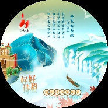
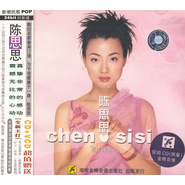

陈思思
============================

|  |  |
| :--: | :-- |
| [ 陈思思](https://i.xiami.com/css) | **播放数**: 5123899 **粉丝数**: 1884 **评论数**: 79 **地区**: China 中国大陆 **风格**: 中国传统民歌 Chinese Traditional Folk  |

## 档案

个人档案 
中文名：陈思思 
出生地：湖南常德 
籍 贯：江苏南京 
生 日：12月28日 
身 高：1.65米 
体 重：48kg 
血 型：O型 
学 历：大学艺术系 
爱 好：舞蹈、弹钢琴、看书、驾车 
喜欢的颜色：玫瑰红、白 
喜爱的食物：辣椒、甜食 
最想去的地方：雪山草原 
座右铭：有志者事竟成 
个人简介 
陈思思 中国人民解放军二炮政治部文工团独唱演员，第十一界全国人大代表、 
全国青联委员著名青年歌唱家，国家一级演员，她是中国歌坛一道靓丽的风景 
她是新民歌领域的标志性唱将。 
获奖经历 
2005年第11届全球华语音乐榜中榜首次设立最佳民族奖，她脱颖而出，独占鳌头，一举夺得最佳民歌手奖 
2004年她在中央电视台及河北、四川、吉林、湖南等全国十几家电视台举办个人演唱会受到音乐界、电视观众的广泛好评，并在这丰收的季节里锦上添花，荣膺－－ 
2004年CCTV－－MTV“音乐盛典”最佳女民歌手奖 
2004年第八届全军文艺汇演演唱一等奖 
2003年荣获全国军旅歌曲大赛金奖，二十多次获得中宣部“五个一”工程奖、全国电视文艺“星光奖”、中国电视金鹰奖等多项国际、全国性重大奖项。 
她热心公益活动，为环保、赈灾、奥运等事业义演、捐款，担任十多项公益事业“爱心大使”，多次受到中央及国家机构的嘉奖，两次荣立二等功。

## 专辑

| 名称 | 语种 | 唱片公司 | 发行时间 | 专辑类别 | 专辑风格 |
| :--: | :-- | :-- | :-- | :-- | :-- |
| [ 共饮一江水](./albums/5022614792.md) | 国语 | 唱响文化 | 2021年01月28日 | EP, 单曲 | 国语流行 Mandarin Pop |
| [ 上了油画的女人](./albums/5021296744.md) | 国语 | Super Music | 2020年08月14日 | EP, 单曲 | 流行 Pop |
| [ 潇湘茶歌](./albums/2108280973.md) | 国语 | HIFIVE | 2020年04月04日 | EP, 单曲 | 国语流行 Mandarin Pop |
| [ 情哥去南方](./albums/2105452393.md) | 国语 |  | 2019年11月15日 | EP, 单曲 |  |
| [ 两茫](./albums/2104298836.md) | 国语 | 最幕文化 | 2018年11月28日 | EP, 单曲 | 国语流行 Mandarin Pop |
| [ 焦桐花儿开](./albums/2104065960.md) | 国语 | 东家文化 | 2018年09月30日 | EP, 单曲 | 国语流行 Mandarin Pop |
| [ 难舍的爱](./albums/2102973194.md) | 国语 | 视星国际 | 2017年12月11日 | EP, 单曲 |  |
| [ 美好新时代](./albums/2102878013.md) | 国语 | 博文思馨 | 2017年10月22日 | EP, 单曲 |  |
| [ 这一刻](./albums/2102804988.md) | 国语 | 博文思馨 | 2017年07月28日 | EP, 单曲 |  |
| [ 缠绵](./albums/2102803698.md) | 国语 | 维音唱片 | 2017年07月27日 | EP, 单曲 | 红歌 Red Song |
| [ 火箭军之歌](./albums/2102804987.md) | 国语 | 维音唱片 | 2017年07月27日 | EP, 单曲 |  |
| [ 四季莲花](./albums/2102685035.md) | 国语 | 博文思馨 | 2017年01月24日 | EP, 单曲 |  |
| [ 慢慢等你](./albums/2102685037.md) | 国语 | 博文思馨 | 2016年09月14日 | EP, 单曲 |  |
| [ 不忘初心](./albums/2100381656.md) | 国语 | 魔音文化 | 2016年08月22日 | EP, 单曲 |  |
| [ 纳西情歌](./albums/2100254690.md) | 国语 | 百慕文化 | 2016年01月05日 | EP, 单曲 |  |
| [ 雪恋](./albums/496997.md) | 国语 | 博文思馨 | 2015年07月31日 | EP, 单曲 | 中国传统民歌 Chinese Traditional Folk |
| [ 中国梦](./albums/198760411.md) | 国语 | 磅礴音乐 | 2014年04月29日 | 录音室专辑 | 传统流行 Traditional Pop, 中国传统民歌 Chinese Traditional Folk |
| [ 老公回家过年](./albums/574475.md) | 国语 | 博文思馨 | 2013年01月24日 | EP, 单曲 | 中国传统民歌 Chinese Traditional Folk |
| [ 天天月圆](./albums/522424.md) | 国语 | 博文思馨 | 2012年06月20日 | EP, 单曲 | 中国传统民歌 Chinese Traditional Folk |
| [ 柳叶湖美](./albums/424092.md) | 国语 | 思娱文化 | 2010年01月01日 | EP, 单曲 |  |
| [ 我的祖国我的家](./albums/421303.md) | 国语 | 星文唱片 | 2009年09月28日 | 录音室专辑 | 中国传统民歌 Chinese Traditional Folk |
| [ 锦绣年代](./albums/7659.md) | 国语 | 飞乐唱片 | 2006年09月01日 | 录音室专辑 | 中国传统民歌 Chinese Traditional Folk |
| [ 共度好时光](./albums/7660.md) | 国语 | 金蜂音像 | 2004年03月01日 | 录音室专辑 | 中国传统民歌 Chinese Traditional Folk |
| [ 你让我感动](./albums/7661.md) | 国语 | 金蜂音像 | 2001年12月01日 | 录音室专辑 | 中国传统民歌 Chinese Traditional Folk |
| [ 情哥去南方](./albums/178792279.md) | 国语 | 中唱广州 | 1994年04月04日 | 录音室专辑 | 中国传统民歌 Chinese Traditional Folk |

## 评论

|  |  |  |  |
| :-- | :-- | :-- | :-- |
|  [虾米用户](https://emumo.xiami.com/u/443934404)  2020-12-28 10:16 赞(0) 踩(0) | 
〈雪恋〉入人心痱，音色音准大棒了，我一连听了五遍，加油！
 |
|  [虾米用户](https://emumo.xiami.com/u/352220781)  2020-10-29 10:55 赞(2) 踩(0) | 
  
 |
|  [虾米用户](https://emumo.xiami.com/u/362878347)  2019-12-28 10:16 赞(2) 踩(0) | 
祝你生日快乐，青春永绽放
 |
|  [虾米用户](https://emumo.xiami.com/u/266891096)  2019-12-23 21:49 赞(2) 踩(0) | 
美女美声！超喜欢你的声音。
 |
|  [虾米用户](https://emumo.xiami.com/u/353406727) 音乐.无疆界 2019-11-12 02:21 赞(2) 踩(0) | 
纳西情歌好听  
 |
|  [虾米用户](https://emumo.xiami.com/u/423723468)  2019-10-12 11:57 赞(1) 踩(0) | 
******
 |
|  [虾米用户](https://emumo.xiami.com/u/355089303) 我来虾米多少天了?！ 2018-12-28 10:02 赞(1) 踩(0) | 
嗨皮波斯带
 |
|  [虾米用户](https://emumo.xiami.com/u/41012203)  2018-12-23 22:42 赞(1) 踩(0) | 

 |
|  [虾米用户](https://emumo.xiami.com/u/369528507) ☘開心過好每一天☕️ 2018-11-28 21:42 赞(1) 踩(0) | 
好聽
 |
|  [虾米用户](https://emumo.xiami.com/u/787033) 每一首歌 独特的韵味 每... 2018-11-02 15:43 赞(1) 踩(0) | 
湖南妹子 陈思思~
 |
|  [虾米用户](https://emumo.xiami.com/u/402135703)  2018-10-06 15:50 赞(1) 踩(0) | 
我倒，我记得陈思思好像是一个动画片里的人物&amp;hellip;&amp;hellip;
 |
|  [虾米用户](https://emumo.xiami.com/u/343823917) 李昊民歌歌手，混血跨国恋 2018-06-26 15:33 赞(1) 踩(0) | 
来支持陈思思的
 |
|  [虾米用户](https://emumo.xiami.com/u/343823917) 李昊民歌歌手，混血跨国恋 2018-06-26 15:33 赞(1) 踩(0) | 
此网站不要冒充李昊，李昊也没有新浪微博，甚至没有微信，当然本网站认证于今天，2018年6月26日/不是今天认证就是假的李昊/还有李昊不会用中国记录的
 |
|  [虾米用户](https://emumo.xiami.com/u/343823917) 李昊民歌歌手，混血跨国恋 2018-04-12 16:39 赞(2) 踩(0) | 
李昊也要入驻虾米音乐人了，欢迎大家来李昊个人主页收听李昊最新音乐，再入住前可以来电台逛逛
 |
|  [虾米用户](https://emumo.xiami.com/u/332288160)  2018-04-03 22:15 赞(1) 踩(0) | 
好听，越听越有韵味！   
 |
|  [虾米用户](https://emumo.xiami.com/u/119384594) 呼褐，唱作人，策划人，“... 2018-02-12 00:33 赞(2) 踩(0) | 
谢谢大家一直以来对思思老师的支持
 |
|  [虾米用户](https://emumo.xiami.com/u/290212002)  2017-11-29 18:40 赞(2) 踩(0) | 
我特别喜欢听你的歌   
 |
| ⇒ |  [虾米用户](https://emumo.xiami.com/u/290212002)  2017-11-29 18:46 赞(0) 踩(0) | 
人美.歌也唱得不错
 |
|  [虾米用户](https://emumo.xiami.com/u/333681850)  2017-11-08 07:42 赞(2) 踩(0) | 
不忘初心这首歌很好我爱听
 |
|  [虾米用户](https://emumo.xiami.com/u/327118152) 张不 2017-10-28 19:53 赞(2) 踩(0) | 
          
 |
|  [虾米用户](https://emumo.xiami.com/u/327118152) 张不 2017-10-27 07:43 赞(1) 踩(0) | 

 |
|  [虾米用户](https://emumo.xiami.com/u/3435724)  2017-10-24 22:20 赞(1) 踩(0) | 
喜欢雪恋这首歌，很唯美
 |
|  [虾米用户](https://emumo.xiami.com/u/231049161) 金秋华 2017-10-22 21:41 赞(1) 踩(0) | 
湖南水美鱼多，歌星人才辈出。
 |
|  [虾米用户](https://emumo.xiami.com/u/298948030) 中國詩音樂電影创始人作曲... 2017-10-17 22:11 赞(1) 踩(0) | 
你好
 |
|  [虾米用户](https://emumo.xiami.com/u/271017410) 我一直都想做一个冷酷的人 2017-10-14 01:20 赞(1) 踩(0) | 
一开声，就知道是练家子
 |
|  [虾米用户](https://emumo.xiami.com/u/298246486)  2017-05-22 06:18 赞(1) 踩(0) | 
喜欢你的歌 
 |
|  [虾米用户](https://emumo.xiami.com/u/286996919)  2017-05-16 22:13 赞(3) 踩(0) | 
我倒，籍贯南京？才发现是老乡
 |
|  [虾米用户](https://emumo.xiami.com/u/124116232) 比比說愛是妳來到世上的原... 2017-05-06 22:19 赞(1) 踩(0) | 
纳西情歌
 |
|  [虾米用户](https://emumo.xiami.com/u/38051467) …… 2017-04-17 14:13 赞(1) 踩(0) | 
好听 
 |
|  [虾米用户](https://emumo.xiami.com/u/285426988)  2017-04-02 18:52 赞(2) 踩(0) | 
歌声悠扬委婉动听，甜美舒畅，令人陶醉！
 |
|  [虾米用户](https://emumo.xiami.com/u/280602134)  2017-04-01 20:32 赞(3) 踩(0) | 
我喜欢听满月这首歌。
 |
|  [虾米用户](https://emumo.xiami.com/u/278496055)  2017-03-27 10:07 赞(1) 踩(0) | 
电视剧不咋地，歌曲倒是胜过千万倍！
 |
|  [虾米用户](https://emumo.xiami.com/u/258594429)  2017-03-26 19:25 赞(1) 踩(0) | 
非常喜欢你的歌
 |
|  [虾米用户](https://emumo.xiami.com/u/256278581)  2017-01-07 00:00 赞(1) 踩(0) | 
我最喜欢听你的纳西情歌
 |
|  [虾米用户](https://emumo.xiami.com/u/11978781)  2016-09-03 11:51 赞(1) 踩(0) | 
喜欢她和张燕
 |
|  [虾米用户](https://emumo.xiami.com/u/97747450) 我还没想好要写什么... 2016-08-30 23:13 赞(1) 踩(0) | 
mg19
 |
|  [虾米用户](https://emumo.xiami.com/u/112042956) 我是大学霸，女汉子，跟姐... 2016-08-23 09:30 赞(2) 踩(0) | 
满月好听～～～
 |
|  [虾米用户](https://emumo.xiami.com/u/8419006) Darkness my ... 2016-04-13 13:42 赞(1) 踩(0) | 
常德老乡过来凑个热闹~
 |
|  [虾米用户](https://emumo.xiami.com/u/124793000)  2016-03-24 21:25 赞(0) 踩(0) | 
杀爱躲开'十\\
 |
|  [虾米用户](https://emumo.xiami.com/u/30760561)   2016-02-08 16:15 赞(1) 踩(0) | 
好听！ 
 |
|  [虾米用户](https://emumo.xiami.com/u/32611184) 一起玩耍吧 2015-12-16 22:53 赞(5) 踩(0) | 
感觉她唱歌好难听啊
 |
| ⇒ |  [虾米用户](https://emumo.xiami.com/u/124793000)  2016-03-25 14:53 赞(0) 踩(0) | 
乐
 |
| ⇒ |  [虾米用户](https://emumo.xiami.com/u/301754547)   2017-06-15 07:14 赞(0) 踩(0) | 
你别听啊 求着你了？
 |
|  [虾米用户](https://emumo.xiami.com/u/30179008) 暂无签名~ 2015-09-26 21:20 赞(1) 踩(0) | 
人美声美
 |
|  [虾米用户](https://emumo.xiami.com/u/51656714) 生活着是美好的！ 2015-06-23 06:40 赞(1) 踩(0) | 
人美心灵美！
 |
| ⇒ |  [虾米用户](https://emumo.xiami.com/u/51943784)  2015-08-20 21:47 赞(0) 踩(0) | 
陈恩恩
 |
| ⇒ |  [虾米用户](https://emumo.xiami.com/u/301754547)   2017-06-15 07:14 赞(0) 踩(0) | 
<q><b>wenjinghx说：</b></q>
 |
|  [虾米用户](https://emumo.xiami.com/u/11570347)  2014-06-07 17:12 赞(6) 踩(0) | 
内容已删除
 |
| ⇒ |  [虾米用户](https://emumo.xiami.com/u/276834724)  2017-11-12 12:38 赞(0) 踩(0) | 
mdoemDomm@
 |
|  [虾米用户](https://emumo.xiami.com/u/9926785)  2014-05-14 19:17 赞(1) 踩(0) | 
喜欢
 |
|  [虾米用户](https://emumo.xiami.com/u/35827728)  2014-04-29 14:48 赞(85) 踩(0) | 
我刚入驻了虾米音乐人，欢迎大家来我的个人主页，收听我的最新音乐
 |
| ⇒ |  [虾米用户](https://emumo.xiami.com/u/18282119) 我就是我，独一无二 2014-04-30 12:32 赞(0) 踩(0) | 
按照虾米的规矩，《中国梦》专辑应该被合并啊，陈老师，请及时删除，还有，陈老师，您能不能把没有发布的专辑给发了啊！！！
 |
| ⇒ |  [虾米用户](https://emumo.xiami.com/u/124793000)  2016-03-24 14:31 赞(0) 踩(0) | 
磊子只丫
 |
| ⇒ |  [虾米用户](https://emumo.xiami.com/u/124793000)  2016-03-29 19:37 赞(0) 踩(0) | 
主
 |
| ⇒ |  [虾米用户](https://emumo.xiami.com/u/94936788)  2016-12-29 22:59 赞(0) 踩(0) | 
思思姐的满月超级好听
 |
| ⇒ |  [虾米用户](https://emumo.xiami.com/u/295469) 有机物质，无性生活。 2017-01-07 01:09 赞(0) 踩(0) | 
非常好，有故事，有情理，你好棒。爱听。
 |
| ⇒ |  [虾米用户](https://emumo.xiami.com/u/243789781)  2017-01-21 01:14 赞(0) 踩(0) | 
思思姐，永远支持你哦！ 
 |
| ⇒ |  [虾米用户](https://emumo.xiami.com/u/282590498)  2017-03-25 05:29 赞(0) 踩(0) | 
喜欢您的歌！
 |
| ⇒ |  [虾米用户](https://emumo.xiami.com/u/321740280)  2017-08-26 21:37 赞(0) 踩(0) | 
多多支持大虾 
 |
| ⇒ |  [虾米用户](https://emumo.xiami.com/u/321740280)  2017-08-26 21:39 赞(0) 踩(0) | 
思思姐支持您的歌曲都非常好听
 |
| ⇒ |  [虾米用户](https://emumo.xiami.com/u/124793000)  2017-10-27 23:39 赞(0) 踩(0) | 
切平安步兵米1一旨多去孔竞店T可不丫丫今川洚下一车几月珠孔期剧创民无尽我
 |
| ⇒ |  [虾米用户](https://emumo.xiami.com/u/290212002)  2018-03-18 10:04 赞(0) 踩(0) | 
我最喜欢听你的歌...
 |
| ⇒ |  [虾米用户](https://emumo.xiami.com/u/268586501) 音乐让人赏心悦目，并为大... 2018-05-16 22:42 赞(0) 踩(0) | 
ok
 |
| ⇒ |  [虾米用户](https://emumo.xiami.com/u/409918609) 王国庆 2019-01-14 19:48 赞(0) 踩(0) | 
思思妹妹唱歌自如顶你庆国王❤❤❤❤♥❤⭐⭐⭐⭐⭐⭐⭐⭐⭐
 |
| ⇒ |  [虾米用户](https://emumo.xiami.com/u/425136901)  2019-05-28 06:17 赞(0) 踩(0) | 
陈思思的&lt;我爱你中国&gt;，让我百听不厌，真的好听，精彩极了！Very wonderful !
 |
| ⇒ |  [虾米用户](https://emumo.xiami.com/u/271225764)  2019-06-08 19:07 赞(0) 踩(0) | 
今天才注意到，有些遗憾！惊艳的感觉！
 |
| ⇒ |  [虾米用户](https://emumo.xiami.com/u/281784723)  2019-11-14 18:45 赞(0) 踩(0) | 
陈氏家族以你为荣、为傲！
 |
| ⇒ |  [虾米用户](https://emumo.xiami.com/u/406052573)  2020-12-28 12:20 赞(0) 踩(0) | 
美女声音美，人也美
 |
|  [虾米用户](https://emumo.xiami.com/u/18282119) 我就是我，独一无二 2014-04-29 13:53 赞(1) 踩(0) | 
欢迎加入虾米音乐人！！！
 |
|  [虾米用户](https://emumo.xiami.com/u/2405068)  2014-03-02 21:50 赞(1) 踩(0) | 
喜欢
 |
|  [虾米用户](https://emumo.xiami.com/u/6343255)  2013-11-13 09:06 赞(1) 踩(0) | 
美
 |
|  [虾米用户](https://emumo.xiami.com/u/2460296) 行到水窮處 坐看云起時 2012-10-27 22:54 赞(1) 踩(0) | 
美丽的湘女
 |
|  [虾米用户](https://emumo.xiami.com/u/8782582)  2012-08-30 07:10 赞(1) 踩(0) | 
无可挑剔。
 |
|  [虾米用户](https://emumo.xiami.com/u/10222428)  2012-08-16 16:12 赞(1) 踩(0) | 
想听听
 |
|  [虾米用户](https://emumo.xiami.com/u/6343255)  2011-12-09 12:57 赞(1) 踩(0) | 
歌甜
 |
|  [虾米用户](https://emumo.xiami.com/u/6632377) 暂无签名~ 2011-11-15 19:46 赞(1) 踩(0) | 
独特的唱腔·厚重不失优美·
 |
|  [虾米用户](https://emumo.xiami.com/u/6200891)  2011-10-23 12:54 赞(1) 踩(0) | 
靠
 |
|  [虾米用户](https://emumo.xiami.com/u/3395113)   2011-04-25 13:30 赞(1) 踩(0) | 
一般
 |
|  [虾米用户](https://emumo.xiami.com/u/2172218)  2011-01-13 06:50 赞(1) 踩(0) | 
喜欢的歌手
 |
|  [虾米用户](https://emumo.xiami.com/u/1782852)  2011-01-07 10:32 赞(1) 踩(0) | 
思思,真的是一个不错的歌手,而且人也长得漂亮,大家都说她是接宋祖英的班哦!
 |
