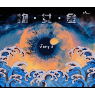

物女金
============================

|  |  |
| :--: | :-- |
| [ 物女金](https://emumo.xiami.com/album/2102411700) | **艺人**: [Jony J](../index.md) **语种**: 国语 **唱片公司**: SHOOC Studio **发行时间**: 2016年12月28日 **专辑类别**: 录音室专辑 **专辑风格**: 嘻哈 Hip-Hop, 地下说唱 Underground Hip Hop **播放数**: 6736236 **收藏数**: 2443 **评论数**: 166  |

## 简介

  
在被碎片式信息引爆的快节奏生活中，物质、性、金钱，每日每夜每时每刻都在以不同的方式出现，试探你的诚意，洗刷你的底线。它们是载着你一路走到现在的马夫，很疯狂，激发着欲望跟潜能；也是带着你走进泥淖的鬼魅，很危险，一旦沉溺就会失重。  
  
在现实社会里，物质、性和金钱，它们是对手、是镜子、是对立面，也是伙伴、是望远镜、是双门超跑。  
  
不需要时刻想着它们带着它们，它们其实一直就在身边，不管你喜欢不喜欢，它们始终会与你同行。  
  
重要的不是物质、性和金钱能给你什么，而是你自己真实的内心想要什么。  
  
《物女金》这张专辑是JONY J在这些年来从认识、了解到学着面对它们的过程，以后跟它们相处的日子还很长，不要着急，慢慢来，希望你也能认清自己的，追随自己的初衷。

## 曲目

## 评论

|  |  |  |  |
| :-- | :-- | :-- | :-- |
|  [虾米用户](https://emumo.xiami.com/u/348269074) 为你发光 2019-12-04 13:35 赞(0) 踩(0) | 
我哭了版权呢！
 |
|  [虾米用户](https://emumo.xiami.com/u/54875780) 收《SpidaBoi》《... 2018-12-10 16:25 赞(1) 踩(0) | 
一步一步我慢慢来
 |
|  [虾米用户](https://emumo.xiami.com/u/46523150) 尔有何坚 2018-11-27 08:24 赞(1) 踩(0) | 
封面抄袭了
 |
|  [虾米用户](https://emumo.xiami.com/u/289161158) 我还没想好要写什么... 2018-08-07 09:25 赞(1) 踩(0) | 
现在是听不了了吗？！
 |
|  [虾米用户](https://emumo.xiami.com/u/342561149) 走啦走啦还是得谢谢虾米让... 2018-07-18 18:47 赞(0) 踩(0) | 
：(   眨眼没了
 |
|  [虾米用户](https://emumo.xiami.com/u/11981821) 爱生活、爱猫、爱音乐。  2018-06-23 02:59 赞(2) 踩(0) | 
听不了了～ 55 我很喜欢慢慢来那首
 |
|  [虾米用户](https://emumo.xiami.com/u/297505648) 我还没想好要写什么... 2018-05-23 20:32 赞(1) 踩(0) | 
这个封面&amp;hellip;和我看过的一个插画好像&amp;hellip;&amp;hellip;相似度90%
 |
|  [虾米用户](https://emumo.xiami.com/u/197489776) for mayday 2018-04-04 14:24 赞(1) 踩(0) | 
生气  虾米更新缓存都没有了  我的《玩家》!！
 |
|  [虾米用户](https://emumo.xiami.com/u/215193252)  2018-03-13 01:47 赞(0) 踩(0) | 
去 我的玩家
 |
|  [虾米用户](https://emumo.xiami.com/u/118985842)  2018-03-08 23:01 赞(0) 踩(0) | 
下架了几首歌
 |
|  [虾米用户](https://emumo.xiami.com/u/75204096)   2018-03-07 17:37 赞(0) 踩(0) | 
买买买
 |
|  [虾米用户](https://emumo.xiami.com/u/14005518) 我还没想好要写什么... 2018-02-27 23:08 赞(0) 踩(0) | 
5 6 8 去哪里了
 |
|  [虾米用户](https://emumo.xiami.com/u/343029866)  2018-02-23 20:15 赞(1) 踩(0) | 
玩家  怎么没有了？
 |
|  [虾米用户](https://emumo.xiami.com/u/325680825) take a deep ... 2018-02-22 23:43 赞(0) 踩(0) | 
&amp;hellip;&amp;hellip;为什么少了几首&amp;hellip;
 |
|  [虾米用户](https://emumo.xiami.com/u/327296171)  2018-02-21 13:35 赞(1) 踩(0) | 
玩家没了啊啊啊啊啊
 |
|  [虾米用户](https://emumo.xiami.com/u/197821706) 不知名高中生 2018-02-15 16:58 赞(0) 踩(0) | 
还好我买了
 |
|  [虾米用户](https://emumo.xiami.com/u/217314962) 频频回首 不如默默前行 2018-02-08 01:10 赞(3) 踩(0) | 
套路没了
 |
| ⇒ |  [虾米用户](https://emumo.xiami.com/u/51634182)  2018-02-17 00:18 赞(0) 踩(0) | 
为啥没了，今天找了半天不见了 
 |
| ⇒ |  [虾米用户](https://emumo.xiami.com/u/217314962) 频频回首 不如默默前行 2018-02-21 22:50 赞(0) 踩(0) | 
<q><b>深蓝boom说：</b></q>
 |
|  [虾米用户](https://emumo.xiami.com/u/346463712)  2018-01-29 15:43 赞(0) 踩(0) | 
喜欢
 |
|  [虾米用户](https://emumo.xiami.com/u/142713468) 但愿我能够住在你的角膜里... 2018-01-28 12:59 赞(0) 踩(0) | 
豆芽真酷
 |
|  [虾米用户](https://emumo.xiami.com/u/284520430)  2018-01-26 13:02 赞(1) 踩(0) | 
请求降价
 |
|  [虾米用户](https://emumo.xiami.com/u/334117054)  2018-01-24 11:10 赞(4) 踩(0) | 
为什么套路不见了
 |
|  [虾米用户](https://emumo.xiami.com/u/197489776) for mayday 2018-01-21 16:47 赞(0) 踩(0) | 
好奇，有多少人买啦 ？
 |
|  [虾米用户](https://emumo.xiami.com/u/197489776) for mayday 2018-01-21 16:46 赞(1) 踩(0) | 
100，真的欸   好在可以听，只是不能下载。祈祷不要被牵连，可以一直听下去
 |
| ⇒ |  [虾米用户](https://emumo.xiami.com/u/197489776) for mayday 2018-02-25 11:40 赞(0) 踩(0) | 
还有  慢慢来     最喜欢的啊
 |
|  [虾米用户](https://emumo.xiami.com/u/83210800) ＋ 2018-01-15 17:14 赞(0) 踩(0) | 
套路呢？
 |
|  [虾米用户](https://emumo.xiami.com/u/11513924) dadada~ 2018-01-13 21:27 赞(0) 踩(0) | 
真的是一张非常非常非常棒的专辑。加油哦！（真的是一个很棒的人呢！）
 |
|  [虾米用户](https://emumo.xiami.com/u/330019116) 网易云音乐:s喜丸子 2018-01-09 00:39 赞(1) 踩(0) | 
豆芽说如果他不会在所谓的说唱史上留名，但他相信这张专辑会的，因为它讲的是一个永恒的话题，物质 性 金钱
 |
|  [虾米用户](https://emumo.xiami.com/u/140693102)  2018-01-08 13:51 赞(0) 踩(0) | 
你应得的。
 |
|  [虾米用户](https://emumo.xiami.com/u/32829374) 我喜欢的，是真正有感情有... 2018-01-05 11:21 赞(2) 踩(0) | 
jony j 刷新了我对嘻哈歌曲都是颓废放荡不羁和烂人专属的理解&amp;hellip;&amp;hellip;jony j 呈现的是健康积极真实的生活感受并且搭配顺耳的旋律和他独特好听的声音！真的非常喜欢啊
 |
| ⇒ |  [虾米用户](https://emumo.xiami.com/u/336345820)  2018-01-06 15:22 赞(0) 踩(0) | 
我也！！不是不可以狂 但是不能所有歌都在吹吧 今天才听他的歌听的想哭 顺便安利吴亦凡的lullaby 最近这些乱七八糟的事看得我心里慌慌的怕国人抵制嘻哈 老吴的努力啊。。
 |
|  [虾米用户](https://emumo.xiami.com/u/46185587) 爱你 2017-12-19 23:08 赞(0) 踩(0) | 
喜欢这张专辑
 |
|  [虾米用户](https://emumo.xiami.com/u/66823378)  2017-12-14 19:22 赞(2) 踩(0) | 
因为你，改变对说唱的看法
 |
|  [虾米用户](https://emumo.xiami.com/u/66823378)  2017-12-14 19:21 赞(0) 踩(0) | 

 |
|  [虾米用户](https://emumo.xiami.com/u/330019116) 网易云音乐:s喜丸子 2017-11-30 23:59 赞(1) 踩(0) | 
12.28是豆芽生日啊！才发现，他发歌总是喜欢挑日子，太可爱了
 |
|  [虾米用户](https://emumo.xiami.com/u/330019116) 网易云音乐:s喜丸子 2017-11-30 23:58 赞(0) 踩(0) | 
期待下一张专辑 
 |
|  [虾米用户](https://emumo.xiami.com/u/285586595)  2017-11-28 14:27 赞(0) 踩(0) | 
高水准的一张专辑 等下一张专辑
 |
|  [虾米用户](https://emumo.xiami.com/u/336988922)  2017-11-24 12:05 赞(1) 踩(0) | 
哇！超喜欢jony j!!!长得好看声音又超好听！~现在想找个人一起打卡早起，打卡去运动，打卡去吃早餐，有人跟我一起吗？让早起成为改变自己的一个契机吧！（别怕&amp;middot;&amp;middot;&amp;middot;&amp;middot;我不是什么机器人&amp;middot;&amp;middot;&amp;middot;）加Dx201632
 |
|  [虾米用户](https://emumo.xiami.com/u/188316044)  2017-11-20 16:11 赞(1) 踩(0) | 
哪个大佬能分享一下
 |
|  [虾米用户](https://emumo.xiami.com/u/335955884)  2017-11-20 02:00 赞(0) 踩(0) | 
我会努力的，等我有钱了回来买你
 |
|  [虾米用户](https://emumo.xiami.com/u/329814127)  2017-11-16 20:10 赞(1) 踩(0) | 
这个贵？去看看ty.的1989
 |
| ⇒ |  [虾米用户](https://emumo.xiami.com/u/325507323)  2017-11-27 23:07 赞(0) 踩(0) | 
才19啊
 |
|  [虾米用户](https://emumo.xiami.com/u/120127224)   2017-11-16 07:59 赞(0) 踩(0) | 
真的好贵
 |
|  [虾米用户](https://emumo.xiami.com/u/312820265) 我还没想好要写什么... 2017-11-07 21:39 赞(0) 踩(0) | 
缺点就是太贵了
 |
|  [虾米用户](https://emumo.xiami.com/u/621777)  2017-11-03 11:48 赞(0) 踩(0) | 
封面不错
 |
|  [虾米用户](https://emumo.xiami.com/u/187501733)  2017-10-28 17:41 赞(0) 踩(0) | 
妈耶100块
 |
|  [虾米用户](https://emumo.xiami.com/u/48018014)   2017-10-17 10:21 赞(1) 踩(0) | 
有种欲望大的漫无边际 就像住在你身体里的奸细
 |
|  [虾米用户](https://emumo.xiami.com/u/49095520)  2017-10-15 14:41 赞(0) 踩(0) | 
豆芽抢
 |
|  [虾米用户](https://emumo.xiami.com/u/181927622) 不忘初心EXO 2017-10-02 21:58 赞(7) 踩(0) | 
这是我见过最贵的专辑，没有之一，
 |
|  [虾米用户](https://emumo.xiami.com/u/588121) 我还没想好要写什么... 2017-09-30 11:39 赞(0) 踩(0) | 
有自己的flow
 |
|  [虾米用户](https://emumo.xiami.com/u/6867905) 吃饭，画图，骂甲方 2017-09-29 20:28 赞(0) 踩(0) | 
真的...好贵，50我都买..
 |
|  [虾米用户](https://emumo.xiami.com/u/1549065) 不怀旧 不接受批评 2017-09-28 00:18 赞(0) 踩(0) | 
丧的时候就来听一听
 |
|  [虾米用户](https://emumo.xiami.com/u/153980772)  2017-09-26 23:14 赞(0) 踩(0) | 
666
 |
|  [虾米用户](https://emumo.xiami.com/u/18120626) l 2017-09-23 10:41 赞(0) 踩(0) | 
贵在不忘初心 
 |
|  [虾米用户](https://emumo.xiami.com/u/8226204) ≡ 2017-09-22 23:52 赞(0) 踩(0) | 

 |
|  [虾米用户](https://emumo.xiami.com/u/325680825) take a deep ... 2017-09-20 22:56 赞(3) 踩(0) | 
买专辑才是对音乐人最起码的尊重 
 |
|  [虾米用户](https://emumo.xiami.com/u/202163912)   2017-09-13 22:42 赞(0) 踩(0) | 
话不多说 我的信仰就是Jony J豆芽
 |
|  [虾米用户](https://emumo.xiami.com/u/450120) 你喂我吃垃圾 我就在垃圾... 2017-09-12 00:32 赞(2) 踩(0) | 
听够10遍 我就去付钱。。。
 |
|  [虾米用户](https://emumo.xiami.com/u/32052730) 虾米虾米？ 2017-09-07 10:48 赞(52) 踩(0) | 
一百一张&amp;hellip;最贵的数字专辑吧
 |
| ⇒ |  [虾米用户](https://emumo.xiami.com/u/71539184) 其实我们都一模一样。无名... 2017-09-26 13:28 赞(0) 踩(0) | 
哈哈哈哈你可以看看这个专辑七七连环X人调
 |
| ⇒ |  [虾米用户](https://emumo.xiami.com/u/33720873) 他来了。 2017-10-29 12:56 赞(0) 踩(0) | 
邱比150。
 |
| ⇒ |  [虾米用户](https://emumo.xiami.com/u/50859062) 去奉献 ，去沸腾 ，让此... 2017-11-19 22:54 赞(0) 踩(0) | 
<q><b>叫我高阿毛_说：</b></q>
 |
|  [虾米用户](https://emumo.xiami.com/u/5506380)   2017-09-03 12:20 赞(0) 踩(0) | 
从制作 编曲 到歌词，jony j都是一个非常成熟的音乐人了, 成长速度特别快。语感在国内rapper里可以排前三，shooc的peach.k编曲能力特别强。
 |
|  [虾米用户](https://emumo.xiami.com/u/92692562)   2017-09-02 10:38 赞(0) 踩(0) | 
嘻哈诗人
 |
|  [虾米用户](https://emumo.xiami.com/u/146395946)  2017-08-31 17:59 赞(0) 踩(0) | 
真实
 |
|  [虾米用户](https://emumo.xiami.com/u/9779976)  2017-08-30 19:26 赞(0) 踩(0) | 
好几首歌的歌词都有触动到我
 |
|  [虾米用户](https://emumo.xiami.com/u/87308754) 我还没想好要写什么... 2017-08-27 01:22 赞(22) 踩(0) | 
豆芽抢钱！！！
 |
|  [虾米用户](https://emumo.xiami.com/u/52325326)   2017-08-20 02:15 赞(0) 踩(0) | 
dope shit&amp;hellip;
 |
|  [虾米用户](https://emumo.xiami.com/u/1882463) 我还没想好要写什么... 2017-08-19 19:00 赞(1) 踩(0) | 
VIP会员好像可以免费听
 |
|  [虾米用户](https://emumo.xiami.com/u/236729383) (ᵒ̴̶̷ ᵕ ᵒ̴̶̷... 2017-08-17 05:35 赞(0) 踩(0) | 
满分
 |
|  [虾米用户](https://emumo.xiami.com/u/299124645)  2017-08-17 02:35 赞(0) 踩(0) | 
这可能是我听过的最好听的一张rap的专辑了
 |
|  [虾米用户](https://emumo.xiami.com/u/305435575)  2017-08-13 15:25 赞(1) 踩(0) | 
谁有这张专辑告诉我，太贵了！
 |
|  [虾米用户](https://emumo.xiami.com/u/15157331)   2017-08-05 12:15 赞(0) 踩(0) | 
好贵啊哈哈哈哈哈哈哈，
 |
|  [虾米用户](https://emumo.xiami.com/u/5708413) 音乐是个好东西 2017-07-27 20:39 赞(2) 踩(0) | 
不过一百块好贵，喜欢！
 |
|  [虾米用户](https://emumo.xiami.com/u/299124645)  2017-07-26 20:52 赞(1) 踩(0) | 
从the rap of China认识了豆芽，然后沉迷，无法自拔
 |
|  [虾米用户](https://emumo.xiami.com/u/137694070)   2017-07-24 11:56 赞(0) 踩(0) | 
听你第一首是套路。  后面就开始被你套路了。整天听你的歌哈哈。
 |
|  [虾米用户](https://emumo.xiami.com/u/127853952) 我还没想好要写什么... 2017-07-21 23:22 赞(0) 踩(0) | 
中国说唱算是认识的第一个地下歌手吧，完全喜欢。
 |
|  [虾米用户](https://emumo.xiami.com/u/4189053) 是音乐选择了我 2017-07-21 15:41 赞(0) 踩(0) | 
没什么好说的，首首走心，字字扎心！
 |
|  [虾米用户](https://emumo.xiami.com/u/21859692) 被 世 界 遗 忘 在 ... 2017-07-09 14:36 赞(0) 踩(0) | 
❤️
 |
|  [虾米用户](https://emumo.xiami.com/u/47495293)   2017-06-26 16:37 赞(0) 踩(0) | 
歌詞從來不吹女人車子票子依然可以在這個行業有你的位置，希望能鼓励到更多人，祝好
 |
|  [虾米用户](https://emumo.xiami.com/u/178661550)  2017-05-29 19:34 赞(0) 踩(0) | 
我听第一遍就喜欢上了所有歌啦 
 |
|  [虾米用户](https://emumo.xiami.com/u/178661550)  2017-05-29 19:33 赞(0) 踩(0) | 
哪里浮夸？挺好的
 |
|  [虾米用户](https://emumo.xiami.com/u/153453570)   2017-05-08 13:42 赞(0) 踩(0) | 
豆芽快来西安开巡演吧
 |
|  [虾米用户](https://emumo.xiami.com/u/290789596) 妳 2017-04-28 21:19 赞(0) 踩(0) | 
100块好贵啊
 |
|  [虾米用户](https://emumo.xiami.com/u/5118264) Stop Talking... 2017-03-08 17:45 赞(0) 踩(0) | 
❤️
 |
|  [虾米用户](https://emumo.xiami.com/u/5545820) peace 2017-03-06 00:13 赞(0) 踩(0) | 
中毒&amp;hellip;听一首收藏一首
 |
|  [虾米用户](https://emumo.xiami.com/u/257654295)  2017-02-12 11:49 赞(0) 踩(0) | 
666
 |
|  [虾米用户](https://emumo.xiami.com/u/18103487) 我还没想好要写什么... 2017-02-09 13:20 赞(0) 踩(0) | 
好听！
 |
|  [虾米用户](https://emumo.xiami.com/u/167391916)  2017-02-09 12:49 赞(1) 踩(0) | 
听了3年你的歌了，给了我很多力量
 |
|  [虾米用户](https://emumo.xiami.com/u/47399115)  2017-02-02 23:18 赞(2) 踩(0) | 
下个月买！我的天，他声音我好习惯！
 |
|  [虾米用户](https://emumo.xiami.com/u/264828879)  2017-02-01 22:00 赞(0) 踩(0) | 
有点贵
 |
|  [虾米用户](https://emumo.xiami.com/u/26166944) 游走在社会边缘的神秘者 2017-02-01 11:39 赞(0) 踩(0) | 
日了要100
 |
|  [虾米用户](https://emumo.xiami.com/u/266456031)  2017-01-23 00:08 赞(0) 踩(0) | 
让你看到最吊的Jony j
 |
|  [虾米用户](https://emumo.xiami.com/u/54546234) Fuckwhatthey... 2017-01-20 09:19 赞(0) 踩(0) | 
整张专辑有点乏力……有机会找whizzbiz吧……
 |
|  [虾米用户](https://emumo.xiami.com/u/21400355) 硬汉少年 2017-01-16 11:11 赞(0) 踩(0) | 

 |
|  [虾米用户](https://emumo.xiami.com/u/85087100) 我的命像海浪一样有时高有... 2017-01-15 15:26 赞(0) 踩(0) | 
 
 |
|  [虾米用户](https://emumo.xiami.com/u/50895113) 就听听歌 2017-01-13 19:52 赞(1) 踩(0) | 
爆炸
 |
|  [虾米用户](https://emumo.xiami.com/u/3413065) 风俗案内 2017-01-13 16:10 赞(0) 踩(0) | 
阵容强大哦，可以 好听
 |
|  [虾米用户](https://emumo.xiami.com/u/31999748)   2017-01-10 23:41 赞(1) 踩(0) | 
说实话这张专辑听第一遍没有想象中的惊艳，虽然有像Fantasy这样的百分百killer，但还是虑感失望。 但几天后再听直接无限循环整张专辑，喜欢的不得了，掏钱买下了数字版，实体版也没有东西能播了。就是为了支持好音乐。 jonyj 加油，你的教会了我很多。
 |
|  [虾米用户](https://emumo.xiami.com/u/45703948) 死是唯一解脱 再见世界 2017-01-10 19:13 赞(0) 踩(0) | 
可以
 |
|  [虾米用户](https://emumo.xiami.com/u/13978900) MUSIC 4 LIFE 2017-01-07 02:24 赞(0) 踩(0) | 
买了实体 坐等 
 |
|  [虾米用户](https://emumo.xiami.com/u/111504712)  2017-01-05 20:09 赞(0) 踩(0) | 
终于发了！！
 |
|  [虾米用户](https://emumo.xiami.com/u/248423684) 黄粱一梦二十年。 2017-01-05 11:24 赞(0) 踩(0) | 

 |
|  [虾米用户](https://emumo.xiami.com/u/25679736)  2016-12-29 13:52 赞(1) 踩(0) | 
很想找个空 好好 研究一下歌词 ~
 |
|  [虾米用户](https://emumo.xiami.com/u/206118989)  2016-12-28 18:53 赞(2) 踩(0) | 
走心的 rapper诗人
 |
|  [虾米用户](https://emumo.xiami.com/u/33604174)  2016-12-28 18:52 赞(0) 踩(0) | 
终于等到了！
 |
|  [虾米用户](https://emumo.xiami.com/u/50379894) 帅 2016-12-28 11:16 赞(2) 踩(0) | 
Walking on my fucking way  
 |
|  [虾米用户](https://emumo.xiami.com/u/54682517) 你会被教育成一个坏人，见... 2016-12-28 02:12 赞(0) 踩(0) | 
。
 |
|  [虾米用户](https://emumo.xiami.com/u/100559408) Csc 2016-12-28 00:51 赞(0) 踩(0) | 
不存在 还是爱
 |
|  [虾米用户](https://emumo.xiami.com/u/38213781) 不太用虾米听歌 2016-12-27 21:13 赞(0) 踩(0) | 
呀
 |
|  [虾米用户](https://emumo.xiami.com/u/253688040) 你会让酒鬼不要买酒吗 2016-12-27 20:34 赞(1) 踩(0) | 
终于等到你，下回演唱会我一定还会来的
 |
|  [虾米用户](https://emumo.xiami.com/u/48932561)   2016-12-27 17:26 赞(2) 踩(0) | 
感觉莫名的和j.cole的气质有点像，在音乐表达和音乐思想上，都是注重于自身和身处环境的关系和对现象艺术化的探索，搭配干净简单的beat，创造出真正有思想的歌曲。真的是中国hiphop中的一股清流 。 PS 我相信一定可以等到你在歌里承诺的那首《励志的歌》
 |
|  [虾米用户](https://emumo.xiami.com/u/9793938) 要说拜拜啦虾米音乐 2016-12-27 16:22 赞(4) 踩(0) | 
中国的J.cole 庆幸中国还有豆芽这样认真在押韵认真在rap用心在排词的饶舌歌手 词的深度Flow的功力比那些所谓的饶舌歌手 强太多了！！！
 |
|  [虾米用户](https://emumo.xiami.com/u/50821618) Song for me 2016-12-27 16:05 赞(0) 踩(0) | 
太棒了
 |
|  [虾米用户](https://emumo.xiami.com/u/168498000) Belieber & V... 2016-12-27 15:33 赞(0) 踩(0) | 
 forever love you
 |
|  [虾米用户](https://emumo.xiami.com/u/168498000) Belieber & V... 2016-12-27 15:31 赞(1) 踩(0) | 
太牛逼。虽然没有那么炸，没有那么燥，但是 我喜欢。
 |
|  [虾米用户](https://emumo.xiami.com/u/168498000) Belieber & V... 2016-12-27 15:30 赞(1) 踩(0) | 
我知道当我面对面的看着你 我很确定你就是我的Fantasy。
 |
|  [虾米用户](https://emumo.xiami.com/u/69270248)  2016-12-27 14:53 赞(0) 踩(0) | 
酷
 |
|  [虾米用户](https://emumo.xiami.com/u/25679736)  2016-12-27 13:32 赞(0) 踩(0) | 
~~你是不是把发行时间打错了？……
 |
|  [虾米用户](https://emumo.xiami.com/u/202904210) Jony J 2016-12-27 13:15 赞(0) 踩(0) | 
Jony J
 |
|  [虾米用户](https://emumo.xiami.com/u/202904210) Jony J 2016-12-27 13:15 赞(0) 踩(0) | 
喜欢
 |
|  [虾米用户](https://emumo.xiami.com/u/76768196) 我还没想好要写什么... 2016-12-27 13:12 赞(0) 踩(0) | 
“我想把所有我喜欢的全部拥有，可是有点贪婪该松手的总是不肯松手“
 |
|  [虾米用户](https://emumo.xiami.com/u/50642130) 很软 2016-12-27 13:11 赞(0) 踩(0) | 
cute
 |
|  [虾米用户](https://emumo.xiami.com/u/25679736)  2016-12-27 13:10 赞(0) 踩(0) | 
已经买了实体专，今天早上听了感觉很值啊！编曲都很喜欢，歌词也认真的听了，又要开始思考了！谢谢你！
 |
|  [虾米用户](https://emumo.xiami.com/u/124013016)   2016-12-27 11:56 赞(0) 踩(0) | 
好爱
 |
|  [虾米用户](https://emumo.xiami.com/u/90090674) 走进白太阳里去 2016-12-27 11:47 赞(99) 踩(0) | 
还是继承了原有的风格 豆芽不像其他Rapper的歌里充斥着打打杀杀 帮派叶子 他描述的是这个物欲横流的社会，无数的人玩着心计 耍着手段的想要上位，JonyJ只是冷眼旁观着这一切并阐述自己的处世原则。杨梅的混音还是很6，Cola和Gai让人眼前一亮，豆芽的押韵也很完美，只是有时候太过追求完美会显得有一些浮夸。祝福JonyJ能在Hiphop的道路上越走越远，做他自己的英雄
 |
|  [虾米用户](https://emumo.xiami.com/u/14011851) 兀兀穷年 2016-12-27 11:35 赞(0) 踩(0) | 
我来啦
 |
|  [虾米用户](https://emumo.xiami.com/u/10152337) 似乎与真理渐行渐远 2016-12-27 11:19 赞(28) 踩(0) | 
国内rapper的领头羊之一，押韵总是让人眼前一亮，这次也在尝试不同的风格突破过去的自己，一张超级赞的专辑，希望越做越好
 |
|  [虾米用户](https://emumo.xiami.com/u/252781894)   2016-12-27 10:44 赞(0) 踩(0) | 
买了实物专辑  里边的歌越听越好听的 有毒  豆芽继续写毒曲啊好好听啊
 |
|  [虾米用户](https://emumo.xiami.com/u/71509638) 我一生中最实在最浪漫的梦... 2016-12-27 10:37 赞(0) 踩(0) | 
豆芽有毒 越听越沉迷
 |
|  [虾米用户](https://emumo.xiami.com/u/257302481)  2016-12-27 10:36 赞(0) 踩(0) | 
“难道不是活就为活个爽又不为得个奖只不过把人生当玩。”这样的人会有更多更多人喜欢叭。
 |
|  [虾米用户](https://emumo.xiami.com/u/80919640) 白日梦患者 2016-12-27 10:27 赞(0) 踩(0) | 
整张专辑都太叼，玩家和套路还是快起来听着爽
 |
|  [虾米用户](https://emumo.xiami.com/u/44621181)   2016-12-27 10:18 赞(0) 踩(0) | 
  
 |
|  [虾米用户](https://emumo.xiami.com/u/48932561)   2016-12-27 10:04 赞(1) 踩(0) | 
感觉莫名的和j.cole的气质有点像，在音乐表达和音乐思想上，都是注重于自身和身处环境的关系和对现象艺术化的探索，搭配干净简单的beat，创造出真正有思想的歌曲。真的是中国hiphop中的一股清流 。  PS  我相信一定可以等到你在歌里承诺的那首《励志的歌》
 |
|  [虾米用户](https://emumo.xiami.com/u/255601119) 我选择时间 2016-12-27 09:13 赞(0) 踩(0) | 
终于等到你
 |
|  [虾米用户](https://emumo.xiami.com/u/139708134) 作逼赢世界 2016-12-27 08:57 赞(17) 踩(0) | 
等专辑从单身等到谈恋爱
 |
| ⇒ |  [虾米用户](https://emumo.xiami.com/u/50746444) 我还没想好要写什么... 2016-12-27 13:43 赞(0) 踩(0) | 
等专辑从恋爱到失恋
 |
| ⇒ |  [虾米用户](https://emumo.xiami.com/u/6867905) 吃饭，画图，骂甲方 2017-09-18 10:25 赞(0) 踩(0) | 
等到学区房都买了。
 |
|  [虾米用户](https://emumo.xiami.com/u/48495105)   2016-12-27 08:56 赞(0) 踩(0) | 

 |
|  [虾米用户](https://emumo.xiami.com/u/204094740)  2016-12-27 08:56 赞(0) 踩(0) | 
终于等到你 可惜专辑还没发货
 |
|  [虾米用户](https://emumo.xiami.com/u/92201454) 几句是非也无法将我的热情... 2016-12-27 08:28 赞(0) 踩(0) | 
评论太少
 |
|  [虾米用户](https://emumo.xiami.com/u/254195568)   2016-12-27 08:21 赞(0) 踩(0) | 

 |
|  [虾米用户](https://emumo.xiami.com/u/25679736)  2016-12-27 08:10 赞(0) 踩(0) | 
终于有了~~~
 |
|  [虾米用户](https://emumo.xiami.com/u/36653877)  2016-12-18 13:19 赞(0) 踩(0) | 
就一首？
 |
|  [虾米用户](https://emumo.xiami.com/u/54421002) 风口的猪精 2016-11-30 21:13 赞(0) 踩(0) | 
编曲有意思厚    
 |
|  [虾米用户](https://emumo.xiami.com/u/54421002) 风口的猪精 2016-11-30 21:11 赞(0) 踩(0) | 
帅。 swagswag
 |
|  [虾米用户](https://emumo.xiami.com/u/44432764) 我还没想好要写什么... 2016-11-29 00:39 赞(0) 踩(0) | 

 |
|  [虾米用户](https://emumo.xiami.com/u/100853796) milk 2016-11-12 20:26 赞(0) 踩(0) | 
就一首 
 |
|  [虾米用户](https://emumo.xiami.com/u/234128942)  2016-11-10 12:26 赞(0) 踩(0) | 
好事多磨我慢慢来
 |
|  [虾米用户](https://emumo.xiami.com/u/19662017) 我还没想好要写什么... 2016-11-08 01:52 赞(0) 踩(0) | 
坐等实体，买过的说下这张几首歌？
 |
|  [虾米用户](https://emumo.xiami.com/u/110571578) 许你十里桃花任你大浪淘沙... 2016-10-29 20:57 赞(0) 踩(0) | 
虾米评论好少
 |
|  [虾米用户](https://emumo.xiami.com/u/85087100) 我的命像海浪一样有时高有... 2016-10-29 18:12 赞(0) 踩(0) | 
好事多磨我慢慢来
 |
|  [虾米用户](https://emumo.xiami.com/u/55599063)   2016-10-26 20:29 赞(0) 踩(0) | 
，
 |
|  [虾米用户](https://emumo.xiami.com/u/59185474)   2016-10-25 20:57 赞(1) 踩(0) | 
网易云评论以破1000了都⋯⋯反观虾米⋯⋯
 |
|  [虾米用户](https://emumo.xiami.com/u/82173200)  2016-10-25 09:26 赞(0) 踩(0) | 
好事多磨
 |
|  [虾米用户](https://emumo.xiami.com/u/9322022) 不和你谈论玄妙复杂的隐喻 2016-10-24 23:02 赞(0) 踩(0) | 
放 玩游戏 上来
 |
|  [虾米用户](https://emumo.xiami.com/u/36205832) keep it real 2016-10-24 22:48 赞(1) 踩(0) | 
3
 |
|  [虾米用户](https://emumo.xiami.com/u/11335591) 我还没想好要写什么... 2016-10-24 20:12 赞(0) 踩(0) | 
会出实体专么
 |
| ⇒ |  [虾米用户](https://emumo.xiami.com/u/49343696)  2016-12-27 08:32 赞(0) 踩(0) | 
已经出了
 |
|  [虾米用户](https://emumo.xiami.com/u/57048810) 与你何干 2016-10-24 16:53 赞(0) 踩(0) | 
好
 |
|  [虾米用户](https://emumo.xiami.com/u/57048810) 与你何干 2016-10-24 16:53 赞(0) 踩(0) | 
火前留名
 |
|  [虾米用户](https://emumo.xiami.com/u/173338996)  2016-10-24 15:16 赞(0) 踩(0) | 
还有满满
 |
|  [虾米用户](https://emumo.xiami.com/u/49242137) Yellow 2016-10-24 14:54 赞(0) 踩(0) | 
好听
 |
|  [虾米用户](https://emumo.xiami.com/u/50642130) 很软 2016-10-24 14:50 赞(0) 踩(0) | 
cute
 |
| ⇒ |  [虾米用户](https://emumo.xiami.com/u/167216910) 瓜得要命 2016-11-29 15:51 赞(0) 踩(0) | 
人太少了
 |
