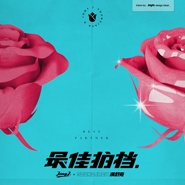

最佳拍档Best Partner
============================

|  |  |
| :--: | :-- |
| [ 最佳拍档Best Partner](https://emumo.xiami.com/album/5020782881) | **艺人**: [Jony J](../index.md) **语种**: 国语 **唱片公司**: 摩登天空 **发行时间**: 2020年05月29日 **专辑类别**: EP, 单曲 **专辑风格**:  **播放数**: 78 **收藏数**: 3 **评论数**: 0  |

## 简介

「跨越三年，但“我们的默契有种魔力”。」满舒克与Jony J，两位音乐风格各有所长且配合默契无间的音乐人，继《Lost》、《慢慢来》后，2020年再度发布最新合作单曲《最佳拍档》，全网正式上线！ 
作为三年后大家期待已久的再度合体，《最佳拍档》用轻缓和明快的旋律、抓耳的副歌、简洁制作手法烘托，表达出两位音乐人最真诚的私人情感，用最直接的方式传递各自对爱情的理解，荡漾的听感再次让浪漫充斥你的耳朵。 
满舒克和Jony J两位音乐人在音乐共鸣上无疑是最佳拍档，却又像是封面两种不同材质的玫瑰。满舒克搭建出略带暧昧且流动的情感来运作浪漫。很少有人可以理解自己的世界，所以也很期待在某个时间里不经意的出现那个生活里的“最佳拍档”。一旦出现，则会如歌词里唱的那样“当我的痴心变成绝对/眼里只有你不再选美。” 
Jony J在爱情里注入“婚姻”这一独特介质，犹如一株温润土壤中的玫瑰，绵柔的唱出“我可以随时随地做你保护伞在背后帮你挡 ，你让我的状态每天都像是中到奖。“ 传递家庭里该有的温馨、踏实、幸福的爱情，无疑是属于他的“最佳拍档”。 
歌曲制作依旧由国内优秀Hip-hop制作人Yoken操刀。为了突出满舒克和Jony J的人声，只选用了简单的配器作铺垫。开头吉他演奏的部分来自东北的朋克乐队新学校废物合唱团的主唱刘凹，段落中间鼓的编排加上808 bass，搭配结尾部分钢琴的点缀，这些小细节给《最佳拍档》带来更丰富的音色。 
最别出心裁是这首歌里的Vocal Chop部分，是整个世界独一无二的。制作人使用了一些独特小技巧，用满舒克的人声做了特别处理，制作成这首歌特殊的vocal chop。满舒克标志性的旋律说唱，也已经在他的身上越来越娴熟且逐渐有了属于自己的type。 
当满舒克和Jony J的声音和情绪化的beat结合在一起时，总能让你快速“进入”他们的故事。群居的人类在不同的方面都需要拍档来互相配合。或工作、或生活、或心理，但一定都需要找到那个与自己相处平衡且一起维持的人。分享一半耳机给TA，按下《最佳拍档》的播放键 ▹ 。 
希望你在任何一个人生阶段都“慢慢来”，最后找到属于你的《最佳拍档》。层层递进探讨爱情不同阶段的模样，共度一段浪漫至极的生命。

## 曲目

## 评论

|  |  |  |  |
| :-- | :-- | :-- | :-- |
