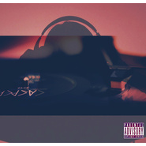

Jony J
============================

|  |  |
| :--: | :-- |
| [ Jony J](https://i.xiami.com/jonyj) | **播放数**: 46896421 **粉丝数**: 98277 **评论数**: 1007 **地区**: China 中国大陆 **风格**: 流行说唱 Pop Rap  |

## 档案

Jony J，本名肖佳，1989年出生于福建省，中国内地嘻哈饶舌男歌手，来自SHOOC.Studio。 
小档案 
本名：肖佳 
别名：豆芽 
国籍：中国 
出生地：福建省 
生日：1989年12月28日 
职业：说唱歌手 
代表作：《奴隶》、《My City 南京》 
主要成就：第6届中国嘻哈颁奖典礼最受欢迎说唱歌手奖 
从艺历程：2013年，推出首张个人混音带《J HOOD》，从而正式进入演艺圈 
2014年，凭借嘻哈说唱歌曲《My City 南京》而受到关注 
2016年，推出首张个人音乐专辑《物女金》 
2017年，获得第六届中国嘻哈颁奖典礼最受欢迎说唱歌手奖；同年，参加爱奇艺Hiphop音乐选秀节目《中国有嘻哈》的比赛，晋级总决赛4强 
2019年2月20日，他的专辑《喜新恋旧》获得第8届阿比鹿音乐奖年度说唱唱片制作奖 
2020年3月12日，作为说唱导师参加的综艺节目《青春有你第二季》在爱奇艺上线 
荣誉记录 
2019-02-20 第8届阿比鹿音乐奖年度说唱唱片制作奖 《喜新恋旧》 
2019-01-06 Q China 2018年度音乐盛典年度最佳单曲奖 《奴隶》 
2018-01-17 硬地围炉夜·2017云音乐原创盛典最受欢迎男音乐人奖 
2017-03-25 第6届中国嘻哈颁奖典礼最受欢迎说唱歌手奖

## 专辑

| 名称 | 语种 | 唱片公司 | 发行时间 | 专辑类别 | 专辑风格 |
| :--: | :-- | :-- | :-- | :-- | :-- |
| [ 把握梅赛德斯-奔驰头号领地主题曲](./albums/5021807217.md) | 国语 | 索雅音乐 | 2020年10月30日 | EP, 单曲 | 嘻哈 Hip-Hop |
| [ 最佳拍档Best Partner](./albums/5020782881.md) | 国语 | 摩登天空 | 2020年05月29日 | EP, 单曲 |  |
| [ 奴隶Money](./albums/2103519674.md) | 国语 | 独立发行 | 2018年02月07日 | EP, 单曲 | 嘻哈 Hip-Hop |
| [ 想把你留在这里](./albums/2102961793.md) | 国语 | 摩登天空 | 2017年11月28日 | EP, 单曲 | 流行说唱 Pop Rap |
| [ 你看得见](./albums/2102821478.md) | 国语 | 独立发行 | 2017年08月28日 | EP, 单曲 | 流行说唱 Pop Rap, 华语唱作人 Chinese Singer-Songwriter |
| [ 不用去猜](./albums/2102798318.md) | 国语 | SHOOC Studio | 2017年07月18日 | EP, 单曲 | 嘻哈 Hip-Hop, 流行说唱 Pop Rap, 华语唱作人 Chinese Singer-Songwriter |
| [ Big Things Start Small](./albums/2102760949.md) | 国语 | 独立发行 | 2017年06月07日 | EP, 单曲 | 嘻哈 Hip-Hop, 流行说唱 Pop Rap, 地下说唱 Underground Hip Hop |
| [ 物女金](./albums/2102411700.md) | 国语 | SHOOC Studio | 2016年12月28日 | 录音室专辑 | 嘻哈 Hip-Hop, 地下说唱 Underground Hip Hop |
| [ 无业游民 (Prod By-Yung Siv)JonyJ Cola DZ](./albums/2100339608.md) | 国语 | 独立发行 | 2016年05月19日 | EP, 单曲 | 流行说唱 Pop Rap, 实验说唱 Experimental Hip Hop |
| [ 像你说的那样滚](./albums/2100304266.md) | 国语 | 独立发行 | 2016年04月01日 | EP, 单曲 |  |
| [ 住你耳朵里](./albums/2100294332.md) | 国语 | 独立发行 | 2016年03月27日 | EP, 单曲 | 流行说唱 Pop Rap |
| [ 住你耳朵里 feat.Angle Mo](./albums/2100300622.md) | 国语 | 独立发行 | 2016年03月26日 | 录音室专辑 | 流行说唱 Pop Rap |
| [ 双镜](./albums/2100292276.md) | 国语 | 独立发行 | 2016年01月27日 | EP, 单曲 | 地下说唱 Underground Hip Hop |
| [ 防火线](./albums/2100252530.md) | 国语 | 独立发行 | 2015年12月30日 | EP, 单曲 | 流行说唱 Pop Rap, 华语唱作人 Chinese Singer-Songwriter |
| [ 开门见山](./albums/2100247720.md) | 国语 | 独立发行 | 2015年12月16日 | EP, 单曲 | 流行说唱 Pop Rap, 地下说唱 Underground Hip Hop, 华语唱作人 Chinese Singer-Songwriter |
| [ 套路prod by 3ASIC](./albums/2100247182.md) | 国语 | 独立发行 | 2015年12月02日 | EP, 单曲 |  |
| [ TEAM WORK](./albums/2100231866.md) | 国语 | 独立发行 | 2015年10月10日 | EP, 单曲 | 流行说唱 Pop Rap, 华语唱作人 Chinese Singer-Songwriter |
| [ 陪你过冬天remix](./albums/2100228502.md) | 国语 | 独立发行 | 2014年12月28日 | EP, 单曲 | 流行说唱 Pop Rap |
| [ J HOOD Mixtape](./albums/527736390.md) | 国语 | 独立发行 | 2013年04月24日 | 合集, 杂锦 | 流行说唱 Pop Rap, 地下说唱 Underground Hip Hop, 华语唱作人 Chinese Singer-Songwriter |
| [ Hood Story](./albums/627871791.md) | 国语 | 独立发行 | 2011年09月10日 | 合集, 杂锦 | 爵士说唱 Jazz Rap, 流行说唱 Pop Rap, 华语唱作人 Chinese Singer-Songwriter |

## 评论

|  |  |  |  |
| :-- | :-- | :-- | :-- |
|  [虾米用户](https://emumo.xiami.com/u/446403694)  2020-12-29 00:46 赞(0) 踩(0) | 
生日快乐，要开心哈~
 |
|  [虾米用户](https://emumo.xiami.com/u/446413888)  2020-12-28 23:54 赞(0) 踩(0) | 
星星一眨眼，你就出生啦✨
 |
|  [虾米用户](https://emumo.xiami.com/u/281527573)  2020-12-28 10:13 赞(0) 踩(0) | 
偶像，生快，为你着迷！
 |
|  [虾米用户](https://emumo.xiami.com/u/445815780)  2020-11-07 13:26 赞(0) 踩(0) | 
已经爱上他了，可是真的好气，任何听不了豆芽的歌的平台都想卸载掉。有谁能告诉我、哪里能个平台能买他的线上专辑
 |
|  [虾米用户](https://emumo.xiami.com/u/68992248) 我还没想好要写什么... 2020-09-27 23:05 赞(1) 踩(0) | 
赵倪杰
 |
|  [虾米用户](https://emumo.xiami.com/u/3044828) take me away 2020-08-22 19:04 赞(1) 踩(0) | 
好喜欢你呀   太有范儿了！希望有机会能亲自去现场看你演出！
 |
|  [虾米用户](https://emumo.xiami.com/u/68802690) 一石二鸟三人成虎四是而非 2020-08-21 22:05 赞(1) 踩(0) | 
评论有999条呀那我来凑个整
 |
|  [虾米用户](https://emumo.xiami.com/u/99888236) 我还没想好要写什么 2020-08-21 19:19 赞(0) 踩(0) | 
999卡
 |
|  [虾米用户](https://emumo.xiami.com/u/4978110) 暂无签名~ 2020-08-21 07:38 赞(1) 踩(0) | 
豆芽，豆芽的豆，豆芽的芽！
 |
|  [虾米用户](https://emumo.xiami.com/u/316837791) 我想好啦 2020-08-21 06:55 赞(1) 踩(0) | 
豆芽
 |
|  [虾米用户](https://emumo.xiami.com/u/47934488) 我还没想好要写什么... 2020-08-21 02:09 赞(1) 踩(0) | 
豆芽
 |
|  [虾米用户](https://emumo.xiami.com/u/69033490) cool. 2020-08-12 09:25 赞(0) 踩(0) | 

 |
|  [虾米用户](https://emumo.xiami.com/u/358104299) 悲观的唯心存在现实解构虚... 2020-05-26 07:29 赞(2) 踩(0) | 
41310
 |
|  [虾米用户](https://emumo.xiami.com/u/426122038) 豹豹康是我的 2020-04-23 22:02 赞(0) 踩(0) | 
哈哈青你来的 pick豆芽导师 
 |
|  [虾米用户](https://emumo.xiami.com/u/257699727) 哈，哈 2020-04-01 09:33 赞(2) 踩(0) | 
青2有你，三生有幸
 |
|  [虾米用户](https://emumo.xiami.com/u/440852315)  2020-03-28 12:10 赞(22) 踩(0) | 
淡黄的长裙，蓬松的头发
 |
| ⇒ |  [虾米用户](https://emumo.xiami.com/u/190758692)    遇到喜欢的歌就一定... 2020-03-31 21:44 赞(0) 踩(0) | 
害怕
 |
| ⇒ |  [虾米用户](https://emumo.xiami.com/u/51635117) 不虔诚者还有所求 2020-04-09 18:06 赞(0) 踩(0) | 
终于还是来了哈哈哈
 |
|  [虾米用户](https://emumo.xiami.com/u/96296322)  2020-03-15 19:45 赞(0) 踩(0) | 
这哥年轻是真帅
 |
|  [虾米用户](https://emumo.xiami.com/u/438056656) yep！happy ev... 2020-02-14 01:45 赞(0) 踩(0) | 
又来听lost啦 晚安
 |
|  [虾米用户](https://emumo.xiami.com/u/214569839)  2020-01-25 14:35 赞(1) 踩(0) | 
怎么没有《信仰》呢
 |
|  [虾米用户](https://emumo.xiami.com/u/97390042) 每个人都可以是杀手 2019-08-22 01:04 赞(1) 踩(0) | 
好多老歌突然又上了，不过发现《玩家》还是没上，希望可以重新上架，很喜欢。
 |
|  [虾米用户](https://emumo.xiami.com/u/352341013)  2019-07-23 17:51 赞(0) 踩(0) | 
来了
 |
|  [虾米用户](https://emumo.xiami.com/u/197582979) 什么是人 欲望满身. 2019-07-11 18:23 赞(0) 踩(0) | 
嘻哈诗人！
 |
|  [虾米用户](https://emumo.xiami.com/u/101636444) ❤️一只喜欢闵玧其的疯姑... 2019-05-09 23:53 赞(0) 踩(0) | 
❤️
 |
|  [虾米用户](https://emumo.xiami.com/u/374810824)  2019-04-17 17:53 赞(0) 踩(0) | 
黄渤！！
 |
|  [虾米用户](https://emumo.xiami.com/u/404812865)  2019-04-06 13:45 赞(0) 踩(0) | 
想听《不用去猜》真的很棒 希望高考前能听你的歌激励 可以吗
 |
|  [虾米用户](https://emumo.xiami.com/u/421936318)  2019-03-29 03:15 赞(0) 踩(0) | 
加油
 |
|  [虾米用户](https://emumo.xiami.com/u/296685592)  2019-03-18 12:04 赞(0) 踩(0) | 
最爱你
 |
|  [虾米用户](https://emumo.xiami.com/u/416987608) 暂无介绍。 2019-02-03 13:13 赞(1) 踩(0) | 
豆芽呜呜呜爱你
 |
|  [虾米用户](https://emumo.xiami.com/u/416987608) 暂无介绍。 2019-02-03 13:02 赞(1) 踩(0) | 
嚼尼杰
 |
|  [虾米用户](https://emumo.xiami.com/u/275331782) やはり忘れた 2019-02-02 21:41 赞(1) 踩(0) | 
套路-Jony J
 |
|  [虾米用户](https://emumo.xiami.com/u/413126666)  2019-01-26 10:01 赞(2) 踩(0) | 
为啥好多歌都不能听啊
 |
|  [虾米用户](https://emumo.xiami.com/u/11981821) 爱生活、爱猫、爱音乐。  2019-01-12 00:43 赞(0) 踩(0) | 
人家都有新专辑了可惜虾米～～～
 |
|  [虾米用户](https://emumo.xiami.com/u/309189164) 梦游人说着梦话，游荡在人... 2018-12-30 15:04 赞(0) 踩(0) | 
豆芽是摩登的吗
 |
|  [虾米用户](https://emumo.xiami.com/u/33695886)  2018-12-28 15:49 赞(1) 踩(0) | 
套路怎么下架了！
 |
|  [虾米用户](https://emumo.xiami.com/u/409530059)  2018-12-09 15:57 赞(0) 踩(0) | 
我vip都开了，居然没有新专辑？我去网易了
 |
|  [虾米用户](https://emumo.xiami.com/u/408957051) 。 2018-12-01 12:46 赞(0) 踩(0) | 
新专辑呢？？？
 |
|  [虾米用户](https://emumo.xiami.com/u/400030033)  2018-11-29 20:12 赞(0) 踩(0) | 
听不了新专辑真的有些辣鸡
 |
|  [虾米用户](https://emumo.xiami.com/u/8717973) 美不美看小腿 2018-11-27 21:22 赞(0) 踩(0) | 
新专辑没有了
 |
|  [虾米用户](https://emumo.xiami.com/u/8662300) 白 2018-11-21 14:22 赞(0) 踩(0) | 
下架了这么多歌?
 |
|  [虾米用户](https://emumo.xiami.com/u/376699396)  2018-11-18 23:03 赞(0) 踩(0) | 
和舒那首歌怎么听不了了
 |
|  [虾米用户](https://emumo.xiami.com/u/202045622) 喜家庆亲长命。 2018-11-17 21:42 赞(0) 踩(0) | 
豆芽大家庭（Jony J的群）里有很多歌的音源和资源，静候大家:）
 |
| ⇒ |  [虾米用户](https://emumo.xiami.com/u/41916665) Bass/guitar/... 2018-11-29 13:53 赞(0) 踩(0) | 
怎么进呢~
 |
|  [虾米用户](https://emumo.xiami.com/u/16954954)  2018-11-17 16:43 赞(1) 踩(0) | 
还我们的不用去猜！
 |
|  [虾米用户](https://emumo.xiami.com/u/319676023) 银河路山歌王 2018-11-11 20:21 赞(1) 踩(0) | 
黄渤加油！
 |
|  [虾米用户](https://emumo.xiami.com/u/52056952) 人生即是到來、相遇、陪伴... 2018-11-07 20:29 赞(0) 踩(0) | 

 |
|  [虾米用户](https://emumo.xiami.com/u/258486957) 世界再大，我走不出你 2018-11-07 02:05 赞(0) 踩(0) | 
信仰呢？网易听到还以为可以这里可以下载
 |
|  [虾米用户](https://emumo.xiami.com/u/26579731) 这家伙很聪明什么也没留下... 2018-10-12 02:53 赞(0) 踩(0) | 
说谎的人直播解释一番的时候眼神都是飘忽不定的 也就只有你那票有嘻哈的脑残粉不想擦亮眼 谢谢你的直播让我看明白一个人膨胀起来是有多恶心和虚伪
 |
|  [虾米用户](https://emumo.xiami.com/u/55353938) 等。 2018-10-10 11:09 赞(2) 踩(0) | 
能听的太少了 
 |
|  [虾米用户](https://emumo.xiami.com/u/12757267) 一见虾米误终身 2018-10-05 09:18 赞(0) 踩(0) | 
还好下得早
 |
|  [虾米用户](https://emumo.xiami.com/u/7505077) 我还没想好要写什么... 2018-09-26 20:40 赞(0) 踩(0) | 
巡演在哪里售票啊
 |
| ⇒ |  [虾米用户](https://emumo.xiami.com/u/408957051) 。 2018-12-01 12:47 赞(0) 踩(0) | 
网易云
 |
|  [虾米用户](https://emumo.xiami.com/u/330344858) 君のいる世界から僕は歩き... 2018-09-14 01:55 赞(0) 踩(0) | 
怎么那么帅啊
 |
|  [虾米用户](https://emumo.xiami.com/u/379954926)  2018-09-07 21:54 赞(1) 踩(0) | 
希望虾米可以把豆芽的歌给弄回来，因为我真的很喜欢豆芽唱歌。
 |
|  [虾米用户](https://emumo.xiami.com/u/213362398) 好看的皮囊三千一晚，有趣... 2018-08-22 22:21 赞(1) 踩(0) | 
希望你不红，这样就能听你所有的歌了
 |
|  [虾米用户](https://emumo.xiami.com/u/402111464)  2018-08-20 01:58 赞(0) 踩(0) | 
哪位大佬可以分享被下架的歌曲
 |
|  [虾米用户](https://emumo.xiami.com/u/81030320) 石樂智 2018-08-18 22:44 赞(1) 踩(0) | 
看了你的新电影一出好戏，还不错！
 |
|  [虾米用户](https://emumo.xiami.com/u/312188995)  2018-08-03 15:07 赞(1) 踩(0) | 
昨天晚上梦见你了  原来只有在梦里才能见到你 
 |
|  [虾米用户](https://emumo.xiami.com/u/347964816) 好好听歌 2018-07-27 12:59 赞(3) 踩(0) | 
时间会证明谁是好的牛的一切都在慢慢来加油(ง &amp;bull;̀_&amp;bull;́)ง豆芽
 |
|  [虾米用户](https://emumo.xiami.com/u/342561149) 走啦走啦还是得谢谢虾米让... 2018-07-22 21:14 赞(0) 踩(0) | 
豆芽(;&amp;acute;༎ຶ㉨༎ຶ`)你的歌，真喜欢
 |
|  [虾米用户](https://emumo.xiami.com/u/88515316) 抱朴 2018-07-20 18:57 赞(0) 踩(0) | 
嘻哈诗人
 |
|  [虾米用户](https://emumo.xiami.com/u/368106831)  2018-07-20 15:26 赞(0) 踩(0) | 
想要豆芽的版权 (
 |
|  [虾米用户](https://emumo.xiami.com/u/125522) 万类霜天竞自由 2018-07-20 15:14 赞(1) 踩(0) | 
虾米快去拿下豆芽的版权！
 |
|  [虾米用户](https://emumo.xiami.com/u/295843054) Get over you... 2018-07-20 11:05 赞(1) 踩(0) | 
日常表白豆芽
 |
|  [虾米用户](https://emumo.xiami.com/u/197493114) 如自由无尽头 2018-07-19 12:45 赞(0) 踩(0) | 
暖
 |
|  [虾米用户](https://emumo.xiami.com/u/261281334)  随心所欲地听歌  喜欢... 2018-07-18 11:46 赞(1) 踩(0) | 
超喜欢jonyj的歌
 |
|  [虾米用户](https://emumo.xiami.com/u/12746613) 典型的非典型性双子座 2018-07-16 23:41 赞(1) 踩(0) | 
幸亏下载得早
 |
|  [虾米用户](https://emumo.xiami.com/u/191638375)  2018-07-15 22:37 赞(2) 踩(0) | 
求您我想要豆芽的版权( &amp;uml;̮ )
 |
|  [虾米用户](https://emumo.xiami.com/u/320207048) Always 2018-07-15 09:31 赞(1) 踩(0) | 
为什么好多豆芽的的歌现在都在虾米听不了了 [叹号问好]
 |
|  [虾米用户](https://emumo.xiami.com/u/206758094) 滚回去听歌 2018-07-10 05:53 赞(4) 踩(0) | 
我rnmmp虾米，信仰都下架？？
 |
|  [虾米用户](https://emumo.xiami.com/u/20519705) 这家伙很聪明什么也没留下... 2018-07-09 13:20 赞(1) 踩(0) | 
信仰也没了
 |
|  [虾米用户](https://emumo.xiami.com/u/269732082)  2018-06-28 00:38 赞(1) 踩(0) | 
为什么你的好多歌现在都TM的听不到了   
 |
|  [虾米用户](https://emumo.xiami.com/u/240568367) 我还没想好要写什么... 2018-06-26 06:29 赞(0) 踩(0) | 
我爱您！！！！！！
 |
|  [虾米用户](https://emumo.xiami.com/u/359885869)  2018-06-23 13:23 赞(0) 踩(0) | 
&amp;hearts;️
 |
|  [虾米用户](https://emumo.xiami.com/u/20177386) 感谢一切美好的遇见❤️ 2018-06-18 21:34 赞(3) 踩(0) | 
tell me why ??! 怎么下架了这么多 我的豆芽！ 
 |
|  [虾米用户](https://emumo.xiami.com/u/255073697) 醒醒我们回家了 2018-06-12 17:45 赞(3) 踩(0) | 
不用去猜下架了
 |
|  [虾米用户](https://emumo.xiami.com/u/12196541)   2018-06-09 09:09 赞(0) 踩(0) | 
为什么听不了了
 |
|  [虾米用户](https://emumo.xiami.com/u/343422448) 深邃儿童. 2018-06-06 10:39 赞(2) 踩(0) | 
哥哥我明天高考今天心乱如麻过来听你的歌感觉状态变好多了！感谢哥哥带来的鼓励祝我高考顺利
 |
|  [虾米用户](https://emumo.xiami.com/u/326013835)  2018-06-05 14:53 赞(2) 踩(0) | 
为什么豆芽的歌，大部分都没法在虾米上听了，求问哪个音乐软件听豆芽的歌比较好？
 |
| ⇒ |  [虾米用户](https://emumo.xiami.com/u/125407938)  2018-07-31 16:58 赞(0) 踩(0) | 
网易云
 |
|  [虾米用户](https://emumo.xiami.com/u/71178106) 塵世や 酒、風呂を抜け ... 2018-06-02 18:48 赞(2) 踩(0) | 
♡
 |
|  [虾米用户](https://emumo.xiami.com/u/20606232) 我还没想好要写什么... 2018-06-02 03:28 赞(1) 踩(0) | 

 |
|  [虾米用户](https://emumo.xiami.com/u/11981821) 爱生活、爱猫、爱音乐。  2018-06-01 04:31 赞(0) 踩(0) | 
哥们把版权给我们
 |
|  [虾米用户](https://emumo.xiami.com/u/40528441) 暂无签名~ 2018-05-30 12:24 赞(0) 踩(0) | 
谢谢你
 |
| ⇒ |  [虾米用户](https://emumo.xiami.com/u/360119060)  2018-06-02 11:20 赞(0) 踩(0) | 
nihei
 |
|  [虾米用户](https://emumo.xiami.com/u/40681682)  2018-05-30 01:00 赞(0) 踩(0) | 
突然没版权？？
 |
|  [虾米用户](https://emumo.xiami.com/u/332187709) 我还没想好要写什么... 2018-05-29 10:33 赞(0) 踩(0) | 
无业游民已经放不了了///
 |
|  [虾米用户](https://emumo.xiami.com/u/372032775)  2018-05-25 17:40 赞(0) 踩(0) | 
可不可以收我当徒弟
 |
|  [虾米用户](https://emumo.xiami.com/u/332464299)  2018-05-25 16:39 赞(0) 踩(0) | 
最爱jongj
 |
|  [虾米用户](https://emumo.xiami.com/u/54354813) Wow... 2018-05-21 08:54 赞(2) 踩(0) | 
突然很喜欢jony j
 |
|  [虾米用户](https://emumo.xiami.com/u/366252969) 打劫 2018-05-12 14:26 赞(1) 踩(0) | 
来这里找你
 |
|  [虾米用户](https://emumo.xiami.com/u/201715876) 半醉半醒之间 认认笑眼千... 2018-05-10 22:45 赞(3) 踩(0) | 
豆芽超棒
 |
|  [虾米用户](https://emumo.xiami.com/u/358427230)  2018-05-06 19:31 赞(0) 踩(0) | 
你好
 |
|  [虾米用户](https://emumo.xiami.com/u/43256069) 多希望你也能埋下伏笔…… 2018-04-29 02:25 赞(1) 踩(0) | 
虽不懂嘻哈但幸会豆sir
 |
| ⇒ |  [虾米用户](https://emumo.xiami.com/u/363150157)  2018-05-03 21:34 赞(0) 踩(0) | 
 
 |
|  [虾米用户](https://emumo.xiami.com/u/83762596) 偶尔神经 偶尔深情 偶尔... 2018-04-28 15:05 赞(2) 踩(0) | 
套路不见了~ 莫名~
 |
|  [虾米用户](https://emumo.xiami.com/u/360343217)  2018-04-27 02:46 赞(2) 踩(0) | 
说实话没有看过中国有嘻哈以前不喜欢嘻哈后来慢慢喜欢上了然后听你的第一首歌是信仰因为信仰你竟成为了信仰  
 |
|  [虾米用户](https://emumo.xiami.com/u/220304270)   2018-04-26 17:18 赞(0) 踩(0) | 
为什么超多歌都听不了
 |
|  [虾米用户](https://emumo.xiami.com/u/356924996)   2018-04-22 10:04 赞(0) 踩(0) | 
best
 |
|  [虾米用户](https://emumo.xiami.com/u/11981821) 爱生活、爱猫、爱音乐。  2018-04-08 01:48 赞(2) 踩(0) | 
超喜欢你的词～ 很励志
 |
|  [虾米用户](https://emumo.xiami.com/u/189099429) 嗷嗷嗷のBBH 2018-04-07 17:07 赞(2) 踩(0) | 
加油豆芽小哥
 |
|  [虾米用户](https://emumo.xiami.com/u/86681544) 忠 2018-04-06 03:33 赞(0) 踩(0) | 
出草 bashoushangmao
 |
|  [虾米用户](https://emumo.xiami.com/u/63279848) hope good th... 2018-04-05 21:38 赞(1) 踩(0) | 
非常有态度，有深度。很赞，很屌，很喜欢。
 |
|  [虾米用户](https://emumo.xiami.com/u/12878321) 辗转井的谣言中徘徊风的宫... 2018-04-02 23:44 赞(1) 踩(0) | 
永远❤
 |
|  [虾米用户](https://emumo.xiami.com/u/45653586) 你眉头冷硬眼里却有雾气 2018-04-02 15:45 赞(2) 踩(0) | 
really real
 |
|  [虾米用户](https://emumo.xiami.com/u/351660512)  2018-04-01 22:47 赞(1) 踩(0) | 
有没有资源啊，好想听套路。。。。
 |
|  [虾米用户](https://emumo.xiami.com/u/32565112)   2018-03-15 18:58 赞(2) 踩(0) | 
为什么好多喜欢的歌都下线了
 |
|  [虾米用户](https://emumo.xiami.com/u/7340878)  2018-03-13 08:58 赞(0) 踩(0) | 
爱豆芽豆芽豆芽
 |
|  [虾米用户](https://emumo.xiami.com/u/2982493) 我思故我在 2018-03-12 16:27 赞(0) 踩(0) | 
套路这首歌被强制下线了，各大主流音乐媒体都没有这首歌了，很可惜，幸亏我下载得早呀。还能听听
 |
| ⇒ |  [虾米用户](https://emumo.xiami.com/u/11981821) 爱生活、爱猫、爱音乐。  2018-04-08 01:49 赞(0) 踩(0) | 
表哥能不能发给我呀？
 |
|  [虾米用户](https://emumo.xiami.com/u/2240865)  2018-03-12 11:51 赞(0) 踩(0) | 
我就知道，幸亏提前下了
 |
|  [虾米用户](https://emumo.xiami.com/u/339626) 虾米虾米虾米 2018-03-12 10:02 赞(1) 踩(0) | 
套路呢？！
 |
|  [虾米用户](https://emumo.xiami.com/u/237724554) 干了音乐这杯酒 2018-03-10 09:47 赞(0) 踩(0) | 
支持！！！
 |
|  [虾米用户](https://emumo.xiami.com/u/8234426)  2018-03-08 10:00 赞(1) 踩(0) | 
词没得说，比那些没脑子就知道骂人的好多了
 |
|  [虾米用户](https://emumo.xiami.com/u/40779703) 头像不是我 2018-03-04 13:44 赞(1) 踩(0) | 
好多歌都死了
 |
|  [虾米用户](https://emumo.xiami.com/u/55120187) 风流倜傥才高八斗玉树临风... 2018-03-04 00:17 赞(0) 踩(0) | 
豆芽我爱你
 |
|  [虾米用户](https://emumo.xiami.com/u/350462940)  2018-03-02 13:04 赞(0) 踩(0) | 
好听
 |
|  [虾米用户](https://emumo.xiami.com/u/351983567) STAN 2018-02-28 16:56 赞(0) 踩(0) | 
豆芽
 |
|  [虾米用户](https://emumo.xiami.com/u/12868390) ... 2018-02-27 14:01 赞(0) 踩(0) | 
流行适合你！
 |
|  [虾米用户](https://emumo.xiami.com/u/202045622) 喜家庆亲长命。 2018-02-25 14:59 赞(0) 踩(0) | 
截胡截胡截胡截胡
 |
|  [虾米用户](https://emumo.xiami.com/u/342054604) svip 2018-02-25 14:04 赞(0) 踩(0) | 
我听过你最棒的歌  豆芽炒粉 
 |
|  [虾米用户](https://emumo.xiami.com/u/269732082)  2018-02-18 12:03 赞(0) 踩(0) | 
玩家呢？？？？？？？
 |
| ⇒ |  [虾米用户](https://emumo.xiami.com/u/332659849) 我还没想好要写什么... 2018-02-20 19:27 赞(0) 踩(0) | 
我也想问 所有应用都没玩家了
 |
|  [虾米用户](https://emumo.xiami.com/u/265883361)  2018-02-18 10:25 赞(0) 踩(0) | 
jony j棒棒哒
 |
|  [虾米用户](https://emumo.xiami.com/u/53594449)  听歌如饮水。 2018-02-16 22:33 赞(12) 踩(0) | 
如果豆芽的歌都能被和谐，只能说明太多人听歌没带脑子。特有的盛世叫404 
 |
|  [虾米用户](https://emumo.xiami.com/u/242443016) 波光粼粼的河滩 2018-02-16 19:26 赞(0) 踩(0) | 
真的好喜欢好喜欢《不要去猜》
 |
|  [虾米用户](https://emumo.xiami.com/u/242006474) 老胖子才不会管你多狂，干... 2018-02-16 16:09 赞(13) 踩(0) | 
屁几万闹得整个嘻哈圈都不得安宁，败类
 |
|  [虾米用户](https://emumo.xiami.com/u/201953332)  2018-02-15 15:04 赞(1) 踩(0) | 
慢慢来
 |
|  [虾米用户](https://emumo.xiami.com/u/242443016) 波光粼粼的河滩 2018-02-09 11:56 赞(0) 踩(0) | 
很棒～我们好好过好我们的每一天。
 |
|  [虾米用户](https://emumo.xiami.com/u/348445375)  2018-02-07 22:34 赞(0) 踩(0) | 
幸会
 |
|  [虾米用户](https://emumo.xiami.com/u/348056498)  2018-02-06 21:22 赞(0) 踩(0) | 
嗓子难受鼻子不通气啊
 |
|  [虾米用户](https://emumo.xiami.com/u/202045622) 喜家庆亲长命。 2018-02-06 19:47 赞(1) 踩(0) | 
CHIU PI+Jony J=&amp;hearts;
 |
|  [虾米用户](https://emumo.xiami.com/u/329018010) 可你不在 2018-02-03 12:04 赞(0) 踩(0) | 

 |
|  [虾米用户](https://emumo.xiami.com/u/346125889)  2018-01-30 20:15 赞(1) 踩(0) | 
自己选择自己想要的人生，同感，坚持信仰
 |
|  [虾米用户](https://emumo.xiami.com/u/319127514)  2018-01-29 22:30 赞(4) 踩(0) | 
哇哇哇吐字超清晰听的我激动死了
 |
|  [虾米用户](https://emumo.xiami.com/u/7536242)   2018-01-29 19:49 赞(1) 踩(0) | 
什么时候会上传那首   奴隶  好想听
 |
|  [虾米用户](https://emumo.xiami.com/u/202045622) 喜家庆亲长命。 2018-01-27 21:32 赞(8) 踩(0) | 
如果豆sir您能和邱比（CHIU PI）合作一曲那或许是仙子的礼物。
 |
|  [虾米用户](https://emumo.xiami.com/u/243334217) 虾米 与我常在 2018-01-25 23:25 赞(0) 踩(0) | 
昨天都7.9万关注今天就八万了
 |
|  [虾米用户](https://emumo.xiami.com/u/142713468) 但愿我能够住在你的角膜里... 2018-01-25 19:12 赞(0) 踩(0) | 
豆芽豆芽 
 |
|  [虾米用户](https://emumo.xiami.com/u/243334217) 虾米 与我常在 2018-01-24 17:35 赞(2) 踩(0) | 
看你粉丝一点点多其实挺开心的 但是另一方面又不是很想让那么多人都知道你喜欢你 有种玩具被抢走的难过
 |
|  [虾米用户](https://emumo.xiami.com/u/320654065) 别在繁华里入梦 别在贫瘠... 2018-01-23 17:27 赞(0) 踩(0) | 
干净
 |
|  [虾米用户](https://emumo.xiami.com/u/272638677) 少时XO请红到宇宙爆炸～... 2018-01-21 16:58 赞(0) 踩(0) | 
高端
 |
|  [虾米用户](https://emumo.xiami.com/u/319604) ♥BROWN SUGAR... 2018-01-21 00:10 赞(0) 踩(0) | 
什麼時候出新歌 
 |
|  [虾米用户](https://emumo.xiami.com/u/271457876) 我还没想好要写什么... 2018-01-19 19:45 赞(2) 踩(0) | 
我是他女朋友 
 |
| ⇒ |  [虾米用户](https://emumo.xiami.com/u/346314232)  2018-01-25 18:24 赞(0) 踩(0) | 
不信
 |
| ⇒ |  [虾米用户](https://emumo.xiami.com/u/271457876) 我还没想好要写什么... 2018-02-14 01:37 赞(0) 踩(0) | 
<q><b>墨迹说：</b></q>
 |
|  [虾米用户](https://emumo.xiami.com/u/344647957) 喜欢听音乐。我喜欢着他，... 2018-01-19 00:35 赞(0) 踩(0) | 
酷酷哒！超级喜欢，加油！
 |
|  [虾米用户](https://emumo.xiami.com/u/1271812) WX:Likejazzm... 2018-01-15 17:42 赞(4) 踩(0) | 
豆芽的思想可以说是嘻哈里面高端的了，不像有些嘻哈歌手成天都是自恋金钱美女性这些颓废老掉牙的主题。
 |
|  [虾米用户](https://emumo.xiami.com/u/180413604)   2018-01-13 19:27 赞(90) 踩(0) | 
不懂嘻哈，我个人感觉，欧阳靖太国际，听不懂。盖太想正道，他只是把嘻哈作为自己曲种之一。皮几万就是个典型的底下，没脑子。还有那个TT，他就没啥特色嘛。还是你牛逼，词曲自创，顺我耳。时间证明一切，希望您会大红大紫
 |
| ⇒ |  [虾米用户](https://emumo.xiami.com/u/265883361)  2018-02-18 10:26 赞(0) 踩(0) | 
不赞同
 |
| ⇒ |  [虾米用户](https://emumo.xiami.com/u/61294776)  2018-03-18 21:26 赞(0) 踩(0) | 
tt还好，追就好，别黑，追豆芽的要素质。
 |
| ⇒ |  [虾米用户](https://emumo.xiami.com/u/355078417)  2018-03-20 14:32 赞(0) 踩(0) | 
每个人都有自己的特色  或许你不懂 但每个人都有吸引人的一面
 |
| ⇒ |  [虾米用户](https://emumo.xiami.com/u/204595574)  2018-04-30 22:32 赞(0) 踩(0) | 
你说我TT咋了？是不是不怕豆芽打你
 |
| ⇒ |  [虾米用户](https://emumo.xiami.com/u/375478420)  2018-06-12 22:08 赞(0) 踩(0) | 
心可真大，在豆芽的页面dissTT
 |
|  [虾米用户](https://emumo.xiami.com/u/34879828) 虾米再见。 2018-01-11 20:59 赞(11) 踩(0) | 
之前，在德基inxx买衣服遇到过jony j. 只以为他是那种地下只用暴力元素装酷的rapper，还带了一丝轻视，但我现在好喜欢那首不用去猜，一首让你忙的情绪全部消除的歌～
 |
|  [虾米用户](https://emumo.xiami.com/u/201390671) 拯救不开心。  梅格妮/... 2018-01-10 17:27 赞(2) 踩(0) | 
嘻哈诗人
 |
|  [虾米用户](https://emumo.xiami.com/u/343899548) 不用看我是为了豆芽才来的... 2018-01-09 00:06 赞(0) 踩(0) | 
好爱你豆芽
 |
|  [虾米用户](https://emumo.xiami.com/u/87026060)  2018-01-08 23:30 赞(1) 踩(0) | 
MY BOY JOOOOOOOONY J 
 |
|  [虾米用户](https://emumo.xiami.com/u/39491272)   2018-01-08 20:10 赞(1) 踩(0) | 
听豆芽唱歌不知看歌词为何物 太清晰了！
 |
|  [虾米用户](https://emumo.xiami.com/u/164390332) 我还没想好要写什么... 2018-01-08 15:36 赞(0) 踩(0) | 
豆爸豆爸，重庆欢迎你
 |
|  [虾米用户](https://emumo.xiami.com/u/164390332) 我还没想好要写什么... 2018-01-08 15:35 赞(0) 踩(0) | 
豆爸我来了
 |
|  [虾米用户](https://emumo.xiami.com/u/342269046)  2018-01-07 15:30 赞(0) 踩(0) | 
特地下载虾米来听你
 |
|  [虾米用户](https://emumo.xiami.com/u/340527691)  2018-01-07 09:59 赞(2) 踩(0) | 
激励人心 正流hip－hop 
 |
|  [虾米用户](https://emumo.xiami.com/u/298943721) XXXTENTACION 2018-01-07 01:10 赞(0) 踩(0) | 
想听你的演唱会
 |
|  [虾米用户](https://emumo.xiami.com/u/243334217) 虾米 与我常在 2018-01-05 23:57 赞(1) 踩(0) | 
前不久看你虾米都还是6.4万粉 现在都7.7万 有种玩具被抢的感觉
 |
|  [虾米用户](https://emumo.xiami.com/u/117035122) 我还没想好要写什么... 2018-01-05 19:52 赞(1) 踩(0) | 
咋就那么喜欢Jony j呢
 |
|  [虾米用户](https://emumo.xiami.com/u/248615815)  2018-01-05 18:18 赞(1) 踩(0) | 
为豆芽疯狂打电话♡豆芽最棒
 |
|  [虾米用户](https://emumo.xiami.com/u/6317571) 我还没想好要写什么。 2018-01-05 16:04 赞(0) 踩(0) | 
来增加个热度
 |
|  [虾米用户](https://emumo.xiami.com/u/32829374) 我喜欢的，是真正有感情有... 2018-01-04 20:53 赞(3) 踩(0) | 
因为Jony j才去看的中国有嘻哈
 |
| ⇒ |  [虾米用户](https://emumo.xiami.com/u/243334217) 虾米 与我常在 2018-01-05 23:58 赞(0) 踩(0) | 
对 我就是很受不了老是有人说你不就是通过那个什么中国有嘻哈知道豆芽的  喜欢豆芽之后去看那个节目也就是看到开始豆芽被淘汰就没看了
 |
|  [虾米用户](https://emumo.xiami.com/u/84288158)  2018-01-04 20:25 赞(0) 踩(0) | 
大爱 
 |
|  [虾米用户](https://emumo.xiami.com/u/275454676)  2018-01-04 08:47 赞(0) 踩(0) | 
17年歌单前几位全都是，为豆芽打call
 |
|  [虾米用户](https://emumo.xiami.com/u/342424138)  2017-12-31 22:10 赞(1) 踩(0) | 
特地下了虾米来表白
 |
|  [虾米用户](https://emumo.xiami.com/u/2193115)  2017-12-31 17:03 赞(0) 踩(0) | 
Jony J 越来越棒了！
 |
|  [虾米用户](https://emumo.xiami.com/u/336271449) 如果 2017-12-31 16:37 赞(0) 踩(0) | 
表白豆芽～
 |
|  [虾米用户](https://emumo.xiami.com/u/69116828)  2017-12-30 13:18 赞(0) 踩(0) | 
喜欢你，豆芽
 |
|  [虾米用户](https://emumo.xiami.com/u/12397969) I love gill 2017-12-28 11:04 赞(0) 踩(0) | 
越来越喜欢，直到爱！
 |
|  [虾米用户](https://emumo.xiami.com/u/340330759)  2017-12-27 13:10 赞(0) 踩(0) | 
啊，我现在超级喜欢JonyJ，豆芽啊啊啊
 |
|  [虾米用户](https://emumo.xiami.com/u/102649684) 如果我死了 2017-12-26 02:29 赞(1) 踩(0) | 
哈哈哈，好像王大锤啊
 |
|  [虾米用户](https://emumo.xiami.com/u/243334217) 虾米 与我常在 2017-12-23 11:47 赞(1) 踩(0) | 
如果Jony J不忘词，这个节目还比个jb
 |
|  [虾米用户](https://emumo.xiami.com/u/259040204) 请认真的陪我老去 2017-12-21 22:32 赞(1) 踩(0) | 
豆芽就是好看，打call
 |
|  [虾米用户](https://emumo.xiami.com/u/333864573) 喜欢很多 听歌很杂  2017-12-20 09:49 赞(0) 踩(0) | 
喜欢
 |
|  [虾米用户](https://emumo.xiami.com/u/98275976)  2017-12-19 21:16 赞(1) 踩(0) | 
棒～不一样的说唱～今天开始对你路人转粉
 |
|  [虾米用户](https://emumo.xiami.com/u/323815262)  2017-12-19 19:20 赞(0) 踩(0) | 
超棒的豆芽嘻哈诗人
 |
|  [虾米用户](https://emumo.xiami.com/u/237567536)  2017-12-16 16:28 赞(0) 踩(0) | 
我每天都听你的歌
 |
|  [虾米用户](https://emumo.xiami.com/u/283525495)   2017-12-11 21:15 赞(0) 踩(0) | 
最喜欢的    支持你
 |
|  [虾米用户](https://emumo.xiami.com/u/247381685)  2017-12-09 19:23 赞(0) 踩(0) | 
嘿;-)
 |
|  [虾米用户](https://emumo.xiami.com/u/241598588) 吧啦吧啦吧！ 2017-12-09 00:08 赞(0) 踩(0) | 
最喜欢啦 
 |
|  [虾米用户](https://emumo.xiami.com/u/338440097)  2017-12-04 13:27 赞(2) 踩(0) | 
喜欢你 尤其喜欢你唱歌
 |
|  [虾米用户](https://emumo.xiami.com/u/278254356) 有一天 就是今天 2017-12-03 14:28 赞(3) 踩(0) | 
最不消极的rapper
 |
|  [虾米用户](https://emumo.xiami.com/u/32126406) 身体住了个老灵魂 2017-12-02 23:19 赞(1) 踩(0) | 
他的嗓音吐子听着比较舒服不累。
 |
|  [虾米用户](https://emumo.xiami.com/u/5530016)  2017-12-02 07:40 赞(4) 踩(0) | 
唯一我觉得歌词经得起推敲，听起来不累的嘻哈歌手。
 |
|  [虾米用户](https://emumo.xiami.com/u/338027398)  2017-11-30 23:16 赞(0) 踩(0) | 
嗯
 |
|  [虾米用户](https://emumo.xiami.com/u/254661441)  2017-11-30 20:59 赞(0) 踩(0) | 
班里一个女生放的 挺好听的！！
 |
|  [虾米用户](https://emumo.xiami.com/u/52285506)   2017-11-30 13:11 赞(2) 踩(0) | 
加油！Jony J
 |
|  [虾米用户](https://emumo.xiami.com/u/5530016)  2017-11-30 06:39 赞(0) 踩(0) | 
帅，歌和人都是
 |
|  [虾米用户](https://emumo.xiami.com/u/221453330) 吞了太阳 2017-11-29 02:47 赞(1) 踩(0) | 
坐等豆芽写歌diss最近发生的魔幻的新闻
 |
|  [虾米用户](https://emumo.xiami.com/u/52859739) 我还没想好要写什么... 2017-11-28 22:14 赞(0) 踩(0) | 
把我留在评论里
 |
|  [虾米用户](https://emumo.xiami.com/u/92803036) You can’t si... 2017-11-27 16:30 赞(0) 踩(0) | 
老公
 |
|  [虾米用户](https://emumo.xiami.com/u/303630026)  2017-11-25 13:26 赞(0) 踩(0) | 
新歌为什么没上
 |
|  [虾米用户](https://emumo.xiami.com/u/223354) 一天不听。。浑身不舒坦。... 2017-11-25 09:24 赞(0) 踩(0) | 
喜欢你
 |
|  [虾米用户](https://emumo.xiami.com/u/333470752)  2017-11-23 14:32 赞(2) 踩(0) | 
这个年代笑贫不笑娼比较暴力比较黄你只要房子不要窗无神论者开教堂
 |
|  [虾米用户](https://emumo.xiami.com/u/245164830)  2017-11-23 07:37 赞(23) 踩(0) | 
不但说的清楚 歌词也是抨击社会 甚至世界观 比其他rap高出不止一个档次 那些rap还在不停的写自己多么牛逼的词
 |
|  [虾米用户](https://emumo.xiami.com/u/325137086) 我确实怦然心动了，彻彻底... 2017-11-21 17:54 赞(0) 踩(0) | 
喜欢你
 |
|  [虾米用户](https://emumo.xiami.com/u/83575716) 多一点 相见不恨晚 2017-11-21 14:41 赞(0) 踩(0) | 
豆sir、shooc、我们。[带墨镜笑]
 |
|  [虾米用户](https://emumo.xiami.com/u/293142259) 若我還是不回來 就把我靈... 2017-11-20 01:17 赞(0) 踩(0) | 
你的反骨寫在裡面 
 |
|  [虾米用户](https://emumo.xiami.com/u/114193750) 黑怕 2017-11-18 18:55 赞(0) 踩(0) | 
还是虾米版权更多啊！支持虾米 
 |
|  [虾米用户](https://emumo.xiami.com/u/335791673)  2017-11-17 11:13 赞(1) 踩(0) | 
第一次有这么喜欢的艺人  
 |
|  [虾米用户](https://emumo.xiami.com/u/334858185)  2017-11-14 17:39 赞(1) 踩(0) | 
真的喜欢你。喜欢你的音乐。
 |
|  [虾米用户](https://emumo.xiami.com/u/334898646)  2017-11-12 21:25 赞(7) 踩(0) | 
全世界都欠你一个冠军
 |
|  [虾米用户](https://emumo.xiami.com/u/284036459)  2017-11-07 19:01 赞(2) 踩(0) | 
爱嘻哈，懂jony j
 |
|  [虾米用户](https://emumo.xiami.com/u/292136536)  2017-11-04 08:28 赞(4) 踩(0) | 
为了你  喜欢上了rap
 |
|  [虾米用户](https://emumo.xiami.com/u/321325937)  2017-11-03 22:45 赞(2) 踩(0) | 
安静的rap 
 |
|  [虾米用户](https://emumo.xiami.com/u/94708504)  2017-11-03 06:25 赞(2) 踩(0) | 
和跟光光闹翻 写那么毒的diss 很让人反感 总会有合不来的人 但是撕破脸说那么恶毒的话 你就是人品有问题了 
 |
|  [虾米用户](https://emumo.xiami.com/u/324913793) Young wild a... 2017-11-03 03:55 赞(3) 踩(0) | 
最喜欢豆芽 
 |
|  [虾米用户](https://emumo.xiami.com/u/35874052) 在梦境望见深处的宇宙不觉... 2017-11-01 00:17 赞(3) 踩(0) | 
双镜真的唱到我心里去了，突然明白了“人”这个字是什么意思了
 |
|  [虾米用户](https://emumo.xiami.com/u/148336516)  2017-10-28 20:42 赞(0) 踩(0) | 
真的不喜欢中文rap的，但是不小心听到了这首歌就爱上了
 |
|  [虾米用户](https://emumo.xiami.com/u/192093044)  2017-10-28 00:37 赞(0) 踩(0) | 
NJC她是我唯一的家 
 |
|  [虾米用户](https://emumo.xiami.com/u/311171826)  2017-10-27 23:38 赞(3) 踩(0) | 
为jonyj才看的那期快本，结果镜头那么少，太害羞了啊，不过还是很可爱 
 |
|  [虾米用户](https://emumo.xiami.com/u/46352272)   2017-10-27 23:30 赞(0) 踩(0) | 
帅。期待新作品。微信多少。加下。
 |
|  [虾米用户](https://emumo.xiami.com/u/311171826)  2017-10-27 21:15 赞(0) 踩(0) | 
想嫁 
 |
|  [虾米用户](https://emumo.xiami.com/u/311171826)  2017-10-27 21:08 赞(2) 踩(0) | 
豆芽不火，天理难容 
 |
|  [虾米用户](https://emumo.xiami.com/u/320792998) 我们都要好起来 2017-10-27 19:06 赞(0) 踩(0) | 
我
 |
|  [虾米用户](https://emumo.xiami.com/u/310208023)  2017-10-27 09:49 赞(7) 踩(0) | 
能听清够用了 比那个什么jb pig one 强多了 那篮子皮说话一句听不清
 |
|  [虾米用户](https://emumo.xiami.com/u/34474645) 男神一箩筐 2017-10-26 23:22 赞(1) 踩(0) | 
表白豆芽
 |
|  [虾米用户](https://emumo.xiami.com/u/225796896) 喜欢JonyJの小可爱 2017-10-25 23:55 赞(0) 踩(0) | 
you are my sunshine
 |
|  [虾米用户](https://emumo.xiami.com/u/285995486)  2017-10-20 23:06 赞(9) 踩(0) | 
我最喜欢的说唱歌手
 |
|  [虾米用户](https://emumo.xiami.com/u/207103568)   2017-10-19 21:11 赞(2) 踩(0) | 
这个说唱歌手 真的不错
 |
|  [虾米用户](https://emumo.xiami.com/u/115441232)  2017-10-19 11:37 赞(4) 踩(0) | 
每首歌都是精华！看粉丝数就知道了！完全被圈粉！天天循环！
 |
|  [虾米用户](https://emumo.xiami.com/u/206758094) 滚回去听歌 2017-10-19 00:32 赞(8) 踩(0) | 
看到虾米的豆芽粉就放心了  
 |
|  [虾米用户](https://emumo.xiami.com/u/322634549) 爱音乐无任何理由！ 2017-10-18 01:03 赞(4) 踩(0) | 
喜欢Jony J
 |
|  [虾米用户](https://emumo.xiami.com/u/273210433)  2017-10-16 07:06 赞(2) 踩(0) | 
为你的歌下载的虾米
 |
|  [虾米用户](https://emumo.xiami.com/u/49958047) 寻找陪睡曲目(૭ ᐕ)૭ 2017-10-15 13:23 赞(1) 踩(0) | 
好巧啊 我也喜欢陈意涵
 |
|  [虾米用户](https://emumo.xiami.com/u/330108911)  2017-10-14 15:25 赞(1) 踩(0) | 
我爱他
 |
|  [虾米用户](https://emumo.xiami.com/u/16517085)  2017-10-14 00:41 赞(1) 踩(0) | 
JONY J
 |
|  [虾米用户](https://emumo.xiami.com/u/2453082) 多重人格 2017-10-13 20:28 赞(0) 踩(0) | 
豆芽的颜粉来了
 |
|  [虾米用户](https://emumo.xiami.com/u/280788899)  2017-10-13 15:54 赞(0) 踩(0) | 
好喜欢jongj
 |
|  [虾米用户](https://emumo.xiami.com/u/117471170) 遠方除了遙遠一無所有 2017-10-12 20:00 赞(0) 踩(0) | 
Be real
 |
|  [虾米用户](https://emumo.xiami.com/u/4318421) HのN 2017-10-12 12:51 赞(0) 踩(0) | 
太好听了！
 |
|  [虾米用户](https://emumo.xiami.com/u/10410094)  2017-10-12 12:48 赞(1) 踩(0) | 
我知道灯不会在任何时候为我开……Hei， Bro！
 |
|  [虾米用户](https://emumo.xiami.com/u/325635308)  2017-10-12 03:34 赞(1) 踩(0) | 
天天背歌词，去你的11.11  
 |
|  [虾米用户](https://emumo.xiami.com/u/4131849) 网易云：非人類兔子Agy... 2017-10-11 23:48 赞(0) 踩(0) | 
豆芽菜
 |
|  [虾米用户](https://emumo.xiami.com/u/329407376)  2017-10-10 14:15 赞(0) 踩(0) | 
声音好听
 |
|  [虾米用户](https://emumo.xiami.com/u/17117527)   2017-10-10 08:47 赞(0) 踩(0) | 
打call。
 |
|  [虾米用户](https://emumo.xiami.com/u/292899683)   2017-10-09 13:53 赞(0) 踩(0) | 
下载都要钱啊靠
 |
|  [虾米用户](https://emumo.xiami.com/u/329226373)  2017-10-09 10:39 赞(0) 踩(0) | 
笔芯 
 |
|  [虾米用户](https://emumo.xiami.com/u/284775956) 吴世勋，撒浪嘿哟❤ 2017-10-08 19:59 赞(1) 踩(0) | 
加油，看好你
 |
|  [虾米用户](https://emumo.xiami.com/u/58272288) 15107244914 2017-10-08 07:52 赞(0) 踩(0) | 
豆芽，你是最棒的，早安，爱你
 |
|  [虾米用户](https://emumo.xiami.com/u/323686973) 时间只是错觉，我们的存在... 2017-10-07 19:58 赞(4) 踩(0) | 
真的真实，没有虚伪，感觉好棒
 |
|  [虾米用户](https://emumo.xiami.com/u/290810144)  2017-10-05 21:05 赞(0) 踩(0) | 
好听
 |
|  [虾米用户](https://emumo.xiami.com/u/2998515)   2017-10-03 17:50 赞(0) 踩(0) | 
homie同富有
 |
|  [虾米用户](https://emumo.xiami.com/u/45581147)   2017-10-03 16:40 赞(3) 踩(0) | 
唯一听歌词可以默写出来的，棒
 |
|  [虾米用户](https://emumo.xiami.com/u/328173782)  2017-10-03 14:32 赞(0) 踩(0) | 
       
 |
|  [虾米用户](https://emumo.xiami.com/u/328173782)  2017-10-03 14:31 赞(0) 踩(0) | 
好听
 |
|  [虾米用户](https://emumo.xiami.com/u/328173782)  2017-10-03 14:31 赞(0) 踩(0) | 
好帅啊
 |
|  [虾米用户](https://emumo.xiami.com/u/328173782)  2017-10-03 14:31 赞(0) 踩(0) | 
好提哦你
 |
|  [虾米用户](https://emumo.xiami.com/u/328173782)  2017-10-03 14:30 赞(0) 踩(0) | 
豆芽最帅
 |
|  [虾米用户](https://emumo.xiami.com/u/41921396) 穿air jordan的... 2017-10-03 14:18 赞(2) 踩(0) | 
嘻哈诗人 
 |
|  [虾米用户](https://emumo.xiami.com/u/19107144)   2017-10-03 00:27 赞(1) 踩(0) | 
你是我的信仰 
 |
|  [虾米用户](https://emumo.xiami.com/u/250925108)  2017-10-02 22:53 赞(1) 踩(0) | 
最近经常听，豆芽的歌很耐听！
 |
|  [虾米用户](https://emumo.xiami.com/u/321584518)  2017-10-02 18:59 赞(240) 踩(0) | 
我所听过的中文rap说得最清晰的！唯一一个不用看歌词也能知道他唱的什么的说唱歌手。
 |
| ⇒ |  [虾米用户](https://emumo.xiami.com/u/314521701)  2017-10-12 16:35 赞(0) 踩(0) | 
和我对他的感觉一模一样！！！
 |
| ⇒ |  [虾米用户](https://emumo.xiami.com/u/321669440)  2017-10-12 23:03 赞(0) 踩(0) | 
这个才是说唱，那些不是山歌就是念经 
 |
| ⇒ |  [虾米用户](https://emumo.xiami.com/u/258158164) 我还没想好要写什么... 2017-10-16 23:26 赞(0) 踩(0) | 
<q><b>kesonfeng说：</b></q>
 |
| ⇒ |  [虾米用户](https://emumo.xiami.com/u/103836726)   2017-10-22 23:57 赞(0) 踩(0) | 
<q><b>kesonfeng说：</b></q>
 |
| ⇒ |  [虾米用户](https://emumo.xiami.com/u/259835642) 斟酌字词/痛饮旋律 2017-11-02 21:29 赞(0) 踩(0) | 
<q><b>kesonfeng说：</b></q>
 |
| ⇒ |  [虾米用户](https://emumo.xiami.com/u/332663548) 所爱隔山海，山海亦难平。 2018-01-13 13:14 赞(0) 踩(0) | 
<q><b>kesonfeng说：</b></q>
 |
| ⇒ |  [虾米用户](https://emumo.xiami.com/u/265730868)  2018-02-02 10:40 赞(0) 踩(0) | 
万妮达也是一个不用看歌词也能听清楚她唱什么的哦⊙&amp;forall;⊙！你也可以听一听哦嘿嘿嘿
 |
| ⇒ |  [虾米用户](https://emumo.xiami.com/u/317408887)  2018-02-14 22:01 赞(0) 踩(0) | 
<q><b>LOVE说：</b></q>
 |
| ⇒ |  [虾米用户](https://emumo.xiami.com/u/298216756) 走过火毡的人才会越来越勇... 2018-08-13 22:19 赞(0) 踩(0) | 
<q><b>屁屁桐说：</b></q>
 |
|  [虾米用户](https://emumo.xiami.com/u/72910540) 正能量传递者 2017-09-30 18:02 赞(4) 踩(0) | 
很好的歌手 喜欢他的音乐和歌词内容
 |
|  [虾米用户](https://emumo.xiami.com/u/9963086) 忘东往西忘不掉你 2017-09-30 01:51 赞(3) 踩(0) | 
越来越喜欢你啦 
 |
|  [虾米用户](https://emumo.xiami.com/u/2144416)  2017-09-30 01:14 赞(2) 踩(0) | 
豆芽大约是胡建人里面普通话水平的最高级了吧！！！
 |
|  [虾米用户](https://emumo.xiami.com/u/327319790)  2017-09-29 09:34 赞(1) 踩(0) | 
我来了
 |
|  [虾米用户](https://emumo.xiami.com/u/327319790)  2017-09-29 09:33 赞(0) 踩(0) | 
喜欢
 |
|  [虾米用户](https://emumo.xiami.com/u/320601015)  2017-09-29 08:51 赞(1) 踩(0) | 
喜欢，好听，走心
 |
|  [虾米用户](https://emumo.xiami.com/u/327290371)  2017-09-29 01:13 赞(1) 踩(0) | 
我超级喜欢你！豆芽
 |
|  [虾米用户](https://emumo.xiami.com/u/96057474) 没有简介 自己了解 2017-09-28 22:43 赞(1) 踩(0) | 
陪你一起过冬天 
 |
|  [虾米用户](https://emumo.xiami.com/u/227461633) 海绵宝宝是谁?我只是老张... 2017-09-27 23:49 赞(2) 踩(0) | 
豆芽豆芽！嘻哈诗人，风格写词都一流，加油加油
 |
|  [虾米用户](https://emumo.xiami.com/u/327006824)  2017-09-27 13:36 赞(2) 踩(0) | 
喜欢他的正能量 
 |
|  [虾米用户](https://emumo.xiami.com/u/19824854) 我很极端 要么全部要么全... 2017-09-27 00:04 赞(1) 踩(0) | 
豆芽
 |
|  [虾米用户](https://emumo.xiami.com/u/112143592) 路还很长～ 2017-09-25 14:42 赞(2) 踩(0) | 
声音超好听
 |
|  [虾米用户](https://emumo.xiami.com/u/4484136) 向内 2017-09-25 13:12 赞(4) 踩(0) | 
蛋堡和豆芽的风格我能接受，其他的算了吧
 |
|  [虾米用户](https://emumo.xiami.com/u/1905070)  2017-09-24 22:33 赞(1) 踩(0) | 
男神 不解释
 |
|  [虾米用户](https://emumo.xiami.com/u/31563209)  2017-09-24 00:31 赞(11) 踩(0) | 
看了整季中国有嘻哈，在总决赛时一首歌爱上了你。
 |
|  [虾米用户](https://emumo.xiami.com/u/1270333) 无目的的快乐 2017-09-23 16:41 赞(3) 踩(0) | 
性感的声音配感性的Jony J
 |
|  [虾米用户](https://emumo.xiami.com/u/66823378)  2017-09-23 16:23 赞(4) 踩(0) | 
中国有嘻哈，最喜欢这个！
 |
|  [虾米用户](https://emumo.xiami.com/u/325836902) 永远为Jony J 打c... 2017-09-23 13:39 赞(1) 踩(0) | 
一直都会关注你 OK吧
 |
|  [虾米用户](https://emumo.xiami.com/u/15874309)  2017-09-23 03:07 赞(3) 踩(0) | 
喜欢你的音乐 每一个字都传递到❤️
 |
|  [虾米用户](https://emumo.xiami.com/u/244470332)  2017-09-22 13:25 赞(1) 踩(0) | 
jonyj牛逼
 |
|  [虾米用户](https://emumo.xiami.com/u/53139635) 这家伙很聪明什么也没留下... 2017-09-22 09:40 赞(1) 踩(0) | 
豆芽咬字是最清晰 超爱啊
 |
|  [虾米用户](https://emumo.xiami.com/u/303174967)  2017-09-21 21:29 赞(0) 踩(0) | 
我男神
 |
|  [虾米用户](https://emumo.xiami.com/u/16123338) My love I am... 2017-09-21 19:40 赞(0) 踩(0) | 
加油加油加油
 |
|  [虾米用户](https://emumo.xiami.com/u/259381619) 我还没想好要写什么... 2017-09-21 13:49 赞(0) 踩(0) | 
渤哥加油
 |
|  [虾米用户](https://emumo.xiami.com/u/1592747) 双重人格患者 2017-09-21 11:06 赞(0) 踩(0) | 
不知道为什么，他的声音有点张震岳的感觉。
 |
|  [虾米用户](https://emumo.xiami.com/u/251901289) 我还没想好要写什么... 2017-09-21 10:52 赞(1) 踩(0) | 
看专辑评分，简直了
 |
|  [虾米用户](https://emumo.xiami.com/u/212624190)   2017-09-21 00:48 赞(1) 踩(0) | 
虾米音乐的音效不错！
 |
|  [虾米用户](https://emumo.xiami.com/u/262869606) 如果超人会飞，那就请你在... 2017-09-20 22:23 赞(1) 踩(0) | 
大爱
 |
|  [虾米用户](https://emumo.xiami.com/u/97288172)   2017-09-20 08:10 赞(2) 踩(0) | 
又有多少人知道低调王光光呢
 |
|  [虾米用户](https://emumo.xiami.com/u/325771103)  2017-09-19 11:31 赞(0) 踩(0) | 
喜欢就是喜欢
 |
|  [虾米用户](https://emumo.xiami.com/u/253372707) siebzehn für... 2017-09-18 22:32 赞(1) 踩(0) | 
每个字都能听清楚 厉害的rapper
 |
|  [虾米用户](https://emumo.xiami.com/u/307122260)  2017-09-18 20:43 赞(2) 踩(0) | 
被豆芽的歌词吸粉了，继续努力加油～
 |
|  [虾米用户](https://emumo.xiami.com/u/48709153) Life is to b... 2017-09-18 19:07 赞(9) 踩(0) | 
前天看了jony j世园音乐会的现场，听到  信仰 感动到流泪！
 |
|  [虾米用户](https://emumo.xiami.com/u/97243532) The next day... 2017-09-18 14:20 赞(1) 踩(0) | 
Jony J的歌听着都很好听
 |
|  [虾米用户](https://emumo.xiami.com/u/325635308)  2017-09-18 12:55 赞(0) 踩(0) | 
我把你每一首歌都细细品味
 |
|  [虾米用户](https://emumo.xiami.com/u/325635308)  2017-09-18 12:51 赞(0) 踩(0) | 
喜欢❤️❤️❤️他
 |
|  [虾米用户](https://emumo.xiami.com/u/324513382)  2017-09-18 12:36 赞(4) 踩(0) | 
Jony J特别帅 但是偶尔一两个角度有点像黄渤 这么说 会不会被人打。 但是真的帅帅帅！ 还有PG one好像王宝强 没有人发现吗？！
 |
|  [虾米用户](https://emumo.xiami.com/u/1500056) 杂食动物 2017-09-17 22:43 赞(3) 踩(0) | 
有些人的歌刚听觉得带劲儿，听多了没内容就腻了。还是Jony J的歌经听。
 |
|  [虾米用户](https://emumo.xiami.com/u/71988220) 知命不懼 日日自新 2017-09-16 23:05 赞(0) 踩(0) | 
support 
 |
|  [虾米用户](https://emumo.xiami.com/u/287067707)  2017-09-16 17:09 赞(4) 踩(0) | 
只有豆芽的歌让我觉得完整！其他中国有嘻哈的那个人的歌感觉就是有些为了韵脚离题有些就是乱七八糟，还是豆芽的歌，完整！好听
 |
|  [虾米用户](https://emumo.xiami.com/u/324730822)  2017-09-16 13:20 赞(2) 踩(0) | 
看了这么多 最爱gai和你的歌 加油！ 
 |
|  [虾米用户](https://emumo.xiami.com/u/15112952)  2017-09-16 10:34 赞(2) 踩(0) | 
jony j如果不是因为淘汰的太早，肯定会走到决赛，而且最终投票时也不会有那么尴尬的局面，可惜了
 |
|  [虾米用户](https://emumo.xiami.com/u/214506340) 不做万人迷 也不想离开这... 2017-09-16 09:35 赞(144) 踩(0) | 
《中国有嘻哈》里的无冕之王，你才是男神啊，
 |
| ⇒ |  [虾米用户](https://emumo.xiami.com/u/227107053)   2017-09-20 08:45 赞(0) 踩(0) | 
豆芽要一路走到决赛！肯定是冠军
 |
| ⇒ |  [虾米用户](https://emumo.xiami.com/u/353730127) 努力赚钱，去他妈的狗屁爱... 2018-07-10 00:02 赞(0) 踩(0) | 
这个所谓的比赛，笑话
 |
|  [虾米用户](https://emumo.xiami.com/u/325197168)  2017-09-15 23:17 赞(0) 踩(0) | 
咬字清楚
 |
|  [虾米用户](https://emumo.xiami.com/u/325120150)  权志龙 Jony J 2017-09-15 15:21 赞(1) 踩(0) | 
因为你 我喜欢嘻哈  你的歌声让我的耳朵怀孕了
 |
|  [虾米用户](https://emumo.xiami.com/u/265440889) 我不是哎呦哥哥我是巨炮蜀... 2017-09-15 00:17 赞(0) 踩(0) | 
男神 
 |
|  [虾米用户](https://emumo.xiami.com/u/214476979) 永恒不比片刻长 2017-09-14 23:25 赞(2) 踩(0) | 
决赛所有的歌只喜欢你的!
 |
|  [虾米用户](https://emumo.xiami.com/u/278839930) 想个签真的很头疼 2017-09-14 16:19 赞(1) 踩(0) | 
喜欢信仰 么么哒
 |
|  [虾米用户](https://emumo.xiami.com/u/238249791) 循规蹈矩症候群 2017-09-14 15:51 赞(2) 踩(0) | 
每天循环，爱你
 |
|  [虾米用户](https://emumo.xiami.com/u/214074004)  2017-09-14 09:37 赞(3) 踩(0) | 
本来不怎么听嘻哈，因为Jony J到现在每天列表循环你的歌
 |
|  [虾米用户](https://emumo.xiami.com/u/10080766) 我还没想好要写什么... 2017-09-14 00:15 赞(0) 踩(0) | 
希望在武汉看到你演出;)
 |
|  [虾米用户](https://emumo.xiami.com/u/302473895)   2017-09-13 22:48 赞(2) 踩(0) | 
知道你的后，我一生只会有豆芽，jony j 还有肖佳。
 |
|  [虾米用户](https://emumo.xiami.com/u/288612206) jony j is a ... 2017-09-13 18:20 赞(1) 踩(0) | 
每首歌都唱到我心里，你怎么这莫牛！  
 |
| ⇒ |  [虾米用户](https://emumo.xiami.com/u/13842923) music 2017-09-17 04:02 赞(0) 踩(0) | 
牛逼才特别投机
 |
|  [虾米用户](https://emumo.xiami.com/u/278839930) 想个签真的很头疼 2017-09-13 15:57 赞(0) 踩(0) | 
豆芽 加油 喜欢你的歌 你的声音么么！
 |
|  [虾米用户](https://emumo.xiami.com/u/129651922)  2017-09-13 01:11 赞(0) 踩(0) | 
喜欢JJ的词，希望能有更多良品
 |
|  [虾米用户](https://emumo.xiami.com/u/299693972)  2017-09-12 23:25 赞(1) 踩(0) | 
豆芽一直都是我们的嘻哈之王！永远支持你！   真的是很棒的人！好多方面！      
 |
|  [虾米用户](https://emumo.xiami.com/u/9142282) 微博：FEVER_DOG... 2017-09-12 23:01 赞(0) 踩(0) | 
mmmm
 |
|  [虾米用户](https://emumo.xiami.com/u/134515924) 逆流的河。 2017-09-12 22:24 赞(1) 踩(0) | 
老阿姨就爱你，给你打call   
 |
|  [虾米用户](https://emumo.xiami.com/u/324714364)  2017-09-12 20:35 赞(0) 踩(0) | 
网易豆芽的歌都下架了，所以我来了
 |
|  [虾米用户](https://emumo.xiami.com/u/319604) ♥BROWN SUGAR... 2017-09-12 20:21 赞(3) 踩(0) | 
作為一個廣東話人，只有Jony的歌是每一粒字都聽得清楚。   
 |
|  [虾米用户](https://emumo.xiami.com/u/9251210)  2017-09-12 20:14 赞(0) 踩(0) | 
无冕之王，你最棒，坚持做自己
 |
|  [虾米用户](https://emumo.xiami.com/u/305992978)  2017-09-12 10:59 赞(0) 踩(0) | 
豆芽帅呦
 |
|  [虾米用户](https://emumo.xiami.com/u/7602146) 一个永远长不大的孩紫 2017-09-12 04:20 赞(2) 踩(0) | 
刚看完cn有嘻哈，大爱豆芽，你和gai爷我都很喜欢，可惜你最早出去了。要是你和GAI爷争冠亚，我相信你应该能赢！无奈忘词王势力太大！！！！！！！！！！
 |
| ⇒ |  [虾米用户](https://emumo.xiami.com/u/299693972)  2017-09-12 23:27 赞(0) 踩(0) | 
相信之前两首歌不忘词的话，凭豆芽的人气，一定能到最后的！人气也会更更多！！！   
 |
|  [虾米用户](https://emumo.xiami.com/u/234379488) 我还没想好要写什么... 2017-09-11 19:54 赞(0) 踩(0) | 
为了我的男神疯狂打call
 |
|  [虾米用户](https://emumo.xiami.com/u/170939788)  2017-09-11 15:40 赞(2) 踩(0) | 
你是冠军 
 |
|  [虾米用户](https://emumo.xiami.com/u/224035177) 岁月易逝，一滴不剩 2017-09-11 15:26 赞(1) 踩(0) | 
开口圈粉！
 |
|  [虾米用户](https://emumo.xiami.com/u/291180925)  2017-09-11 15:17 赞(4) 踩(0) | 
因为《不用去猜》这首歌知道豆芽，很棒，绝对粉豆芽！
 |
|  [虾米用户](https://emumo.xiami.com/u/320465894)  2017-09-11 14:18 赞(0) 踩(0) | 
豆芽！
 |
|  [虾米用户](https://emumo.xiami.com/u/202947371) 我还没想好要写什么... 2017-09-11 13:56 赞(0) 踩(0) | 
因为喜欢豆芽 只是喜欢Jony j 呀
 |
|  [虾米用户](https://emumo.xiami.com/u/102473742) 我还没想好要写什么... 2017-09-11 13:40 赞(0) 踩(0) | 
豆芽你最棒
 |
|  [虾米用户](https://emumo.xiami.com/u/43248314) 我想 和你 虚度时光  ... 2017-09-11 10:57 赞(0) 踩(0) | 
喜欢你的态度，喜欢你的歌，加油兄弟
 |
|  [虾米用户](https://emumo.xiami.com/u/50065177)  2017-09-11 08:27 赞(0) 踩(0) | 
Jony J 支持你，真的很棒
 |
|  [虾米用户](https://emumo.xiami.com/u/20152186)   2017-09-11 08:18 赞(1) 踩(0) | 
大家都明白，比赛只是过程，好的未来还需要自己去涂画，有一个不错的名次已经够了，欧阳靖也是来打酱油的，大家赚的是人气
 |
|  [虾米用户](https://emumo.xiami.com/u/2739505) Doppelgänger... 2017-09-11 06:08 赞(0) 踩(0) | 
&amp;middot;
 |
|  [虾米用户](https://emumo.xiami.com/u/265969049) 我还没想好要写什么... 2017-09-11 01:21 赞(0) 踩(0) | 
你才是我心目中的冠军 
 |
|  [虾米用户](https://emumo.xiami.com/u/8782399) 无乐不欢 2017-09-11 00:50 赞(0) 踩(0) | 
看完决赛 最想迫不及待再听一遍的一首歌 live版好棒 好听 Jony J的词真的好能打动人心
 |
|  [虾米用户](https://emumo.xiami.com/u/47104979) 仅仅活着是不够的，还需要... 2017-09-10 23:28 赞(2) 踩(0) | 
今天才开始听Jony J ,突然发现可能要一直听下去了，很爱这个风格啊，比之前听的都爱啊，无论歌词曲风
 |
|  [虾米用户](https://emumo.xiami.com/u/282555024)  2017-09-10 22:21 赞(3) 踩(0) | 
中国有嘻哈双冠军是什么鬼️反正最后被豆芽圈粉  
 |
|  [虾米用户](https://emumo.xiami.com/u/161968136) 我还没想好要写什么... 2017-09-10 20:11 赞(0) 踩(0) | 
街头诗人
 |
|  [虾米用户](https://emumo.xiami.com/u/14038813)  2017-09-10 14:04 赞(0) 踩(0) | 
歌词有深度，flow很舒服
 |
|  [虾米用户](https://emumo.xiami.com/u/10267833) 我还没想好要写什么... 2017-09-10 13:46 赞(1) 踩(0) | 
词很棒没有什么废话，慵懒的声线却透着一股股坚定！加油！！
 |
|  [虾米用户](https://emumo.xiami.com/u/265677463)  2017-09-10 12:01 赞(1) 踩(0) | 
豆芽你是最棒的，永远支持你！
 |
|  [虾米用户](https://emumo.xiami.com/u/258882051)  2017-09-10 11:51 赞(0) 踩(0) | 
轻松，自然
 |
|  [虾米用户](https://emumo.xiami.com/u/80391090) 我还没想好要写什么... 2017-09-10 11:21 赞(0) 踩(0) | 
洗了耳朵不再说话
 |
|  [虾米用户](https://emumo.xiami.com/u/250925108)  2017-09-10 11:15 赞(1) 踩(0) | 
Jony j 做自己，加油！
 |
|  [虾米用户](https://emumo.xiami.com/u/283740212) 我还没想好要写什么... 2017-09-10 10:20 赞(3) 踩(0) | 
jony j 你是我心里的冠军！那种不公平的投票制就不要太在意 加油哦 
 |
|  [虾米用户](https://emumo.xiami.com/u/316354031)  2017-09-10 07:40 赞(2) 踩(0) | 
中国有嘻哈冠军 就在这里！！！ salute
 |
|  [虾米用户](https://emumo.xiami.com/u/319132158)  2017-09-10 03:42 赞(1) 踩(0) | 
煞笔jonyj
 |
| ⇒ |  [虾米用户](https://emumo.xiami.com/u/196245533)  2017-09-10 10:52 赞(0) 踩(0) | 
该比，我家豆芽最帅最好
 |
|  [虾米用户](https://emumo.xiami.com/u/27402493)  2017-09-10 01:40 赞(1) 踩(0) | 
我心里你是最强的
 |
|  [虾米用户](https://emumo.xiami.com/u/27402493)  2017-09-10 01:38 赞(0) 踩(0) | 
强大
 |
|  [虾米用户](https://emumo.xiami.com/u/8565847)   2017-09-10 00:33 赞(0) 踩(0) | 
 
 |
|  [虾米用户](https://emumo.xiami.com/u/2580400)   2017-09-10 00:30 赞(4) 踩(0) | 
总觉得JONY J的歌词写的有深意却不浮夸，很实
 |
|  [虾米用户](https://emumo.xiami.com/u/298876082) l 2017-09-10 00:11 赞(0) 踩(0) | 
疯狂打call！！！
 |
|  [虾米用户](https://emumo.xiami.com/u/43287213) 暂无签名~ 2017-09-09 23:59 赞(2) 踩(0) | 
认识豆芽不枉看嘻哈，是所有人唱的最舒服的，洗耳朵
 |
|  [虾米用户](https://emumo.xiami.com/u/12281)  2017-09-09 23:45 赞(4) 踩(0) | 
whatever Jony J 是我心里的冠军
 |
|  [虾米用户](https://emumo.xiami.com/u/320465894)  2017-09-09 23:42 赞(3) 踩(0) | 
豆芽是我心中的第一
 |
|  [虾米用户](https://emumo.xiami.com/u/320465894)  2017-09-09 23:37 赞(1) 踩(0) | 
为什么要淘汰豆芽，哎富结泥唱的不看字幕跟本听不懂再唱什么！凭什么他是季军
 |
|  [虾米用户](https://emumo.xiami.com/u/302403320) 这家伙很聪明什么也没留下... 2017-09-09 23:04 赞(0) 踩(0) | 
为豆芽打call
 |
|  [虾米用户](https://emumo.xiami.com/u/272113951)  2017-09-09 23:01 赞(2) 踩(0) | 
豆芽最棒，歌词走心，声音清晰，记住他的歌词我的作文不用愁
 |
|  [虾米用户](https://emumo.xiami.com/u/5854858)  2017-09-09 21:50 赞(0) 踩(0) | 
Sometimes, your lyrics support me through the darkest night.
 |
|  [虾米用户](https://emumo.xiami.com/u/312212763)  2017-09-08 21:37 赞(0) 踩(0) | 
我们要把大中国该成嘻哈  
 |
|  [虾米用户](https://emumo.xiami.com/u/28878477) 我还没想好要写什么... 2017-09-08 19:31 赞(2) 踩(0) | 
声音太好听 而且口齿超级清晰 听得开心[带墨镜笑]
 |
|  [虾米用户](https://emumo.xiami.com/u/51694498) 麻婆豆腐！ 2017-09-08 16:31 赞(0) 踩(0) | 
好喜欢
 |
|  [虾米用户](https://emumo.xiami.com/u/323766010)  2017-09-08 11:32 赞(1) 踩(0) | 
你是我第一个喜欢的hiphop歌手
 |
|  [虾米用户](https://emumo.xiami.com/u/2513089) don't treat ... 2017-09-07 21:21 赞(0) 踩(0) | 
表白Jony J 疯狂爱上 一天不听浑身难受
 |
|  [虾米用户](https://emumo.xiami.com/u/240943770)  2017-09-07 11:47 赞(1) 踩(0) | 
爱豆芽！
 |
|  [虾米用户](https://emumo.xiami.com/u/145434296)  2017-09-06 16:05 赞(0) 踩(0) | 
歌好听
 |
|  [虾米用户](https://emumo.xiami.com/u/288013826) 请大家一起养小虾米帮助听... 2017-09-06 14:32 赞(3) 踩(0) | 
有谁能真的看的清楚 哪里是归宿 要怎么组未来的拼图 先走好每一步
 |
|  [虾米用户](https://emumo.xiami.com/u/301847593)   2017-09-06 12:04 赞(0) 踩(0) | 
                 
 |
|  [虾米用户](https://emumo.xiami.com/u/85928852) 穷极一生 追求快乐 2017-09-05 23:59 赞(1) 踩(0) | 
  
 |
|  [虾米用户](https://emumo.xiami.com/u/50418267) 暂无签名~ 2017-09-05 22:43 赞(0) 踩(0) | 
词很真实，很好。
 |
|  [虾米用户](https://emumo.xiami.com/u/320465894)  2017-09-04 13:49 赞(0) 踩(0) | 
豆芽爱你
 |
|  [虾米用户](https://emumo.xiami.com/u/320465894)  2017-09-04 13:48 赞(0) 踩(0) | 
豆芽在外卡战里最后首歌什么一时候有啊？
 |
|  [虾米用户](https://emumo.xiami.com/u/320465894)  2017-09-04 09:55 赞(0) 踩(0) | 
最喜欢的豆sir&amp;#39;!
 |
|  [虾米用户](https://emumo.xiami.com/u/288593490)  2017-09-04 00:18 赞(0) 踩(0) | 
jong j加油，你的歌听着特别舒服
 |
|  [虾米用户](https://emumo.xiami.com/u/323221949)  2017-09-03 21:54 赞(2) 踩(0) | 
好喜欢他
 |
|  [虾米用户](https://emumo.xiami.com/u/39704798)  2017-09-03 17:09 赞(1) 踩(0) | 
Jony  j  的rap 口齿清晰  让我听懂了歌词 厉害
 |
|  [虾米用户](https://emumo.xiami.com/u/317326119)  2017-09-03 16:53 赞(0) 踩(0) | 
超级喜欢豆芽啊
 |
|  [虾米用户](https://emumo.xiami.com/u/2491956) 我还没想好要写什么... 2017-09-03 15:55 赞(3) 踩(0) | 
真的homie穷不走
 |
|  [虾米用户](https://emumo.xiami.com/u/289254833)  2017-09-03 11:42 赞(1) 踩(0) | 
第一次评论，献给很有特色的Jony J。
 |
|  [虾米用户](https://emumo.xiami.com/u/4411103) 跟丫死磕。 2017-09-03 08:49 赞(0) 踩(0) | 
总觉得声音和形象有点差别...
 |
|  [虾米用户](https://emumo.xiami.com/u/29759775)  2017-09-03 01:29 赞(0) 踩(0) | 
喜欢jonyj 陪我度过低潮期～
 |
|  [虾米用户](https://emumo.xiami.com/u/40515258)  2017-09-02 23:02 赞(0) 踩(0) | 
JJJ
 |
|  [虾米用户](https://emumo.xiami.com/u/224949047)  2017-09-01 00:01 赞(0) 踩(0) | 
豆哥的歌太好听！
 |
|  [虾米用户](https://emumo.xiami.com/u/1461479)   2017-08-31 15:02 赞(0) 踩(0) | 
有点像大支
 |
|  [虾米用户](https://emumo.xiami.com/u/269601764) 我还没想好要写什么... 2017-08-29 00:42 赞(0) 踩(0) | 
声音很好听，很喜欢
 |
|  [虾米用户](https://emumo.xiami.com/u/226779140)  2017-08-28 20:02 赞(0) 踩(0) | 
我爱老公嘻嘻
 |
|  [虾米用户](https://emumo.xiami.com/u/10940816)   2017-08-28 18:21 赞(1) 踩(0) | 
从网易云翻山越岭到虾米来看豆芽
 |
|  [虾米用户](https://emumo.xiami.com/u/36925373) 嬷嬷！ 2017-08-28 15:06 赞(1) 踩(0) | 
嘻哈乐的歌词深度从-10到10不等 红花会就是那-10的典型代表
 |
|  [虾米用户](https://emumo.xiami.com/u/11183463) stay true  2017-08-28 01:13 赞(0) 踩(0) | 
豆芽   
 |
|  [虾米用户](https://emumo.xiami.com/u/8734286)   2017-08-27 18:55 赞(0) 踩(0) | 
wow(≧&amp;nabla;≦)
 |
|  [虾米用户](https://emumo.xiami.com/u/55804537) 到倒盗悼道 2017-08-27 18:11 赞(2) 踩(0) | 
看到了豆芽玩家这首歌的封面我知道豆芽为什么经常忘词了。怕是叶子飞多了。记忆力受损。
 |
|  [虾米用户](https://emumo.xiami.com/u/79825062) 嘿，大白，我是小黑，听见... 2017-08-27 15:38 赞(1) 踩(0) | 
在中国有嘻哈中，第一次知晓jony j ，特别喜欢Jony J写的词，感觉超有意境~~~
 |
|  [虾米用户](https://emumo.xiami.com/u/285414516)  2017-08-27 11:20 赞(0) 踩(0) | 
喜欢这个说唱的   希望他复活
 |
|  [虾米用户](https://emumo.xiami.com/u/87308754) 我还没想好要写什么... 2017-08-27 01:26 赞(0) 踩(0) | 
好听，好贵。
 |
|  [虾米用户](https://emumo.xiami.com/u/3086900) 要再见了吗。。 2017-08-26 22:54 赞(2) 踩(0) | 
豆芽，你被Diss了...
 |
|  [虾米用户](https://emumo.xiami.com/u/276156736) 每天好 心 情ᕕ•́ݓ•... 2017-08-24 21:22 赞(4) 踩(0) | 
有没有发现豆芽的歌都是中文，几乎没有英文，这才是中国有嘻哈嘛！！！
 |
|  [虾米用户](https://emumo.xiami.com/u/213084567) 这家伙很他妈聪明什么也没... 2017-08-21 09:14 赞(0) 踩(0) | 
我来了
 |
|  [虾米用户](https://emumo.xiami.com/u/306837615) 晚点遇见你，余生都是你 2017-08-20 16:55 赞(0) 踩(0) | 
加油↖(^&amp;omega;^)↗
 |
|  [虾米用户](https://emumo.xiami.com/u/261038441) 不要再来骚扰我 2017-08-20 09:12 赞(2) 踩(0) | 
没人觉得jony j 像小时候看魔幻手机里面的那个人么 百度了下叫王伟光
 |
|  [虾米用户](https://emumo.xiami.com/u/48547498)  2017-08-19 00:14 赞(1) 踩(0) | 
词写的真好
 |
|  [虾米用户](https://emumo.xiami.com/u/265260955)  2017-08-18 20:33 赞(0) 踩(0) | 
喜欢你
 |
|  [虾米用户](https://emumo.xiami.com/u/187365323) 满城悬新筝，等风也等你。 2017-08-18 20:09 赞(0) 踩(0) | 
喜欢你写的歌词
 |
|  [虾米用户](https://emumo.xiami.com/u/49743801)   2017-08-18 08:44 赞(0) 踩(0) | 
喜欢
 |
|  [虾米用户](https://emumo.xiami.com/u/30500422)  2017-08-17 19:56 赞(0) 踩(0) | 
他的才华，深入骨髓的才华，酷到我鸡皮疙瘩都起来了
 |
|  [虾米用户](https://emumo.xiami.com/u/11502029)  2017-08-17 10:19 赞(0) 踩(0) | 
加油
 |
|  [虾米用户](https://emumo.xiami.com/u/464671) 我还没想好要写什么... 2017-08-15 11:06 赞(1) 踩(0) | 
rapper里的文艺人
 |
|  [虾米用户](https://emumo.xiami.com/u/44503428)  2017-08-13 16:10 赞(1) 踩(0) | 
怎么没有 甜葡萄红眼睛，YouTube 上都有了
 |
|  [虾米用户](https://emumo.xiami.com/u/318961396)  2017-08-13 01:00 赞(1) 踩(0) | 
这个人 太 棒~
 |
|  [虾米用户](https://emumo.xiami.com/u/205921185)  2017-08-12 22:17 赞(0) 踩(0) | 
16
 |
|  [虾米用户](https://emumo.xiami.com/u/318929741) 努力 2017-08-12 18:15 赞(2) 踩(0) | 
我喜欢你。
 |
|  [虾米用户](https://emumo.xiami.com/u/307763828)  2017-08-12 12:47 赞(3) 踩(0) | 
我看着他从很少评论到最后还要付费，唉！还是开心
 |
|  [虾米用户](https://emumo.xiami.com/u/37323)  2017-08-11 21:32 赞(2) 踩(0) | 
Jony J虽然比赛不咋样，但是歌还是挺好听，词也写得不错～～怪不得之前大家都说他是冠军大热～
 |
| ⇒ |  [虾米用户](https://emumo.xiami.com/u/32049442) 我不是人 2017-08-12 15:13 赞(0) 踩(0) | 
比赛不咋样只是等同于----豆芽根本不想参加这个比赛
 |
|  [虾米用户](https://emumo.xiami.com/u/251695381) 下不了手，再也没有 2017-08-09 10:58 赞(0) 踩(0) | 
豆芽
 |
|  [虾米用户](https://emumo.xiami.com/u/4753961) 我还没想好要写什么... 2017-08-09 06:22 赞(0) 踩(0) | 
很喜欢Jony J的歌了，被主题和歌词击中！
 |
|  [虾米用户](https://emumo.xiami.com/u/108820726) ♩ - ♪ - ♫ - ... 2017-08-09 01:59 赞(2) 踩(0) | 
爱您！豆爸爸！
 |
|  [虾米用户](https://emumo.xiami.com/u/47943532)  2017-08-08 09:48 赞(3) 踩(0) | 
你好，我是你的新粉，希望你继续加油    
 |
|  [虾米用户](https://emumo.xiami.com/u/46893346) ⁽⁽ଘ( ˊᵕˋ )ଓ⁾... 2017-08-07 09:32 赞(0) 踩(0) | 
很喜欢他写的词
 |
|  [虾米用户](https://emumo.xiami.com/u/317330138)  2017-08-07 00:30 赞(3) 踩(0) | 
全世界只有一个jonyj,独一无二的jonyj,你的声音会让人着迷，魅力boy!
 |
|  [虾米用户](https://emumo.xiami.com/u/85928852) 穷极一生 追求快乐 2017-08-06 01:45 赞(0) 踩(0) | 
  
 |
|  [虾米用户](https://emumo.xiami.com/u/98551660)  2017-08-05 17:45 赞(1) 踩(0) | 
jony j
 |
|  [虾米用户](https://emumo.xiami.com/u/300288095)  2017-08-04 16:25 赞(1) 踩(0) | 
帅
 |
|  [虾米用户](https://emumo.xiami.com/u/196410131) 小心易碎 2017-08-04 01:42 赞(0) 踩(0) | 
Support you
 |
|  [虾米用户](https://emumo.xiami.com/u/196410131) 小心易碎 2017-08-04 01:41 赞(0) 踩(0) | 
是我的菜
 |
|  [虾米用户](https://emumo.xiami.com/u/196410131) 小心易碎 2017-08-04 01:40 赞(0) 踩(0) | 
我的菜
 |
|  [虾米用户](https://emumo.xiami.com/u/317096266)  2017-08-03 22:43 赞(0) 踩(0) | 
心心念念，必有回响。
 |
|  [虾米用户](https://emumo.xiami.com/u/177457536)  2017-08-03 16:37 赞(0) 踩(0) | 
加油  做自己   为音乐而音乐     支持你
 |
|  [虾米用户](https://emumo.xiami.com/u/31418147) 觉得自己很健康 2017-08-03 12:46 赞(1) 踩(0) | 
听jony j的歌一过就是五年了，从豆瓣再到虾米。最近才知道你的真实姓名 嗯 肖佳 很棒
 |
|  [虾米用户](https://emumo.xiami.com/u/85928852) 穷极一生 追求快乐 2017-08-03 01:12 赞(0) 踩(0) | 
  
 |
|  [虾米用户](https://emumo.xiami.com/u/85928852) 穷极一生 追求快乐 2017-08-03 01:11 赞(0) 踩(0) | 
就是喜欢你
 |
|  [虾米用户](https://emumo.xiami.com/u/316759706)  2017-08-02 13:30 赞(0) 踩(0) | 
就是喜欢
 |
|  [虾米用户](https://emumo.xiami.com/u/40915991) 喜欢下雨的怪物。 2017-08-01 23:38 赞(0) 踩(0) | 
忘词王哈哈哈 
 |
| ⇒ |  [虾米用户](https://emumo.xiami.com/u/85928852) 穷极一生 追求快乐 2017-08-03 01:12 赞(0) 踩(0) | 
为了巡演 没办法参加节目了
 |
|  [虾米用户](https://emumo.xiami.com/u/273019) 我还没想好要写什么... 2017-08-01 21:49 赞(1) 踩(0) | 
无冕之王
 |
|  [虾米用户](https://emumo.xiami.com/u/311129130)  2017-08-01 10:57 赞(0) 踩(0) | 
帅
 |
|  [虾米用户](https://emumo.xiami.com/u/292131082)  2017-08-01 02:47 赞(0) 踩(0) | 
豆芽豆芽，南京骄傲！
 |
|  [虾米用户](https://emumo.xiami.com/u/304153946)   2017-07-31 14:39 赞(0) 踩(0) | 
就是喜欢
 |
|  [虾米用户](https://emumo.xiami.com/u/2418238) weibo: @尤米口 2017-07-31 00:42 赞(1) 踩(0) | 
斗米养恩 担米养仇 做人不能太豆芽
 |
|  [虾米用户](https://emumo.xiami.com/u/7877281)   2017-07-30 16:22 赞(2) 踩(0) | 
Jonny J 喜欢你
 |
|  [虾米用户](https://emumo.xiami.com/u/57549576) Agree to dis... 2017-07-30 15:39 赞(0) 踩(0) | 
真的蛮好听的，作品说话
 |
|  [虾米用户](https://emumo.xiami.com/u/8424245) 音乐米 2017-07-30 15:35 赞(0) 踩(0) | 
豆芽大哥上次你跟那个大吵大闹的家伙合作搞到发挥不到位，哎。那个家伙不是说唱的料
 |
|  [虾米用户](https://emumo.xiami.com/u/4400366) 再也不见 2017-07-30 08:25 赞(0) 踩(0) | 
囍
 |
|  [虾米用户](https://emumo.xiami.com/u/2423822) 好歌戒不掉。 2017-07-29 23:13 赞(0) 踩(0) | 
他是old school 风格？
 |
|  [虾米用户](https://emumo.xiami.com/u/34657918) 我还没想好要写什么... 2017-07-29 21:40 赞(0) 踩(0) | 
歌词写的好棒！
 |
|  [虾米用户](https://emumo.xiami.com/u/112460446) 爱阿岳，爱顽童，爱热狗！... 2017-07-28 15:15 赞(2) 踩(0) | 
终于复活了
 |
|  [虾米用户](https://emumo.xiami.com/u/36811710)  2017-07-28 14:00 赞(0) 踩(0) | 
很喜欢
 |
|  [虾米用户](https://emumo.xiami.com/u/213050340)   2017-07-28 13:31 赞(0) 踩(0) | 
喜欢你
 |
|  [虾米用户](https://emumo.xiami.com/u/286502968)  2017-07-27 10:05 赞(0) 踩(0) | 
好好听
 |
|  [虾米用户](https://emumo.xiami.com/u/260763347)  2017-07-26 23:54 赞(0) 踩(0) | 
我的菜  哈哈哈
 |
|  [虾米用户](https://emumo.xiami.com/u/12878826) 谢谢陪伴 再见哦！ 2017-07-26 23:48 赞(1) 踩(0) | 
中国有嘻哈 海选的那期就很喜欢你好帅啊 本来想看你多留几期的 可惜了 
 |
|  [虾米用户](https://emumo.xiami.com/u/9392793)  2017-07-26 16:15 赞(1) 踩(0) | 
Jony J
 |
|  [虾米用户](https://emumo.xiami.com/u/17775717) 啾啾~\(≥▽≤)/~ 2017-07-26 14:08 赞(1) 踩(0) | 
圈粉打卡(๑&amp;bull;́ ₃ &amp;bull;̀๑)
 |
|  [虾米用户](https://emumo.xiami.com/u/73413942)   2017-07-24 21:18 赞(0) 踩(0) | 
不用去猜隔壁网易都能听了 虾米还&amp;ldquo;未发布&amp;rdquo;真是&amp;hellip;
 |
|  [虾米用户](https://emumo.xiami.com/u/46758368)   2017-07-23 11:05 赞(0) 踩(0) | 
昨晚真帅！爱你么么啾
 |
|  [虾米用户](https://emumo.xiami.com/u/23388335) 以后想开个植物园 2017-07-22 21:28 赞(0) 踩(0) | 
投5票
 |
|  [虾米用户](https://emumo.xiami.com/u/224110445) Life is fxxx... 2017-07-20 22:36 赞(2) 踩(0) | 
永远你都是更屌的jony j
 |
|  [虾米用户](https://emumo.xiami.com/u/306438068) 我讨厌垃圾抖音 2017-07-19 19:04 赞(7) 踩(0) | 
jony j加油
 |
|  [虾米用户](https://emumo.xiami.com/u/91026696) 不是很有趣的人 2017-07-19 11:40 赞(0) 踩(0) | 
听你歌的人多了 评论刷新的快了 祝福你 有点舍不得不过这是好事
 |
|  [虾米用户](https://emumo.xiami.com/u/282204854)  2017-07-19 02:32 赞(1) 踩(0) | 
国外听不了网易云 只能听虾米 好期待你的歌多多上线
 |
| ⇒ |  [虾米用户](https://emumo.xiami.com/u/33514232) 喜欢来这里找我喜欢的 2017-07-30 06:27 赞(0) 踩(0) | 
为啥 
 |
|  [虾米用户](https://emumo.xiami.com/u/282204854)  2017-07-19 02:30 赞(0) 踩(0) | 
Jony j
 |
|  [虾米用户](https://emumo.xiami.com/u/282204854)  2017-07-19 02:28 赞(0) 踩(0) | 
不用去猜什么时候能听啊 好期待
 |
|  [虾米用户](https://emumo.xiami.com/u/284912034)  2017-07-18 19:21 赞(2) 踩(0) | 
好像黄渤啊！
 |
|  [虾米用户](https://emumo.xiami.com/u/310879382)  2017-07-18 15:12 赞(0) 踩(0) | 
说唱界老公
 |
|  [虾米用户](https://emumo.xiami.com/u/3687359)  2017-07-18 12:53 赞(0) 踩(0) | 
黄渤唱歌了？
 |
|  [虾米用户](https://emumo.xiami.com/u/6939781) Take it easy 2017-07-17 17:05 赞(0) 踩(0) | 
确实唱的蛮好
 |
|  [虾米用户](https://emumo.xiami.com/u/13154723) 脾气不太好 2017-07-16 21:12 赞(0) 踩(0) | 
爱你
 |
|  [虾米用户](https://emumo.xiami.com/u/36805600)  2017-07-16 19:24 赞(2) 踩(0) | 
等复活赛！！！为了你居然看了四期中国有嘻哈你不能着就走了啊！！！
 |
|  [虾米用户](https://emumo.xiami.com/u/39954947) 我们是保守同一个秘密的两... 2017-07-16 17:00 赞(2) 踩(0) | 
淘汰了看个毛不看了
 |
|  [虾米用户](https://emumo.xiami.com/u/203452194)  2017-07-16 15:23 赞(0) 踩(0) | 
超喜欢你声音
 |
|  [虾米用户](https://emumo.xiami.com/u/138056612) 我很好吃的哦 2017-07-16 12:51 赞(3) 踩(0) | 
复活啊！复活啊！其实你超棒的！忘词太可惜了
 |
|  [虾米用户](https://emumo.xiami.com/u/55093354) 一击入魂，魂生于词，词隐... 2017-07-16 10:58 赞(73) 踩(0) | 
jony j被淘汰了，不看了，看个毛
 |
|  [虾米用户](https://emumo.xiami.com/u/4115257) ~ 2017-07-16 09:41 赞(2) 踩(0) | 
又忘词..节目组安排吧..
 |
|  [虾米用户](https://emumo.xiami.com/u/106597) 不作死就不会死 2017-07-15 23:17 赞(2) 踩(0) | 
期待复活，今晚听你的专辑入睡
 |
|  [虾米用户](https://emumo.xiami.com/u/1686991)  2017-07-15 21:58 赞(278) 踩(0) | 
这样帮鬼卞也不错 然后自己能复活 
 |
| ⇒ |  [虾米用户](https://emumo.xiami.com/u/50124880)  2017-07-30 22:07 赞(0) 踩(0) | 
哥，你剧透的有点早 
 |
| ⇒ |  [虾米用户](https://emumo.xiami.com/u/85928852) 穷极一生 追求快乐 2017-08-03 18:38 赞(0) 踩(0) | 
预言成真 
 |
| ⇒ |  [虾米用户](https://emumo.xiami.com/u/297774085)  2017-08-05 18:40 赞(0) 踩(0) | 
jonyj的歌词非常写实而且走心，让人很有共鸣，喜欢他的顶赞
 |
| ⇒ |  [虾米用户](https://emumo.xiami.com/u/5809442) 临、兵、斗、者、皆、阵、... 2017-08-10 13:51 赞(0) 踩(0) | 
哈哈哈哈哈哈哈
 |
| ⇒ |  [虾米用户](https://emumo.xiami.com/u/13691875) 谁的感叹 偶然合拍 2017-09-02 23:46 赞(0) 踩(0) | 
老感觉他下台选鬼卞的时候，有种选妃的感觉
 |
| ⇒ |  [虾米用户](https://emumo.xiami.com/u/103905304)    ➖  不 流 泪 ... 2017-09-08 15:57 赞(0) 踩(0) | 
<q><b>FANCY说：</b></q>
 |
| ⇒ |  [虾米用户](https://emumo.xiami.com/u/2506383)  2017-09-28 07:39 赞(0) 踩(0) | 
<q><b>     ㍿    说：</b></q>
 |
| ⇒ |  [虾米用户](https://emumo.xiami.com/u/103905304)    ➖  不 流 泪 ... 2017-09-28 17:52 赞(0) 踩(0) | 
<q><b>Rick07说：</b></q>
 |
|  [虾米用户](https://emumo.xiami.com/u/121619504)  2017-07-15 21:50 赞(0) 踩(0) | 
回过头来看，歌单里有你的玩家～难怪比赛听到好熟悉，今天的battle好可惜，太紧张了么～好可惜啊～喜欢你，加油
 |
|  [虾米用户](https://emumo.xiami.com/u/235711189)  2017-07-15 21:46 赞(0) 踩(0) | 
加油
 |
|  [虾米用户](https://emumo.xiami.com/u/35387710) Everyone sho... 2017-07-13 21:12 赞(0) 踩(0) | 
支持jony j[文字cool]
 |
|  [虾米用户](https://emumo.xiami.com/u/12984945) 散架。 2017-07-13 10:31 赞(0) 踩(0) | 
哈哈哈哈哈哈哈，越看越像黄渤我是不是眼睛瞎了。没关系，音乐是用听的
 |
|  [虾米用户](https://emumo.xiami.com/u/3848385)   2017-07-10 20:34 赞(0) 踩(0) | 
太帅了吧，小哥哥
 |
|  [虾米用户](https://emumo.xiami.com/u/35839379)  2017-07-10 14:29 赞(0) 踩(0) | 
cool哦～～～
 |
|  [虾米用户](https://emumo.xiami.com/u/36481311) 网易云账号:ZACOBO... 2017-07-09 13:50 赞(1) 踩(0) | 
高配黄渤 
 |
|  [虾米用户](https://emumo.xiami.com/u/2347356) 2.5次元伪天真奔三女汉... 2017-07-09 01:01 赞(1) 踩(0) | 
我有个秘密，想和豆芽谈恋爱 
 |
| ⇒ |  [虾米用户](https://emumo.xiami.com/u/273764389)   2017-07-14 01:27 赞(0) 踩(0) | 
去谈 
 |
|  [虾米用户](https://emumo.xiami.com/u/261035424)  2017-07-06 23:30 赞(2) 踩(0) | 
看中国有嘻哈后很喜欢你 jony j 加油
 |
|  [虾米用户](https://emumo.xiami.com/u/297551575)  2017-07-03 22:29 赞(0) 踩(0) | 

 |
|  [虾米用户](https://emumo.xiami.com/u/15941513)   2017-07-03 12:40 赞(0) 踩(0) | 
听着入睡
 |
|  [虾米用户](https://emumo.xiami.com/u/8173343)  2017-07-02 03:46 赞(3) 踩(0) | 
你真的把我耳机里的歌都变成了普通话
 |
|  [虾米用户](https://emumo.xiami.com/u/15941513)   2017-07-02 00:26 赞(0) 踩(0) | 

 |
|  [虾米用户](https://emumo.xiami.com/u/60851204) 逻辑不差，但却是感性动物 2017-06-29 17:47 赞(1) 踩(0) | 
歌词很正面，也很走心，给城市中或迷茫或困顿的人带来一种宣泄式的共鸣，也有鼓励式的引领
 |
|  [虾米用户](https://emumo.xiami.com/u/50109106)  2017-06-20 12:06 赞(0) 踩(0) | 
感觉防火线性感的有些下流~
 |
|  [虾米用户](https://emumo.xiami.com/u/297212886)  2017-06-15 01:00 赞(1) 踩(0) | 
已经取笑关注，唱歌先学做人
 |
| ⇒ |  [虾米用户](https://emumo.xiami.com/u/15969687)  2017-06-28 15:08 赞(0) 踩(0) | 
咋...咋啦？？
 |
| ⇒ |  [虾米用户](https://emumo.xiami.com/u/195744046)   2017-07-09 16:16 赞(0) 踩(0) | 
你他妈的有多牛逼？
 |
| ⇒ |  [虾米用户](https://emumo.xiami.com/u/91026696) 不是很有趣的人 2017-07-19 11:41 赞(0) 踩(0) | 
少你一个不少
 |
| ⇒ |  [虾米用户](https://emumo.xiami.com/u/2418238) weibo: @尤米口 2017-07-31 00:43 赞(0) 踩(0) | 
不能更同意了
 |
|  [虾米用户](https://emumo.xiami.com/u/93453934) immmmasucker 2017-06-11 18:21 赞(4) 踩(0) | 
确实，对你有点失望
 |
|  [虾米用户](https://emumo.xiami.com/u/9489670) 死了 2017-06-09 00:59 赞(13) 踩(0) | 
内容已删除
 |
| ⇒ |  [虾米用户](https://emumo.xiami.com/u/6960083) 他扒拉我... 2017-06-30 16:46 赞(0) 踩(0) | 
求问，细节。
 |
| ⇒ |  [虾米用户](https://emumo.xiami.com/u/317330138)  2017-08-05 05:47 赞(0) 踩(0) | 
<q><b>太空饼干说：</b></q>
 |
| ⇒ |  [虾米用户](https://emumo.xiami.com/u/271795510)  2017-08-06 12:06 赞(0) 踩(0) | 
光光
 |
| ⇒ |  [虾米用户](https://emumo.xiami.com/u/11479030) 吴中有少年，敢为天下先 2017-08-18 21:51 赞(0) 踩(0) | 
<q><b>太空饼干说：</b></q>
 |
| ⇒ |  [虾米用户](https://emumo.xiami.com/u/196245533)  2017-09-10 10:51 赞(0) 踩(0) | 
该比，我家豆芽最帅
 |
| ⇒ |  [虾米用户](https://emumo.xiami.com/u/320465894)  2017-09-14 09:21 赞(0) 踩(0) | 
<q><b>说：</b></q>
 |
| ⇒ |  [虾米用户](https://emumo.xiami.com/u/297546313) 「Much effort... 2017-09-14 18:24 赞(0) 踩(0) | 
<q><b>baby倩1986说：</b></q>
 |
| ⇒ |  [虾米用户](https://emumo.xiami.com/u/297546313) 「Much effort... 2017-09-14 18:27 赞(0) 踩(0) | 
<q><b>baby倩1986说：</b></q>
 |
| ⇒ |  [虾米用户](https://emumo.xiami.com/u/259766215)  2017-10-08 17:44 赞(0) 踩(0) | 
用你失望～？你谁？
 |
| ⇒ |  [虾米用户](https://emumo.xiami.com/u/94708504)  2017-11-03 06:21 赞(0) 踩(0) | 
<q><b>小冰箱说：</b></q>
 |
| ⇒ |  [虾米用户](https://emumo.xiami.com/u/11479030) 吴中有少年，敢为天下先 2017-11-03 07:44 赞(0) 踩(0) | 
<q><b>ÅḀ说：</b></q>
 |
| ⇒ |  [虾米用户](https://emumo.xiami.com/u/94708504)  2018-06-23 16:24 赞(0) 踩(0) | 
<q><b>小冰箱说：</b></q>
 |
|  [虾米用户](https://emumo.xiami.com/u/92626444) Go away. 2017-06-09 00:35 赞(0) 踩(0) | 
耶 太好玩了。莫名开心
 |
|  [虾米用户](https://emumo.xiami.com/u/301200534)  2017-06-07 16:42 赞(0) 踩(0) | 
中国有嘻哈去了没
 |
| ⇒ |  [虾米用户](https://emumo.xiami.com/u/302457438)  2017-06-17 12:01 赞(0) 踩(0) | 
哈哈你在搞笑吗？
 |
| ⇒ |  [虾米用户](https://emumo.xiami.com/u/38640339) 我想好写什么了…… 2017-06-25 01:00 赞(0) 踩(0) | 
去了 
 |
|  [虾米用户](https://emumo.xiami.com/u/91026696) 不是很有趣的人 2017-05-29 13:03 赞(2) 踩(0) | 
当你说要用音乐养活音乐人 我觉得你就是英雄
 |
|  [虾米用户](https://emumo.xiami.com/u/298629865) 我还没想好要写什么... 2017-05-23 20:24 赞(1) 踩(0) | 
希望不只是我觉得我以后会成为你一样厉害的人 
 |
|  [虾米用户](https://emumo.xiami.com/u/296522599) 只因豆芽而下的虾米 2017-05-15 19:38 赞(0) 踩(0) | 
迷人的声音
 |
|  [虾米用户](https://emumo.xiami.com/u/48097849) 我还没想好要写什么... 2017-05-03 12:41 赞(0) 踩(0) | 
你为什么要去参加社会主义红嘻哈？
 |
|  [虾米用户](https://emumo.xiami.com/u/291053938)  2017-04-25 10:35 赞(1) 踩(0) | 
唉
 |
|  [虾米用户](https://emumo.xiami.com/u/282729586) 行走在眼皮下的人，活不出... 2017-04-11 00:11 赞(0) 踩(0) | 
请告诉我豆芽的daddy&amp;#39;s lil girl这首歌在哪听，谢谢
 |
| ⇒ |  [虾米用户](https://emumo.xiami.com/u/46301448)   2017-05-08 18:26 赞(0) 踩(0) | 
那是个mv.应该单曲收不了，试试百度mv
 |
| ⇒ |  [虾米用户](https://emumo.xiami.com/u/47497463) Swag  2017-05-16 23:57 赞(0) 踩(0) | 
豆瓣音乐人
 |
|  [虾米用户](https://emumo.xiami.com/u/200057203)  2017-04-07 16:30 赞(0) 踩(0) | 
说唱技巧高，歌词犀利！
 |
|  [虾米用户](https://emumo.xiami.com/u/259540868)  2017-03-20 23:55 赞(0) 踩(0) | 
加油，会继续默默支持期待你更多的好歌
 |
|  [虾米用户](https://emumo.xiami.com/u/259540868)  2017-03-20 23:55 赞(0) 踩(0) | 
你的歌词住进了我的耳朵我的脑子我的心
 |
|  [虾米用户](https://emumo.xiami.com/u/259540868)  2017-03-20 23:54 赞(0) 踩(0) | 
真的是听过就忘不掉
 |
|  [虾米用户](https://emumo.xiami.com/u/259540868)  2017-03-20 23:52 赞(0) 踩(0) | 
歌词写进心里，
 |
|  [虾米用户](https://emumo.xiami.com/u/87325964) 每个人都会有一些污点，它... 2017-03-18 18:49 赞(0) 踩(0) | 
咸湿
 |
|  [虾米用户](https://emumo.xiami.com/u/79984984) LIKE U 2017-03-11 14:27 赞(0) 踩(0) | 
这么帅
 |
|  [虾米用户](https://emumo.xiami.com/u/16738877) 万象。 2017-03-05 23:02 赞(2) 踩(0) | 
中国说唱我只服一人一团，南征北战和jony j 
 |
| ⇒ |  [虾米用户](https://emumo.xiami.com/u/92626444) Go away. 2017-06-09 00:34 赞(0) 踩(0) | 
南征北战已经快不行了，商业化。救救
 |
|  [虾米用户](https://emumo.xiami.com/u/52503310) $ 2017-03-01 15:27 赞(0) 踩(0) | 
上厕所的不扶 就服你 
 |
|  [虾米用户](https://emumo.xiami.com/u/33103953) 我还没想好要写什么... 2017-02-23 10:32 赞(0) 踩(0) | 
发现我的新大陆
 |
|  [虾米用户](https://emumo.xiami.com/u/237277495) 気 2017-02-12 16:09 赞(1) 踩(0) | 
你是个nb的rapper
 |
|  [虾米用户](https://emumo.xiami.com/u/10471420)  2017-02-08 09:10 赞(0) 踩(0) | 
好听！
 |
|  [虾米用户](https://emumo.xiami.com/u/122705160)  2017-02-07 19:02 赞(0) 踩(0) | 
网易云，虾米一起用
 |
|  [虾米用户](https://emumo.xiami.com/u/226559180)  2017-02-07 09:40 赞(0) 踩(0) | 
我不喜欢浓妆艳抹.巧的是你也不喜欢.
 |
|  [虾米用户](https://emumo.xiami.com/u/85501218)   2017-02-06 12:06 赞(0) 踩(0) | 

 |
|  [虾米用户](https://emumo.xiami.com/u/28221790) jony j is my... 2017-02-02 00:09 赞(0) 踩(0) | 
jony j is my god.
 |
|  [虾米用户](https://emumo.xiami.com/u/267044053) 虾米刷粉 2017-01-24 12:49 赞(0) 踩(0) | 
XX
 |
|  [虾米用户](https://emumo.xiami.com/u/191088003)   2017-01-18 19:11 赞(0) 踩(0) | 
太迷 咋办
 |
|  [虾米用户](https://emumo.xiami.com/u/188114261) 我还没想好要写什么... 2017-01-18 00:59 赞(0) 踩(0) | 
有微信吗
 |
|  [虾米用户](https://emumo.xiami.com/u/254124092) 不要低头 皇冠会掉 2017-01-14 23:39 赞(0) 踩(0) | 
加油加油！我就服你！
 |
|  [虾米用户](https://emumo.xiami.com/u/174574152) 人生得意须尽欢 2017-01-09 00:42 赞(0) 踩(0) | 
帅
 |
|  [虾米用户](https://emumo.xiami.com/u/10435509)  2016-12-30 06:48 赞(0) 踩(0) | 
早起先听jony j！     
 |
|  [虾米用户](https://emumo.xiami.com/u/47575682) @XXXCODEINE 2016-12-29 13:07 赞(0) 踩(0) | 
缺男朋友吗
 |
|  [虾米用户](https://emumo.xiami.com/u/53558596) うちは 世界で一番可愛い... 2016-12-28 12:41 赞(0) 踩(0) | 
:)
 |
|  [虾米用户](https://emumo.xiami.com/u/8094301) Bye bye wx n... 2016-12-15 12:48 赞(0) 踩(0) | 

 |
|  [虾米用户](https://emumo.xiami.com/u/252855158)  2016-12-10 14:17 赞(0) 踩(0) | 
挺你，我的豆芽，中国说唱只会越来越好
 |
|  [虾米用户](https://emumo.xiami.com/u/178126206)  2016-12-04 10:24 赞(2) 踩(0) | 
豆芽在大理    
 |
|  [虾米用户](https://emumo.xiami.com/u/7376446) . 2016-12-04 00:27 赞(0) 踩(0) | 
得一奥屌
 |
|  [虾米用户](https://emumo.xiami.com/u/181381696) 关掉手机。 2016-12-03 02:46 赞(0) 踩(0) | 
豆芽帅炸一辈子real homie
 |
|  [虾米用户](https://emumo.xiami.com/u/148563204) 来自湖北的97年狮子座男... 2016-12-02 07:07 赞(2) 踩(0) | 
南京有Jony j就有希望
 |
|  [虾米用户](https://emumo.xiami.com/u/61857304) A1 2016-12-01 00:03 赞(0) 踩(0) | 
星期五见
 |
|  [虾米用户](https://emumo.xiami.com/u/124919740)  2016-11-30 18:24 赞(0) 踩(0) | 
中文说唱,Hip-Hop,Rap,Rapper,
 |
|  [虾米用户](https://emumo.xiami.com/u/208490344) 要当一个球红 2016-11-12 13:45 赞(0) 踩(0) | 
想让所有人都知道你 但又怕那时候的你不是今天的你了。希望下次见到你  的时候 你还是那样特立独行真洒脱。一直支持你 就凭你撑起我每个无助落寞的时候
 |
|  [虾米用户](https://emumo.xiami.com/u/25679736)  2016-11-09 18:41 赞(0) 踩(0) | 
周末见咯
 |
|  [虾米用户](https://emumo.xiami.com/u/69033490) cool. 2016-11-07 18:29 赞(42) 踩(0) | 
豆芽 是真的吊但是 总有一天我会比你还要吊 
 |
| ⇒ |  [虾米用户](https://emumo.xiami.com/u/18106066) 难得洒脱陶醉过 2017-06-26 15:18 赞(0) 踩(0) | 
加油
 |
| ⇒ |  [虾米用户](https://emumo.xiami.com/u/320107119) 这里藏着唯一能够治愈我的... 2020-08-20 23:24 赞(0) 踩(0) | 
加油
 |
|  [虾米用户](https://emumo.xiami.com/u/7932967)   2016-11-05 15:02 赞(2) 踩(0) | 
11.12 NASA CDC 见
 |
|  [虾米用户](https://emumo.xiami.com/u/163462022) 我还没想好要写什么... 2016-10-30 11:03 赞(2) 踩(0) | 
明年不要住你耳朵里 住你家里
 |
|  [虾米用户](https://emumo.xiami.com/u/52248615)   2016-10-25 13:08 赞(1) 踩(0) | 
睡你
 |
|  [虾米用户](https://emumo.xiami.com/u/98774460)  2016-10-25 11:55 赞(0) 踩(0) | 
根在那  拔不动的
 |
|  [虾米用户](https://emumo.xiami.com/u/131286566) 野生音乐科学研究工作人员 2016-10-21 09:06 赞(0) 踩(0) | 
慢慢来
 |
|  [虾米用户](https://emumo.xiami.com/u/76895204)  2016-10-19 22:19 赞(0) 踩(0) | 
说唱歌词赞
 |
|  [虾米用户](https://emumo.xiami.com/u/201391232) 最快的方法是先抱抱 2016-10-13 23:12 赞(0) 踩(0) | 
 
 |
|  [虾米用户](https://emumo.xiami.com/u/216770669) 我还没想好要写什么... 2016-09-28 12:27 赞(0) 踩(0) | 
我好喜欢你
 |
|  [虾米用户](https://emumo.xiami.com/u/54610945) no screaming 2016-09-27 18:19 赞(0) 踩(0) | 
求新歌
 |
|  [虾米用户](https://emumo.xiami.com/u/53740333) 找个杀人的大夫帮我开药 2016-09-16 23:15 赞(0) 踩(0) | 
今晚超嗨
 |
|  [虾米用户](https://emumo.xiami.com/u/81997138)   2016-09-13 19:20 赞(0) 踩(0) | 
巨粉不解释
 |
|  [虾米用户](https://emumo.xiami.com/u/30970409) 就是飞飞飞飞 2016-09-09 00:37 赞(0) 踩(0) | 
jony j是最优秀的
 |
|  [虾米用户](https://emumo.xiami.com/u/52540033)  2016-09-08 23:40 赞(0) 踩(0) | 

 |
|  [虾米用户](https://emumo.xiami.com/u/60202620) 一个无解的X小姐。 2016-09-05 12:58 赞(0) 踩(0) | 
期待你10月来上海～爱你
 |
|  [虾米用户](https://emumo.xiami.com/u/97341552)  2016-08-30 10:56 赞(0) 踩(0) | 
 
 |
|  [虾米用户](https://emumo.xiami.com/u/50649222) hell 2016-08-24 15:16 赞(0) 踩(0) | 
长沙见
 |
|  [虾米用户](https://emumo.xiami.com/u/49966606)  2016-08-22 14:49 赞(0) 踩(0) | 
喜欢
 |
|  [虾米用户](https://emumo.xiami.com/u/85501218)   2016-08-18 08:56 赞(1) 踩(0) | 
❤
 |
|  [虾米用户](https://emumo.xiami.com/u/125458680) 转战网易云 拜拜 2016-08-17 15:17 赞(0) 踩(0) | 
强无敌
 |
|  [虾米用户](https://emumo.xiami.com/u/104424544)  2016-08-06 15:54 赞(0) 踩(0) | 
最爱了，
 |
|  [虾米用户](https://emumo.xiami.com/u/206283617) 李钟硕 禹智皓 hiph... 2016-07-28 22:11 赞(0) 踩(0) | 
因为豆sir下载
 |
|  [虾米用户](https://emumo.xiami.com/u/80927184)  2016-07-28 21:36 赞(0) 踩(0) | 
最爱Jony j   
 |
|  [虾米用户](https://emumo.xiami.com/u/131286566) 野生音乐科学研究工作人员 2016-07-28 18:17 赞(0) 踩(0) | 
炸
 |
|  [虾米用户](https://emumo.xiami.com/u/202390152) 一百个人口中 我是天使也... 2016-07-24 14:05 赞(1) 踩(0) | 
和莫安琪合作好棒
 |
|  [虾米用户](https://emumo.xiami.com/u/100034044)  2016-07-23 03:36 赞(0) 踩(0) | 
每首歌都要付费 
 |
|  [虾米用户](https://emumo.xiami.com/u/51618444) 已删 2016-07-20 12:05 赞(0) 踩(0) | 
水瓶座
 |
|  [虾米用户](https://emumo.xiami.com/u/202653529) ೭(˵¯̴͒ꇴ¯̴͒˵)... 2016-07-19 13:34 赞(0) 踩(0) | 
我还是来表个白
 |
|  [虾米用户](https://emumo.xiami.com/u/39834939) 输入签名 2016-07-19 10:53 赞(0) 踩(0) | 
Dope &amp;amp; Swag
 |
|  [虾米用户](https://emumo.xiami.com/u/123407466)  2016-07-13 16:00 赞(0) 踩(0) | 
帅爆了 加油加油
 |
|  [虾米用户](https://emumo.xiami.com/u/110658300) 给你一块糯米糕。 2016-07-11 00:49 赞(0) 踩(0) | 

 |
|  [虾米用户](https://emumo.xiami.com/u/35831550) 点击查看 2016-07-07 12:55 赞(1) 踩(0) | 
说唱大神
 |
|  [虾米用户](https://emumo.xiami.com/u/7903669)  2016-07-01 17:18 赞(0) 踩(0) | 
表白
 |
|  [虾米用户](https://emumo.xiami.com/u/50792813) 爱你 虾米 2016-06-28 14:13 赞(0) 踩(0) | 

 |
|  [虾米用户](https://emumo.xiami.com/u/41398937) The voice wi... 2016-06-23 08:44 赞(0) 踩(0) | 
豆sir多出些好歌哦～
 |
|  [虾米用户](https://emumo.xiami.com/u/50895113) 就听听歌 2016-06-08 17:26 赞(0) 踩(0) | 
可以出ＭＩＸＴＡＰＥ了！！ 
 |
|  [虾米用户](https://emumo.xiami.com/u/13978900) MUSIC 4 LIFE 2016-05-30 19:14 赞(1) 踩(0) | 
老实在虾米 别跑到网易那个大染缸
 |
| ⇒ |  [虾米用户](https://emumo.xiami.com/u/166920400)  2016-06-03 01:27 赞(0) 踩(0) | 
为什么说网易大染缸  免费所以乱?  我好多朋友叫我用网易
 |
|  [虾米用户](https://emumo.xiami.com/u/180974480)  2016-05-27 20:38 赞(0) 踩(0) | 
就是喜欢
 |
|  [虾米用户](https://emumo.xiami.com/u/121306268)  2016-05-25 22:34 赞(0) 踩(0) | 
中文RAP  吊炸天
 |
|  [虾米用户](https://emumo.xiami.com/u/51756141)  2016-05-21 12:01 赞(0) 踩(0) | 
√
 |
|  [虾米用户](https://emumo.xiami.com/u/23107239) 我还没想好要写什么... 2016-05-20 18:52 赞(0) 踩(0) | 
怎么支持歌手？
 |
|  [虾米用户](https://emumo.xiami.com/u/4096426) 因梦喜觉，See you... 2016-05-16 12:36 赞(0) 踩(0) | 
现场很棒！！武汉爱你！
 |
|  [虾米用户](https://emumo.xiami.com/u/40491589) 无限个我 2016-05-15 22:32 赞(0) 踩(0) | 
。
 |
|  [虾米用户](https://emumo.xiami.com/u/54534450) zu 2016-05-14 20:49 赞(1) 踩(0) | 
说的很有感觉，一定会火的
 |
|  [虾米用户](https://emumo.xiami.com/u/31081356)  2016-05-10 22:33 赞(0) 踩(0) | 
讲道理五月份发首歌吧
 |
|  [虾米用户](https://emumo.xiami.com/u/5632897)  2016-05-10 06:20 赞(0) 踩(0) | 
豆芽的歌現在發到蝦米?
 |
|  [虾米用户](https://emumo.xiami.com/u/103993408)   2016-05-09 00:55 赞(0) 踩(0) | 
我男票 
 |
|  [虾米用户](https://emumo.xiami.com/u/46409367)   2016-05-08 23:32 赞(0) 踩(0) | 
老公！
 |
|  [虾米用户](https://emumo.xiami.com/u/163874412)  2016-05-07 19:41 赞(3) 踩(0) | 
今天同车，有幸听到让我激动的hip hop，还聊了一路，有理想有实力，真的很棒。赞一万
 |
|  [虾米用户](https://emumo.xiami.com/u/42989678) 勇敢 2016-05-07 10:28 赞(0) 踩(0) | 
又把歌都听了一遍 豆总的写词实在好
 |
|  [虾米用户](https://emumo.xiami.com/u/6098192) 耳朵半饱，选择性进食 2016-05-06 21:25 赞(1) 踩(0) | 
Flow with Jony J, nicest time trade.
 |
|  [虾米用户](https://emumo.xiami.com/u/36514939) 她留着超酷的短发 网易云... 2016-05-04 16:30 赞(0) 踩(0) | 
⚙
 |
|  [虾米用户](https://emumo.xiami.com/u/111098030)   2016-05-03 00:19 赞(0) 踩(0) | 
我喜欢你的声音 你的歌词 今天听到本人说的也超喜欢
 |
|  [虾米用户](https://emumo.xiami.com/u/142904812)  2016-04-30 13:32 赞(0) 踩(0) | 
你的所有歌我都喜欢 男神
 |
|  [虾米用户](https://emumo.xiami.com/u/58779790)  2016-04-28 19:45 赞(0) 踩(0) | 
男神  快高产吃
 |
|  [虾米用户](https://emumo.xiami.com/u/25895511) 262727529 2016-04-24 18:26 赞(0) 踩(0) | 
喜欢你
 |
|  [虾米用户](https://emumo.xiami.com/u/6482732) #贵族生活 2016-04-24 16:35 赞(35) 踩(0) | 
我就想看看我说他是mc光光的小跟班有多少人赞
 |
| ⇒ |  [虾米用户](https://emumo.xiami.com/u/48211350) 已弃虾米，勿扰 2016-04-24 20:44 赞(0) 踩(0) | 
雖然我讚了你，但是我不知道你說的什麼
 |
| ⇒ |  [虾米用户](https://emumo.xiami.com/u/115575332) 我的存在或许只是用耳朵和... 2016-04-26 01:37 赞(0) 踩(0) | 
→_→你会上热评吗
 |
| ⇒ |  [虾米用户](https://emumo.xiami.com/u/134439152)  2016-05-05 11:45 赞(0) 踩(0) | 
<q><b>。说：</b></q>
 |
| ⇒ |  [虾米用户](https://emumo.xiami.com/u/74625250) 这个家伙很懒，什么都没有... 2016-07-10 08:56 赞(0) 踩(0) | 
 光光是谁
 |
| ⇒ |  [虾米用户](https://emumo.xiami.com/u/192093044)  2016-07-25 20:31 赞(0) 踩(0) | 
<q><b>Savage.X说：</b></q>
 |
| ⇒ |  [虾米用户](https://emumo.xiami.com/u/255739609)   2017-07-09 19:11 赞(0) 踩(0) | 
哪个叫光光哦？好几把非主流叻名字
 |
| ⇒ |  [虾米用户](https://emumo.xiami.com/u/255739609)   2017-07-09 19:13 赞(0) 踩(0) | 
哦对咯 你又是哪儿冒出来叻野鸡 加戏嘛师兄 爬爬爬哎呀
 |
| ⇒ |  [虾米用户](https://emumo.xiami.com/u/306326816)  2017-07-18 20:54 赞(0) 踩(0) | 
杨卓凡你很棒
 |
| ⇒ |  [虾米用户](https://emumo.xiami.com/u/85928852) 穷极一生 追求快乐 2017-08-03 18:38 赞(0) 踩(0) | 
哦
 |
| ⇒ |  [虾米用户](https://emumo.xiami.com/u/85928852) 穷极一生 追求快乐 2017-08-09 02:13 赞(0) 踩(0) | 
棒子嫉妒吧 整天Diss这个Diss那个
 |
| ⇒ |  [虾米用户](https://emumo.xiami.com/u/330019116) 网易云音乐:s喜丸子 2018-01-20 23:41 赞(0) 踩(0) | 
真的恶心三棒子
 |
| ⇒ |  [虾米用户](https://emumo.xiami.com/u/401102260)  2019-01-01 11:12 赞(0) 踩(0) | 
你也好不到哪里去
 |
| ⇒ |  [虾米用户](https://emumo.xiami.com/u/421014697) FXXX. 2019-03-13 18:44 赞(0) 踩(0) | 
光光是谁都不知道嘛 当年豆芽跟着光光混的 然后豆芽慢慢的火起来之后 和光光之间的一些事情闹得很不愉快
 |
| ⇒ |  [虾米用户](https://emumo.xiami.com/u/345354508)  2019-04-12 01:12 赞(0) 踩(0) | 
三棒子，   
 |
| ⇒ |  [虾米用户](https://emumo.xiami.com/u/51729326) 我还没想好要写什么... 2019-05-08 09:52 赞(0) 踩(0) | 
怼天怼地 内心孤独 假装硬壳
 |
| ⇒ |  [虾米用户](https://emumo.xiami.com/u/426229663)  2019-06-19 22:14 赞(0) 踩(0) | 
  管好你自己
 |
| ⇒ |  [虾米用户](https://emumo.xiami.com/u/224028374) 金泰妍小仙女. 2019-07-07 00:19 赞(0) 踩(0) | 
你管好自己吧棒子
 |
|  [虾米用户](https://emumo.xiami.com/u/102208614) 我还没想好要写什么... 2016-04-23 07:55 赞(0) 踩(0) | 
好写实
 |
|  [虾米用户](https://emumo.xiami.com/u/126019282) 藏区街头品牌SOUL o... 2016-04-19 22:26 赞(0) 踩(0) | 
dope
 |
|  [虾米用户](https://emumo.xiami.com/u/118743698)   2016-04-18 13:11 赞(0) 踩(0) | 
男神什么时候出新歌阿
 |
|  [虾米用户](https://emumo.xiami.com/u/141515522) 可以善良不能丑。 2016-04-14 21:36 赞(1) 踩(0) | 
朋友的朋友，听过现场，喜欢
 |
|  [虾米用户](https://emumo.xiami.com/u/39474184)   2016-04-14 10:10 赞(0) 踩(0) | 
大爱
 |
|  [虾米用户](https://emumo.xiami.com/u/23107239) 我还没想好要写什么... 2016-04-12 10:16 赞(0) 踩(0) | 
aini
 |
|  [虾米用户](https://emumo.xiami.com/u/103510460) 皇叔洒家在盘丝洞等你 2016-04-11 22:20 赞(0) 踩(0) | 
 
 |
|  [虾米用户](https://emumo.xiami.com/u/88948788)   2016-04-09 12:25 赞(2) 踩(0) | 
谁说光光谢幕了？
 |
|  [虾米用户](https://emumo.xiami.com/u/20564762)   2016-04-07 10:15 赞(2) 踩(0) | 
光光谢幕了 南京不能光靠DZ 况且他现在和会馆混在一块儿 必须有你豆芽和BOC王骞 南京才有未来
 |
| ⇒ |  [虾米用户](https://emumo.xiami.com/u/88948788)   2016-04-09 18:43 赞(0) 踩(0) | 
我问你 谁说他谢幕了？
 |
| ⇒ |  [虾米用户](https://emumo.xiami.com/u/115575332) 我的存在或许只是用耳朵和... 2016-04-26 01:38 赞(0) 踩(0) | 
光光还是有发歌。我今天才发现。。。随手搜了一下。
 |
|  [虾米用户](https://emumo.xiami.com/u/13553040)  2016-04-05 23:48 赞(1) 踩(0) | 
知道你说得快，但还是想要滚动！
 |
|  [虾米用户](https://emumo.xiami.com/u/102721754) SROK199 .SAL... 2016-04-04 11:14 赞(0) 踩(0) | 
so cool
 |
|  [虾米用户](https://emumo.xiami.com/u/38768920) . 2016-04-03 22:44 赞(0) 踩(0) | 
加油呀
 |
|  [虾米用户](https://emumo.xiami.com/u/36792730) xxx 2016-04-03 19:29 赞(0) 踩(0) | 
有点帅有点酷有点屌
 |
|  [虾米用户](https://emumo.xiami.com/u/44858319) 永远是我最爱的虾米 2016-04-03 14:07 赞(0) 踩(0) | 
转粉嘻嘻
 |
|  [虾米用户](https://emumo.xiami.com/u/61367100)  2016-04-03 10:58 赞(0) 踩(0) | 
有些歌没有歌词  
 |
|  [虾米用户](https://emumo.xiami.com/u/131908548) 歌和爱人❤️ 2016-04-02 15:48 赞(0) 踩(0) | 
转粉 so cool
 |
|  [虾米用户](https://emumo.xiami.com/u/25284157) Okay 2016-04-01 22:36 赞(0) 踩(0) | 
转粉
 |
|  [虾米用户](https://emumo.xiami.com/u/98028532)  2016-04-01 10:28 赞(0) 踩(0) | 
刚刚不是又出了一首吗 怎么进来就没了 WTF?!
 |
|  [虾米用户](https://emumo.xiami.com/u/44432764) 我还没想好要写什么... 2016-04-01 09:49 赞(0) 踩(0) | 
前面不是有个新歌嘛，怎么又没了
 |
|  [虾米用户](https://emumo.xiami.com/u/44991093) Beautiful Bl... 2016-04-01 08:51 赞(0) 踩(0) | 
中国的流行说唱就该是这个样子
 |
|  [虾米用户](https://emumo.xiami.com/u/128597434)  2016-03-30 09:12 赞(0) 踩(0) | 
膜拜！
 |
|  [虾米用户](https://emumo.xiami.com/u/58779790)  2016-03-29 09:47 赞(0) 踩(0) | 
jony  j     说唱会馆     红花会
 |
|  [虾米用户](https://emumo.xiami.com/u/50149537) Eye for an E... 2016-03-27 01:49 赞(0) 踩(0) | 
恩 对歌词
 |
|  [虾米用户](https://emumo.xiami.com/u/9513422) 虾米歌单迁徙到网易☁️:... 2016-03-26 09:30 赞(0) 踩(0) | 
-
 |
|  [虾米用户](https://emumo.xiami.com/u/126964440)  2016-03-25 19:37 赞(2) 踩(0) | 
风格，作词，节奏都非常喜欢。国内HIPHOP最喜欢其中之一
 |
|  [虾米用户](https://emumo.xiami.com/u/77550348) 保持低调，饶舌界的清流 2016-03-24 17:10 赞(1) 踩(0) | 
看到更屌的jony j
 |
|  [虾米用户](https://emumo.xiami.com/u/115847004)  2016-03-23 22:07 赞(4) 踩(0) | 
flow太屌全部都拜倒
 |
|  [虾米用户](https://emumo.xiami.com/u/48905128) 永远保持我的美式 2016-03-20 03:16 赞(15) 踩(0) | 
热评第二真逗，我十分之一的播放量讲这种屁话装逼 三团一人 你怎么不三头六臂
 |
| ⇒ |  [虾米用户](https://emumo.xiami.com/u/49748080) 我还没想好要写什么... 2018-09-16 09:19 赞(0) 踩(0) | 
没毛病
 |
| ⇒ |  [虾米用户](https://emumo.xiami.com/u/401102260)  2019-01-01 11:13 赞(0) 踩(0) | 
老厂牌估计都说不出来一个吧
 |
| ⇒ |  [虾米用户](https://emumo.xiami.com/u/48905128) 永远保持我的美式 2019-01-03 19:19 赞(0) 踩(0) | 
<q><b>酷酷的刺猬说：</b></q>
 |
| ⇒ |  [虾米用户](https://emumo.xiami.com/u/401102260)  2019-01-04 13:46 赞(0) 踩(0) | 
<q><b>SSSKKKEz说：</b></q>
 |
|  [虾米用户](https://emumo.xiami.com/u/50895113) 就听听歌 2016-03-19 16:31 赞(0) 踩(0) | 
牛逼
 |
|  [虾米用户](https://emumo.xiami.com/u/110781502) 住你耳朵里 2016-03-18 20:00 赞(0) 踩(0) | 
超喜欢
 |
|  [虾米用户](https://emumo.xiami.com/u/40780596) 我还没想好要写什么... 2016-03-18 14:41 赞(1) 踩(0) | 
好喜欢你的flow 太帅
 |
|  [虾米用户](https://emumo.xiami.com/u/9463525) 冰窟窿 2016-03-18 13:42 赞(0) 踩(0) | 
看过两次演出
 |
|  [虾米用户](https://emumo.xiami.com/u/92981238)  2016-03-18 00:23 赞(0) 踩(0) | 
$  好耍
 |
|  [虾米用户](https://emumo.xiami.com/u/93081992) so what 2016-03-17 20:37 赞(0) 踩(0) | 
每天来一次
 |
|  [虾米用户](https://emumo.xiami.com/u/88948788)   2016-03-17 13:06 赞(7) 踩(0) | 
古文人骚客 今说唱歌手！
 |
|  [虾米用户](https://emumo.xiami.com/u/83559346)   2016-03-14 00:37 赞(1) 踩(0) | 
太喜欢你了
 |
|  [虾米用户](https://emumo.xiami.com/u/93081992) so what 2016-03-13 14:21 赞(0) 踩(0) | 
Jony J是我见过的除满舒克最有才的中国rapper！骚年约吗？
 |
|  [虾米用户](https://emumo.xiami.com/u/45298985) Wechat:dqx19... 2016-03-11 17:08 赞(0) 踩(0) | 
+
 |
|  [虾米用户](https://emumo.xiami.com/u/118200294) hi 2016-03-09 21:16 赞(1) 踩(0) | 

 |
|  [虾米用户](https://emumo.xiami.com/u/5127755) 感谢这9年的陪伴，有音乐... 2016-03-04 17:12 赞(0) 踩(0) | 
๛ก(ｰ̀ωｰ́ก)
 |
|  [虾米用户](https://emumo.xiami.com/u/91311262) money .5 2016-02-29 12:52 赞(0) 踩(0) | 
喜欢你很久了加油
 |
| ⇒ |  [虾米用户](https://emumo.xiami.com/u/28517960) 从容燃烧。 2016-02-29 20:17 赞(0) 踩(0) | 
其实他是哪里人？
 |
|  [虾米用户](https://emumo.xiami.com/u/44858319) 永远是我最爱的虾米 2016-02-21 22:03 赞(0) 踩(0) | 
///
 |
|  [虾米用户](https://emumo.xiami.com/u/113374358) 也行 2016-02-12 23:31 赞(0) 踩(0) | 
I like
 |
|  [虾米用户](https://emumo.xiami.com/u/112832352)   2016-02-11 13:50 赞(0) 踩(0) | 
分享  2K 的歌曲《《DONT TOUCH MY MONEY》2K ft. Soul Colin》<a href="http://www.xiami.com/song/1775610548" target="_blank" rel="nofollow noreferrer noopener">http://www.xiami.com/song/1775610548</a>（分享自@虾米音乐）
 |
|  [虾米用户](https://emumo.xiami.com/u/52384985) 爱猫 2016-02-04 11:58 赞(0) 踩(0) | 

 |
|  [虾米用户](https://emumo.xiami.com/u/109490776)  2016-02-04 10:53 赞(0) 踩(0) | 
好听 加油 音乐战士 
 |
|  [虾米用户](https://emumo.xiami.com/u/50537510)  2016-02-01 20:53 赞(0) 踩(0) | 
my flow受你歌影响
 |
|  [虾米用户](https://emumo.xiami.com/u/91311262) money .5 2016-02-01 07:38 赞(0) 踩(0) | 
啧啧啧 终于关注你了
 |
|  [虾米用户](https://emumo.xiami.com/u/47889257) Really hip-h... 2016-01-30 18:15 赞(0) 踩(0) | 
玩家啥时候上传哦 在ZHONG.TV听了一遍就爱上了人
 |
|  [虾米用户](https://emumo.xiami.com/u/102966786) 许多事的发生都是没由来的... 2016-01-28 20:30 赞(0) 踩(0) | 
南京小杆子真的强
 |
|  [虾米用户](https://emumo.xiami.com/u/43693064) 无所谓 2016-01-26 06:14 赞(0) 踩(0) | 
强
 |
|  [虾米用户](https://emumo.xiami.com/u/49533473)   2016-01-24 00:27 赞(1) 踩(0) | 

 |
|  [虾米用户](https://emumo.xiami.com/u/49533473)   2016-01-24 00:27 赞(1) 踩(0) | 
每次都是有事去不了
 |
|  [虾米用户](https://emumo.xiami.com/u/49533473)   2016-01-24 00:26 赞(0) 踩(0) | 
然后你之前的演出我也没去很难过
 |
|  [虾米用户](https://emumo.xiami.com/u/49533473)   2016-01-24 00:25 赞(0) 踩(0) | 
你真的是我唯一关注的歌手
 |
|  [虾米用户](https://emumo.xiami.com/u/73400448) 师傅，请问这条路怎么走 2016-01-22 13:37 赞(0) 踩(0) | 
1111
 |
|  [虾米用户](https://emumo.xiami.com/u/48704735)   2016-01-21 16:04 赞(0) 踩(0) | 
以前优酷看过一个歌词很励志的mv 不记得歌名了 不知道这首歌会不会传上来 
 |
|  [虾米用户](https://emumo.xiami.com/u/5490437) 女士优先 2016-01-20 23:36 赞(0) 踩(0) | 
daddy's lil girl快传上来
 |
|  [虾米用户](https://emumo.xiami.com/u/79509134) WeiBo：VickyF... 2016-01-20 13:15 赞(0) 踩(0) | 
最喜欢你
 |
|  [虾米用户](https://emumo.xiami.com/u/48569510) 百花盛开，我只想要你。 2016-01-19 22:28 赞(0) 踩(0) | 
不管不管我就是好喜欢你
 |
|  [虾米用户](https://emumo.xiami.com/u/18298084)  2016-01-17 15:37 赞(0) 踩(0) | 
不错
 |
|  [虾米用户](https://emumo.xiami.com/u/44004531) I Be trippy ... 2016-01-16 00:40 赞(0) 踩(0) | 
好想听玩家。
 |
|  [虾米用户](https://emumo.xiami.com/u/76004576)  2016-01-15 02:54 赞(0) 踩(0) | 
第一次听你的歌就超喜欢 
 |
|  [虾米用户](https://emumo.xiami.com/u/67866038) 我还没想好要写什么... 2016-01-12 13:03 赞(0) 踩(0) | 
❤️
 |
|  [虾米用户](https://emumo.xiami.com/u/31825074)   2015-12-27 00:03 赞(0) 踩(0) | 
牛逼的
 |
|  [虾米用户](https://emumo.xiami.com/u/44325115) 微博：-濯浪- 2015-12-22 13:11 赞(0) 踩(0) | 

 |
|  [虾米用户](https://emumo.xiami.com/u/86177662) Damn rap 2015-12-20 21:06 赞(0) 踩(0) | 
Hiphop and R&amp;amp;B is my life, also is the original power of my life.
 |
|  [虾米用户](https://emumo.xiami.com/u/51864393) 飞到天上 2015-12-18 14:04 赞(0) 踩(0) | 
可以
 |
|  [虾米用户](https://emumo.xiami.com/u/76812758) 舍不得虾米音乐 音乐起步... 2015-12-15 22:58 赞(0) 踩(0) | 
你得专辑必买
 |
|  [虾米用户](https://emumo.xiami.com/u/18429362)   2015-12-15 04:36 赞(1) 踩(0) | 
头像帅爆
 |
|  [虾米用户](https://emumo.xiami.com/u/52188688) 耶嘿gappsong 2015-12-06 22:44 赞(0) 踩(0) | 
可以反复听的声音赞
 |
|  [虾米用户](https://emumo.xiami.com/u/31854471) turn up 2015-12-06 00:36 赞(1) 踩(0) | 
居然是南京的，第一次沾地理优势的光，想听现场
 |
|  [虾米用户](https://emumo.xiami.com/u/21285309) 我真的不会啊 2015-12-05 17:52 赞(0) 踩(0) | 
蛮牛b的
 |
|  [虾米用户](https://emumo.xiami.com/u/69033490) cool. 2015-12-05 09:48 赞(0) 踩(0) | 
加油  
 |
|  [虾米用户](https://emumo.xiami.com/u/69033490) cool. 2015-12-05 09:47 赞(0) 踩(0) | 
多喜欢你 Jony j
 |
|  [虾米用户](https://emumo.xiami.com/u/55743502) 人格分裂 2015-11-30 21:54 赞(0) 踩(0) | 
男神
 |
|  [虾米用户](https://emumo.xiami.com/u/86600086)  2015-11-27 17:37 赞(0) 踩(0) | 
好听
 |
|  [虾米用户](https://emumo.xiami.com/u/10008325) wechat：nocas... 2015-11-26 01:25 赞(0) 踩(0) | 
#
 |
|  [虾米用户](https://emumo.xiami.com/u/31999748)   2015-11-23 01:19 赞(0) 踩(0) | 
网易有你大部分的歌，这里都没新的啊朋友
 |
|  [虾米用户](https://emumo.xiami.com/u/8945815) Doyou recall 2015-11-16 04:35 赞(0) 踩(0) | 
   超喜欢你们的说唱，完蛋了，爱上了，真的比英语说得6。 
 |
|  [虾米用户](https://emumo.xiami.com/u/80891074)   2015-11-12 19:04 赞(0) 踩(0) | 
yes man
 |
|  [虾米用户](https://emumo.xiami.com/u/50682449)  不酷 2015-11-11 23:57 赞(0) 踩(0) | 

 |
|  [虾米用户](https://emumo.xiami.com/u/50260743)   2015-11-11 14:45 赞(0) 踩(0) | 
少数能抗起未来中文说唱大旗的rapper
 |
|  [虾米用户](https://emumo.xiami.com/u/31999748)   2015-11-10 16:41 赞(0) 踩(0) | 
等你的why we here
 |
|  [虾米用户](https://emumo.xiami.com/u/48616488) 暂无签名~ 2015-11-08 23:21 赞(0) 踩(0) | 
买张他的专辑吧 滴答滴答再跑马拉松
 |
|  [虾米用户](https://emumo.xiami.com/u/57635912)  2015-11-08 13:03 赞(16) 踩(0) | 
怎么嫁给你在线等急
 |
|  [虾米用户](https://emumo.xiami.com/u/80574046)   2015-11-06 15:30 赞(0) 踩(0) | 
喜欢
 |
|  [虾米用户](https://emumo.xiami.com/u/23830826) 暂无签名~ 2015-11-05 15:47 赞(0) 踩(0) | 
第一次听你的歌就喜欢了。
 |
|  [虾米用户](https://emumo.xiami.com/u/45754792)   2015-11-02 00:46 赞(0) 踩(0) | 
终于在虾米找到你
 |
|  [虾米用户](https://emumo.xiami.com/u/76812758) 舍不得虾米音乐 音乐起步... 2015-11-01 15:26 赞(0) 踩(0) | 
态度保持
 |
|  [虾米用户](https://emumo.xiami.com/u/44858319) 永远是我最爱的虾米 2015-11-01 09:03 赞(0) 踩(0) | 
goodgood
 |
|  [虾米用户](https://emumo.xiami.com/u/32577955) 没有 2015-11-01 05:51 赞(0) 踩(0) | 
TEAM-WORKTEAM-WORKTEAM-WORK我要听TEAM-WORKTEAM-WORKTEAM-WORK
 |
|  [虾米用户](https://emumo.xiami.com/u/46547597) hahaha 2015-10-30 20:05 赞(0) 踩(0) | 
<a href="http://i.xiami.com/dznr?spm=a1z1s.7154410.0.0.OapUNP" target="_blank" rel="nofollow noreferrer noopener">http://i.xiami.com/dznr?spm=a1z1s.7154410.0.0.OapUNP</a>
 |
|  [虾米用户](https://emumo.xiami.com/u/46301448)   2015-10-26 22:31 赞(402) 踩(0) | 
还是那句，中国hip-hop我只认三团一人，红花会，说唱会馆，cblock，jony j
 |
| ⇒ |  [虾米用户](https://emumo.xiami.com/u/85611592)   2015-12-08 21:57 赞(0) 踩(0) | 
宋岳庭？
 |
| ⇒ |  [虾米用户](https://emumo.xiami.com/u/46301448)   2015-12-08 21:58 赞(0) 踩(0) | 
<q><b>说：</b></q>
 |
| ⇒ |  [虾米用户](https://emumo.xiami.com/u/85611592)   2015-12-08 21:58 赞(0) 踩(0) | 
<q><b>流浪  说：</b></q>
 |
| ⇒ |  [虾米用户](https://emumo.xiami.com/u/33354646) 走走心 2015-12-30 16:53 赞(0) 踩(0) | 
还要学习 兄弟
 |
| ⇒ |  [虾米用户](https://emumo.xiami.com/u/62388244) Jay-P豆瓣小站：ht... 2016-01-06 14:13 赞(0) 踩(0) | 
哈哈哈 Cool
 |
| ⇒ |  [虾米用户](https://emumo.xiami.com/u/53589324)   2016-01-07 00:04 赞(0) 踩(0) | 
cb家乡本土说唱
 |
| ⇒ |  [虾米用户](https://emumo.xiami.com/u/2959220)  2016-02-27 14:28 赞(0) 踩(0) | 
你说这些，我只觉得cblock不错，剩下的都不如吾人族和南征北战
 |
| ⇒ |  [虾米用户](https://emumo.xiami.com/u/35522104) 我常焦虑自己时间不够，却... 2016-03-05 14:03 赞(0) 踩(0) | 
派克特他们呢
 |
| ⇒ |  [虾米用户](https://emumo.xiami.com/u/48905128) 永远保持我的美式 2016-03-20 03:17 赞(0) 踩(0) | 
你到底听过多少中国hiphop音乐人的歌，只认可 。逗我吗 讲到认可这词
 |
| ⇒ |  [虾米用户](https://emumo.xiami.com/u/43443614) 微信M7-Bonnie，... 2016-04-24 02:11 赞(0) 踩(0) | 
 这样都热评
 |
| ⇒ |  [虾米用户](https://emumo.xiami.com/u/69986174) 一个可爱的男孩 2016-04-28 19:44 赞(0) 踩(0) | 
呵呵你算个什么东西
 |
| ⇒ |  [虾米用户](https://emumo.xiami.com/u/47311456)  2016-05-12 14:01 赞(0) 踩(0) | 
那你可够狂的
 |
| ⇒ |  [虾米用户](https://emumo.xiami.com/u/54610945) no screaming 2016-05-16 11:53 赞(0) 踩(0) | 
法老应该在内。会馆已死
 |
| ⇒ |  [虾米用户](https://emumo.xiami.com/u/50127800)   2016-05-26 13:31 赞(0) 踩(0) | 
呵呵，大神就是不一样
 |
| ⇒ |  [虾米用户](https://emumo.xiami.com/u/157515436)  2016-05-28 13:14 赞(0) 踩(0) | 
sb
 |
| ⇒ |  [虾米用户](https://emumo.xiami.com/u/32284635) keep real 2016-06-04 11:07 赞(0) 踩(0) | 
<q><b>秃头和尚说：</b></q>
 |
| ⇒ |  [虾米用户](https://emumo.xiami.com/u/5857441)  2016-06-18 07:14 赞(0) 踩(0) | 
精气神被你吃了？
 |
| ⇒ |  [虾米用户](https://emumo.xiami.com/u/74625250) 这个家伙很懒，什么都没有... 2016-07-10 08:56 赞(0) 踩(0) | 
<q><b>奈♠匿说：</b></q>
 |
| ⇒ |  [虾米用户](https://emumo.xiami.com/u/57456914) 不搬后台因为谁都有 2016-08-11 10:57 赞(0) 踩(0) | 
那满舒克呢？ 
 |
| ⇒ |  [虾米用户](https://emumo.xiami.com/u/48663832)  2016-08-12 17:11 赞(0) 踩(0) | 
只能说明，你见识少，没啥好骄傲的。
 |
| ⇒ |  [虾米用户](https://emumo.xiami.com/u/48565158) 我还没想好要写什么... 2016-08-16 19:32 赞(0) 踩(0) | 
vinida 呢  王大痣呢
 |
| ⇒ |  [虾米用户](https://emumo.xiami.com/u/79724548)  2016-09-20 00:17 赞(0) 踩(0) | 
我喜欢豆芽、cblock、王大痣、满舒克～ 
 |
| ⇒ |  [虾米用户](https://emumo.xiami.com/u/83600726) ✞ 2016-12-01 14:38 赞(0) 踩(0) | 
<q><b>Dev说：</b></q>
 |
| ⇒ |  [虾米用户](https://emumo.xiami.com/u/83600726) ✞ 2016-12-01 14:43 赞(0) 踩(0) | 
<q><b>沉潛说：</b></q>
 |
| ⇒ |  [虾米用户](https://emumo.xiami.com/u/236067941)   2017-01-05 20:10 赞(0) 踩(0) | 
哥你忘了一个最牛逼的人 那。宋岳庭那
 |
| ⇒ |  [虾米用户](https://emumo.xiami.com/u/236067941)   2017-02-04 20:05 赞(0) 踩(0) | 
<q><b>说：</b></q>
 |
| ⇒ |  [虾米用户](https://emumo.xiami.com/u/236067941)   2017-02-04 20:07 赞(0) 踩(0) | 
<q><b>说：</b></q>
 |
| ⇒ |  [虾米用户](https://emumo.xiami.com/u/214195583) 我还没想好要写什么... 2017-02-04 23:53 赞(0) 踩(0) | 
<q><b>说：</b></q>
 |
| ⇒ |  [虾米用户](https://emumo.xiami.com/u/11786544) 没有故事，也不想认识你 2017-02-07 23:09 赞(0) 踩(0) | 
可以的，我们本土说唱团体能入你的三团。   
 |
| ⇒ |  [虾米用户](https://emumo.xiami.com/u/124899090) why not？ 2017-03-02 20:50 赞(0) 踩(0) | 
<q><b>说：</b></q>
 |
| ⇒ |  [虾米用户](https://emumo.xiami.com/u/275909334)  2017-03-04 17:01 赞(0) 踩(0) | 
<q><b>说：</b></q>
 |
| ⇒ |  [虾米用户](https://emumo.xiami.com/u/280961592)  2017-03-17 10:15 赞(0) 踩(0) | 
<q><b>说：</b></q>
 |
| ⇒ |  [虾米用户](https://emumo.xiami.com/u/260482675)  2017-04-09 17:41 赞(0) 踩(0) | 
不不不，还有重庆说唱招牌gai爷
 |
| ⇒ |  [虾米用户](https://emumo.xiami.com/u/208068626) 有套路的人为了名利什么都... 2017-04-20 22:00 赞(0) 踩(0) | 
<q><b>说：</b></q>
 |
| ⇒ |  [虾米用户](https://emumo.xiami.com/u/290592642) I'm a Chines... 2017-04-22 15:55 赞(0) 踩(0) | 
还有TT
 |
| ⇒ |  [虾米用户](https://emumo.xiami.com/u/131540032)  2017-05-01 13:52 赞(0) 踩(0) | 
会馆是厂牌
 |
| ⇒ |  [虾米用户](https://emumo.xiami.com/u/53022390)  2017-05-05 11:44 赞(0) 踩(0) | 
<q><b>说：</b></q>
 |
| ⇒ |  [虾米用户](https://emumo.xiami.com/u/297355354)  2017-05-18 22:15 赞(0) 踩(0) | 
<q><b>偶尔善良说：</b></q>
 |
| ⇒ |  [虾米用户](https://emumo.xiami.com/u/92626444) Go away. 2017-06-09 00:32 赞(0) 踩(0) | 
<q><b>Uh说：</b></q>
 |
| ⇒ |  [虾米用户](https://emumo.xiami.com/u/92626444) Go away. 2017-06-09 00:35 赞(0) 踩(0) | 
<q><b>说：</b></q>
 |
| ⇒ |  [虾米用户](https://emumo.xiami.com/u/47645731) 毕竟那段如沐春风。 2017-06-30 11:49 赞(0) 踩(0) | 
幼稚园杀手是公认的第一人吧
 |
| ⇒ |  [虾米用户](https://emumo.xiami.com/u/30776425) SMOKE BOY 2017-07-13 14:49 赞(0) 踩(0) | 
中国说唱我只服嫩桃弟弟
 |
| ⇒ |  [虾米用户](https://emumo.xiami.com/u/156265262)  2017-07-25 22:45 赞(0) 踩(0) | 
<q><b>遗憾到此说：</b></q>
 |
| ⇒ |  [虾米用户](https://emumo.xiami.com/u/276879041) 下面硬的就像钢铁¥¥ 2017-07-26 23:53 赞(0) 踩(0) | 
<q><b>lggy说：</b></q>
 |
| ⇒ |  [虾米用户](https://emumo.xiami.com/u/276879041) 下面硬的就像钢铁¥¥ 2017-07-26 23:53 赞(0) 踩(0) | 
<q><b>SmokeBoi说：</b></q>
 |
| ⇒ |  [虾米用户](https://emumo.xiami.com/u/276879041) 下面硬的就像钢铁¥¥ 2017-07-26 23:54 赞(0) 踩(0) | 
<q><b>遗憾到此说：</b></q>
 |
| ⇒ |  [虾米用户](https://emumo.xiami.com/u/213162868) 我躺着草地球，正着草宇宙... 2017-07-29 23:50 赞(0) 踩(0) | 
阴三儿我先认识的
 |
| ⇒ |  [虾米用户](https://emumo.xiami.com/u/307076126)  2017-08-01 14:47 赞(0) 踩(0) | 
说唱只认王愚愚哥
 |
| ⇒ |  [虾米用户](https://emumo.xiami.com/u/243196718)  2017-08-14 18:13 赞(0) 踩(0) | 
gosh大势
 |
| ⇒ |  [虾米用户](https://emumo.xiami.com/u/319395458)  2017-08-14 21:22 赞(0) 踩(0) | 
谢帝呢？
 |
| ⇒ |  [虾米用户](https://emumo.xiami.com/u/51779232) 我能动谁的奶酪  ？ 2017-08-15 19:40 赞(0) 踩(0) | 
<q><b>一个吃泡面的勺子说：</b></q>
 |
| ⇒ |  [虾米用户](https://emumo.xiami.com/u/261038441) 不要再来骚扰我 2017-08-20 09:09 赞(0) 踩(0) | 
<q><b>遗憾到此说：</b></q>
 |
| ⇒ |  [虾米用户](https://emumo.xiami.com/u/123228834) Knight G Lik... 2017-09-07 13:07 赞(0) 踩(0) | 
<q><b>^说：</b></q>
 |
| ⇒ |  [虾米用户](https://emumo.xiami.com/u/261038441) 不要再来骚扰我 2017-09-07 16:38 赞(0) 踩(0) | 
<q><b>Knight G说：</b></q>
 |
| ⇒ |  [虾米用户](https://emumo.xiami.com/u/50184742)  2017-09-15 09:27 赞(0) 踩(0) | 
<q><b>Savage.X说：</b></q>
 |
| ⇒ |  [虾米用户](https://emumo.xiami.com/u/74625250) 这个家伙很懒，什么都没有... 2017-09-24 10:00 赞(0) 踩(0) | 
<q><b>Forever说：</b></q>
 |
| ⇒ |  [虾米用户](https://emumo.xiami.com/u/86605462) 那故事仓促结束不到气绝便... 2017-12-20 21:07 赞(0) 踩(0) | 
<q><b>JYOUNG说：</b></q>
 |
| ⇒ |  [虾米用户](https://emumo.xiami.com/u/247966171)  2018-01-02 22:45 赞(0) 踩(0) | 
<q><b>说：</b></q>
 |
| ⇒ |  [虾米用户](https://emumo.xiami.com/u/331803967) 你可知这百年，爱人只能陪... 2018-06-07 20:49 赞(0) 踩(0) | 
开山怪了解一下
 |
| ⇒ |  [虾米用户](https://emumo.xiami.com/u/353730127) 努力赚钱，去他妈的狗屁爱... 2018-07-10 00:00 赞(0) 踩(0) | 
<q><b>遗憾到此说：</b></q>
 |
| ⇒ |  [虾米用户](https://emumo.xiami.com/u/264839592)  2018-10-07 22:07 赞(0) 踩(0) | 
那额
 |
| ⇒ |  [虾米用户](https://emumo.xiami.com/u/401102260)  2019-01-01 11:16 赞(0) 踩(0) | 
<q><b>遗憾到此说：</b></q>
 |
| ⇒ |  [虾米用户](https://emumo.xiami.com/u/350080938)       2019-05-08 07:00 赞(0) 踩(0) | 
看有人喷你我就放心了
 |
| ⇒ |  [虾米用户](https://emumo.xiami.com/u/251183774)  2019-08-08 14:52 赞(0) 踩(0) | 
把我法老，活死人，放在哪了。
 |
| ⇒ |  [虾米用户](https://emumo.xiami.com/u/366617402)  2019-08-20 15:31 赞(0) 踩(0) | 
<q><b>hongchaoq说：</b></q>
 |
| ⇒ |  [虾米用户](https://emumo.xiami.com/u/350598399) 留到下一次相遇再写。 2020-11-23 21:59 赞(0) 踩(0) | 
我先笑。
 |
|  [虾米用户](https://emumo.xiami.com/u/11622312) 爱红花会战乱门和欧美电音... 2015-10-26 11:15 赞(0) 踩(0) | 
第一
 |
|  [虾米用户](https://emumo.xiami.com/u/9085891)  2015-10-25 23:08 赞(0) 踩(0) | 
好帅阿
 |
|  [虾米用户](https://emumo.xiami.com/u/76463160) ^^ 2015-10-25 22:14 赞(0) 踩(0) | 
太好听
 |
|  [虾米用户](https://emumo.xiami.com/u/25752952) 暂无签名~ 2015-10-23 01:55 赞(0) 踩(0) | 

 |
|  [虾米用户](https://emumo.xiami.com/u/52225165)   2015-10-22 22:31 赞(0) 踩(0) | 
新歌啥时候入住虾米！！！期待
 |
|  [虾米用户](https://emumo.xiami.com/u/43748553) 1 life 2 liv... 2015-10-19 16:56 赞(0) 踩(0) | 
发现了新的宝藏。folw棒！期待！
 |
|  [虾米用户](https://emumo.xiami.com/u/74692550)  2015-10-18 19:32 赞(0) 踩(0) | 
关注了 专辑评分不高哦
 |
|  [虾米用户](https://emumo.xiami.com/u/7792487) 暂无签名~ 2015-10-17 18:56 赞(0) 踩(0) | 

 |
|  [虾米用户](https://emumo.xiami.com/u/72736212)  2015-10-16 22:18 赞(0) 踩(0) | 
欢迎来品尝 寳之林D DAY的mixtape【众神归位】  全部共计6首作品 风格分别为HARDcore、OLD SCHOOL、JAZZ、POP、G FUNK、TRAP
 |
|  [虾米用户](https://emumo.xiami.com/u/46743164)   2015-10-09 17:37 赞(0) 踩(0) | 
下面问微笑多少的 hhhh
 |
|  [虾米用户](https://emumo.xiami.com/u/72710758)  2015-10-09 10:55 赞(0) 踩(0) | 
关注了 专辑评分不高哦
 |
|  [虾米用户](https://emumo.xiami.com/u/46301448)   2015-10-05 20:22 赞(3) 踩(0) | 
豆芽以后估计该是扛起中国说唱屈指可数的那几个之一
 |
|  [虾米用户](https://emumo.xiami.com/u/71782982)  2015-10-05 10:52 赞(0) 踩(0) | 
关注了 专辑评分不高哦
 |
|  [虾米用户](https://emumo.xiami.com/u/51613823)   2015-10-03 00:12 赞(0) 踩(0) | 
明天去看你
 |
|  [虾米用户](https://emumo.xiami.com/u/47762458) 随便驾驭你的想象 2015-09-26 12:45 赞(0) 踩(0) | 
﹋﹋
 |
|  [虾米用户](https://emumo.xiami.com/u/1317745) limitless 2015-09-21 23:34 赞(0) 踩(0) | 
声音好听
 |
|  [虾米用户](https://emumo.xiami.com/u/12076161) 兼容古典和嘻哈 2015-09-20 17:11 赞(0) 踩(0) | 
很好听
 |
|  [虾米用户](https://emumo.xiami.com/u/66252892) I love Stree... 2015-09-16 19:13 赞(0) 踩(0) | 
最爱你 
 |
|  [虾米用户](https://emumo.xiami.com/u/16255463) @Revolution9... 2015-09-16 01:35 赞(0) 踩(0) | 
.
 |
|  [虾米用户](https://emumo.xiami.com/u/337895) 全平台同名 2015-09-12 23:56 赞(0) 踩(0) | 
在看你的现场 特别有范儿
 |
|  [虾米用户](https://emumo.xiami.com/u/59902492)  2015-09-01 14:11 赞(0) 踩(0) | 
喔喔喔
 |
|  [虾米用户](https://emumo.xiami.com/u/59902492)  2015-09-01 14:11 赞(0) 踩(0) | 
喔喔喔
 |
|  [虾米用户](https://emumo.xiami.com/u/50318809) 这家伙很聪明什么也没留下... 2015-09-01 02:25 赞(0) 踩(0) | 
微信上看你说九月要有一波新歌在虾米，然后又下载了虾米[带墨镜笑]
 |
| ⇒ |  [虾米用户](https://emumo.xiami.com/u/44300372) 总有些惊奇的际遇 2015-09-07 19:26 赞(0) 踩(0) | 
我来恶补的哈哈哈
 |
|  [虾米用户](https://emumo.xiami.com/u/49533473)   2015-08-18 01:18 赞(0) 踩(0) | 
我是脑残粉怪我咯？
 |
|  [虾米用户](https://emumo.xiami.com/u/45521089) 我 爱 你  虾 米 ！... 2015-08-11 20:23 赞(0) 踩(0) | 
。
 |
|  [虾米用户](https://emumo.xiami.com/u/54994730) 往事别再提起 2015-08-11 10:04 赞(0) 踩(0) | 
like
 |
|  [虾米用户](https://emumo.xiami.com/u/49615177) Rap  …   All... 2015-08-10 12:24 赞(0) 踩(0) | 
☀
 |
|  [虾米用户](https://emumo.xiami.com/u/49710168) 我还没想好要写什么... 2015-08-05 04:49 赞(0) 踩(0) | 
好久不出歌了…
 |
|  [虾米用户](https://emumo.xiami.com/u/54507381)  2015-08-05 00:39 赞(1) 踩(0) | 
男神，我是Jony J脑残粉
 |
|  [虾米用户](https://emumo.xiami.com/u/43322606) 等到放晴的那天也许我会比... 2015-08-04 16:40 赞(0) 踩(0) | 
！！！喜欢
 |
|  [虾米用户](https://emumo.xiami.com/u/16396509)  2015-08-03 14:11 赞(0) 踩(0) | 
❤️
 |
| ⇒ |  [虾米用户](https://emumo.xiami.com/u/26166944) 游走在社会边缘的神秘者 2015-08-17 01:04 赞(0) 踩(0) | 
口我
 |
|  [虾米用户](https://emumo.xiami.com/u/48987749) Til infinity... 2015-08-02 12:31 赞(0) 踩(0) | 
棒
 |
|  [虾米用户](https://emumo.xiami.com/u/39556280) o 2015-08-01 15:51 赞(0) 踩(0) | 
来了
 |
|  [虾米用户](https://emumo.xiami.com/u/10540596) CDC 2015-07-31 00:36 赞(0) 踩(0) | 
声音很强势 而且长得帅
 |
|  [虾米用户](https://emumo.xiami.com/u/7981772) 我还没想好要写什么... 2015-07-23 00:58 赞(0) 踩(0) | 
挺喜欢你的说唱
 |
|  [虾米用户](https://emumo.xiami.com/u/49121586) G B 2015-07-21 12:05 赞(0) 踩(0) | 
喜欢死了
 |
|  [虾米用户](https://emumo.xiami.com/u/42451118)  2015-07-13 23:12 赞(3) 踩(0) | 
就是喜欢他的长相和声音和对Hip-hop的态度！
 |
|  [虾米用户](https://emumo.xiami.com/u/52489829) 呼吸决定    2015-07-12 13:33 赞(0) 踩(0) | 
喜欢
 |
|  [虾米用户](https://emumo.xiami.com/u/39788841)  . 2015-07-05 09:33 赞(0) 踩(0) | 
Lium
 |
|  [虾米用户](https://emumo.xiami.com/u/36208991)   2015-07-03 13:16 赞(0) 踩(0) | 
对不起来晚了 
 |
|  [虾米用户](https://emumo.xiami.com/u/37485797)  2015-06-26 15:05 赞(0) 踩(0) | 
佳哥姗姗来迟啊
 |
|  [虾米用户](https://emumo.xiami.com/u/16396509)  2015-06-23 12:08 赞(0) 踩(0) | 
哦
 |
|  [虾米用户](https://emumo.xiami.com/u/48372973) 希望寄托道路城市，精神寄... 2015-06-21 17:06 赞(0) 踩(0) | 
豆芽兄能否多传一些你的歌啊！
 |
|  [虾米用户](https://emumo.xiami.com/u/47673582)   2015-06-19 12:43 赞(0) 踩(0) | 
什么时候才来昆明
 |
|  [虾米用户](https://emumo.xiami.com/u/50821618) Song for me 2015-06-15 12:53 赞(0) 踩(0) | 
啥时候来昆明和满帅一起现场啊 厦门远～～
 |
|  [虾米用户](https://emumo.xiami.com/u/43627338) 暂无 2015-06-13 21:41 赞(0) 踩(0) | 
从南京city开始喜欢
 |
|  [虾米用户](https://emumo.xiami.com/u/2418238) weibo: @尤米口 2015-06-09 22:58 赞(0) 踩(0) | 
颜值太高
 |
|  [虾米用户](https://emumo.xiami.com/u/50678660)  2015-06-09 11:42 赞(0) 踩(0) | 
很喜欢你的歌 终于等到了你啊 “忙先生” 加油
 |
|  [虾米用户](https://emumo.xiami.com/u/29230195) Gubba nub nu... 2015-06-08 12:48 赞(0) 踩(0) | 
。
 |
|  [虾米用户](https://emumo.xiami.com/u/17002696) Jazz hiphop 2015-05-28 21:25 赞(0) 踩(0) | 
喜欢你很久了~
 |
|  [虾米用户](https://emumo.xiami.com/u/34444751) 昨天在梦里. 2015-05-15 13:28 赞(1) 踩(0) | 
快来长沙
 |
|  [虾米用户](https://emumo.xiami.com/u/48039068)  2015-05-13 01:46 赞(0) 踩(0) | 
酷
 |
|  [虾米用户](https://emumo.xiami.com/u/7682881) 普通话不好的小卢卡 2015-05-07 18:32 赞(0) 踩(0) | 
x喜欢
 |
|  [虾米用户](https://emumo.xiami.com/u/38976548) 及時行樂 . 2015-05-05 08:38 赞(0) 踩(0) | 
终于等到你 
 |
|  [虾米用户](https://emumo.xiami.com/u/39944555) Sina Weibo：f... 2015-05-04 18:08 赞(0) 踩(0) | 
✌️
 |
|  [虾米用户](https://emumo.xiami.com/u/45072608) 感觉全世界都在为情所困唯... 2015-04-25 21:56 赞(0) 踩(0) | 
哈哈 终于等到了
 |
|  [虾米用户](https://emumo.xiami.com/u/49361455)  2015-04-19 09:05 赞(0) 踩(0) | 
喜欢
 |
|  [虾米用户](https://emumo.xiami.com/u/49298725) Too Much。 2015-04-17 16:12 赞(0) 踩(0) | 
加油，挺你 
 |
|  [虾米用户](https://emumo.xiami.com/u/49221107) 大不大 叫爸爸 2015-04-15 00:11 赞(0) 踩(0) | 
[带墨镜笑]
 |
|  [虾米用户](https://emumo.xiami.com/u/49121586) G B 2015-04-12 17:36 赞(0) 踩(0) | 
喜欢
 |
|  [虾米用户](https://emumo.xiami.com/u/48631398)  2015-04-10 19:06 赞(1) 踩(0) | 
爱你
 |
|  [虾米用户](https://emumo.xiami.com/u/2856889)  2015-04-09 23:19 赞(2) 踩(0) | 
以前是豆芽，现在是真的参天大树。
 |
|  [虾米用户](https://emumo.xiami.com/u/48533641) 无趣 2015-04-06 20:15 赞(0) 踩(0) | 
么么哒
 |
|  [虾米用户](https://emumo.xiami.com/u/46415926) freedom。 2015-04-05 00:04 赞(0) 踩(0) | 
豆sir爱你 
 |
|  [虾米用户](https://emumo.xiami.com/u/4444601) 假装没有简介 2015-04-02 02:41 赞(1) 踩(0) | 
终于来了！
 |
|  [虾米用户](https://emumo.xiami.com/u/22442380) 這傢伙很懒什麼也沒留下.... 2015-03-31 20:58 赞(2) 踩(0) | 
Never Know Why
 |
|  [虾米用户](https://emumo.xiami.com/u/560643) 暂停虾米移步网易云 2015-03-30 23:06 赞(1810) 踩(0) | 
我刚入驻了虾米音乐人，欢迎大家来我的个人主页，收听我的最新音乐
 |
| ⇒ |  [虾米用户](https://emumo.xiami.com/u/12708027) 我还没想好要写什么... 2015-03-31 07:43 赞(0) 踩(0) | 
终于入驻虾米了！恭喜恭喜，喜欢你好久了.....
 |
| ⇒ |  [虾米用户](https://emumo.xiami.com/u/44105180)  2015-04-28 22:24 赞(0) 踩(0) | 

 |
| ⇒ |  [虾米用户](https://emumo.xiami.com/u/16396509)  2015-06-29 11:33 赞(0) 踩(0) | 
你好帅
 |
| ⇒ |  [虾米用户](https://emumo.xiami.com/u/60337096) 精神不大条 感情不细腻。 2015-11-18 18:26 赞(0) 踩(0) | 
你之前有首歌和个女的唱的 现在就想见你 怎么找不到了
 |
| ⇒ |  [虾米用户](https://emumo.xiami.com/u/81103694) 他们说我超酷这就是我的态... 2015-12-18 15:16 赞(0) 踩(0) | 
偶像
 |
| ⇒ |  [虾米用户](https://emumo.xiami.com/u/49961107) 嘻嘻 2016-04-30 23:22 赞(0) 踩(0) | 
豆芽，你现在很像黄渤。
 |
| ⇒ |  [虾米用户](https://emumo.xiami.com/u/105148372) 代表你已经成为回忆 2016-06-13 10:45 赞(0) 踩(0) | 
<q><b>BitterSWeett说：</b></q>
 |
| ⇒ |  [虾米用户](https://emumo.xiami.com/u/191188846)  2016-06-18 08:18 赞(0) 踩(0) | 
好喜欢你 
 |
| ⇒ |  [虾米用户](https://emumo.xiami.com/u/199781219)  2016-08-06 04:46 赞(0) 踩(0) | 
帅豆
 |
| ⇒ |  [虾米用户](https://emumo.xiami.com/u/228159730)  2016-09-20 00:21 赞(0) 踩(0) | 
超爱你的！!
 |
| ⇒ |  [虾米用户](https://emumo.xiami.com/u/264852035) 这让我好慌 2017-04-24 23:21 赞(0) 踩(0) | 
龙井说唱也不错啊
 |
| ⇒ |  [虾米用户](https://emumo.xiami.com/u/297355354)  2017-05-18 22:14 赞(0) 踩(0) | 
<q><b>混沌说：</b></q>
 |
| ⇒ |  [虾米用户](https://emumo.xiami.com/u/92626444) Go away. 2017-06-09 00:33 赞(0) 踩(0) | 
<q><b>混沌说：</b></q>
 |
| ⇒ |  [虾米用户](https://emumo.xiami.com/u/260181070)  2017-06-25 16:39 赞(0) 踩(0) | 
<q><b>死于欲望错觉的冲动说：</b></q>
 |
| ⇒ |  [虾米用户](https://emumo.xiami.com/u/304509214) 坐标嘉兴 2017-06-25 20:10 赞(0) 踩(0) | 
加油
 |
| ⇒ |  [虾米用户](https://emumo.xiami.com/u/158887144) 我还没想好要写什么... 2017-06-30 16:16 赞(0) 踩(0) | 
笑过
 |
| ⇒ |  [虾米用户](https://emumo.xiami.com/u/93035702) 没想好 2017-07-02 10:49 赞(0) 踩(0) | 
比心
 |
| ⇒ |  [虾米用户](https://emumo.xiami.com/u/302448192)  2017-07-02 18:17 赞(0) 踩(0) | 
哇哇哇⊙&amp;forall;⊙！！！jony  听你的歌好多年了！！！非常棒无论是flow和韵脚！！！希望你一直坚持下去！加油！一直挺你！在我心中，你一直是饶舌的科学家！
 |
| ⇒ |  [虾米用户](https://emumo.xiami.com/u/294661909)  2017-07-12 08:30 赞(0) 踩(0) | 
阳光的味道，第一次听挺喜欢 
 |
| ⇒ |  [虾米用户](https://emumo.xiami.com/u/12177420) 网易云: FIUFIU_... 2017-07-12 19:48 赞(0) 踩(0) | 
like you  比心
 |
| ⇒ |  [虾米用户](https://emumo.xiami.com/u/3820696) 我还没想好要写什么... 2017-07-15 22:42 赞(0) 踩(0) | 
你为什么会忘词？什么情况？好心痛！
 |
| ⇒ |  [虾米用户](https://emumo.xiami.com/u/2347356) 2.5次元伪天真奔三女汉... 2017-07-16 00:24 赞(0) 踩(0) | 
陈意涵喊你不要忘词了  
 |
| ⇒ |  [虾米用户](https://emumo.xiami.com/u/50124880)  2017-07-16 08:02 赞(0) 踩(0) | 
<q><b>勤奋的冬瓜说：</b></q>
 |
| ⇒ |  [虾米用户](https://emumo.xiami.com/u/44135017) 我还没想好要写什么... 2017-07-18 15:38 赞(0) 踩(0) | 
<q><b>AK快快快说：</b></q>
 |
| ⇒ |  [虾米用户](https://emumo.xiami.com/u/50124880)  2017-07-19 20:59 赞(0) 踩(0) | 
<q><b>xuh说：</b></q>
 |
| ⇒ |  [虾米用户](https://emumo.xiami.com/u/311801858)  2017-07-22 20:13 赞(0) 踩(0) | 
jony j!   what happened?   hope you have your best performance on your stage!
 |
| ⇒ |  [虾米用户](https://emumo.xiami.com/u/291655919)  2017-07-24 10:18 赞(0) 踩(0) | 
声音超好听
 |
| ⇒ |  [虾米用户](https://emumo.xiami.com/u/9110556)  2017-08-03 00:42 赞(0) 踩(0) | 
爱你！加油哦！
 |
| ⇒ |  [虾米用户](https://emumo.xiami.com/u/196410131) 小心易碎 2017-08-04 01:38 赞(0) 踩(0) | 
迷上了
 |
| ⇒ |  [虾米用户](https://emumo.xiami.com/u/317330138)  2017-08-05 05:44 赞(0) 踩(0) | 
相信你是最棒的，希望你不要有太大压力，把它看成平时表演，认真的表现出自己最好的一面！我们会一如既往的支持你！
 |
| ⇒ |  [虾米用户](https://emumo.xiami.com/u/297994027)  2017-08-08 20:11 赞(0) 踩(0) | 
迷上你了
 |
| ⇒ |  [虾米用户](https://emumo.xiami.com/u/2984580)  2017-08-09 18:37 赞(0) 踩(0) | 
看过现场 立刻成粉了 加油加油
 |
| ⇒ |  [虾米用户](https://emumo.xiami.com/u/5809442) 临、兵、斗、者、皆、阵、... 2017-08-10 13:51 赞(0) 踩(0) | 
喜欢 豆芽～～～！！
 |
| ⇒ |  [虾米用户](https://emumo.xiami.com/u/2381235) 喜欢所有喜欢音乐的你们 2017-08-12 21:06 赞(0) 踩(0) | 
迟到的粉丝
 |
| ⇒ |  [虾米用户](https://emumo.xiami.com/u/260725393)  2017-08-14 22:20 赞(0) 踩(0) | 
帅
 |
| ⇒ |  [虾米用户](https://emumo.xiami.com/u/2774851) 顺，不妄喜；逆，不惶馁；... 2017-08-17 12:44 赞(0) 踩(0) | 
支持你！加油↖(^&amp;omega;^)↗，比赛不要太紧张 
 |
| ⇒ |  [虾米用户](https://emumo.xiami.com/u/53516605)   2017-08-20 10:11 赞(0) 踩(0) | 
歌词真棒
 |
| ⇒ |  [虾米用户](https://emumo.xiami.com/u/236323445) 嘘... 2017-08-27 16:16 赞(0) 踩(0) | 
每首歌都有听 反复听 很喜欢你的声音 和你唱歌的样子
 |
| ⇒ |  [虾米用户](https://emumo.xiami.com/u/319299293)  2017-08-29 18:09 赞(0) 踩(0) | 
就迷你的音乐
 |
| ⇒ |  [虾米用户](https://emumo.xiami.com/u/49389287)  2017-09-02 21:51 赞(0) 踩(0) | 
来支持下～
 |
| ⇒ |  [虾米用户](https://emumo.xiami.com/u/127991224)   2017-09-04 01:36 赞(0) 踩(0) | 
J～加油
 |
| ⇒ |  [虾米用户](https://emumo.xiami.com/u/49982015)  2017-09-05 21:51 赞(0) 踩(0) | 
加油 jony j
 |
| ⇒ |  [虾米用户](https://emumo.xiami.com/u/42666879)   2017-09-07 10:26 赞(0) 踩(0) | 
具有四杀的能力
 |
| ⇒ |  [虾米用户](https://emumo.xiami.com/u/240943770)  2017-09-07 11:48 赞(0) 踩(0) | 
支持！
 |
| ⇒ |  [虾米用户](https://emumo.xiami.com/u/50702694) 后颈滚烫 2017-09-09 21:14 赞(0) 踩(0) | 
其实如果没有你 其他选手可能也会有我喜欢的 可是你出现了 我眼里就没有了别人 你配得上&amp;ldquo;欣赏&amp;rdquo;而不是单纯的&amp;ldquo;喜欢&amp;rdquo;二字 他们的粉丝或许一波接一波可是有来也会走 而认可你的这一群朋友 却会借着你努力发出的光 坚定地认真地去走自己的路 希望我们和你 相互伴着不断前行 
 |
| ⇒ |  [虾米用户](https://emumo.xiami.com/u/57191944) JONY J TIZZY... 2017-09-09 23:53 赞(0) 踩(0) | 
加油 JONYJ
 |
| ⇒ |  [虾米用户](https://emumo.xiami.com/u/293377366) 潜龙勿用 2017-09-10 00:42 赞(0) 踩(0) | 
你是冠军
 |
| ⇒ |  [虾米用户](https://emumo.xiami.com/u/255333380)  2017-09-10 01:08 赞(0) 踩(0) | 
你是冠军，爱你。遇见你太迟了，我会好好补课的。
 |
| ⇒ |  [虾米用户](https://emumo.xiami.com/u/252927528) 爱的刻骨铭心，恨的透彻心... 2017-09-10 01:56 赞(0) 踩(0) | 
就是这首歌我听哭了，整场中国有嘻哈，只有这首我听哭了，你的眼神真的很真挚，永远支持你，中国能有你这样既有实力有谦虚的说唱rapper真的太让人感动和庆幸，中国有嘻哈是看脸的节目，没什么意思，但也很庆幸，看了这个节目，让我看到了你这么棒的人，加油！
 |
| ⇒ |  [虾米用户](https://emumo.xiami.com/u/124451318)  2017-09-11 23:04 赞(0) 踩(0) | 
中国有嘻哈里最喜欢的rapper！
 |
| ⇒ |  [虾米用户](https://emumo.xiami.com/u/274150519) 致橡树 2017-09-11 23:40 赞(0) 踩(0) | 
中国有嘻哈，改名中国有黑幕，最后一期，你的两首歌，我听到心里，都以为稳赢，你没有输，你输给了炒作，人气，内幕。明年高考以后，你的演唱会在那里，我在哪里   
 |
| ⇒ |  [虾米用户](https://emumo.xiami.com/u/9251210)  2017-09-12 20:12 赞(0) 踩(0) | 
比心 
 |
| ⇒ |  [虾米用户](https://emumo.xiami.com/u/315515489) 在音乐里人生是歌，在人生... 2017-09-12 22:20 赞(0) 踩(0) | 

 |
| ⇒ |  [虾米用户](https://emumo.xiami.com/u/284042477)  2017-09-14 09:56 赞(0) 踩(0) | 

 |
| ⇒ |  [虾米用户](https://emumo.xiami.com/u/3957571)  2017-09-14 15:12 赞(0) 踩(0) | 
喜欢你，加油～
 |
| ⇒ |  [虾米用户](https://emumo.xiami.com/u/325120150)  权志龙 Jony J 2017-09-15 15:14 赞(0) 踩(0) | 
嘻哈里面的情歌王。 现在听你的歌 才能入睡。 你唱的歌，我不看歌词，也能听得清歌词。 歌词走心。  那个 中国有嘻哈 我心中的冠军是你。
 |
| ⇒ |  [虾米用户](https://emumo.xiami.com/u/13842923) music 2017-09-17 04:00 赞(0) 踩(0) | 
这两天都在听你的歌，每一首都很好听，好几首扎到心底了！说你是嘻哈诗人一点都不过分，加油！你必红！
 |
| ⇒ |  [虾米用户](https://emumo.xiami.com/u/322179372)  2017-09-17 16:39 赞(0) 踩(0) | 
好好听
 |
| ⇒ |  [虾米用户](https://emumo.xiami.com/u/325575621)  2017-09-17 22:39 赞(0) 踩(0) | 
为了你放弃了酷狗来了虾米，因为你说你的歌在这里
 |
| ⇒ |  [虾米用户](https://emumo.xiami.com/u/248096395)   2017-09-18 01:06 赞(0) 踩(0) | 
大爱。  
 |
| ⇒ |  [虾米用户](https://emumo.xiami.com/u/16441918)   2017-09-18 17:47 赞(0) 踩(0) | 
喜欢你歌词的正能量。我也是这么为人处事的。谢谢你的音乐带给我的动力 
 |
| ⇒ |  [虾米用户](https://emumo.xiami.com/u/320050464)   2017-09-21 01:07 赞(0) 踩(0) | 
超级喜欢你的，我的皇冠给你吧
 |
| ⇒ |  [虾米用户](https://emumo.xiami.com/u/326639198)  2017-09-24 20:34 赞(0) 踩(0) | 
为了你，来了虾米 
 |
| ⇒ |  [虾米用户](https://emumo.xiami.com/u/30169519) 心中的草泥马在奔腾 2017-09-27 09:23 赞(0) 踩(0) | 
跟着jony走
 |
| ⇒ |  [虾米用户](https://emumo.xiami.com/u/75499802) 我还没想好要写什么... 2017-09-28 09:39 赞(0) 踩(0) | 
Jony J 我想陪你过冬天 
 |
| ⇒ |  [虾米用户](https://emumo.xiami.com/u/120665920) impress 2017-10-01 18:52 赞(0) 踩(0) | 
永远的无冕之王！
 |
| ⇒ |  [虾米用户](https://emumo.xiami.com/u/323406091) 喜欢Hiphop 喜欢电... 2017-10-04 23:09 赞(0) 踩(0) | 
你很棒！
 |
| ⇒ |  [虾米用户](https://emumo.xiami.com/u/284775956) 吴世勋，撒浪嘿哟❤ 2017-10-08 19:27 赞(0) 踩(0) | 
很喜欢你的歌，听着舒服
 |
| ⇒ |  [虾米用户](https://emumo.xiami.com/u/325556380) 今夜月色很美 2017-10-09 16:21 赞(0) 踩(0) | 
好的 
 |
| ⇒ |  [虾米用户](https://emumo.xiami.com/u/10712299) 要拼 也要随心随性 也要... 2017-10-11 10:53 赞(0) 踩(0) | 
哲学家你好
 |
| ⇒ |  [虾米用户](https://emumo.xiami.com/u/284174431)   2017-10-12 22:42 赞(0) 踩(0) | 
爱你
 |
| ⇒ |  [虾米用户](https://emumo.xiami.com/u/321669440)  2017-10-12 23:05 赞(0) 踩(0) | 
你是我见过除了MC HOTDOG之外，能完整把歌听完不难受的。   
 |
| ⇒ |  [虾米用户](https://emumo.xiami.com/u/111118170)   2017-10-14 00:41 赞(0) 踩(0) | 
爱你
 |
| ⇒ |  [虾米用户](https://emumo.xiami.com/u/273210433)  2017-10-16 07:05 赞(0) 踩(0) | 
偶像！
 |
| ⇒ |  [虾米用户](https://emumo.xiami.com/u/308344225) 爱歌，品歌 2017-10-17 11:10 赞(0) 踩(0) | 
你的歌词太帅了，太有道理了，你的homie跟你关系肯定是非常铁的吧
 |
| ⇒ |  [虾米用户](https://emumo.xiami.com/u/319574788)  ♡     ┻sл!￡... 2017-10-22 10:57 赞(0) 踩(0) | 
哇哇哇，膜拜
 |
| ⇒ |  [虾米用户](https://emumo.xiami.com/u/331417603)  2017-10-26 13:30 赞(0) 踩(0) | 

 |
| ⇒ |  [虾米用户](https://emumo.xiami.com/u/221238823) 只管安安静静的去爱，时间... 2017-10-26 15:51 赞(0) 踩(0) | 

 |
| ⇒ |  [虾米用户](https://emumo.xiami.com/u/311171826)  2017-10-27 21:06 赞(0) 踩(0) | 
不喜欢嘻哈音乐，直到听了你的，现在已经放不下了
 |
| ⇒ |  [虾米用户](https://emumo.xiami.com/u/332324678)  2017-10-29 22:10 赞(0) 踩(0) | 
很喜欢 
 |
| ⇒ |  [虾米用户](https://emumo.xiami.com/u/282467948)  2017-11-11 22:43 赞(0) 踩(0) | 
豆芽的黑怕是我听得最清楚的，希望你继续做自己，跟随你的一条粉儿  
 |
| ⇒ |  [虾米用户](https://emumo.xiami.com/u/304208925)  2017-11-20 13:02 赞(0) 踩(0) | 
能不能给你写词啊
 |
| ⇒ |  [虾米用户](https://emumo.xiami.com/u/168641) braver 2017-11-28 18:16 赞(0) 踩(0) | 
豆芽可以回我一个吗
 |
| ⇒ |  [虾米用户](https://emumo.xiami.com/u/338203852) 别人说我是听谁谁的歌长大... 2017-12-09 10:04 赞(0) 踩(0) | 
不管过去是怎样的，你是最棒的
 |
| ⇒ |  [虾米用户](https://emumo.xiami.com/u/309721537)  2017-12-17 16:00 赞(0) 踩(0) | 
支持真实的你，坚持，加油。
 |
| ⇒ |  [虾米用户](https://emumo.xiami.com/u/340330759)  2017-12-23 18:32 赞(0) 踩(0) | 
我好喜欢你的音乐啊，加油(ง &amp;bull;̀_&amp;bull;́)ง
 |
| ⇒ |  [虾米用户](https://emumo.xiami.com/u/330285778)  2018-01-04 23:20 赞(0) 踩(0) | 
你的所有歌循环播放
 |
| ⇒ |  [虾米用户](https://emumo.xiami.com/u/32829374) 我喜欢的，是真正有感情有... 2018-01-05 01:09 赞(0) 踩(0) | 
比心❤️
 |
| ⇒ |  [虾米用户](https://emumo.xiami.com/u/17449475)  2018-01-06 01:03 赞(0) 踩(0) | 
你来虾米，我也来 
 |
| ⇒ |  [虾米用户](https://emumo.xiami.com/u/92626444) Go away. 2018-01-07 12:15 赞(0) 踩(0) | 
<q><b>$冰马最配说：</b></q>
 |
| ⇒ |  [虾米用户](https://emumo.xiami.com/u/6859183) 一只乌鸦... 2018-01-08 17:37 赞(0) 踩(0) | 
欢迎Jony J 请继续把阳光和正能量用 hip-pop下去
 |
| ⇒ |  [虾米用户](https://emumo.xiami.com/u/333785396)  2018-01-12 21:43 赞(0) 踩(0) | 
！！！
 |
| ⇒ |  [虾米用户](https://emumo.xiami.com/u/103550026) 五迷三道 2018-01-16 17:43 赞(0) 踩(0) | 
爱你豆芽，你的歌词写的真实，正能量
 |
| ⇒ |  [虾米用户](https://emumo.xiami.com/u/272638677) 少时XO请红到宇宙爆炸～... 2018-01-21 16:57 赞(0) 踩(0) | 
哇哇哇太喜欢jony j了～(￣▽￣～)~
 |
| ⇒ |  [虾米用户](https://emumo.xiami.com/u/1353528)  2018-01-27 22:18 赞(0) 踩(0) | 
喜欢你
 |
| ⇒ |  [虾米用户](https://emumo.xiami.com/u/244796280)  2018-01-28 11:21 赞(0) 踩(0) | 
xh
 |
| ⇒ |  [虾米用户](https://emumo.xiami.com/u/123938804) 深情 2018-01-28 17:30 赞(0) 踩(0) | 
豆芽专辑能便宜一点吗 
 |
| ⇒ |  [虾米用户](https://emumo.xiami.com/u/346125889)  2018-01-30 20:13 赞(0) 踩(0) | 
正能量，喜欢，加油
 |
| ⇒ |  [虾米用户](https://emumo.xiami.com/u/323227934)  2018-02-07 17:41 赞(0) 踩(0) | 
昂
 |
| ⇒ |  [虾米用户](https://emumo.xiami.com/u/323151707)  2018-02-08 01:06 赞(0) 踩(0) | 
100
 |
| ⇒ |  [虾米用户](https://emumo.xiami.com/u/74008066) 我还没想好要写什么... 2018-02-10 23:13 赞(0) 踩(0) | 
101
 |
| ⇒ |  [虾米用户](https://emumo.xiami.com/u/287074170)  2018-02-24 15:59 赞(0) 踩(0) | 
为什么《像你说的这样滚》和《玩家》下架了
 |
| ⇒ |  [虾米用户](https://emumo.xiami.com/u/3289990) 谁便听 2018-02-28 23:45 赞(0) 踩(0) | 
喜欢你说唱像和朋友说心里话，很好很真实。
 |
| ⇒ |  [虾米用户](https://emumo.xiami.com/u/6586753) 冷起来是个迷 2018-03-26 17:54 赞(0) 踩(0) | 
加油！中国有嘻哈最后一期，反复看了你的片段好多遍！
 |
| ⇒ |  [虾米用户](https://emumo.xiami.com/u/157902194) leave me alo... 2018-03-28 01:22 赞(0) 踩(0) | 
兄弟你是最棒的
 |
| ⇒ |  [虾米用户](https://emumo.xiami.com/u/343815612) 总不能流血就喊疼 怕黑就... 2018-04-11 22:00 赞(0) 踩(0) | 
哥，我想学rap，能教教我吗？
 |
| ⇒ |  [虾米用户](https://emumo.xiami.com/u/360343217)  2018-04-27 02:48 赞(0) 踩(0) | 
想听南京
 |
| ⇒ |  [虾米用户](https://emumo.xiami.com/u/296530491) 床前明月光，疑是地上脏 2018-05-12 00:55 赞(0) 踩(0) | 
我爱你
 |
| ⇒ |  [虾米用户](https://emumo.xiami.com/u/372032775)  2018-05-27 13:43 赞(0) 踩(0) | 
呃呃偶像 
 |
| ⇒ |  [虾米用户](https://emumo.xiami.com/u/228117974)  2018-07-15 16:05 赞(0) 踩(0) | 
棒棒的豆芽哥
 |
| ⇒ |  [虾米用户](https://emumo.xiami.com/u/330344858) 君のいる世界から僕は歩き... 2018-09-14 01:56 赞(0) 踩(0) | 
jony怎么那么帅啊  好好看
 |
| ⇒ |  [虾米用户](https://emumo.xiami.com/u/416987608) 暂无介绍。 2019-02-03 13:14 赞(0) 踩(0) | 
豆芽啊啊啊啊啊啊
 |
| ⇒ |  [虾米用户](https://emumo.xiami.com/u/324935549)  2019-03-16 18:55 赞(0) 踩(0) | 
求虾米听你的歌！！！！专利买买买！
 |
