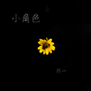

小角色
============================

|  |  |
| :--: | :-- |
| [ 小角色](https://emumo.xiami.com/album/2102419829) | **艺人**: [齐一](../index.md) **语种**: 国语 **唱片公司**: 独立发行 **发行时间**: 2016年07月28日 **专辑类别**: EP, 单曲 **专辑风格**: 流行 Pop **播放数**: 24635 **收藏数**: 5 **评论数**: 0  |

## 简介

人生如戏，戏如人生。我们每个人都是我们自己人生的主角，我们判断事情的对错，对爱情对生活对一切都是主观的。而在社会这个大导演的眼里，所有的人沦为这场大戏的小角色。生活中也许你我皆龙套，但其实，只要我们对自己抱有信心，热爱生活，接受安排，谁又不是自己的大英雄呢？ 

## 曲目

## 评论

|  |  |  |  |
| :-- | :-- | :-- | :-- |
