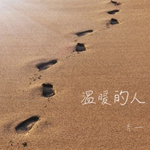

温暖的人
============================

|  |  |
| :--: | :-- |
| [ 温暖的人](https://emumo.xiami.com/album/2102697080) | **艺人**: [齐一](../index.md) **语种**: 国语 **唱片公司**: 独立发行 **发行时间**: 2017年02月18日 **专辑类别**: EP, 单曲 **专辑风格**: 独立民谣 Indie Folk **播放数**: 652956 **收藏数**: 64 **评论数**: 12  |

## 简介

 成长的过程中，我们不断地接触新鲜事物，很多路过的人也逐渐变成我们人生中的过客，但总有一些人让我们感到温暖，对于生活对于爱情对于理想，他们总会给我们鼓励和正能量，而这些人，使我们难以忘记。在我们无助迷茫的时候，他们像一盏太阳一样照亮你前行的路。而慢慢地，不知不觉中我们也变成了那个人，变成那个把人生感悟分享给彼此的那个人，变成那个身经百战的人，那个孤单的人，那个温暖的人。 

## 曲目

## 评论

|  |  |  |
| :-- | :-- | :-- |
|  [虾米用户](https://emumo.xiami.com/u/305002793)  2020-04-22 21:12 赞(0) 踩(0) | 
唱进心坎里了
 |
|  [虾米用户](https://emumo.xiami.com/u/336074664)  2020-02-03 21:50 赞(0) 踩(0) | 
有回忆，有感悟，有体会
 |
|  [虾米用户](https://emumo.xiami.com/u/187649774)   2017-04-12 19:29 赞(0) 踩(0) | 
为什么我买了放不了 
 |
|  [虾米用户](https://emumo.xiami.com/u/277137366)   2017-03-23 00:25 赞(0) 踩(0) | 

 |
|  [虾米用户](https://emumo.xiami.com/u/16206377) rabbit_❀moon 2017-03-13 20:33 赞(0) 踩(0) | 
暖心的歌
 |
|  [虾米用户](https://emumo.xiami.com/u/147139966) 孤独而忘情的度日  2017-03-10 16:43 赞(0) 踩(0) | 
喜欢
 |
|  [虾米用户](https://emumo.xiami.com/u/1789690) 其他不管，听歌的品味不能... 2017-03-02 18:50 赞(0) 踩(0) | 
前排留名，支持支持！
 |
|  [虾米用户](https://emumo.xiami.com/u/235732828) 简单的人 2017-03-01 10:26 赞(0) 踩(0) | 
喜欢
 |
|  [虾米用户](https://emumo.xiami.com/u/58042536)  2017-02-22 12:28 赞(1) 踩(0) | 
喜欢的人，支持正版，就2块
 |
|  [虾米用户](https://emumo.xiami.com/u/249937070) 人生若无悔放下过去归零 2017-02-22 07:47 赞(1) 踩(0) | 
想要守护的人，想要做的事，喜欢的生活方式，都是前进的动力，努力的意义。
 |
|  [虾米用户](https://emumo.xiami.com/u/202281604) 顽固的憨人，永远倔强。 2017-02-21 17:23 赞(0) 踩(0) | 
我是第二个嘿嘿
 |
|  [虾米用户](https://emumo.xiami.com/u/8234347) Last day 2017-02-21 16:00 赞(0) 踩(0) | 
怀念那个温暖的人...祝福你
 |
