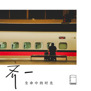

生命中的时光Moments in Our Lives
============================

|  |  |
| :--: | :-- |
| [ 生命中的时光Moments in Our Lives](https://emumo.xiami.com/album/2102819207) | **艺人**: [齐一](../index.md) **语种**: 国语 **唱片公司**: 华纳音乐 **发行时间**: 2017年08月24日 **专辑类别**: EP, 单曲 **专辑风格**: 国语流行 Mandarin Pop **播放数**: 684730 **收藏数**: 76 **评论数**: 8  |

## 简介

「给时光以生命  
而非给生命以时光」  
  
有关《生命中的时光》的一些事  
齐一  
  
何为生命，个人理解为作为人类还能喘气的阶段叫生命。何为时光，我认为时光则是在特定的时间段里片段的总和。人活三十，对生活总要有些看法的。人很有意思，有的时候会抱怨身边所有的麻烦为何统统发生在自己身上，希望赶紧熬过这段时光；有的时候会集很多大事于一身，没有时间快乐悲伤，感慨人生苦短时间不够用，但无论如何感慨，不可否认，生命是有限的，回头望去，总有些瞬间是永不褪色的。  
是啊，我总会唱悲伤的爱情故事和人生感悟，也许这就是给我刺激最大的时光吧。我们总想把自己活成一个理想的样子，可往往现实会让我们活成另一个样，这也许就是老人言“活不明白”吧。我习惯纠结于悲观乐观，理性感性，曾想把自己活成一场梦一首歌一部电影，风尘仆仆而来，轰轰烈烈而去，但其实更多的时间都是在忍受压力和寂寞，而在而立之后，我却再也没有那份“王侯将相宁有种乎”的劲，而是选择顺天意尽人事。回顾往事，也想不起来太多，只剩感激。  
  
此歌中囊括四个生命中的片段，分别是难熬、寂寞、热血、浪漫。  
  
为何难熬，因为生活不会以我们的意志为转移，城市越大人越孤僻，而钻过名利后，往往留下的是可怕的思考。环境一安静人就会思考，相信每个人都有难熬的时候，在我们生命未终结之前，谁也无法判断哪个瞬间最难熬，但这并不重要，重要的是，是什么让你熬过去了。  
  
为何寂寞，这很好解释，没有希望就没有失望，怕就怕付出后的结果并不是你想要。曾经拥有再被夺走后，那种感觉叫寂寞。  
  
为何热血，因为人总要活着，为自己而活着。没有谁的鼓励比自己鼓励自己更有效。生活有时不尽人意，但回过头总要看看自己是否尽力，如尽力，也算是无憾了。不管世界如何变化，我们总要保持一些自己的脾气，你说呢？  
  
为何浪漫，每个人都想和喜欢的人做喜欢的事，永远在一起。爱有它的魅力和本质，虽然在这个社会里，爱是很不稳定的一种感情，但谁又不期盼有一个人出现后，可以让你死心塌地。  
  
也许我们现在并不能把生活活成一场梦，但也许多年后回头望去，那似曾相识那朦朦胧胧的感觉，像不像一场梦？

## 曲目

## 评论

|  |  |  |  |
| :-- | :-- | :-- | :-- |
|  [虾米用户](https://emumo.xiami.com/u/91878034) 他们都叫我莉香 2018-05-30 06:52 赞(0) 踩(0) | 
送给十年前的我，也希望十年后的我还会喜欢这把年轻的声音。
 |
|  [虾米用户](https://emumo.xiami.com/u/355120539)  2018-05-20 13:45 赞(0) 踩(0) | 
第一次听 就喜欢上了
 |
|  [虾米用户](https://emumo.xiami.com/u/118428982)  2017-11-07 21:09 赞(0) 踩(0) | 
在为自己梦想奔跑的时候听到这首歌，很安慰
 |
|  [虾米用户](https://emumo.xiami.com/u/303352851)  2017-10-26 08:06 赞(0) 踩(0) | 
好听 好听
 |
|  [虾米用户](https://emumo.xiami.com/u/20062496)  2017-10-08 15:25 赞(0) 踩(0) | 
挺好听的 生活感叹!
 |
|  [虾米用户](https://emumo.xiami.com/u/321511452)  2017-08-27 01:58 赞(0) 踩(0) | 
网易云已经有了
 |
|  [虾米用户](https://emumo.xiami.com/u/3509693)  2017-08-25 20:58 赞(0) 踩(0) | 
每次听他的歌，总有种相似的感叹。就有种感觉他唱的就是我自己。不是自恋，而是一种真切的感叹。致自己，致而立之年的自己！！！
 |
|  [虾米用户](https://emumo.xiami.com/u/17239354)  2017-08-24 23:36 赞(0) 踩(0) | 
沙发
 |
