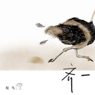

鸵鸟
============================

|  |  |
| :--: | :-- |
| [ 鸵鸟](https://emumo.xiami.com/album/2103763015) | **艺人**: [齐一](../index.md) **语种**: 国语 **唱片公司**: 华纳音乐 **发行时间**: 2018年06月27日 **专辑类别**: EP, 单曲 **专辑风格**: 国语流行 Mandarin Pop **播放数**: 2990 **收藏数**: 2 **评论数**: 1  |

## 简介

「我们唯一能够逃避的  
就是逃避本身」 齐一  
  
这首歌的根源是我很喜欢这个动物，也很喜欢它的性格。偶然之间觉得我和它有着部分性格的重叠，便索性将其拟人化。在我对其的认知里，它始终是简单的低俗的，有着过人的自卑和极端的自信，善于用很自欺欺人的方式躲避是非，也很知足当下的生活。傻人有傻福，我相信傻鸟也一样，基本解决温饱，开心的时候可以疯跑，不开心的时候也可以疯跑，乐观是常态，就像存活在卡通片里一样的无忧和看开，但也时常在快速的奔跑中流失了不争气的泪水和不甘。  
  
小的时候会看一些卡通片，成长的过程中会慢慢淡忘，而立之后，偶然重新欣赏，竟然对那些傻傻的动画人物有了新理解，我开始羡慕那种心态，那是我的理想国里完美的心态吧。毕竟现实世界是残酷的，是不同于手捧爆米花的。不知何时起我发现我并没有很好地适应这个情绪化的世界，也并没有准备好接受让自己八面玲珑，或许是我仍未开化吧，或是内心的抵触或情绪的压抑吧，逃避总是在所难免。鸟无完鸟，人无完人，一只理论上称不上合格的鸟，和一个看起来并不高明之人，无分别。但好在，这飞不起来的鸟一直在跑，这糊涂之人也一直在自己选择的路上，这不挺好的么。所以呢，物竞天择之中，学会知足，也要学会及时行乐。

## 曲目

## 评论

|  |  |  |  |
| :-- | :-- | :-- | :-- |
|  [虾米用户](https://emumo.xiami.com/u/270882930)  2018-07-06 09:17 赞(0) 踩(0) | 
第一个评论的诶，齐叔的歌超好听
 |
