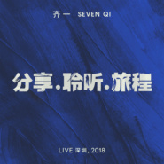

分享.聆听.旅程 (Live 深圳, 2018)
============================

|  |  |
| :--: | :-- |
| [ 分享.聆听.旅程 (Live 深圳, 2018)](https://emumo.xiami.com/album/2103925800) | **艺人**: [齐一](../index.md) **语种**: 国语 **唱片公司**: 华纳音乐 **发行时间**: 2018年08月16日 **专辑类别**: 现场专辑 **专辑风格**: 国语流行 Mandarin Pop, 华语唱作人 Chinese Singer-Songwriter **播放数**: 5180 **收藏数**: 9 **评论数**: 2  |

## 简介

「分享」音乐，「聆听」故事，陪伴开启一段全新「旅程」。《分享.聆听.旅程》是齐一的首张现场录音专辑，收录了于2018年1月12日在深圳举办的“齐一个人音乐会”上共20首LIVE作品。  
这场音乐会中，除了《这个年纪》、《我们》、《致自己》等经典旧作，齐一也表演了《失眠的狂欢》、《余生的所有》等加盟华纳之后的新歌。通过这些作品，齐一向现场的乐迷分享了自己一路从来的心路历程，展现了自己作为音乐人逐渐成熟起来的姿态。在接下来的旅程中，齐一也将继续用他独有的温暖嗓音陪伴在你左右。

## 曲目

## 评论

|  |  |  |
| :-- | :-- | :-- |
|  [虾米用户](https://emumo.xiami.com/u/87343056)  2018-08-18 20:43 赞(0) 踩(0) | 
前排挤挤，等19年的 杭州站
 |
|  [虾米用户](https://emumo.xiami.com/u/248068211) 让你被爱是我光荣 2018-08-16 10:12 赞(0) 踩(0) | 
齐叔，什么时候来济南啊 
 |
