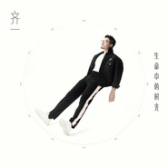
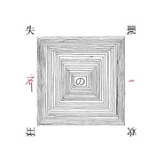
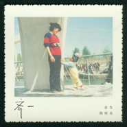
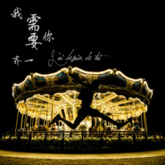
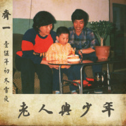

齐一
============================

|  |  |
| :--: | :-- |
| [ 齐一](https://i.xiami.com/qiyi) | **播放数**: 16281521 **粉丝数**: 5743 **评论数**: 246 **地区**: China 中国大陆 **风格**: 国语流行 Mandarin Pop  |

## 档案

齐一，80后唱作人，歌手。东北汉子，双子座，吃货，猫咪爱好者。 
2008年毕业于天津大学，现居住于北京。 
2013年成为唱作人，并开始积累自己的作品。 
在两年的时间写了100多首作品，并摘取其中九首以单曲形式发布在各大网络平台，获得好评。其中《致自己》《这个年纪》《非正常励志歌》《我们》等歌曲作为主打被大量网友转载翻唱。 
目前，《这个年纪》和《老齐》已发行。 
2017年齐一签约华纳音乐。 
三十岁的齐一，正值而立，被人亲切称作“齐叔”。总是习惯深夜去各大网络平台仔细翻阅每一个粉丝的留言然后点赞或回复，他说这样等粉丝们醒了会觉得比较暖，而齐叔总是这样的温暖。他是一个敢于谈及梦想的人，作品以描写生活感悟以及爱情为主题，齐一认为，生活跟爱情是每一个人都会接触并且每一个人都会慢慢忽视的东西，就像青春，触手可得，明知会有遗憾却又那样不愿珍惜。因此从歌曲立意上，齐一的歌更多是唤醒大家对生活和爱情的珍惜。 
齐一认为，有的东西，越脏，人们就越希望看见它干净的样子，理想与爱情就在其中。 
齐一的歌词总是让人感觉很接地气，用他的话来说，他是个现实主义大俗人，不善言辞，儿女情长，诗与远方之类情怀，都在歌里了，故事有一些，酒喝的比较少。他的歌词听起来没有华丽的词语，而是选择用最朴实的话，直接打情感的痛点。他说艺术不管是否高于生活，它一定先来源于生活，因此他的歌，比较生活。 
到了顺天意尽人事的年纪，他想多写写歌。而他理想的生活状态是，有你有她有大家。 
感谢遇见！

## 专辑

| 名称 | 语种 | 唱片公司 | 发行时间 | 专辑类别 | 专辑风格 |
| :--: | :-- | :-- | :-- | :-- | :-- |
| [ 李姐](./albums/5020715704.md) | 国语 | 华纳唱片 | 2020年05月22日 | 录音室专辑 | 流行 Pop |
| [ 执念](./albums/5020784010.md) | 国语 | 华纳唱片 | 2019年11月28日 | 录音室专辑 | 流行 Pop |
| [ 情场高手](./albums/2105173862.md) | 国语 | 华纳音乐 | 2019年08月23日 | EP, 单曲 |  |
| [ 生命中的时光](./albums/2105172170.md) | 国语 | 华纳音乐 | 2018年09月20日 | 录音室专辑 |  |
| [ 分享.聆听.旅程 (Live 深圳, 2018)](./albums/2103925800.md) | 国语 | 华纳音乐 | 2018年08月16日 | 现场专辑 | 国语流行 Mandarin Pop, 华语唱作人 Chinese Singer-Songwriter |
| [ 鸵鸟](./albums/2103763015.md) | 国语 | 华纳音乐 | 2018年06月27日 | EP, 单曲 | 国语流行 Mandarin Pop |
| [ 不凡的自己](./albums/2103710184.md) | 国语 | 华纳音乐 | 2018年05月15日 | EP, 单曲 | 国语流行 Mandarin Pop |
| [ 毕业](./albums/2103695907.md) | 国语 | 华纳音乐 | 2018年04月26日 | EP, 单曲 | 国语流行 Mandarin Pop |
| [ 一切都会好的](./albums/2103505542.md) | 国语 | 华纳音乐 | 2018年01月30日 | EP, 单曲 | 国语流行 Mandarin Pop, 华语唱作人 Chinese Singer-Songwriter |
| [ 失眠的狂欢](./albums/2103465577.md) | 国语 | 华纳音乐 | 2017年12月31日 | EP, 单曲 | 国语流行 Mandarin Pop |
| [ 余生的所有To My Precious You](./albums/2102879630.md) | 国语 | 华纳音乐 | 2017年10月25日 | EP, 单曲 | 国语流行 Mandarin Pop |
| [ 玩笑话Joke](./albums/2102861388.md) | 国语 | 华纳音乐 | 2017年09月22日 | EP, 单曲 | 国语流行 Mandarin Pop |
| [ 生命中的时光Moments in Our Lives](./albums/2102819207.md) | 国语 | 华纳音乐 | 2017年08月24日 | EP, 单曲 | 国语流行 Mandarin Pop |
| [ 老齐Mr Qi](./albums/2102922980.md) | 英语 | 华纳音乐 | 2017年05月05日 | 录音室专辑 | 国语流行 Mandarin Pop |
| [ 温暖的人](./albums/2102697080.md) | 国语 | 独立发行 | 2017年02月18日 | EP, 单曲 | 独立民谣 Indie Folk |
| [ 生日那天](./albums/2102418712.md) | 国语 | 独立发行 | 2016年10月22日 | EP, 单曲 | 流行 Pop |
| [ 两个男人的周末](./albums/2102419310.md) | 国语 | 独立发行 | 2016年08月12日 | EP, 单曲 | 流行 Pop |
| [ 小角色](./albums/2102419829.md) | 国语 | 独立发行 | 2016年07月28日 | EP, 单曲 | 流行 Pop |
| [ 假如有一天](./albums/2100355885.md) | 国语 | 独立发行 | 2016年06月18日 | EP, 单曲 | 流行 Pop |
| [ 亲爱的，你的棉裤真的不在我家](./albums/2100355887.md) | 国语 | 独立发行 | 2016年06月18日 | EP, 单曲 | 流行 Pop |
| [ 我需要你](./albums/2100328238.md) | 国语 | 独立发行 | 2016年05月04日 | EP, 单曲 | 流行 Pop |
| [ 值得就好](./albums/2100265762.md) | 国语 | 独立发行 | 2016年01月25日 | EP, 单曲 |  |
| [ 这个年纪（classical guitar version）](./albums/2100261018.md) | 国语 | 独立发行 | 2016年01月15日 | EP, 单曲 | 流行 Pop |
| [ 我们](./albums/2100244190.md) | 国语 | 独立发行 | 2015年12月05日 | EP, 单曲 |  |
| [ 飞鸟](./albums/2100242490.md) | 国语 | 独立发行 | 2015年11月27日 | EP, 单曲 |  |
| [ 老人与少年](./albums/2100235696.md) | 国语 | 独立发行 | 2015年11月10日 | EP, 单曲 |  |
| [ 非正常励志歌](./albums/2100229500.md) | 国语 | 独立发行 | 2015年10月29日 | EP, 单曲 |  |
| [ 有光的地方](./albums/2100222140.md) | 国语 | 独立发行 | 2015年10月18日 | EP, 单曲 | 流行 Pop |
| [ 这个年纪At This Age](./albums/2100216698.md) | 国语 | 独立发行 | 2015年10月12日 | 录音室专辑 | 国语流行 Mandarin Pop |
| [ 致自己](./albums/2100178113.md) | 国语 | 独立发行 | 2015年08月12日 | EP, 单曲 | 流行 Pop |

## 评论

|  |  |  |  |
| :-- | :-- | :-- | :-- |
|  [虾米用户](https://emumo.xiami.com/u/327164858) 我还没想好要写什么... 2020-10-05 22:20 赞(0) 踩(0) | 
很幸运发现了这个声音，每首歌的歌词太真实了
 |
|  [虾米用户](https://emumo.xiami.com/u/353090854) 我还没想好要写什么... 2020-03-23 21:35 赞(0) 踩(0) | 
太棒了
 |
|  [虾米用户](https://emumo.xiami.com/u/6345577)  2020-01-27 23:49 赞(0) 踩(0) | 
偶尔听到，一直循环。 
 |
|  [虾米用户](https://emumo.xiami.com/u/42963872) 我还没想好要写什么... 2019-08-06 06:22 赞(0) 踩(0) | 
.
 |
|  [虾米用户](https://emumo.xiami.com/u/294932392)  2019-06-28 00:17 赞(0) 踩(0) | 
《余生的所有》听哭了我，连我5岁的儿子听了也似懂非懂地说让他有种很难过想哭的感觉。写尽了所有父母对孩子一生要说的话，要做的事
 |
|  [虾米用户](https://emumo.xiami.com/u/345697058)  2019-05-06 06:01 赞(0) 踩(0) | 
齐一加油，好喜欢你的声音，相信你一定会成功的。
 |
|  [虾米用户](https://emumo.xiami.com/u/338851264)  2019-04-13 09:07 赞(0) 踩(0) | 
还好遇到你 
 |
|  [虾米用户](https://emumo.xiami.com/u/342925685) 我只想静静聆听一首歌 2018-09-23 08:38 赞(0) 踩(0) | 
嗓音好的没法说
 |
|  [虾米用户](https://emumo.xiami.com/u/98370056)  2018-09-14 21:37 赞(0) 踩(0) | 
一切都会好的
 |
|  [虾米用户](https://emumo.xiami.com/u/50648437) 没有了 2018-09-11 23:42 赞(0) 踩(0) | 
为什么我这么晚才发现你
 |
|  [虾米用户](https://emumo.xiami.com/u/10451976) 火力全开 2018-08-31 22:58 赞(0) 踩(0) | 
有故事的人
 |
|  [虾米用户](https://emumo.xiami.com/u/346087991) 医路漫漫 音乐为伴 2018-08-24 21:25 赞(1) 踩(0) | 
好听支持
 |
|  [虾米用户](https://emumo.xiami.com/u/312289387)  2018-07-17 09:52 赞(0) 踩(0) | 
么（i空哦
 |
|  [虾米用户](https://emumo.xiami.com/u/344699557)  2018-07-05 23:21 赞(1) 踩(0) | 
齐哥，你会火
 |
|  [虾米用户](https://emumo.xiami.com/u/336760774)  2018-06-26 11:39 赞(0) 踩(0) | 
加油。
 |
|  [虾米用户](https://emumo.xiami.com/u/343219577) 阳光、树下、看书、听歌。... 2018-06-20 06:36 赞(1) 踩(0) | 
很作品很深入人心  特别是我这个年纪   希望出更多好作品
 |
|  [虾米用户](https://emumo.xiami.com/u/342984893)  2018-06-19 20:48 赞(0) 踩(0) | 
挺好听的，不客气
 |
|  [虾米用户](https://emumo.xiami.com/u/261591582) 错过就是错过，不要后悔，... 2018-06-13 22:42 赞(1) 踩(0) | 
今天第一次听到你的歌，爱上了你平淡故事像是说的我
 |
|  [虾米用户](https://emumo.xiami.com/u/302580667)  2018-05-28 23:26 赞(3) 踩(0) | 
齐哥  在音乐的道路上坚持下去
 |
|  [虾米用户](https://emumo.xiami.com/u/18001685)  2018-05-04 09:08 赞(0) 踩(0) | 
喜欢～
 |
|  [虾米用户](https://emumo.xiami.com/u/168044328) 可与言者无二三 2018-05-03 05:25 赞(0) 踩(0) | 
告诉齐叔，我也爱上他了
 |
|  [虾米用户](https://emumo.xiami.com/u/16884656) 今后也会喜欢各种各样的人... 2018-04-27 00:39 赞(1) 踩(0) | 
夜晚睡不着的时候，谢谢你的歌，给了我力量
 |
|  [虾米用户](https://emumo.xiami.com/u/323195517) 我还没想好要写什么... 2018-04-23 20:56 赞(0) 踩(0) | 
在一个公众号听到你的《一切都会好的》，然后听了你更多的歌。超级喜欢你的创作，希望以后能看到你更多好作品。谢谢你的创作能给予我们激励！
 |
|  [虾米用户](https://emumo.xiami.com/u/337303546)  2018-04-18 19:53 赞(0) 踩(0) | 
偶然听到你的歌，感动了;多年不见的朋友相聚时，播放了你的歌，都哭了，哭的稀里哗啦。你的歌触动了我们的内心，这个年纪的人有经历，有挫折，有难忘的青春&amp;hellip;还有《我们》和《致自己》，一直在听&amp;hellip;
 |
|  [虾米用户](https://emumo.xiami.com/u/243370649) 我还没想好要写什么... 2018-04-12 03:53 赞(0) 踩(0) | 
今天开车听103.9交通广播，偶然听到你的歌，很有感觉，也很有感触！这个社会，这个城市，这个年纪，总有那么一些让人不自在的地方，但是，管他呢！人生在世，孝顺父母，爱护妻儿，做到自己能做的，舒舒服服的过日子。有机会能让自己过的更好的时候就争取一把，争取到了，心里的满足感会更强烈。没争取到，现在的日子也会过的很舒服。至少不会后悔放弃了。不要给自己太多的压力，不要给自己太多的负面情绪，比起忧郁，还是一个充满乐观情绪的自嘲更舒服。心的世界可大可小，属于自己的秘密和净土就那么大点地方，那么你是选择守着这么点地方，还是放开心胸或者说心扉，去看看这天下，去感受这世界？生活永远是我们最好的老师，随心创作吧
 |
|  [虾米用户](https://emumo.xiami.com/u/348093784) 心已失，名无用。 2018-04-02 21:25 赞(0) 踩(0) | 
齐一加油！
 |
|  [虾米用户](https://emumo.xiami.com/u/271137009) 来自宇宙深处的天蝎座 2018-04-01 13:53 赞(0) 踩(0) | 
乐声入耳入心！
 |
|  [虾米用户](https://emumo.xiami.com/u/27942706)  2018-03-28 20:52 赞(0) 踩(0) | 
我也是今天才发现你的歌，好好听，喜欢你的歌&amp;hellip;&amp;hellip;加油！
 |
|  [虾米用户](https://emumo.xiami.com/u/347180820) 人要经得起诱惑 耐得住寂... 2018-03-24 23:32 赞(0) 踩(0) | 
磁性
 |
|  [虾米用户](https://emumo.xiami.com/u/293692544) 你敢给我说话吗？我咬你 2018-03-12 05:24 赞(1) 踩(0) | 
好听
 |
|  [虾米用户](https://emumo.xiami.com/u/265160712)  2018-03-08 01:10 赞(1) 踩(0) | 
❣加油
 |
|  [虾米用户](https://emumo.xiami.com/u/85426004)  2018-03-07 12:20 赞(2) 踩(0) | 
告诉齐一，我爱上他了
 |
|  [虾米用户](https://emumo.xiami.com/u/337808719)  2018-03-03 19:29 赞(1) 踩(0) | 
我妈说真好听，  
 |
|  [虾米用户](https://emumo.xiami.com/u/334620076)  2018-02-26 19:53 赞(1) 踩(0) | 
感谢你，在我无数个日夜中，用你的歌声陪伴我，或许你看不见，但还是要感谢，谢谢让我遇见你齐一。
 |
|  [虾米用户](https://emumo.xiami.com/u/51690819)  2018-02-25 16:21 赞(2) 踩(0) | 
❤
 |
|  [虾米用户](https://emumo.xiami.com/u/341738442) 饮冰十年 难凉热血 2018-02-21 18:25 赞(2) 踩(0) | 
你的每一首歌曲都穿透身体的流淌，试图冲破这封印，却束缚的更深！期待你的突破！
 |
|  [虾米用户](https://emumo.xiami.com/u/59355614)  2018-02-14 17:26 赞(1) 踩(0) | 
     
 |
|  [虾米用户](https://emumo.xiami.com/u/59355614)  2018-02-14 17:26 赞(1) 踩(0) | 
      
 |
|  [虾米用户](https://emumo.xiami.com/u/336847977)  2018-02-09 23:32 赞(2) 踩(0) | 
齐叔，加油。
 |
|  [虾米用户](https://emumo.xiami.com/u/336847977)  2018-02-09 23:31 赞(1) 踩(0) | 
你的歌都很有感触。
 |
|  [虾米用户](https://emumo.xiami.com/u/281354010)  2018-01-24 23:13 赞(1) 踩(0) | 
谢谢 你的声音，你的歌，感觉理解到了什么，谢谢。
 |
|  [虾米用户](https://emumo.xiami.com/u/292906177)  2018-01-09 06:19 赞(1) 踩(0) | 
喜欢 
 |
|  [虾米用户](https://emumo.xiami.com/u/335438201) QQ：279820251... 2017-12-28 19:27 赞(1) 踩(0) | 
对人生的看透
 |
|  [虾米用户](https://emumo.xiami.com/u/265139145)  2017-12-26 12:25 赞(2) 踩(0) | 
好听
 |
|  [虾米用户](https://emumo.xiami.com/u/339495358)  2017-12-24 19:46 赞(1) 踩(0) | 
歌词都是人生感悟啊 其实我不喜欢鸡汤类的 但是多听几遍就有哭的冲动
 |
|  [虾米用户](https://emumo.xiami.com/u/338866354)  2017-12-23 20:20 赞(1) 踩(0) | 
梦 还没出名就开始收费
 |
|  [虾米用户](https://emumo.xiami.com/u/890246)  2017-12-20 16:22 赞(1) 踩(0) | 
好听
 |
|  [虾米用户](https://emumo.xiami.com/u/311108814)  2017-12-19 15:58 赞(14) 踩(0) | 
今天，偶然听到你的歌，不只是歌词，还有你的声音，都让我超级有感觉，在在一大堆情情爱爱的歌曲里脱颖而出，单曲循环好久好久，真的很喜欢很喜欢你的声音，你的歌词，你的曲调，你的一切我都好喜欢&amp;hellip;&amp;hellip;
 |
|  [虾米用户](https://emumo.xiami.com/u/315034321)  2017-12-16 13:56 赞(1) 踩(0) | 
你的听歌可以免费听和下载就好了，爱你，希望这个要求能说服你，喜欢听你歌曲的人
 |
|  [虾米用户](https://emumo.xiami.com/u/315034321)  2017-12-16 13:53 赞(4) 踩(0) | 
忽然之间，我喜欢了齐一的歌，不知道，什么时候自己喜欢自己洒脱的感觉，不知道到那一天我会变成怎么样的人，我还是做回有态度的自己，致自己还是非正常励志歌。
 |
| ⇒ |  [虾米用户](https://emumo.xiami.com/u/340565338)  2018-01-02 12:48 赞(0) 踩(0) | 
这样很好
 |
|  [虾米用户](https://emumo.xiami.com/u/279176402) 生而为人，我很抱歉。 2017-12-15 20:08 赞(2) 踩(0) | 
喜欢你的歌
 |
|  [虾米用户](https://emumo.xiami.com/u/294973588)  2017-11-28 00:34 赞(1) 踩(0) | 
你的歌很有意思 
 |
|  [虾米用户](https://emumo.xiami.com/u/38925796)  2017-11-22 03:31 赞(1) 踩(0) | 
好听
 |
|  [虾米用户](https://emumo.xiami.com/u/326983299)  2017-11-19 11:20 赞(1) 踩(0) | 
你说你还会想起我，你说我们如此脆弱，我们这首 歌 该火
 |
|  [虾米用户](https://emumo.xiami.com/u/263593297)  2017-11-16 23:54 赞(1) 踩(0) | 
支持老齐，继续写下去唱下去，陪你！！！
 |
|  [虾米用户](https://emumo.xiami.com/u/331796133)  2017-11-02 16:37 赞(1) 踩(0) | 
加油，齐一
 |
|  [虾米用户](https://emumo.xiami.com/u/331969729)  2017-10-28 00:39 赞(1) 踩(0) | 
Eden
 |
|  [虾米用户](https://emumo.xiami.com/u/23831866) 离这里越远越好 2017-10-25 16:51 赞(1) 踩(0) | 
谢谢您的歌
 |
|  [虾米用户](https://emumo.xiami.com/u/2871) 虾米编辑部唯一官方账号 ... 2017-10-25 16:41 赞(2) 踩(0) | 
每张单曲页面都设置付费也是很无奈，导致单曲无法合并成专辑，已发行两张专辑《这个年纪》和《老齐》。
 |
| ⇒ |  [虾米用户](https://emumo.xiami.com/u/94583116) 我还没想好要写什么... 2017-10-26 00:13 赞(0) 踩(0) | 
所以说没都要付个费很麻烦啊。
 |
|  [虾米用户](https://emumo.xiami.com/u/285432977)  2017-10-22 11:29 赞(1) 踩(0) | 
6
 |
|  [虾米用户](https://emumo.xiami.com/u/309889915)  2017-10-17 13:26 赞(1) 踩(0) | 
   
 |
|  [虾米用户](https://emumo.xiami.com/u/9306372) 1900 2017-09-17 23:33 赞(2) 踩(0) | 
夜深人静独自驱车，偶然听到这首歌，很有感触
 |
|  [虾米用户](https://emumo.xiami.com/u/18857289)  2017-09-11 12:58 赞(1) 踩(0) | 
。。。
 |
|  [虾米用户](https://emumo.xiami.com/u/319293912)  2017-08-14 14:06 赞(1) 踩(0) | 
非常感谢您，唱出了我们的心。
 |
|  [虾米用户](https://emumo.xiami.com/u/84967250) 虚无而已 2017-07-19 09:55 赞(1) 踩(0) | 

 |
|  [虾米用户](https://emumo.xiami.com/u/2535585) 顺其自然 2017-07-14 22:30 赞(1) 踩(0) | 
不能听了，好心塞。呜呜呜，希望尽快解决版权问题。
 |
|  [虾米用户](https://emumo.xiami.com/u/279397337)  2017-06-24 17:19 赞(2) 踩(0) | 
我们是否该好好珍惜自己，总是对别人太热情，却对自己太小心，遍体鳞伤算不算聪明。
 |
|  [虾米用户](https://emumo.xiami.com/u/199513029) 呵呵 2017-06-06 11:19 赞(4) 踩(0) | 
上次他发微博怼了一个粉丝。我就在下面为哪位报了个不平 ，结果被他拉黑了。这样对待你的听众好吗。
 |
|  [虾米用户](https://emumo.xiami.com/u/227554803)   2017-06-03 00:26 赞(1) 踩(0) | 
心塞 为啥听不了
 |
| ⇒ |  [虾米用户](https://emumo.xiami.com/u/5693589)  2017-07-10 23:38 赞(0) 踩(0) | 
腾讯独家。
 |
|  [虾米用户](https://emumo.xiami.com/u/60212118)  2017-06-01 20:25 赞(1) 踩(0) | 
什么意思，突然不能听了 
 |
|  [虾米用户](https://emumo.xiami.com/u/294687716) 郑爽 2017-05-07 22:44 赞(1) 踩(0) | 
喜欢
 |
|  [虾米用户](https://emumo.xiami.com/u/293583047)  2017-05-03 20:11 赞(1) 踩(0) | 
这个年纪怎么没办法听啊！齐一
 |
|  [虾米用户](https://emumo.xiami.com/u/254686365)  2017-04-27 09:09 赞(1) 踩(0) | 
很不错的歌曲，唱出了我们这个年纪的事情，状况！
 |
|  [虾米用户](https://emumo.xiami.com/u/252188020)  2017-04-22 12:30 赞(1) 踩(0) | 
这个软件，太差劲了
 |
|  [虾米用户](https://emumo.xiami.com/u/274693209)  2017-04-20 23:52 赞(1) 踩(0) | 
不是这样的 你快节奏带点鼓奏的超级好听 一哥 你的声音 很好听 表现一种沧桑感觉 加上这首歌的寓意 用你声音来唱出来 very good 加油 一哥 赞
 |
|  [虾米用户](https://emumo.xiami.com/u/288440424)   2017-04-13 20:39 赞(2) 踩(0) | 
超喜欢这个年纪这首歌，好喜欢，歌词写的超棒！赞赞赞
 |
|  [虾米用户](https://emumo.xiami.com/u/230287061) 垃圾虾米！受够了！ 2017-04-11 07:21 赞(4) 踩(0) | 
版权QQ音乐买了吧，虾米不能听了，靠
 |
|  [虾米用户](https://emumo.xiami.com/u/94583116) 我还没想好要写什么... 2017-04-05 23:57 赞(1) 踩(0) | 
为什么听不了了。早知道下载了。
 |
|  [虾米用户](https://emumo.xiami.com/u/255826166)  2017-04-02 06:38 赞(2) 踩(0) | 
怎么今天不能听了
 |
|  [虾米用户](https://emumo.xiami.com/u/241701222)  2017-03-29 21:52 赞(1) 踩(0) | 
好听
 |
|  [虾米用户](https://emumo.xiami.com/u/241701222)  2017-03-29 21:52 赞(1) 踩(0) | 
加油
 |
|  [虾米用户](https://emumo.xiami.com/u/97747450) 我还没想好要写什么... 2017-03-27 22:58 赞(1) 踩(0) | 
9083
 |
|  [虾米用户](https://emumo.xiami.com/u/278626688)  2017-03-26 00:54 赞(1) 踩(0) | 
加油 
 |
|  [虾米用户](https://emumo.xiami.com/u/72444266)  2017-03-24 19:58 赞(1) 踩(0) | 
喜欢，
 |
|  [虾米用户](https://emumo.xiami.com/u/253520376)  2017-03-24 10:16 赞(1) 踩(0) | 
我是90后 
 |
|  [虾米用户](https://emumo.xiami.com/u/47022702) 爱民谣 2017-03-22 17:22 赞(2) 踩(0) | 
从一开始就关注你，最早是在唱吧，希望你越来越好，有越来越多的作品出来
 |
|  [虾米用户](https://emumo.xiami.com/u/274029466)  2017-03-21 05:45 赞(1) 踩(0) | 
很好听 加油
 |
|  [虾米用户](https://emumo.xiami.com/u/275506764)  2017-03-20 00:02 赞(1) 踩(0) | 
棒棒的.！喜欢
 |
|  [虾米用户](https://emumo.xiami.com/u/157179378)  2017-03-16 17:36 赞(2) 踩(0) | 
好听
 |
|  [虾米用户](https://emumo.xiami.com/u/43383647) 逆境里不卑不亢、保持善良 2017-03-16 14:46 赞(1) 踩(0) | 
今天阳光很好，懒洋洋的看蔡崇达的书，偶然听见齐一的歌，赶紧来找，真的很适合看书的时候听~
 |
|  [虾米用户](https://emumo.xiami.com/u/277089259)  2017-03-15 20:30 赞(2) 踩(0) | 
喜欢
 |
|  [虾米用户](https://emumo.xiami.com/u/35498297)  2017-03-15 09:25 赞(1) 踩(0) | 
有感觉
 |
|  [虾米用户](https://emumo.xiami.com/u/259527178)  2017-03-13 09:53 赞(1) 踩(0) | 

 |
|  [虾米用户](https://emumo.xiami.com/u/278901620)   2017-03-09 10:30 赞(0) 踩(0) | 

 |
|  [虾米用户](https://emumo.xiami.com/u/249937070) 人生若无悔放下过去归零 2017-03-09 09:12 赞(2) 踩(0) | 
愿有人不怕天黑，只怕你心酸皱眉。想要踏踏实实找个人一起生活，你喜欢他，他喜欢你，没有秘密，没有不开心，性格可以磨合，习惯不一样可以适应，只要都有一颗一直走下去的决心就好，
 |
|  [虾米用户](https://emumo.xiami.com/u/226777345) 不求不妄，苦乐自当 2017-03-06 21:03 赞(0) 踩(0) | 
很好听
 |
|  [虾米用户](https://emumo.xiami.com/u/73857918) 在黎明之前 2017-03-06 20:15 赞(0) 踩(0) | 
不像双子座哎
 |
|  [虾米用户](https://emumo.xiami.com/u/175927020)  2017-03-02 21:37 赞(0) 踩(0) | 
喜欢
 |
|  [虾米用户](https://emumo.xiami.com/u/6860165)  2017-03-02 10:55 赞(2) 踩(0) | 
老齐撩动了了我们一群80早期人的最脆弱的那根弦。又温暖，又忧伤，有彷徨，有希望。平静的生活一下子多了一点点曙光。好吧，叫你齐宗盛可好？ 
 |
|  [虾米用户](https://emumo.xiami.com/u/82229656)  2017-02-28 03:17 赞(0) 踩(0) | 
我应该谢谢虎牙老萬  没有他我也不会知道这么厉害的音乐人
 |
|  [虾米用户](https://emumo.xiami.com/u/276069595)  2017-02-26 22:00 赞(0) 踩(0) | 
这个年纪太好听了
 |
|  [虾米用户](https://emumo.xiami.com/u/37936777)  2017-02-26 16:12 赞(0) 踩(0) | 
齐一
 |
|  [虾米用户](https://emumo.xiami.com/u/1008284) 我还没想好要写什么... 2017-02-21 08:39 赞(0) 踩(0) | 
赞
 |
|  [虾米用户](https://emumo.xiami.com/u/199250227) 走在路上捡风景and顺便... 2017-02-18 23:10 赞(0) 踩(0) | 
温暖的人 
 |
|  [虾米用户](https://emumo.xiami.com/u/272662344)  2017-02-18 11:13 赞(0) 踩(0) | 
我挺你齐叔
 |
|  [虾米用户](https://emumo.xiami.com/u/273349306)  2017-02-14 13:02 赞(0) 踩(0) | 
  
 |
|  [虾米用户](https://emumo.xiami.com/u/273244274)  2017-02-13 20:47 赞(1) 踩(0) | 
齐叔 
 |
|  [虾米用户](https://emumo.xiami.com/u/46932366) 永远年轻，永远热泪盈眶 2017-02-12 17:35 赞(0) 踩(0) | 
好音乐 
 |
|  [虾米用户](https://emumo.xiami.com/u/239628457)  2017-02-10 22:50 赞(0) 踩(0) | 
啥都不说     
 |
|  [虾米用户](https://emumo.xiami.com/u/262186813)  2017-02-08 07:27 赞(0) 踩(0) | 
移花宫，，，，见一面        
 |
|  [虾米用户](https://emumo.xiami.com/u/40033856) 生活被我逼疯了 2017-02-07 17:14 赞(0) 踩(0) | 
为什么学李宗盛
 |
|  [虾米用户](https://emumo.xiami.com/u/233102628)   人间情事太俗、何不奔... 2017-02-06 00:05 赞(0) 踩(0) | 
我们、
 |
|  [虾米用户](https://emumo.xiami.com/u/44015941) 仰望天空，仍是一片璀璨星... 2017-02-03 21:01 赞(0) 踩(0) | 
真得很不错！
 |
| ⇒ |  [虾米用户](https://emumo.xiami.com/u/270638798)  2017-02-04 12:09 赞(0) 踩(0) | 
666
 |
|  [虾米用户](https://emumo.xiami.com/u/261230409)  2017-02-02 07:49 赞(0) 踩(0) | 
大叔，你绝对是吹泪鬼 
 |
|  [虾米用户](https://emumo.xiami.com/u/256436458)  2017-01-31 13:15 赞(0) 踩(0) | 
喜欢齐一很久了。
 |
|  [虾米用户](https://emumo.xiami.com/u/47663994)   2017-01-28 12:48 赞(0) 踩(0) | 
叔我来啦。 
 |
|  [虾米用户](https://emumo.xiami.com/u/250431316) 一直不变的是音乐 2017-01-26 17:09 赞(0) 踩(0) | 
很好听
 |
|  [虾米用户](https://emumo.xiami.com/u/250431316) 一直不变的是音乐 2017-01-26 17:05 赞(0) 踩(0) | 
这个年纪。好听
 |
|  [虾米用户](https://emumo.xiami.com/u/1721605)  2017-01-22 21:27 赞(0) 踩(0) | 
喜欢
 |
|  [虾米用户](https://emumo.xiami.com/u/108188218)   2017-01-16 09:51 赞(0) 踩(0) | 
单曲循环了好久
 |
|  [虾米用户](https://emumo.xiami.com/u/196681558)   2017-01-14 22:38 赞(0) 踩(0) | 
大双子 最近好喜欢你的歌
 |
|  [虾米用户](https://emumo.xiami.com/u/258898101)  2017-01-09 09:51 赞(0) 踩(0) | 
就是我想说却无法说的表达。
 |
|  [虾米用户](https://emumo.xiami.com/u/17199566) The Mountain... 2017-01-08 12:43 赞(0) 踩(0) | 
难得悲伤的不假不腻不空，很抓心，关注了。
 |
|  [虾米用户](https://emumo.xiami.com/u/247283511)   2017-01-07 19:04 赞(0) 踩(0) | 
离别就是残忍的
 |
|  [虾米用户](https://emumo.xiami.com/u/231289937) 珍惜此时此刻 2017-01-07 12:27 赞(0) 踩(0) | 
跟着自己，嫑被别人带跑偏
 |
|  [虾米用户](https://emumo.xiami.com/u/231289937) 珍惜此时此刻 2017-01-07 12:26 赞(0) 踩(0) | 
真的很不错啊
 |
|  [虾米用户](https://emumo.xiami.com/u/51833733)  2017-01-06 18:21 赞(0) 踩(0) | 
吃晚饭时听到的歌，惊艳了耳朵
 |
|  [虾米用户](https://emumo.xiami.com/u/253357451)  2017-01-04 12:57 赞(0) 踩(0) | 
很好听
 |
|  [虾米用户](https://emumo.xiami.com/u/41271260) 为了男人的奥迪，为了女人... 2017-01-02 22:24 赞(0) 踩(0) | 
哥们加油、有机会来西安坐！
 |
|  [虾米用户](https://emumo.xiami.com/u/236945310)   2016-12-31 09:43 赞(0) 踩(0) | 
好听 加油
 |
|  [虾米用户](https://emumo.xiami.com/u/6187648) ✎。 2016-12-30 12:02 赞(0) 踩(0) | 
看好！加油哦！
 |
|  [虾米用户](https://emumo.xiami.com/u/230287061) 垃圾虾米！受够了！ 2016-12-29 23:38 赞(0) 踩(0) | 
加油吧
 |
|  [虾米用户](https://emumo.xiami.com/u/51812118) 只会被不相干的人遗忘 2016-12-12 10:53 赞(0) 踩(0) | 
走过那么多，还留下什么…
 |
|  [虾米用户](https://emumo.xiami.com/u/27792481)  2016-12-09 09:52 赞(0) 踩(0) | 
非常棒
 |
|  [虾米用户](https://emumo.xiami.com/u/49278710) 六月栖栖 2016-12-07 12:54 赞(0) 踩(0) | 
不愿将就我最喜欢这个
 |
|  [虾米用户](https://emumo.xiami.com/u/238050672)  2016-12-05 23:01 赞(0) 踩(0) | 
可以
 |
|  [虾米用户](https://emumo.xiami.com/u/12247792)  2016-12-05 10:23 赞(0) 踩(0) | 
&amp;quot;假如有一天“这首一开嗓差点就哭了是怎么回事。。。。。。。。。。再继续听下去，这歌词也是太打动人了。。
 |
|  [虾米用户](https://emumo.xiami.com/u/7746107) 我还没想好要写什么... 2016-11-28 01:25 赞(2) 踩(0) | 
很喜欢你昨晚在母校的音乐会，小学弟来给你顶一个！
 |
|  [虾米用户](https://emumo.xiami.com/u/179441818)   2016-11-16 14:10 赞(0) 踩(0) | 
这首真的好听，希望齐一给我们带来跟好听的歌，支持 
 |
|  [虾米用户](https://emumo.xiami.com/u/29230391) 我还没想好要写什么... 2016-10-30 13:15 赞(0) 踩(0) | 
每首歌都能唱进我的心
 |
|  [虾米用户](https://emumo.xiami.com/u/86189528)   2016-10-26 09:05 赞(0) 踩(0) | 
第一次在虾米里评论 每一首歌都太棒了 加油！ 
 |
|  [虾米用户](https://emumo.xiami.com/u/236005062) Hope.Faith.A... 2016-10-25 15:20 赞(0) 踩(0) | 
太喜欢！ 
 |
|  [虾米用户](https://emumo.xiami.com/u/236452744)   2016-10-14 15:27 赞(0) 踩(0) | 
太喜欢
 |
|  [虾米用户](https://emumo.xiami.com/u/119708600)  2016-10-11 14:32 赞(0) 踩(0) | 

 |
|  [虾米用户](https://emumo.xiami.com/u/79873408)  2016-09-11 13:07 赞(1) 踩(0) | 
好好做你的忠实粉丝 
 |
|  [虾米用户](https://emumo.xiami.com/u/162477510) 你来吧 我在这里等着你 2016-08-27 09:46 赞(0) 踩(0) | 
总得来说 很好吧 歌唱的非常好
 |
|  [虾米用户](https://emumo.xiami.com/u/118178636)   2016-08-08 09:22 赞(1) 踩(0) | 
当初被这个年纪秒到
 |
|  [虾米用户](https://emumo.xiami.com/u/208282328)  2016-08-02 23:03 赞(1) 踩(0) | 
喜欢我们这首歌的调调。。嗓音很好听。超爱。。棒棒哒 
 |
|  [虾米用户](https://emumo.xiami.com/u/205495399)  2016-07-28 02:06 赞(2) 踩(0) | 
我下载了你所有的歌儿，超爱你齐叔，永远支持你，请继续下去
 |
|  [虾米用户](https://emumo.xiami.com/u/195614835)  2016-06-30 09:15 赞(1) 踩(0) | 
齐一，加油
 |
|  [虾米用户](https://emumo.xiami.com/u/111870876) 我，爱这生活。 2016-06-27 02:33 赞(0) 踩(0) | 
有的歌词太口水
 |
|  [虾米用户](https://emumo.xiami.com/u/192464248)  2016-06-21 14:16 赞(0) 踩(0) | 
 
 |
|  [虾米用户](https://emumo.xiami.com/u/35070569)   2016-06-15 13:28 赞(1) 踩(0) | 
很好听 最爱的就是这个年纪和非正常励志歌  
 |
|  [虾米用户](https://emumo.xiami.com/u/175342622)  2016-06-13 22:18 赞(0) 踩(0) | 
齐一加油  
 |
|  [虾米用户](https://emumo.xiami.com/u/39672257) 就算在想哭。。。也要微笑... 2016-06-05 22:33 赞(1) 踩(0) | 
不错，加油！同为东北的。。。
 |
|  [虾米用户](https://emumo.xiami.com/u/28679674) 喝最烈的酒，日最野的狗. 2016-06-02 01:24 赞(12) 踩(0) | 
烟嗓好听的没sei了 
 |
|  [虾米用户](https://emumo.xiami.com/u/9860933)  2016-05-30 23:53 赞(1) 踩(0) | 
转粉
 |
|  [虾米用户](https://emumo.xiami.com/u/15878503) 左手大海，右手冰川。 2016-05-29 21:39 赞(0) 踩(0) | 
我的女人呢 在谁的床上呻吟
 |
|  [虾米用户](https://emumo.xiami.com/u/177966728)  2016-05-24 00:53 赞(2) 踩(0) | 
好听
 |
|  [虾米用户](https://emumo.xiami.com/u/51783933)   2016-05-16 10:43 赞(0) 踩(0) | 
感动我
 |
|  [虾米用户](https://emumo.xiami.com/u/153383062)   2016-05-10 12:06 赞(1) 踩(0) | 
非常好听，也分享给了朋友，请打起精神继续努力。
 |
|  [虾米用户](https://emumo.xiami.com/u/163840130) 生活累，一小半源于生存、... 2016-05-10 00:27 赞(1) 踩(0) | 
一口气把所有歌全听了，听完后全都下载了，喜欢的不得了！好听！
 |
|  [虾米用户](https://emumo.xiami.com/u/20147189) 嘘 2016-05-06 23:41 赞(0) 踩(0) | 
duang
 |
|  [虾米用户](https://emumo.xiami.com/u/64435212)  2016-04-27 01:06 赞(1) 踩(0) | 
太感动了！每个夜晚听着热泪盈眶
 |
|  [虾米用户](https://emumo.xiami.com/u/136261882)  2016-04-07 11:54 赞(1) 踩(0) | 
能直达心灵的音乐，声音比较有内容。
 |
|  [虾米用户](https://emumo.xiami.com/u/20228960)  2016-03-24 12:03 赞(0) 踩(0) | 
吉他很干净，嗓音很沧桑
 |
|  [虾米用户](https://emumo.xiami.com/u/6492132)  2016-03-15 00:08 赞(1) 踩(0) | 
在蜗牛的家致敬李宗盛大哥专场被齐一老师迷人的大烟嗓感动得不行，翻唱和原创都很棒，会继续支持你哒！生日只差一天的大双子～ 
 |
| ⇒ |  [虾米用户](https://emumo.xiami.com/u/71148586) 你有的只有你自己 2016-05-20 10:17 赞(0) 踩(0) | 
可以问一下是几月几
 |
|  [虾米用户](https://emumo.xiami.com/u/5020716) 想象另一种可能。 2016-01-14 18:07 赞(1) 踩(0) | 
不错不错。很自由那。
 |
|  [虾米用户](https://emumo.xiami.com/u/47577064) 杂食耳 2015-12-14 10:29 赞(1) 踩(0) | 
那个励志哥啊，是要走李宗盛的路子么
 |
|  [虾米用户](https://emumo.xiami.com/u/26887011) 兀自矜持的民谣，也无风雨... 2015-12-06 10:48 赞(1) 踩(0) | 
吉他版更加干净纯粹，钢琴版更加绵长，从情绪的角度来看，钢琴更容易调动心底情感，更伤怀。
 |
|  [虾米用户](https://emumo.xiami.com/u/60405918)  2015-12-03 10:19 赞(0) 踩(0) | 

 |
|  [虾米用户](https://emumo.xiami.com/u/60405918)  2015-12-03 10:18 赞(0) 踩(0) | 
大烟嗓
 |
|  [虾米用户](https://emumo.xiami.com/u/73379072) 每天嘻嘻哈哈的笑着，只有... 2015-12-02 22:13 赞(1) 踩(0) | 
耳朵怀孕了 (˶‾᷄ ⁻̫ ‾᷅˵)
 |
|  [虾米用户](https://emumo.xiami.com/u/84394494)   2015-11-18 23:39 赞(0) 踩(0) | 
 
 |
|  [虾米用户](https://emumo.xiami.com/u/3010077)  2015-11-14 09:31 赞(1) 踩(0) | 
向执着追求梦想的你致敬～加油 
 |
|  [虾米用户](https://emumo.xiami.com/u/79873408)  2015-11-05 00:30 赞(0) 踩(0) | 
我来了，有点晚。我是谁谁谁的陈豆豆   
 |
|  [虾米用户](https://emumo.xiami.com/u/79713658)  2015-11-04 13:05 赞(0) 踩(0) | 
很喜欢你的歌，齐一加油，我是通过松婷知道你的，你的歌很打动人
 |
|  [虾米用户](https://emumo.xiami.com/u/77864210)  2015-10-30 11:41 赞(1) 踩(0) | 
加油，大叔。
 |
|  [虾米用户](https://emumo.xiami.com/u/77663684) 只为了齐一，齐一不仅仅是... 2015-10-29 16:35 赞(0) 踩(0) | 
哈哈
 |
|  [虾米用户](https://emumo.xiami.com/u/77349940)  2015-10-27 23:25 赞(0) 踩(0) | 
要听你的歌真不容易  还要下个虾米  其他播放器我都卸载了  希望能多出点歌  真的太好听好听好听好听了
 |
|  [虾米用户](https://emumo.xiami.com/u/77349940)  2015-10-27 23:23 赞(0) 踩(0) | 
最喜欢听你的歌  加油 你一定会实现你的梦想的。
 |
|  [虾米用户](https://emumo.xiami.com/u/73117474) Instagram:fr... 2015-10-22 22:02 赞(1) 踩(0) | 
同样是唱吧粉丝
 |
|  [虾米用户](https://emumo.xiami.com/u/50046431) baby 2015-10-19 11:48 赞(0) 踩(0) | 

 |
|  [虾米用户](https://emumo.xiami.com/u/74338470)  2015-10-17 09:47 赞(0) 踩(0) | 
加油哟  齐大叔     爱你
 |
|  [虾米用户](https://emumo.xiami.com/u/43932206) 有种音乐在变与不变间，让... 2015-10-17 09:21 赞(0) 踩(0) | 
加油！
 |
|  [虾米用户](https://emumo.xiami.com/u/73208508) 我听过千百首歌 真实的日... 2015-10-12 22:12 赞(0) 踩(0) | 
加油
 |
|  [虾米用户](https://emumo.xiami.com/u/4786597)  2015-10-11 18:44 赞(0) 踩(0) | 
加油！
 |
|  [虾米用户](https://emumo.xiami.com/u/73104642) 卑鄙是卑鄙者的通行証，高... 2015-10-11 08:22 赞(0) 踩(0) | 
加油，大叔！
 |
|  [虾米用户](https://emumo.xiami.com/u/66842466) 连联系也需要勇气 2015-09-17 12:41 赞(0) 踩(0) | 
 支持你哦
 |
|  [虾米用户](https://emumo.xiami.com/u/40763382) 我阿(๑´ㅂ`๑) 2015-09-13 17:54 赞(0) 踩(0) | 
让人安静的力量
 |
|  [虾米用户](https://emumo.xiami.com/u/60405918)  2015-09-03 13:32 赞(0) 踩(0) | 
大叔～是我
 |
|  [虾米用户](https://emumo.xiami.com/u/60405918)  2015-09-03 13:32 赞(0) 踩(0) | 
大叔～是我
 |
|  [虾米用户](https://emumo.xiami.com/u/59847058) 我想流浪，唱一首流浪歌，... 2015-09-01 09:58 赞(0) 踩(0) | 
终于有动力注册一个账号了，找到你了，以后唱吧这里双关注
 |
|  [虾米用户](https://emumo.xiami.com/u/44872711) 别偷窥阿 2015-08-27 21:58 赞(1) 踩(0) | 
很棒！
 |
|  [虾米用户](https://emumo.xiami.com/u/49787080) 123 2015-08-27 00:51 赞(0) 踩(0) | 
加油哦！
 |
|  [虾米用户](https://emumo.xiami.com/u/49787080) 123 2015-08-27 00:51 赞(0) 踩(0) | 
给每条留言都点赞了…… 
 |
|  [虾米用户](https://emumo.xiami.com/u/55274149)  2015-08-15 09:07 赞(1) 踩(0) | 
赞
 |
|  [虾米用户](https://emumo.xiami.com/u/3186036)  2015-08-13 04:32 赞(1) 踩(0) | 
超喜欢这种感觉
 |
|  [虾米用户](https://emumo.xiami.com/u/42535021) 暂无签名~ 2015-07-29 18:50 赞(41) 踩(0) | 
您好，我是中国好歌曲工作人员，请您与我联系
 |
| ⇒ |  [虾米用户](https://emumo.xiami.com/u/55366511)  2015-08-16 16:24 赞(0) 踩(0) | 
支持我哥，他超棒的
 |
| ⇒ |  [虾米用户](https://emumo.xiami.com/u/55366511)  2015-08-16 16:24 赞(0) 踩(0) | 
支持我哥，他超棒的
 |
| ⇒ |  [虾米用户](https://emumo.xiami.com/u/55366511)  2015-08-16 16:24 赞(0) 踩(0) | 
支持我哥，他超棒的
 |
| ⇒ |  [虾米用户](https://emumo.xiami.com/u/24593232) 暂无签名~ 2016-09-14 14:11 赞(0) 踩(0) | 
 送你上天
 |
| ⇒ |  [虾米用户](https://emumo.xiami.com/u/348093784) 心已失，名无用。 2018-04-02 21:25 赞(0) 踩(0) | 
<q><b>奔跑的蜗牛说：</b></q>
 |
|  [虾米用户](https://emumo.xiami.com/u/40763382) 我阿(๑´ㅂ`๑) 2015-07-21 03:40 赞(1) 踩(0) | 
嘿嘿嘿 齐一哥哥
 |
|  [虾米用户](https://emumo.xiami.com/u/52739589)  2015-07-19 20:46 赞(1) 踩(0) | 
好听好听好听好好听 
 |
|  [虾米用户](https://emumo.xiami.com/u/52346722)  2015-07-09 20:45 赞(1) 踩(0) | 
唱吧～这～
 |
|  [虾米用户](https://emumo.xiami.com/u/51951057) 不会唱歌的小歌迷！ 2015-07-03 19:04 赞(1) 踩(0) | 
齐一哥哥，你应该多些个人信息哦
 |
|  [虾米用户](https://emumo.xiami.com/u/51975681)  2015-07-02 10:46 赞(1) 踩(0) | 
真的很喜欢《你的青春》
 |
|  [虾米用户](https://emumo.xiami.com/u/51975681)  2015-07-02 10:46 赞(1) 踩(0) | 
好听！！！
 |
|  [虾米用户](https://emumo.xiami.com/u/51963656) 喜欢美丽的皮囊，崇拜有内... 2015-07-02 00:46 赞(1) 踩(0) | 
这么好听不火没天理呀
 |
|  [虾米用户](https://emumo.xiami.com/u/3127779)  2015-07-01 23:40 赞(1) 踩(0) | 
真的很好听，我认真的听完了每一首，杀手阿一，加油 
 |
|  [虾米用户](https://emumo.xiami.com/u/16780874)   2015-07-01 20:48 赞(1) 踩(0) | 
从唱吧追到这  希望每首都很好听
 |
| ⇒ |  [虾米用户](https://emumo.xiami.com/u/51951057) 不会唱歌的小歌迷！ 2015-07-03 19:03 赞(0) 踩(0) | 
喜欢就要多多支持哦 
 |
|  [虾米用户](https://emumo.xiami.com/u/51952330) ELF 银赫，我从你那借... 2015-07-01 20:35 赞(1) 踩(0) | 
希望越做越好  
 |
|  [虾米用户](https://emumo.xiami.com/u/51951057) 不会唱歌的小歌迷！ 2015-07-01 20:00 赞(1) 踩(0) | 
 
 |
|  [虾米用户](https://emumo.xiami.com/u/47286865) 我只是个唱歌的 2015-07-01 18:15 赞(228) 踩(0) | 
我刚入驻了阿里音乐人，欢迎大家来我的个人主页，收听我的最新音乐
 |
| ⇒ |  [虾米用户](https://emumo.xiami.com/u/76360848) 音乐让世界更美好 2015-10-25 13:52 赞(0) 踩(0) | 
支持！一个晚上听你的歌，感动流泪了
 |
| ⇒ |  [虾米用户](https://emumo.xiami.com/u/76790290)  2015-11-28 07:53 赞(0) 踩(0) | 
非常喜欢你的作品
 |
| ⇒ |  [虾米用户](https://emumo.xiami.com/u/76790290)  2015-11-28 07:53 赞(0) 踩(0) | 
希望你多出作品
 |
| ⇒ |  [虾米用户](https://emumo.xiami.com/u/30758531)  2016-04-15 23:31 赞(0) 踩(0) | 
热烈欢迎，好听
 |
| ⇒ |  [虾米用户](https://emumo.xiami.com/u/50028790) 素年锦时 有歌为伴  2016-05-26 10:54 赞(0) 踩(0) | 
齐一的 唯一的 我喜欢 期待更多好作品
 |
| ⇒ |  [虾米用户](https://emumo.xiami.com/u/25965260)  2016-05-27 02:06 赞(0) 踩(0) | 
我是张南，祝贺你啊！阿拉蕾 
 |
| ⇒ |  [虾米用户](https://emumo.xiami.com/u/35070569)   2016-06-15 13:28 赞(0) 踩(0) | 
  
 |
| ⇒ |  [虾米用户](https://emumo.xiami.com/u/193171219) 如果你感到悲伤我就陪你晒... 2016-06-23 14:19 赞(0) 踩(0) | 
超喜欢你的歌，加油
 |
| ⇒ |  [虾米用户](https://emumo.xiami.com/u/103494594) 当车声隆隆，梦开始阵痛 2016-08-28 00:36 赞(0) 踩(0) | 
大叔，好好的整！我朋友给我介绍了非正常励志歌，然后今晚给我介绍了值得就好，我真能循环一晚上，感谢！ 
 |
| ⇒ |  [虾米用户](https://emumo.xiami.com/u/58042536)  2016-11-08 23:13 赞(0) 踩(0) | 
              希望你不要火，好不容易找到个合口儿的，要是火了歌味道变了就尴尬了
 |
| ⇒ |  [虾米用户](https://emumo.xiami.com/u/243210315)  2017-02-10 11:52 赞(0) 踩(0) | 
该来的总会来，该有的也无法挽留
 |
| ⇒ |  [虾米用户](https://emumo.xiami.com/u/277696612)  2017-04-18 21:53 赞(0) 踩(0) | 
好
 |
| ⇒ |  [虾米用户](https://emumo.xiami.com/u/241324303)  我只有一辈子，抱歉。不... 2017-05-27 10:40 赞(0) 踩(0) | 
啥都听不成。
 |
| ⇒ |  [虾米用户](https://emumo.xiami.com/u/305485624)  2017-06-18 14:35 赞(0) 踩(0) | 
你好
 |
| ⇒ |  [虾米用户](https://emumo.xiami.com/u/213164785)  2017-09-16 10:46 赞(0) 踩(0) | 
很喜欢你的歌，真的，特走心
 |
| ⇒ |  [虾米用户](https://emumo.xiami.com/u/195538501) 我还没想好要写什么... 2018-01-03 00:28 赞(0) 踩(0) | 
头一回感谢马克思，通宵论文没写完，遇到了这么好的歌者，简直捡到宝。
 |
| ⇒ |  [虾米用户](https://emumo.xiami.com/u/288539310) 爱一个人一辈子很难吗？我... 2018-01-06 22:17 赞(0) 踩(0) | 
江圣峰感谢你，我真的被治疗了，我终于可以哭出来了&amp;hellip;
 |
| ⇒ |  [虾米用户](https://emumo.xiami.com/u/10103184) 正能量 要快乐 享自由 ... 2018-02-03 22:25 赞(0) 踩(0) | 
也太好听了，齐哥
 |
| ⇒ |  [虾米用户](https://emumo.xiami.com/u/346229206)  2018-02-03 23:50 赞(0) 踩(0) | 
咋这么好听呢 齐叔
 |
| ⇒ |  [虾米用户](https://emumo.xiami.com/u/322258159)  2018-03-23 19:07 赞(0) 踩(0) | 
齐哥 最近在忙什么 快出新歌吧
 |
| ⇒ |  [虾米用户](https://emumo.xiami.com/u/312289387)  2018-07-17 09:52 赞(0) 踩(0) | 
<q><b>_YANGYANG_37928说：</b></q>
 |
| ⇒ |  [虾米用户](https://emumo.xiami.com/u/312289387)  2018-07-17 09:52 赞(0) 踩(0) | 
孤
 |
| ⇒ |  [虾米用户](https://emumo.xiami.com/u/317840907)  2018-08-11 12:08 赞(0) 踩(0) | 
jbvn
 |
| ⇒ |  [虾米用户](https://emumo.xiami.com/u/275299722)   2018-10-26 01:24 赞(0) 踩(0) | 
我是鑫的朋友，是他介绍你的歌给我，沈阳的演唱会没能去是我最大的遗憾！你的歌句句入心入肺~~希望你能火起来，唱片大卖！有演唱会一定去！！
 |
