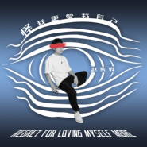
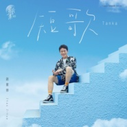
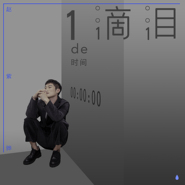
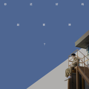
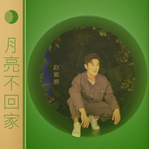

赵紫骅
============================

|  |  |
| :--: | :-- |
| [ 赵紫骅](https://i.xiami.com/zyc0427) | **地区**: China 中国大陆 **风格**: 国语流行 Mandarin Pop, 华语唱作人 Chinese Singer-Songwriter **播放数**: 12048767 **粉丝数**: 1780 **评论数**: 81  |

## 档案

赵紫骅，原名赵浴辰，1988年4月27日出生，中国大陆男歌手、音乐人，毕业于北京现代音乐学院。2013年，参加快乐男声，2014年12月参与中国正在听凭出众创作才能获得全国冠军 。赵紫骅对音乐创作有良好天赋，是一位风格完整素质均衡的优质歌手。他的代表作《可乐》被谢安琪、孙楠翻唱，《时间轴》被杨坤收录到《今夜二十岁》专辑中。 2017年初签约太合音乐集团旗下厂牌太合麦田。 2017年4月20日，发行单曲《时间轴》。 2017年4月26日，在北京举办个人专场音乐会。 2019年9月12日，发行单曲《月亮不回家》；12月24日发行单曲《你还好吗》 2020年1月1日，发行单曲《一滴泪的时间》；8月24日发行单曲《短歌》。 
小档案 
中文名：赵紫骅 
原名：赵浴辰 
别名：辰爷 / 方方 / 赵大大 
国籍：中国 
出生地：中国四川省成都市 
生日：1988年4月27日 
职业：歌手、音乐人 
代表作：《可乐》、《你走后》、《眼神总会认得》 
主要成就：2013快乐男声全国20强、2014《中国正在听》全国冠军 
从艺历程 
1988年出生于四川省成都市一个普通工人家庭 
2006年考入北京现代音乐学院学习声乐和创作 
2010年参加湖南卫视《快乐男声》比赛获得百度赛区5强、全国60强 
2011年北漂，创作多首歌曲 
2012年参加广西卫视《一声所爱·大地飞歌》获得网络赛区11强 
2013年参加湖南卫视《快乐男声》比赛获得北京赛区10强、全国20强，同年签约天娱传媒公司 
2014年参加《Hi歌》以原创歌曲《可乐》一鸣惊人，被谢安琪和孙楠同时抢购；同年参加CCTV-3《中国正在听》比赛最终获得全国总冠军，而备受媒体和观众关注。同时收获演唱光线影业年度青春大戏《谁的青春不迷茫》主题曲大奖 
2017年4月，赵紫骅歌曲《时间轴》首播 。赵紫骅首场音乐会人气爆棚 全场合唱《可乐》 
荣誉记录 
歌曲曾获得北京现代音乐学院校园原创音乐大赛第二名；第一届九棵树数字音乐节R＆B组最佳歌曲奖 
2010年参加湖南卫视《快乐男声》比赛获得百度赛区5强、全国60强 
2012年参加广西卫视《一声所爱·大地飞歌》获得网络赛区11强 
2013年参加湖南卫视《快乐男声》比赛获得北京赛区10强、全国20强，同年签约天娱传媒公司 
2013年参加CCTV-3《中国正在听》比赛最终获得全国总冠军。同时收获演唱光线影业年度青春大戏《谁的青春不迷茫》主题曲大奖

## 专辑

| 名称 | 语种 | 唱片公司 | 发行时间 | 专辑类别 | 专辑风格 |
| :--: | :-- | :-- | :-- | :-- | :-- |
| [ 怪我更爱我自己](./albums/5022039263.md) | 国语 | 海蝶音乐 | 2020年11月20日 | EP, 单曲 | 流行 Pop |
| [ 理由](./albums/5021518027.md) | 国语 | 海蝶音乐 | 2020年09月25日 | EP, 单曲 | 流行 Pop |
| [ 因为你来过](./albums/5021439576.md) | 国语 | 太合麦田 | 2020年09月11日 | 录音室专辑 |  |
| [ 短歌Tanka](./albums/5021401072.md) | 国语 | 网易云音乐 | 2020年08月24日 | EP, 单曲 |  |
| [ 一滴泪的时间 (L)](./albums/2108156326.md) | 国语 | 太合麦田 | 2020年01月01日 | EP, 单曲 | 民谣 Folk |
| [ 一滴泪的时间 (R)](./albums/2108142327.md) | 国语 | 太合麦田 | 2020年01月01日 | EP, 单曲 | 民谣 Folk |
| [ 你还好吗](./albums/2108147267.md) | 国语 | 太合麦田 | 2019年12月24日 | EP, 单曲 | 流行 Pop |
| [ 月亮不回家](./albums/2108149304.md) | 国语 | 太合麦田 | 2019年09月12日 | EP, 单曲 | 流行 Pop |
| [ 可乐](./albums/915957734.md) | 国语 | 太合麦田 | 2019年01月17日 | EP, 单曲 | 流行 Pop |
| [ 时间轴](./albums/2102734940.md) | 国语 | 太合麦田 | 2017年04月20日 | EP, 单曲 |  |
| [ 中国正在听](./albums/2102655678.md) | 国语 | 独立发行 | 2014年12月30日 | 现场专辑 |  |
| [ 时间轴快乐男声海选曲目](./albums/1015957549.md) | 国语 | 独立发行 | 2013年07月06日 | EP, 单曲 |  |

## 评论

|  |  |  |
| :-- | :-- | :-- |
|  [虾米用户](https://emumo.xiami.com/u/128268200)  2020-11-25 13:42 赞(0) 踩(0) | 
我来过，还回来~
 |
|  [虾米用户](https://emumo.xiami.com/u/104033736)  2020-11-14 19:26 赞(0) 踩(0) | 
宝藏！！！
 |
|  [虾米用户](https://emumo.xiami.com/u/14810428)  2020-10-03 20:43 赞(1) 踩(0) | 
什么时候把怪我更爱我自己放出来，超喜欢!
 |
|  [虾米用户](https://emumo.xiami.com/u/75653566) 自律即自由 2020-09-19 12:10 赞(0) 踩(0) | 
你太棒了
 |
|  [虾米用户](https://emumo.xiami.com/u/167630600)  2020-09-13 19:07 赞(1) 踩(0) | 
前天在中国好声音听了您的《理由》，颇有感触。这两天一直在找，却只找到了现场版。请问哪里能下载到正式版呢？  
 |
| ⇒ |  [虾米用户](https://emumo.xiami.com/u/175212696)   2020-09-25 09:56 赞(0) 踩(0) | 
剛發表了！
 |
|  [虾米用户](https://emumo.xiami.com/u/354014184)  2020-09-08 00:41 赞(1) 踩(0) | 
超级好听  单曲循环两天了  比赛的那个版本最好听！！！
 |
|  [虾米用户](https://emumo.xiami.com/u/420681461) 像鱼 2019-05-19 23:09 赞(0) 踩(0) | 
喜欢可乐，很喜欢很喜欢
 |
|  [虾米用户](https://emumo.xiami.com/u/293692544) 你敢给我说话吗？我咬你 2018-10-29 17:03 赞(3) 踩(0) | 
好听
 |
|  [虾米用户](https://emumo.xiami.com/u/341777165)   2018-08-17 06:13 赞(3) 踩(0) | 
去年喜欢七哥翻唱的可乐，今年听好声音喜欢刘嘉慧唱的时间轴，没想到还是您的歌，厉害厉害～
 |
|  [虾米用户](https://emumo.xiami.com/u/340602816) 花开两朵，各表一支 2018-08-15 02:30 赞(2) 踩(0) | 
一个人开着车，听着赵老师的歌，很舒服。
 |
|  [虾米用户](https://emumo.xiami.com/u/3341146) 爱我请留言。 2018-08-11 17:13 赞(3) 踩(0) | 
蛮优秀的创作人
 |
| ⇒ |  [虾米用户](https://emumo.xiami.com/u/39991607) 工作事宜请私信联络 2018-08-14 00:44 赞(0) 踩(0) | 
谢谢你
 |
| ⇒ |  [虾米用户](https://emumo.xiami.com/u/3341146) 爱我请留言。 2018-08-14 08:47 赞(0) 踩(0) | 
<q><b>赵紫骅说：</b></q>
 |
|  [虾米用户](https://emumo.xiami.com/u/321512501) 我还没想好要写什么... 2018-08-08 19:57 赞(1) 踩(0) | 
富有磁性的嗓音 直抵人心
 |
| ⇒ |  [虾米用户](https://emumo.xiami.com/u/39991607) 工作事宜请私信联络 2018-08-14 00:44 赞(0) 踩(0) | 
❤️
 |
|  [虾米用户](https://emumo.xiami.com/u/324006665) 最近小宇宙又蠢蠢欲动了…... 2018-05-09 17:22 赞(2) 踩(0) | 
总觉得他歌的感觉，唱歌的感觉，沙哑嗓音的感觉都有点熟悉，想了半天&amp;hellip;&amp;hellip;蔡健雅！
 |
|  [虾米用户](https://emumo.xiami.com/u/210463092)   2017-12-19 18:53 赞(4) 踩(0) | 
为啥改了名字 原来的名字就挺好听
 |
|  [虾米用户](https://emumo.xiami.com/u/8070377) 爱雾瑞性维欧腐漏 2017-10-28 00:37 赞(1) 踩(0) | 
之前在微信的新闻里看见过你一眼 那歌是截取的孙楠和谢的段落 忘了过来找 刚好别人分享看见了
 |
|  [虾米用户](https://emumo.xiami.com/u/132090524)     过自己想要的生活... 2017-06-20 10:12 赞(1) 踩(0) | 
好听    棒棒棒。
 |
|  [虾米用户](https://emumo.xiami.com/u/132090524)     过自己想要的生活... 2017-06-20 10:12 赞(1) 踩(0) | 
是你的可乐吸引了我 听了你所有的歌。
 |
|  [虾米用户](https://emumo.xiami.com/u/102488866) 想要一个很大的水晶球 2017-06-03 19:13 赞(1) 踩(0) | 
－
 |
|  [虾米用户](https://emumo.xiami.com/u/55330575) 我还没想好要写什么... 2017-06-02 23:56 赞(1) 踩(0) | 
来广州 吧
 |
|  [虾米用户](https://emumo.xiami.com/u/55330575) 我还没想好要写什么... 2017-06-02 23:55 赞(1) 踩(0) | 
加油，你真的很棒，每次都唱哭了我，就喜欢这样的，坚持下去 
 |
|  [虾米用户](https://emumo.xiami.com/u/9368417) 听最酷的歌，摸最柔的波 2017-05-26 13:57 赞(1) 踩(0) | 
还记得hi 歌的时候，特别喜欢你的歌，你怼简红那一下也特别爽，可是你却改成紫了。。。哈哈哈 还是喜欢你的歌
 |
|  [虾米用户](https://emumo.xiami.com/u/292924754)   2017-05-10 12:55 赞(2) 踩(0) | 
真的好喜欢这首歌，会来怀化开演唱会吗
 |
|  [虾米用户](https://emumo.xiami.com/u/239692784)   2017-04-20 23:39 赞(3) 踩(0) | 
改名字了
 |
|  [虾米用户](https://emumo.xiami.com/u/253190113)  2017-03-24 06:04 赞(1) 踩(0) | 
喜欢
 |
|  [虾米用户](https://emumo.xiami.com/u/769887) ～～ 2016-12-22 22:59 赞(2) 踩(0) | 
超爱你的声音和音乐和态度！加油啦！
 |
|  [虾米用户](https://emumo.xiami.com/u/241401330)  2016-11-26 21:48 赞(2) 踩(0) | 
好喜欢你 很吸引人的嗓音
 |
|  [虾米用户](https://emumo.xiami.com/u/39991607) 工作事宜请私信联络 2016-11-22 19:34 赞(47) 踩(0) | 
我刚入驻了虾米音乐人，欢迎大家来我的个人主页，收听我的最新音乐
 |
| ⇒ |  [虾米用户](https://emumo.xiami.com/u/106166946) 及时行樂 2019-08-19 00:23 赞(0) 踩(0) | 
好嘞 
 |
|  [虾米用户](https://emumo.xiami.com/u/243617830)  2016-11-07 06:21 赞(0) 踩(0) | 
支持你哟 好好加油  
 |
|  [虾米用户](https://emumo.xiami.com/u/71446596)  2016-09-05 16:05 赞(0) 踩(0) | 
新作品呢新作品呢
 |
| ⇒ |  [虾米用户](https://emumo.xiami.com/u/39991607) 工作事宜请私信联络 2016-11-09 10:37 赞(0) 踩(0) | 
最近在制作首张ep喽
 |
| ⇒ |  [虾米用户](https://emumo.xiami.com/u/71446596)  2016-11-10 20:40 赞(0) 踩(0) | 
<q><b>赵紫骅说：</b></q>
 |
| ⇒ |  [虾米用户](https://emumo.xiami.com/u/39991607) 工作事宜请私信联络 2016-11-22 11:49 赞(0) 踩(0) | 
<q><b>醉食兔说：</b></q>
 |
|  [虾米用户](https://emumo.xiami.com/u/35469210) 杂食动物 2016-05-09 01:10 赞(1) 踩(0) | 
遗珠啊
 |
|  [虾米用户](https://emumo.xiami.com/u/37161400) 暂无签名~ 2016-04-09 18:43 赞(1) 踩(0) | 
没错！我就是第361个粉丝！为什么歌不多 可乐我循环一个月了 好不容易摸到虾米 能听时间轴了（微笑
 |
|  [虾米用户](https://emumo.xiami.com/u/11622894) 有趣的灵魂我想睡你 2016-04-07 11:00 赞(0) 踩(0) | 
声音很棒，曲子也挺好。还是找个写词的吧哥们。
 |
|  [虾米用户](https://emumo.xiami.com/u/8274256) 乐在其中 2016-02-29 15:13 赞(0) 踩(0) | 
喜欢，喜欢，加油！！！
 |
|  [虾米用户](https://emumo.xiami.com/u/44118515) 保持距离 2016-02-24 02:25 赞(0) 踩(0) | 
你赶紧更新吧。。。
 |
|  [虾米用户](https://emumo.xiami.com/u/54931119)  2016-02-04 10:44 赞(0) 踩(0) | 

 |
|  [虾米用户](https://emumo.xiami.com/u/44131863) 一个在纽约的沈阳人 2016-01-23 21:13 赞(0) 踩(0) | 
真的好听啊！所有的歌！
 |
|  [虾米用户](https://emumo.xiami.com/u/47156853)   2015-12-29 23:01 赞(0) 踩(0) | 
啊表白方方！
 |
|  [虾米用户](https://emumo.xiami.com/u/48305887)   2015-09-05 18:18 赞(0) 踩(0) | 
超级喜欢 请加油
 |
|  [虾米用户](https://emumo.xiami.com/u/44003760) 聪明伶俐快高长大 2015-07-07 03:31 赞(0) 踩(0) | 
真好
 |
|  [虾米用户](https://emumo.xiami.com/u/11774361)   2015-06-30 00:28 赞(12) 踩(0) | 
嗓音好棒！！国语音乐很缺这样的嗓音！！
 |
|  [虾米用户](https://emumo.xiami.com/u/15275403) you can find... 2015-05-24 13:14 赞(1) 踩(0) | 
看到你帮张阳阳写的歌了，怎么不自己唱
 |
|  [虾米用户](https://emumo.xiami.com/u/34383251) say。some thi... 2015-02-01 17:55 赞(0) 踩(0) | 
喜欢你的声音 棒
 |
|  [虾米用户](https://emumo.xiami.com/u/1128253)  2015-01-21 16:20 赞(9) 踩(0) | 
我不知道哪个是你 于是我开始寻找 直到整个世界看上去 都是你
 |
|  [虾米用户](https://emumo.xiami.com/u/45582646) 抱歉做一个爱你的陌生人 2015-01-07 00:54 赞(2) 踩(0) | 
真的很喜欢啊 快男的时候就觉得非常遗憾 但现在来看也是种庆幸 那种类型的舞台并不适合你 现在好好发展吧！期待你的专辑
 |
|  [虾米用户](https://emumo.xiami.com/u/3064088) 【天性悦万物】马扎儿电台 2014-12-31 02:33 赞(0) 踩(0) | 
<a href="http://www.xiami.com/collect/38119198?success=2" target="_blank" rel="nofollow noreferrer noopener">http://www.xiami.com/collect/38119198?success=2</a> 这里有浴仔参加的电台节目地址，里面有他原创的现场弹唱，其中包括中国正在听夺冠曲《因为你来过》，欢迎收听，支持浴仔！
 |
| ⇒ |  [虾米用户](https://emumo.xiami.com/u/39991607) 工作事宜请私信联络 2015-08-05 13:37 赞(0) 踩(0) | 
谢谢非非姐，电台美女主播哦也～ 
 |
|  [虾米用户](https://emumo.xiami.com/u/12021597)  2014-12-29 21:56 赞(2) 踩(0) | 
快男两个人让我遗憾，一个是赵浴辰，一个是耿琦。
 |
|  [虾米用户](https://emumo.xiami.com/u/37175231) 只争朝夕 2014-12-27 18:36 赞(0) 踩(0) | 
张阳阳 再见青春 方方的曲子都很好
 |
|  [虾米用户](https://emumo.xiami.com/u/8304110) 勿忘初心 2014-12-22 16:23 赞(1) 踩(0) | 
更喜欢《时间轴》
 |
|  [虾米用户](https://emumo.xiami.com/u/7810894)  2014-12-21 11:02 赞(0) 踩(0) | 
加油，你一定会很好的
 |
|  [虾米用户](https://emumo.xiami.com/u/38642)  2014-12-20 22:52 赞(0) 踩(0) | 
声音有点像方大同^^
 |
|  [虾米用户](https://emumo.xiami.com/u/38642)  2014-12-20 22:51 赞(0) 踩(0) | 
歌声很有感染力，唱到我心里了
 |
|  [虾米用户](https://emumo.xiami.com/u/5084418) 像可乐一样充满气泡却也苦... 2014-12-20 01:27 赞(0) 踩(0) | 
赵浴辰，一定要加油，一直都喜欢吗i！希望你顺遂
 |
|  [虾米用户](https://emumo.xiami.com/u/39963828) 学着享受孤独 2014-12-17 12:55 赞(0) 踩(0) | 
可乐好好听，声音把我迷住了
 |
|  [虾米用户](https://emumo.xiami.com/u/16503506)   2014-12-06 22:47 赞(0) 踩(0) | 
时间轴伴奏声音太小了 没有弹唱版震撼 求重录
 |
|  [虾米用户](https://emumo.xiami.com/u/33314485) 出入房间的有清风，与我对... 2014-11-30 19:46 赞(1) 踩(0) | 
谢谢你的这首时间轴，给了我关于一座城市的背景音乐。每次拿出来听都一下转回那天的夜空下。有些事虽然这辈子都不可能再重新来过，但有这份记忆已经很美，这就够了。
 |
| ⇒ |  [虾米用户](https://emumo.xiami.com/u/35973542)   2014-12-05 11:44 赞(0) 踩(0) | 
不客气。
 |
|  [虾米用户](https://emumo.xiami.com/u/3869216)  2014-11-09 11:45 赞(0) 踩(0) | 
HI歌里出了他新作《可乐》，还有张阳阳的《关于青春》！
 |
|  [虾米用户](https://emumo.xiami.com/u/3841020) 从少年变成青年，跨过中年... 2014-11-09 09:00 赞(1) 踩(0) | 
可乐可乐，啥时候有？
 |
|  [虾米用户](https://emumo.xiami.com/u/1004974) 及⃣時⃣止⃣損⃣ 過⃣猶... 2014-11-09 00:36 赞(0) 踩(0) | 
他有首歌叫可乐，特别好听
 |
|  [虾米用户](https://emumo.xiami.com/u/3064088) 【天性悦万物】马扎儿电台 2014-10-20 02:29 赞(0) 踩(0) | 
欢迎大家去收听马扎儿电台的四季，赵浴辰参加了这期节目，有现场弹唱。下载荔枝fm 搜索并订阅马扎儿电台 即可收听。方方之后会常去马扎儿录节目。
 |
| ⇒ |  [虾米用户](https://emumo.xiami.com/u/7810894)  2014-12-21 11:06 赞(0) 踩(0) | 
没找到啊，马扎儿电台只有五期节目……
 |
| ⇒ |  [虾米用户](https://emumo.xiami.com/u/3064088) 【天性悦万物】马扎儿电台 2014-12-22 01:34 赞(0) 踩(0) | 
<q><b>萨摩耶的大腿说：</b></q>
 |
| ⇒ |  [虾米用户](https://emumo.xiami.com/u/44455244) 记录生活，分享快乐 2014-12-22 01:41 赞(0) 踩(0) | 
<q><b>萨摩耶的大腿说：</b></q>
 |
|  [虾米用户](https://emumo.xiami.com/u/10500464)   2014-09-01 09:56 赞(21) 踩(0) | 
我喜欢赵浴辰版的时间轴，能听出有他自己的经历和感情（那种想说却未说的感觉），而且吉他和弦也好听。
 |
|  [虾米用户](https://emumo.xiami.com/u/251264) stay gold 2013-11-15 12:50 赞(0) 踩(0) | 
时间轴快出吧
 |
| ⇒ |  [虾米用户](https://emumo.xiami.com/u/12262571) 暂无签名~ 2014-08-30 21:45 赞(0) 踩(0) | 
杨坤收到专辑里了，叫《你走后》。
 |
| ⇒ |  [虾米用户](https://emumo.xiami.com/u/251264) stay gold 2014-08-31 11:43 赞(0) 踩(0) | 
<q><b>Jihaw说：</b></q>
 |
|  [虾米用户](https://emumo.xiami.com/u/318132) 抠啦 2013-10-13 10:58 赞(0) 踩(0) | 
同求时间轴
 |
| ⇒ |  [虾米用户](https://emumo.xiami.com/u/12262571) 暂无签名~ 2014-08-30 21:45 赞(0) 踩(0) | 
杨坤收到专辑里了，叫《你走后》。
 |
|  [虾米用户](https://emumo.xiami.com/u/3064088) 【天性悦万物】马扎儿电台 2013-09-23 17:40 赞(0) 踩(0) | 
来点儿歌儿听！！时间轴
 |
| ⇒ |  [虾米用户](https://emumo.xiami.com/u/12262571) 暂无签名~ 2014-08-30 21:45 赞(0) 踩(0) | 
杨坤收到专辑里了，叫《你走后》。
 |
|  [虾米用户](https://emumo.xiami.com/u/769887) ～～ 2013-07-27 16:39 赞(1) 踩(0) | 
我喜欢！
 |
