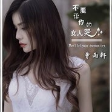

不要让你的女人哭
============================

|  |  |
| :--: | :-- |
| [ 不要让你的女人哭](https://emumo.xiami.com/album/2102759899) | **艺人**: [曾雨轩](../index.md) **语种**: 国语 **唱片公司**: 怡人文化 **发行时间**: 2017年06月03日 **专辑类别**: EP, 单曲 **专辑风格**:  **播放数**: 30567 **收藏数**: 10 **评论数**: 1  |

## 简介

日前，歌手曾雨轩真情发声《不要让你的女人哭》首发上线，歌曲传达和提倡男人在恋爱及生活当中既要对心爱的女人全力付出，又要无微不至的呵护，要有坚定认真的爱情态度，一定不要让你爱的女人哭！  
  
一首歌一个故事；一首歌一段岁月；一首歌一次感动，女人再坚强，也只是女人，也需要她爱的男人呵护。通俗的歌词赋予了歌曲最真实的灵魂，“女人想要的幸福你清不清楚，她们为爱努力的付出其实只想有个归宿”，这首歌曲像一个美妙的、浮游在梦幻与现实之间的爱情故事，曾雨轩通过一种委婉的形式驳斥了当下爱人之间的，遇风则动，落雨即融，情感信仰的脆弱。用歌声提醒大家在拥有美好爱情的时候一定要懂得珍惜，用心去感受亲情的温暖，爱情的珍贵，《不要让你的女人哭》中体现的，更多的则是一个成熟男人的爱情观，价值观，一种对美好而平淡真情的渴望，她的新歌平淡而富有生活感，有更强的现代气息和真实生活体会，让人听了会产生很强的共鸣。  
  
这首歌曲旋律简单上口，听起来很有根基感，坚毅而柔情、积极又乐观。这首作品的最大亮点，莫过于曾雨轩那干净而独具个性的音色，和其情感的爆发力与柔情兼具的倾情演绎，曾雨轩的演唱情感真挚，她自幼喜爱唱歌，多年来对于音乐事业的追求她从未停止过，可以说对于唱歌这件事，她很有自己的特质和想法。对于这首新歌，其非常自信，她相信这首新歌能够得到众多歌迷网友的喜爱。

## 曲目

## 评论

|  |  |  |  |
| :-- | :-- | :-- | :-- |
|  [虾米用户](https://emumo.xiami.com/u/364863512) 陈福宽 2019-02-20 00:05 赞(0) 踩(0) | 
我是陈福宽，这首歌好听。
 |
