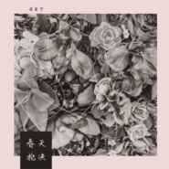
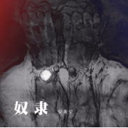

安来宁
============================

|  |  |
| :--: | :-- |
| [ 安来宁](https://i.xiami.com/anlaining) | **地区**: China 中国大陆 **风格**: 独立民谣 Indie Folk **播放数**: 25646133 **粉丝数**: 6185 **评论数**: 152  |

## 档案

他是和你一样每天早高峰挤地铁的上班族，他是和你一样每天下班也要柴米油盐的80后青年；他是四大会计师事务所格子间里忙碌的身影，他是舞台灯光下自弹自唱的模糊背影。他是和你一样生活在这个城市里的普通人，和你一路走来，依然拥有梦想，心怀远方。 
不是小清新也不是民族风，不是梦想秀也不是在别处。“我想活在当下，同时心怀远方”。他是现实生活和内心世界的和解。他的名字叫做安，在这个不安的世界。

## 专辑

| 名称 | 语种 | 唱片公司 | 发行时间 | 专辑类别 | 专辑风格 |
| :--: | :-- | :-- | :-- | :-- | :-- |
| [ 带我去远方](./albums/2103952258.md) | 国语 | 独立发行 | 2018年08月31日 | EP, 单曲 | 国语流行 Mandarin Pop |
| [ 拾贰12](./albums/2102772108.md) | 国语 | 竹露荷风 | 2017年06月25日 | EP, 单曲 | 民谣流行 Folk Pop, 独立民谣 Indie Folk |
| [ 春天枪决](./albums/2102760004.md) | 国语 | 竹露荷风 | 2017年06月05日 | 录音室专辑 | 民谣 Folk |
| [ 晚安](./albums/2102655799.md) | 国语 | 竹露荷风 | 2016年11月14日 | EP, 单曲 |  |
| [ 蹚浑水](./albums/2100388084.md) | 国语 | 竹露荷风 | 2016年09月09日 | EP, 单曲 |  |
| [ 奴隶](./albums/2100367838.md) | 国语 | 竹露荷风 | 2016年07月08日 | EP, 单曲 |  |
| [ 我的名字叫做安](./albums/307321904.md) | 国语 | 竹露荷风 | 2014年08月16日 | 录音室专辑 | 城市民谣 Urban Folk, 当代民谣 Contemporary Folk, 独立民谣 Indie Folk |

## 评论

|  |  |  |
| :-- | :-- | :-- |
|  [虾米用户](https://emumo.xiami.com/u/352035790) 万物 2020-11-11 00:51 赞(0) 踩(0) | 
去哪了？在忙什么
 |
|  [虾米用户](https://emumo.xiami.com/u/3664585)   2019-10-27 22:20 赞(0) 踩(0) | 
偶然听到这个版本，还能这样唱，唱得这么优雅这么伤。
 |
|  [虾米用户](https://emumo.xiami.com/u/288158203)  2019-08-02 22:10 赞(0) 踩(0) | 
我怎么19年才知道17年那场赔钱的演出
 |
|  [虾米用户](https://emumo.xiami.com/u/2786900)   2019-07-19 14:45 赞(0) 踩(0) | 

 |
|  [虾米用户](https://emumo.xiami.com/u/2786900)   2019-07-19 14:44 赞(0) 踩(0) | 

 |
|  [虾米用户](https://emumo.xiami.com/u/279308567) 生活不易，且行且珍惜 2019-05-15 23:21 赞(0) 踩(0) | 
安真的是一个普通的人啊
 |
|  [虾米用户](https://emumo.xiami.com/u/2036456) 我还没想好要写什么... 2019-04-26 17:41 赞(1) 踩(0) | 
喝着最烈的酒，听着最动情的乌兰巴托，想着别人的媳妇！
 |
|  [虾米用户](https://emumo.xiami.com/u/415173360)   2019-03-30 22:12 赞(0) 踩(0) | 
很好听  
 |
|  [虾米用户](https://emumo.xiami.com/u/283584416) 如果有一天我停止听音乐了... 2019-03-15 11:03 赞(0) 踩(0) | 
因为一首歌，喜欢上一个人
 |
|  [虾米用户](https://emumo.xiami.com/u/273534155) 今天知道谁是安… 2019-02-20 03:45 赞(1) 踩(0) | 
反复听了那么多遍才去查看是谁在唱…真实渗透的声音…词曲都如此入得魂魄，正月十五了，从此知道谁是安…
 |
|  [虾米用户](https://emumo.xiami.com/u/379364212)  2019-02-09 12:50 赞(0) 踩(0) | 
@安来宁  那首春天呢。
 |
|  [虾米用户](https://emumo.xiami.com/u/293692544) 你敢给我说话吗？我咬你 2019-01-22 05:02 赞(3) 踩(0) | 
好听
 |
|  [虾米用户](https://emumo.xiami.com/u/348707828) 。。。。。。 2018-11-09 21:58 赞(2) 踩(0) | 
少侠，你好！
 |
|  [虾米用户](https://emumo.xiami.com/u/249871247)  2018-10-04 13:07 赞(2) 踩(0) | 
这是我二表兄  
 |
|  [虾米用户](https://emumo.xiami.com/u/339191478)   2018-07-17 21:32 赞(1) 踩(0) | 
:-)
 |
|  [虾米用户](https://emumo.xiami.com/u/283755754)  2018-07-17 11:57 赞(2) 踩(0) | 
太喜欢你的歌了。加油！！！
 |
|  [虾米用户](https://emumo.xiami.com/u/80901228) 我还没想好要写什么... 2018-06-11 07:25 赞(4) 踩(0) | 
在乌兰巴托的宿舍里听乌兰巴托的夜的感觉，真是没法形容
 |
|  [虾米用户](https://emumo.xiami.com/u/250612016)   2018-05-31 22:01 赞(3) 踩(0) | 
每次听乌兰巴托的夜都好想家(;&amp;acute;༎ຶД༎ຶ`)
 |
|  [虾米用户](https://emumo.xiami.com/u/275906596)    2018-05-30 01:44 赞(3) 踩(0) | 
听《乌兰巴托的夜》首歌要有三年了 那些年月 个个爱民谣 嘴里有诗和远方 我也不例外 当时我用的是酷狗 这首歌封面还不是我的名字叫做安的专辑封面 那时我就像发现独家珍宝一样 爱着这首歌 怕人发现 时光荏苒 15年已经到18年了 舍与得兼有 平平淡淡 后来说唱火了 曾经的文艺青年 清一色爱上了嘻哈 无独有偶 我也听上了说唱 但我也爱民谣 许是心中尚有远方（ps.哪怕没有听众 何时何地 何种职业 愿你心中的火未曾熄灭 安来宁 加油 ）
 |
|  [虾米用户](https://emumo.xiami.com/u/359507917) 美若黎明的朝阳 2018-05-09 23:25 赞(2) 踩(0) | 
加油哦！喜欢你的歌！
 |
|  [虾米用户](https://emumo.xiami.com/u/239703) 嗯～ 2018-05-07 12:19 赞(5) 踩(0) | 
楼下的~算我一个！
 |
|  [虾米用户](https://emumo.xiami.com/u/283030197) 音乐就是向上帝发问   ... 2018-05-05 14:00 赞(7) 踩(0) | 
红了，千万不要忘了我 
 |
|  [虾米用户](https://emumo.xiami.com/u/352156157) 凡有所相，皆是虚妄。 2018-05-01 14:04 赞(3) 踩(0) | 
好好听haohaoting!
 |
|  [虾米用户](https://emumo.xiami.com/u/41284147) 我就是你要找的贱人 2018-04-12 16:55 赞(2) 踩(0) | 
厉害了，四大的。
 |
|  [虾米用户](https://emumo.xiami.com/u/349040298) 我还没想好要写什么... 2018-04-06 15:20 赞(3) 踩(0) | 
这个音乐人要火！
 |
|  [虾米用户](https://emumo.xiami.com/u/120810840) 佛曰：不可说,不可说,一... 2018-04-04 00:11 赞(2) 踩(0) | 
那首...被春天枪决的花朵呢
 |
|  [虾米用户](https://emumo.xiami.com/u/243945029) 听 2018-02-28 09:36 赞(2) 踩(0) | 
你的歌真呢很棒
 |
|  [虾米用户](https://emumo.xiami.com/u/50775333) 人生来不着边际的烂塘 你... 2018-01-22 23:11 赞(7) 踩(0) | 
pwc税务经理牛逼
 |
|  [虾米用户](https://emumo.xiami.com/u/223023) 浮 光  掠影  中… ... 2018-01-17 16:36 赞(3) 踩(0) | 
有趣的旋律
 |
|  [虾米用户](https://emumo.xiami.com/u/50631984) 面朝大海 春暖花开 2017-12-23 21:19 赞(3) 踩(0) | 
听着北大荒一起在淮海路加班吧
 |
|  [虾米用户](https://emumo.xiami.com/u/46215246)   2017-11-28 23:55 赞(2) 踩(0) | 
加油
 |
|  [虾米用户](https://emumo.xiami.com/u/45485152) Wubba lubba ... 2017-11-22 02:16 赞(1) 踩(0) | 
喜欢你的作品   乌兰巴托的夜 真的很棒
 |
|  [虾米用户](https://emumo.xiami.com/u/116331644)   2017-10-29 15:07 赞(1) 踩(0) | 
支持上外学长！活在当下，同时心怀远方。
 |
| ⇒ |  [虾米用户](https://emumo.xiami.com/u/335811532)  2017-11-18 20:21 赞(0) 踩(0) | 
嗯
 |
|  [虾米用户](https://emumo.xiami.com/u/257439787)  2017-10-16 13:49 赞(2) 踩(0) | 
在这个不安的世界
 |
|  [虾米用户](https://emumo.xiami.com/u/13504938) 心情跟着音乐走…… 2017-09-23 14:58 赞(0) 踩(0) | 
很赞
 |
|  [虾米用户](https://emumo.xiami.com/u/216908819) 总是活不成想要的自己 2017-09-20 20:28 赞(0) 踩(0) | 
难得和乌兰巴托都很好听 
 |
|  [虾米用户](https://emumo.xiami.com/u/324113168)  2017-09-09 19:04 赞(0) 踩(0) | 
安静
 |
|  [虾米用户](https://emumo.xiami.com/u/236247380) 我们。 2017-09-05 22:16 赞(0) 踩(0) | 
乌兰巴托很棒
 |
|  [虾米用户](https://emumo.xiami.com/u/19883617)  2017-07-11 18:47 赞(0) 踩(0) | 
安来宁 
 |
|  [虾米用户](https://emumo.xiami.com/u/182869646)  2017-06-10 22:35 赞(1) 踩(0) | 
你很棒
 |
|  [虾米用户](https://emumo.xiami.com/u/188565063)  2017-04-16 00:09 赞(2) 踩(0) | 
难得你的名字叫做安
 |
|  [虾米用户](https://emumo.xiami.com/u/12018787)  2017-04-11 23:37 赞(3) 踩(0) | 
聽到他的聲音是今天最美的事
 |
|  [虾米用户](https://emumo.xiami.com/u/214287423) 但愿身似月亭亭千里伴君行 2017-03-30 23:44 赞(0) 踩(0) | 
安来宁 安来宁   听歌不容易睡着，好像你是例外
 |
|  [虾米用户](https://emumo.xiami.com/u/280549682)  2017-03-27 22:47 赞(1) 踩(0) | 
给我的是听朴树和老狼的感觉，喜欢 
 |
|  [虾米用户](https://emumo.xiami.com/u/3786553)  2017-03-17 00:23 赞(2) 踩(0) | 
[文字cool]
 |
|  [虾米用户](https://emumo.xiami.com/u/34216420) 整段垮掉 2017-03-14 20:37 赞(0) 踩(0) | 
灵！
 |
|  [虾米用户](https://emumo.xiami.com/u/250793326) 因为懂得，所以慈悲。 2017-02-28 19:45 赞(0) 踩(0) | 
他喜欢 
 |
|  [虾米用户](https://emumo.xiami.com/u/2945971) 「写歌的人假正经 听歌的... 2017-02-21 20:59 赞(0) 踩(0) | 
喜欢安～
 |
|  [虾米用户](https://emumo.xiami.com/u/210632344) We just deci... 2017-01-17 23:17 赞(2) 踩(0) | 
淡淡的挺好
 |
|  [虾米用户](https://emumo.xiami.com/u/35167460) La vie elle ... 2016-10-30 13:56 赞(0) 踩(0) | 
好棒哟。继续写歌继续喔，祝福你
 |
|  [虾米用户](https://emumo.xiami.com/u/49755269) 虾米再见，永远爱你，期待... 2016-10-15 08:02 赞(0) 踩(0) | 
不知道你是否专业学过作曲，里面的曲调走向运用了很多技巧
 |
|  [虾米用户](https://emumo.xiami.com/u/14293333)  2016-10-10 14:18 赞(0) 踩(0) | 
好听~
 |
|  [虾米用户](https://emumo.xiami.com/u/356)  2016-10-08 23:28 赞(0) 踩(0) | 
听了，真是赞。l
 |
|  [虾米用户](https://emumo.xiami.com/u/112861676)  2016-09-17 09:07 赞(0) 踩(0) | 
好听
 |
|  [虾米用户](https://emumo.xiami.com/u/87836900) 孰 2016-09-02 01:23 赞(1) 踩(0) | 
民谣我命
 |
|  [虾米用户](https://emumo.xiami.com/u/93444416) 爱五月天。爱西楼。 2016-08-31 19:43 赞(0) 踩(0) | 
比心
 |
|  [虾米用户](https://emumo.xiami.com/u/125363970)  2016-08-23 23:50 赞(0) 踩(0) | 
很好
 |
|  [虾米用户](https://emumo.xiami.com/u/82713980) Be myself 2016-07-10 19:15 赞(0) 踩(0) | 
在夜晚听着他的声音
 |
|  [虾米用户](https://emumo.xiami.com/u/97747450) 我还没想好要写什么... 2016-06-24 00:27 赞(0) 踩(0) | 
1707
 |
|  [虾米用户](https://emumo.xiami.com/u/52870417) 若你喜欢怪人，其实我很美 2016-05-30 21:01 赞(0) 踩(0) | 
  
 |
|  [虾米用户](https://emumo.xiami.com/u/18164375) 暂无签名~ 2016-03-28 19:35 赞(1) 踩(0) | 
听完全部的感觉好像很多别人的影子....
 |
|  [虾米用户](https://emumo.xiami.com/u/18164375) 暂无签名~ 2016-03-28 18:03 赞(1) 踩(0) | 
不知道为什么一听九月就想哭
 |
|  [虾米用户](https://emumo.xiami.com/u/43417904) Please KISS ... 2016-03-20 12:52 赞(0) 踩(0) | 
弱弱地说 是被王安老师安利来哒 很温暖
 |
|  [虾米用户](https://emumo.xiami.com/u/52210330)  2016-03-08 23:34 赞(0) 踩(0) | 
加油。
 |
|  [虾米用户](https://emumo.xiami.com/u/36085713)  2016-02-11 20:57 赞(0) 踩(0) | 
经典，唱出心声，听到故事。
 |
|  [虾米用户](https://emumo.xiami.com/u/54635763)  2016-01-16 14:23 赞(1) 踩(0) | 
我喜欢的人名字里有个“安”
 |
|  [虾米用户](https://emumo.xiami.com/u/50092977) 烦恼自生 清凉不在 2016-01-09 16:23 赞(0) 踩(0) | 
难得
 |
|  [虾米用户](https://emumo.xiami.com/u/95705896)  2015-12-29 22:28 赞(2) 踩(0) | 
再见文汇路
 |
|  [虾米用户](https://emumo.xiami.com/u/46410784)  2015-12-22 08:23 赞(0) 踩(0) | 
一睁眼听到的美好 真好
 |
|  [虾米用户](https://emumo.xiami.com/u/52073690) 至此，心猿归林，意马有缰 2015-12-21 11:43 赞(0) 踩(0) | 
难得 真好听
 |
|  [虾米用户](https://emumo.xiami.com/u/79617746) 许巍粉 2015-12-02 19:02 赞(1) 踩(0) | 
好喜欢《难得》！！！！
 |
|  [虾米用户](https://emumo.xiami.com/u/5513401) 曲~ 2015-11-25 22:21 赞(0) 踩(0) | 
虾米终于有你啦
 |
|  [虾米用户](https://emumo.xiami.com/u/2789093) 浮生如梦梦如歌 2015-11-20 18:16 赞(13) 踩(0) | 
听的时候总会想起郁冬。
 |
|  [虾米用户](https://emumo.xiami.com/u/6177574) 我还没想好要写什么... 2015-11-18 22:47 赞(1) 踩(0) | 
太棒了！北大荒，唱出了北方人的情怀
 |
|  [虾米用户](https://emumo.xiami.com/u/79719898) 带不走的   只有你 2015-11-10 13:33 赞(1) 踩(0) | 
我同桌喜欢的～
 |
|  [虾米用户](https://emumo.xiami.com/u/76870984)  2015-11-07 20:05 赞(2) 踩(0) | 
喜欢你的《安》和《文汇路》还有《难得》！   
 |
|  [虾米用户](https://emumo.xiami.com/u/44663804) 无 2015-11-06 22:18 赞(0) 踩(0) | 
求不火
 |
|  [虾米用户](https://emumo.xiami.com/u/79477484) easoneason亮晶... 2015-11-03 13:57 赞(1) 踩(0) | 
我不怕寒冷
 |
|  [虾米用户](https://emumo.xiami.com/u/79477484) easoneason亮晶... 2015-11-03 13:57 赞(0) 踩(0) | 
最爱❤❤❤
 |
|  [虾米用户](https://emumo.xiami.com/u/72705584) 我还没想好要写什么... 2015-10-27 15:53 赞(1) 踩(0) | 
喜欢到不行的音乐人
 |
|  [虾米用户](https://emumo.xiami.com/u/13936356) 我还没想好要写什么... 2015-10-24 21:29 赞(0) 踩(0) | 
<a href="http://img.xiami.net/res/js/jquery/editor/sets/bbcode/images/smilies/default/427.png" target="_blank" rel="nofollow noreferrer noopener">http://img.xiami.net/res/js/jquery/editor/sets/bbcode/images/smilies/default/427.png</a>
 |
|  [虾米用户](https://emumo.xiami.com/u/199246) 无我 无用 2015-10-24 19:42 赞(1) 踩(0) | 
在大宁看安的现场 很棒 
 |
|  [虾米用户](https://emumo.xiami.com/u/73890134) 我爱我自己. 2015-10-24 00:44 赞(1) 踩(0) | 
安
 |
|  [虾米用户](https://emumo.xiami.com/u/4312743)   2015-10-13 19:16 赞(2) 踩(0) | 
喜欢安安静静的这种声音
 |
|  [虾米用户](https://emumo.xiami.com/u/70332682) 我还没想好要写什么... 2015-10-13 00:43 赞(2) 踩(0) | 
我的名字叫做安 在某天中午听这首歌哭的不行 特别有感触
 |
|  [虾米用户](https://emumo.xiami.com/u/52841088)  2015-10-07 10:19 赞(2) 踩(0) | 
喜欢听你的歌。很宁静安详。
 |
|  [虾米用户](https://emumo.xiami.com/u/4015583) 永遠的蝦米 2015-09-19 22:38 赞(1) 踩(0) | 
终于来虾米了
 |
|  [虾米用户](https://emumo.xiami.com/u/68004102)  2015-09-19 17:18 赞(0) 踩(0) | 
 
 |
|  [虾米用户](https://emumo.xiami.com/u/68004102)  2015-09-19 17:17 赞(1) 踩(0) | 
单曲循环《我的名字叫做安》 超级喜欢
 |
| ⇒ |  [虾米用户](https://emumo.xiami.com/u/6342739)  2015-12-25 01:06 赞(0) 踩(0) | 
我也是
 |
|  [虾米用户](https://emumo.xiami.com/u/8667248) 你眼中的夕阳 2015-09-06 14:44 赞(1) 踩(0) | 
好歌，猛一看照片以为唐马儒来唱歌了=。=
 |
|  [虾米用户](https://emumo.xiami.com/u/583786)  2015-09-01 00:45 赞(2) 踩(0) | 
听的出来音乐素养非常高，而且从不同的歌能感觉到是人前人后两种状态的那种人，一个好灵魂。抱歉，这么晚才来听您的歌。
 |
|  [虾米用户](https://emumo.xiami.com/u/50318156) 雅思狗 2015-08-11 23:01 赞(0) 踩(0) | 
居然是四大的 
 |
|  [虾米用户](https://emumo.xiami.com/u/50318156) 雅思狗 2015-08-11 23:01 赞(0) 踩(0) | 
居然是四大的 
 |
|  [虾米用户](https://emumo.xiami.com/u/50318156) 雅思狗 2015-08-11 23:01 赞(0) 踩(0) | 
居然是四大的 
 |
|  [虾米用户](https://emumo.xiami.com/u/38513798) 大地孤独闪着光 2015-08-05 20:39 赞(1) 踩(0) | 
最喜欢你和安溥了
 |
|  [虾米用户](https://emumo.xiami.com/u/14758918) 暂无签名~ 2015-08-04 19:59 赞(1) 踩(0) | 
他的声音真是酥了
 |
|  [虾米用户](https://emumo.xiami.com/u/14758918) 暂无签名~ 2015-08-04 19:59 赞(1) 踩(0) | 
他的声音真是酥了
 |
|  [虾米用户](https://emumo.xiami.com/u/35499243) 一个对声音极度敏感的勒德... 2015-08-02 12:46 赞(2) 踩(0) | 
这才叫做真正好的民谣歌手
 |
|  [虾米用户](https://emumo.xiami.com/u/49584018)  2015-07-15 14:54 赞(4) 踩(0) | 

 |
|  [虾米用户](https://emumo.xiami.com/u/50291478) 你穿绿色很好看 2015-06-24 23:15 赞(0) 踩(0) | 
超级！！好听！！
 |
|  [虾米用户](https://emumo.xiami.com/u/39209992) 有点儿燃 2015-06-22 00:26 赞(0) 踩(0) | 
PWC男神～
 |
|  [虾米用户](https://emumo.xiami.com/u/40256175) 她。 2015-06-10 22:15 赞(0) 踩(0) | 
循环乌兰巴托的夜，一遍一遍一遍，夜越听越静。
 |
|  [虾米用户](https://emumo.xiami.com/u/2198964)  2015-06-01 06:32 赞(0) 踩(0) | 
好听
 |
|  [虾米用户](https://emumo.xiami.com/u/15963682)   2015-05-11 23:53 赞(0) 踩(0) | 
好感動啊
 |
|  [虾米用户](https://emumo.xiami.com/u/15963682)   2015-05-11 23:50 赞(0) 踩(0) | 
好聽
 |
|  [虾米用户](https://emumo.xiami.com/u/2981181)  2015-04-27 22:34 赞(1) 踩(0) | 
乌兰巴托的夜是我听过的最好听的版本，喜欢这样的娓娓道来
 |
|  [虾米用户](https://emumo.xiami.com/u/28489284)   2015-04-27 10:30 赞(0) 踩(0) | 
直系学长！！加油加油！！真的很棒嘞！！
 |
|  [虾米用户](https://emumo.xiami.com/u/31625728) 间接性冷淡 2015-04-23 11:41 赞(1) 踩(0) | 
普华永道啊
 |
|  [虾米用户](https://emumo.xiami.com/u/3449737) ww 2015-04-17 20:19 赞(0) 踩(0) | 
TvT想到了已经不做音乐的小安~
 |
|  [虾米用户](https://emumo.xiami.com/u/5598809)  2015-04-16 14:30 赞(0) 踩(0) | 
学长请受我一拜....难得和北大荒简直听醉了~TAT
 |
|  [虾米用户](https://emumo.xiami.com/u/30333269)  2015-04-09 13:00 赞(1) 踩(0) | 
近年来民谣届少有的好专辑，赞
 |
|  [虾米用户](https://emumo.xiami.com/u/33113721) 你是世上的奇女子呀 我就... 2015-04-09 09:01 赞(0) 踩(0) | 
难道你们都没听过郝云 和宋冬野 反正我听到他们的影子。 九月不错
 |
|  [虾米用户](https://emumo.xiami.com/u/45447884) 笑里融着甜 2015-04-02 19:18 赞(0) 踩(0) | 
九月，好听！！！
 |
|  [虾米用户](https://emumo.xiami.com/u/7853153)  2015-03-31 19:04 赞(2) 踩(0) | 
因为谭维维版的“乌兰巴托的夜”而找过来，发现安来宁版的“乌兰巴托的夜”同样动听，而且从某种意义上说更适合长久听，一种安静中的不安。
 |
|  [虾米用户](https://emumo.xiami.com/u/39930639) 音乐是件疯狂而严谨的事情 2015-03-30 21:07 赞(29) 踩(0) | 
乌兰巴托的夜太好听了
 |
| ⇒ |  [虾米用户](https://emumo.xiami.com/u/198987)  2017-07-15 23:59 赞(0) 踩(0) | 
确实&amp;middot;他的这个版本是我最喜欢听的一版
 |
|  [虾米用户](https://emumo.xiami.com/u/48545486)  2015-03-27 13:59 赞(0) 踩(0) | 
小城
 |
|  [虾米用户](https://emumo.xiami.com/u/39932813) 暂无签名~ 2015-03-27 12:11 赞(0) 踩(0) | 
！！
 |
|  [虾米用户](https://emumo.xiami.com/u/48307521)   2015-03-22 15:47 赞(0) 踩(0) | 
好
 |
|  [虾米用户](https://emumo.xiami.com/u/48307521)   2015-03-22 15:47 赞(0) 踩(0) | 

 |
|  [虾米用户](https://emumo.xiami.com/u/6855434) Love covers ... 2015-03-22 10:15 赞(0) 踩(0) | 
大学城
 |
|  [虾米用户](https://emumo.xiami.com/u/7748183)   2015-03-21 21:12 赞(0) 踩(0) | 
终于找到乌兰巴托的夜 的原唱了
 |
| ⇒ |  [虾米用户](https://emumo.xiami.com/u/33113721) 你是世上的奇女子呀 我就... 2015-04-09 08:59 赞(0) 踩(0) | 
原唱 江湖乐队
 |
| ⇒ |  [虾米用户](https://emumo.xiami.com/u/54525994) modest 2015-08-30 19:06 赞(0) 踩(0) | 
原唱是左小祖咒
 |
| ⇒ |  [虾米用户](https://emumo.xiami.com/u/1520891) 醒醒睡睡的人啊。 2015-09-02 00:00 赞(0) 踩(0) | 
<q><b>小唐怎么办说：</b></q>
 |
| ⇒ |  [虾米用户](https://emumo.xiami.com/u/54525994) modest 2015-09-02 10:13 赞(0) 踩(0) | 
<q><b>Youngweenie说：</b></q>
 |
| ⇒ |  [虾米用户](https://emumo.xiami.com/u/1520891) 醒醒睡睡的人啊。 2015-09-02 10:52 赞(0) 踩(0) | 
<q><b>说：</b></q>
 |
| ⇒ |  [虾米用户](https://emumo.xiami.com/u/1520891) 醒醒睡睡的人啊。 2017-10-28 00:36 赞(0) 踩(0) | 
<q><b>小唐怎么办说：</b></q>
 |
|  [虾米用户](https://emumo.xiami.com/u/28795091) 我还没想好要写什么... 2015-03-21 12:48 赞(0) 踩(0) | 
喜欢乌兰巴托和文汇路！
 |
|  [虾米用户](https://emumo.xiami.com/u/6684520)  2015-02-13 00:37 赞(0) 踩(0) | 
太美了！难得！忍不住把世界的每个石头唤作“亲爱的”。
 |
|  [虾米用户](https://emumo.xiami.com/u/12531504)  2015-02-08 23:59 赞(0) 踩(0) | 
大地孤独闪光。
 |
|  [虾米用户](https://emumo.xiami.com/u/34436763)  2014-12-14 21:15 赞(0) 踩(0) | 
真的很喜欢你的歌
 |
|  [虾米用户](https://emumo.xiami.com/u/378379) 哲♂学 2014-12-14 20:26 赞(0) 踩(0) | 
今天在武汉开车去鄂州的路上听到电台里你的专访 很喜欢北大荒 希望你的音乐之路越走越快乐
 |
| ⇒ |  [虾米用户](https://emumo.xiami.com/u/9985059) 一个随便听歌的人 2015-02-28 14:32 赞(0) 踩(0) | 
我是在武汉去上海的高铁上听到这首，其实是不太喜欢听民谣的
 |
|  [虾米用户](https://emumo.xiami.com/u/12432550) 哦 2014-12-13 10:12 赞(0) 踩(0) | 
松江大学城来报道
 |
|  [虾米用户](https://emumo.xiami.com/u/8370738)  2014-12-02 22:12 赞(0) 踩(0) | 
Nice
 |
|  [虾米用户](https://emumo.xiami.com/u/7707574) 生活远非如此而是如此生活 2014-11-26 22:32 赞(0) 踩(0) | 
有川子的味道
 |
|  [虾米用户](https://emumo.xiami.com/u/34436763)  2014-11-25 22:58 赞(0) 踩(0) | 
太好听了
 |
|  [虾米用户](https://emumo.xiami.com/u/43095386)  2014-11-06 21:22 赞(0) 踩(0) | 
独立民谣
 |
|  [虾米用户](https://emumo.xiami.com/u/1593762)  2014-09-26 23:32 赞(0) 踩(0) | 
隔壁组的来捧场～～
 |
|  [虾米用户](https://emumo.xiami.com/u/9196130) 这家伙很聪明 该留下什么... 2014-09-05 13:37 赞(0) 踩(0) | 
不错
 |
|  [虾米用户](https://emumo.xiami.com/u/8054915)  2014-08-12 09:07 赞(0) 踩(0) | 
淡淡的 平和
 |
|  [虾米用户](https://emumo.xiami.com/u/13349995) 昨日种种譬如昨日死 2014-08-12 00:47 赞(0) 踩(0) | 
好听惹
 |
|  [虾米用户](https://emumo.xiami.com/u/8077560)  2014-08-10 22:51 赞(0) 踩(0) | 
太棒啦！满满的诚意，谢谢安带给我们新专辑
 |
| ⇒ |  [虾米用户](https://emumo.xiami.com/u/3205871)  2014-09-17 07:34 赞(0) 踩(0) | 
哪个城市的文汇路啊？
 |
| ⇒ |  [虾米用户](https://emumo.xiami.com/u/7205091) 胡同串子 2014-10-06 20:11 赞(0) 踩(0) | 
<q><b>春天以南说：</b></q>
 |
|  [虾米用户](https://emumo.xiami.com/u/22407720) 你的声音述说一个你的过去 2014-08-08 10:13 赞(1) 踩(0) | 
新专辑的歌我都好喜欢。！
 |
|  [虾米用户](https://emumo.xiami.com/u/5744500) 我还没想好要写什么... 2014-07-18 23:52 赞(0) 踩(0) | 
文汇路学长~i still there
 |
|  [虾米用户](https://emumo.xiami.com/u/7971186)  2014-07-11 11:05 赞(0) 踩(0) | 
赞
 |
|  [虾米用户](https://emumo.xiami.com/u/3935878) 吱 2014-07-10 16:49 赞(0) 踩(0) | 
再见文汇路
 |
