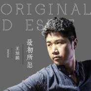

最初所愿
============================

|  |  |
| :--: | :-- |
| [ 最初所愿](https://emumo.xiami.com/album/2100380173) | **艺人**: [王旭鹏](../index.md) **语种**: 国语 **唱片公司**: 重视文化 **发行时间**: 2016年08月18日 **专辑类别**: EP, 单曲 **专辑风格**:  **播放数**: 845 **收藏数**: 1 **评论数**: 2  |

## 简介

“冷冷的风吹不回来你给的誓言 却冰冻了思念”温情暖男柔声演绎《最初所愿》，搁浅的爱情，当断则断的脆弱，近乎乞求的心愿。王旭鹏用自己的声音刻画了一个对爱情痴迷的形象，对爱情的不确定，问答形式，抽相比喻的思念誓言，让歌曲更加富有诗意的感觉，王旭鹏《最初所愿》与为爱执着的人共勉。 

## 曲目

## 评论

|  |  |  |  |
| :-- | :-- | :-- | :-- |
|  [虾米用户](https://emumo.xiami.com/u/2458715)  2016-09-23 12:05 赞(0) 踩(0) | 
很淳朴的演唱
 |
|  [虾米用户](https://emumo.xiami.com/u/12759863) 天下大美，本无常主。有缘... 2016-08-18 18:18 赞(0) 踩(0) | 
人生若只如初见
 |
