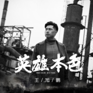

英雄本色
============================

|  |  |
| :--: | :-- |
| [ 英雄本色](https://emumo.xiami.com/album/2104094230) | **艺人**: [王旭鹏](../index.md) **语种**: 国语 **唱片公司**: 重视文化 **发行时间**: 2018年10月11日 **专辑类别**: EP, 单曲 **专辑风格**: 国语流行 Mandarin Pop **播放数**: 12688 **收藏数**: 1 **评论数**: 0  |

## 简介

王旭鹏单曲《英雄本色》籍音乐美学抒情怀气概，以无畏气魄祭赤诚之心。天地英雄气，浩荡穹苍梦。 单曲力邀台湾著名唱作人谢铭佑侠义助阵，亲自操刀作词作曲，量身打造《英雄本色》，旋律大气畅淋，鼓点细碎落地，将磅礴与错杂的情绪纠缠，儿女情长牵绊快意恩仇，仍然难抵英雄本色。一身是胆，一夫当关，王旭鹏用浑厚阳刚的嗓音勾勒着追逐梦想的赤诚之心，不谓燃尽笑泪星光，不惧只剩一身苍凉，英雄藏匿柔情，一关一关地闯。撕开英雄本色，岁月乾坤畏服赤胆侠义。  
 

## 曲目

## 评论

