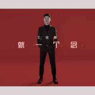

就一个念
============================

|  |  |
| :--: | :-- |
| [ 就一个念](https://emumo.xiami.com/album/2104208534) | **艺人**: [王旭鹏](../index.md) **语种**: 国语 **唱片公司**: 重视文化 **发行时间**: 2018年11月08日 **专辑类别**: 录音室专辑 **专辑风格**: 爵士流行 Jazz Pop **播放数**: 487 **收藏数**: 1 **评论数**: 0  |

## 简介

梦想纵情  
执着向远  
守护生命誓言  
伫立世界之巅  
内地流行男歌手王旭鹏全新单曲《就一个念》，旋律大气婉转，强烈的鼓点敲击着心中种下的执念，风云聚散、成就多少，皆与时间无关，只是平凡生活中的英雄梦想，不灭的期望。  
《就一个念》由台湾著名音乐创作人黄大军、知名音乐人魏肇新作词作曲，王旭鹏浑厚嗓音浩然演绎。编曲中柔美的钢琴与铿锵的架子鼓自然交织，以韵律描摹心中一念，刻画理想抱负。人生风华易成殇，而执念总翩跹，只愿有朝一日能遂凌云志。

## 曲目

## 评论

|  |  |  |  |
| :-- | :-- | :-- | :-- |
