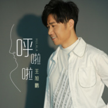

呼啦啦
============================

|  |  |
| :--: | :-- |
| [ 呼啦啦](https://emumo.xiami.com/album/2104461152) | **艺人**: [王旭鹏](../index.md) **语种**: 国语 **唱片公司**: 重视文化 **发行时间**: 2019年01月10日 **专辑类别**: EP, 单曲 **专辑风格**: 国语流行 Mandarin Pop **播放数**: 1770 **收藏数**: 0 **评论数**: 0  |

## 简介

爱神来到 为你心跳  
甜蜜恋爱 嘴角含笑  
幸福围绕 天荒地老  
内地流行男歌手王旭鹏全新单曲《呼啦啦》悄然来袭，由王旭鹏本人亲自填词，歌曲表达了轻松的恋爱和青年男女间脸红心跳的小情绪，王旭鹏轻松的演唱技巧也给这首歌曲带来了青春恋爱的无限体验，趁年轻，抓住爱情，才能拥有无限可能。  
  
  
歌曲列表  
呼啦啦  
演唱：王旭鹏  
作曲：SONG,YANG HA/YOU,JI SANG(G-HIGH)  
作词：王旭鹏  
编曲：程天禹  
制作人：宋子楚  
监制：彭丞吉  
  
时长：03:36  
 

## 曲目

## 评论

