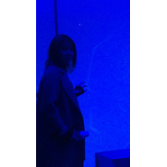

严璞
============================

|  |  |
| :--: | :-- |
| [ 严璞](https://i.xiami.com/sammisa) | **播放数**: 10006398 **粉丝数**: 562 **评论数**: 35 **地区**: China 中国大陆 **风格**: 国语流行 Mandarin Pop, 华语唱作人 Chinese Singer-Songwriter  |

## 档案

微博：严璞SAMMY

## 专辑

| 名称 | 语种 | 唱片公司 | 发行时间 | 专辑类别 | 专辑风格 |
| :--: | :-- | :-- | :-- | :-- | :-- |
| [ 忍冬艳蔷薇 电视剧插曲](./albums/2106079802.md) | 国语 | 独立发行 | 2020年02月20日 | 原声带, 影视音乐 | 国语流行 Mandarin Pop, 流行 Pop, 电视原声 Television Music |
| [ 影子习惯](./albums/2105806114.md) | 国语 | 独立发行 | 2020年02月01日 | EP, 单曲 | 流行 Pop |
| [ 倍爽儿倍爽儿](./albums/2105691247.md) | 国语 | 独立发行 | 2020年01月06日 | EP, 单曲 | 电子舞曲 EDM / Electronic Dance Music, 电音流行 Electropop |
| [ 桥边姑娘](./albums/2105586487.md) | 国语 |  | 2019年12月14日 | EP, 单曲 | 流行 Pop |
| [ 梦回杭城](./albums/2105043518.md) | 国语 |  | 2019年07月30日 | EP, 单曲 | 流行 Pop |
| [ 你的酒馆对我打了烊COVER陈雪凝](./albums/2104853242.md) | 国语 |  | 2019年05月10日 | 录音室专辑 | 流行 Pop |
| [ 心如止水停止心跳](./albums/2104830239.md) | 国语 |  | 2019年04月30日 | 录音室专辑 | 流行 Pop |
| [ 二次元日常可爱](./albums/2104810357.md) | 国语 |  | 2019年04月25日 | 录音室专辑 | 日本动漫游戏 Japanese ACG, 网络流行 Cyber Hit, 日本流行 J-Pop |
| [ 小可爱](./albums/2104756574.md) | 国语 |  | 2019年04月09日 | 录音室专辑 | 流行 Pop |
| [ 老歌翻](./albums/2104749404.md) | 国语 |  | 2019年04月07日 | 录音室专辑 | 流行 Pop |
| [ 那些时光](./albums/2104037345.md) | 国语 | 独立发行 | 2018年09月18日 | 录音室专辑 | 民谣 Folk |
| [ 纯情少爷爱上我 原声碟](./albums/2103604319.md) | 国语 | 独立发行 | 2018年03月12日 | 原声带, 影视音乐 | 古风 GuFeng Music |
| [ 一千公里的伤创新集](./albums/1226420506.md) | 国语 | 独立发行 | 2017年07月14日 | 录音室专辑 | 国语流行 Mandarin Pop |
| [ 谁在唱](./albums/2102744689.md) | 国语 | 独立发行 | 2017年05月08日 | 录音室专辑 | 民谣 Folk |
| [ 成都（Cover赵雷）](./albums/2102696183.md) | 国语 | 独立发行 | 2017年02月20日 | 录音室专辑 | 民谣 Folk |
| [ 经典翻唱翻唱经典](./albums/2100272856.md) | 国语 | 独立发行 | 2016年02月06日 | 合集, 杂锦 | 国语流行 Mandarin Pop |
| [ 星际小蚂蚁](./albums/2100181320.md) | 国语 | 维音唱片 | 2015年08月21日 | EP, 单曲 |  |
| [ 2015年电死你新洗脑舞曲](./albums/925176540.md) | 国语 | 独立发行 | 2015年03月01日 | EP, 单曲 | 另类说唱 Alternative Hip Hop, 国语流行 Mandarin Pop, 电音流行 Electropop |
| [ 桥边姑娘](./albums/2105691343.md) | 国语 | 独立发行 | 不详 | EP, 单曲 | 流行 Pop |
| [ 你酒馆对我打了烊](./albums/2105691345.md) | 国语 | 独立发行 | 不详 | EP, 单曲 | 流行 Pop, 民谣 Folk, 民谣流行 Folk Pop |

## 评论

|  |  |  |  |
| :-- | :-- | :-- | :-- |
|  [虾米用户](https://emumo.xiami.com/u/434746486)  2020-04-24 11:33 赞(0) 踩(0) | 
桥边姑娘怎在这不能听了？
 |
|  [虾米用户](https://emumo.xiami.com/u/441062674)  2020-03-03 22:37 赞(0) 踩(0) | 
好听
 |
|  [虾米用户](https://emumo.xiami.com/u/348373270)  2020-02-26 14:29 赞(0) 踩(0) | 
桥边姑娘怎么听不了了呀
 |
| ⇒ |  [虾米用户](https://emumo.xiami.com/u/46209782) 抖音：y861028 2020-02-27 18:51 赞(0) 踩(0) | 
kugou有
 |
| ⇒ |  [虾米用户](https://emumo.xiami.com/u/348373270)  2020-04-09 09:40 赞(0) 踩(0) | 
<q><b>严璞说：</b></q>
 |
|  [虾米用户](https://emumo.xiami.com/u/439232365)  2020-02-11 18:18 赞(0) 踩(0) | 
声音很美
 |
|  [虾米用户](https://emumo.xiami.com/u/413915415)  2019-12-14 16:41 赞(0) 踩(0) | 
唱的不错，，加油⛽ 
 |
|  [虾米用户](https://emumo.xiami.com/u/293692544) 你敢给我说话吗？我咬你 2019-10-26 06:06 赞(1) 踩(0) | 
好听
 |
|  [虾米用户](https://emumo.xiami.com/u/428235557)  2019-08-23 12:36 赞(1) 踩(0) | 
  
 |
|  [虾米用户](https://emumo.xiami.com/u/409964140)  2019-08-16 21:49 赞(3) 踩(0) | 
我也姓严
 |
|  [虾米用户](https://emumo.xiami.com/u/41054225) 我还没想好要写什么... 2019-08-10 21:55 赞(2) 踩(0) | 
好听♣️‍‍‍
 |
|  [虾米用户](https://emumo.xiami.com/u/405071496)  2019-05-28 16:45 赞(2) 踩(0) | 
真心好听，比赵雷的声音干净甜蜜
 |
|  [虾米用户](https://emumo.xiami.com/u/2796166) 最爱莫文蔚..... 2019-05-24 00:16 赞(3) 踩(0) | 
加油
 |
|  [虾米用户](https://emumo.xiami.com/u/422380599)  2019-05-17 13:25 赞(3) 踩(0) | 
好听  
 |
|  [虾米用户](https://emumo.xiami.com/u/374937909) 真好！ 2019-05-02 08:09 赞(3) 踩(0) | 
好听
 |
|  [虾米用户](https://emumo.xiami.com/u/38348550) 暂无签名~ 2019-04-23 23:48 赞(3) 踩(0) | 
好听噢
 |
|  [虾米用户](https://emumo.xiami.com/u/293692544) 你敢给我说话吗？我咬你 2019-02-20 17:55 赞(3) 踩(0) | 
好听
 |
|  [虾米用户](https://emumo.xiami.com/u/27846764)  2019-01-27 19:40 赞(3) 踩(0) | 
原来是杭州的老乡，挺你哦！ 
 |
|  [虾米用户](https://emumo.xiami.com/u/87836918)   2018-08-13 04:40 赞(3) 踩(0) | 
有点像我一个朋友
 |
|  [虾米用户](https://emumo.xiami.com/u/277334116)  2017-08-26 22:26 赞(2) 踩(0) | 
   
 |
|  [虾米用户](https://emumo.xiami.com/u/277334116)  2017-08-26 22:25 赞(1) 踩(0) | 
  
 |
|  [虾米用户](https://emumo.xiami.com/u/8337431) 以乐会友 2017-05-26 08:32 赞(2) 踩(0) | 
清新女声15
 |
|  [虾米用户](https://emumo.xiami.com/u/297082522)  2017-05-18 19:33 赞(1) 踩(0) | 
小璞璞我来看看你  
 |
|  [虾米用户](https://emumo.xiami.com/u/292299109)   2017-04-29 14:11 赞(1) 踩(0) | 
好听
 |
|  [虾米用户](https://emumo.xiami.com/u/291850890)   2017-04-27 19:09 赞(1) 踩(0) | 
原来这里这么有趣  
 |
|  [虾米用户](https://emumo.xiami.com/u/287137244)  2017-04-09 11:15 赞(1) 踩(0) | 
不错！为你点赞！ 
 |
|  [虾米用户](https://emumo.xiami.com/u/3963574) ☆✧♥✧☆♥✩✭♥ 2015-05-04 11:11 赞(1) 踩(0) | 
=￣ω￣=  happy monday
 |
|  [虾米用户](https://emumo.xiami.com/u/47784462)  2015-03-03 13:38 赞(1) 踩(0) | 
好听啊
 |
|  [虾米用户](https://emumo.xiami.com/u/47783652)  2015-03-03 13:11 赞(2) 踩(0) | 
娃娃你要加油啊！我们支持你
 |
|  [虾米用户](https://emumo.xiami.com/u/44292919)  2015-03-03 10:33 赞(1) 踩(0) | 
不错！很好听
 |
|  [虾米用户](https://emumo.xiami.com/u/47756919)  2015-03-02 15:50 赞(1) 踩(0) | 
好棒
 |
|  [虾米用户](https://emumo.xiami.com/u/11157355) 榕树长青 2015-03-02 11:26 赞(1) 踩(0) | 
不错啊！一定要支持！
 |
|  [虾米用户](https://emumo.xiami.com/u/47172021)  2015-02-24 07:58 赞(1) 踩(0) | 
啥时候出新歌啊
 |
|  [虾米用户](https://emumo.xiami.com/u/46848742) 秘密花园 2015-02-02 18:45 赞(1) 踩(0) | 
加油，看好你
 |
|  [虾米用户](https://emumo.xiami.com/u/46209782) 抖音：y861028 2015-01-26 10:06 赞(3) 踩(0) | 
我刚入驻了虾米音乐人，欢迎大家来我的个人主页，收听我的最新音乐
 |
