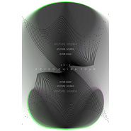

这是一首广告歌
============================

|  |  |
| :--: | :-- |
| [ 这是一首广告歌](https://emumo.xiami.com/album/2103907821) | **艺人**: [Fcyco](../index.md) **语种**: 国语 **唱片公司**: 独立发行 **发行时间**: 2018年08月10日 **专辑类别**: EP, 单曲 **专辑风格**: 流行 Pop, 华语唱作人 Chinese Singer-Songwriter, 嘻哈 Hip-Hop **播放数**: 28629 **收藏数**: 3 **评论数**: 5  |

## 简介

这是一首广告歌，巡演来了，关注我的微博/微信/微信公众号！

## 曲目

## 评论

|  |  |  |  |
| :-- | :-- | :-- | :-- |
|  [虾米用户](https://emumo.xiami.com/u/50886107)  2018-10-04 10:37 赞(0) 踩(0) | 
和吴莫愁的合作曲怎么找不到了
 |
|  [虾米用户](https://emumo.xiami.com/u/9464517) 我还没想好要写什么... 2018-08-14 20:29 赞(0) 踩(0) | 
～
 |
|  [虾米用户](https://emumo.xiami.com/u/24143615) 嘘! 2018-08-10 20:30 赞(0) 踩(0) | 
-0-
 |
|  [虾米用户](https://emumo.xiami.com/u/197213030) 我死了 2018-08-10 18:55 赞(0) 踩(0) | 
oh yeah
 |
|  [虾米用户](https://emumo.xiami.com/u/31531934) 恋の道に近道はない 2018-08-10 17:53 赞(0) 踩(0) | 
get✔
 |
