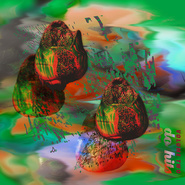

Do Hits Vol.2
============================

|  |  |
| :--: | :-- |
| [ Do Hits Vol.2](https://emumo.xiami.com/album/2100173608) | **艺人**: [Do Hits](../index.md) **语种**: 其他 **唱片公司**: Do Hits **发行时间**: 2015年08月07日 **专辑类别**: 合集, 杂锦 **专辑风格**: 另类舞曲 Alternative Dance, 恍惚嘻哈舞曲 Wonky **播放数**: 237398 **收藏数**: 430 **评论数**: 70  |

## 简介

Do Hits Vol.01合辑发行之后，我们收到了无与伦比的反馈，希望参与其中的音乐人越来越多，以至于Do Hits Vol.02不得不提前与大家见面。
 

有一个叫Achun的澳门少年，他和所有中国做电子音乐的人都是网友，这次他用一曲流动的《南方》来介绍自己。比Achun更虚拟的是“网恋C11”，没人知道他是谁，只知道他人在新加坡，是一位后网络主义男孩，喜欢跟女友一起蹭吃蹭喝。ZHI16曾专业学习贝斯和编曲，专职棚虫，除了与流行歌手合作之外，还做些泼辣怪诞的东方Beats。Dokedo原本是设计师，玩过乐队弹过吉他，接触Fruityloops后开始做Beat。他与采样大神、低音音乐新星Jason Hou一起琢磨出了新奇的声音。Mike Gao是我们的老朋友，生于北京长在美国的天才少年，他与Howie Lee的合作便是本张合辑的压轴之作，一首融合了西海岸湾区金斯顿诺丁汉山以及北京五环路的作品。
 

除此之外，还有另一些长期活跃在本地音乐场景的名字：Chuck Upbeat是莫斯科的制作人，他引导了一个Soviet Bass的运动曾取得了国际声誉他也是Generation bass在俄罗斯的负责人。Conrank则是早已在上海取得成功的英国音乐人，外号“炒饭哥”，与DJ Shadow都有过合作。还有来自哈尔滨的Zean，他来了一记东方元素的无耻杀手锏。Harikiri也是我们的老朋友，这位曾经游学北京的黑人选手现已回到英国，仍以Bass音乐拯救中国同胞为己任，与北京的Rapper Bloodz Boi合作一曲《夏利》。Al Kelly是活跃在成都和昆明的外国人，他明白在中国的山水之间有一种看不见的奇异律动。同类题材还有来自Damacha的《Huangpu Ocean》，只是这一抹山水画多了几分厚重和嘈杂，仿佛可以看到往来货轮上斑驳的暗红色油漆。
 

看到这里你明白了，不管你是什么肤色什么种族，也不管你的中文水平如何，对于中国我们总有些要说的。音乐是存在于语言之外的另一种密码，期待能有越来越多的本土音乐人参与进来。
 

 

## 曲目

## 评论

|  |  |  |
| :-- | :-- | :-- |
|  [虾米用户](https://emumo.xiami.com/u/34593165) 我还没想好要写什么... 2017-01-15 21:46 赞(0) 踩(0) | 
so cool～
 |
|  [虾米用户](https://emumo.xiami.com/u/233496987) Love2016 2017-01-10 20:07 赞(0) 踩(0) | 
电驴大叔大妈画着浓妆午夜鸣喇叭
 |
|  [虾米用户](https://emumo.xiami.com/u/12930904) 月亮与六便士 2016-11-06 21:26 赞(0) 踩(0) | 
❤
 |
|  [虾米用户](https://emumo.xiami.com/u/37142551) ᴍᴀᴋᴇ ᴀʀᴛ ɴᴏᴛ... 2016-07-12 12:40 赞(0) 踩(0) | 

 |
|  [虾米用户](https://emumo.xiami.com/u/52506830) 再见 2016-03-11 19:49 赞(0) 踩(0) | 
屯
 |
|  [虾米用户](https://emumo.xiami.com/u/3762589) 我还没想好要写什么... 2016-02-14 17:36 赞(0) 踩(0) | 
倒序听过来，这张稍微浮躁了些，还是很棒
 |
|  [虾米用户](https://emumo.xiami.com/u/58857102)  2015-11-27 23:04 赞(0) 踩(0) | 
新
 |
|  [虾米用户](https://emumo.xiami.com/u/2780922) 电池胶囊 2015-11-01 22:26 赞(2) 踩(0) | 
Do Hits是个值得我去盲目崇拜的团体
 |
|  [虾米用户](https://emumo.xiami.com/u/1239175)  2015-10-10 13:15 赞(1) 踩(0) | 
howie lee那里的方庄和这里的不太一样
 |
|  [虾米用户](https://emumo.xiami.com/u/10294352) 加了个油 2015-08-20 12:48 赞(0) 踩(0) | 
牛逼
 |
|  [虾米用户](https://emumo.xiami.com/u/597639) 八方见喜，十方来财 2015-08-17 15:45 赞(8) 踩(0) | 
大概是中国电子乐历史上最酷的一张
 |
|  [虾米用户](https://emumo.xiami.com/u/48727211)   2015-08-13 12:17 赞(0) 踩(0) | 
牛爆了
 |
|  [虾米用户](https://emumo.xiami.com/u/1031) asca.lu 2015-08-11 16:15 赞(0) 踩(0) | 
牛逼得不要不要的
 |
|  [虾米用户](https://emumo.xiami.com/u/46200482) 暂无签名~ 2015-08-09 21:07 赞(0) 踩(0) | 
神一般的专辑
 |
|  [虾米用户](https://emumo.xiami.com/u/6169141) 是吗 2015-08-08 18:51 赞(0) 踩(0) | 

 |
|  [虾米用户](https://emumo.xiami.com/u/6169141) 是吗 2015-08-08 18:51 赞(0) 踩(0) | 

 |
|  [虾米用户](https://emumo.xiami.com/u/69121)  2015-08-08 14:23 赞(0) 踩(0) | 
难道重点不是封面裸眼3D吗？
 |
| ⇒ |  [虾米用户](https://emumo.xiami.com/u/46200482) 暂无签名~ 2015-08-11 16:03 赞(0) 踩(0) | 
为何看不出来
 |
| ⇒ |  [虾米用户](https://emumo.xiami.com/u/46200482) 暂无签名~ 2015-08-11 16:03 赞(0) 踩(0) | 
为何看不出来
 |
| ⇒ |  [虾米用户](https://emumo.xiami.com/u/46200482) 暂无签名~ 2015-08-11 16:03 赞(0) 踩(0) | 
为何看不出来
 |
|  [虾米用户](https://emumo.xiami.com/u/9083013) 虚空有尽 我愿无穷 2015-08-08 12:03 赞(0) 踩(0) | 
有点儿意思
 |
|  [虾米用户](https://emumo.xiami.com/u/1828555) Omnivore 2015-08-08 00:57 赞(1) 踩(0) | 
这张专辑应该叫《最炫民族风》 
 |
|  [虾米用户](https://emumo.xiami.com/u/33021753) 我还没想好要写什么... 2015-08-08 00:11 赞(0) 踩(0) | 
酷酷酷！
 |
|  [虾米用户](https://emumo.xiami.com/u/2205450) 我还没想好要写什么... 2015-08-07 23:49 赞(1) 踩(0) | 
太喜欢了
 |
|  [虾米用户](https://emumo.xiami.com/u/1930103) #BEEN CHILL# 2015-08-07 22:35 赞(0) 踩(0) | 
Do Hits
 |
|  [虾米用户](https://emumo.xiami.com/u/9476738) 明灯常在 2015-08-07 17:44 赞(1) 踩(0) | 
被你国特色社会主义的节奏电的睁不开眼 酷的不要不要的 赶紧跳下楼吃了个冰棍买了两袋鱼食
 |
|  [虾米用户](https://emumo.xiami.com/u/13458091) 2021.1.15  成... 2015-08-07 11:43 赞(0) 踩(0) | 
酷！
 |
|  [虾米用户](https://emumo.xiami.com/u/29358) ╱╱╱╱╱╱ 2015-08-07 11:36 赞(0) 踩(0) | 
s ɪ ᴄ ᴋ
 |
|  [虾米用户](https://emumo.xiami.com/u/8854264) Hypocrite. 2015-08-07 11:34 赞(1) 踩(0) | 
看歌名辩老外系列
 |
|  [虾米用户](https://emumo.xiami.com/u/8854264) Hypocrite. 2015-08-07 11:29 赞(0) 踩(0) | 
封面是一个个彩蛋么
 |
|  [虾米用户](https://emumo.xiami.com/u/8854264) Hypocrite. 2015-08-07 11:24 赞(0) 踩(0) | 
哈哈哈这个专辑介绍好醉
 |
|  [虾米用户](https://emumo.xiami.com/u/46200482) 暂无签名~ 2015-08-07 11:11 赞(0) 踩(0) | 
留名
 |
|  [虾米用户](https://emumo.xiami.com/u/676884) OUT OF FASHI... 2015-08-07 11:04 赞(0) 踩(0) | 
好
 |
|  [虾米用户](https://emumo.xiami.com/u/3973939) Future R&B L... 2015-08-07 10:55 赞(0) 踩(0) | 
Chinese Bass Music
 |
|  [虾米用户](https://emumo.xiami.com/u/13958254) 我爱你 2015-08-07 10:48 赞(0) 踩(0) | 
nb
 |
|  [虾米用户](https://emumo.xiami.com/u/47736446) 上传了最后一首 2015-08-07 10:35 赞(0) 踩(0) | 
介绍写得太好～salute
 |
|  [虾米用户](https://emumo.xiami.com/u/8943891) 你咋那么可爱？ 2015-08-07 06:47 赞(0) 踩(0) | 

 |
|  [虾米用户](https://emumo.xiami.com/u/4160754)   2015-08-05 19:51 赞(0) 踩(0) | 
吱
 |
|  [虾米用户](https://emumo.xiami.com/u/4906667) 我还没想好要写什么... 2015-08-04 16:34 赞(2) 踩(0) | 

 |
|  [虾米用户](https://emumo.xiami.com/u/2459) Nia? 2015-08-04 12:24 赞(1) 踩(0) | 
奶丝
 |
|  [虾米用户](https://emumo.xiami.com/u/3330467) Ⴚ(◕ტ◕)Ⴢ 2015-08-04 11:53 赞(0) 踩(0) | 
来
 |
|  [虾米用户](https://emumo.xiami.com/u/17130245) 我还没想好要写什么... 2015-08-03 21:46 赞(0) 踩(0) | 
给给给
 |
|  [虾米用户](https://emumo.xiami.com/u/597639) 八方见喜，十方来财 2015-08-03 10:48 赞(0) 踩(0) | 
!
 |
|  [虾米用户](https://emumo.xiami.com/u/26363189) 我还没想好要写什么... 2015-08-03 10:39 赞(1) 踩(0) | 
推荐
 |
|  [虾米用户](https://emumo.xiami.com/u/36342380) 我还没想好要写什么... 2015-08-03 10:18 赞(1) 踩(0) | 
夏利 嘿嘿
 |
|  [虾米用户](https://emumo.xiami.com/u/765112) Music is kit... 2015-08-03 01:21 赞(0) 踩(0) | 
Fucking awesome
 |
|  [虾米用户](https://emumo.xiami.com/u/9080508) 可知道 你的光 耀了我 2015-08-02 23:44 赞(0) 踩(0) | 
+
 |
|  [虾米用户](https://emumo.xiami.com/u/5803871) 晒太阳可以补充维生素D 2015-08-02 18:33 赞(0) 踩(0) | 

 |
|  [虾米用户](https://emumo.xiami.com/u/49934446) SINA WEIBO:@... 2015-08-02 17:17 赞(0) 踩(0) | 
可你还是酷到有朋友
 |
|  [虾米用户](https://emumo.xiami.com/u/9726884)    今  食  飯 2015-08-02 17:03 赞(0) 踩(0) | 
好像去到了一个天上gadenggadeng撒钱地上全是水果的地方
 |
|  [虾米用户](https://emumo.xiami.com/u/45774340)  2015-08-02 16:48 赞(21) 踩(0) | 
牛逼
 |
|  [虾米用户](https://emumo.xiami.com/u/13973455) ***! 2015-08-02 16:46 赞(0) 踩(0) | 
 
 |
|  [虾米用户](https://emumo.xiami.com/u/19812281) 扰乱 就是 扰乱 2015-08-02 15:47 赞(0) 踩(0) | 
好
 |
|  [虾米用户](https://emumo.xiami.com/u/49492050) 中国电子音乐独立厂牌 2015-08-02 15:16 赞(0) 踩(0) | 

 |
|  [虾米用户](https://emumo.xiami.com/u/4143679) 我还没想好要写什么... 2015-08-02 13:31 赞(0) 踩(0) | 
嘎嘎嘎嘎
 |
|  [虾米用户](https://emumo.xiami.com/u/37083761)   2015-08-02 13:19 赞(0) 踩(0) | 

 |
|  [虾米用户](https://emumo.xiami.com/u/37087360) thecutestcut... 2015-08-02 13:13 赞(0) 踩(0) | 
好听
 |
|  [虾米用户](https://emumo.xiami.com/u/1931086) 正义，或许会迟到，但永远... 2015-08-02 12:53 赞(0) 踩(0) | 
还是很期待Do hits带给我们一个新鲜的节奏旅程。
 |
|  [虾米用户](https://emumo.xiami.com/u/676884) OUT OF FASHI... 2015-08-02 12:21 赞(0) 踩(0) | 
好
 |
|  [虾米用户](https://emumo.xiami.com/u/39788841)  . 2015-08-02 12:20 赞(0) 踩(0) | 
Lium
 |
|  [虾米用户](https://emumo.xiami.com/u/4906667) 我还没想好要写什么... 2015-08-02 12:19 赞(0) 踩(0) | 

 |
|  [虾米用户](https://emumo.xiami.com/u/4279377) nomoretears 2015-08-02 12:08 赞(0) 踩(0) | 
东西真地道
 |
|  [虾米用户](https://emumo.xiami.com/u/4279377) nomoretears 2015-08-02 12:07 赞(0) 踩(0) | 
行～
 |
|  [虾米用户](https://emumo.xiami.com/u/10223816) ㅤ  2015-08-02 12:07 赞(1) 踩(0) | 
❌
 |
|  [虾米用户](https://emumo.xiami.com/u/4279377) nomoretears 2015-08-02 12:03 赞(0) 踩(0) | 

 |
|  [虾米用户](https://emumo.xiami.com/u/9027473) ☻ 2015-08-02 11:51 赞(0) 踩(0) | 
☻
 |
|  [虾米用户](https://emumo.xiami.com/u/47736446) 上传了最后一首 2015-08-02 11:09 赞(1) 踩(0) | 
帥爆
 |
| ⇒ |  [虾米用户](https://emumo.xiami.com/u/3512592) 你需要休闲 2015-08-02 13:38 赞(0) 踩(0) | 
你的闹太套很棒
 |
| ⇒ |  [虾米用户](https://emumo.xiami.com/u/47736446) 上传了最后一首 2015-08-02 13:39 赞(0) 踩(0) | 
<q><b>DOKEDO说：</b></q>
 |
|  [虾米用户](https://emumo.xiami.com/u/39193232)  2015-08-02 10:55 赞(0) 踩(0) | 
   
 |
