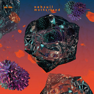

Motherland: Nehzuil
============================

|  |  |
| :--: | :-- |
| [ Motherland: Nehzuil](https://emumo.xiami.com/album/2100292250) | **艺人**: [Do Hits](../index.md) **语种**: 英语 **唱片公司**: Do Hits **发行时间**: 2016年03月14日 **专辑类别**: EP, 单曲 **专辑风格**: 灵魂乐 Soul, 节奏布鲁斯 Rhythm & Blues **播放数**: 32939 **收藏数**: 78 **评论数**: 31  |

## 简介

Motherland是Do Hits一个全新的发行系列。我们要把散落在海外的华人声音收集起来，为世界舞台上先驱的华裔制作人们发行他们的音乐。  

 
  

Nehzuil，原名刘振，是生活在澳大利亚的制作人，音乐家。他因为制作了很多经典流行歌曲的remix，别出心裁的重新演绎，可听度极高，受到了大量关注。这次他为他的母亲土地贡献了四首歌的EP《Motherland: Nehzuil》，除了他最擅长的R&amp;B, 灵魂音乐风格，与流行音乐采样，更融入了Trap的元素，以及些许东方情调的音色——毫不刻意，像是一记化骨绵掌，即刻放缓了你的心率。 

## 曲目

## 评论

|  |  |  |  |
| :-- | :-- | :-- | :-- |
|  [虾米用户](https://emumo.xiami.com/u/10170789) 最後一天 网易：Gimm... 2018-07-13 15:35 赞(0) 踩(0) | 
愛
 |
|  [虾米用户](https://emumo.xiami.com/u/44784434) 变得和我一样库 2016-05-29 09:52 赞(0) 踩(0) | 
好听到哭泣
 |
|  [虾米用户](https://emumo.xiami.com/u/44784434) 变得和我一样库 2016-05-29 00:31 赞(0) 踩(0) | 
都太好听了 
 |
|  [虾米用户](https://emumo.xiami.com/u/36582587) weibo：llll44... 2016-04-27 16:02 赞(0) 踩(0) | 
棒
 |
|  [虾米用户](https://emumo.xiami.com/u/40044477) closed 2016-04-10 09:40 赞(0) 踩(0) | 
4首都爱
 |
|  [虾米用户](https://emumo.xiami.com/u/6654069) mutherfacker... 2016-04-09 04:25 赞(0) 踩(0) | 
现场太棒啦
 |
|  [虾米用户](https://emumo.xiami.com/u/676884) OUT OF FASHI... 2016-03-31 15:03 赞(0) 踩(0) | 
有缘再见哦
 |
|  [虾米用户](https://emumo.xiami.com/u/648550) She Luv Me 2016-03-28 11:45 赞(0) 踩(0) | 
回妈妈这里来~
 |
|  [虾米用户](https://emumo.xiami.com/u/138680) 如雨化风  入画飞痕 2016-03-26 21:08 赞(0) 踩(0) | 
好棒！
 |
|  [虾米用户](https://emumo.xiami.com/u/69979148) 我不就庸俗点儿吗 2016-03-20 23:46 赞(0) 踩(0) | 

 |
|  [虾米用户](https://emumo.xiami.com/u/10729579) 伟大的我 2016-03-16 14:29 赞(0) 踩(0) | 

 |
|  [虾米用户](https://emumo.xiami.com/u/42796332) H e l l o ! ... 2016-03-16 09:16 赞(0) 踩(0) | 

 |
|  [虾米用户](https://emumo.xiami.com/u/15286935) XxX 2016-03-14 18:36 赞(0) 踩(0) | 
化骨绵掌
 |
|  [虾米用户](https://emumo.xiami.com/u/9464517) 我还没想好要写什么... 2016-03-14 18:29 赞(0) 踩(0) | 
～
 |
|  [虾米用户](https://emumo.xiami.com/u/12213540)  2016-03-14 18:00 赞(0) 踩(0) | 
love
 |
|  [虾米用户](https://emumo.xiami.com/u/47736446) 上传了最后一首 2016-03-14 12:36 赞(2) 踩(0) | 
好听到不行
 |
|  [虾米用户](https://emumo.xiami.com/u/14845416) 鹿角轻轻一撇就斷了… 2016-03-14 12:35 赞(0) 踩(0) | 
好！
 |
|  [虾米用户](https://emumo.xiami.com/u/15941448) Live n da wa... 2016-03-14 12:22 赞(0) 踩(0) | 
行
 |
|  [虾米用户](https://emumo.xiami.com/u/44165417) drop or trap 2016-03-14 12:00 赞(0) 踩(0) | 
可以的
 |
|  [虾米用户](https://emumo.xiami.com/u/9513422) 虾米歌单迁徙到网易☁️:... 2016-03-14 11:54 赞(0) 踩(0) | 
/
 |
|  [虾米用户](https://emumo.xiami.com/u/3762589) 我还没想好要写什么... 2016-03-14 10:11 赞(0) 踩(0) | 
耳膜酸爽系列……
 |
|  [虾米用户](https://emumo.xiami.com/u/54952494) 进步青年社区成员/产品经... 2016-03-14 09:38 赞(0) 踩(0) | 
gotcha
 |
|  [虾米用户](https://emumo.xiami.com/u/45298985) Wechat:dqx19... 2016-03-14 09:05 赞(0) 踩(0) | 
+
 |
|  [虾米用户](https://emumo.xiami.com/u/49934446) SINA WEIBO:@... 2016-03-14 08:57 赞(0) 踩(0) | 
好
 |
|  [虾米用户](https://emumo.xiami.com/u/25017703)   2016-03-14 08:54 赞(0) 踩(0) | 
早
 |
|  [虾米用户](https://emumo.xiami.com/u/11960217) 少年心气疾 2016-03-14 08:41 赞(0) 踩(0) | 
yo
 |
|  [虾米用户](https://emumo.xiami.com/u/52771547)   2016-03-14 08:39 赞(0) 踩(0) | 
.
 |
|  [虾米用户](https://emumo.xiami.com/u/42499433) / 2016-03-14 08:37 赞(0) 踩(0) | 
～
 |
|  [虾米用户](https://emumo.xiami.com/u/40208599) 我很聪明什么也没留下 2016-03-14 08:35 赞(0) 踩(0) | 
|
 |
|  [虾米用户](https://emumo.xiami.com/u/3330467) Ⴚ(◕ტ◕)Ⴢ 2016-03-14 08:30 赞(0) 踩(0) | 
来
 |
|  [虾米用户](https://emumo.xiami.com/u/207477) 精怪 2016-03-14 08:21 赞(0) 踩(0) | 
清晨的问候
 |
