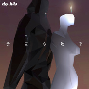

 论五行
============================

|  |  |
| :--: | :-- |
| [  论五行](https://emumo.xiami.com/album/2100315292) | **艺人**: [Do Hits](../index.md) **语种**: 国语 **唱片公司**: Do Hits **发行时间**: 2016年04月18日 **专辑类别**: EP, 单曲 **专辑风格**: 另类舞曲 Alternative Dance, 恍惚嘻哈舞曲 Wonky **播放数**: 23807 **收藏数**: 204 **评论数**: 51  |

## 简介

 
 

“ZHI16用CUba<x>se盖了一座云上的金銮殿，巨大的金色沙漏拖住时间，让你和仙女们的故事越来越精彩。JOY GINGER用LOGIC PRO创造了一片神秘雨林，咒语低吟在每一片灌木丛里，诱惑你做出冲动的选择。DOKEDO用MASCHINE敲了一座溶洞，里面有一间水上俱乐部，毫无默契的乐手在回声中寻找和谐。RADIAX用ABLETON LIVE打造冷兵器工坊，火焰铸造的利刃可以轻易斩断你的虚情假意和犹豫不决。PO1ARADA用FL STUDIO建造了一座镜像地宫，那里与地上的一切皆为反之，天为地，地为天，在自己的规则中焕发勃勃生机……”别信这些中二病，找到你自己的哈姆雷特。听完这张功能性合辑，你需要保持平衡。感谢Luvea和cng的人声，感谢INKA SHU的封面。感谢DO HITS和为此付出的所有人，这是最酷的新婚礼物。</x>
 

 

## 曲目

## 评论

|  |  |  |  |
| :-- | :-- | :-- | :-- |
|  [虾米用户](https://emumo.xiami.com/u/3815293) baby Jesus s... 2017-10-27 23:43 赞(0) 踩(0) | 
是时候感受不同编曲软件的画风差异了 
 |
|  [虾米用户](https://emumo.xiami.com/u/44858122) 嘻哈制噪团队成员 2016-07-20 16:02 赞(0) 踩(0) | 
牛逼
 |
|  [虾米用户](https://emumo.xiami.com/u/43418234) ^_−☆ 2016-05-20 11:37 赞(0) 踩(0) | 
酷酷
 |
|  [虾米用户](https://emumo.xiami.com/u/43154417) 我还没想好要写什么... 2016-05-17 12:01 赞(0) 踩(0) | 

 |
|  [虾米用户](https://emumo.xiami.com/u/5907047) 8==D 2016-05-03 16:55 赞(0) 踩(0) | 
:)
 |
|  [虾米用户](https://emumo.xiami.com/u/26341188)   2016-05-03 00:00 赞(0) 踩(0) | 
道法自然
 |
|  [虾米用户](https://emumo.xiami.com/u/36582587) weibo：llll44... 2016-04-27 15:53 赞(0) 踩(0) | 

 |
|  [虾米用户](https://emumo.xiami.com/u/49775775) 扣不定女 2016-04-23 08:50 赞(0) 踩(0) | 
.
 |
|  [虾米用户](https://emumo.xiami.com/u/4063805) 我还没想好要写什么... 2016-04-22 20:35 赞(0) 踩(0) | 
Cool
 |
|  [虾米用户](https://emumo.xiami.com/u/9513422) 虾米歌单迁徙到网易☁️:... 2016-04-20 20:11 赞(0) 踩(0) | 
补
 |
|  [虾米用户](https://emumo.xiami.com/u/3815293) baby Jesus s... 2016-04-20 12:06 赞(0) 踩(0) | 
你行你行你行你行你也行
 |
|  [虾米用户](https://emumo.xiami.com/u/43982464) 哒优 2016-04-20 11:45 赞(1) 踩(0) | 
曲很带感，就是感觉旁白稍微有点听着蛋疼
 |
|  [虾米用户](https://emumo.xiami.com/u/12540991) IF 2016-04-19 15:54 赞(0) 踩(0) | 
～
 |
|  [虾米用户](https://emumo.xiami.com/u/40208599) 我很聪明什么也没留下 2016-04-19 11:58 赞(0) 踩(0) | 
ˡ̗͐͐͟ˋ̨̮̑͞͞ˊ̮̑͏͜ʹ̍ᵓ̗ͥ
 |
|  [虾米用户](https://emumo.xiami.com/u/15286935) XxX 2016-04-19 01:23 赞(0) 踩(0) | 
Ø
 |
|  [虾米用户](https://emumo.xiami.com/u/1604445) 凡音之起，由人心生也。人... 2016-04-18 23:51 赞(0) 踩(0) | 
封面什么字体
 |
|  [虾米用户](https://emumo.xiami.com/u/16255463)   2016-04-18 19:18 赞(1) 踩(0) | 

 |
|  [虾米用户](https://emumo.xiami.com/u/3512592) 你需要休闲 2016-04-18 18:44 赞(2) 踩(0) | 
桑僧相哈 爱你们
 |
|  [虾米用户](https://emumo.xiami.com/u/44240471) 」精 分 患 者「 2016-04-18 17:51 赞(0) 踩(0) | 
「五 行」
 |
|  [虾米用户](https://emumo.xiami.com/u/44240471) 」精 分 患 者「 2016-04-18 17:50 赞(0) 踩(0) | 
太愛❤️
 |
|  [虾米用户](https://emumo.xiami.com/u/26015717) 微博：浪漫失格 2016-04-18 16:43 赞(0) 踩(0) | 
。
 |
|  [虾米用户](https://emumo.xiami.com/u/45298985) Wechat:dqx19... 2016-04-18 15:27 赞(0) 踩(0) | 
+
 |
|  [虾米用户](https://emumo.xiami.com/u/7339667) 嗯，好的。 2016-04-18 14:38 赞(0) 踩(0) | 
森森相哈
 |
|  [虾米用户](https://emumo.xiami.com/u/43418234) ^_−☆ 2016-04-18 14:05 赞(0) 踩(0) | 
cool
 |
|  [虾米用户](https://emumo.xiami.com/u/44118515) 保持距离 2016-04-18 13:33 赞(1) 踩(0) | 
再次恭贺道一新婚快乐
 |
| ⇒ |  [虾米用户](https://emumo.xiami.com/u/3512592) 你需要休闲 2016-04-18 18:42 赞(0) 踩(0) | 

 |
|  [虾米用户](https://emumo.xiami.com/u/48373788) 模仿他人无异于自杀。 2016-04-18 13:11 赞(0) 踩(0) | 
w
 |
|  [虾米用户](https://emumo.xiami.com/u/47736446) 上传了最后一首 2016-04-18 12:31 赞(1) 踩(0) | 
woooooow
 |
|  [虾米用户](https://emumo.xiami.com/u/40823619) 还不够放肆 2016-04-18 12:31 赞(0) 踩(0) | 

 |
|  [虾米用户](https://emumo.xiami.com/u/44165417) drop or trap 2016-04-18 12:20 赞(0) 踩(0) | 
牛逼
 |
|  [虾米用户](https://emumo.xiami.com/u/3330467) Ⴚ(◕ტ◕)Ⴢ 2016-04-18 11:45 赞(0) 踩(0) | 
来
 |
|  [虾米用户](https://emumo.xiami.com/u/51719946) 除了你什么都不好玩 2016-04-18 11:40 赞(0) 踩(0) | 
下回要玩八卦了
 |
|  [虾米用户](https://emumo.xiami.com/u/43055800) 根号C就是NE！ 2016-04-18 11:20 赞(0) 踩(0) | 
嗯
 |
|  [虾米用户](https://emumo.xiami.com/u/14845416) 鹿角轻轻一撇就斷了… 2016-04-18 11:09 赞(0) 踩(0) | 
好
 |
|  [虾米用户](https://emumo.xiami.com/u/12845416) 23-06-93 2016-04-18 11:08 赞(0) 踩(0) | 
金木水火土相生相克
 |
|  [虾米用户](https://emumo.xiami.com/u/36208991)   2016-04-18 10:55 赞(0) 踩(0) | 
ฅ⃛
 |
|  [虾米用户](https://emumo.xiami.com/u/7729258)  2016-04-18 10:26 赞(0) 踩(0) | 
******
 |
|  [虾米用户](https://emumo.xiami.com/u/19812281) 扰乱 就是 扰乱 2016-04-18 10:23 赞(0) 踩(0) | 
可以
 |
|  [虾米用户](https://emumo.xiami.com/u/9412733) 雪人☃ 2016-04-18 10:18 赞(0) 踩(0) | 
赞！！！
 |
|  [虾米用户](https://emumo.xiami.com/u/35207884) 杂食 2016-04-18 09:15 赞(0) 踩(0) | 
[文字cool]
 |
|  [虾米用户](https://emumo.xiami.com/u/45747187) Dancing is m... 2016-04-18 09:10 赞(1) 踩(0) | 

 |
|  [虾米用户](https://emumo.xiami.com/u/53539296) よろしくね＾＾ 2016-04-18 09:07 赞(0) 踩(0) | 
wow
 |
|  [虾米用户](https://emumo.xiami.com/u/28771866) 不 2016-04-18 08:40 赞(0) 踩(0) | 
好
 |
|  [虾米用户](https://emumo.xiami.com/u/34645862) 寻找一生最喜欢的音乐 2016-04-18 08:37 赞(0) 踩(0) | 
来啦来啦
 |
|  [虾米用户](https://emumo.xiami.com/u/42499433) / 2016-04-18 08:35 赞(0) 踩(0) | 
～
 |
|  [虾米用户](https://emumo.xiami.com/u/13458091) 2021.1.15  成... 2016-04-18 08:35 赞(0) 踩(0) | 

 |
|  [虾米用户](https://emumo.xiami.com/u/9464517) 我还没想好要写什么... 2016-04-18 08:35 赞(0) 踩(0) | 
～
 |
|  [虾米用户](https://emumo.xiami.com/u/36700905) 暂无签名~ 2016-04-18 08:34 赞(0) 踩(0) | 
呼呼呼
 |
|  [虾米用户](https://emumo.xiami.com/u/37087360) thecutestcut... 2016-04-18 08:10 赞(4) 踩(0) | 
〰
 |
| ⇒ |  [虾米用户](https://emumo.xiami.com/u/43418234) ^_−☆ 2016-04-18 08:32 赞(0) 踩(0) | 
♡
 |
|  [虾米用户](https://emumo.xiami.com/u/1244385)   2016-04-17 23:24 赞(0) 踩(0) | 
喂
 |
|  [虾米用户](https://emumo.xiami.com/u/138620026) 倒地冰箱 2016-04-17 16:42 赞(0) 踩(0) | 
超 期 待
 |
