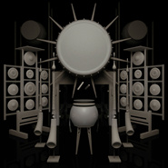

原Origin
============================

|  |  |
| :--: | :-- |
| [ 原Origin](https://emumo.xiami.com/album/2100371762) | **艺人**: [Do Hits](../index.md) **语种**: 其他 **唱片公司**: Do Hits **发行时间**: 2016年07月25日 **专辑类别**: EP, 单曲 **专辑风格**: 实验电子 Experimental Electronic **播放数**: 25935 **收藏数**: 127 **评论数**: 34  |

## 简介

 
 

末世以后，史前文明复兴——中国最前沿的电子音乐制作人Jason Hou用声音构成了一部听觉的Cyberpunk电影。《原(Origin)》是Jason Hou对于自身的来源及认同的思考，与对俱乐部声音更多可能性的探索。
 

 

## 曲目

## 评论

|  |  |  |  |
| :-- | :-- | :-- | :-- |
|  [虾米用户](https://emumo.xiami.com/u/264283064) bye  2017-05-30 17:49 赞(0) 踩(0) | 
△
 |
|  [虾米用户](https://emumo.xiami.com/u/36817043) 呸 2016-12-24 09:01 赞(0) 踩(0) | 
太棒咯
 |
|  [虾米用户](https://emumo.xiami.com/u/31890858)  2016-09-04 23:49 赞(0) 踩(0) | 
可以跳舞的，作为一个舞蹈编导。我很乐意花钱买
 |
|  [虾米用户](https://emumo.xiami.com/u/5808043)  2016-09-03 11:05 赞(1) 踩(0) | 
确实是听不懂，只觉着是毫不媚俗的一张专辑，听众能否听懂，音乐是否悦耳，有没有旋律性都不重要，用民族乐器与琐碎的电子音色，表现出并不存在的仪式般的画面，可能是整张专辑的主旨。
 |
|  [虾米用户](https://emumo.xiami.com/u/44858122) 嘻哈制噪团队成员 2016-08-30 12:52 赞(0) 踩(0) | 
牛逼
 |
|  [虾米用户](https://emumo.xiami.com/u/43805130) 网易:SIonsoNOk... 2016-08-19 11:54 赞(0) 踩(0) | 

 |
|  [虾米用户](https://emumo.xiami.com/u/43547593) ♡ 2016-08-18 23:15 赞(0) 踩(0) | 
⅋
 |
|  [虾米用户](https://emumo.xiami.com/u/12230374) Pinkfloydzh，... 2016-08-14 22:30 赞(0) 踩(0) | 
这张牛逼的
 |
|  [虾米用户](https://emumo.xiami.com/u/9288193)  2016-08-12 23:26 赞(0) 踩(0) | 
↺
 |
|  [虾米用户](https://emumo.xiami.com/u/37087360) thecutestcut... 2016-08-02 13:29 赞(0) 踩(0) | 
喜欢你
 |
|  [虾米用户](https://emumo.xiami.com/u/49941933) 独立小众艺人 DeepW... 2016-08-01 16:14 赞(0) 踩(0) | 
绝了
 |
|  [虾米用户](https://emumo.xiami.com/u/138680) 如雨化风  入画飞痕 2016-07-31 21:32 赞(0) 踩(0) | 
我喜欢第一首
 |
|  [虾米用户](https://emumo.xiami.com/u/2371509)  2016-07-30 18:32 赞(0) 踩(0) | 
wow。
 |
|  [虾米用户](https://emumo.xiami.com/u/39052743) BadA$$ 2016-07-30 10:14 赞(0) 踩(0) | 
水平真高.
 |
|  [虾米用户](https://emumo.xiami.com/u/43443094) ٩ 2016-07-30 00:48 赞(0) 踩(0) | 
.
 |
|  [虾米用户](https://emumo.xiami.com/u/146209750) 想和喜欢坂本慎太郎的人谈... 2016-07-26 12:04 赞(0) 踩(0) | 
！！！
 |
|  [虾米用户](https://emumo.xiami.com/u/48211350) 已弃虾米，勿扰 2016-07-26 00:01 赞(0) 踩(0) | 
ǚ
 |
|  [虾米用户](https://emumo.xiami.com/u/43700627) 嗯 2016-07-25 19:30 赞(0) 踩(0) | 

 |
|  [虾米用户](https://emumo.xiami.com/u/42499433) / 2016-07-25 13:47 赞(0) 踩(0) | 
向
 |
|  [虾米用户](https://emumo.xiami.com/u/49934446) SINA WEIBO:@... 2016-07-25 13:38 赞(1) 踩(0) | 
猴猴猴
 |
|  [虾米用户](https://emumo.xiami.com/u/45298985) Wechat:dqx19... 2016-07-25 11:35 赞(0) 踩(0) | 
+
 |
|  [虾米用户](https://emumo.xiami.com/u/3762589) 我还没想好要写什么... 2016-07-25 08:52 赞(0) 踩(0) | 
封面倒是很符合
 |
|  [虾米用户](https://emumo.xiami.com/u/1320669) ツ 2016-07-24 22:19 赞(0) 踩(0) | 
0.0
 |
|  [虾米用户](https://emumo.xiami.com/u/49775775) 扣不定女 2016-07-24 14:16 赞(0) 踩(0) | 
哎呀
 |
|  [虾米用户](https://emumo.xiami.com/u/14845416) 鹿角轻轻一撇就斷了… 2016-07-24 12:48 赞(0) 踩(0) | 
据说是基诺族的太阳鼓
 |
|  [虾米用户](https://emumo.xiami.com/u/9931551) 感谢相遇 2016-07-24 12:31 赞(0) 踩(0) | 
来了！！
 |
|  [虾米用户](https://emumo.xiami.com/u/45298985) Wechat:dqx19... 2016-07-24 12:11 赞(0) 踩(0) | 
+
 |
|  [虾米用户](https://emumo.xiami.com/u/40208599) 我很聪明什么也没留下 2016-07-24 12:02 赞(0) 踩(0) | 
ˡ̗͐͐͟ˋ̨̮̑͞͞ˊ̮̑͏͜ʹ̍ᵓ̗ͥ
 |
|  [虾米用户](https://emumo.xiami.com/u/9464517) 我还没想好要写什么... 2016-07-24 12:00 赞(0) 踩(0) | 
～
 |
|  [虾米用户](https://emumo.xiami.com/u/23144668) 我需要安靜。我自已和自己... 2016-07-24 08:13 赞(0) 踩(0) | 
美好的一天
 |
|  [虾米用户](https://emumo.xiami.com/u/43418234) ^_−☆ 2016-07-24 08:07 赞(0) 踩(0) | 
早上好
 |
|  [虾米用户](https://emumo.xiami.com/u/35207884) 杂食 2016-07-24 08:07 赞(0) 踩(0) | 

 |
|  [虾米用户](https://emumo.xiami.com/u/33551565)  2016-07-24 08:06 赞(0) 踩(0) | 

 |
|  [虾米用户](https://emumo.xiami.com/u/12845416) 23-06-93 2016-07-24 08:05 赞(0) 踩(0) | 
❤️
 |
