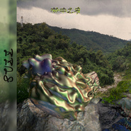

林中之象An Elephant In The Jungle
============================

|  |  |
| :--: | :-- |
| [ 林中之象An Elephant In The Jungle](https://emumo.xiami.com/album/2102644456) | **艺人**: [Do Hits](../index.md) **语种**: 国语 **唱片公司**: Do Hits **发行时间**: 2016年10月30日 **专辑类别**: 录音室专辑 **专辑风格**: 酸性浩室舞曲 Acid House, 台湾原住民音乐 Taiwan Aboriginal **播放数**: 75099 **收藏数**: 463 **评论数**: 26  |

## 简介

出生在海南的制作人Guzz将他对热带生活、亚洲传统音乐的探索与热爱浓缩、调配成了个人全长专辑《林中之象》。他用丰富的采样与独特的声响铺陈开一段迷失丛林的旅程——穿过巨大的南国植物，窥见水边大象。
 

 
 

《深绿色的水雾》吸引你走进这一片神秘的丛林；来自老挝、印度的采样中走出神灵的坐骑——《宛如林中之象》；拨开棕榈叶，《丛林之中遇见神庙》，是未解的远古谜团；男人、女人、自然，和谐《相生》，互为一体。戏剧性的《凤霞》与迷离的《6:30 A.M.》追寻着海南本地文化的踪迹。山地民族的英雄度过了《彩虹桥》，天降《火雨》。
 

 
 

跳舞音乐本就源自丛林部族，这一次扎根都市的俱乐部之声与它的异国远亲相遇，拥抱来自雨林的水气与灵性。人与自然，城市与丛林，历史与未来，以一种温和的东方哲学相互和解，“无欲无求，如林中之象”。
 

 
 

 

## 曲目

## 评论

|  |  |  |  |
| :-- | :-- | :-- | :-- |
|  [虾米用户](https://emumo.xiami.com/u/6224452) snapebubu 2020-01-25 15:10 赞(0) 踩(0) | 
️
 |
|  [虾米用户](https://emumo.xiami.com/u/23831866) 离这里越远越好 2019-09-12 01:40 赞(0) 踩(0) | 
依旧
 |
|  [虾米用户](https://emumo.xiami.com/u/100880386)  2019-03-17 22:37 赞(0) 踩(0) | 
挺热闹的
 |
|  [虾米用户](https://emumo.xiami.com/u/3583995) 一個人的戰爭 2018-12-02 22:24 赞(0) 踩(0) | 
.
 |
|  [虾米用户](https://emumo.xiami.com/u/46970481)  2018-09-26 14:44 赞(0) 踩(0) | 
雨天听倒是不错
 |
|  [虾米用户](https://emumo.xiami.com/u/23831866) 离这里越远越好 2018-04-25 11:33 赞(0) 踩(0) | 
美
 |
|  [虾米用户](https://emumo.xiami.com/u/14845416) 鹿角轻轻一撇就斷了… 2017-04-14 18:10 赞(1) 踩(0) | 
上半年最佳
 |
|  [虾米用户](https://emumo.xiami.com/u/33033164)  2017-02-09 07:29 赞(0) 踩(0) | 
有意思！
 |
|  [虾米用户](https://emumo.xiami.com/u/47090672) _(:_」∠)_ 2017-02-03 01:03 赞(0) 踩(0) | 
piu 21
 |
|  [虾米用户](https://emumo.xiami.com/u/783598) 即兴，才是音乐的本质 2017-01-30 22:36 赞(0) 踩(0) | 
有趣
 |
|  [虾米用户](https://emumo.xiami.com/u/55881258) 今日任公子 2017-01-21 16:56 赞(0) 踩(0) | 
泰来
 |
|  [虾米用户](https://emumo.xiami.com/u/12930904) 月亮与六便士 2017-01-12 15:47 赞(0) 踩(0) | 
❤
 |
|  [虾米用户](https://emumo.xiami.com/u/54546226)   2017-01-04 22:26 赞(0) 踩(0) | 
20170104
 |
|  [虾米用户](https://emumo.xiami.com/u/4754817) 马 2016-12-01 21:48 赞(0) 踩(0) | 
666
 |
|  [虾米用户](https://emumo.xiami.com/u/3330467) Ⴚ(◕ტ◕)Ⴢ 2016-11-23 14:46 赞(0) 踩(0) | 
来
 |
|  [虾米用户](https://emumo.xiami.com/u/7978688)   2016-11-21 16:07 赞(0) 踩(0) | 

 |
|  [虾米用户](https://emumo.xiami.com/u/51984089) 这个傻逼很聪明什么也没留... 2016-11-12 00:54 赞(0) 踩(0) | 
厉害了
 |
|  [虾米用户](https://emumo.xiami.com/u/3813663) 发财 2016-11-09 19:17 赞(0) 踩(0) | 
厉害
 |
|  [虾米用户](https://emumo.xiami.com/u/9464517) 我还没想好要写什么... 2016-11-08 17:59 赞(0) 踩(0) | 
～
 |
|  [虾米用户](https://emumo.xiami.com/u/36208991)   2016-11-07 22:43 赞(0) 踩(0) | 
ฅ⃛
 |
|  [虾米用户](https://emumo.xiami.com/u/1604445) 凡音之起，由人心生也。人... 2016-11-07 17:51 赞(0) 踩(0) | 
顺序不对啊哥
 |
|  [虾米用户](https://emumo.xiami.com/u/55881258) 今日任公子 2016-11-07 17:09 赞(1) 踩(0) | 
16岁少女的梦想是希望有天可以加入do hits
 |
| ⇒ |  [虾米用户](https://emumo.xiami.com/u/3813663) 发财 2016-11-09 19:17 赞(0) 踩(0) | 
加入doshit吧 我们缺少女人
 |
| ⇒ |  [虾米用户](https://emumo.xiami.com/u/44240471) 」精 分 患 者「 2016-11-15 08:30 赞(0) 踩(0) | 
<q><b>6ONMYARM说：</b></q>
 |
|  [虾米用户](https://emumo.xiami.com/u/25914944) 只要为你活一天 2016-11-07 15:52 赞(0) 踩(0) | 
名字全都对不上！乱套啦！！
 |
|  [虾米用户](https://emumo.xiami.com/u/25914944) 只要为你活一天 2016-11-07 15:51 赞(0) 踩(0) | 
顺序搞错了！！！！！
 |
