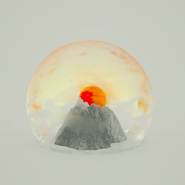

Do Hits免费单曲下载系列之一
============================

|  |  |
| :--: | :-- |
| [ Do Hits免费单曲下载系列之一](https://emumo.xiami.com/album/2102657835) | **艺人**: [Do Hits](../index.md) **语种**: 英语 **唱片公司**: Do Hits **发行时间**: 2016年11月16日 **专辑类别**: EP, 单曲 **专辑风格**: 锐舞音乐 Rave Music **播放数**: 2377 **收藏数**: 6 **评论数**: 1  |

## 简介

来自芬兰的制作人KUPLA居住在伦敦，有着爵士钢琴的背景，他的音乐是IDM, Electronic, Bass, LoFi, Hip-Hop等风格的复杂混合。他与诸多音乐人、舞者、动画师、电影制作人有广泛合作。他的音乐在Cosmonostro，BLVNT RECORDS等厂牌都有成功的发行。他的一首“Drift”也出现在《Do Hits Vol.4》当中。 

## 曲目

## 评论

|  |  |  |  |
| :-- | :-- | :-- | :-- |
|  [虾米用户](https://emumo.xiami.com/u/3330467) Ⴚ(◕ტ◕)Ⴢ 2016-12-04 12:32 赞(0) 踩(0) | 
来
 |
