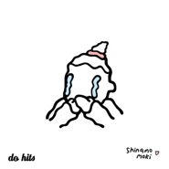

Do Hits免费单曲下载系列之六Shinamo Moki - Dating Sim
============================

|  |  |
| :--: | :-- |
| [ Do Hits免费单曲下载系列之六Shinamo Moki - Dating Sim](https://emumo.xiami.com/album/2102670391) | **艺人**: [Do Hits](../index.md) **语种**: 英语 **唱片公司**: Do Hits **发行时间**: 2016年12月21日 **专辑类别**: EP, 单曲 **专辑风格**:  **播放数**: 5142 **收藏数**: 10 **评论数**: 0  |

## 简介

在阴暗的雾霾里也要卡哇伊， 栖息于伦敦和上海的制作人组合Shinamo Moki在Do Hits带来一首顺滑脑回路单曲  

## 曲目

## 评论

