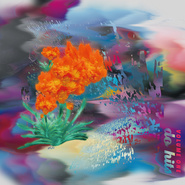

Do Hits Vol.1
============================

|  |  |
| :--: | :-- |
| [ Do Hits Vol.1](https://emumo.xiami.com/album/733693270) | **艺人**: [Do Hits](../index.md) **语种**: 其他 **唱片公司**: Do Hits **发行时间**: 2015年06月01日 **专辑类别**: 合集, 杂锦 **专辑风格**: 另类舞曲 Alternative Dance, 青少年流行 Teen Pop, 恍惚嘻哈舞曲 Wonky **播放数**: 154385 **收藏数**: 483 **评论数**: 46  |

## 简介

 
 

混沌时代开天辟地，行走武林侠义断肠，妖魔鬼怪曲径通幽，柴米油盐混吃等死。这些中国文化里独有的律动，怎样放到当代语境中表达？华尔街金钱堆砌出的EDM幻境，亚特兰大毒屋迸发出的TRAP低音，加勒比社区被点燃的GRIME节拍……这一切跟我们有怎样的关系？在与外界的进出之间，在自己的头脑与身体之间，存在着所有中国音乐人共同求索的终极命题。
 

Do Hits成立之初，便意在围聚周边志气相投的友人，尝试做些新鲜的东西。这张合辑《Do Hits Vol.1》是他们第一次涉足数字音乐发行。收录了5位本土音乐人的作品（虽然大家的名字都是英文）：Howie Lee / Guzz / ZalivaD / SIG / Jason Hou&nbsp;
 

5首风格各异的作品，都是在向终极命题探索，用不同的神态讲着不同的故事，却都为我们每日之所见，每日之所在。
 

Do Hits是以本土音乐人为核心的电子音乐组织，于2011年成立。目前出品的内容涉及：现场演出、系列派对、在线电台、数字出版，旨在汇集中国电子音乐场景中的生鲜力量，制造真正的“Made in China”之声。
 

 
 

唱片的视觉由Veeeky根据唱片理念设计，是音乐在视觉上的呈现。关注她的其他作品：<a href="http://www.veeekyknowhow.com/" target="_blank" rel="nofollow noreferrer noopener">http://www.veeekyknowhow.com/</a>
 

 
 

合辑音乐人虾米地址：
 

Jason Hou:&nbsp;<a href="http://i.xiami.com/houjunshuo" target="_blank" rel="nofollow noreferrer noopener">http://i.xiami.com/houjunshuo</a>
 

Guzz:&nbsp;<a href="http://i.xiami.com/guzz" target="_blank" rel="nofollow noreferrer noopener">http://i.xiami.com/guzz</a>
 

Howie Lee:&nbsp;<a href="http://i.xiami.com/howielee" target="_blank" rel="nofollow noreferrer noopener">http://i.xiami.com/howielee</a>
 

Zaliva-D: ?????
 

SIG:<a href="http://i.xiami.com/sig" target="_blank" rel="nofollow noreferrer noopener">http://i.xiami.com/sig</a>

## 曲目

## 评论

|  |  |  |
| :-- | :-- | :-- |
|  [虾米用户](https://emumo.xiami.com/u/66823378)  2020-03-12 23:47 赞(0) 踩(0) | 

 |
|  [虾米用户](https://emumo.xiami.com/u/264283064) bye  2017-04-03 06:35 赞(0) 踩(0) | 
△
 |
|  [虾米用户](https://emumo.xiami.com/u/43547593) ♡ 2016-08-18 23:29 赞(0) 踩(0) | 
⅋
 |
|  [虾米用户](https://emumo.xiami.com/u/52506830) 再见 2016-03-11 19:49 赞(0) 踩(0) | 
屯
 |
|  [虾米用户](https://emumo.xiami.com/u/12939923) XSWL Record 2016-02-04 10:01 赞(1) 踩(0) | 
支持你们把下载价格定得这么贵
 |
|  [虾米用户](https://emumo.xiami.com/u/5956149) 我还没想好要写什么... 2015-08-14 00:07 赞(0) 踩(0) | 
棒棒的！
 |
|  [虾米用户](https://emumo.xiami.com/u/8943891) 你咋那么可爱？ 2015-08-07 06:50 赞(0) 踩(0) | 

 |
|  [虾米用户](https://emumo.xiami.com/u/8064118) 猴子香蕉五连跳 2015-08-03 02:05 赞(0) 踩(0) | 
岛国味道有点浓，不过还是跪！
 |
|  [虾米用户](https://emumo.xiami.com/u/39788841)  . 2015-08-02 12:20 赞(0) 踩(0) | 
Lium
 |
|  [虾米用户](https://emumo.xiami.com/u/45774340)  2015-07-31 17:38 赞(1) 踩(0) | 
booooooo
 |
|  [虾米用户](https://emumo.xiami.com/u/42168660)  2015-07-29 20:58 赞(0) 踩(0) | 
支持本土音乐
 |
|  [虾米用户](https://emumo.xiami.com/u/42168660)  2015-07-29 20:58 赞(0) 踩(0) | 
支持本土音乐
 |
|  [虾米用户](https://emumo.xiami.com/u/39193232)  2015-07-25 19:43 赞(0) 踩(0) | 
_(┐「ε:)_ ≖‿≖✧ _(:3 」∠)_
 |
|  [虾米用户](https://emumo.xiami.com/u/43914259) Jamaica's ti... 2015-07-25 14:39 赞(0) 踩(0) | 
❤️
 |
|  [虾米用户](https://emumo.xiami.com/u/2487760) 拍片逗大家开心！ 2015-07-14 20:35 赞(1) 踩(0) | 
有爆发力！
 |
|  [虾米用户](https://emumo.xiami.com/u/10294352) 加了个油 2015-06-22 03:40 赞(0) 踩(0) | 
6.6
 |
|  [虾米用户](https://emumo.xiami.com/u/1734239) Curiosity ma... 2015-06-21 23:36 赞(0) 踩(0) | 
叫 ！
 |
|  [虾米用户](https://emumo.xiami.com/u/2741096) 这个人很懒，什么都懒得写... 2015-06-21 12:46 赞(0) 踩(0) | 

 |
|  [虾米用户](https://emumo.xiami.com/u/28529835) wechat：13306... 2015-06-20 20:21 赞(0) 踩(0) | 
♻️
 |
|  [虾米用户](https://emumo.xiami.com/u/6169141) 是吗 2015-06-17 09:32 赞(0) 踩(0) | 

 |
|  [虾米用户](https://emumo.xiami.com/u/36208991)   2015-06-16 15:35 赞(0) 踩(0) | 
太棒了呜呜呜
 |
|  [虾米用户](https://emumo.xiami.com/u/3658219) 恐惧 / 狂喜 2015-06-16 03:03 赞(0) 踩(0) | 
？？？？？？ 水墨电子武侠psycho
 |
|  [虾米用户](https://emumo.xiami.com/u/676884) OUT OF FASHI... 2015-06-14 21:24 赞(0) 踩(0) | 
都绝了
 |
|  [虾米用户](https://emumo.xiami.com/u/5148458) 骨子里还是庸俗 2015-06-13 20:57 赞(0) 踩(0) | 
怎么办有人打三星，只好来刷好评了
 |
|  [虾米用户](https://emumo.xiami.com/u/3475541)  2015-06-12 12:48 赞(0) 踩(0) | 
唐人踢····的么··还挺像的曲风············
 |
|  [虾米用户](https://emumo.xiami.com/u/3475541)  2015-06-12 12:44 赞(0) 踩(0) | 
只要你一摸我就大叫······················爽········
 |
|  [虾米用户](https://emumo.xiami.com/u/3189138)  2015-06-11 22:24 赞(0) 踩(0) | 
有点意思～
 |
|  [虾米用户](https://emumo.xiami.com/u/612877)  2015-06-11 12:20 赞(0) 踩(0) | 
很到位啊，很蹦嚓嚓啊！
 |
|  [虾米用户](https://emumo.xiami.com/u/612877)  2015-06-11 12:20 赞(0) 踩(0) | 
很到位啊，很蹦嚓嚓啊。
 |
|  [虾米用户](https://emumo.xiami.com/u/12845416) 23-06-93 2015-06-11 01:37 赞(0) 踩(0) | 
$$$
 |
|  [虾米用户](https://emumo.xiami.com/u/13232936) 谁的心让月色照亮无处躲藏 2015-06-10 07:23 赞(0) 踩(0) | 
好爽 
 |
|  [虾米用户](https://emumo.xiami.com/u/43655395) 勿忘初心❤善始善终☀ 2015-06-09 22:11 赞(0) 踩(0) | 
完全醉了!爱爱爱～
 |
|  [虾米用户](https://emumo.xiami.com/u/3566813) 菩萨，祝您身体健康！34... 2015-06-09 20:04 赞(0) 踩(0) | 
爽啊！！
 |
|  [虾米用户](https://emumo.xiami.com/u/3566813) 菩萨，祝您身体健康！34... 2015-06-09 19:22 赞(0) 踩(0) | 
这音乐真爽！我要评五星！赞！
 |
|  [虾米用户](https://emumo.xiami.com/u/9643197)  2015-06-09 19:10 赞(0) 踩(0) | 
“民族音乐，世界低音”
 |
|  [虾米用户](https://emumo.xiami.com/u/665032)  2015-06-08 20:16 赞(0) 踩(0) | 
我居然挺喜欢的
 |
|  [虾米用户](https://emumo.xiami.com/u/30219309) ins/cian.yee... 2015-06-08 17:11 赞(0) 踩(0) | 
Like.
 |
|  [虾米用户](https://emumo.xiami.com/u/923449)  2015-06-08 17:10 赞(0) 踩(0) | 
赞！总算有个像样的了
 |
|  [虾米用户](https://emumo.xiami.com/u/17469624) 继续听 2015-06-08 15:46 赞(0) 踩(0) | 
感觉太到位了
 |
|  [虾米用户](https://emumo.xiami.com/u/46153493) 这家伙很聪明 2015-06-08 14:15 赞(0) 踩(0) | 
~
 |
|  [虾米用户](https://emumo.xiami.com/u/5160023)  2015-06-08 13:04 赞(0) 踩(0) | 
终于出了 等了好几天了
 |
|  [虾米用户](https://emumo.xiami.com/u/32158322) chill 2015-06-08 12:51 赞(0) 踩(0) | 
！
 |
|  [虾米用户](https://emumo.xiami.com/u/19812281) 扰乱 就是 扰乱 2015-06-08 12:48 赞(0) 踩(0) | 
！！！！
 |
|  [虾米用户](https://emumo.xiami.com/u/24419417) 我还没想好要写什么... 2015-06-08 12:39 赞(0) 踩(0) | 
哇 哦 哇 哦 哇
 |
|  [虾米用户](https://emumo.xiami.com/u/3512592) 你需要休闲 2015-06-08 10:49 赞(1) 踩(0) | 
抵谢！
 |
|  [虾米用户](https://emumo.xiami.com/u/17130245) 我还没想好要写什么... 2015-06-08 08:04 赞(0) 踩(0) | 
留！
 |
