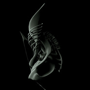
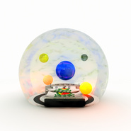
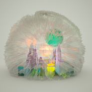
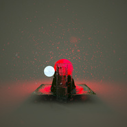
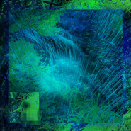
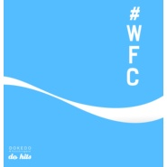
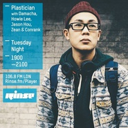

Do Hits
============================

|  |  |
| :--: | :-- |
| [ Do Hits](https://i.xiami.com/dohits) | **播放数**: 5187365 **粉丝数**: 5732 **评论数**: 284 **地区**: China 中国大陆 **风格**: 科技舞曲 Techno, 陷阱舞曲 Trap, 未来车库舞曲 Future Garage  |

## 档案

Do Hits是以本土音乐人为核心的电子音乐组织，于2011年成立。目前出品的内容涉及：现场演出、系列派对、制作人沙龙、在线电台、数字出版，旨在汇集中国电子音乐场景中的生鲜力量，制造真正的“Made in China”之声。 
Soundcloud：  http://soundcloud.com/dohits 
Facebook：  https://www.facebook.com/dohitsofficial 
Bandcamp：  http://dohits.bandcamp.com/

## 专辑

| 名称 | 语种 | 唱片公司 | 发行时间 | 专辑类别 | 专辑风格 |
| :--: | :-- | :-- | :-- | :-- | :-- |
| [ Black Dragon](./albums/2102805366.md) | 纯音乐 | Do Hits | 2017年07月31日 | 录音室专辑 | 电子 Electronic, 实验电子 Experimental Electronic |
| [ Do Hits免费单曲下载系列之八Chuck Upbeat & Jason Hou - Water](./albums/2102756519.md) | 纯音乐 | Do Hits | 2017年05月31日 | EP, 单曲 | 电子 Electronic |
| [ 无家Homeless](./albums/2102742620.md) | 纯音乐 | Do Hits | 2017年05月29日 | 录音室专辑 | 电子 Electronic, 中国风 China-Wave, 实验音乐 Experimental |
| [ 长生炼](./albums/2102732095.md) | 纯音乐 | Do Hits | 2017年04月14日 | EP, 单曲 | 中国风 China-Wave, 电子 Electronic |
| [ Do Hits免费单曲下载系列之七](./albums/2102701528.md) | 国语 | Do Hits | 2017年03月01日 | EP, 单曲 | 恍惚嘻哈舞曲 Wonky, 未来车库舞曲 Future Garage |
| [ Fake Jewelry](./albums/2102688464.md) | 英语 | Muti Music | 2017年02月03日 | EP, 单曲 |  |
| [ Do Hits Year of the RoosterDo Hits鸡年新春合辑](./albums/2102685746.md) | 国语 | Do Hits | 2017年01月27日 | 录音室专辑 | 中国风 China-Wave, 实验电子 Experimental Electronic, 另类舞曲 Alternative Dance |
| [ 生Sheng](./albums/2102675613.md) | 国语 | Do Hits | 2017年01月05日 | 录音室专辑 | 实验音乐 Experimental, 电子 Electronic, 世界融合 World Fusion |
| [ Story](./albums/2102670772.md) | 英语 | Do Hits | 2016年12月23日 | EP, 单曲 | 锐舞音乐 Rave Music |
| [ Do Hits免费单曲下载系列之六Shinamo Moki - Dating Sim](./albums/2102670391.md) | 英语 | Do Hits | 2016年12月21日 | EP, 单曲 |  |
| [ Do Hits免费单曲下载系列之五](./albums/2102663746.md) | 英语 | Do Hits | 2016年12月14日 | EP, 单曲 | 实验电子 Experimental Electronic, 日本 | 邦乐 Japanese Traditional Music |
| [ Do Hits免费单曲下载系列之四](./albums/2102660391.md) | 国语 | Do Hits | 2016年12月07日 | EP, 单曲 | 时代曲 Shidaiqu, 锐舞音乐 Rave Music |
| [ Do Hits免费单曲下载系列之三](./albums/2102657847.md) | 英语 | Do Hits | 2016年11月30日 | EP, 单曲 | 氛围音乐 Ambient |
| [ Do Hits免费单曲下载系列之二](./albums/2102657836.md) | 英语 | Do Hits | 2016年11月23日 | EP, 单曲 | 锐舞音乐 Rave Music, 台湾原住民音乐 Taiwan Aboriginal, 中国风 China-Wave |
| [ Do Hits免费单曲下载系列之一](./albums/2102657835.md) | 英语 | Do Hits | 2016年11月16日 | EP, 单曲 | 锐舞音乐 Rave Music |
| [ 林中之象An Elephant In The Jungle](./albums/2102644456.md) | 国语 | Do Hits | 2016年10月30日 | 录音室专辑 | 酸性浩室舞曲 Acid House, 台湾原住民音乐 Taiwan Aboriginal |
| [ LOVE](./albums/2102402116.md) | 英语 | Darker Than Wax | 2016年09月21日 | EP, 单曲 | 未来车库舞曲 Future Garage |
| [ Exodus](./albums/2100384356.md) | 国语 | Do Hits | 2016年09月05日 | EP, 单曲 | 锐舞音乐 Rave Music, 另类舞曲 Alternative Dance |
| [ 原Origin](./albums/2100371762.md) | 其他 | Do Hits | 2016年07月25日 | EP, 单曲 | 实验电子 Experimental Electronic |
| [ Do Hits Vol.4](./albums/2100340622.md) | 国语 | Do Hits | 2016年06月24日 | 合集, 杂锦 | 另类舞曲 Alternative Dance, 未来车库舞曲 Future Garage, 恍惚嘻哈舞曲 Wonky |
| [ Boiler Room Upfront 067：Do Hits](./albums/2100337776.md) | 国语 | 独立发行 | 2016年05月16日 | EP, 单曲 | 另类舞曲 Alternative Dance |
| [  论五行](./albums/2100315292.md) | 国语 | Do Hits | 2016年04月18日 | EP, 单曲 | 另类舞曲 Alternative Dance, 恍惚嘻哈舞曲 Wonky |
| [ #WFC](./albums/2100278996.md) | 国语 | Do Hits | 2016年04月01日 | EP, 单曲 | 恍惚嘻哈舞曲 Wonky |
| [ Motherland: Nehzuil](./albums/2100292250.md) | 英语 | Do Hits | 2016年03月14日 | EP, 单曲 | 灵魂乐 Soul, 节奏布鲁斯 Rhythm & Blues |
| [ FOREIGN EP](./albums/2100285516.md) | 国语 | LoveloveNYC | 2016年03月01日 | EP, 单曲 | 另类说唱 Alternative Hip Hop |
| [ Do Hits Presents Year of MonkeyDo Hits猴年新春合辑](./albums/2100272152.md) | 国语 | Do Hits | 2016年02月08日 | 合集, 杂锦 | 国语流行 Mandarin Pop, 另类舞曲 Alternative Dance, 中国风 China-Wave |
| [ 这地儿我待不下去了](./albums/2100251532.md) | 国语 | Do Hits | 2016年01月01日 | EP, 单曲 | 未来车库舞曲 Future Garage |
| [ PLASTICIAN PRESENTS THE SOUNDS OF CHINA](./albums/2100243316.md) | 英语 | 独立发行 | 2015年12月01日 | 播客 | 世界节拍 Worldbeat, 未来车库舞曲 Future Garage |
| [ Do Hits Vol.3](./albums/2100236040.md) | 国语 | Do Hits | 2015年11月17日 | 合集, 杂锦 | 另类舞曲 Alternative Dance, 未来车库舞曲 Future Garage |
| [ Do Hits Vol.2](./albums/2100173608.md) | 其他 | Do Hits | 2015年08月07日 | 合集, 杂锦 | 另类舞曲 Alternative Dance, 恍惚嘻哈舞曲 Wonky |
| [ Do Hits Vol.1](./albums/733693270.md) | 其他 | Do Hits | 2015年06月01日 | 合集, 杂锦 | 另类舞曲 Alternative Dance, 青少年流行 Teen Pop, 恍惚嘻哈舞曲 Wonky |

## 评论

|  |  |  |  |
| :-- | :-- | :-- | :-- |
|  [虾米用户](https://emumo.xiami.com/u/427840279) 购买诗集《落日飞奔术》电... 2021-01-01 12:35 赞(0) 踩(0) | 
️
 |
|  [虾米用户](https://emumo.xiami.com/u/55881258) 今日任公子 2020-06-05 14:37 赞(0) 踩(0) | 
啥时候才又出合集
 |
|  [虾米用户](https://emumo.xiami.com/u/403705268) 生日不小心点了进去，我根... 2020-03-30 19:57 赞(0) 踩(0) | 
nb
 |
|  [虾米用户](https://emumo.xiami.com/u/15941448) Live n da wa... 2019-01-17 21:55 赞(0) 踩(0) | 
发发发发新年砖！！！猪年啦！
 |
|  [虾米用户](https://emumo.xiami.com/u/55881258) 今日任公子 2019-01-10 22:25 赞(0) 踩(0) | 
或许我正在 云飘荡
 |
|  [虾米用户](https://emumo.xiami.com/u/7738848) /ᴄᴀᴛᴄʜ ᴍᴇ ɪғ... 2018-12-16 14:22 赞(0) 踩(0) | 
16.12.2018翻完了
 |
|  [虾米用户](https://emumo.xiami.com/u/325374787)  2018-10-02 14:20 赞(0) 踩(0) | 
66666666
 |
|  [虾米用户](https://emumo.xiami.com/u/42936819) 网易云搜索恶法lex i... 2018-08-07 14:39 赞(0) 踩(0) | 

 |
|  [虾米用户](https://emumo.xiami.com/u/357674040)  2018-05-02 08:45 赞(0) 踩(0) | 
 
 |
|  [虾米用户](https://emumo.xiami.com/u/52415194) ♬♩♫♪♡ 2018-04-23 15:22 赞(0) 踩(0) | 
｜
 |
|  [虾米用户](https://emumo.xiami.com/u/2805757)  好巧啊 前辈 2018-04-15 20:21 赞(0) 踩(0) | 
耶
 |
|  [虾米用户](https://emumo.xiami.com/u/3536302) 网易云同名 2018-03-24 21:17 赞(0) 踩(0) | 
今年？
 |
|  [虾米用户](https://emumo.xiami.com/u/312894132)  2018-03-07 01:04 赞(0) 踩(0) | 
啊啊啊今年的新年特辑呢（╯‵□&amp;prime;）╯︵┴─┴
 |
|  [虾米用户](https://emumo.xiami.com/u/20177386) 感谢一切美好的遇见❤️ 2018-03-06 18:32 赞(0) 踩(0) | 

 |
|  [虾米用户](https://emumo.xiami.com/u/15941448) Live n da wa... 2018-02-15 20:57 赞(3) 踩(0) | 
在等待新年特辑。。。
 |
|  [虾米用户](https://emumo.xiami.com/u/49897271)   2018-02-15 12:57 赞(3) 踩(0) | 
今年怎么还没出新年特辑
 |
|  [虾米用户](https://emumo.xiami.com/u/1239175)  2018-02-03 08:56 赞(2) 踩(0) | 
今年的春节特辑可以期待一下？
 |
|  [虾米用户](https://emumo.xiami.com/u/43418234) ^_−☆ 2017-10-28 00:36 赞(0) 踩(0) | 
留个微信吧
 |
|  [虾米用户](https://emumo.xiami.com/u/233046513)  2017-10-23 12:35 赞(0) 踩(0) | 
留言板
 |
|  [虾米用户](https://emumo.xiami.com/u/19471540) 难眠之欲 hūxi 2017-08-25 18:35 赞(0) 踩(0) | 
ALL-ALL-ALL
 |
|  [虾米用户](https://emumo.xiami.com/u/14265718) wx:osakarock... 2017-08-25 13:33 赞(0) 踩(0) | 

 |
|  [虾米用户](https://emumo.xiami.com/u/45298985) Wechat:dqx19... 2017-06-04 23:27 赞(0) 踩(0) | 
+
 |
|  [虾米用户](https://emumo.xiami.com/u/1115247) @Nebula_7293 2017-05-30 22:02 赞(0) 踩(0) | 
/
 |
|  [虾米用户](https://emumo.xiami.com/u/264283064) bye  2017-05-30 17:49 赞(0) 踩(0) | 
△
 |
|  [虾米用户](https://emumo.xiami.com/u/1239175)  2017-05-28 14:20 赞(0) 踩(0) | 
是不是可以出一个remix合辑了，想听ZHI16的只要你一摸我就大叫remix
 |
|  [虾米用户](https://emumo.xiami.com/u/16105107) 粗鄙真切美好风尘仆仆 2017-05-23 00:52 赞(0) 踩(0) | 
不错。
 |
|  [虾米用户](https://emumo.xiami.com/u/3607930) 一条红色的鱼，一只黑色的... 2017-05-16 07:32 赞(0) 踩(0) | 
5/19
 |
|  [虾米用户](https://emumo.xiami.com/u/617715) 荷尔蒙奴隶 2017-04-28 18:35 赞(0) 踩(0) | 
太凶了，这太上老君的路子啊这。
 |
|  [虾米用户](https://emumo.xiami.com/u/85148548)  2017-04-26 22:09 赞(0) 踩(0) | 
评论翻完了 打个卡吧 滴
 |
|  [虾米用户](https://emumo.xiami.com/u/85148548)  2017-04-26 22:08 赞(0) 踩(0) | 
厉害
 |
|  [虾米用户](https://emumo.xiami.com/u/33552517) 偏好、 2017-04-26 10:20 赞(0) 踩(0) | 

 |
|  [虾米用户](https://emumo.xiami.com/u/36421702) 旧的账号找不到，这个要好... 2017-04-16 10:42 赞(0) 踩(0) | 
已被引导去留言板 
 |
|  [虾米用户](https://emumo.xiami.com/u/54952494) 进步青年社区成员/产品经... 2017-03-31 19:58 赞(1) 踩(0) | 
Do Hits渡鹤瓷
 |
|  [虾米用户](https://emumo.xiami.com/u/213501)   2017-03-17 22:18 赞(0) 踩(0) | 
何时来杭州玩耍   
 |
|  [虾米用户](https://emumo.xiami.com/u/45052758) 我还没想好要写什么... 2017-03-16 13:32 赞(0) 踩(0) | 
[带墨镜笑]
 |
|  [虾米用户](https://emumo.xiami.com/u/23602290) 我还没想好要写什么... 2017-03-12 11:10 赞(0) 踩(0) | 
我靠 感觉找到了自己的世界
 |
|  [虾米用户](https://emumo.xiami.com/u/19250209) 01:30 2017-02-16 18:26 赞(0) 踩(0) | 
拽！希望合作。
 |
|  [虾米用户](https://emumo.xiami.com/u/213021) 愿无岁月可回头。 2017-02-15 23:46 赞(2) 踩(0) | 
看到了七年以前自己的留言了，青春的感觉．
 |
|  [虾米用户](https://emumo.xiami.com/u/18236235) 我还没想好要写什么... 2017-02-10 16:13 赞(0) 踩(0) | 
服气
 |
|  [虾米用户](https://emumo.xiami.com/u/1878732)  2017-02-10 01:30 赞(0) 踩(0) | 
这是电子？？能不能不要丢中国电子的脸
 |
|  [虾米用户](https://emumo.xiami.com/u/3045796)  2017-02-07 12:50 赞(1) 踩(0) | 
我来踩踩了
 |
|  [虾米用户](https://emumo.xiami.com/u/68095692) 遠離憂愁  :) 2017-02-06 23:46 赞(1) 踩(0) | 
稳
 |
|  [虾米用户](https://emumo.xiami.com/u/9770055)  2017-02-05 16:44 赞(0) 踩(0) | 
789
 |
|  [虾米用户](https://emumo.xiami.com/u/202762133) 伊甸园 2017-01-31 12:42 赞(2) 踩(0) | 
把评论翻完了:)
 |
|  [虾米用户](https://emumo.xiami.com/u/23443417) shit 2017-01-27 16:16 赞(2) 踩(0) | 
来错地方了我要听的是Do shit
 |
|  [虾米用户](https://emumo.xiami.com/u/8943891) 你咋那么可爱？ 2017-01-27 13:30 赞(0) 踩(0) | 
丨
 |
|  [虾米用户](https://emumo.xiami.com/u/8854264) Hypocrite. 2017-01-26 11:49 赞(3) 踩(0) | 
早前关注的电子音乐人感觉现在都加入了dohits...
 |
|  [虾米用户](https://emumo.xiami.com/u/193268738)  2017-01-23 00:08 赞(1) 踩(0) | 
我不是来听歌的，我是来找几年前的qq空间回忆
 |
|  [虾米用户](https://emumo.xiami.com/u/5178970)   2016-12-29 05:42 赞(0) 踩(0) | 
比心！
 |
|  [虾米用户](https://emumo.xiami.com/u/12230374) Pinkfloydzh，... 2016-12-21 18:06 赞(2) 踩(0) | 
Do hits在做一件惯坏乐迷的事儿
 |
|  [虾米用户](https://emumo.xiami.com/u/96051730) ᴍᴇᴏᴡ 2016-12-21 16:35 赞(0) 踩(0) | 
就因为热评翻到最下面去看了半天.......
 |
|  [虾米用户](https://emumo.xiami.com/u/3876773)   2016-11-19 22:24 赞(0) 踩(0) | 
在上海哪儿呢！
 |
| ⇒ |  [虾米用户](https://emumo.xiami.com/u/59938182) 因果皆有报 2016-12-01 15:28 赞(0) 踩(0) | 
一起呗
 |
|  [虾米用户](https://emumo.xiami.com/u/43418234) ^_−☆ 2016-11-18 09:19 赞(0) 踩(0) | 

 |
|  [虾米用户](https://emumo.xiami.com/u/4208300) 微博/网易云：小田切尼  2016-10-28 11:09 赞(0) 踩(0) | 
不跑堂
 |
|  [虾米用户](https://emumo.xiami.com/u/12930904) 月亮与六便士 2016-10-09 13:54 赞(0) 踩(0) | 
好爱你们噜噜噜噜叽叽叽叽
 |
|  [虾米用户](https://emumo.xiami.com/u/37765623)   2016-10-06 15:09 赞(0) 踩(0) | 
最爱
 |
|  [虾米用户](https://emumo.xiami.com/u/57267620)  2016-10-04 21:37 赞(0) 踩(0) | 
@do hits可以用你的电子音乐当伴奏出歌不   
 |
|  [虾米用户](https://emumo.xiami.com/u/46758368)   2016-10-02 10:53 赞(0) 踩(0) | 
翻了一遍评论
 |
|  [虾米用户](https://emumo.xiami.com/u/50872633) 我还没想好要写什么... 2016-10-01 15:28 赞(0) 踩(0) | 
我真的才发现没关注你
 |
|  [虾米用户](https://emumo.xiami.com/u/2028036) 学习占卜中 2016-09-30 13:50 赞(0) 踩(0) | 
怎么参加呢？
 |
|  [虾米用户](https://emumo.xiami.com/u/95500084) 或许你从来没有听说过我。 2016-09-21 19:08 赞(0) 踩(0) | 
here
 |
|  [虾米用户](https://emumo.xiami.com/u/43982464) 哒优 2016-09-19 14:58 赞(0) 踩(0) | 
留名
 |
|  [虾米用户](https://emumo.xiami.com/u/51987187) 路人。 2016-09-18 17:19 赞(0) 踩(0) | 
你们看评论
 |
|  [虾米用户](https://emumo.xiami.com/u/81892064) 这货一定是那妖猴所变 2016-09-16 12:17 赞(0) 踩(0) | 
猴快回来啊
 |
|  [虾米用户](https://emumo.xiami.com/u/42758226) 我还没想好要写什么... 2016-09-09 20:43 赞(0) 踩(0) | 
你们今天听得怎么样
 |
|  [虾米用户](https://emumo.xiami.com/u/99168462) 再见虾米 2016-08-24 05:12 赞(0) 踩(0) | 
❤️
 |
|  [虾米用户](https://emumo.xiami.com/u/48888270) 中文饶舌像史诗一样浪漫；... 2016-08-20 18:20 赞(0) 踩(0) | 
哈哈哈 跑堂狗 踩踩 omg 太可愛了妳們
 |
|  [虾米用户](https://emumo.xiami.com/u/43547593) ♡ 2016-08-18 23:22 赞(0) 踩(0) | 
⅋
 |
|  [虾米用户](https://emumo.xiami.com/u/7951384) 我还没想好要写什么... 2016-08-15 14:49 赞(0) 踩(0) | 

 |
|  [虾米用户](https://emumo.xiami.com/u/6760284) 石头 2016-08-14 21:21 赞(0) 踩(0) | 
So fucking nice
 |
|  [虾米用户](https://emumo.xiami.com/u/44937009)  2016-08-09 15:30 赞(0) 踩(0) | 
从头到尾都带有
 |
|  [虾米用户](https://emumo.xiami.com/u/4781964) http://data4 2016-08-06 22:28 赞(0) 踩(0) | 
第一次给音乐人留言，第一次听《祭》好不怀疑以为日本人做的音乐，点开是国人，很感动。声音这么精致 想象力 国际一线电声实力！风格很大片！
 |
|  [虾米用户](https://emumo.xiami.com/u/12076161) 兼容古典和嘻哈 2016-08-01 19:27 赞(0) 踩(0) | 
炒鸡赞
 |
|  [虾米用户](https://emumo.xiami.com/u/6065668) 品品 2016-07-31 15:53 赞(0) 踩(0) | 
不要跑堂了噜 
 |
|  [虾米用户](https://emumo.xiami.com/u/71392770)   2016-07-31 12:44 赞(0) 踩(0) | 
要耍！！
 |
|  [虾米用户](https://emumo.xiami.com/u/39614890) 无常逐一升起和熄灭 2016-07-25 13:48 赞(0) 踩(0) | 
？？哈哈
 |
|  [虾米用户](https://emumo.xiami.com/u/52136289) 我还没想好要写什么... 2016-07-04 00:48 赞(0) 踩(0) | 
[文字cool]
 |
|  [虾米用户](https://emumo.xiami.com/u/13215669) 我还没想好要写什么... 2016-06-01 15:07 赞(0) 踩(0) | 
❤️
 |
|  [虾米用户](https://emumo.xiami.com/u/21154362) 我还没想好要写什么... 2016-05-30 18:24 赞(0) 踩(0) | 
我爱ZHI16
 |
|  [虾米用户](https://emumo.xiami.com/u/2493237) Star never l... 2016-05-24 08:57 赞(0) 踩(0) | 

 |
|  [虾米用户](https://emumo.xiami.com/u/24382002) 唯有音乐与爱不可辜负 2016-05-22 03:58 赞(0) 踩(0) | 
死在这
 |
|  [虾米用户](https://emumo.xiami.com/u/859316)  2016-05-09 11:35 赞(0) 踩(0) | 
好牛逼样子
 |
|  [虾米用户](https://emumo.xiami.com/u/2158006)  2016-05-07 19:28 赞(0) 踩(0) | 

 |
|  [虾米用户](https://emumo.xiami.com/u/318938) 白日梦想家 2016-05-05 20:37 赞(0) 踩(0) | 
很少评论 这次不得不说 Awesome!
 |
|  [虾米用户](https://emumo.xiami.com/u/36582587) weibo：llll44... 2016-05-03 22:29 赞(0) 踩(0) | 
❤️
 |
|  [虾米用户](https://emumo.xiami.com/u/4251969)   2016-04-26 12:01 赞(0) 踩(0) | 
这么牛逼的歌现在才听到！！
 |
|  [虾米用户](https://emumo.xiami.com/u/6513787) 林局长的女儿黛玉 2016-04-24 17:25 赞(0) 踩(0) | 
忘记踩一踩了，还是留个脚印。请翻我的牌。
 |
|  [虾米用户](https://emumo.xiami.com/u/11960217) 少年心气疾 2016-04-22 15:05 赞(1) 踩(0) | 
哈哈哈哈哈哈哈说得我去翻了后面的评论，年代感！！！！！
 |
|  [虾米用户](https://emumo.xiami.com/u/14920595)  2016-04-21 11:16 赞(0) 踩(0) | 
酷哦
 |
|  [虾米用户](https://emumo.xiami.com/u/314018)  2016-04-19 01:53 赞(0) 踩(0) | 
大成狗.
 |
|  [虾米用户](https://emumo.xiami.com/u/3583995) 一個人的戰爭 2016-04-18 22:56 赞(0) 踩(0) | 

 |
|  [虾米用户](https://emumo.xiami.com/u/46200482) 暂无签名~ 2016-04-18 17:58 赞(0) 踩(0) | 
342
 |
|  [虾米用户](https://emumo.xiami.com/u/49141193) loading… 2016-04-16 22:13 赞(0) 踩(0) | 
牛逼了
 |
|  [虾米用户](https://emumo.xiami.com/u/13324427)   2016-04-12 11:42 赞(0) 踩(0) | 
还以为哪个国外大神。。。。。国人！！！！！
 |
|  [虾米用户](https://emumo.xiami.com/u/16174537)  2016-04-10 02:27 赞(0) 踩(0) | 
今晚杭州被howie炸了
 |
|  [虾米用户](https://emumo.xiami.com/u/6654069) mutherfacker... 2016-04-09 04:25 赞(0) 踩(0) | 
～
 |
|  [虾米用户](https://emumo.xiami.com/u/35207884) 杂食 2016-04-07 02:12 赞(0) 踩(0) | 

 |
|  [虾米用户](https://emumo.xiami.com/u/3126743) ONLY. 2016-04-03 14:16 赞(18) 踩(0) | 
好想帮这哥们设计下封面
 |
| ⇒ |  [虾米用户](https://emumo.xiami.com/u/339862) 我还没想好要写什么... 2016-10-26 01:43 赞(0) 踩(0) | 
我也想，不过说不定这就是作者想要的。
 |
| ⇒ |  [虾米用户](https://emumo.xiami.com/u/204856414) 愿时光匆匆流去、我只在乎... 2017-01-28 08:44 赞(0) 踩(0) | 
哈哈强迫症犯了
 |
|  [虾米用户](https://emumo.xiami.com/u/6965583) 人體穿刺師° 2016-03-31 19:04 赞(0) 踩(0) | 
好 聽 的 啊  
 |
| ⇒ |  [虾米用户](https://emumo.xiami.com/u/119226506)   2016-04-01 14:03 赞(0) 踩(0) | 
哈哈。麻宝无处不在
 |
| ⇒ |  [虾米用户](https://emumo.xiami.com/u/6965583) 人體穿刺師° 2016-04-01 20:12 赞(0) 踩(0) | 
<q><b>崴来崴克说：</b></q>
 |
|  [虾米用户](https://emumo.xiami.com/u/49797324)   2016-03-28 20:31 赞(0) 踩(0) | 

 |
|  [虾米用户](https://emumo.xiami.com/u/14845416) 鹿角轻轻一撇就斷了… 2016-03-24 17:19 赞(0) 踩(0) | 
我在贵阳等你~~么么哒~
 |
|  [虾米用户](https://emumo.xiami.com/u/6558316) 冷眼旁观同样有罪 2016-03-24 00:12 赞(1) 踩(0) | 
说最早评论qq空间留言板即视感的 是瞧不起qq空间吗 我拉过去把评论版聊看完了
 |
|  [虾米用户](https://emumo.xiami.com/u/117965206)   2016-03-22 00:17 赞(0) 踩(0) | 

 |
|  [虾米用户](https://emumo.xiami.com/u/39788841)  . 2016-03-14 13:05 赞(0) 踩(0) | 
*
 |
|  [虾米用户](https://emumo.xiami.com/u/52506830) 再见 2016-03-11 19:42 赞(0) 踩(0) | 
额 呵呵 嘻嘻 妹妹想你了~ 88
 |
|  [虾米用户](https://emumo.xiami.com/u/13783494) Saltimage 2016-03-08 11:58 赞(0) 踩(0) | 
哇哦，，要巡演叻，，，
 |
|  [虾米用户](https://emumo.xiami.com/u/53539296) よろしくね＾＾ 2016-03-08 10:43 赞(1) 踩(0) | 
大写的不开心大写
 |
|  [虾米用户](https://emumo.xiami.com/u/53539296) よろしくね＾＾ 2016-03-08 10:43 赞(0) 踩(0) | 
居然不来武汉 真的炒鸡不开心
 |
|  [虾米用户](https://emumo.xiami.com/u/34376040) 再见 虾米！ 2016-03-06 13:20 赞(0) 踩(0) | 

 |
|  [虾米用户](https://emumo.xiami.com/u/6435422) 我还没想好要写什么... 2016-03-05 23:12 赞(0) 踩(0) | 
。
 |
|  [虾米用户](https://emumo.xiami.com/u/48211350) 已弃虾米，勿扰 2016-03-05 22:25 赞(0) 踩(0) | 
牛逼
 |
|  [虾米用户](https://emumo.xiami.com/u/52039336) 過氣少先隊員 2016-03-05 02:15 赞(0) 踩(0) | 
☁
 |
|  [虾米用户](https://emumo.xiami.com/u/5127755) 感谢这9年的陪伴，有音乐... 2016-03-04 17:03 赞(0) 踩(0) | 
๛ก(ｰ̀ωｰ́ก)
 |
|  [虾米用户](https://emumo.xiami.com/u/18169133) 停用个人功能.仅上传音乐... 2016-03-03 13:12 赞(0) 踩(0) | 
！
 |
|  [虾米用户](https://emumo.xiami.com/u/40936135)  2016-03-01 14:08 赞(0) 踩(0) | 
孩儿们 叫俺齐天大圣！
 |
|  [虾米用户](https://emumo.xiami.com/u/4063805) 我还没想好要写什么... 2016-02-27 11:39 赞(0) 踩(0) | 
sheng 惊艳了 牛逼 加油
 |
|  [虾米用户](https://emumo.xiami.com/u/12758607) @un_ink_orn 2016-02-25 21:17 赞(0) 踩(0) | 
这就是我想听到的，真的实用百搭
 |
|  [虾米用户](https://emumo.xiami.com/u/1105337) 我还没想好要写什么... 2016-02-25 10:48 赞(0) 踩(0) | 
加油 希望以后红遍全球 中国电子名片
 |
|  [虾米用户](https://emumo.xiami.com/u/11491964)   2016-02-23 11:21 赞(0) 踩(0) | 
.
 |
|  [虾米用户](https://emumo.xiami.com/u/2556532) 、 2016-02-21 08:18 赞(0) 踩(0) | 
可以
 |
|  [虾米用户](https://emumo.xiami.com/u/25960842)   2016-02-21 04:59 赞(0) 踩(0) | 
do shit 哇哈哈哈哈 
 |
|  [虾米用户](https://emumo.xiami.com/u/40156349)  2016-02-19 22:14 赞(0) 踩(0) | 
睁眼了
 |
|  [虾米用户](https://emumo.xiami.com/u/49001447)   2016-02-16 23:23 赞(0) 踩(0) | 
好的好的
 |
|  [虾米用户](https://emumo.xiami.com/u/42796332) H e l l o ! ... 2016-02-09 22:20 赞(0) 踩(0) | 
beautiful things
 |
|  [虾米用户](https://emumo.xiami.com/u/669738) 是我啊 2016-02-09 15:56 赞(0) 踩(0) | 
音乐人全是北京的我估计
 |
|  [虾米用户](https://emumo.xiami.com/u/9513422) 虾米歌单迁徙到网易☁️:... 2016-02-09 11:08 赞(0) 踩(0) | 
❤️
 |
|  [虾米用户](https://emumo.xiami.com/u/11087484) °•!•°¡°•. 2016-02-08 21:58 赞(0) 踩(0) | 
〰
 |
|  [虾米用户](https://emumo.xiami.com/u/45298985) Wechat:dqx19... 2016-02-08 10:56 赞(0) 踩(0) | 
+
 |
|  [虾米用户](https://emumo.xiami.com/u/11756945) 我还没想好要写什么... 2016-02-08 01:53 赞(0) 踩(0) | 
！！
 |
|  [虾米用户](https://emumo.xiami.com/u/2556225)  2016-02-06 12:51 赞(0) 踩(0) | 
©️
 |
|  [虾米用户](https://emumo.xiami.com/u/1696939)  2016-02-05 08:10 赞(0) 踩(0) | 
Made in China
 |
|  [虾米用户](https://emumo.xiami.com/u/3552342) 孤独一人 照顾星辰 2016-01-31 13:48 赞(0) 踩(0) | 
眼保健操牛逼！
 |
|  [虾米用户](https://emumo.xiami.com/u/10944859) ‏‏‏‏‏‏‏‏ 2016-01-23 00:58 赞(0) 踩(0) | 

 |
|  [虾米用户](https://emumo.xiami.com/u/17963410) 没错我就是聋五本人 2016-01-22 13:37 赞(0) 踩(0) | 
说点什么呢？你就点开听吧
 |
|  [虾米用户](https://emumo.xiami.com/u/50760062)   2016-01-12 12:48 赞(0) 踩(0) | 
excuse me?最前排的评论是些什么鬼 
 |
|  [虾米用户](https://emumo.xiami.com/u/17511727)   2016-01-04 01:01 赞(0) 踩(0) | 
诶 666 中国希望
 |
|  [虾米用户](https://emumo.xiami.com/u/21154362) 我还没想好要写什么... 2016-01-02 12:52 赞(0) 踩(0) | 
我来惹
 |
|  [虾米用户](https://emumo.xiami.com/u/48515589) 我还没想好要写什么... 2016-01-01 14:58 赞(0) 踩(0) | 
。
 |
|  [虾米用户](https://emumo.xiami.com/u/7602582) 电子/神游/浩室/迷幻/... 2015-12-31 09:13 赞(0) 踩(0) | 
你好
 |
|  [虾米用户](https://emumo.xiami.com/u/11142387) 奔向未来的日子 2015-12-24 00:06 赞(0) 踩(0) | 
这个6了
 |
|  [虾米用户](https://emumo.xiami.com/u/9931551) 感谢相遇 2015-12-22 12:01 赞(0) 踩(0) | 
厉害厉害！  
 |
|  [虾米用户](https://emumo.xiami.com/u/3471274) Skyler 2015-12-09 16:18 赞(0) 踩(0) | 
好厉害啊，真的好厉害。好久没听到厉害的了
 |
|  [虾米用户](https://emumo.xiami.com/u/46219572)  2015-12-07 08:54 赞(0) 踩(0) | 
33
 |
|  [虾米用户](https://emumo.xiami.com/u/47736446) 上传了最后一首 2015-12-04 16:19 赞(2) 踩(0) | 
oh yeah~~~~~~~~~~~~~~~~
 |
| ⇒ |  [虾米用户](https://emumo.xiami.com/u/95500084) 或许你从来没有听说过我。 2016-09-21 19:09 赞(0) 踩(0) | 
捉到喽
 |
|  [虾米用户](https://emumo.xiami.com/u/1485170) Gene_hy 2015-11-30 11:15 赞(1) 踩(0) | 
为什么不做实体专辑啊，叫我等收集党很难受啊
 |
|  [虾米用户](https://emumo.xiami.com/u/2749918)  2015-11-29 21:36 赞(0) 踩(0) | 
节奏
 |
|  [虾米用户](https://emumo.xiami.com/u/32415547) 这里是签名。 2015-11-27 10:52 赞(0) 踩(0) | 
66666
 |
|  [虾米用户](https://emumo.xiami.com/u/14845416) 鹿角轻轻一撇就斷了… 2015-11-24 17:40 赞(0) 踩(0) | 
都好厉害~
 |
|  [虾米用户](https://emumo.xiami.com/u/49284488) 我还没想好要写什么... 2015-11-23 20:56 赞(0) 踩(0) | 
轮刮上眼眶
 |
|  [虾米用户](https://emumo.xiami.com/u/44858319) 永远是我最爱的虾米 2015-11-23 10:53 赞(1) 踩(0) | 
///
 |
|  [虾米用户](https://emumo.xiami.com/u/37160224) 男孩 2015-11-22 23:53 赞(1) 踩(0) | 
如果感到幸福你就啪啪啪
 |
|  [虾米用户](https://emumo.xiami.com/u/15275403) you can find... 2015-11-21 13:13 赞(70) 踩(0) | 
最底的评论聊出了一种qq空间留言板的感觉……
 |
| ⇒ |  [虾米用户](https://emumo.xiami.com/u/12230374) Pinkfloydzh，... 2016-07-20 09:27 赞(0) 踩(0) | 
踩踩，记得回踩哦
 |
| ⇒ |  [虾米用户](https://emumo.xiami.com/u/73348056) 热情与冷静 2016-11-08 10:44 赞(0) 踩(0) | 
我一定要翻到最底感受一下
 |
|  [虾米用户](https://emumo.xiami.com/u/552826) 幽微灵秀地，无可奈何天。 2015-11-19 13:44 赞(0) 踩(0) | 
看书看得瞌睡来了，听听又能继续看书了。
 |
|  [虾米用户](https://emumo.xiami.com/u/15941448) Live n da wa... 2015-11-18 12:31 赞(0) 踩(0) | 
kool
 |
|  [虾米用户](https://emumo.xiami.com/u/447460)  2015-11-16 16:46 赞(0) 踩(0) | 
好有趣的曲风~
 |
|  [虾米用户](https://emumo.xiami.com/u/44784434) 变得和我一样库 2015-11-14 13:21 赞(0) 踩(0) | 
Yo
 |
|  [虾米用户](https://emumo.xiami.com/u/43055800) 根号C就是NE！ 2015-11-12 12:51 赞(0) 踩(0) | 
哇哦！
 |
|  [虾米用户](https://emumo.xiami.com/u/46138802) 敢把皇帝拉下马 2015-11-11 01:14 赞(0) 踩(0) | 
别停宝贝
 |
|  [虾米用户](https://emumo.xiami.com/u/9026935) 路，还是那条路，只是每天... 2015-10-16 21:31 赞(1) 踩(0) | 
我喜欢腿粗
 |
|  [虾米用户](https://emumo.xiami.com/u/20727289) 我还没想好要写什么... 2015-10-02 23:06 赞(0) 踩(0) | 
骚完了
 |
|  [虾米用户](https://emumo.xiami.com/u/1755007)   2015-09-24 14:58 赞(1) 踩(0) | 
特意去bandcamp买了一首Dragon&amp;#039;s Tail，最近在Podcast里听到的，很不错。
 |
|  [虾米用户](https://emumo.xiami.com/u/7361282)   2015-09-24 00:59 赞(0) 踩(0) | 
我居然在虾米翻评论看…正好挨成都上学，周六凑个热闹去
 |
|  [虾米用户](https://emumo.xiami.com/u/1987681) An elephant ... 2015-09-22 13:40 赞(0) 踩(0) | 
.
 |
|  [虾米用户](https://emumo.xiami.com/u/19528551) 给 2015-09-16 13:58 赞(1) 踩(0) | 
华trap？
 |
|  [虾米用户](https://emumo.xiami.com/u/6979810) 无常非常 却是平常 2015-09-06 18:41 赞(1) 踩(0) | 
大宝你照片的腿好粗啊
 |
|  [虾米用户](https://emumo.xiami.com/u/5148458) 骨子里还是庸俗 2015-08-30 01:19 赞(0) 踩(0) | 
能来深圳么...
 |
|  [虾米用户](https://emumo.xiami.com/u/49522968)   2015-08-28 13:58 赞(0) 踩(0) | 
还是开夏利吧
 |
|  [虾米用户](https://emumo.xiami.com/u/33213584) 伪电音，真性情 2015-08-27 19:19 赞(1) 踩(0) | 
国内迷幻电子发展中
 |
|  [虾米用户](https://emumo.xiami.com/u/49689813) DJ/Live/时装秀/... 2015-08-26 14:34 赞(0) 踩(0) | 
牛逼
 |
|  [虾米用户](https://emumo.xiami.com/u/47319974) To make love... 2015-08-23 09:22 赞(0) 踩(0) | 

 |
|  [虾米用户](https://emumo.xiami.com/u/39736647) we are headi... 2015-08-21 23:05 赞(0) 踩(0) | 
萌
 |
|  [虾米用户](https://emumo.xiami.com/u/39028411)   2015-08-11 01:09 赞(1) 踩(0) | 
好亮！
 |
|  [虾米用户](https://emumo.xiami.com/u/46200482) 暂无签名~ 2015-08-09 21:22 赞(0) 踩(0) | 
飞走了
 |
|  [虾米用户](https://emumo.xiami.com/u/54051742)  2015-08-09 19:49 赞(1) 踩(0) | 
有趣
 |
|  [虾米用户](https://emumo.xiami.com/u/38640339) 我想好写什么了…… 2015-08-09 09:05 赞(0) 踩(0) | 
可爱
 |
|  [虾米用户](https://emumo.xiami.com/u/30054825) 想听新歌 去网易云找我吧 2015-08-09 03:30 赞(1) 踩(0) | 
你是女孩吗？
 |
|  [虾米用户](https://emumo.xiami.com/u/7513070)  2015-08-08 18:51 赞(0) 踩(0) | 
chic 又接地气
 |
|  [虾米用户](https://emumo.xiami.com/u/46287668)  2015-08-08 13:08 赞(0) 踩(0) | 
我勒个去
 |
|  [虾米用户](https://emumo.xiami.com/u/8943891) 你咋那么可爱？ 2015-08-07 06:54 赞(0) 踩(0) | 

 |
|  [虾米用户](https://emumo.xiami.com/u/36342380) 我还没想好要写什么... 2015-08-03 10:26 赞(0) 踩(0) | 
持续关注 嘿嘿
 |
|  [虾米用户](https://emumo.xiami.com/u/16070084)   2015-08-02 17:50 赞(0) 踩(0) | 

 |
|  [虾米用户](https://emumo.xiami.com/u/39788841)  . 2015-08-02 12:19 赞(0) 踩(0) | 
Lium
 |
|  [虾米用户](https://emumo.xiami.com/u/49934446) SINA WEIBO:@... 2015-07-29 22:50 赞(0) 踩(0) | 
…
 |
|  [虾米用户](https://emumo.xiami.com/u/37087360) thecutestcut... 2015-07-29 19:11 赞(1) 踩(0) | 
好听
 |
|  [虾米用户](https://emumo.xiami.com/u/19812281) 扰乱 就是 扰乱 2015-07-29 17:23 赞(1) 踩(0) | 
等第二弹
 |
|  [虾米用户](https://emumo.xiami.com/u/11893543) と·む 2015-07-29 16:12 赞(0) 踩(0) | 
Yo
 |
|  [虾米用户](https://emumo.xiami.com/u/1331957) 我还没想好要写什么... 2015-07-27 12:18 赞(0) 踩(0) | 

 |
|  [虾米用户](https://emumo.xiami.com/u/44670528)  2015-06-30 02:21 赞(1) 踩(0) | 
很另类的迷幻电子，国产的吗？值得一赞
 |
|  [虾米用户](https://emumo.xiami.com/u/18412060) v15175288880 2015-06-27 16:49 赞(1) 踩(0) | 
nice
 |
|  [虾米用户](https://emumo.xiami.com/u/9080508) 可知道 你的光 耀了我 2015-06-26 00:25 赞(0) 踩(0) | 
/.♥
 |
|  [虾米用户](https://emumo.xiami.com/u/3359164)   2015-06-19 23:43 赞(0) 踩(0) | 
根本离不开电子～
 |
|  [虾米用户](https://emumo.xiami.com/u/7829793) Whisper_chac... 2015-06-19 22:49 赞(0) 踩(0) | 
回归虾米了！！吗！！
 |
|  [虾米用户](https://emumo.xiami.com/u/3475541)  2015-06-12 12:45 赞(0) 踩(0) | 
很有个性··
 |
|  [虾米用户](https://emumo.xiami.com/u/11438217) 我还没想好要写什么... 2015-06-11 15:59 赞(0) 踩(0) | 
有点意思
 |
|  [虾米用户](https://emumo.xiami.com/u/2526606)  2015-06-11 09:53 赞(0) 踩(0) | 
~~
 |
|  [虾米用户](https://emumo.xiami.com/u/32405529) 我还没想好要写什么... 2015-06-09 23:18 赞(0) 踩(0) | 
支持
 |
|  [虾米用户](https://emumo.xiami.com/u/48274031) 慎獨 2015-06-09 12:52 赞(0) 踩(0) | 
有趣
 |
|  [虾米用户](https://emumo.xiami.com/u/1473318)  2015-06-09 11:03 赞(0) 踩(0) | 

 |
|  [虾米用户](https://emumo.xiami.com/u/3815293) baby Jesus s... 2015-06-09 01:49 赞(0) 踩(0) | 
几年前的评论好高能，，，，大腐女什么的   
 |
|  [虾米用户](https://emumo.xiami.com/u/15286935) XxX 2015-06-08 18:56 赞(0) 踩(0) | 
~
 |
|  [虾米用户](https://emumo.xiami.com/u/7513) 我永远都是一头猪！ 2015-06-08 18:32 赞(0) 踩(0) | 
支持
 |
|  [虾米用户](https://emumo.xiami.com/u/39764314) 我还没想好要写什么... 2015-06-08 17:06 赞(0) 踩(0) | 
好听诶！！！脑循环中
 |
|  [虾米用户](https://emumo.xiami.com/u/327730) 北京厂牌/派对组织 2015-04-16 06:13 赞(3) 踩(0) | 
我刚入驻了虾米音乐人，欢迎大家来我的个人主页，收听我的最新音乐
 |
| ⇒ |  [虾米用户](https://emumo.xiami.com/u/34645862) 寻找一生最喜欢的音乐 2016-01-09 16:58 赞(0) 踩(0) | 
真的很棒，国内具有中国特色的电子不多，你们非常优秀！
 |
|  [虾米用户](https://emumo.xiami.com/u/6979810) 无常非常 却是平常 2014-11-02 15:19 赞(0) 踩(0) | 
这都能找到你
 |
|  [虾米用户](https://emumo.xiami.com/u/11267329) 只有河流有這樣的力量。 2014-05-11 11:29 赞(0) 踩(0) | 
邓荷花？
 |
| ⇒ |  [虾米用户](https://emumo.xiami.com/u/11267329) 只有河流有這樣的力量。 2014-05-14 18:40 赞(0) 踩(0) | 
<q><b>说：</b></q>
 |
| ⇒ |  [虾米用户](https://emumo.xiami.com/u/11267329) 只有河流有這樣的力量。 2014-05-14 22:45 赞(0) 踩(0) | 
<q><b>说：</b></q>
 |
| ⇒ |  [虾米用户](https://emumo.xiami.com/u/11267329) 只有河流有這樣的力量。 2014-05-14 22:45 赞(0) 踩(0) | 
<q><b>说：</b></q>
 |
|  [虾米用户](https://emumo.xiami.com/u/6368125) 当年绰号：老S 2014-03-12 14:25 赞(0) 踩(0) | 
女屌丝
 |
|  [虾米用户](https://emumo.xiami.com/u/4849852)   2013-12-26 22:05 赞(0) 踩(0) | 
实在不好意思 最近才关注起你 厉害的小伙伴
 |
| ⇒ |  [虾米用户](https://emumo.xiami.com/u/4849852)   2013-12-27 21:46 赞(0) 踩(0) | 
<q><b>说：</b></q>
 |
|  [虾米用户](https://emumo.xiami.com/u/946882)   2013-11-06 19:09 赞(0) 踩(0) | 
你是在成都？ 我俩taste很接近  ^_^
 |
| ⇒ |  [虾米用户](https://emumo.xiami.com/u/946882)   2013-11-07 18:20 赞(0) 踩(0) | 
<q><b>说：</b></q>
 |
| ⇒ |  [虾米用户](https://emumo.xiami.com/u/946882)   2013-11-11 16:45 赞(0) 踩(0) | 
<q><b>说：</b></q>
 |
|  [虾米用户](https://emumo.xiami.com/u/1609946) 一即一切 2012-12-19 09:30 赞(0) 踩(0) | 
于2012年12月19日造访——明达陶瓷致
 |
|  [虾米用户](https://emumo.xiami.com/u/300900) back to 2004 2012-10-23 18:27 赞(0) 踩(0) | 
求Pet Conspiracy的来自未来的噪音专辑Down链接
 |
| ⇒ |  [虾米用户](https://emumo.xiami.com/u/300900) back to 2004 2012-10-23 22:36 赞(0) 踩(0) | 
<q><b>说：</b></q>
 |
|  [虾米用户](https://emumo.xiami.com/u/3940873) ？？… 2012-05-20 17:35 赞(0) 踩(0) | 
也就是说，大概在去年八月份的样子，我就加了你的虾米了，懂？
 |
| ⇒ |  [虾米用户](https://emumo.xiami.com/u/3940873) ？？… 2012-05-23 14:53 赞(0) 踩(0) | 
<q><b>说：</b></q>
 |
| ⇒ |  [虾米用户](https://emumo.xiami.com/u/3940873) ？？… 2012-05-26 17:18 赞(0) 踩(0) | 
<q><b>说：</b></q>
 |
|  [虾米用户](https://emumo.xiami.com/u/7530877)   2012-04-02 11:19 赞(0) 踩(0) | 
i appreciate your bravery to be whatever u are girl
 |
|  [虾米用户](https://emumo.xiami.com/u/7530877)   2012-04-01 22:12 赞(0) 踩(0) | 
哦我got错了，我原来和你一样的，结果很多人都不晓得是我
 |
|  [虾米用户](https://emumo.xiami.com/u/7530877)   2012-03-31 15:52 赞(0) 踩(0) | 
i got it！！哈哈哈
 |
|  [虾米用户](https://emumo.xiami.com/u/7530877)   2012-03-31 15:18 赞(0) 踩(0) | 
回 她 的主页    那你干嘛弄个妹子的资料啊哥
 |
|  [虾米用户](https://emumo.xiami.com/u/7530877)   2012-03-30 11:40 赞(0) 踩(0) | 
hey girls my lady sister
 |
|  [虾米用户](https://emumo.xiami.com/u/7530877)   2012-03-30 10:55 赞(0) 踩(0) | 
嘿~
 |
|  [虾米用户](https://emumo.xiami.com/u/416679)  2011-12-28 10:15 赞(0) 踩(0) | 
哈哈，我终于看到你了少年~
 |
|  [虾米用户](https://emumo.xiami.com/u/5074415)  2011-12-10 11:18 赞(0) 踩(0) | 
你与〓Cain〓的音乐品味相似度: 很高哇哈哈~
 |
|  [虾米用户](https://emumo.xiami.com/u/1052461) @blinK4sy- 2011-11-23 22:28 赞(0) 踩(0) | 
.
 |
|  [虾米用户](https://emumo.xiami.com/u/990602) 素年锦时 2011-09-14 11:31 赞(0) 踩(0) | 
献给有品位的女生<a href="http://www.xiami.com/radio/play/type/4/oid/990602" target="_blank" rel="nofollow noreferrer noopener">http://www.xiami.com/radio/play/type/4/oid/990602</a>
 |
|  [虾米用户](https://emumo.xiami.com/u/753582)  2011-08-08 23:25 赞(0) 踩(0) | 
感谢你传了宠物同谋
 |
|  [虾米用户](https://emumo.xiami.com/u/879174)  2011-08-08 13:40 赞(0) 踩(0) | 
恩，言之有理。
 |
|  [虾米用户](https://emumo.xiami.com/u/879174)  2011-08-06 18:53 赞(0) 踩(0) | 
等这张宠物同谋好久。非常感谢。
 |
|  [虾米用户](https://emumo.xiami.com/u/3251606) 仰望星空，脚踏实地 2011-08-06 09:17 赞(0) 踩(0) | 
谢谢宠物同谋，自从这张专辑上次被删，偶期待好久了。
 |
|  [虾米用户](https://emumo.xiami.com/u/1293322)   2011-04-09 09:07 赞(0) 踩(0) | 
相识度到顶的朋友。。。。（我喜欢这个人介绍）
 |
|  [虾米用户](https://emumo.xiami.com/u/671249) 我还没想好要写什么... 2011-01-28 22:02 赞(0) 踩(0) | 
哈哈 这都碰到你了 彭中的朋友 :D
 |
| ⇒ |  [虾米用户](https://emumo.xiami.com/u/671249) 我还没想好要写什么... 2011-02-01 02:38 赞(0) 踩(0) | 
<q><b>说：</b></q>
 |
|  [虾米用户](https://emumo.xiami.com/u/743447)   2010-10-21 11:19 赞(0) 踩(0) | 
你好 我很喜欢古典吉他 在john williams的专辑下面看到你的评论了 过来请教个问题呐~ 对于刚入门的菜鸟来说 定制吉他是不是很不必要的烧钱行为？ 因为我都没什么弹奏习惯神马的。。。不过我的手不大，个子也小，或许定制的唯一好处是可以尺寸合适？先谢谢高手指点了O(∩_∩)O~
 |
|  [虾米用户](https://emumo.xiami.com/u/1052461) @blinK4sy- 2010-10-08 20:25 赞(0) 踩(0) | 
虎逼是神马...
 |
|  [虾米用户](https://emumo.xiami.com/u/86348)  2010-10-07 09:08 赞(0) 踩(0) | 
生日快乐 ~~
 |
|  [虾米用户](https://emumo.xiami.com/u/423488)  2010-08-25 00:04 赞(0) 踩(0) | 
会不会鼓 和吉他
 |
|  [虾米用户](https://emumo.xiami.com/u/681417)  2010-07-24 18:00 赞(0) 踩(0) | 
你还听orianthi嗦，哈哈
 |
|  [虾米用户](https://emumo.xiami.com/u/419821) aye. 2010-02-15 22:24 赞(0) 踩(0) | 
拜年~
 |
|  [虾米用户](https://emumo.xiami.com/u/242991)  2010-01-31 17:02 赞(0) 踩(0) | 
蜀黍问你 喜欢看漫画不
 |
| ⇒ |  [虾米用户](https://emumo.xiami.com/u/242991)  2010-01-31 17:09 赞(0) 踩(0) | 
<q><b>说：</b></q>
 |
| ⇒ |  [虾米用户](https://emumo.xiami.com/u/242991)  2010-01-31 17:17 赞(0) 踩(0) | 
<q><b>说：</b></q>
 |
|  [虾米用户](https://emumo.xiami.com/u/86348)  2010-01-21 17:35 赞(0) 踩(0) | 
我要回家啦。。所以先祝你和家人新年快乐。。春节期间可能不怎么上虾米了。。。
 |
|  [虾米用户](https://emumo.xiami.com/u/289058)  2009-12-31 22:01 赞(1) 踩(0) | 
元旦到了，我托空气为邮差，把热腾腾的问候装订成包裹，印上真心为邮戳，37度恒温快递，收件人是你，真心祝你：新年好！
 |
|  [虾米用户](https://emumo.xiami.com/u/86348)  2009-12-31 21:59 赞(0) 踩(0) | 
元旦快乐，~\(≧▽≦)/~啦啦啦
 |
|  [虾米用户](https://emumo.xiami.com/u/86348)  2009-12-24 19:33 赞(0) 踩(0) | 
Nami,马瑞克瑞斯么斯，平安快乐啦。安啦。。。
 |
|  [虾米用户](https://emumo.xiami.com/u/212318) 我还活着，真好。 2009-12-24 19:33 赞(0) 踩(0) | 
第十六，与我 音乐品味相似度  满格圣诞快乐~~:）
 |
|  [虾米用户](https://emumo.xiami.com/u/353049)  2009-11-22 12:44 赞(0) 踩(0) | 
小孩好.
 |
| ⇒ |  [虾米用户](https://emumo.xiami.com/u/353049)  2009-11-22 12:56 赞(0) 踩(0) | 
<q><b>说：</b></q>
 |
| ⇒ |  [虾米用户](https://emumo.xiami.com/u/353049)  2009-11-22 13:33 赞(0) 踩(0) | 
<q><b>说：</b></q>
 |
| ⇒ |  [虾米用户](https://emumo.xiami.com/u/353049)  2009-11-22 13:40 赞(0) 踩(0) | 
<q><b>说：</b></q>
 |
| ⇒ |  [虾米用户](https://emumo.xiami.com/u/353049)  2009-11-22 13:48 赞(0) 踩(0) | 
<q><b>说：</b></q>
 |
| ⇒ |  [虾米用户](https://emumo.xiami.com/u/353049)  2009-11-22 13:53 赞(0) 踩(0) | 
<q><b>说：</b></q>
 |
| ⇒ |  [虾米用户](https://emumo.xiami.com/u/353049)  2009-11-22 14:34 赞(0) 踩(0) | 
<q><b>说：</b></q>
 |
|  [虾米用户](https://emumo.xiami.com/u/322686)  2009-10-30 23:00 赞(0) 踩(0) | 
哎，小孩。
 |
| ⇒ |  [虾米用户](https://emumo.xiami.com/u/322686)  2009-10-30 23:05 赞(0) 踩(0) | 
<q><b>说：</b></q>
 |
| ⇒ |  [虾米用户](https://emumo.xiami.com/u/322686)  2009-10-30 23:09 赞(0) 踩(0) | 
<q><b>说：</b></q>
 |
| ⇒ |  [虾米用户](https://emumo.xiami.com/u/322686)  2009-10-30 23:10 赞(0) 踩(0) | 
<q><b>说：</b></q>
 |
|  [虾米用户](https://emumo.xiami.com/u/419821) aye. 2009-10-06 11:54 赞(0) 踩(0) | 
高中了唉
 |
|  [虾米用户](https://emumo.xiami.com/u/419821) aye. 2009-10-06 11:48 赞(0) 踩(0) | 
生日快乐......9X年的?
 |
|  [虾米用户](https://emumo.xiami.com/u/419821) aye. 2009-10-06 11:46 赞(0) 踩(0) | 
踩踩踩...之
 |
|  [虾米用户](https://emumo.xiami.com/u/324130)  2009-08-24 18:42 赞(0) 踩(0) | 
嘿嘿
 |
|  [虾米用户](https://emumo.xiami.com/u/213021) 愿无岁月可回头。 2009-08-24 12:11 赞(0) 踩(0) | 
90.
 |
|  [虾米用户](https://emumo.xiami.com/u/177201) 念兹在兹。 2009-08-20 14:40 赞(0) 踩(0) | 
呵呵，是么？喜欢我比较喜欢西班牙。Vampiro 是西班牙语的吸血鬼。嘿嘿...
 |
| ⇒ |  [虾米用户](https://emumo.xiami.com/u/177201) 念兹在兹。 2009-08-20 20:27 赞(0) 踩(0) | 
<q><b>说：</b></q>
 |
| ⇒ |  [虾米用户](https://emumo.xiami.com/u/177201) 念兹在兹。 2009-08-21 13:28 赞(0) 踩(0) | 
<q><b>说：</b></q>
 |
| ⇒ |  [虾米用户](https://emumo.xiami.com/u/177201) 念兹在兹。 2009-08-24 20:08 赞(0) 踩(0) | 
<q><b>说：</b></q>
 |
| ⇒ |  [虾米用户](https://emumo.xiami.com/u/197821706) 不知名高中生 2017-06-28 09:53 赞(0) 踩(0) | 
我翻到低了.
 |
| ⇒ |  [虾米用户](https://emumo.xiami.com/u/23635743) 酸 2017-08-25 13:55 赞(0) 踩(0) | 
<q><b>牯岭街少女说：</b></q>
 |
| ⇒ |  [虾米用户](https://emumo.xiami.com/u/47811852) 直面暗影找寻真理 2018-02-09 01:16 赞(0) 踩(0) | 
<q><b>牯岭街少女说：</b></q>
 |
| ⇒ |  [虾米用户](https://emumo.xiami.com/u/344296866) 我不想死。死了就不能听音... 2018-10-24 21:46 赞(0) 踩(0) | 
<q><b>#8说：</b></q>
 |
