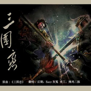
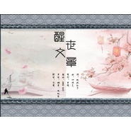
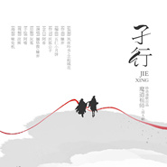

灰菟
============================

|  |  |
| :--: | :-- |
| [ 灰菟](https://i.xiami.com/easyhuitu) | **地区**: China 中国大陆 **风格**: 流行说唱 Pop Rap, 流行摇滚 Pop Rock, 国语流行 Mandarin Pop, 古风 GuFeng Music **播放数**: 10891501 **粉丝数**: 269 **评论数**: 39  |

## 档案

灰菟，1992年3月7日出生于重庆市巫溪县，大陆男歌手 、后期制作人，妙语清歌原创音乐团队成员。代表作有《大漠征歌》《相遇》，后期作品有《辞·九门回忆》、《孑行》、《迷踪》等。

## 专辑

| 名称 | 语种 | 唱片公司 | 发行时间 | 专辑类别 | 专辑风格 |
| :--: | :-- | :-- | :-- | :-- | :-- |
| [ 口是心非](./albums/5021454067.md) | 国语 | 独立发行 | 2020年09月12日 | EP, 单曲 | 流行摇滚 Pop Rock |
| [ 情劫情劫](./albums/5020854757.md) | 国语 | 妙语清歌 | 2020年06月09日 | EP, 单曲 | 古风 GuFeng Music, 中国风 China-Wave |
| [ 你的答案](./albums/2420401122.md) | 国语 | 独立发行 | 2020年03月06日 | 录音室专辑 | 摇滚 Rock & Roll, 古风 GuFeng Music |
| [ 老板娘的睡前故事](./albums/2420314960.md) | 国语 | 妙语清歌 | 2020年03月01日 | 录音室专辑 | 新民谣 Neofolk, 古风 GuFeng Music, 中国风 China-Wave |
| [ 千年](./albums/2320309340.md) | 国语 | 独立发行 | 2020年02月26日 | EP, 单曲 | 古风 GuFeng Music, 中国风 China-Wave |
| [ （翻唱）三国恋](./albums/2104161116.md) | 国语 |  | 2018年10月30日 | EP, 单曲 | 摇滚 Rock & Roll, 中国戏曲 Chinese Opera, 中国风 China-Wave |
| [ 醒世文章](./albums/2104051756.md) | 国语 | 独立发行 | 2018年09月24日 | EP, 单曲 | 古风 GuFeng Music, 中国风 China-Wave |
| [ 人妖不曾背叛](./albums/2103934640.md) | 泰语 | 独立发行 | 2018年08月19日 | EP, 单曲 | 流行 Pop |
| [ 思美人](./albums/2103711077.md) | 国语 | 独立发行 | 2018年05月16日 | EP, 单曲 | 古风 GuFeng Music |
| [ 叫我万岁爷](./albums/2103513798.md) | 国语 | 独立发行 | 2018年02月03日 | EP, 单曲 | 流行说唱 Pop Rap, 京剧 Beijing Opera, 中国民乐 Chinese Folk Music |
| [ 灰菟翻唱集](./albums/2102740072.md) | 国语 | 独立发行 | 2017年04月28日 | EP, 单曲 | 流行 Pop |
| [ 相遇](./albums/2102701996.md) | 国语 | 妙语清歌 | 2017年03月01日 | EP, 单曲 | 古风 GuFeng Music, 中国风 China-Wave |
| [ 魔道祖师同人](./albums/2100380228.md) | 国语 | 妙语清歌 | 2016年08月12日 | EP, 单曲 | 古风 GuFeng Music |
| [ 大漠征歌](./albums/2100369526.md) | 国语 | 独立发行 | 2016年07月19日 | EP, 单曲 |  |
| [ 辞·九门回忆妙语清歌正版首发](./albums/2104315739.md) | 国语 | 妙语清歌 | 2016年04月18日 | EP, 单曲 | 古风 GuFeng Music |
| [ 之子何归之子何归【后期-灰菟】](./albums/2100229498.md) | 国语 | 独立发行 | 2015年10月25日 | EP, 单曲 | 现代古典 Modern Classical, 新世纪音乐 New Age |

## 评论

|  |  |  |
| :-- | :-- | :-- |
|  [虾米用户](https://emumo.xiami.com/u/401207222)  2020-05-23 15:28 赞(0) 踩(0) | 
uy7i676y8t6iu46tuyyuguggygyyertuyfguyfdsyyfiuwuiyuydfhgdfhgv hgghvhgru8weuyui
 |
|  [虾米用户](https://emumo.xiami.com/u/356007969)  2019-09-15 04:46 赞(0) 踩(0) | 
你好
 |
|  [虾米用户](https://emumo.xiami.com/u/263694199)  2019-08-12 14:41 赞(0) 踩(0) | 
收藏的音乐很好听
 |
|  [虾米用户](https://emumo.xiami.com/u/428541202) 优秀 2019-08-12 05:53 赞(0) 踩(0) | 
能加个好友吗
 |
| ⇒ |  [虾米用户](https://emumo.xiami.com/u/42689945) 小后期一枚，接有偿后期。... 2019-08-17 11:07 赞(0) 踩(0) | 
可以啊
 |
|  [虾米用户](https://emumo.xiami.com/u/318014482)  2019-07-12 14:18 赞(0) 踩(0) | 
来了
 |
|  [虾米用户](https://emumo.xiami.com/u/325374787)  2019-04-24 21:29 赞(0) 踩(0) | 
好
 |
|  [虾米用户](https://emumo.xiami.com/u/337210754) 陌上人如玉 公子世无双 2019-03-16 12:05 赞(1) 踩(0) | 
我已经循环辞九门回忆好几天了哈哈哈
 |
|  [虾米用户](https://emumo.xiami.com/u/419289840)  2019-02-16 14:49 赞(1) 踩(0) | 
  
 |
|  [虾米用户](https://emumo.xiami.com/u/419289840)  2019-02-16 14:49 赞(1) 踩(0) | 
好听
 |
|  [虾米用户](https://emumo.xiami.com/u/5424076) 咋个说？要签名？ 2019-02-16 10:14 赞(1) 踩(0) | 
能不恶心人嘛这是摇滚
 |
|  [虾米用户](https://emumo.xiami.com/u/352740760)  2019-01-27 19:01 赞(1) 踩(0) | 
好听，我也好想像你那样！真好听！
 |
|  [虾米用户](https://emumo.xiami.com/u/412776357) 昨夜雨疏风骤 2019-01-22 22:54 赞(0) 踩(0) | 
重庆人路过个 
 |
|  [虾米用户](https://emumo.xiami.com/u/406757841)  2019-01-14 11:59 赞(0) 踩(0) | 
好听 加油哦！
 |
|  [虾米用户](https://emumo.xiami.com/u/411745443)  2019-01-02 21:19 赞(1) 踩(0) | 
非常好，很喜欢
 |
|  [虾米用户](https://emumo.xiami.com/u/166685678) 朋友也挺好 2018-12-31 12:01 赞(0) 踩(0) | 
很厉害  说真的好多个还真不认识  惭愧 
 |
|  [虾米用户](https://emumo.xiami.com/u/300940784) 任性 顽皮！你妹的…… 2018-12-28 11:46 赞(0) 踩(0) | 
什么时候才能像你一样优秀……
 |
|  [虾米用户](https://emumo.xiami.com/u/357270339)  2018-06-19 19:50 赞(0) 踩(0) | 

 |
|  [虾米用户](https://emumo.xiami.com/u/174551488)  2018-03-24 09:21 赞(0) 踩(0) | 
非常好听，我儿子特别喜欢 
 |
|  [虾米用户](https://emumo.xiami.com/u/48844167) 用我一生换你十年天真无邪... 2018-02-19 00:25 赞(1) 踩(0) | 
声音很不错丫。。。少年
 |
|  [虾米用户](https://emumo.xiami.com/u/331257218)  2018-02-11 11:54 赞(1) 踩(0) | 
棒٩(ˊᗜˋ*)و
 |
|  [虾米用户](https://emumo.xiami.com/u/282278619)  2017-06-07 20:08 赞(2) 踩(0) | 
   
 |
|  [虾米用户](https://emumo.xiami.com/u/290548423)  2017-04-27 12:21 赞(1) 踩(0) | 
奥
 |
|  [虾米用户](https://emumo.xiami.com/u/42689945) 小后期一枚，接有偿后期。... 2015-05-15 21:16 赞(14) 踩(0) | 
我刚入驻了虾米音乐人，欢迎大家来我的个人主页，收听我的最新音乐
 |
| ⇒ |  [虾米用户](https://emumo.xiami.com/u/61242662)  2019-01-21 11:25 赞(0) 踩(0) | 
抖音火了你
 |
| ⇒ |  [虾米用户](https://emumo.xiami.com/u/42689945) 小后期一枚，接有偿后期。... 2019-01-21 22:32 赞(0) 踩(0) | 
<q><b>paijiangsheg说：</b></q>
 |
| ⇒ |  [虾米用户](https://emumo.xiami.com/u/61242662)  2019-01-22 10:07 赞(0) 踩(0) | 
<q><b>灰菟说：</b></q>
 |
| ⇒ |  [虾米用户](https://emumo.xiami.com/u/42689945) 小后期一枚，接有偿后期。... 2019-01-22 11:09 赞(0) 踩(0) | 
<q><b>paijiangsheg说：</b></q>
 |
| ⇒ |  [虾米用户](https://emumo.xiami.com/u/61242662)  2019-01-22 12:37 赞(0) 踩(0) | 
<q><b>灰菟说：</b></q>
 |
| ⇒ |  [虾米用户](https://emumo.xiami.com/u/42689945) 小后期一枚，接有偿后期。... 2019-01-22 22:42 赞(0) 踩(0) | 
<q><b>paijiangsheg说：</b></q>
 |
| ⇒ |  [虾米用户](https://emumo.xiami.com/u/61242662)  2019-01-23 10:51 赞(0) 踩(0) | 
<q><b>灰菟说：</b></q>
 |
| ⇒ |  [虾米用户](https://emumo.xiami.com/u/42689945) 小后期一枚，接有偿后期。... 2019-01-23 21:25 赞(0) 踩(0) | 
<q><b>paijiangsheg说：</b></q>
 |
| ⇒ |  [虾米用户](https://emumo.xiami.com/u/61242662)  2019-01-25 21:12 赞(0) 踩(0) | 
<q><b>灰菟说：</b></q>
 |
| ⇒ |  [虾米用户](https://emumo.xiami.com/u/42689945) 小后期一枚，接有偿后期。... 2019-01-26 07:42 赞(0) 踩(0) | 
<q><b>paijiangsheg说：</b></q>
 |
| ⇒ |  [虾米用户](https://emumo.xiami.com/u/61242662)  2019-01-26 10:39 赞(0) 踩(0) | 
<q><b>灰菟说：</b></q>
 |
| ⇒ |  [虾米用户](https://emumo.xiami.com/u/42689945) 小后期一枚，接有偿后期。... 2019-01-27 21:58 赞(0) 踩(0) | 
<q><b>paijiangsheg说：</b></q>
 |
| ⇒ |  [虾米用户](https://emumo.xiami.com/u/61242662)  2019-01-27 22:27 赞(0) 踩(0) | 
<q><b>灰菟说：</b></q>
 |
| ⇒ |  [虾米用户](https://emumo.xiami.com/u/61242662)  2019-02-02 23:13 赞(0) 踩(0) | 
<q><b>灰菟说：</b></q>
 |
| ⇒ |  [虾米用户](https://emumo.xiami.com/u/26501875)  2019-08-21 09:08 赞(0) 踩(0) | 
您的歌很好听，期待新作
 |
