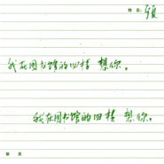
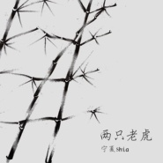
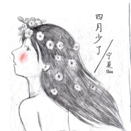
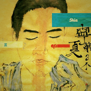

宁夏
============================

|  |  |
| :--: | :-- |
| [ 宁夏](https://i.xiami.com/shia) | **播放数**: 7091935 **粉丝数**: 4998 **评论数**: 205 **地区**: China 中国大陆 **风格**: 民谣流行 Folk Pop, 根源唱作人 Singer-Songwriter, 独立民谣 Indie Folk  |

## 档案

捕捉日常生活的感动作为歌曲创作素材，音乐表达方式松弛自然，贴近生活，率性而温柔；从《清名谣》《秋雨晴时》起，尝试在古诗词之中探寻中式旋律的更多可能，力求在歌曲中体现中文之美。 
新浪微博：宁夏shia 
微信公众号：宁夏shia 
工作联系： 7562613@qq.com

## 专辑

| 名称 | 语种 | 唱片公司 | 发行时间 | 专辑类别 | 专辑风格 |
| :--: | :-- | :-- | :-- | :-- | :-- |
| [ 在我之外](./albums/5021912672.md) | 国语 | 独立发行 | 2020年11月11日 | 录音室专辑 | 流行 Pop, 国语流行 Mandarin Pop, 民谣流行 Folk Pop |
| [ 望江南](./albums/5021815308.md) | 国语 | 独立发行 | 2020年11月01日 | 录音室专辑 | 流行 Pop, 中国风 China-Wave, 华语唱作人 Chinese Singer-Songwriter |
| [ 老师跟同学2020教师节纪念EP](./albums/5021824172.md) | 国语 | 独立发行 | 2020年09月10日 | EP, 单曲 | 校园民谣 Campus Folk, 流行 Pop, 华语唱作人 Chinese Singer-Songwriter |
| [ 我在图书馆的四楼 想你，](./albums/2105429125.md) | 国语 |  | 2019年11月11日 | EP, 单曲 |  |
| [ 两只老虎](./albums/2103751615.md) | 国语 | 独立发行 | 2018年06月17日 | EP, 单曲 | 民谣 Folk, 流行 Pop, 国语流行 Mandarin Pop |
| [ 四月少了](./albums/2103753204.md) | 国语 | 独立发行 | 2018年04月29日 | EP, 单曲 | 国语流行 Mandarin Pop |
| [ demoA](./albums/2102979622.md) | 国语 | 看见音乐 (上海) | 2017年12月22日 | EP, 单曲 | 独立民谣 Indie Folk |
| [ 清名谣](./albums/2100371747.md) | 国语 | 独立发行 | 2016年07月23日 | EP, 单曲 | 民谣 Folk, 中国风 China-Wave |
| [ 茶香](./albums/2100327386.md) | 国语 | 滚石唱片 | 2016年05月03日 | EP, 单曲 | 民谣流行 Folk Pop |
| [ 北京来的姑娘](./albums/909897059.md) | 国语 | 独立发行 | 2014年07月21日 | EP, 单曲 | 民谣流行 Folk Pop, 新民谣 Neofolk |
| [ 第三个宁夏首张同名EP](./albums/267926369.md) | 国语 | 独立发行 | 2013年04月13日 | EP, 单曲 | 独立民谣 Indie Folk, 国语流行 Mandarin Pop |

## 评论

|  |  |  |  |
| :-- | :-- | :-- | :-- |
|  [虾米用户](https://emumo.xiami.com/u/8337431) 以乐会友 2020-09-30 18:39 赞(0) 踩(0) | 
宁夏20200930.205
 |
|  [虾米用户](https://emumo.xiami.com/u/361646515) 我还没想好要写什么... 2019-11-11 10:10 赞(1) 踩(0) | 
相识14年，在远方安静地听你的声音，默默地关注着你，祝福你。
 |
|  [虾米用户](https://emumo.xiami.com/u/346165752)  2019-05-05 12:06 赞(0) 踩(0) | 

 |
|  [虾米用户](https://emumo.xiami.com/u/295576704)  2018-09-26 09:15 赞(0) 踩(0) | 
云雨溪怎么没有呀
 |
|  [虾米用户](https://emumo.xiami.com/u/198490263) 风走风来只是拆散句子 2018-07-09 04:07 赞(0) 踩(0) | 
两百!宁夏哥哥是我的!
 |
|  [虾米用户](https://emumo.xiami.com/u/345351423)  2018-05-12 09:23 赞(0) 踩(0) | 
最喜欢的两首歌:《午餐》《你在我的怀里睡着》 
 |
|  [虾米用户](https://emumo.xiami.com/u/128640054)  2018-04-14 20:17 赞(0) 踩(0) | 
第一首听你的歌是清名谣，前奏想起就爱上了。很好听，喜欢的歌手除了赵雷就到你了
 |
|  [虾米用户](https://emumo.xiami.com/u/33589008)  2018-02-13 23:19 赞(0) 踩(0) | 
从晓月老板那里听了春风曲转来的，发现很喜欢你的歌，如果录音上能再提升一下就好了。
 |
|  [虾米用户](https://emumo.xiami.com/u/332527452) 拾柒 2018-02-06 14:55 赞(1) 踩(0) | 
轻快喜悦的民谣 
 |
|  [虾米用户](https://emumo.xiami.com/u/244646012)  2018-01-13 00:21 赞(0) 踩(0) | 
我是宁夏人&amp;hellip;为了宁夏而来
 |
|  [虾米用户](https://emumo.xiami.com/u/265498947) 头像不是我！！！ 2018-01-10 08:44 赞(0) 踩(0) | 
喜欢 
 |
|  [虾米用户](https://emumo.xiami.com/u/241224973) 换个方式继续喜欢你们 2017-12-02 16:43 赞(0) 踩(0) | 
声音敲苏
 |
|  [虾米用户](https://emumo.xiami.com/u/10251487)  2017-10-11 11:10 赞(0) 踩(0) | 
风格，歌曲好听
 |
|  [虾米用户](https://emumo.xiami.com/u/83893196) 我还没想好要写什么... 2017-10-01 10:08 赞(0) 踩(0) | 

 |
|  [虾米用户](https://emumo.xiami.com/u/7751204)  2017-09-17 11:58 赞(0) 踩(0) | 
超级爱他
 |
|  [虾米用户](https://emumo.xiami.com/u/3231265)   2017-08-28 12:55 赞(0) 踩(0) | 
静静地听你唱歌
 |
|  [虾米用户](https://emumo.xiami.com/u/307790855)  2017-08-04 10:36 赞(0) 踩(0) | 
静静的听
 |
|  [虾米用户](https://emumo.xiami.com/u/875415) 天气不似预期 但要走 总... 2017-07-05 19:13 赞(0) 踩(0) | 
声音太好听
 |
|  [虾米用户](https://emumo.xiami.com/u/309499866) 唱歌的人快乐 2017-07-04 08:06 赞(0) 踩(0) | 
内容已删除
 |
| ⇒ |  [虾米用户](https://emumo.xiami.com/u/4957902)   2017-07-25 00:15 赞(0) 踩(0) | 
10月13日 宁夏shia《清名谣》弹唱会 合肥 ON THE WAY（大摩店）<a href="http://www.showstart.com/event/31390" target="_blank" rel="nofollow noreferrer noopener">http://www.showstart.com/event/31390</a>
 |
|  [虾米用户](https://emumo.xiami.com/u/17360076)   2017-06-05 23:20 赞(0) 踩(0) | 
以前那首 留下来陪你生活 怎么哪哪都找不到啦呀
 |
|  [虾米用户](https://emumo.xiami.com/u/8978876)  2017-05-16 16:35 赞(0) 踩(0) | 
这声音忒销魂了。。一个男人都受不了的声音。。。
 |
|  [虾米用户](https://emumo.xiami.com/u/31344961) 我还没想好要写什么... 2017-05-16 00:17 赞(0) 踩(0) | 
喜欢你的歌们
 |
|  [虾米用户](https://emumo.xiami.com/u/5434262) 暂无签名~ 2017-05-02 03:13 赞(1) 踩(0) | 
转眼快4年过去，我从大理来到了德国，突然想起好久没打开虾米，突然想起你问大理街头有人唱起南方的秋天那个人是不是我。看见你还在唱歌，就觉得好像日子没有走远一样。等回来，希望能有机会在台下听你唱一次南方的秋天。
 |
| ⇒ |  [虾米用户](https://emumo.xiami.com/u/128640054)  2018-04-14 20:14 赞(0) 踩(0) | 
哟，我大云南人，加油
 |
|  [虾米用户](https://emumo.xiami.com/u/264750776)  2017-04-29 19:58 赞(1) 踩(0) | 
喜欢他的声音，醉人
 |
|  [虾米用户](https://emumo.xiami.com/u/284132625)  2017-04-27 21:56 赞(0) 踩(0) | 
喵==？听梁静茹的宁夏自动列表播放到这个歌手，结果&amp;hellip;&amp;hellip;真的很好听！！！？？？？太抓耳了！
 |
|  [虾米用户](https://emumo.xiami.com/u/288727029)  2017-04-15 00:34 赞(1) 踩(0) | 
冲着南方来的，南方的秋真的很短
 |
|  [虾米用户](https://emumo.xiami.com/u/8622254)   2017-03-25 02:35 赞(1) 踩(0) | 
每夜听着你的歌入眠
 |
|  [虾米用户](https://emumo.xiami.com/u/268229109) 我一定是个假账户 2017-03-23 08:37 赞(0) 踩(0) | 
听了那么多那么多民谣 我敢对着自己的心说 民谣歌手里最喜欢的就是你 没有之一
 |
|  [虾米用户](https://emumo.xiami.com/u/656849) 还没爱过就爱不起了呢 2017-03-16 09:10 赞(1) 踩(0) | 
喜欢这样暖暖得声音，在烦躁的时候难得的变安静
 |
| ⇒ |  [虾米用户](https://emumo.xiami.com/u/280805950) 大自然的力量在浩瀚的宇宙... 2017-09-25 20:31 赞(0) 踩(0) | 
安安静静的^_^
 |
|  [虾米用户](https://emumo.xiami.com/u/273800677)  2017-03-12 23:19 赞(0) 踩(0) | 
请关注微博 
 |
|  [虾米用户](https://emumo.xiami.com/u/37316090) 喜欢听我喜欢的音乐 2017-03-09 21:56 赞(0) 踩(0) | 
哈尔滨这个弹唱会，需要买票吗？在哪买？
 |
| ⇒ |  [虾米用户](https://emumo.xiami.com/u/136562246) 王镜淳 2017-03-10 10:53 赞(0) 踩(0) | 
在秀动上
 |
|  [虾米用户](https://emumo.xiami.com/u/22424509) 暂无签名~ 2017-03-01 14:36 赞(0) 踩(0) | 
多来北京呀
 |
|  [虾米用户](https://emumo.xiami.com/u/221827980)  2017-02-21 08:10 赞(0) 踩(0) | 
吉他不错
 |
|  [虾米用户](https://emumo.xiami.com/u/47577064) 杂食耳 2017-02-20 16:23 赞(0) 踩(0) | 
清名谣，二胡好听，小调
 |
|  [虾米用户](https://emumo.xiami.com/u/47577064) 杂食耳 2017-02-20 16:22 赞(0) 踩(0) | 
谢春花的的一首歌漫游来的，一张口两句，哎呀不错呢，收了
 |
|  [虾米用户](https://emumo.xiami.com/u/204201965)  2017-02-19 12:14 赞(0) 踩(0) | 
真的好听！他一定会出名的！
 |
|  [虾米用户](https://emumo.xiami.com/u/32051445) 女孩儿的歌。 永爱虾米 2017-02-18 10:11 赞(0) 踩(0) | 
能听见就是缘
 |
|  [虾米用户](https://emumo.xiami.com/u/181162912) 陳家迷妹一隻， 不定期刷... 2017-02-16 14:39 赞(0) 踩(0) | 
随机听到了他的歌  歌写的好温柔 唱的好温柔 听了一天停不下来。 微博什么的却没找到。
 |
|  [虾米用户](https://emumo.xiami.com/u/16135450)  2017-02-12 00:36 赞(1) 踩(0) | 
7803
 |
|  [虾米用户](https://emumo.xiami.com/u/258701394)  2017-02-03 16:00 赞(0) 踩(0) | 
来首歌应应景
 |
|  [虾米用户](https://emumo.xiami.com/u/256903765)  2017-01-25 18:52 赞(0) 踩(0) | 

 |
|  [虾米用户](https://emumo.xiami.com/u/6215042) 欢迎关注同名音乐公众号 2017-01-23 14:48 赞(0) 踩(0) | 
棒
 |
|  [虾米用户](https://emumo.xiami.com/u/254369591)  2017-01-11 15:07 赞(0) 踩(0) | 
宁夏 辽宁老乡来给你加油 你一定会火 加油加油！   
 |
|  [虾米用户](https://emumo.xiami.com/u/114543524) 大脸 2017-01-08 15:30 赞(0) 踩(0) | 
只能说认真听歌是一种享受啊，词好，声音也是醉人，希望越来越好。
 |
|  [虾米用户](https://emumo.xiami.com/u/3518232) 唯有音乐相伴，不再孤独启... 2016-12-25 12:04 赞(0) 踩(0) | 
安徽人民表示何时来安徽，宁夏大神？
 |
|  [虾米用户](https://emumo.xiami.com/u/50564823) 永远想念你 2016-10-09 14:25 赞(0) 踩(0) | 
讲真 你这个声音唱什么都好听
 |
|  [虾米用户](https://emumo.xiami.com/u/201032050)  2016-09-29 23:02 赞(0) 踩(0) | 
吉他振音不错
 |
|  [虾米用户](https://emumo.xiami.com/u/3857402)  2016-09-22 23:39 赞(0) 踩(0) | 
怎么没有《天空为什么是蓝色的》？
 |
|  [虾米用户](https://emumo.xiami.com/u/32031632)  2016-09-22 16:41 赞(1) 踩(0) | 
宁夏,民谣,叙事,
 |
|  [虾米用户](https://emumo.xiami.com/u/38871785) 姗姗不来迟 2016-08-29 22:19 赞(0) 踩(0) | 
来看看叔
 |
|  [虾米用户](https://emumo.xiami.com/u/203823621)  2016-08-03 10:22 赞(0) 踩(0) | 
他早晚会火
 |
|  [虾米用户](https://emumo.xiami.com/u/39968630) Harder,bette... 2016-06-30 16:42 赞(0) 踩(0) | 
哇 宁静的夏天哈哈
 |
|  [虾米用户](https://emumo.xiami.com/u/9124267) 茕茕白兔，东走西顾。 2016-06-05 10:32 赞(4) 踩(0) | 
南京先锋书店，昨天听了现场，宁夏笑起来很温暖。
 |
|  [虾米用户](https://emumo.xiami.com/u/25046842)  2016-06-01 11:27 赞(1) 踩(0) | 
为什么是4号来南京还是晚上  55555
 |
|  [虾米用户](https://emumo.xiami.com/u/55948205) 一個年輕的博主：） 2016-05-22 14:29 赞(0) 踩(0) | 
有没有北京姑娘的吉他谱 
 |
|  [虾米用户](https://emumo.xiami.com/u/48966183) 但行好事，莫问前程。 2016-05-18 00:49 赞(0) 踩(0) | 
好评
 |
|  [虾米用户](https://emumo.xiami.com/u/123200546)   2016-05-07 00:43 赞(0) 踩(0) | 
单曲循环，声音好喜欢
 |
|  [虾米用户](https://emumo.xiami.com/u/159487504)   2016-05-04 23:11 赞(0) 踩(0) | 
千篇一律的开头 但声音很吸引我 可惜了人
 |
|  [虾米用户](https://emumo.xiami.com/u/100131878)   2016-05-03 22:11 赞(0) 踩(0) | 
清茶 
 |
|  [虾米用户](https://emumo.xiami.com/u/25368965) 年轻的乐队 2016-05-03 17:01 赞(0) 踩(0) | 
立即就来听了
 |
|  [虾米用户](https://emumo.xiami.com/u/60328010) 你的宝藏男孩 2016-04-10 11:49 赞(0) 踩(0) | 
第一次听已醉了 
 |
|  [虾米用户](https://emumo.xiami.com/u/38871785) 姗姗不来迟 2016-04-06 07:28 赞(2) 踩(0) | 
真好听 能加个微信么
 |
|  [虾米用户](https://emumo.xiami.com/u/65817154) 嘘 2016-04-03 10:17 赞(0) 踩(0) | 
咋不唱个宁夏来的姑娘呢
 |
|  [虾米用户](https://emumo.xiami.com/u/2875)  2016-03-28 00:32 赞(0) 踩(0) | 
今儿听了《秋雨晴时》，虾米怎的下架了呢。。
 |
|  [虾米用户](https://emumo.xiami.com/u/43243693) 民谣 流行 2016-03-14 13:57 赞(3) 踩(0) | 
偶像要巡演了。好忙碌。祝演出顺利！身体健康。
 |
|  [虾米用户](https://emumo.xiami.com/u/40400962) 宁可二，也不装 2016-03-14 13:55 赞(0) 踩(0) | 
来长沙吧
 |
|  [虾米用户](https://emumo.xiami.com/u/3803809) 人生得意须尽欢 2016-03-13 21:33 赞(0) 踩(0) | 

 |
|  [虾米用户](https://emumo.xiami.com/u/49086299) 语虚，何以言知 2016-03-08 09:27 赞(0) 踩(0) | 
北京姑娘3月要去南方，要错过了
 |
|  [虾米用户](https://emumo.xiami.com/u/43243693) 民谣 流行 2016-03-08 06:47 赞(2) 踩(0) | 
喜欢宁夏的＋微信群
 |
| ⇒ |  [虾米用户](https://emumo.xiami.com/u/250193567)  2016-12-03 15:37 赞(0) 踩(0) | 
叫啥
 |
|  [虾米用户](https://emumo.xiami.com/u/14392534) 在这里 写什么都是多余 ... 2016-03-07 23:16 赞(0) 踩(0) | 
北京怎么买票？
 |
|  [虾米用户](https://emumo.xiami.com/u/1032029) 我还没想好要写什么... 2016-03-02 09:15 赞(0) 踩(0) | 
长得像甄子丹
 |
| ⇒ |  [虾米用户](https://emumo.xiami.com/u/32051445) 女孩儿的歌。 永爱虾米 2017-03-18 10:09 赞(0) 踩(0) | 
&amp;hellip;&amp;hellip;
 |
| ⇒ |  [虾米用户](https://emumo.xiami.com/u/1032029) 我还没想好要写什么... 2017-03-18 15:46 赞(0) 踩(0) | 
<q><b>國立少女说：</b></q>
 |
|  [虾米用户](https://emumo.xiami.com/u/49091284)   2016-02-02 20:31 赞(0) 踩(0) | 
哎？
 |
|  [虾米用户](https://emumo.xiami.com/u/34118584)  2016-01-23 16:16 赞(0) 踩(0) | 
泥梦咧？好听吖
 |
|  [虾米用户](https://emumo.xiami.com/u/4281768) ， 2016-01-23 00:33 赞(0) 踩(0) | 
今天听了现场木马剧场的弹唱会 简直太棒 很少年 好久不听民谣的我又回来了
 |
|  [虾米用户](https://emumo.xiami.com/u/36419462)  2016-01-08 20:06 赞(0) 踩(0) | 
走了南方姑娘来了北京姑娘
 |
|  [虾米用户](https://emumo.xiami.com/u/5483966)  2016-01-06 20:12 赞(0) 踩(0) | 
耐听
 |
|  [虾米用户](https://emumo.xiami.com/u/92911344)  2016-01-02 17:34 赞(0) 踩(0) | 
求各种各样的谱啊，好喜欢你的歌。但是在KTV都点不了。求吉他谱~~~
 |
|  [虾米用户](https://emumo.xiami.com/u/15480478)   2015-12-26 10:44 赞(1) 踩(0) | 
超喜欢你的歌！！
 |
|  [虾米用户](https://emumo.xiami.com/u/50056536)  2015-12-26 00:15 赞(0) 踩(0) | 
天空为什么是蓝色的什么时候能听。。
 |
|  [虾米用户](https://emumo.xiami.com/u/93656276)  2015-12-22 16:38 赞(0) 踩(0) | 
喜欢就是喜欢，没有原因
 |
|  [虾米用户](https://emumo.xiami.com/u/1264648) 音乐赐予我灵感吧，喵了个 2015-12-20 10:59 赞(0) 踩(0) | 
中央车站看决赛，一轮听下来，老公觉得你该拿第一，我觉得你唱功最稳定，素养最好，果然听录音作品成熟好听，有发展潜力，加油。 
 |
|  [虾米用户](https://emumo.xiami.com/u/40116911)   2015-12-19 21:32 赞(0) 踩(0) | 
今天滚石听到你现场～真心觉得你应该拿第一
 |
|  [虾米用户](https://emumo.xiami.com/u/66842466) 连联系也需要勇气 2015-12-19 15:35 赞(0) 踩(0) | 
看完滚石比赛，好喜欢这个声音哦
 |
|  [虾米用户](https://emumo.xiami.com/u/49086299) 语虚，何以言知 2015-12-16 13:02 赞(1) 踩(0) | 
我有一个习惯，每天早晨上班的车上把一天要听的歌单做出来，这几天感觉总是不对，什么都想不起来，谁都不感兴趣，开着音乐也只是让它随机播放。庆幸，今天听到这个声音！宁夏，记住了
 |
|  [虾米用户](https://emumo.xiami.com/u/46035861) 德智体三好青年 2015-12-06 13:44 赞(1) 踩(0) | 
我是宁夏人，宁夏老师唱首宁夏吧
 |
|  [虾米用户](https://emumo.xiami.com/u/38871785) 姗姗不来迟 2015-12-04 01:37 赞(0) 踩(0) | 
宁夏老师快写新歌
 |
|  [虾米用户](https://emumo.xiami.com/u/52310714)  2015-11-07 20:05 赞(0) 踩(0) | 
不知道
 |
|  [虾米用户](https://emumo.xiami.com/u/52696611) 就这样逃跑吧 2015-11-05 21:38 赞(0) 踩(0) | 
宁夏,民谣,叙事,
 |
|  [虾米用户](https://emumo.xiami.com/u/58693980)   2015-10-07 19:18 赞(2) 踩(0) | 
大爱那首午餐
 |
|  [虾米用户](https://emumo.xiami.com/u/11336740) 谁用乌云换日星 2015-10-04 21:50 赞(0) 踩(0) | 
声音太赞
 |
|  [虾米用户](https://emumo.xiami.com/u/3518232) 唯有音乐相伴，不再孤独启... 2015-09-23 21:45 赞(0) 踩(0) | 
宁夏，您什么时候来安徽演出，我去看，望回复哦！ 
 |
|  [虾米用户](https://emumo.xiami.com/u/15961666)   2015-09-16 16:48 赞(0) 踩(0) | 
期待有广州站的演出 
 |
|  [虾米用户](https://emumo.xiami.com/u/65028396) 还是吃饭和弹吉他最开心了... 2015-09-15 07:24 赞(1) 踩(0) | 
！！！！！
 |
| ⇒ |  [虾米用户](https://emumo.xiami.com/u/3518232) 唯有音乐相伴，不再孤独启... 2015-09-23 21:45 赞(0) 踩(0) | 
小yours
 |
| ⇒ |  [虾米用户](https://emumo.xiami.com/u/65028396) 还是吃饭和弹吉他最开心了... 2015-09-24 00:35 赞(0) 踩(0) | 
<q><b>lelevn说：</b></q>
 |
|  [虾米用户](https://emumo.xiami.com/u/47754102) 暂无签名~ 2015-08-24 11:22 赞(0) 踩(0) | 
我在宁夏的宁夏听宁夏  心情美
 |
|  [虾米用户](https://emumo.xiami.com/u/53768666) You're beaut... 2015-08-13 07:56 赞(0) 踩(0) | 
啥时候再回宁夏开个场啊 我虽然人不在宁夏 但会去听啊
 |
|  [虾米用户](https://emumo.xiami.com/u/4349951)  2015-08-11 13:36 赞(0) 踩(0) | 
8.20吗？几点？
 |
|  [虾米用户](https://emumo.xiami.com/u/47131519)  2015-08-01 11:53 赞(0) 踩(0) | 
什么时候北京有演出必去现场！
 |
|  [虾米用户](https://emumo.xiami.com/u/37316090) 喜欢听我喜欢的音乐 2015-07-28 21:59 赞(0) 踩(0) | 
我喜欢 
 |
|  [虾米用户](https://emumo.xiami.com/u/37316090) 喜欢听我喜欢的音乐 2015-07-28 21:59 赞(0) 踩(0) | 
我喜欢 
 |
|  [虾米用户](https://emumo.xiami.com/u/1775490)   2015-07-24 15:17 赞(0) 踩(0) | 
目测是叔叔？爱吗声音太好听了！不来魔都live l吗！南方小旁友心心念念等着啊～
 |
|  [虾米用户](https://emumo.xiami.com/u/10069165)  2015-07-23 12:19 赞(0) 踩(0) | 
可以
 |
| ⇒ |  [虾米用户](https://emumo.xiami.com/u/41831149)  2015-07-23 12:25 赞(0) 踩(0) | 
憨批
 |
|  [虾米用户](https://emumo.xiami.com/u/47272849) 执着的心遥远的望着。。。 2015-07-21 19:36 赞(1) 踩(0) | 
Tigers这首歌感觉像是在写你自己。。。
 |
|  [虾米用户](https://emumo.xiami.com/u/45045125) 我还没想好要写什么... 2015-07-19 21:44 赞(0) 踩(0) | 
7.22常州有演出有约的嘛
 |
|  [虾米用户](https://emumo.xiami.com/u/50488003) 音乐也不能让你永远感动，... 2015-07-07 10:57 赞(1) 踩(0) | 
那个不便透露姓名的女纸说的真好，不能总是听你的歌，会心动。嗯，怎么办呢，听上瘾了。今年看了马頔的现场，也想现场听你唱歌呢，所以，你啥时候在杭州，宁波或嘉兴有现场演出呢？好听的声音的男孩纸 
 |
| ⇒ |  [虾米用户](https://emumo.xiami.com/u/6717156) 我还没想好要写什么... 2015-07-07 13:28 赞(0) 踩(0) | 
看公告栏 哈哈
 |
|  [虾米用户](https://emumo.xiami.com/u/3518232) 唯有音乐相伴，不再孤独启... 2015-07-02 11:08 赞(0) 踩(0) | 
宁夏，什么时候考虑来安徽，安徽人民想念你
 |
| ⇒ |  [虾米用户](https://emumo.xiami.com/u/32031632)  2015-07-07 09:19 赞(0) 踩(0) | 
期待着！
 |
|  [虾米用户](https://emumo.xiami.com/u/50266255)  2015-06-21 20:47 赞(0) 踩(0) | 
追你一辈子，不胡说
 |
|  [虾米用户](https://emumo.xiami.com/u/6211970) 我还没想好要写什么... 2015-06-21 14:23 赞(0) 踩(0) | 
啊啊啊 六月七号不在银川     
 |
|  [虾米用户](https://emumo.xiami.com/u/32031632)  2015-06-20 08:56 赞(0) 踩(0) | 
好曲目，赞！
 |
|  [虾米用户](https://emumo.xiami.com/u/25494521)  2015-06-20 01:45 赞(0) 踩(0) | 
希望你可以来武汉巡演
 |
|  [虾米用户](https://emumo.xiami.com/u/50266255)  2015-06-15 10:08 赞(1) 踩(0) | 
听了这么久，宁夏这次的巡演也做完了，每次闭上眼睛还能看到他的笑 
 |
|  [虾米用户](https://emumo.xiami.com/u/50266255)  2015-06-11 01:33 赞(1) 踩(0) | 
虽然说了很多遍，还要再说一次，想嫁
 |
| ⇒ |  [虾米用户](https://emumo.xiami.com/u/6717156) 我还没想好要写什么... 2015-06-20 01:15 赞(0) 踩(0) | 
哈哈哈哈
 |
| ⇒ |  [虾米用户](https://emumo.xiami.com/u/3518232) 唯有音乐相伴，不再孤独启... 2015-07-02 11:08 赞(0) 踩(0) | 
<q><b>宁夏说：</b></q>
 |
| ⇒ |  [虾米用户](https://emumo.xiami.com/u/6717156) 我还没想好要写什么... 2015-07-02 11:57 赞(0) 踩(0) | 
<q><b>lelevn说：</b></q>
 |
| ⇒ |  [虾米用户](https://emumo.xiami.com/u/3518232) 唯有音乐相伴，不再孤独启... 2015-07-02 13:37 赞(0) 踩(0) | 
<q><b>宁夏说：</b></q>
 |
|  [虾米用户](https://emumo.xiami.com/u/32031632)  2015-06-10 15:44 赞(0) 踩(0) | 
好曲目，赞！
 |
|  [虾米用户](https://emumo.xiami.com/u/3531256) 倾听一切 2015-05-28 21:07 赞(1) 踩(0) | 
杭州临平，往事并不如烟...
 |
| ⇒ |  [虾米用户](https://emumo.xiami.com/u/6717156) 我还没想好要写什么... 2015-05-29 01:52 赞(0) 踩(0) | 
你奈人生何？
 |
| ⇒ |  [虾米用户](https://emumo.xiami.com/u/3531256) 倾听一切 2015-05-29 12:56 赞(0) 踩(0) | 
<q><b>宁夏说：</b></q>
 |
| ⇒ |  [虾米用户](https://emumo.xiami.com/u/7) 单恋木吉他 2015-06-01 11:47 赞(0) 踩(0) | 
<q><b>说：</b></q>
 |
| ⇒ |  [虾米用户](https://emumo.xiami.com/u/6717156) 我还没想好要写什么... 2015-06-01 15:48 赞(0) 踩(0) | 
<q><b>说：</b></q>
 |
|  [虾米用户](https://emumo.xiami.com/u/5434262) 暂无签名~ 2015-05-21 09:06 赞(1) 踩(0) | 
你要巡演了吗？虽然还是没有南边~祝顺利，开心玩噢
 |
| ⇒ |  [虾米用户](https://emumo.xiami.com/u/6717156) 我还没想好要写什么... 2015-05-29 01:53 赞(0) 踩(0) | 
对，南边会去的：）你在哪
 |
| ⇒ |  [虾米用户](https://emumo.xiami.com/u/5434262) 暂无签名~ 2015-05-30 13:26 赞(0) 踩(0) | 
<q><b>宁夏说：</b></q>
 |
| ⇒ |  [虾米用户](https://emumo.xiami.com/u/6717156) 我还没想好要写什么... 2015-06-01 15:49 赞(0) 踩(0) | 
<q><b>crazypearl说：</b></q>
 |
|  [虾米用户](https://emumo.xiami.com/u/32031632)  2015-05-21 08:17 赞(0) 踩(0) | 
好歌，支持！
 |
|  [虾米用户](https://emumo.xiami.com/u/32385016) 我怎么这么帅 2015-05-09 15:45 赞(0) 踩(0) | 
一缕炊烟
 |
|  [虾米用户](https://emumo.xiami.com/u/19327050)  2015-04-30 00:04 赞(0) 踩(0) | 
hi,你的歌，我爱上了。
 |
| ⇒ |  [虾米用户](https://emumo.xiami.com/u/6717156) 我还没想好要写什么... 2015-05-29 01:53 赞(0) 踩(0) | 
欢迎！
 |
|  [虾米用户](https://emumo.xiami.com/u/38531275)  2015-04-20 23:54 赞(0) 踩(0) | 
歌词太可爱。
 |
| ⇒ |  [虾米用户](https://emumo.xiami.com/u/6717156) 我还没想好要写什么... 2015-05-29 01:53 赞(0) 踩(0) | 
我故意的
 |
| ⇒ |  [虾米用户](https://emumo.xiami.com/u/38531275)  2015-05-30 16:37 赞(0) 踩(0) | 
<q><b>宁夏说：</b></q>
 |
|  [虾米用户](https://emumo.xiami.com/u/44674302)   2015-04-13 12:16 赞(0) 踩(0) | 
好听的声音
 |
|  [虾米用户](https://emumo.xiami.com/u/8326474) 我还没想好要写什么... 2015-04-11 00:53 赞(1) 踩(0) | 
就想了解大陆的原创。
 |
|  [虾米用户](https://emumo.xiami.com/u/8282038)  2015-04-06 19:34 赞(0) 踩(0) | 
第一次听，很温暖的声音，不错，在京有现场吗
 |
|  [虾米用户](https://emumo.xiami.com/u/7738496) 暂无签名~ 2015-04-06 18:00 赞(0) 踩(0) | 
干净的声音。初听有点像好妹妹的秦昊。 
 |
|  [虾米用户](https://emumo.xiami.com/u/7252584) 新的梦想 2015-04-04 08:08 赞(0) 踩(0) | 
第一次听啊，声音好好听
 |
|  [虾米用户](https://emumo.xiami.com/u/1665961)  2015-03-19 22:46 赞(0) 踩(0) | 
去年上海爵士音乐节听过你的现场版，印象最深的是 喵，喵。哈哈
 |
|  [虾米用户](https://emumo.xiami.com/u/45945377) 缘分是神，游戏是我们。 2015-02-06 16:49 赞(1) 踩(0) | 
听着听着就感觉有一团温暖的光塞满了我的心房。喜欢秋天的人，是我的恋人。
 |
|  [虾米用户](https://emumo.xiami.com/u/43967633) 暂无签名~ 2015-01-09 13:10 赞(11) 踩(0) | 
我是宁夏的…好听
 |
|  [虾米用户](https://emumo.xiami.com/u/43209601) 心随乐动 2015-01-08 17:26 赞(1) 踩(0) | 
干净利落   嗯~总之不错！
 |
|  [虾米用户](https://emumo.xiami.com/u/34931399)  2014-12-05 14:21 赞(1) 踩(0) | 
无意听到 静静地 直入心底 很是喜欢
 |
|  [虾米用户](https://emumo.xiami.com/u/9310550) 我还没想好要写什么... 2014-11-24 23:01 赞(1) 踩(0) | 
午餐好听飞了
 |
|  [虾米用户](https://emumo.xiami.com/u/13677342)  2014-11-20 15:33 赞(0) 踩(0) | 
无名之间，波澜触动
 |
|  [虾米用户](https://emumo.xiami.com/u/42673583) 顺风不浪 逆风不怂 2014-11-12 15:21 赞(0) 踩(0) | 
❤北京姑娘~
 |
|  [虾米用户](https://emumo.xiami.com/u/29053254)         よるつき... 2014-11-10 18:37 赞(1) 踩(0) | 
好喜歡好喜歡好喜歡www
 |
|  [虾米用户](https://emumo.xiami.com/u/3443737) keep walkin 2014-11-01 16:05 赞(0) 踩(0) | 
有这么一个贴心又细致的男人做朋友一定很棒
 |
|  [虾米用户](https://emumo.xiami.com/u/8128176) 好好活着 2014-10-25 23:58 赞(0) 踩(0) | 
民谣大爱
 |
|  [虾米用户](https://emumo.xiami.com/u/42799330) Enjoy life. 2014-10-20 17:42 赞(0) 踩(0) | 
这音乐风格大爱~
 |
|  [虾米用户](https://emumo.xiami.com/u/347238) 一只真诚爱民谣的大叔！ 2014-10-08 20:20 赞(0) 踩(0) | 
好听的声音
 |
|  [虾米用户](https://emumo.xiami.com/u/21691095)  2014-10-03 20:13 赞(0) 踩(0) | 
十月六号来光圈？
 |
|  [虾米用户](https://emumo.xiami.com/u/9532466) 跟着音乐  收起你的肮脏 2014-09-22 10:54 赞(0) 踩(0) | 
挺烫贴的声音.
 |
|  [虾米用户](https://emumo.xiami.com/u/25458514) 海水慢慢退去，无色无味悄... 2014-09-21 08:14 赞(0) 踩(0) | 
先冲着名字听的，很有意境
 |
|  [虾米用户](https://emumo.xiami.com/u/30685783)  2014-09-20 19:22 赞(0) 踩(0) | 
其实听你的歌很久了，就是没加关注而已……
 |
|  [虾米用户](https://emumo.xiami.com/u/30685783)  2014-09-20 19:22 赞(1) 踩(0) | 
听见声音会有想认识的冲动。
 |
| ⇒ |  [虾米用户](https://emumo.xiami.com/u/8818279) 暂无签名~ 2014-10-28 23:07 赞(0) 踩(0) | 
我认识宁夏，在我一个朋友的琴行里做吉他老师。我与他交集不太多，但他给我留下的印象是:又高又瘦，板寸头，眼睛很大很好看，微笑很自然而迷人，整个人干净爽朗大方。
 |
|  [虾米用户](https://emumo.xiami.com/u/35427161)  2014-08-26 19:28 赞(0) 踩(0) | 
我家就是宁夏:)
 |
|  [虾米用户](https://emumo.xiami.com/u/4826663) 感谢您的这个浮躁的世界里... 2014-07-12 13:57 赞(0) 踩(0) | 
很不错，喜欢的风格，加油！欢迎回访！
 |
|  [虾米用户](https://emumo.xiami.com/u/1107421) 我问你见过思念放过谁呢 2014-07-10 19:49 赞(0) 踩(0) | 
新歌加油~喜欢你的歌唱~
 |
|  [虾米用户](https://emumo.xiami.com/u/8941846)  2014-06-17 21:01 赞(0) 踩(0) | 
好爱你！
 |
|  [虾米用户](https://emumo.xiami.com/u/37481282)  2014-06-12 01:32 赞(0) 踩(0) | 
快上新吧 哈哈哈哈哈哈哈
 |
|  [虾米用户](https://emumo.xiami.com/u/37481282)  2014-06-12 01:31 赞(0) 踩(0) | 
加油 尽管每首歌都有爱情的小故事 最后都会是美好的 大爱在我之外
 |
|  [虾米用户](https://emumo.xiami.com/u/31750153) 暂无签名~ 2014-05-19 12:54 赞(0) 踩(0) | 
32个大赞！！
 |
|  [虾米用户](https://emumo.xiami.com/u/3672998)  2014-04-22 12:22 赞(0) 踩(0) | 
为什么会起这样的名字呢 很好奇
 |
| ⇒ |  [虾米用户](https://emumo.xiami.com/u/8818279) 暂无签名~ 2014-08-12 01:18 赞(0) 踩(0) | 
他自己的名字就叫宁夏，和我认识。
 |
|  [虾米用户](https://emumo.xiami.com/u/1900689) 几近放肆的保持沉默。 2014-04-15 10:47 赞(0) 踩(0) | 
喜欢
 |
|  [虾米用户](https://emumo.xiami.com/u/1558549)  2014-04-07 04:43 赞(0) 踩(0) | 
好听，喜欢这样简简单单的音乐
 |
|  [虾米用户](https://emumo.xiami.com/u/1507585) 我还没想好要写什么... 2014-03-14 17:09 赞(0) 踩(0) | 
《南方的秋天》真是很好听~
 |
|  [虾米用户](https://emumo.xiami.com/u/9946063) 空谈误国。实干兴邦 2014-03-12 13:45 赞(0) 踩(0) | 
，
 |
|  [虾米用户](https://emumo.xiami.com/u/15363471)  2014-02-21 10:50 赞(22) 踩(0) | 
嗯~这个声音~有个词怎么说来着——熨帖！
 |
| ⇒ |  [虾米用户](https://emumo.xiami.com/u/224217803)  2016-10-10 18:09 赞(0) 踩(0) | 
湖北娃，可能是麻城附近
 |
|  [虾米用户](https://emumo.xiami.com/u/10366536) Au nez des a... 2013-12-29 09:30 赞(0) 踩(0) | 
生日快乐。很喜欢你的嗓音~
 |
|  [虾米用户](https://emumo.xiami.com/u/692676) 暂无签名~ 2013-11-20 08:29 赞(0) 踩(0) | 
很燥的时候听听民谣很美好
 |
|  [虾米用户](https://emumo.xiami.com/u/1743590)  2013-11-10 23:26 赞(0) 踩(0) | 
真好听~好想自己弹来唱着玩儿。
 |
|  [虾米用户](https://emumo.xiami.com/u/2632635)  2013-10-29 23:26 赞(0) 踩(0) | 
听了十只猫的现场版，一直念念不忘，喵喵喵~实在太妙了，想问有网络版的吗
 |
| ⇒ |  [虾米用户](https://emumo.xiami.com/u/6717156) 我还没想好要写什么... 2013-10-30 14:55 赞(0) 踩(0) | 
过一阵子会传到虾米上来
 |
|  [虾米用户](https://emumo.xiami.com/u/3233160)   2013-10-18 23:31 赞(0) 踩(0) | 
有点想安静地坐下，有点想治愈个谁，有点想家，什么都有点想，谢谢你啦
 |
| ⇒ |  [虾米用户](https://emumo.xiami.com/u/6717156) 我还没想好要写什么... 2013-10-19 14:00 赞(0) 踩(0) | 
谢谢你才是……
 |
|  [虾米用户](https://emumo.xiami.com/u/13989739) 我爱我的祖国，谢谢。 2013-10-10 19:11 赞(1) 踩(0) | 
让人听了很安静。。
 |
|  [虾米用户](https://emumo.xiami.com/u/2244392)  2013-09-10 02:47 赞(17) 踩(0) | 
冲着人名也宁夏人必听啊
 |
| ⇒ |  [虾米用户](https://emumo.xiami.com/u/2933707) Live my pace 2014-02-13 06:04 赞(0) 踩(0) | 
偶遇啊
 |
| ⇒ |  [虾米用户](https://emumo.xiami.com/u/8291637)  2020-08-08 18:58 赞(0) 踩(0) | 
我也不是什么粉丝，但为啥我弟弟的坚果那么好用？？？
 |
|  [虾米用户](https://emumo.xiami.com/u/5434262) 暂无签名~ 2013-09-07 21:34 赞(0) 踩(0) | 
这货的歌曲列表就像南方的秋天短的看不见。。。。。可素人家好爱你呀❤
 |
| ⇒ |  [虾米用户](https://emumo.xiami.com/u/6717156) 我还没想好要写什么... 2013-09-09 20:22 赞(0) 踩(0) | 
马上加长…… ：-P
 |
| ⇒ |  [虾米用户](https://emumo.xiami.com/u/489870)  2013-09-16 11:08 赞(0) 踩(0) | 
<q><b>宁夏说：</b></q>
 |
| ⇒ |  [虾米用户](https://emumo.xiami.com/u/5434262) 暂无签名~ 2013-12-07 13:32 赞(0) 踩(0) | 
<q><b>宁夏说：</b></q>
 |
| ⇒ |  [虾米用户](https://emumo.xiami.com/u/6717156) 我还没想好要写什么... 2013-12-08 02:01 赞(0) 踩(0) | 
<q><b>crazypearl说：</b></q>
 |
| ⇒ |  [虾米用户](https://emumo.xiami.com/u/6717156) 我还没想好要写什么... 2015-01-30 10:28 赞(0) 踩(0) | 
<q><b>crazypearl说：</b></q>
 |
| ⇒ |  [虾米用户](https://emumo.xiami.com/u/5434262) 暂无签名~ 2015-02-11 21:39 赞(0) 踩(0) | 
<q><b>宁夏说：</b></q>
 |
|  [虾米用户](https://emumo.xiami.com/u/15962681)  2013-09-06 09:46 赞(0) 踩(0) | 
喜欢南方的秋天,,Ծ‸Ծ,,
 |
|  [虾米用户](https://emumo.xiami.com/u/3633935) 以前的都被动删除了啊。还... 2013-09-04 00:33 赞(0) 踩(0) | 
声音。
 |
|  [虾米用户](https://emumo.xiami.com/u/2777334)  2013-08-19 00:04 赞(0) 踩(0) | 
声音很好听
 |
|  [虾米用户](https://emumo.xiami.com/u/8258301)  2013-08-01 13:15 赞(0) 踩(0) | 
生活+音乐=快乐 嗓音听着就让人舒服
 |
|  [虾米用户](https://emumo.xiami.com/u/11159124) 今生都是第一次。 2013-05-29 17:20 赞(0) 踩(0) | 
板凳。
 |
