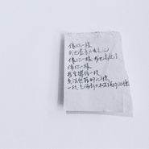

阿纠
============================

|  |  |
| :--: | :-- |
| [ 阿纠](https://i.xiami.com/joy) | **播放数**: 1757056 **粉丝数**: 278 **评论数**: 84 **地区**: China 中国大陆 **风格**: 流行 Pop, 根源唱作人 Singer-Songwriter  |

## 档案

追寻灵感留下的痕迹。 
谁知道那些属于你的音符会在何时出现呢。 
就只是在 孤寂的时候 
学会了开始寻找而已。

## 专辑

| 名称 | 语种 | 唱片公司 | 发行时间 | 专辑类别 | 专辑风格 |
| :--: | :-- | :-- | :-- | :-- | :-- |
| [ 关于你的书原曲：떠난다（离开） - 박보영（朴宝英）](./albums/2104481334.md) | 国语 |  | 2019年01月10日 | EP, 单曲 | 民谣流行 Folk Pop |
| [ FIND YOU找到你](./albums/2104035836.md) | 国语 | 独立发行 | 2018年09月09日 | 录音室专辑 | 流行 Pop, 国语流行 Mandarin Pop, 根源唱作人 Singer-Songwriter |
| [ 未動心翻唱集](./albums/2103491856.md) | 国语 | 独立发行 | 2018年01月16日 | 合集, 杂锦 | 流行 Pop, 国语流行 Mandarin Pop, 民谣流行 Folk Pop |

## 评论

|  |  |  |  |
| :-- | :-- | :-- | :-- |
|  [虾米用户](https://emumo.xiami.com/u/2527184)  2019-07-24 22:33 赞(0) 踩(0) | 
很好听的声音，可以多唱唱英文歌啊，一定很好听 
 |
|  [虾米用户](https://emumo.xiami.com/u/201980789) 我还没想好要写什么... 2019-07-18 14:52 赞(0) 踩(0) | 
好听哦
 |
|  [虾米用户](https://emumo.xiami.com/u/294027867)  2019-04-10 21:36 赞(0) 踩(0) | 
good
 |
|  [虾米用户](https://emumo.xiami.com/u/110604418) 我还没想好要写什么... 2018-09-16 21:36 赞(0) 踩(0) | 
你好像日本的一个影星。
 |
| ⇒ |  [虾米用户](https://emumo.xiami.com/u/953975) Real 2018-09-17 13:02 赞(0) 踩(0) | 
|･&amp;omega;･｀)？？谁
 |
| ⇒ |  [虾米用户](https://emumo.xiami.com/u/110604418) 我还没想好要写什么... 2018-09-17 14:17 赞(0) 踩(0) | 
<q><b>阿纠说：</b></q>
 |
| ⇒ |  [虾米用户](https://emumo.xiami.com/u/953975) Real 2018-09-17 18:41 赞(0) 踩(0) | 
也有人这么说过～
 |
| ⇒ |  [虾米用户](https://emumo.xiami.com/u/110604418) 我还没想好要写什么... 2018-09-18 22:41 赞(0) 踩(0) | 
<q><b>阿纠说：</b></q>
 |
|  [虾米用户](https://emumo.xiami.com/u/322523580) 夜空 总有更大密度的蓝色 2018-09-16 19:44 赞(0) 踩(0) | 
小姐姐好厉害啊   我也福州的 
 |
| ⇒ |  [虾米用户](https://emumo.xiami.com/u/953975) Real 2018-09-17 13:03 赞(0) 踩(0) | 
我现在在厦门啦。
 |
| ⇒ |  [虾米用户](https://emumo.xiami.com/u/322523580) 夜空 总有更大密度的蓝色 2018-09-17 18:38 赞(0) 踩(0) | 
<q><b>阿纠说：</b></q>
 |
| ⇒ |  [虾米用户](https://emumo.xiami.com/u/953975) Real 2018-09-17 21:49 赞(0) 踩(0) | 
<q><b>Plum Rain.说：</b></q>
 |
|  [虾米用户](https://emumo.xiami.com/u/256132569)  2018-08-15 02:26 赞(0) 踩(0) | 
唱的好
 |
| ⇒ |  [虾米用户](https://emumo.xiami.com/u/953975) Real 2018-09-17 22:11 赞(0) 踩(0) | 
谢谢你-3-
 |
|  [虾米用户](https://emumo.xiami.com/u/244906483)  2018-06-13 11:14 赞(0) 踩(0) | 
问下小姐姐你有用微博吗
 |
| ⇒ |  [虾米用户](https://emumo.xiami.com/u/953975) Real 2018-06-13 11:15 赞(0) 踩(0) | 
-DearJoy- 这个哦。
 |
|  [虾米用户](https://emumo.xiami.com/u/92563264) 我还没想好要写什么... 2018-04-17 21:05 赞(0) 踩(0) | 
加油 
 |
| ⇒ |  [虾米用户](https://emumo.xiami.com/u/953975) Real 2018-09-17 22:12 赞(0) 踩(0) | 
比❤️
 |
|  [虾米用户](https://emumo.xiami.com/u/225405296) 吉他哦~ 2016-09-12 00:45 赞(0) 踩(0) | 
好听哦
 |
| ⇒ |  [虾米用户](https://emumo.xiami.com/u/953975) Real 2016-09-12 15:11 赞(0) 踩(0) | 
-3- 谢谢~~
 |
|  [虾米用户](https://emumo.xiami.com/u/32432270) 时光你慢点走，让我抓住你... 2016-09-12 00:10 赞(0) 踩(0) | 
加油 
 |
| ⇒ |  [虾米用户](https://emumo.xiami.com/u/953975) Real 2016-09-12 15:11 赞(0) 踩(0) | 
谢谢：）我加油！
 |
|  [虾米用户](https://emumo.xiami.com/u/15817687) 流行音乐作词人 2016-02-23 10:52 赞(0) 踩(0) | 
嘿~美美哒
 |
| ⇒ |  [虾米用户](https://emumo.xiami.com/u/953975) Real 2016-02-23 14:24 赞(0) 踩(0) | 
(&amp;gt;_&amp;lt;)么！么！哒！
 |
|  [虾米用户](https://emumo.xiami.com/u/13829347)  2015-03-03 07:17 赞(0) 踩(0) | 
嘿，你好棒
 |
| ⇒ |  [虾米用户](https://emumo.xiami.com/u/953975) Real 2015-03-17 14:57 赞(0) 踩(0) | 
谢谢(￣3￣)ノ
 |
|  [虾米用户](https://emumo.xiami.com/u/11431795)  2015-02-02 10:41 赞(0) 踩(0) | 
纠纠我来了
 |
| ⇒ |  [虾米用户](https://emumo.xiami.com/u/953975) Real 2015-02-28 11:36 赞(0) 踩(0) | 
=3=
 |
|  [虾米用户](https://emumo.xiami.com/u/6111570) 我想请你吃雪糕 2014-12-10 12:38 赞(2) 踩(0) | 
萌萌哒的吉他妹纸 <a href="http://emumo.xiami.com/u/29230195" target="_blank" rel="nofollow" name_card="29230195">@akakwantsent13</a>
 |
| ⇒ |  [虾米用户](https://emumo.xiami.com/u/29230195) Gubba nub nu... 2014-12-10 17:54 赞(0) 踩(0) | 
&amp;gt;.&amp;lt;
 |
|  [虾米用户](https://emumo.xiami.com/u/44155053) qwq 2014-11-29 12:44 赞(0) 踩(0) | 
qwq啊啊啊啊各种好听循环播放根本停不下来！qwq
 |
| ⇒ |  [虾米用户](https://emumo.xiami.com/u/953975) Real 2014-12-01 09:36 赞(0) 踩(0) | 
QAQ呜呜唱的太弱了，我要加油了！！谢谢你：）
 |
| ⇒ |  [虾米用户](https://emumo.xiami.com/u/44155053) qwq 2014-12-23 13:36 赞(0) 踩(0) | 
<q><b>阿纠说：</b></q>
 |
|  [虾米用户](https://emumo.xiami.com/u/21013881) 别当虾米不是海鲜丶 2014-11-16 11:31 赞(0) 踩(0) | 
声音好听，人漂亮。希望多多完善  期待中。。。。。
 |
| ⇒ |  [虾米用户](https://emumo.xiami.com/u/953975) Real 2014-11-22 13:16 赞(0) 踩(0) | 
：）好
 |
|  [虾米用户](https://emumo.xiami.com/u/2400216)  2014-11-03 22:16 赞(0) 踩(0) | 
你找到合作伙伴没？
 |
| ⇒ |  [虾米用户](https://emumo.xiami.com/u/953975) Real 2014-11-03 22:31 赞(0) 踩(0) | 
没有呢....
 |
| ⇒ |  [虾米用户](https://emumo.xiami.com/u/2400216)  2014-11-03 22:31 赞(0) 踩(0) | 
<q><b>阿纠说：</b></q>
 |
|  [虾米用户](https://emumo.xiami.com/u/41622222) 我还没想好要写什么... 2014-11-01 16:22 赞(0) 踩(0) | 
赞赞的
 |
|  [虾米用户](https://emumo.xiami.com/u/41622222) 我还没想好要写什么... 2014-11-01 16:22 赞(0) 踩(0) | 
喜欢你的歌！！加油！
 |
| ⇒ |  [虾米用户](https://emumo.xiami.com/u/953975) Real 2014-11-04 18:01 赞(0) 踩(0) | 
: D 我加油！
 |
|  [虾米用户](https://emumo.xiami.com/u/32320260) kiss me 2014-11-01 11:20 赞(0) 踩(0) | 
拥有~
 |
| ⇒ |  [虾米用户](https://emumo.xiami.com/u/953975) Real 2015-03-31 11:10 赞(0) 踩(0) | 
~\(≧▽≦)/~啊呀呀，我就说在哪里见过你！我前几天还听了你的歌单！
 |
| ⇒ |  [虾米用户](https://emumo.xiami.com/u/32320260) kiss me 2015-03-31 11:23 赞(0) 踩(0) | 
<q><b>阿纠说：</b></q>
 |
| ⇒ |  [虾米用户](https://emumo.xiami.com/u/953975) Real 2015-03-31 11:40 赞(0) 踩(0) | 
<q><b>Hanabi说：</b></q>
 |
|  [虾米用户](https://emumo.xiami.com/u/32320260) kiss me 2014-10-29 12:05 赞(0) 踩(0) | 
从群里蹦过来关注你
 |
| ⇒ |  [虾米用户](https://emumo.xiami.com/u/953975) Real 2014-10-30 16:40 赞(0) 踩(0) | 
谢谢QAQ！！！！
 |
|  [虾米用户](https://emumo.xiami.com/u/4826663) 感谢您的这个浮躁的世界里... 2014-10-25 18:07 赞(0) 踩(0) | 
你好，我给你投票了，回投一个呗！【王磊】《三十年》现在项目人气榜14位
 |
|  [虾米用户](https://emumo.xiami.com/u/1551412)  2014-10-25 12:57 赞(0) 踩(0) | 
喵
 |
| ⇒ |  [虾米用户](https://emumo.xiami.com/u/953975) Real 2014-10-25 16:40 赞(0) 踩(0) | 
喵喵喵！
 |
|  [虾米用户](https://emumo.xiami.com/u/21013881) 别当虾米不是海鲜丶 2014-10-25 09:24 赞(0) 踩(0) | 
早上好。
 |
| ⇒ |  [虾米用户](https://emumo.xiami.com/u/953975) Real 2014-10-25 11:41 赞(0) 踩(0) | 
早上好呀！~\(≧▽≦)/~
 |
| ⇒ |  [虾米用户](https://emumo.xiami.com/u/21013881) 别当虾米不是海鲜丶 2014-11-16 11:30 赞(0) 踩(0) | 
<q><b>阿纠说：</b></q>
 |
|  [虾米用户](https://emumo.xiami.com/u/21013881) 别当虾米不是海鲜丶 2014-10-24 15:19 赞(0) 踩(0) | 
听声音 感觉很不错哦。
 |
|  [虾米用户](https://emumo.xiami.com/u/16579470) 三体 不动心 2014-10-24 04:32 赞(0) 踩(0) | 
怎么关注啊
 |
| ⇒ |  [虾米用户](https://emumo.xiami.com/u/953975) Real 2014-10-24 09:37 赞(0) 踩(0) | 
点头像下方的收藏都音乐库噢！
 |
|  [虾米用户](https://emumo.xiami.com/u/3499015) 我还没想好要写什么... 2014-10-23 23:00 赞(0) 踩(0) | 
纠~~~
 |
| ⇒ |  [虾米用户](https://emumo.xiami.com/u/953975) Real 2014-10-24 10:16 赞(0) 踩(0) | 
耶耶耶！
 |
|  [虾米用户](https://emumo.xiami.com/u/11431795)  2014-10-22 15:56 赞(0) 踩(0) | 
啊纠我是你的脑残粉
 |
| ⇒ |  [虾米用户](https://emumo.xiami.com/u/953975) Real 2014-10-23 09:42 赞(0) 踩(0) | 
哈哈干嘛这样（我还蛮开心的....)
 |
|  [虾米用户](https://emumo.xiami.com/u/9825733)   2014-10-22 12:12 赞(0) 踩(0) | 
……………………头像有种违和感怎么回事啊我
 |
| ⇒ |  [虾米用户](https://emumo.xiami.com/u/953975) Real 2014-10-22 12:27 赞(0) 踩(0) | 
↑哈哈哈哈。封面作者在这里（拍桌）
 |
| ⇒ |  [虾米用户](https://emumo.xiami.com/u/9825733)   2014-10-22 21:25 赞(0) 踩(0) | 
<q><b>阿纠说：</b></q>
 |
|  [虾米用户](https://emumo.xiami.com/u/9825733)   2014-10-22 12:11 赞(0) 踩(0) | 
嘿嘿
 |
|  [虾米用户](https://emumo.xiami.com/u/8089221) ずっと 忘れずに 進むの 2014-10-22 09:10 赞(0) 踩(0) | 
期待哦 阿糾的新唱片
 |
| ⇒ |  [虾米用户](https://emumo.xiami.com/u/953975) Real 2014-10-22 12:28 赞(0) 踩(0) | 
恩！一起来期待一下
 |
|  [虾米用户](https://emumo.xiami.com/u/1180294)  2014-10-22 08:20 赞(0) 踩(0) | 
循环：）
 |
|  [虾米用户](https://emumo.xiami.com/u/1180294)  2014-10-15 13:23 赞(0) 踩(0) | 
那首歌原来叫 落单 了，一直一直哼唱我是谁）
 |
| ⇒ |  [虾米用户](https://emumo.xiami.com/u/953975) Real 2014-10-15 13:26 赞(0) 踩(0) | 
=3=呜呜呜，
 |
|  [虾米用户](https://emumo.xiami.com/u/15806881) 梦想 我依然记得 2014-09-25 14:47 赞(0) 踩(0) | 
没新歌  不开心~~~
 |
| ⇒ |  [虾米用户](https://emumo.xiami.com/u/953975) Real 2014-09-25 17:49 赞(0) 踩(0) | 
OAO....
 |
|  [虾米用户](https://emumo.xiami.com/u/1601163) 再会 2014-08-25 09:58 赞(0) 踩(0) | 
忘了ORZ  生日快乐（昨天）
 |
|  [虾米用户](https://emumo.xiami.com/u/1601163) 再会 2014-08-25 09:57 赞(0) 踩(0) | 
干巴爹 8月30号时间不够的话可以继续延后的 因为H姬那边也是时间不够
 |
|  [虾米用户](https://emumo.xiami.com/u/6111570) 我想请你吃雪糕 2014-06-04 18:37 赞(0) 踩(0) | 
好顶赞！
 |
|  [虾米用户](https://emumo.xiami.com/u/1601163) 再会 2014-05-17 12:03 赞(0) 踩(0) | 
(*´ｪ`*)
 |
| ⇒ |  [虾米用户](https://emumo.xiami.com/u/953975) Real 2014-05-18 14:21 赞(0) 踩(0) | 
啊啊啊TAT 大神光临！orz（跪！）
 |
|  [虾米用户](https://emumo.xiami.com/u/495034) 新歌会陆续发布在  街声... 2013-11-19 00:21 赞(0) 踩(0) | 
feel good！
 |
|  [虾米用户](https://emumo.xiami.com/u/4253084) 上帝与你同在 2013-08-24 12:09 赞(0) 踩(0) | 
生日快乐~
 |
| ⇒ |  [虾米用户](https://emumo.xiami.com/u/953975) Real 2013-08-25 11:35 赞(0) 踩(0) | 
=3= 謝謝！
 |
|  [虾米用户](https://emumo.xiami.com/u/6892945) Voltka 2013-07-14 00:18 赞(0) 踩(0) | 
：）
 |
|  [虾米用户](https://emumo.xiami.com/u/11302954) 无所求时，无所不有。 2013-07-10 10:00 赞(0) 踩(0) | 
好评+1
 |
|  [虾米用户](https://emumo.xiami.com/u/2288372) 我还没想好要写什么... 2013-07-09 20:04 赞(0) 踩(0) | 
: )好评
 |
|  [虾米用户](https://emumo.xiami.com/u/8089221) ずっと 忘れずに 進むの 2013-07-08 08:05 赞(0) 踩(0) | 
：）
 |
|  [虾米用户](https://emumo.xiami.com/u/953975) Real 2013-07-07 17:50 赞(1) 踩(0) | 
: )
 |
