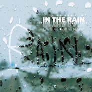

康硕Kenny
============================

|  |  |
| :--: | :-- |
| [ 康硕Kenny](https://i.xiami.com/kenny) | **地区**: China 中国大陆 **风格**: 轻音乐 Easy Listening, 指弹吉他, Fingerstyle **播放数**: 5787877 **粉丝数**: 3665 **评论数**: 97  |

## 档案

康 硕（吉他玩家Kenny），原声指弹（Fingerstyle）吉他乐手，独立音乐人。自幼学习小提琴，99年开始接触吉他，2002年开始接触原声吉他，演奏风格受Michael Hedges和押尾光太郎等多位演奏家影响，曲目中融入多种演奏技巧，并且不断的尝试让吉他的演奏多元化，在不同的曲风中找到自己的风格。 
新浪微博：@吉他玩家Kenny 
http://weibo.com/kangshuo 
豆瓣音乐人： 
http://site.douban.com/kangshuo 
优酷视频： 
http://i.youku.com/kennykang 
网易云音乐：康硕Kenny

## 专辑

| 名称 | 语种 | 唱片公司 | 发行时间 | 专辑类别 | 专辑风格 |
| :--: | :-- | :-- | :-- | :-- | :-- |
| [ Play for you](./albums/2105327495.md) | 其他 |  | 2019年10月10日 | EP, 单曲 | 轻音乐 Easy Listening |
| [ City Of Loneliness](./albums/2104942300.md) | 纯音乐 |  | 2019年06月13日 | EP, 单曲 | 器乐流行 Instrumental Pop |
| [ K.R.S With LoveGuitar Music Collection](./albums/2102820711.md) | 纯音乐 | 独立发行 | 2017年04月08日 | 录音室专辑 | 轻音乐 Easy Listening, 器乐独奏 Solo Instrumental |
| [ 在雨中Fingerstyle Guitar Ver.](./albums/2102706336.md) | 国语 | 独立发行 | 2017年03月08日 | EP, 单曲 | 器乐独奏 Solo Instrumental |
| [ I Love You More Than Mr. Children](./albums/2102705510.md) | 国语 | 独立发行 | 2017年03月05日 | EP, 单曲 |  |
| [ While My Guitar Gently WeepsA tribute to George Harrison by Kenny](./albums/2102705509.md) | 国语 | 独立发行 | 2017年02月10日 | EP, 单曲 |  |
| [ Let Guitar Be Your Friend讓吉他成為你的朋友（吉他輕音樂改編＋精選）](./albums/300933746.md) | 国语 | 独立发行 | 2014年03月03日 | 精选集 | 国语流行 Mandarin Pop |

## 评论

|  |  |  |
| :-- | :-- | :-- |
|  [虾米用户](https://emumo.xiami.com/u/87827600) 山水两相忘，日月无瓜葛；... 2020-08-31 18:40 赞(1) 踩(0) | 
不希望他因为太多人的崇拜而分心，更不希望他因为提升自己的名望而参加过多的活动。这样美妙的感觉只有在良好安静氛围下才能做的精致。希望他把更多的时间与精力放在专心音乐上面，为广大听众带来更多精良作品！
 |
|  [虾米用户](https://emumo.xiami.com/u/426068809)  2020-03-14 22:28 赞(1) 踩(0) | 
彈得好聽好昕，年輕有為揀直就是前途無量，
 |
|  [虾米用户](https://emumo.xiami.com/u/439940495)  2020-01-29 12:03 赞(0) 踩(0) | 
你好，我买了你的喜剧之王音乐，怎么下载不了啊！我想弄到电脑里
 |
|  [虾米用户](https://emumo.xiami.com/u/5555764) 阿Ken 2019-11-19 00:50 赞(1) 踩(0) | 
弹得真棒
 |
|  [虾米用户](https://emumo.xiami.com/u/32231879) Eine kosmisc... 2019-10-27 09:41 赞(0) 踩(0) | 
彈呲了
 |
|  [虾米用户](https://emumo.xiami.com/u/10537792)  2019-10-15 10:23 赞(0) 踩(0) | 

 |
|  [虾米用户](https://emumo.xiami.com/u/428524263)  2019-08-24 00:32 赞(2) 踩(0) | 
在喧嚣的城市中能听到如此美妙的音乐真的很感动，加油，永远支持你  
 |
|  [虾米用户](https://emumo.xiami.com/u/325382910) 音魂不散 2019-05-19 06:39 赞(0) 踩(0) | 
下载不了收费
 |
|  [虾米用户](https://emumo.xiami.com/u/264232965)  2019-04-08 16:30 赞(0) 踩(0) | 
怎么你不见了呢
 |
|  [虾米用户](https://emumo.xiami.com/u/272665318)  2019-03-06 20:39 赞(0) 踩(0) | 
nice keep up good work
 |
|  [虾米用户](https://emumo.xiami.com/u/3108488)  2018-10-30 09:55 赞(0) 踩(0) | 
哇哦
 |
|  [虾米用户](https://emumo.xiami.com/u/344250636) 我还没想好要写什么... 2018-05-24 14:24 赞(3) 踩(0) | 
坚持下去，有我们在听
 |
|  [虾米用户](https://emumo.xiami.com/u/31028791) 网易和q也是神圣剑帝 2018-05-10 03:00 赞(1) 踩(0) | 
      [文字cool]
 |
|  [虾米用户](https://emumo.xiami.com/u/20177386) 感谢一切美好的遇见❤️ 2018-02-23 11:34 赞(1) 踩(0) | 

 |
|  [虾米用户](https://emumo.xiami.com/u/102649684) 如果我死了 2017-12-26 03:32 赞(0) 踩(0) | 
棒
 |
|  [虾米用户](https://emumo.xiami.com/u/13218202) God is love 2017-12-06 02:19 赞(0) 踩(0) | 
加油 
 |
|  [虾米用户](https://emumo.xiami.com/u/1546167) 钧钧大魔王 2017-11-04 14:04 赞(0) 踩(0) | 
久违的声音
 |
|  [虾米用户](https://emumo.xiami.com/u/247175288)  2017-10-08 21:48 赞(0) 踩(0) | 
好听
 |
|  [虾米用户](https://emumo.xiami.com/u/15477519) 爱  是生命的和弦，而不... 2017-09-26 10:19 赞(2) 踩(0) | 

 |
|  [虾米用户](https://emumo.xiami.com/u/11865257) Stanley 2017-06-06 14:43 赞(0) 踩(0) | 
喜欢原音
 |
| ⇒ |  [虾米用户](https://emumo.xiami.com/u/311355726)  2017-07-15 22:12 赞(0) 踩(0) | 

 |
|  [虾米用户](https://emumo.xiami.com/u/293254433) 一阵风 2017-05-26 11:10 赞(0) 踩(0) | 
两把吉他
 |
|  [虾米用户](https://emumo.xiami.com/u/235244132) 不过随便说说 2017-05-13 08:38 赞(0) 踩(0) | 
那个喜剧之王的bug真是没谁了
 |
| ⇒ |  [虾米用户](https://emumo.xiami.com/u/276843473)  2017-09-08 09:37 赞(0) 踩(0) | 
Bug？？？
 |
|  [虾米用户](https://emumo.xiami.com/u/1995528)  2017-04-16 10:55 赞(6) 踩(0) | 
很多年前新浪微博互粉的朋友，不过后来被我清零粉丝了（捂脸）。。没有刻意听。。听了一些其它的吉他原创，突然觉得不对，找出你的来听，终于知道差别在哪，原来你的琴声这么美妙，总带着一种独特完整的旋律，节奏感。很流畅很优雅、很安静。
 |
|  [虾米用户](https://emumo.xiami.com/u/281256837) 半面张国荣 2017-04-09 10:55 赞(0) 踩(0) | 
非常厉害的高手。
 |
|  [虾米用户](https://emumo.xiami.com/u/277686537)  2017-03-27 17:47 赞(0) 踩(0) | 
满好听的。
 |
|  [虾米用户](https://emumo.xiami.com/u/44636422) 爱我所爱，即便杂乱无章。 2017-03-22 01:03 赞(1) 踩(0) | 
厉害了
 |
|  [虾米用户](https://emumo.xiami.com/u/282079704)  2017-03-21 19:17 赞(0) 踩(0) | 
好听 
 |
|  [虾米用户](https://emumo.xiami.com/u/48433272)  2017-03-20 15:40 赞(0) 踩(0) | 
音乐很好，喜欢。
 |
|  [虾米用户](https://emumo.xiami.com/u/47604900) 我爱你   2017-02-23 12:41 赞(0) 踩(0) | 
m
 |
|  [虾米用户](https://emumo.xiami.com/u/253330496)   2017-01-28 10:12 赞(0) 踩(0) | 
[带墨镜笑][带墨镜笑][带墨镜笑]
 |
|  [虾米用户](https://emumo.xiami.com/u/30418572)  2017-01-22 12:18 赞(0) 踩(0) | 
为什么弹的东西像押尾，人也像  
 |
|  [虾米用户](https://emumo.xiami.com/u/9003931) 千淘万漉虽辛苦 2017-01-17 13:52 赞(0) 踩(0) | 
有点意思。
 |
|  [虾米用户](https://emumo.xiami.com/u/49640493) 网易云SAINTDONT... 2017-01-02 23:21 赞(1) 踩(0) | 

 |
|  [虾米用户](https://emumo.xiami.com/u/10143083)   2017-01-02 10:53 赞(0) 踩(0) | 
从啪啪上认识、关注的，一直很喜欢，加油 
 |
|  [虾米用户](https://emumo.xiami.com/u/255355152)  2016-12-18 22:04 赞(1) 踩(0) | 
吉他王子
 |
|  [虾米用户](https://emumo.xiami.com/u/96265784)  2016-10-05 04:21 赞(0) 踩(0) | 
真的不错啊。 很有功底。
 |
|  [虾米用户](https://emumo.xiami.com/u/228922042)  2016-09-22 18:59 赞(1) 踩(0) | 
因为听了喜剧之王 下载了虾米app，希望多谈些慢节奏的。
 |
|  [虾米用户](https://emumo.xiami.com/u/16745497) 我还没想好要写什么... 2016-09-10 22:10 赞(1) 踩(0) | 
多出点原创吧。喜剧之王弹得NICE..
 |
|  [虾米用户](https://emumo.xiami.com/u/3579368) lanyuner 2016-08-17 22:29 赞(0) 踩(0) | 
纯正，干净，好听。期待新作品.
 |
|  [虾米用户](https://emumo.xiami.com/u/21711285) 随意听，不要怀旧！ 2016-06-15 10:34 赞(1) 踩(0) | 
第一感觉，造型是山寨Kotaro的...
 |
|  [虾米用户](https://emumo.xiami.com/u/4162493)  2016-06-10 18:08 赞(2) 踩(0) | 
有没有吉它谱可以分享？多谢。
 |
|  [虾米用户](https://emumo.xiami.com/u/20397849) 我想她应该会懂得如何睡梦... 2016-06-01 15:46 赞(0) 踩(0) | 
太厉害了
 |
|  [虾米用户](https://emumo.xiami.com/u/20397849) 我想她应该会懂得如何睡梦... 2016-06-01 15:45 赞(0) 踩(0) | 
太棒了
 |
|  [虾米用户](https://emumo.xiami.com/u/1143360) 到头来 还是感谢虾米一切... 2016-05-09 20:44 赞(0) 踩(0) | 
听着Demo 猛刷试题哈哈哈 室友也吵不到我 耶耶耶耶～
 |
|  [虾米用户](https://emumo.xiami.com/u/77062208) 叫我日本吉他爸爸 2016-04-20 23:34 赞(0) 踩(0) | 
支持！期待demo变成新专辑！
 |
|  [虾米用户](https://emumo.xiami.com/u/1499382)   2016-03-15 10:59 赞(0) 踩(0) | 
喜剧之王原声Silent Open 不错
 |
|  [虾米用户](https://emumo.xiami.com/u/20963878)  2016-03-14 19:41 赞(0) 踩(0) | 
很纯 很干静 真好听
 |
|  [虾米用户](https://emumo.xiami.com/u/53583591) 努力做自己 2016-02-12 22:10 赞(0) 踩(0) | 
带着晨光的吉他声
 |
|  [虾米用户](https://emumo.xiami.com/u/9558734)  2016-01-12 10:37 赞(2) 踩(0) | 
lv先生推荐了他的吉他版爱的代价，然后就一发不可收拾的喜欢上了他的吉他！
 |
|  [虾米用户](https://emumo.xiami.com/u/42396076) 四年三厘米 2015-12-03 16:02 赞(0) 踩(0) | 
666
 |
|  [虾米用户](https://emumo.xiami.com/u/14632147)  2015-11-22 08:32 赞(0) 踩(0) | 
好听
 |
|  [虾米用户](https://emumo.xiami.com/u/20286400)  2015-10-17 16:04 赞(1) 踩(0) | 
头像竟有几分相似年轻的押尾....看到学历跪了
 |
|  [虾米用户](https://emumo.xiami.com/u/681476) 衣不如新，人不如故 2015-09-07 14:12 赞(1) 踩(0) | 
呜哇校友&amp;gt; &amp;lt;，音乐很棒！
 |
|  [虾米用户](https://emumo.xiami.com/u/681476) 衣不如新，人不如故 2015-09-07 14:12 赞(0) 踩(0) | 
呜哇校友&amp;gt; &amp;lt;，音乐很棒！
 |
|  [虾米用户](https://emumo.xiami.com/u/32287757) 签名限制字数太少啦啊喂！ 2015-08-16 10:18 赞(2) 踩(0) | 
至今仍记得Kenny哥哥说的“一日为师终生为父”，也许你的一句话一堂课就能影响我的人生，好几年不见了居然真的找到了你的专辑，当年在清华园旁边吃饭的场景还记得吗，哭瞎
 |
|  [虾米用户](https://emumo.xiami.com/u/32287757) 签名限制字数太少啦啊喂！ 2015-08-16 10:11 赞(17) 踩(0) | 
Kenny哥哥已消失很久谁知道他去哪儿了   
 |
| ⇒ |  [虾米用户](https://emumo.xiami.com/u/225704078) 如果世界太危险，只有音乐... 2018-12-06 21:49 赞(0) 踩(0) | 
去远行了
 |
|  [虾米用户](https://emumo.xiami.com/u/10006020) 很难 2015-08-16 00:32 赞(0) 踩(0) | 
牛逼
 |
|  [虾米用户](https://emumo.xiami.com/u/33733961)  2015-08-05 16:56 赞(0) 踩(0) | 
清，雅。 加油，前途无量。
 |
|  [虾米用户](https://emumo.xiami.com/u/38714982) 自由比享乐更重要 2015-07-26 01:04 赞(0) 踩(0) | 
硕哥你一直都是我的崇拜偶像 
 |
|  [虾米用户](https://emumo.xiami.com/u/48679970) 嘀嗒嘀嗒 2015-07-04 23:35 赞(0) 踩(0) | 
希望你能火   ，很有感
 |
|  [虾米用户](https://emumo.xiami.com/u/50343522)  2015-05-29 18:13 赞(0) 踩(0) | 
太棒啦！！
 |
|  [虾米用户](https://emumo.xiami.com/u/4400366) 再也不见 2015-05-25 01:45 赞(2) 踩(0) | 
囍
 |
|  [虾米用户](https://emumo.xiami.com/u/12208199)  2015-05-20 01:30 赞(0) 踩(0) | 
超爱纯纯的吉他声
 |
|  [虾米用户](https://emumo.xiami.com/u/43628651) 很久很久以前，我们像吉普... 2015-05-14 18:04 赞(2) 踩(0) | 
每首歌都能弹出干净的晨曦的感觉，这个味道，我喜欢
 |
|  [虾米用户](https://emumo.xiami.com/u/48673438)  2015-05-09 21:23 赞(2) 踩(0) | 
康硕应该是国内最有才华的指弹吉他演奏者
 |
|  [虾米用户](https://emumo.xiami.com/u/8128176) 好好活着 2015-04-27 13:14 赞(0) 踩(0) | 
支持
 |
|  [虾米用户](https://emumo.xiami.com/u/47330932) SSSSmile~ 2015-03-22 10:38 赞(0) 踩(0) | 
棒棒哒
 |
|  [虾米用户](https://emumo.xiami.com/u/47330932) SSSSmile~ 2015-03-22 10:38 赞(1) 踩(0) | 
又是一个清华哥哥
 |
|  [虾米用户](https://emumo.xiami.com/u/48015061)  2015-03-10 20:07 赞(0) 踩(0) | 
真不错''''''崔丝邦迪范儿'加油'
 |
|  [虾米用户](https://emumo.xiami.com/u/44349624)  2015-02-06 21:20 赞(0) 踩(0) | 
怎么沒有灰色轨迹呀?在那可下载
 |
|  [虾米用户](https://emumo.xiami.com/u/10484379) 一花一世界 2015-02-04 14:26 赞(0) 踩(0) | 
牵手
 |
|  [虾米用户](https://emumo.xiami.com/u/7907043) 酷 坏 帅 2015-01-31 09:38 赞(0) 踩(0) | 
都是天蝎座哦
 |
|  [虾米用户](https://emumo.xiami.com/u/374108) 我爱我爱你 2015-01-30 12:29 赞(0) 踩(0) | 
kang
 |
|  [虾米用户](https://emumo.xiami.com/u/44034878)  2015-01-20 22:22 赞(0) 踩(0) | 
爱你哦❤
 |
|  [虾米用户](https://emumo.xiami.com/u/9327494) http://www.x... 2014-09-21 00:31 赞(0) 踩(0) | 
love
 |
|  [虾米用户](https://emumo.xiami.com/u/18983247) uuuuuuuuuuuu... 2014-08-28 18:12 赞(0) 踩(0) | 
喜欢啊
 |
|  [虾米用户](https://emumo.xiami.com/u/16745497) 我还没想好要写什么... 2014-08-04 10:16 赞(0) 踩(0) | 
～～～
 |
|  [虾米用户](https://emumo.xiami.com/u/8492393) IDoBelieveIn 2014-08-02 13:35 赞(0) 踩(0) | 
刚看到微信跑来收藏主页了，没想到已经有这么多粉丝了，果然到哪里都是一样火啊^ ^
 |
|  [虾米用户](https://emumo.xiami.com/u/9946063) 空谈误国。实干兴邦 2014-07-20 18:37 赞(2) 踩(0) | 
<a href="http://emumo.xiami.com/u/5076044" target="_blank" rel="nofollow" name_card="5076044">@kenny</a>
 |
|  [虾米用户](https://emumo.xiami.com/u/31472672) 长草 2014-06-28 02:22 赞(0) 踩(0) | 
佩服
 |
|  [虾米用户](https://emumo.xiami.com/u/5469840)  2014-05-31 00:11 赞(0) 踩(0) | 
不小心找到的，还好
 |
|  [虾米用户](https://emumo.xiami.com/u/7307585) 悲伤是爱的代价 2014-05-29 03:59 赞(0) 踩(0) | 
从啪啪一路跟过来，喜欢
 |
|  [虾米用户](https://emumo.xiami.com/u/4926807) 你会变成这样都是我害的 2014-05-24 17:44 赞(0) 踩(0) | 
有点屌……加油
 |
|  [虾米用户](https://emumo.xiami.com/u/1034502)  2014-04-14 12:30 赞(0) 踩(0) | 
国内吉他达人..
 |
|  [虾米用户](https://emumo.xiami.com/u/12920387) 以上学的心态认真听歌 2014-04-10 11:00 赞(3) 踩(0) | 
真牛啊，这学历还能弹这么好的吉他。。。。。。。看来时间管理的很好，精力够充沛的。。。。。
 |
|  [虾米用户](https://emumo.xiami.com/u/7993832) 这家伙很懒....... 2014-02-28 23:50 赞(0) 踩(0) | 
豆瓣好象还可以下载你的音乐
 |
|  [虾米用户](https://emumo.xiami.com/u/11972461)  2013-12-06 01:05 赞(0) 踩(0) | 
同龄人啊，居然有荒野大镖客，怀念
 |
|  [虾米用户](https://emumo.xiami.com/u/8089875)  2013-10-17 21:03 赞(0) 踩(0) | 
。。。
 |
|  [虾米用户](https://emumo.xiami.com/u/4915606)  2013-09-19 22:43 赞(0) 踩(0) | 
看到学历给跪了，当然吉他弹得也很棒
 |
|  [虾米用户](https://emumo.xiami.com/u/11897273)   2013-08-28 21:49 赞(0) 踩(0) | 
不小心看到学历=。=
 |
|  [虾米用户](https://emumo.xiami.com/u/18027668)  2013-07-26 13:38 赞(0) 踩(0) | 
追随吉他而来
 |
|  [虾米用户](https://emumo.xiami.com/u/14455219)  2013-06-19 14:53 赞(0) 踩(0) | 
大哥，听你的电台总是后面都是空的，
 |
|  [虾米用户](https://emumo.xiami.com/u/14455219)  2013-06-19 14:52 赞(0) 踩(0) | 
大哥，你的歌最后那么长的空白为什么不截掉？
 |
|  [虾米用户](https://emumo.xiami.com/u/6250802) EX 2013-05-21 13:18 赞(0) 踩(0) | 
喜欢指弹
 |
