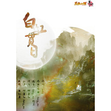

白虹贯日
============================

|  |  |
| :--: | :-- |
| [ 白虹贯日](https://emumo.xiami.com/album/488722740) | **艺人**: [小千](../index.md) **语种**: 国语 **唱片公司**: 墨明棋妙 **发行时间**: 2013年12月23日 **专辑类别**: EP, 单曲 **专辑风格**: 中国风 China-Wave **播放数**: 795303 **收藏数**: 171 **评论数**: 23  |

## 简介

## 曲目

## 评论

|  |  |  |  |
| :-- | :-- | :-- | :-- |
|  [虾米用户](https://emumo.xiami.com/u/3675791)  2016-02-20 17:22 赞(0) 踩(0) | 
标准游戏主题曲，中国式的
 |
|  [虾米用户](https://emumo.xiami.com/u/2920247)  2014-10-23 13:48 赞(0) 踩(0) | 
为毛笑傲我玩到现在都没听到过这首歌……
 |
|  [虾米用户](https://emumo.xiami.com/u/12086596) 我这人很轴 2014-08-05 06:44 赞(0) 踩(0) | 
这首歌被小千诠释的很有力度 喜欢他的声音
 |
|  [虾米用户](https://emumo.xiami.com/u/2008001) 一曲肝肠断，天涯何处觅知... 2014-05-16 20:19 赞(0) 踩(0) | 
哇 ~成龙！
 |
|  [虾米用户](https://emumo.xiami.com/u/11801275)  2014-02-23 21:22 赞(0) 踩(0) | 
确实有股游戏味儿
 |
|  [虾米用户](https://emumo.xiami.com/u/32698471)  2014-02-13 01:51 赞(0) 踩(0) | 
小千的版本霸气不失柔情，私以为是最贴合原曲的一个版本
 |
|  [虾米用户](https://emumo.xiami.com/u/8316887)  2014-01-24 10:55 赞(0) 踩(0) | 
谁能告诉我， 为毛我听过女声的叫御皇七和男声的也叫御皇七。。。虽然都好听，但是我很混乱。。。难道是亦男亦女。。好厉害喔。。。
 |
| ⇒ |  [虾米用户](https://emumo.xiami.com/u/10200698) NOW OR NEVER 2014-02-01 00:05 赞(0) 踩(0) | 
男的是小千，虾米搞错了。
 |
| ⇒ |  [虾米用户](https://emumo.xiami.com/u/8316887)  2014-02-01 19:33 赞(0) 踩(0) | 
<q><b>Cathy说：</b></q>
 |
| ⇒ |  [虾米用户](https://emumo.xiami.com/u/10200698) NOW OR NEVER 2014-02-01 19:51 赞(0) 踩(0) | 
<q><b>kokiaf4n90说：</b></q>
 |
|  [虾米用户](https://emumo.xiami.com/u/6707278) 其若杨花似雪何…… 2014-01-14 10:08 赞(1) 踩(0) | 
为毛你们都说不好 我就很费解了
 |
|  [虾米用户](https://emumo.xiami.com/u/9455189)  2014-01-06 22:26 赞(1) 踩(0) | 
小千么么么么么么这是(*´艸`*)好有feel啊啊啊啊啊
 |
| ⇒ |  [虾米用户](https://emumo.xiami.com/u/11427127)   2014-01-08 22:59 赞(0) 踩(0) | 
啊啊啊啊啊小千这版最棒了！
 |
|  [虾米用户](https://emumo.xiami.com/u/8975976) 我还没想好要写什么... 2014-01-05 19:52 赞(0) 踩(0) | 
上传的这个不是御皇七唱的= =
 |
|  [虾米用户](https://emumo.xiami.com/u/11811199) 多少唏嘘的你在人海　 2014-01-05 14:42 赞(1) 踩(0) | 
近年来墨村最荡气回肠的曲子之一了，朗朗上口，这不是御皇七唱的吧，
 |
|  [虾米用户](https://emumo.xiami.com/u/9788189)  2014-01-05 14:20 赞(1) 踩(0) | 
这不是御皇七唱的啊= =
 |
|  [虾米用户](https://emumo.xiami.com/u/8156236) 梦已醒，酒未醉，孤盏至天... 2014-01-05 13:11 赞(0) 踩(0) | 
。。。。在我不玩笑傲之后居然出了主题曲还是墨明棋妙的- -
 |
|  [虾米用户](https://emumo.xiami.com/u/2342101) 人生若只如初见 2014-01-05 10:29 赞(0) 踩(0) | 
声音不错，很有力
 |
|  [虾米用户](https://emumo.xiami.com/u/606760) 魂牵一线 2014-01-05 08:26 赞(0) 踩(0) | 
听
 |
|  [虾米用户](https://emumo.xiami.com/u/2193568)  2014-01-05 07:44 赞(0) 踩(0) | 
副歌很好听啊
 |
|  [虾米用户](https://emumo.xiami.com/u/12090386) くるくるって踊る様な こ 2014-01-05 00:14 赞(0) 踩(0) | 
总觉得后缀好low--
 |
|  [虾米用户](https://emumo.xiami.com/u/2949889) 我还没想好要写什么... 2014-01-04 23:05 赞(0) 踩(0) | 
我觉得蛮好听的啊，不难听~
 |
|  [虾米用户](https://emumo.xiami.com/u/913020) 悼词咏诵者 2014-01-04 22:57 赞(0) 踩(0) | 
沙发是我的！我的！你们别想啦！  不好听.....
 |
