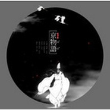

京物语
============================

|  |  |
| :--: | :-- |
| [ 京物语](https://emumo.xiami.com/album/526053588) | **艺人**: [小千](../index.md) **语种**: 国语 **唱片公司**: 独立发行 **发行时间**: 2014年04月30日 **专辑类别**: EP, 单曲 **专辑风格**: 中国风 China-Wave **播放数**: 155869 **收藏数**: 40 **评论数**: 9  |

## 简介

在日本的平安时代,明暗未分。为了平衡天地间人鬼的矛盾,存在这一类人:能观测天体宇宙,通晓阴阳万物,他们就是,在各个时代都能穿梭于现世和异界的阴阳师...

## 曲目

## 评论

|  |  |  |  |
| :-- | :-- | :-- | :-- |
|  [虾米用户](https://emumo.xiami.com/u/50786597)  2017-06-22 19:17 赞(0) 踩(0) | 
非常特别的节奏，适合特别的时候听
 |
|  [虾米用户](https://emumo.xiami.com/u/19196446) 与其彷徨，不若徜徉。 2015-08-08 00:37 赞(3) 踩(0) | 
很喜欢，前奏一起以为是和风的日文歌，然后中文出来的时候反映了半天…… 
 |
|  [虾米用户](https://emumo.xiami.com/u/13061425) 暂无签名~ 2015-03-21 00:06 赞(0) 踩(0) | 
封面不清晰我看错了吗？
 |
|  [虾米用户](https://emumo.xiami.com/u/35835226) 暂无签名~ 2015-03-20 19:17 赞(0) 踩(0) | 
挺特别的
 |
|  [虾米用户](https://emumo.xiami.com/u/11785955)  2015-03-18 10:43 赞(0) 踩(0) | 
古德
 |
|  [虾米用户](https://emumo.xiami.com/u/2421624) 最近都没怎么在听歌 2015-03-16 13:52 赞(0) 踩(0) | 
终于有了！！！
 |
|  [虾米用户](https://emumo.xiami.com/u/4400366) 再也不见 2015-03-16 00:38 赞(0) 踩(0) | 
。
 |
|  [虾米用户](https://emumo.xiami.com/u/10061385)  2015-03-16 00:05 赞(0) 踩(0) | 
这首很特别*^_^*
 |
|  [虾米用户](https://emumo.xiami.com/u/2043117) 口味很杂的 2015-03-15 16:52 赞(0) 踩(0) | 
沙发
 |
