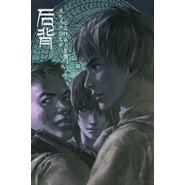

盗墓笔记·后背
============================

|  |  |
| :--: | :-- |
| [ 盗墓笔记·后背](https://emumo.xiami.com/album/526053820) | **艺人**: [小千](../index.md) **语种**: 国语 **唱片公司**: 独立发行 **发行时间**: 2014年10月26日 **专辑类别**: EP, 单曲 **专辑风格**:  **播放数**: 88804 **收藏数**: 54 **评论数**: 4  |

## 简介

多年后会不会面对一把骨灰,到那一刻也许并不会流下眼泪,只是从此再无可以依靠的后背...

## 曲目

## 评论

|  |  |  |  |
| :-- | :-- | :-- | :-- |
|  [虾米用户](https://emumo.xiami.com/u/10135097) 逃离到光年之外。 2015-03-17 13:37 赞(0) 踩(0) | 
好听
 |
|  [虾米用户](https://emumo.xiami.com/u/10061385)  2015-03-17 00:15 赞(0) 踩(0) | 
记得那次现场超有气势非常震撼o(≧v≦)o
 |
|  [虾米用户](https://emumo.xiami.com/u/43670316)   2015-03-15 19:34 赞(0) 踩(0) | 
好喜欢///
 |
|  [虾米用户](https://emumo.xiami.com/u/41173117) 暂无签名~ 2015-03-15 15:06 赞(0) 踩(0) | 
(≧▽≦)
 |
