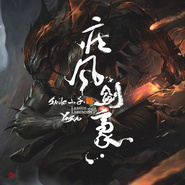

小千
============================

|  |  |
| :--: | :-- |
| [ 小千](https://i.xiami.com/xiaoqian) | **地区**: China 中国大陆 **风格**: 国语流行 Mandarin Pop **播放数**: 7334313 **粉丝数**: 4815 **评论数**: 115  |

## 档案

歌手小千，已发行个人首张原创音乐专辑《千·次元》

## 专辑

| 名称 | 语种 | 唱片公司 | 发行时间 | 专辑类别 | 专辑风格 |
| :--: | :-- | :-- | :-- | :-- | :-- |
| [ 星斗其文](./albums/2320309433.md) | 国语 | 网易云音乐 | 2020年02月23日 | EP, 单曲 |  |
| [ 真龙霸业](./albums/2103756704.md) | 国语 | 腾讯游戏 | 2018年06月26日 | EP, 单曲 |  |
| [ 蔚蓝之海](./albums/2103754394.md) | 国语 | 独立发行 | 2018年03月30日 | EP, 单曲 | 流行 Pop |
| [ 疾风剑豪](./albums/2102851376.md) | 国语 | 禾信科技 | 2017年09月05日 | EP, 单曲 |  |
| [ 初见便是永远](./albums/2102777050.md) | 国语 | 禾信科技 | 2017年07月04日 | EP, 单曲 |  |
| [ 君不知](./albums/2102851375.md) | 国语 | 独立发行 | 2017年07月01日 | EP, 单曲 |  |
| [ 一世芳华](./albums/2102735461.md) | 国语 | 禾信科技 | 2017年04月21日 | EP, 单曲 |  |
| [ 千·次元小千首张个人原创音乐专辑](./albums/2100247712.md) | 国语 | 独立发行 | 2015年12月16日 | 录音室专辑 | 国语流行 Mandarin Pop |
| [ 她](./albums/1536272296.md) | 国语 | 独立发行 | 2015年02月04日 | EP, 单曲 | 国语流行 Mandarin Pop |
| [ 盗墓笔记·后背](./albums/526053820.md) | 国语 | 独立发行 | 2014年10月26日 | EP, 单曲 |  |
| [ 誓缘](./albums/2026053759.md) | 国语 | 独立发行 | 2014年10月10日 | EP, 单曲 | 古风 GuFeng Music |
| [ 京物语](./albums/526053588.md) | 国语 | 独立发行 | 2014年04月30日 | EP, 单曲 | 中国风 China-Wave |
| [ 古巷旧事](./albums/126053711.md) | 国语 | 独立发行 | 2014年03月30日 | EP, 单曲 | 中国风 China-Wave |
| [ 故时月色](./albums/1900652521.md) | 国语 | 独立发行 | 2014年03月02日 | EP, 单曲 | 古风 GuFeng Music |
| [ 白虹贯日](./albums/488722740.md) | 国语 | 墨明棋妙 | 2013年12月23日 | EP, 单曲 | 中国风 China-Wave |
| [ 丹青误](./albums/896334387.md) | 国语 | 独立发行 | 2013年12月02日 | EP, 单曲 | 中国风 China-Wave |
| [ 琅琊榜 祭忠魂](./albums/1199450824.md) | 国语 | 独立发行 | 2013年10月26日 | EP, 单曲 |  |
| [ 邪灵](./albums/26053665.md) | 国语 | 独立发行 | 2013年09月18日 | EP, 单曲 |  |
| [ 花间旧事记盗墓笔记 解雨臣](./albums/480175266.md) | 国语 | 独立发行 | 2013年09月16日 | EP, 单曲 |  |
| [ 仙剑·醉流年](./albums/1476277908.md) | 国语 | 独立发行 | 2012年12月25日 | EP, 单曲 | 中国风 China-Wave |
| [ 无双藏剑山庄·叶炜](./albums/2076278027.md) | 国语 | 独立发行 | 2012年12月03日 | EP, 单曲 | 中国风 China-Wave |
| [ 梅子黄尽时](./albums/1899530051.md) | 国语 | 独立发行 | 2012年10月22日 | EP, 单曲 |  |
| [ 情未变](./albums/1196334423.md) | 国语 | 独立发行 | 2012年09月02日 | EP, 单曲 | 古风 GuFeng Music |

## 评论

|  |  |  |
| :-- | :-- | :-- |
|  [虾米用户](https://emumo.xiami.com/u/348858326) 之前河水只是河水 2019-11-09 16:08 赞(0) 踩(0) | 
每次听你的歌都会起鸡皮疙瘩  声音太适合古风   太温柔了
 |
|  [虾米用户](https://emumo.xiami.com/u/14747594) 大音希声 2019-07-07 13:27 赞(0) 踩(0) | 
《邪灵》真是太好听
 |
|  [虾米用户](https://emumo.xiami.com/u/224568020)  2019-04-16 07:55 赞(1) 踩(0) | 
你的很多歌都很好听，加油，继续唱自己喜欢的歌。
 |
|  [虾米用户](https://emumo.xiami.com/u/417103726)  2019-02-03 22:17 赞(1) 踩(0) | 

 |
|  [虾米用户](https://emumo.xiami.com/u/417103726)  2019-02-03 22:17 赞(1) 踩(0) | 
嘻嘻
 |
|  [虾米用户](https://emumo.xiami.com/u/402048103) 祝你百年安好，且永世孤独 2018-10-03 20:55 赞(2) 踩(0) | 
雁归来霸气侧漏加油加油
 |
|  [虾米用户](https://emumo.xiami.com/u/265879589) 落落大方，占山为王 2018-09-26 23:57 赞(1) 踩(0) | 
好听好听(ง &amp;bull;̀_&amp;bull;́)ง稀罕小千
 |
|  [虾米用户](https://emumo.xiami.com/u/9620713) 从来作春酒，未省不经年。 2018-06-11 18:25 赞(1) 踩(0) | 
往日如风怎么没了？
 |
|  [虾米用户](https://emumo.xiami.com/u/344440839)    2018-05-20 20:36 赞(1) 踩(0) | 
喜欢小千，高中前就喜欢了，不过之前没有用虾米
 |
|  [虾米用户](https://emumo.xiami.com/u/316163873)  2018-04-22 22:53 赞(1) 踩(0) | 
声音一下子就喜欢上了，加油哦
 |
|  [虾米用户](https://emumo.xiami.com/u/224402162)  2018-03-28 19:28 赞(1) 踩(0) | 
你的《白虹贯日》很喜欢
 |
|  [虾米用户](https://emumo.xiami.com/u/350491408)  2018-02-24 22:33 赞(1) 踩(0) | 
你的疾风剑豪很好听的哦，要坚持下去哦
 |
|  [虾米用户](https://emumo.xiami.com/u/342472610)  2018-01-26 20:14 赞(1) 踩(0) | 
很好听哦，一定要坚持下去。
 |
|  [虾米用户](https://emumo.xiami.com/u/3564023) 嘘 2018-01-24 18:39 赞(1) 踩(0) | 
满满的中国风
 |
|  [虾米用户](https://emumo.xiami.com/u/341179141)  2018-01-18 21:19 赞(1) 踩(0) | 
爱你哦！    
 |
|  [虾米用户](https://emumo.xiami.com/u/340705932)  2018-01-12 09:25 赞(3) 踩(0) | 
好好听，第一次听。粉上了粉上了 
 |
|  [虾米用户](https://emumo.xiami.com/u/337560165)  2017-11-28 22:09 赞(1) 踩(0) | 
2个字好听
 |
|  [虾米用户](https://emumo.xiami.com/u/334648812)  2017-11-19 10:12 赞(1) 踩(0) | 
声音好听，喜欢！
 |
|  [虾米用户](https://emumo.xiami.com/u/47670243)   2017-11-18 19:26 赞(2) 踩(0) | 
虽然长得不怎么样，但是歌是不错的
 |
|  [虾米用户](https://emumo.xiami.com/u/216578150) 只想一个人静静 2017-10-22 23:30 赞(3) 踩(0) | 
听古风好久，已圈粉~
 |
|  [虾米用户](https://emumo.xiami.com/u/330576218) 望君戚戚然，今朝思之成习... 2017-10-19 13:02 赞(2) 踩(0) | 
小千小千
 |
|  [虾米用户](https://emumo.xiami.com/u/226872929)  2017-10-07 08:28 赞(1) 踩(0) | 
加油
 |
|  [虾米用户](https://emumo.xiami.com/u/211450350)  2017-09-28 23:10 赞(2) 踩(0) | 
好棒，就喜欢这种古风，找了好久了
 |
|  [虾米用户](https://emumo.xiami.com/u/9859580)  2017-09-12 10:03 赞(1) 踩(0) | 
好听
 |
|  [虾米用户](https://emumo.xiami.com/u/318979523)  2017-08-18 15:00 赞(1) 踩(0) | 
加油
 |
|  [虾米用户](https://emumo.xiami.com/u/316286808) 愿与草木饮清茶 2017-07-31 11:32 赞(2) 踩(0) | 
彼此彼此
 |
|  [虾米用户](https://emumo.xiami.com/u/311804323)   2017-07-27 12:22 赞(6) 踩(0) | 
喜欢你的声音，喜欢你的乌衣巷。
 |
|  [虾米用户](https://emumo.xiami.com/u/197771104)  2017-07-07 06:23 赞(1) 踩(0) | 
声音很独特
 |
|  [虾米用户](https://emumo.xiami.com/u/247766205)  2017-05-10 17:34 赞(1) 踩(0) | 
小千去年夏天就在YY直播间直播了。。声音真的是很稳啊，气也很足，超棒。听起来和专辑没什么区别。
 |
|  [虾米用户](https://emumo.xiami.com/u/273519271)  2017-04-20 23:25 赞(1) 踩(0) | 
超爱超爱超爱，小千，爱你 
 |
|  [虾米用户](https://emumo.xiami.com/u/5461515)  2017-04-09 16:01 赞(2) 踩(0) | 
我的妈为什么他的歌那么好听！！！每一首都好喜欢|&amp;omega;･)و ̑̑♡
 |
|  [虾米用户](https://emumo.xiami.com/u/270557925)  2017-04-02 20:34 赞(1) 踩(0) | 
小千。
 |
|  [虾米用户](https://emumo.xiami.com/u/9915776) 说说说有话要说 2017-04-02 09:10 赞(1) 踩(0) | 
顶白色森林
 |
|  [虾米用户](https://emumo.xiami.com/u/278981298)  2017-03-09 17:50 赞(0) 踩(0) | 
可以哦
 |
|  [虾米用户](https://emumo.xiami.com/u/42546987)  2017-03-08 22:12 赞(0) 踩(0) | 
美少千！！！！！
 |
|  [虾米用户](https://emumo.xiami.com/u/278509749)  2017-03-07 15:53 赞(1) 踩(0) | 
白虹贯日听了几年了,还有雁归来
 |
|  [虾米用户](https://emumo.xiami.com/u/246465866) 宁不知倾国与倾城？佳人难... 2017-02-24 23:28 赞(2) 踩(0) | 
最喜欢小千唱的古风歌曲 
 |
| ⇒ |  [虾米用户](https://emumo.xiami.com/u/313910313)  2017-08-17 11:04 赞(0) 踩(0) | 
我也是
 |
|  [虾米用户](https://emumo.xiami.com/u/246465866) 宁不知倾国与倾城？佳人难... 2017-02-24 23:26 赞(4) 踩(0) | 
最喜欢小千的【仙剑&amp;middot;醉流年】
 |
|  [虾米用户](https://emumo.xiami.com/u/246465866) 宁不知倾国与倾城？佳人难... 2017-02-24 19:18 赞(0) 踩(0) | 
好听！
 |
|  [虾米用户](https://emumo.xiami.com/u/164181936)  2017-02-08 00:32 赞(0) 踩(0) | 
声音好听阿……
 |
| ⇒ |  [虾米用户](https://emumo.xiami.com/u/313910313)  2017-08-17 11:03 赞(0) 踩(0) | 
E
 |
|  [虾米用户](https://emumo.xiami.com/u/236907923)  2016-10-15 20:55 赞(1) 踩(0) | 
小千，河图的古风歌最好听
 |
|  [虾米用户](https://emumo.xiami.com/u/110631004)   2016-10-15 18:44 赞(0) 踩(0) | 
喜欢京物语 
 |
|  [虾米用户](https://emumo.xiami.com/u/228953597)  2016-09-22 22:57 赞(0) 踩(0) | 

 |
|  [虾米用户](https://emumo.xiami.com/u/228492519)  2016-09-21 07:43 赞(0) 踩(0) | 

 |
|  [虾米用户](https://emumo.xiami.com/u/93226796) 只见雪色映衣袂，抚琴月显... 2016-09-18 18:53 赞(1) 踩(0) | 
最爱你的《花间旧事》《乌衣巷》
 |
|  [虾米用户](https://emumo.xiami.com/u/460669)   2016-09-15 01:13 赞(0) 踩(0) | 
声音很苏的～ 歌都很好听噢
 |
|  [虾米用户](https://emumo.xiami.com/u/460669)   2016-09-14 23:40 赞(0) 踩(0) | 
声音好听呀～
 |
|  [虾米用户](https://emumo.xiami.com/u/46041042)  2016-08-16 20:10 赞(0) 踩(0) | 
喜欢古风曲
 |
|  [虾米用户](https://emumo.xiami.com/u/208247462)  2016-08-14 00:13 赞(0) 踩(0) | 
   千神，么么哒~
 |
|  [虾米用户](https://emumo.xiami.com/u/122888566) (#‵′)靠手机又没点了... 2016-07-14 19:05 赞(0) 踩(0) | 
(⊙_⊙)，我只是路过
 |
|  [虾米用户](https://emumo.xiami.com/u/88069012) 樱花♥ 美少女战士。星空 2016-05-06 01:12 赞(1) 踩(0) | 
你的歌都好好听！！！！！！！！！！加油 
 |
|  [虾米用户](https://emumo.xiami.com/u/1477158) http://weibo... 2016-04-19 23:42 赞(1) 踩(0) | 
忽然发现，小千的声音挺攻的！
 |
| ⇒ |  [虾米用户](https://emumo.xiami.com/u/5106725) 我还没想好要写什么... 2016-06-05 10:09 赞(0) 踩(0) | 
哈哈哈，没错
 |
| ⇒ |  [虾米用户](https://emumo.xiami.com/u/246465866) 宁不知倾国与倾城？佳人难... 2017-02-24 23:23 赞(0) 踩(0) | 
大爱古风！大爱小千！大爱帝王攻！！！～*罒▽罒*
 |
|  [虾米用户](https://emumo.xiami.com/u/40399890) 有了铠甲，又有了软肋 2016-03-06 14:51 赞(1) 踩(0) | 
真爱粉路过，被白虹贯日迷的不要不要的
 |
|  [虾米用户](https://emumo.xiami.com/u/69279984)  2016-02-03 15:54 赞(0) 踩(0) | 
真爱粉，感觉最新出的几首曲子还是以前的好听。
 |
|  [虾米用户](https://emumo.xiami.com/u/61284472) 何婷。爱音乐，爱美食。爱... 2016-01-05 00:03 赞(0) 踩(0) | 
好听O(∩_∩)O
 |
|  [虾米用户](https://emumo.xiami.com/u/42066401)  2015-12-30 21:52 赞(0) 踩(0) | 
好听
 |
|  [虾米用户](https://emumo.xiami.com/u/8735561) ʕ •ɷ•ʔฅ 2015-12-01 13:54 赞(1) 踩(0) | 
好棒！加油！(⌯˃̶᷄ ⁻̫ ˂̶᷄⌯)ｰｰﾝ♡
 |
|  [虾米用户](https://emumo.xiami.com/u/35032099) 我就笑笑不说话。 2015-11-04 09:47 赞(1) 踩(0) | 
听音好听 
 |
|  [虾米用户](https://emumo.xiami.com/u/18169303)  2015-10-17 23:42 赞(1) 踩(0) | 
难得的唱古风的，唱的这么好～声音底子没的说呀～～～
 |
|  [虾米用户](https://emumo.xiami.com/u/8485469)  2015-10-17 21:37 赞(1) 踩(0) | 
声音好听，唱的也好听
 |
|  [虾米用户](https://emumo.xiami.com/u/52985788)  2015-10-03 21:07 赞(21) 踩(0) | 
千千声音好好听，好喜欢你的花间旧事，声音很有磁性  
 |
|  [虾米用户](https://emumo.xiami.com/u/64383888)  2015-09-13 22:37 赞(0) 踩(0) | 
好好听，千神
 |
|  [虾米用户](https://emumo.xiami.com/u/64133778) 狂痴皆俱，极致理思，愤世... 2015-09-13 13:16 赞(0) 踩(0) | 
美少千
 |
|  [虾米用户](https://emumo.xiami.com/u/63831040) 失败的人只有一种，就是在... 2015-09-12 22:20 赞(1) 踩(0) | 
美少千么么哒！
 |
|  [虾米用户](https://emumo.xiami.com/u/54156877)   2015-08-16 12:22 赞(0) 踩(0) | 
都好听！
 |
|  [虾米用户](https://emumo.xiami.com/u/54198266)  2015-08-01 19:09 赞(0) 踩(0) | 
喜欢
 |
|  [虾米用户](https://emumo.xiami.com/u/50239756) 暂无签名~ 2015-07-27 09:16 赞(0) 踩(0) | 
比卦为什么还有呀
 |
|  [虾米用户](https://emumo.xiami.com/u/50239756) 暂无签名~ 2015-07-27 09:16 赞(0) 踩(0) | 
比卦为什么还有呀
 |
|  [虾米用户](https://emumo.xiami.com/u/51706781)  2015-06-26 00:18 赞(0) 踩(0) | 
很好听
 |
|  [虾米用户](https://emumo.xiami.com/u/10438167) 虾米猜越来越不准了，江湖... 2015-06-24 11:31 赞(0) 踩(0) | 
小千的歌真是越听越有味道啊.....
 |
|  [虾米用户](https://emumo.xiami.com/u/32332799) 桃花流水窅然去，别有天地... 2015-06-14 21:52 赞(0) 踩(0) | 
小千声音好听。
 |
|  [虾米用户](https://emumo.xiami.com/u/47562544)  2015-04-13 22:58 赞(0) 踩(0) | 
小千声音好棒，感情很饱满，唱出了我心中的盗墓
 |
|  [虾米用户](https://emumo.xiami.com/u/49023182) 抠脚中，请勿调戏 2015-04-08 21:04 赞(34) 踩(0) | 
小千棒！不炒作就这么慢慢的积蓄是最好的      
 |
|  [虾米用户](https://emumo.xiami.com/u/48747723)  2015-04-03 12:47 赞(0) 踩(0) | 
好棒…声控的我看着你们&amp;gt;3
 |
|  [虾米用户](https://emumo.xiami.com/u/10135097) 逃离到光年之外。 2015-03-17 13:38 赞(0) 踩(0) | 
老大终于在虾米上有更新了。
 |
|  [虾米用户](https://emumo.xiami.com/u/4400366) 再也不见 2015-02-17 00:34 赞(0) 踩(0) | 
。
 |
|  [虾米用户](https://emumo.xiami.com/u/5161648) 没错我就是很聪明什么也没... 2015-02-04 22:03 赞(4) 踩(0) | 
《她》好好听！！快点上撒！
 |
|  [虾米用户](https://emumo.xiami.com/u/10061385)  2015-02-01 00:21 赞(0) 踩(0) | 
新翻唱的《祝君好》很好听呢♪♪♪♪♪♪
 |
|  [虾米用户](https://emumo.xiami.com/u/17733253) 暂无签名~ 2015-01-31 15:49 赞(0) 踩(0) | 
小千千~偶来也~
 |
|  [虾米用户](https://emumo.xiami.com/u/1008170) 音乐杂食者 2015-01-12 17:04 赞(0) 踩(0) | 
最近一直在循环小千唱的《此生负心只一人》
 |
|  [虾米用户](https://emumo.xiami.com/u/325426)  2014-12-29 19:45 赞(0) 踩(0) | 
歌好听，声音很好，词也不错，就是这个旁白……我不敢说旁白不好，但个人真心不喜欢
 |
|  [虾米用户](https://emumo.xiami.com/u/10061385)  2014-12-10 22:34 赞(0) 踩(0) | 
木有《往日如风》不嗨森。已经开放下载了啊，谁来传个？
 |
|  [虾米用户](https://emumo.xiami.com/u/43748837)  2014-11-22 23:47 赞(0) 踩(0) | 
小千晚安
 |
|  [虾米用户](https://emumo.xiami.com/u/43748837)  2014-11-16 12:41 赞(0) 踩(0) | 
小千好棒，小千有微博吗，怎么搜不到呢。希望你以后唱得越来越好，会一直支持你哒
 |
| ⇒ |  [虾米用户](https://emumo.xiami.com/u/10061385)  2014-12-10 22:29 赞(0) 踩(0) | 
有的啊 搜Smile_小千 <a href="http://www.weibo.com/choimyeongjeong" target="_blank" rel="nofollow noreferrer noopener">http://www.weibo.com/choimyeongjeong</a>
 |
| ⇒ |  [虾米用户](https://emumo.xiami.com/u/34357899) 我不觉得自己很屌啊你也别... 2015-02-27 20:11 赞(0) 踩(0) | 
@smile小千
 |
|  [虾米用户](https://emumo.xiami.com/u/43260777) 三生桃花绘成扇，细雨落花... 2014-11-02 08:38 赞(2) 踩(0) | 
喜欢古风
 |
| ⇒ |  [虾米用户](https://emumo.xiami.com/u/195648688) 我要脱单 2017-02-21 19:27 赞(0) 踩(0) | 
what？
 |
|  [虾米用户](https://emumo.xiami.com/u/3615669)   2014-10-24 10:26 赞(0) 踩(0) | 
声控点赞。
 |
|  [虾米用户](https://emumo.xiami.com/u/42748766) 无欲无为，身心自在 2014-10-20 09:34 赞(0) 踩(0) | 
喜欢这声音
 |
|  [虾米用户](https://emumo.xiami.com/u/11340472) 辣鸡强制收藏 2014-09-18 17:32 赞(0) 踩(0) | 
早~
 |
|  [虾米用户](https://emumo.xiami.com/u/11873394) 宇宙星辰等骑士 2014-09-17 17:27 赞(0) 踩(0) | 
小千好棒好棒~
 |
|  [虾米用户](https://emumo.xiami.com/u/5106725) 我还没想好要写什么... 2014-09-16 20:34 赞(0) 踩(0) | 
声控来点赞~声音棒棒哒
 |
|  [虾米用户](https://emumo.xiami.com/u/10061385)  2014-09-09 20:14 赞(0) 踩(0) | 
终于入驻了......以为有生之年等不到...... (❀╹◡╹)ﾉ~ ✿.｡.･:*✿*ﾟ¨ﾟ✎･✿.｡.✿*ﾟ¨ﾟ✎･✿
 |
|  [虾米用户](https://emumo.xiami.com/u/10438167) 虾米猜越来越不准了，江湖... 2014-09-09 12:44 赞(0) 踩(0) | 
<a href="http://emumo.xiami.com/u/6760432" target="_blank" rel="nofollow" name_card="6760432">@毛爷爷~</a>  快来看，小千终于入驻音乐人了2333....最近一直在单循故时月色的说........
 |
| ⇒ |  [虾米用户](https://emumo.xiami.com/u/6760432) 这家伙有点懒，什么也没写 2014-09-09 13:55 赞(0) 踩(0) | 
噗，可攻可受的小千也来啦~~~~多多更新啊~~哈哈，故时月色也不错的~~
 |
|  [虾米用户](https://emumo.xiami.com/u/34006683) 努力定会成功。加油。 2014-08-19 10:43 赞(0) 踩(0) | 
萌萌哒！
 |
|  [虾米用户](https://emumo.xiami.com/u/32380119) 我还没想好要写什么... 2014-07-29 10:21 赞(0) 踩(0) | 
老师，我喜欢你！
 |
|  [虾米用户](https://emumo.xiami.com/u/34042334) 霜楓醉 2014-07-13 14:36 赞(0) 踩(0) | 
GOOD
 |
|  [虾米用户](https://emumo.xiami.com/u/26030852) 独而不孤 2014-07-10 16:14 赞(0) 踩(0) | 
音色润如玉，咬字清楚，赞
 |
|  [虾米用户](https://emumo.xiami.com/u/34616381) ^-^ 2014-07-08 17:53 赞(0) 踩(0) | 
好喜欢这型声音~^-^
 |
|  [虾米用户](https://emumo.xiami.com/u/37152820)  2014-06-15 00:31 赞(0) 踩(0) | 
声音不错
 |
|  [虾米用户](https://emumo.xiami.com/u/31750153) 暂无签名~ 2014-06-06 10:09 赞(0) 踩(0) | 
太开心！！终于听到一个咬字很好的古风歌手了！！！怒给32个赞！！！
 |
|  [虾米用户](https://emumo.xiami.com/u/10061385)  2014-05-26 01:37 赞(0) 踩(0) | 
唱每一首都喜欢啊
 |
|  [虾米用户](https://emumo.xiami.com/u/1008170) 音乐杂食者 2014-05-15 19:30 赞(1) 踩(0) | 
曲风、嗓音都很赞，果断收藏！
 |
|  [虾米用户](https://emumo.xiami.com/u/10438167) 虾米猜越来越不准了，江湖... 2014-04-15 08:18 赞(0) 踩(0) | 
声音太赞了！！
 |
|  [虾米用户](https://emumo.xiami.com/u/11294698)  2014-02-12 18:05 赞(0) 踩(0) | 
听第一个字就被电了~~~古风有霸气！哈哈~~~加油！
 |
|  [虾米用户](https://emumo.xiami.com/u/10211543) 喵呜 2014-01-20 11:16 赞(0) 踩(0) | 
期待新砖~加油!我麻麻也很喜欢你!
 |
|  [虾米用户](https://emumo.xiami.com/u/9350869)  2013-12-20 19:47 赞(0) 踩(0) | 
好听
 |
|  [虾米用户](https://emumo.xiami.com/u/1013361) 无关来路，现在是我。 2013-12-03 13:34 赞(0) 踩(0) | 
声音挺好听
 |
|  [虾米用户](https://emumo.xiami.com/u/15965135)  2013-11-03 12:50 赞(0) 踩(0) | 
古风
 |
