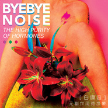

无副作用荷尔蒙
============================

|  |  |
| :--: | :-- |
| [ 无副作用荷尔蒙](https://emumo.xiami.com/album/826575426) | **艺人**: [白噪音](../index.md) **语种**: 国语 **唱片公司**: 京文唱片 **发行时间**: 2015年04月13日 **专辑类别**: 录音室专辑 **专辑风格**: 独立摇滚 Indie Rock **播放数**: 804439 **收藏数**: 1023 **评论数**: 179  |

## 简介

IIIIIIIIIIIIIIIIIIIIIIIIIIIIIIIIIIIIIIIIIIIIIIIIIIIIIIIIII 虾米音乐人·独家首发 IIIIIIIIIIIIIIIIIIIIIIIIIIIIIIIIIIIIIIIIIIIIIIIIIIIIIIIIII  
  
我经常会想 / 在这片云层下面 / 我们究竟能够做些什么<o:p>  
爱人们要吻得多用力 / 才能让温暖停留在彼此体内<o:p></o:p>  
而天台上整日望天的少年 / 又用了多少时间<o:p></o:p>  
才学会在人群中把视线集中在自己的脚面<o:p></o:p>  
如果四周的大多事物 / 都是统一而有机的<o:p></o:p>  
为何他们在跳跃 / 却面目可憎<o:p></o:p>  
你吃下和排出的 / 有多少最后由垃圾变回了食物<o:p></o:p>  
你得到和舍弃的 / 又会让自己成为小丑还是英雄<o:p></o:p>  
  
哦说到英雄 / 我想起这个评价应该早已成了玩笑<o:p></o:p>  
本来我还想为这张专辑 / 吹一个大大的牛屄<o:p></o:p>  
既然这样 / 那还是说些实话吧<o:p></o:p>  
  
你将听到的一切 / 没什么与众不同<o:p></o:p>  
只是一群普通的年轻人 / 和一些普通的牢骚冲动罢了<o:p></o:p>  
如果你不喜欢 / 尽可以对此付之一笑<o:p></o:p>  
而那些爱我们的人 / 请听我说<o:p></o:p>  
  
不要害怕<o:p></o:p>  
尤其不必 / 为自己内心的胆怯而沮丧<o:p></o:p>  
你我本孕育于黑暗<o:p></o:p>  
而悲观主义的花朵 / 最终会在黑暗中绽放<o:p></o:p>  
  
最后 / 如果你与我一样<o:p></o:p>  
对这一切并怀质疑和感激 / 那么谨以此剂特效药<o:p></o:p>  
给你我所有的 / 雄心壮志和少年心气<o:p></o:p>  
  
白噪音（Byebye Noise）成立于2012年，最初由主唱桑々、吉他双子星浩克+王伟、贝司多多组成。作为北京新生代摇滚势力中最具明星潜质的乐队，他们从北京的地下音景出发，成军三年，异军突起，身影不仅遍及各大音乐节的舞台，更已在主流电视媒体崭露头角。无论是别具匠心的音乐编排，还是台上张狂、台下低调的行事姿态，都使白噪音与如今摇滚圈一众芜杂的乐队形成了鲜明对比。也因为这种“另类”，让白噪音迅速积聚人气的同时，获得了业内人士的广泛认可。<o:p></o:p>  
  
《无副作用荷尔蒙》是白噪音乐队与独立音乐厂牌“大家一起社”合作出版的第一张录音室作品。专辑收录十首白噪音经典歌曲，既是对过往的总结，也代表着乐队向乐坛发出的正式宣言。录音、混音由前“木马”乐队元老，著名录音师曹操担纲；母带处理则邀请“The Strokes（敲击）”乐队经典唱片《Room on Fire》御用工程师Steve Fallone亲自操刀，力求还原白噪音心中最纯粹、理想的听觉体验。<o:p></o:p>  
  
白噪音《无副作用荷尔蒙》专辑的首发仪式预定于2015年4月18日在北京MAO Livehouse举行。届时将会有众多嘉宾到场助阵，并有众多京城媒体、圈内大咖云集现场。<o:p></o:p>  
</o:p>

## 曲目

## 评论

|  |  |  |  |
| :-- | :-- | :-- | :-- |
|  [虾米用户](https://emumo.xiami.com/u/11018219)  2020-05-25 19:55 赞(0) 踩(0) | 
买的CD今天到了,收藏.
 |
|  [虾米用户](https://emumo.xiami.com/u/412266127)  2019-11-28 10:22 赞(1) 踩(0) | 
爱死主唱的声音
 |
|  [虾米用户](https://emumo.xiami.com/u/43492923) 行到水穷我才开始害怕，夕... 2019-08-28 13:13 赞(0) 踩(0) | 
△
 |
|  [虾米用户](https://emumo.xiami.com/u/9154037) 到水星散心去了。 2019-05-11 10:56 赞(0) 踩(0) | 
万花筒√
 |
|  [虾米用户](https://emumo.xiami.com/u/96296322)  2019-03-18 18:14 赞(0) 踩(0) | 
.
 |
|  [虾米用户](https://emumo.xiami.com/u/42888385)  2017-09-04 22:49 赞(1) 踩(0) | 
獨家版權？網易雲有。？
 |
|  [虾米用户](https://emumo.xiami.com/u/47570236)  　⠀ 2017-07-17 14:42 赞(1) 踩(0) | 

 |
|  [虾米用户](https://emumo.xiami.com/u/8244559)  2017-07-10 13:44 赞(1) 踩(0) | 
******
 |
|  [虾米用户](https://emumo.xiami.com/u/237380722)  2017-05-16 16:20 赞(0) 踩(0) | 
made my day
 |
|  [虾米用户](https://emumo.xiami.com/u/39619021) 大家再见 2017-03-23 00:25 赞(0) 踩(0) | 
恭喜
 |
|  [虾米用户](https://emumo.xiami.com/u/5032986) Private 2016-10-12 19:40 赞(1) 踩(0) | 
我操每首都喜欢！
 |
|  [虾米用户](https://emumo.xiami.com/u/109585476)  2016-08-01 11:07 赞(0) 踩(0) | 
Nice
 |
|  [虾米用户](https://emumo.xiami.com/u/40736857) 厉害厉害厉害 2016-05-29 09:31 赞(0) 踩(0) | 
早起第一件事打开听这张专，我可能是中毒了…
 |
|  [虾米用户](https://emumo.xiami.com/u/40736857) 厉害厉害厉害 2016-05-28 13:14 赞(1) 踩(0) | 
可以听到整张专概念设计的ambition ，另主唱也太帅了吧！要看现场！！！！！！
 |
|  [虾米用户](https://emumo.xiami.com/u/48821007) 欢迎来到被控制的世界 2016-05-07 12:50 赞(0) 踩(0) | 
桑桑我爱你 
 |
|  [虾米用户](https://emumo.xiami.com/u/44274587) 健康最重要 2016-01-26 19:30 赞(1) 踩(0) | 
中国的the strokes翻版而已
 |
|  [虾米用户](https://emumo.xiami.com/u/658953) 世界核平 2016-01-05 20:37 赞(0) 踩(0) | 
短路不错
 |
|  [虾米用户](https://emumo.xiami.com/u/50906636)   2015-12-29 17:22 赞(1) 踩(0) | 
新发现，爱，主唱嗓音好邪魅，，很有调调的一支乐队 至于中英文什么的，个人觉得歌好就好
 |
|  [虾米用户](https://emumo.xiami.com/u/11540971) 只有噪音能填充世界的空洞 2015-12-03 20:51 赞(1) 踩(0) | 
当然可以听 毕竟是中国人 要支持汉化
 |
|  [虾米用户](https://emumo.xiami.com/u/11540971) 只有噪音能填充世界的空洞 2015-12-03 20:50 赞(3) 踩(0) | 
纯拿来主义 有没有让人耳目一新的东西 感觉就是敲击乐队的汉化版
 |
| ⇒ |  [虾米用户](https://emumo.xiami.com/u/6331728)  2016-02-19 16:20 赞(0) 踩(0) | 
本来很喜欢白噪音的。但是乐评里反映的这个情况太频繁了，然后去听了strokes，发现还真是如此。有点略略失望。本来还觉得主唱很帅的咧！
 |
|  [虾米用户](https://emumo.xiami.com/u/3408749)  2015-11-07 04:10 赞(2) 踩(0) | 
超strokes. 回想起来了当年的感觉 不错的乐队 加油
 |
|  [虾米用户](https://emumo.xiami.com/u/34628862) 我还没想好要写什么... 2015-10-26 11:28 赞(0) 踩(0) | 
来成都 快
 |
|  [虾米用户](https://emumo.xiami.com/u/30800139) 我在低俗与高雅间活的很尴... 2015-10-25 16:23 赞(0) 踩(0) | 
。
 |
|  [虾米用户](https://emumo.xiami.com/u/1686991)  2015-10-12 22:44 赞(2) 踩(0) | 
已经专辑循环了，无法自拔了，好期待现场 
 |
|  [虾米用户](https://emumo.xiami.com/u/1686991)  2015-10-11 20:08 赞(1) 踩(0) | 
太棒太棒
 |
|  [虾米用户](https://emumo.xiami.com/u/6784859)  2015-09-28 13:33 赞(1) 踩(0) | 
九口的封面
 |
|  [虾米用户](https://emumo.xiami.com/u/23140916) 树上的朋友你们好吗 2015-05-26 14:12 赞(1) 踩(0) | 
不能更赞了！
 |
|  [虾米用户](https://emumo.xiami.com/u/45406092)   2015-05-19 17:53 赞(1) 踩(0) | 
看过现场。主唱嗓音很有设计感。 整张专辑编曲不错 比起前的demo版好很多。未来中国明星乐队
 |
|  [虾米用户](https://emumo.xiami.com/u/3475541)  2015-05-14 20:19 赞(0) 踩(0) | 
看到说不要喷，嘴巴就忍不住要喷出翔了，虽然歌还没开始点来听····
 |
|  [虾米用户](https://emumo.xiami.com/u/7966382) Mind control... 2015-05-11 10:49 赞(1) 踩(0) | 
喜欢
 |
|  [虾米用户](https://emumo.xiami.com/u/32405529) 我还没想好要写什么... 2015-05-06 19:42 赞(1) 踩(0) | 
赞
 |
|  [虾米用户](https://emumo.xiami.com/u/43827792) 我还没想好要写什么... 2015-05-01 18:37 赞(1) 踩(0) | 
太喜欢他们的歌了.作曲编曲唱得都很赞～我倒是挺喜欢主唱的英文的～桑桑 
 |
|  [虾米用户](https://emumo.xiami.com/u/4122967) 守得云开见月明 2015-04-28 18:46 赞(0) 踩(0) | 
太棒辣!
 |
|  [虾米用户](https://emumo.xiami.com/u/49482026) seeker 2015-04-26 19:31 赞(0) 踩(0) | 
同学去听了首发发视频给我，总说主唱很帅，我说回来我甩头给你看 扯远了。听了下，什么发音，口语对我一点也不影响，还是很舒服。也不过呢，听过后没什么印象
 |
| ⇒ |  [虾米用户](https://emumo.xiami.com/u/11932346) 這個世界為什麼那麼邪惡呢 2015-04-29 12:29 赞(0) 踩(0) | 
感觉他们英语还是挺正的
 |
|  [虾米用户](https://emumo.xiami.com/u/7803101) Be young be ... 2015-04-26 00:46 赞(2) 踩(0) | 
他们没发专辑之前看过他们的现场 主唱挺棒的 一头面条头发 白衬衣  整合乐队也带感 很有好感的一支
 |
|  [虾米用户](https://emumo.xiami.com/u/6406584) 暂无签名~ 2015-04-21 20:15 赞(2) 踩(0) | 
 
 |
|  [虾米用户](https://emumo.xiami.com/u/3725853) 我还没想好要写什么... 2015-04-20 02:15 赞(0) 踩(0) | 
简单而不重复，难。没法删评论么 
 |
|  [虾米用户](https://emumo.xiami.com/u/3725853) 我还没想好要写什么... 2015-04-20 02:13 赞(1) 踩(0) | 
擦，好听啊，有味道，不单一，来感觉的音乐表达，也是好久没有的感觉了。确实良心！
 |
|  [虾米用户](https://emumo.xiami.com/u/5512375) 愿世界和平。 2015-04-19 13:37 赞(0) 踩(0) | 
听了中文觉得还是老老实实唱英文吧，良心建议
 |
|  [虾米用户](https://emumo.xiami.com/u/5512375) 愿世界和平。 2015-04-19 13:35 赞(0) 踩(0) | 
我能说这是我刷新专辑唯一听完的一个吗
 |
|  [虾米用户](https://emumo.xiami.com/u/5785874) 我爱摇滚乐 2015-04-18 05:44 赞(2) 踩(0) | 
多么希望在没有strokes,killed出现前就有了中国这支乐队，不过还是上等的乐队~
 |
|  [虾米用户](https://emumo.xiami.com/u/5785874) 我爱摇滚乐 2015-04-18 05:40 赞(0) 踩(0) | 
短路~不错
 |
|  [虾米用户](https://emumo.xiami.com/u/46728616) 呵呵哒 2015-04-16 21:08 赞(36) 踩(0) | 
If you don&amp;#039;t like them and still watch everthing they do.Bitch, You&amp;#039;re a fan.
 |
|  [虾米用户](https://emumo.xiami.com/u/36281002) 我还没想好要写什么... 2015-04-16 19:04 赞(1) 踩(0) | 
专辑里面所有的歌代入感很强，是可以跟随摇头晃脑，使整个人很开心的音乐，强烈推荐！
 |
|  [虾米用户](https://emumo.xiami.com/u/36281002) 我还没想好要写什么... 2015-04-16 18:59 赞(1) 踩(0) | 
专辑里面的所有歌都很有代入感，听完整个人都很欢乐。是可以全程跟随摇头晃脑的音乐，强烈推荐！
 |
|  [虾米用户](https://emumo.xiami.com/u/38944393) 我还没想好要写什么... 2015-04-16 18:54 赞(1) 踩(0) | 
听了好几天了，喜欢编曲 ，但是针对口音问题 ，还是很像看电影，背景音乐开启 ，光影打好，微风拂过发梢，男女主角闪亮登场，在浪漫的氛围中，男主用某地方言对女主说了句：我喜欢你 …… 就是这种感觉 。ps ，我不是喷子。
 |
|  [虾米用户](https://emumo.xiami.com/u/1600419) 我还没想好要写什么... 2015-04-16 16:21 赞(1) 踩(0) | 
非常the strokes！非常棒！！！
 |
|  [虾米用户](https://emumo.xiami.com/u/2860963) 再见啦 网易云微博豆瓣都... 2015-04-16 15:49 赞(2) 踩(0) | 
白噪音乐队挺好听的
 |
|  [虾米用户](https://emumo.xiami.com/u/155947) 一期一会 2015-04-15 21:01 赞(1) 踩(0) | 
封面能把花拿开么 = =
 |
|  [虾米用户](https://emumo.xiami.com/u/812392) q音网易搜央央小月，酷g... 2015-04-15 20:07 赞(16) 踩(0) | 
听国内乐队 喷子们有一个习惯性吐槽点 总爱抓住英文发音问题 搞得自己过了专八似的  （白眼）
 |
| ⇒ |  [虾米用户](https://emumo.xiami.com/u/34628862) 我还没想好要写什么... 2015-10-26 11:28 赞(0) 踩(0) | 
哈哈 我不敢说
 |
| ⇒ |  [虾米用户](https://emumo.xiami.com/u/9830419) 我还没想好要写什么... 2017-04-06 17:21 赞(0) 踩(0) | 
我是觉得虽然口音确实太，但是我很喜欢啊！！！就跟热斑一样，口音再菜也还是爱
 |
| ⇒ |  [虾米用户](https://emumo.xiami.com/u/38944393) 我还没想好要写什么... 2017-10-27 23:46 赞(0) 踩(0) | 
赞美的可信度要靠批评的自由度来检验，如果我们处在一个不能自由表达批评意见的环境中，那么无论赞美的声音表达的多么充分，也不能让公众信以为真 。因为真实的评价总是在一个可以自由竞争的言论环境中产生的
 |
|  [虾米用户](https://emumo.xiami.com/u/3065839)  2015-04-15 18:14 赞(0) 踩(0) | 
封面是九口的作品
 |
|  [虾米用户](https://emumo.xiami.com/u/10648358) 嘿の 2015-04-15 15:43 赞(2) 踩(0) | 
还不错，至少让我腿抖起来了
 |
|  [虾米用户](https://emumo.xiami.com/u/49228271) mina 2015-04-15 12:08 赞(1) 踩(0) | 
She&amp;#039;s living too fast
 |
|  [虾米用户](https://emumo.xiami.com/u/29480609) 且听风吟 2015-04-15 02:31 赞(1) 踩(0) | 
喜欢
 |
|  [虾米用户](https://emumo.xiami.com/u/3749658) 终会搁浅在时间长河之中~ 2015-04-14 22:46 赞(3) 踩(0) | 
不错，实力放在那，曲子好好搞会有大未来~
 |
|  [虾米用户](https://emumo.xiami.com/u/2421624) 最近都没怎么在听歌 2015-04-14 22:42 赞(0) 踩(0) | 
封面看了第二遍才看出是什么来…
 |
|  [虾米用户](https://emumo.xiami.com/u/8118222)  2015-04-14 21:33 赞(0) 踩(0) | 
封面不是九口的照片
 |
|  [虾米用户](https://emumo.xiami.com/u/8560235)  2015-04-14 19:10 赞(0) 踩(0) | 
加油。
 |
|  [虾米用户](https://emumo.xiami.com/u/36264200)   2015-04-14 13:14 赞(1) 踩(0) | 
相当不错啊，准备各种演出吧byebyeN.
 |
|  [虾米用户](https://emumo.xiami.com/u/972432) 扑热息痛 2015-04-14 10:31 赞(0) 踩(0) | 
哎，其实听起来都还不错，蛮悦耳的，但是能留下印象的不多，而且感觉每首歌区分度不明显，都差不多。
 |
|  [虾米用户](https://emumo.xiami.com/u/972432) 扑热息痛 2015-04-14 09:38 赞(1) 踩(0) | 
预测会红 
 |
| ⇒ |  [虾米用户](https://emumo.xiami.com/u/8767968) 残酷死亡金属爱好者 2015-04-14 21:16 赞(0) 踩(0) | 
填补了一个国内风格的缺失，不错
 |
|  [虾米用户](https://emumo.xiami.com/u/32750533) 暂无签名~ 2015-04-14 09:24 赞(0) 踩(0) | 
听流行 听民谣 听古典 听爵士 听蓝调 也听摇滚
 |
|  [虾米用户](https://emumo.xiami.com/u/32750533) 暂无签名~ 2015-04-14 09:06 赞(1) 踩(0) | 
其实挺不错的 听着很开心
 |
|  [虾米用户](https://emumo.xiami.com/u/8767968) 残酷死亡金属爱好者 2015-04-14 08:58 赞(0) 踩(0) | 
第六首旅人
 |
|  [虾米用户](https://emumo.xiami.com/u/3209828) 壮哉我大中风团 2015-04-14 06:56 赞(7) 踩(0) | 
对于没听过strokes的人来说。是支不错的乐队
 |
|  [虾米用户](https://emumo.xiami.com/u/8767968) 残酷死亡金属爱好者 2015-04-14 05:38 赞(28) 踩(0) | 
新专很不错，有些人还是不够成熟，上来就喷。仔细听听再说吧，首先得学会尊重
 |
|  [虾米用户](https://emumo.xiami.com/u/8133145) o my sky 2015-04-14 04:17 赞(1) 踩(0) | 
对的，不是 实验 也不是噪音。 偏向大众风。 主唱声音听起来感觉很帅可能是录音的处理关系。
 |
|  [虾米用户](https://emumo.xiami.com/u/39396418) everything s... 2015-04-14 01:31 赞(6) 踩(0) | 
看了下评论 也不用挖苦得那么过吧 发音已经甩GALA几条街了 风格很明显 但整张听下来不觉得乏味 算是良心制作了 让人 哦不 让我边听边感觉愉悦的一张专辑 如果有演出的话想买票去听听的乐队
 |
| ⇒ |  [虾米用户](https://emumo.xiami.com/u/30210522)  2015-04-14 01:35 赞(0) 踩(0) | 
我只想給你個肉贊
 |
|  [虾米用户](https://emumo.xiami.com/u/812392) q音网易搜央央小月，酷g... 2015-04-13 22:30 赞(1) 踩(0) | 
(╭￣3￣)╭snmb 起来嗨！！！新专啊！！！必须听起来！！！#午夜乐行#
 |
|  [虾米用户](https://emumo.xiami.com/u/48452445)  2015-04-13 22:04 赞(3) 踩(0) | 
不要理喷子，挺好的，加油
 |
|  [虾米用户](https://emumo.xiami.com/u/7272414) 我还没想好要写什么... 2015-04-13 20:33 赞(1) 踩(0) | 
等了好久啊
 |
|  [虾米用户](https://emumo.xiami.com/u/7272414) 我还没想好要写什么... 2015-04-13 20:28 赞(0) 踩(0) | 
终于出专辑了
 |
|  [虾米用户](https://emumo.xiami.com/u/49182297)  2015-04-13 19:50 赞(0) 踩(0) | 
fm i like
 |
|  [虾米用户](https://emumo.xiami.com/u/6891279) 我还没想好要写什么... 2015-04-13 19:19 赞(1) 踩(0) | 
万花筒唱腔就是在模仿花叔 不伦不类 用中文唱能怎样 烂发音
 |
|  [虾米用户](https://emumo.xiami.com/u/6891279) 我还没想好要写什么... 2015-04-13 19:17 赞(1) 踩(0) | 
“着陆”简直太 the killers了 无聊
 |
|  [虾米用户](https://emumo.xiami.com/u/6891279) 我还没想好要写什么... 2015-04-13 19:15 赞(0) 踩(0) | 
模仿 The Killers 和 Franz ferdinand 没别的了
 |
| ⇒ |  [虾米用户](https://emumo.xiami.com/u/30210522)  2015-04-13 23:51 赞(0) 踩(0) | 
罚你去听一万遍 the killers   不谢
 |
| ⇒ |  [虾米用户](https://emumo.xiami.com/u/6891279) 我还没想好要写什么... 2015-04-14 18:29 赞(0) 踩(0) | 
<q><b>顧京萍说：</b></q>
 |
|  [虾米用户](https://emumo.xiami.com/u/41854446) 不在意别人的目光 2015-04-13 19:11 赞(0) 踩(0) | 
我就挺喜欢有口音的英语更有味道~ 哈哈:-p
 |
|  [虾米用户](https://emumo.xiami.com/u/2610354)  2015-04-13 18:52 赞(0) 踩(0) | 
《论口齿不清对歌曲的鉴赏性的影响》
 |
|  [虾米用户](https://emumo.xiami.com/u/10294372)  2015-04-13 18:51 赞(2) 踩(0) | 
真是不错的乐队啊，就是求求主唱去报个华尔街英语或者成人夜校行不，我出钱
 |
| ⇒ |  [虾米用户](https://emumo.xiami.com/u/2610354)  2015-04-13 18:54 赞(0) 踩(0) | 
来个众筹吧，估计能筹够他们全队的学费。
 |
| ⇒ |  [虾米用户](https://emumo.xiami.com/u/7642933) 其实我们很正经！ 2015-04-13 19:04 赞(0) 踩(0) | 
<q><b>Sunght说：</b></q>
 |
| ⇒ |  [虾米用户](https://emumo.xiami.com/u/2610354)  2015-04-13 19:21 赞(0) 踩(0) | 
<q><b>白噪音说：</b></q>
 |
| ⇒ |  [虾米用户](https://emumo.xiami.com/u/30210522)  2015-04-13 23:36 赞(0) 踩(0) | 
<q><b>Sunght说：</b></q>
 |
| ⇒ |  [虾米用户](https://emumo.xiami.com/u/2610354)  2015-04-13 23:38 赞(0) 踩(0) | 
<q><b>顧京萍说：</b></q>
 |
| ⇒ |  [虾米用户](https://emumo.xiami.com/u/30210522)  2015-04-13 23:39 赞(0) 踩(0) | 
<q><b>Sunght说：</b></q>
 |
| ⇒ |  [虾米用户](https://emumo.xiami.com/u/2610354)  2015-04-14 16:29 赞(0) 踩(0) | 
<q><b>顧京萍说：</b></q>
 |
|  [虾米用户](https://emumo.xiami.com/u/13084831) 只看着你 只跟你走 2015-04-13 18:14 赞(1) 踩(0) | 
惊喜
 |
|  [虾米用户](https://emumo.xiami.com/u/1568042) 不信抬头看，苍天绕过谁 2015-04-13 18:12 赞(0) 踩(0) | 
果！断！优！秀！
 |
|  [虾米用户](https://emumo.xiami.com/u/9016175)  2015-04-13 15:15 赞(1) 踩(0) | 
高中开始听摇滚，到现在大学毕业2年了。已经很久没有新乐队让我听了会有想看他们live的冲动了。谢谢你们让我的耳朵如此享受。
 |
|  [虾米用户](https://emumo.xiami.com/u/3447324)  2015-04-13 15:04 赞(0) 踩(0) | 
1
 |
|  [虾米用户](https://emumo.xiami.com/u/9016175)  2015-04-13 14:47 赞(2) 踩(0) | 
无耻混蛋感动听哭
 |
|  [虾米用户](https://emumo.xiami.com/u/13979613) 非常规聚集地，新潮研究所 2015-04-13 14:35 赞(1) 踩(0) | 
棒！
 |
|  [虾米用户](https://emumo.xiami.com/u/35285009)  2015-04-13 14:17 赞(0) 踩(0) | 
下次全中文好不好！！中文即使咬字不准也会有萌感啊！但是！！英文发音听着好难受   
 |
| ⇒ |  [虾米用户](https://emumo.xiami.com/u/7642933) 其实我们很正经！ 2015-04-13 14:25 赞(0) 踩(0) | 
说得好有道理，竟无法反驳
 |
|  [虾米用户](https://emumo.xiami.com/u/7699197) 六天创造世界 2015-04-13 14:16 赞(0) 踩(0) | 
看混眼了，好像就是九口拍的哎
 |
|  [虾米用户](https://emumo.xiami.com/u/7699197) 六天创造世界 2015-04-13 14:10 赞(0) 踩(0) | 
这砖的封面，九口和ARAKI都拍过呀
 |
|  [虾米用户](https://emumo.xiami.com/u/49172616)  2015-04-13 14:08 赞(1) 踩(0) | 
一饮而尽不错
 |
|  [虾米用户](https://emumo.xiami.com/u/38944393) 我还没想好要写什么... 2015-04-13 14:00 赞(0) 踩(0) | 
难道现在乐队都喜欢唱英文彰显big ，我从GALA一路走来，按理说应该适应……但是谁能告诉我面对口音总情不自禁出戏该怎么治 。
 |
| ⇒ |  [虾米用户](https://emumo.xiami.com/u/7642933) 其实我们很正经！ 2015-04-13 14:02 赞(0) 踩(0) | 
吐着吐着就习惯了
 |
| ⇒ |  [虾米用户](https://emumo.xiami.com/u/38944393) 我还没想好要写什么... 2015-04-13 14:04 赞(0) 踩(0) | 
<q><b>白噪音说：</b></q>
 |
|  [虾米用户](https://emumo.xiami.com/u/15323579)   2015-04-13 13:53 赞(0) 踩(0) | 
好
 |
|  [虾米用户](https://emumo.xiami.com/u/30210522)  2015-04-13 13:21 赞(0) 踩(0) | 
哇
 |
|  [虾米用户](https://emumo.xiami.com/u/8244559)  2015-04-13 12:46 赞(1) 踩(0) | 
******
 |
|  [虾米用户](https://emumo.xiami.com/u/1277346)  2015-04-13 12:38 赞(0) 踩(0) | 
收入来跑步听
 |
|  [虾米用户](https://emumo.xiami.com/u/1277346)  2015-04-13 12:38 赞(1) 踩(0) | 
这吵闹的节奏跑步听倍儿爽！！！
 |
|  [虾米用户](https://emumo.xiami.com/u/43001619)  2015-04-13 12:12 赞(0) 踩(0) | 
从头到尾的一个吵闹的节奏，听的我心烦意乱！
 |
|  [虾米用户](https://emumo.xiami.com/u/21750084) 太空宠物乐队吉他手 2015-04-13 12:11 赞(1) 踩(0) | 
个人最喜欢 旅人和万花筒
 |
|  [虾米用户](https://emumo.xiami.com/u/27654180)  2015-04-13 11:59 赞(0) 踩(0) | 
棒棒的 有开心
 |
|  [虾米用户](https://emumo.xiami.com/u/525155) 只聽歌不社交的本站老人。 2015-04-13 11:41 赞(0) 踩(0) | 
白噪音什麼時候來台灣！
 |
|  [虾米用户](https://emumo.xiami.com/u/163208) Give No Fuck 2015-04-13 11:41 赞(2) 踩(0) | 
建议把主唱开了吧主唱之外的部分打十分
 |
| ⇒ |  [虾米用户](https://emumo.xiami.com/u/7642933) 其实我们很正经！ 2015-04-13 11:52 赞(0) 踩(0) | 
已提上日程，新主唱招募事宜正在和吴彦祖洽谈
 |
| ⇒ |  [虾米用户](https://emumo.xiami.com/u/15107919) 音乐人最希望有知音 2015-04-13 11:55 赞(0) 踩(0) | 
<q><b>白噪音说：</b></q>
 |
| ⇒ |  [虾米用户](https://emumo.xiami.com/u/2834667) 为谦虚而活，为卑微而生。 2015-04-13 11:56 赞(0) 踩(0) | 
<q><b>白噪音说：</b></q>
 |
| ⇒ |  [虾米用户](https://emumo.xiami.com/u/163208) Give No Fuck 2015-04-13 12:04 赞(0) 踩(0) | 
<q><b>白噪音说：</b></q>
 |
| ⇒ |  [虾米用户](https://emumo.xiami.com/u/13853317)  2015-04-13 13:55 赞(0) 踩(0) | 
<q><b>白噪音说：</b></q>
 |
| ⇒ |  [虾米用户](https://emumo.xiami.com/u/32652056) 从前有个人，然后他死了。 2015-04-13 16:24 赞(0) 踩(0) | 
<q><b>白噪音说：</b></q>
 |
|  [虾米用户](https://emumo.xiami.com/u/525155) 只聽歌不社交的本站老人。 2015-04-13 11:40 赞(1) 踩(0) | 
終於等到了！！！
 |
|  [虾米用户](https://emumo.xiami.com/u/9157001) 累的不像人了 2015-04-12 11:55 赞(0) 踩(0) | 
我好喜欢这封面
 |
|  [虾米用户](https://emumo.xiami.com/u/8767968) 残酷死亡金属爱好者 2015-04-10 21:54 赞(0) 踩(0) | 
不错
 |
|  [虾米用户](https://emumo.xiami.com/u/446933)  2015-04-10 20:36 赞(0) 踩(0) | 
呵呵 前奏 吐痰是学sum41吗 .....
 |
|  [虾米用户](https://emumo.xiami.com/u/8099450) 我的花让我自己开 2015-04-08 18:18 赞(0) 踩(0) | 
  
 |
|  [虾米用户](https://emumo.xiami.com/u/48998835) 只想死宅 2015-04-07 23:20 赞(0) 踩(0) | 
赞！
 |
|  [虾米用户](https://emumo.xiami.com/u/48998835) 只想死宅 2015-04-07 23:19 赞(0) 踩(0) | 
歌词棒，旋律棒！
 |
|  [虾米用户](https://emumo.xiami.com/u/16054247)  2015-04-07 23:08 赞(0) 踩(0) | 
太棒
 |
|  [虾米用户](https://emumo.xiami.com/u/32994355)  2015-04-07 22:28 赞(0) 踩(0) | 
好
 |
|  [虾米用户](https://emumo.xiami.com/u/691150)  2015-04-07 21:57 赞(0) 踩(0) | 
为啥我收藏了不显示我收藏了 我 不 服 !
 |
|  [虾米用户](https://emumo.xiami.com/u/691150)  2015-04-07 21:55 赞(0) 踩(0) | 
不错
 |
| ⇒ |  [虾米用户](https://emumo.xiami.com/u/30210522)  2015-04-07 22:47 赞(0) 踩(0) | 
如果在那首歌頁面評論更好了 愛你！！
 |
|  [虾米用户](https://emumo.xiami.com/u/15257852)  2015-04-07 20:10 赞(0) 踩(0) | 

 |
|  [虾米用户](https://emumo.xiami.com/u/30210522)  2015-04-07 01:49 赞(8) 踩(0) | 
大家請移步到狗咬狗單曲頁面評論 謝謝 愛你們喲
 |
|  [虾米用户](https://emumo.xiami.com/u/34065918)   2015-04-06 20:44 赞(6) 踩(0) | 

 |
|  [虾米用户](https://emumo.xiami.com/u/429397)  2015-04-06 13:49 赞(0) 踩(0) | 
还可以在这评论呢 
 |
|  [虾米用户](https://emumo.xiami.com/u/2208179)  2015-04-05 19:15 赞(1) 踩(0) | 
帅！好听！还要啥？！
 |
| ⇒ |  [虾米用户](https://emumo.xiami.com/u/30209826)  2015-04-07 01:47 赞(0) 踩(0) | 
在歌的那个页面评论  亲爱的。。
 |
|  [虾米用户](https://emumo.xiami.com/u/3447324)  2015-03-31 22:24 赞(0) 踩(0) | 
无副作用荷尔蒙
 |
|  [虾米用户](https://emumo.xiami.com/u/2846349)   2015-03-31 20:51 赞(0) 踩(0) | 
听歌睡觉
 |
|  [虾米用户](https://emumo.xiami.com/u/48676909)  2015-03-30 23:21 赞(0) 踩(0) | 
美
 |
|  [虾米用户](https://emumo.xiami.com/u/7783778)   2015-03-30 23:09 赞(0) 踩(0) | 
阳光下的 不一样
 |
|  [虾米用户](https://emumo.xiami.com/u/48665566)  2015-03-30 20:18 赞(0) 踩(0) | 
主场长这么帅一定五星啊
 |
|  [虾米用户](https://emumo.xiami.com/u/48665566)  2015-03-30 20:18 赞(0) 踩(0) | 
主场长这么帅一定五星啊
 |
|  [虾米用户](https://emumo.xiami.com/u/48659957)  2015-03-30 17:38 赞(0) 踩(0) | 
反正就是喜欢，干啥要原因
 |
|  [虾米用户](https://emumo.xiami.com/u/48659957)  2015-03-30 17:38 赞(0) 踩(0) | 
反正就是喜欢，干啥要原因
 |
|  [虾米用户](https://emumo.xiami.com/u/16108877)  2015-03-30 16:41 赞(0) 踩(0) | 
666
 |
|  [虾米用户](https://emumo.xiami.com/u/38621898) punk 2015-03-30 15:37 赞(1) 踩(0) | 
各位评论小主  麻烦去歌曲的那个页面评论  这个是专辑页面  不计分的 ！！！！
 |
| ⇒ |  [虾米用户](https://emumo.xiami.com/u/7642933) 其实我们很正经！ 2015-03-30 16:16 赞(0) 踩(0) | 
良心粉
 |
| ⇒ |  [虾米用户](https://emumo.xiami.com/u/38621898) punk 2015-03-30 16:19 赞(0) 踩(0) | 
<q><b>白噪音说：</b></q>
 |
|  [虾米用户](https://emumo.xiami.com/u/9093277)  2015-03-30 14:57 赞(1) 踩(0) | 
超好听！！！！
 |
|  [虾米用户](https://emumo.xiami.com/u/9093277)  2015-03-30 14:57 赞(1) 踩(0) | 
非常不错，上来听个歌真是不容易。。。
 |
|  [虾米用户](https://emumo.xiami.com/u/9093277)  2015-03-30 14:56 赞(1) 踩(0) | 
没事儿的都来听听
 |
|  [虾米用户](https://emumo.xiami.com/u/9093277)  2015-03-30 14:56 赞(1) 踩(0) | 
相当不错&amp;gt;&amp;lt;~
 |
|  [虾米用户](https://emumo.xiami.com/u/375354)  2015-03-30 14:13 赞(1) 踩(0) | 
听到一半就会上瘾 :)
 |
| ⇒ |  [虾米用户](https://emumo.xiami.com/u/48655100) 暂无签名~ 2015-03-30 14:52 赞(0) 踩(0) | 
主唱的声音很洋气，听到一半果然上瘾了
 |
|  [虾米用户](https://emumo.xiami.com/u/44981374) 暂无签名~ 2015-03-30 13:22 赞(1) 踩(0) | 
爱情无所谓  生命才可贵
 |
|  [虾米用户](https://emumo.xiami.com/u/52308) 哈 2015-03-30 12:28 赞(1) 踩(0) | 
北京的！中国的！亚洲的！世界的！银河的！太空的！宇宙的！要爆掉了！！！北京的！中国的！亚洲的！世界的！银河的！太空的！宇宙的！要爆掉了！！！北京的！中国的！亚洲的！世界的！银河的！太空的！宇宙的！要爆掉了！！！北京的！中国的！亚洲的！世界的！银河的！太空的！宇宙的！要爆掉了！！！北京的！中国的！亚洲的！世界的！银河的！太空的！宇宙的！要爆掉了！！！北京的！中国的！亚洲的！世界的！银河的！太空的！宇宙的！要爆掉了！！！北京的！中国的！亚洲的！世界的！银河的！太空的！宇宙的！要爆掉了！！！北京的！中国的！亚洲的！世界的！银河的！太空的！宇宙的！要爆掉了！！！北京的！中国的！亚洲的！世界的！银河的！
 |
| ⇒ |  [虾米用户](https://emumo.xiami.com/u/38621898) punk 2015-03-30 15:39 赞(0) 踩(0) | 
去歌曲页面评论  啊啊啊啊啊啊
 |
|  [虾米用户](https://emumo.xiami.com/u/10811234) Love Mucic 2015-03-21 23:55 赞(0) 踩(0) | 
一般
 |
|  [虾米用户](https://emumo.xiami.com/u/812392) q音网易搜央央小月，酷g... 2015-03-18 23:29 赞(0) 踩(0) | 
G  Y  G
 |
|  [虾米用户](https://emumo.xiami.com/u/47823311)  2015-03-18 20:57 赞(0) 踩(0) | 
哎呀，怎么只有一首
 |
|  [虾米用户](https://emumo.xiami.com/u/1665333)  2015-03-18 10:48 赞(0) 踩(0) | 
Punk + Youth Rock, 热血呀～
 |
|  [虾米用户](https://emumo.xiami.com/u/1568042) 不信抬头看，苍天绕过谁 2015-03-18 10:14 赞(0) 踩(0) | 
整首歌听下来我愣是没有跟上歌词
 |
| ⇒ |  [虾米用户](https://emumo.xiami.com/u/7642933) 其实我们很正经！ 2015-03-18 11:29 赞(0) 踩(0) | 
其实有颗rapper心
 |
| ⇒ |  [虾米用户](https://emumo.xiami.com/u/1568042) 不信抬头看，苍天绕过谁 2015-03-18 15:54 赞(0) 踩(0) | 
<q><b>白噪音说：</b></q>
 |
|  [虾米用户](https://emumo.xiami.com/u/8244559)  2015-03-18 09:57 赞(0) 踩(0) | 
******
 |
|  [虾米用户](https://emumo.xiami.com/u/21750084) 太空宠物乐队吉他手 2015-03-18 00:15 赞(0) 踩(0) | 
哥看好你们！
 |
| ⇒ |  [虾米用户](https://emumo.xiami.com/u/1122155)   2015-03-24 14:17 赞(0) 踩(0) | 
我也这么觉得呢
 |
|  [虾米用户](https://emumo.xiami.com/u/3835627)  2015-03-17 19:14 赞(0) 踩(0) | 
求胖子吉他手的签名专辑
 |
|  [虾米用户](https://emumo.xiami.com/u/30210522)  2015-03-17 17:08 赞(1) 踩(0) | 
真的太好聽了
 |
|  [虾米用户](https://emumo.xiami.com/u/43790349)   2015-03-17 16:44 赞(0) 踩(0) | 
来上海吧！来上海吧！！！太喜欢了！
 |
|  [虾米用户](https://emumo.xiami.com/u/671747)  2015-03-17 15:41 赞(0) 踩(0) | 
快快发新砖！
 |
|  [虾米用户](https://emumo.xiami.com/u/11132816) 撒 2015-03-17 15:07 赞(0) 踩(0) | 
骑着狗 舔着蛋
 |
